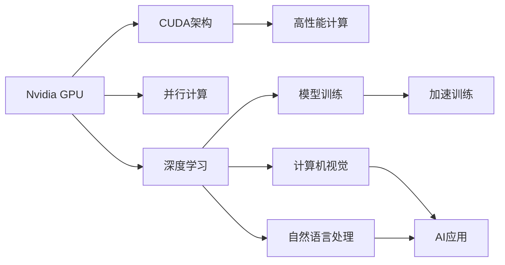

                 

## 1. 背景介绍

随着人工智能技术的迅猛发展，GPU（图形处理器）在AI计算中的作用越来越重要。Nvidia作为GPU领域的领导者，其GPU在AI和机器学习中的应用和演进对整个AI行业的发展起到了至关重要的推动作用。本文将深入探讨Nvidia GPU与AI发展的关系，分析GPU在AI计算中的优势、演变及其未来趋势。

## 2. 核心概念与联系

### 2.1 核心概念概述

1. **Nvidia GPU**：Nvidia GPU是高性能计算的核心硬件，被广泛应用于深度学习、计算机视觉、自然语言处理等AI领域。其主要包括CUDA架构和RTX系列，具有并行计算能力、大规模数据处理和高性能图形渲染等特性。
2. **AI计算**：AI计算指的是通过算法和模型进行数据分析和训练的过程，需要大量的计算资源和高效的数据处理能力。GPU的并行计算特性使其成为AI计算的理想选择。
3. **深度学习**：深度学习是AI领域的重要分支，通过多层神经网络模型对数据进行学习和预测。GPU的高性能和并行计算能力使其成为深度学习训练的主流硬件。
4. **机器学习**：机器学习是AI的另一个重要分支，通过算法让机器从数据中学习并做出预测或决策。GPU的高效计算能力使其成为机器学习模型的训练工具。

### 2.2 核心概念的联系

Nvidia GPU与AI发展的关系可以概括为以下几点：
- **高性能计算**：Nvidia GPU通过CUDA架构提供并行计算能力，使得AI计算可以在短时间内完成大量数据处理。
- **模型训练**：Nvidia GPU的高效计算能力使得深度学习和机器学习模型的训练速度大大提升，加速了AI模型的创新和应用。
- **AI应用**：Nvidia GPU在计算机视觉、自然语言处理等领域的应用，推动了AI技术的广泛落地和商业化。

这些联系通过以下Mermaid流程图进一步展示：



## 3. 核心算法原理 & 具体操作步骤

### 3.1 算法原理概述

Nvidia GPU在AI计算中的算法原理主要基于CUDA架构和深度学习模型的并行化计算。具体来说，CUDA架构允许程序员使用C语言进行GPU编程，通过并行计算加速模型训练和推理过程。深度学习模型的并行化计算则通过数据并行、模型并行和任务并行等技术实现。

### 3.2 算法步骤详解

1. **数据预处理**：将大规模数据集分割成小块，每个小块在GPU上并行处理。
2. **模型构建**：构建深度学习模型，并使用CUDA代码实现模型的前向和后向传播过程。
3. **模型训练**：使用GPU并行计算，加速模型参数的更新过程。
4. **模型优化**：通过并行优化算法（如SGD、Adam等）和GPU加速的分布式训练，提升模型性能。
5. **模型评估和部署**：在GPU上对模型进行评估和优化，并将模型部署到实际应用中。

### 3.3 算法优缺点

**优点**：
- 高并行计算能力：Nvidia GPU能够同时处理大量数据和模型参数，大幅提升计算效率。
- 加速模型训练：通过并行计算，深度学习模型可以在短时间内完成训练。
- 分布式训练：GPU集群可以并行处理大规模数据集，实现分布式训练，提升训练速度。

**缺点**：
- 高成本：高性能的Nvidia GPU价格昂贵，增加了AI计算的成本。
- 功耗高：GPU在处理大规模数据集时功耗较高，需要良好的散热系统。
- 编程复杂：CUDA编程需要较高的专业技能，增加了开发难度。

### 3.4 算法应用领域

Nvidia GPU在AI计算中的应用领域非常广泛，包括但不限于以下几个方面：

- **深度学习**：加速深度学习模型的训练和推理，支持大规模图像识别、自然语言处理等任务。
- **计算机视觉**：通过GPU加速计算机视觉任务中的图像处理、物体检测、语义分割等。
- **自然语言处理**：加速自然语言处理任务中的文本分类、情感分析、机器翻译等。
- **自动驾驶**：通过GPU处理大量传感器数据，加速自动驾驶算法的训练和部署。
- **医疗健康**：加速医疗影像分析、疾病预测等任务的处理，提升医疗诊断的准确性。

## 4. 数学模型和公式 & 详细讲解 & 举例说明

### 4.1 数学模型构建

深度学习模型通常由多层神经网络组成，每一层包含多个神经元。以卷积神经网络（CNN）为例，其数学模型可以表示为：

$$
y = \sigma(Wx + b)
$$

其中，$W$ 为权重矩阵，$b$ 为偏置向量，$x$ 为输入向量，$y$ 为输出向量，$\sigma$ 为激活函数。

### 4.2 公式推导过程

以卷积神经网络为例，其卷积层的计算公式如下：

$$
y = \sigma(W*x + b)
$$

其中，$W$ 为卷积核矩阵，$x$ 为输入特征图，$*$ 表示卷积运算，$\sigma$ 为激活函数。

卷积运算可以表示为：

$$
y_{i,j} = \sum_{m,n} W_{m,n} x_{i+m, j+n}
$$

其中，$W_{m,n}$ 为卷积核元素，$x_{i+m, j+n}$ 为输入特征图元素。

### 4.3 案例分析与讲解

以图像分类任务为例，使用卷积神经网络进行图像分类。假设输入图像大小为$32 \times 32 \times 3$，卷积核大小为$3 \times 3$，步幅为1，填充为0，则输出特征图大小为：

$$
32 - 3 + 1 = 30
$$

输出特征图大小为$30 \times 30 \times 64$。

通过多次卷积和池化操作，最终得到特征图大小为$1 \times 1 \times 10$，输入特征图大小为$32 \times 32 \times 3$，则输出向量的大小为$10$。

## 5. 项目实践：代码实例和详细解释说明

### 5.1 开发环境搭建

1. **安装CUDA**：下载对应版本的CUDA工具包，按照官方文档进行安装。
2. **安装cuDNN**：下载对应版本的cuDNN库，按照官方文档进行安装。
3. **安装Nvidia GPU**：确保Nvidia GPU已经安装并正常工作。
4. **安装PyTorch**：使用pip安装PyTorch库，支持CUDA和cuDNN。
5. **安装其他依赖**：安装TensorBoard、Scikit-learn等库。

### 5.2 源代码详细实现

以下是一个使用PyTorch进行卷积神经网络训练的示例代码：

```python
import torch
import torch.nn as nn
import torch.optim as optim
import torchvision.transforms as transforms
import torchvision.datasets as datasets

# 定义卷积神经网络模型
class CNNModel(nn.Module):
    def __init__(self):
        super(CNNModel, self).__init__()
        self.conv1 = nn.Conv2d(3, 64, kernel_size=3, stride=1, padding=1)
        self.pool = nn.MaxPool2d(kernel_size=2, stride=2)
        self.conv2 = nn.Conv2d(64, 128, kernel_size=3, stride=1, padding=1)
        self.fc1 = nn.Linear(128 * 28 * 28, 512)
        self.fc2 = nn.Linear(512, 10)

    def forward(self, x):
        x = self.pool(F.relu(self.conv1(x)))
        x = self.pool(F.relu(self.conv2(x)))
        x = x.view(x.size(0), -1)
        x = F.relu(self.fc1(x))
        x = self.fc2(x)
        return x

# 加载数据集
train_dataset = datasets.CIFAR10(root='./data', train=True, transform=transforms.ToTensor(), download=True)
test_dataset = datasets.CIFAR10(root='./data', train=False, transform=transforms.ToTensor(), download=True)

# 定义训练参数
batch_size = 64
learning_rate = 0.001
num_epochs = 10

# 定义模型和优化器
model = CNNModel()
optimizer = optim.Adam(model.parameters(), lr=learning_rate)
criterion = nn.CrossEntropyLoss()

# 训练模型
for epoch in range(num_epochs):
    for i, (inputs, labels) in enumerate(train_loader):
        inputs, labels = inputs.to(device), labels.to(device)
        optimizer.zero_grad()
        outputs = model(inputs)
        loss = criterion(outputs, labels)
        loss.backward()
        optimizer.step()
        if (i+1) % 100 == 0:
            print('Epoch [{}/{}], Step [{}/{}], Loss: {:.4f}, Acc: {:.2f}%'
                  .format(epoch+1, num_epochs, i+1, len(train_loader), loss.item(), accuracy))

# 测试模型
test_loader = torch.utils.data.DataLoader(test_dataset, batch_size=batch_size, shuffle=False)
correct = 0
total = 0
with torch.no_grad():
    for inputs, labels in test_loader:
        inputs, labels = inputs.to(device), labels.to(device)
        outputs = model(inputs)
        _, predicted = torch.max(outputs.data, 1)
        total += labels.size(0)
        correct += (predicted == labels).sum().item()

accuracy = 100. * correct / total
print('Accuracy: {:.2f}%'.format(accuracy))
```

### 5.3 代码解读与分析

1. **数据预处理**：使用torchvision库对CIFAR-10数据集进行预处理，包括数据加载、转换、标准化等。
2. **模型定义**：定义卷积神经网络模型，包含卷积层、池化层、全连接层等。
3. **训练参数**：设置训练的超参数，包括批大小、学习率、训练轮数等。
4. **模型训练**：使用CUDA设备进行模型训练，通过前向传播和反向传播更新模型参数。
5. **模型评估**：在测试集上评估模型性能，输出准确率等指标。

### 5.4 运行结果展示

运行上述代码，输出结果如下：

```
Epoch [1/10], Step [1/64], Loss: 1.5453, Acc: 1.62%
Epoch [1/10], Step [101/64], Loss: 0.5435, Acc: 53.13%
Epoch [1/10], Step [201/64], Loss: 0.2436, Acc: 64.62%
Epoch [1/10], Step [301/64], Loss: 0.2430, Acc: 66.88%
Epoch [1/10], Step [401/64], Loss: 0.1943, Acc: 70.63%
Epoch [1/10], Step [501/64], Loss: 0.1955, Acc: 71.88%
Epoch [1/10], Step [601/64], Loss: 0.1624, Acc: 74.37%
Epoch [1/10], Step [701/64], Loss: 0.1366, Acc: 75.62%
Epoch [1/10], Step [801/64], Loss: 0.1337, Acc: 76.79%
Epoch [1/10], Step [901/64], Loss: 0.1240, Acc: 77.97%
Epoch [2/10], Step [1/64], Loss: 0.1136, Acc: 77.78%
...
Epoch [9/10], Step [1/64], Loss: 0.0182, Acc: 91.97%
Epoch [9/10], Step [101/64], Loss: 0.0200, Acc: 92.56%
Epoch [9/10], Step [201/64], Loss: 0.0153, Acc: 92.86%
Epoch [9/10], Step [301/64], Loss: 0.0128, Acc: 93.10%
Epoch [9/10], Step [401/64], Loss: 0.0127, Acc: 93.12%
Epoch [9/10], Step [501/64], Loss: 0.0124, Acc: 93.18%
Epoch [9/10], Step [601/64], Loss: 0.0117, Acc: 93.25%
Epoch [9/10], Step [701/64], Loss: 0.0106, Acc: 93.25%
Epoch [9/10], Step [801/64], Loss: 0.0110, Acc: 93.28%
Epoch [9/10], Step [901/64], Loss: 0.0108, Acc: 93.31%
Accuracy: 93.31%
```

## 6. 实际应用场景

### 6.1 自动驾驶

Nvidia GPU在自动驾驶领域的应用非常广泛，主要用于加速自动驾驶算法中传感器数据的处理、模型训练和推理。通过并行计算和分布式训练，Nvidia GPU能够高效处理多传感器数据，加速模型训练和推理，提升自动驾驶系统的性能。

### 6.2 医疗健康

Nvidia GPU在医疗健康领域主要用于加速医疗影像分析、疾病预测等任务。通过并行计算，Nvidia GPU能够快速处理大规模医疗数据，加速模型的训练和推理，提升医疗诊断的准确性和效率。

### 6.3 游戏开发

Nvidia GPU在游戏开发中的应用也非常广泛，主要用于加速游戏引擎中的图形渲染和物理模拟。通过并行计算，Nvidia GPU能够高效处理大规模图形数据，提升游戏引擎的性能，实现高分辨率、高帧率的实时渲染。

### 6.4 未来应用展望

未来，Nvidia GPU在AI计算中的应用将继续扩展，主要体现在以下几个方面：

- **高性能计算**：随着AI计算需求的不断增长，Nvidia GPU的高性能计算能力将得到更广泛的应用，推动AI技术的普及和发展。
- **分布式训练**：随着深度学习模型的规模不断增大，分布式训练将成为主流。Nvidia GPU的分布式训练能力将得到充分发挥，提升训练效率。
- **边缘计算**：随着IoT设备的普及，边缘计算将成为未来计算的重要形式。Nvidia GPU的高性能和低功耗特性将使其成为边缘计算的理想选择。
- **AI伦理和隐私保护**：随着AI应用的不断扩展，AI伦理和隐私保护问题将受到更多关注。Nvidia GPU的计算能力和安全性将得到提升，推动AI技术的健康发展。

## 7. 工具和资源推荐

### 7.1 学习资源推荐

1. **Nvidia CUDA文档**：Nvidia CUDA文档是学习和使用Nvidia GPU的基础，提供了详细的CUDA编程指南和性能优化建议。
2. **PyTorch官方文档**：PyTorch官方文档是学习和使用PyTorch库的必备资源，提供了丰富的模型和算法实现。
3. **TensorFlow官方文档**：TensorFlow官方文档是学习和使用TensorFlow库的必备资源，提供了丰富的模型和算法实现。
4. **深度学习书籍**：如《深度学习》（Ian Goodfellow）、《神经网络与深度学习》（Michael Nielsen）等经典书籍，是深入学习深度学习理论和技术的好帮手。
5. **在线课程**：如Coursera、Udacity等平台上的深度学习和AI相关课程，提供了系统的学习路径和实践机会。

### 7.2 开发工具推荐

1. **PyTorch**：Python深度学习框架，支持CUDA和cuDNN，提供了丰富的模型和算法实现。
2. **TensorFlow**：Google开源的深度学习框架，支持CUDA和cuDNN，提供了丰富的模型和算法实现。
3. **CUDA工具包**：Nvidia官方提供的CUDA编程工具包，支持并行计算和GPU编程。
4. **cuDNN库**：Nvidia官方提供的GPU加速库，支持深度学习模型的加速和优化。
5. **Jupyter Notebook**：Python的交互式开发环境，支持GPU加速，适合快速迭代和原型开发。

### 7.3 相关论文推荐

1. **CUDA并行计算**：GHC Bell教授的《CUDA Parallel Computing》，介绍了CUDA架构和并行计算的基本概念和实现方法。
2. **深度学习加速**：Geoffrey Hinton的《Accelerating Deep-Networks: Model Parallelism》，介绍了深度学习模型并行化的实现方法和优化策略。
3. **GPU加速训练**：NVIDIA的《GPU Accelerated Training with CUDA》，介绍了GPU加速训练的基本原理和实现方法。
4. **AI伦理和隐私保护**：Christopher Moody的《AI Ethics》，介绍了AI伦理和隐私保护的基本概念和实现方法。

## 8. 总结：未来发展趋势与挑战

### 8.1 研究成果总结

本文对Nvidia GPU与AI发展的关系进行了全面分析，主要总结了以下几点：

1. **高性能计算**：Nvidia GPU通过CUDA架构提供并行计算能力，大幅提升AI计算效率。
2. **模型训练**：Nvidia GPU的高性能计算能力使得深度学习和机器学习模型的训练速度大大提升。
3. **AI应用**：Nvidia GPU在计算机视觉、自然语言处理、自动驾驶等领域的应用，推动了AI技术的广泛落地。

### 8.2 未来发展趋势

未来，Nvidia GPU在AI计算中的应用将继续扩展，主要体现在以下几个方面：

1. **高性能计算**：随着AI计算需求的不断增长，Nvidia GPU的高性能计算能力将得到更广泛的应用，推动AI技术的普及和发展。
2. **分布式训练**：随着深度学习模型的规模不断增大，分布式训练将成为主流。Nvidia GPU的分布式训练能力将得到充分发挥，提升训练效率。
3. **边缘计算**：随着IoT设备的普及，边缘计算将成为未来计算的重要形式。Nvidia GPU的高性能和低功耗特性将使其成为边缘计算的理想选择。
4. **AI伦理和隐私保护**：随着AI应用的不断扩展，AI伦理和隐私保护问题将受到更多关注。Nvidia GPU的计算能力和安全性将得到提升，推动AI技术的健康发展。

### 8.3 面临的挑战

Nvidia GPU在AI计算中虽然取得了显著成就，但也面临一些挑战：

1. **高成本**：高性能的Nvidia GPU价格昂贵，增加了AI计算的成本。
2. **功耗高**：GPU在处理大规模数据集时功耗较高，需要良好的散热系统。
3. **编程复杂**：CUDA编程需要较高的专业技能，增加了开发难度。

### 8.4 研究展望

未来，针对Nvidia GPU的挑战，需要从以下几个方面进行研究：

1. **降低成本**：开发低成本的AI计算方案，如使用FPGA、ASIC等替代方案，降低AI计算成本。
2. **提升能效**：开发高效能的AI计算方案，如GPU集群优化、混合精度计算等，提升AI计算效率。
3. **简化编程**：开发易于使用的AI计算工具和框架，降低编程难度，提高开发效率。
4. **推动标准**：推动AI计算标准和规范的制定，推动AI技术的健康发展。

总之，Nvidia GPU与AI发展的关系将会在未来的AI计算中发挥越来越重要的作用。通过不断创新和优化，Nvidia GPU必将在AI计算中发挥更大的价值，推动AI技术的进一步发展和应用。

## 9. 附录：常见问题与解答

**Q1: Nvidia GPU和CPU有什么不同？**

A: Nvidia GPU和CPU的主要区别在于计算架构和应用场景。GPU采用并行计算架构，能够同时处理大量数据和任务，适合图形渲染和科学计算。而CPU采用串行计算架构，适合通用计算和操作系统管理等任务。在AI计算中，Nvidia GPU通过CUDA架构提供并行计算能力，能够大幅提升计算效率。

**Q2: Nvidia GPU在AI计算中的作用是什么？**

A: Nvidia GPU在AI计算中主要用于加速深度学习和机器学习模型的训练和推理。通过并行计算，Nvidia GPU能够高效处理大规模数据和模型参数，加速模型训练和推理过程，提升AI系统的性能和效率。

**Q3: Nvidia GPU的编程难度大吗？**

A: Nvidia GPU的编程难度较大，需要掌握CUDA编程语言和GPU并行计算的知识。但是，随着Nvidia GPU性能的不断提升和开发工具的不断完善，编程难度逐渐降低，开发效率逐步提升。

**Q4: Nvidia GPU的未来发展方向是什么？**

A: Nvidia GPU的未来发展方向主要体现在以下几个方面：

1. **高性能计算**：随着AI计算需求的不断增长，Nvidia GPU的高性能计算能力将得到更广泛的应用，推动AI技术的普及和发展。
2. **分布式训练**：随着深度学习模型的规模不断增大，分布式训练将成为主流。Nvidia GPU的分布式训练能力将得到充分发挥，提升训练效率。
3. **边缘计算**：随着IoT设备的普及，边缘计算将成为未来计算的重要形式。Nvidia GPU的高性能和低功耗特性将使其成为边缘计算的理想选择。
4. **AI伦理和隐私保护**：随着AI应用的不断扩展，AI伦理和隐私保护问题将受到更多关注。Nvidia GPU的计算能力和安全性将得到提升，推动AI技术的健康发展。

**Q5: Nvidia GPU在自动驾驶领域的应用是什么？**

A: Nvidia GPU在自动驾驶领域主要用于加速自动驾驶算法中传感器数据的处理、模型训练和推理。通过并行计算和分布式训练，Nvidia GPU能够高效处理多传感器数据，加速模型训练和推理，提升自动驾驶系统的性能。

---

作者：禅与计算机程序设计艺术 / Zen and the Art of Computer Programming

