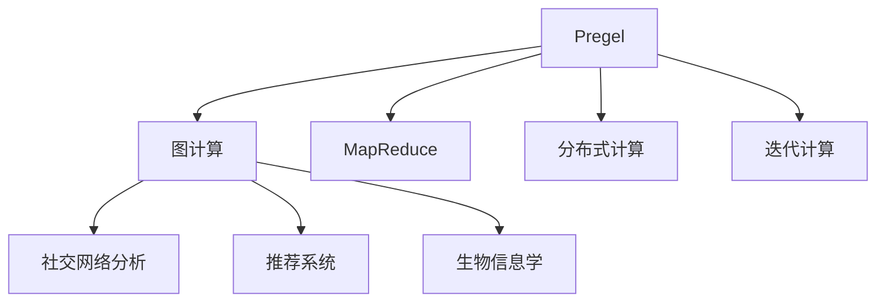
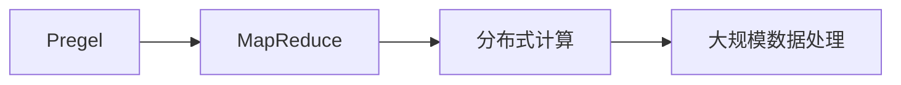
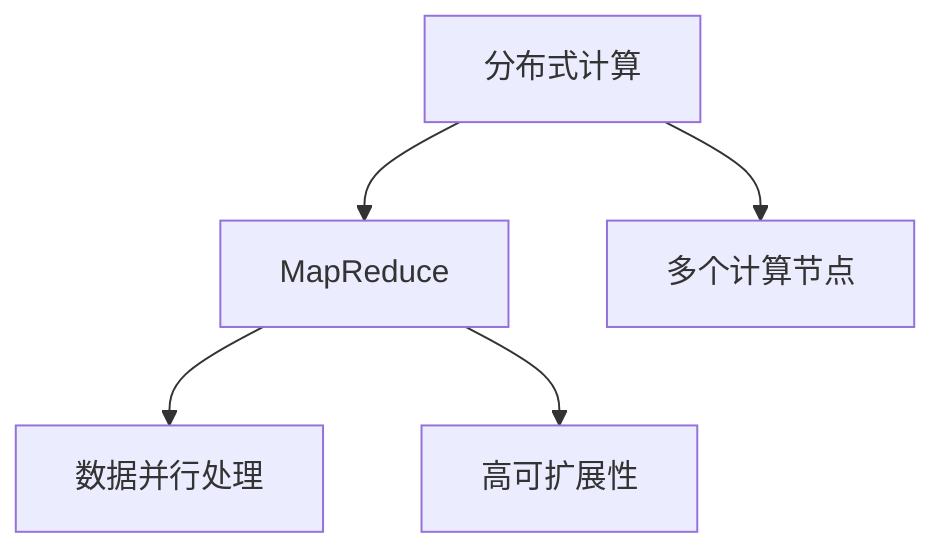
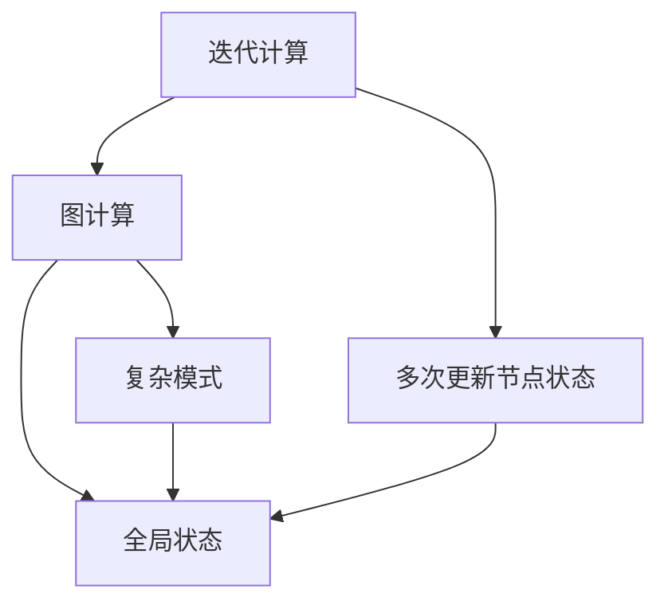
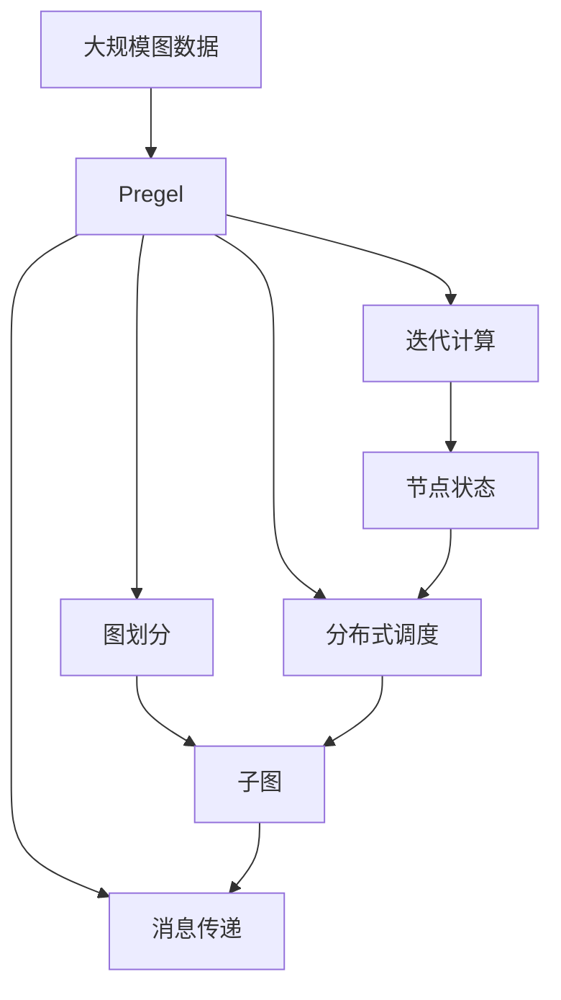

                 

# Pregel图计算模型原理与代码实例讲解

> 关键词：Pregel, 图计算, 分布式计算, 迭代计算, MapReduce, 超级计算机

## 1. 背景介绍

### 1.1 问题由来
图计算（Graph Computing）是近年来随着大数据和网络计算的兴起而逐渐流行起来的一种计算范式。与传统的基于“关系”或“属性”的计算方法不同，图计算侧重于通过网络或关系模型来分析和挖掘数据中的隐含关系。图计算在社交网络分析、推荐系统、生物信息学等领域具有广泛的应用前景，尤其在发现数据中的潜在的复杂模式和关系方面表现出独特的优势。

然而，传统的图计算方法通常需要大量的内存和计算资源，尤其是在处理大规模图数据时，单个节点的计算能力无法满足需求。此外，由于图的结构复杂性，分布式图计算也面临诸多挑战。

为应对这些挑战，Google于2006年提出了Pregel模型，这是一种基于迭代计算的分布式计算框架，能够高效地处理大规模图数据。Pregel模型基于Google的MapReduce计算框架，但更适用于处理图数据，具有更好的可扩展性和灵活性。Pregel的提出为大规模分布式图计算提供了新的思路和方法，被广泛应用于多种图计算任务中。

### 1.2 问题核心关键点
Pregel模型的核心思想是将大规模图数据划分为多个子图，然后通过迭代计算，逐步更新节点的状态，最终得到整个图的全局状态。Pregel模型的优势在于其高效性和可扩展性，能够利用多个节点并行处理图数据，适用于大规模图计算任务。

Pregel模型的关键技术点包括：

- 图划分：将大规模图数据划分为多个子图，每个子图由单个节点处理。
- 消息传递：节点间通过消息传递进行通信，更新状态。
- 迭代计算：通过多次迭代计算，逐步更新节点状态。
- 分布式调度：根据节点状态更新情况，动态调整计算任务。

Pregel模型的设计理念和高效算法，使其能够利用分布式计算资源，高效地处理大规模图数据，显著提升了图计算的性能和可扩展性。

### 1.3 问题研究意义
Pregel模型的研究意义主要体现在以下几个方面：

- 提供了一种高效的大规模图计算解决方案，适用于各种图计算任务，如社交网络分析、推荐系统、生物信息学等。
- 通过迭代计算和分布式调度，能够高效利用计算资源，处理大规模图数据，加速图计算任务的完成。
- 结合MapReduce的优点，适用于各种数据类型，能够灵活地处理不同类型的图数据。
- 提供了丰富的API和工具，降低了分布式图计算的开发门槛，促进了图计算技术在各领域的广泛应用。

## 2. 核心概念与联系

### 2.1 核心概念概述

为更好地理解Pregel模型，本节将介绍几个密切相关的核心概念：

- Pregel模型：基于迭代计算的分布式图计算框架，由Google于2006年提出。能够高效处理大规模图数据，具有可扩展性和灵活性。
- 图计算：通过网络或关系模型来分析和挖掘数据中的隐含关系，具有广泛的应用场景，如社交网络分析、推荐系统、生物信息学等。
- MapReduce：一种分布式计算框架，由Google于2004年提出，广泛应用于各种大规模数据处理任务。
- 分布式计算：利用多个计算节点并行处理大规模数据，提高计算效率和可扩展性。
- 迭代计算：通过多次迭代计算，逐步更新节点状态，最终得到整个图的全局状态。

这些核心概念之间的逻辑关系可以通过以下Mermaid流程图来展示：



这个流程图展示了大规模图计算的核心概念及其之间的关系：

1. Pregel模型是基于MapReduce的分布式计算框架，应用于图计算任务。
2. 图计算是利用网络或关系模型来分析和挖掘数据中的隐含关系，具有广泛的应用场景。
3. MapReduce是一种分布式计算框架，能够高效处理大规模数据。
4. 分布式计算是利用多个计算节点并行处理大规模数据，提高计算效率和可扩展性。
5. 迭代计算是通过多次迭代计算，逐步更新节点状态，最终得到整个图的全局状态。

### 2.2 概念间的关系

这些核心概念之间存在着紧密的联系，形成了Pregel模型的工作框架。下面通过几个Mermaid流程图来展示这些概念之间的关系。

#### 2.2.1 Pregel模型与MapReduce的关系



这个流程图展示了Pregel模型和MapReduce之间的关系。Pregel模型是基于MapReduce的分布式计算框架，具有与MapReduce类似的分布式计算能力，但更适用于图数据处理。

#### 2.2.2 分布式计算与MapReduce的关系



这个流程图展示了分布式计算和MapReduce之间的关系。MapReduce是分布式计算的一种实现方式，能够高效处理大规模数据，具有高可扩展性和灵活性。

#### 2.2.3 迭代计算与图计算的关系



这个流程图展示了迭代计算和图计算之间的关系。迭代计算是图计算的一种重要方法，通过多次更新节点状态，逐步得到整个图的全局状态，能够发现复杂的模式和关系。

### 2.3 核心概念的整体架构

最后，我们用一个综合的流程图来展示这些核心概念在Pregel模型中的整体架构：



这个综合流程图展示了从大规模图数据到Pregel模型的整体处理流程。Pregel模型首先对大规模图数据进行划分，生成多个子图，然后通过消息传递进行迭代计算，逐步更新节点状态，最终得到整个图的全局状态。

## 3. 核心算法原理 & 具体操作步骤
### 3.1 算法原理概述

Pregel模型的核心算法基于迭代计算，通过多次更新节点状态，逐步得到整个图的全局状态。算法的基本流程如下：

1. 图划分：将大规模图数据划分为多个子图，每个子图由单个节点处理。
2. 消息传递：节点间通过消息传递进行通信，更新状态。
3. 迭代计算：通过多次迭代计算，逐步更新节点状态。
4. 分布式调度：根据节点状态更新情况，动态调整计算任务。

具体来说，Pregel模型通过定义“迭代”和“边”来描述节点间的消息传递。在每次迭代中，每个节点根据接收到的消息计算并更新自己的状态，然后将新状态传递给相关节点。通过多次迭代，逐步得到整个图的全局状态。

### 3.2 算法步骤详解

Pregel模型的算法步骤可以分为以下几个关键步骤：

**Step 1: 图划分**

在图计算任务开始前，首先需要将大规模图数据进行划分，生成多个子图。图划分的目的是将大规模图数据合理地分配到多个节点上进行并行处理，从而提高计算效率。

具体实现上，Pregel模型提供了一个图划分的API，用于指定图数据划分的方式和规则。用户可以根据需要，定义自己的图划分策略，如按照节点数、边数、超节点等进行划分。

**Step 2: 消息传递**

在每次迭代中，节点间通过消息传递进行通信，更新状态。消息传递是Pregel模型的核心技术之一，通过消息传递，节点能够获得最新的状态信息，并进行相应的计算和更新。

消息传递的基本流程如下：

1. 节点接收消息：在每次迭代开始时，节点根据定义好的消息接收函数，接收来自其他节点的消息。
2. 处理消息：节点对接收到的消息进行处理，根据消息内容计算并更新自己的状态。
3. 发送消息：节点将新的状态传递给相关节点，更新消息队列。

Pregel模型支持多种消息传递方式，包括P2P消息传递、广播消息传递、洪泛消息传递等。用户可以根据具体需求选择合适的消息传递方式，灵活地设计消息传递策略。

**Step 3: 迭代计算**

通过多次迭代计算，逐步更新节点状态，最终得到整个图的全局状态。迭代计算是Pregel模型的核心技术之一，通过多次迭代，逐步逼近全局最优解。

具体实现上，Pregel模型提供了一个迭代计算的API，用于指定迭代次数和迭代终止条件。用户可以根据具体需求，定义自己的迭代计算策略，如设定最大迭代次数、设定迭代终止条件等。

**Step 4: 分布式调度**

根据节点状态更新情况，动态调整计算任务，优化计算效率。分布式调度是Pregel模型的重要技术之一，通过动态调整计算任务，能够合理利用计算资源，提高计算效率。

具体实现上，Pregel模型提供了一个分布式调度的API，用于指定任务调度的策略和规则。用户可以根据具体需求，定义自己的任务调度策略，如任务优先级、任务资源需求、任务依赖关系等。

### 3.3 算法优缺点

Pregel模型的优势在于其高效性和可扩展性，能够高效利用计算资源，处理大规模图数据。具体来说，Pregel模型的优点包括：

- 高效性：通过迭代计算和分布式调度，能够高效利用计算资源，处理大规模图数据。
- 可扩展性：通过分布式计算，能够处理大规模图数据，具有良好的可扩展性。
- 灵活性：通过API接口，用户可以灵活地定义图划分、消息传递、迭代计算和分布式调度策略，满足不同图计算任务的需求。
- 通用性：基于MapReduce的分布式计算框架，能够处理各种数据类型，具有通用性。

Pregel模型的缺点在于其复杂性较高，开发和维护难度较大。具体来说，Pregel模型的缺点包括：

- 复杂性：Pregel模型的实现较为复杂，需要用户掌握分布式计算和图计算的原理和实现方法。
- 开发难度：开发Pregel模型的程序需要较多的时间和精力，开发难度较大。
- 调优难度：Pregel模型的调优较为困难，需要用户具备较高的分布式计算和图计算经验。

### 3.4 算法应用领域

Pregel模型的应用领域非常广泛，适用于各种大规模图计算任务，如社交网络分析、推荐系统、生物信息学等。具体来说，Pregel模型在以下几个领域具有重要的应用前景：

1. 社交网络分析：通过分析社交网络中的人际关系和信息流动，发现网络中的关键节点和潜在威胁，提高网络安全性和可靠性。
2. 推荐系统：通过分析用户的行为和兴趣，推荐个性化的商品和服务，提高用户体验和满意度。
3. 生物信息学：通过分析生物网络中分子间的相互作用关系，发现新药物和新靶点，推动新药研发和疾病治疗。
4. 金融分析：通过分析金融网络中的交易关系和风险传递，发现潜在的金融风险和机会，提高投资收益和风险控制能力。
5. 互联网广告：通过分析互联网用户的行为和偏好，推荐个性化的广告内容，提高广告效果和用户满意度。

## 4. 数学模型和公式 & 详细讲解  
### 4.1 数学模型构建

Pregel模型的数学模型可以抽象为一个图G(V,E)，其中V表示节点集合，E表示边集合。在每次迭代中，每个节点根据接收到的消息计算并更新自己的状态，然后将新状态传递给相关节点。

假设节点i在t时刻的状态为$S_i(t)$，接收到的消息集合为$M_i(t)$，则节点i在t+1时刻的状态更新公式为：

$$
S_i(t+1) = f_i(S_i(t),M_i(t))
$$

其中$f_i$表示节点i的计算函数，$M_i(t)$表示节点i接收到的消息集合。节点i将新的状态$S_i(t+1)$传递给相关节点，更新消息队列，继续进行下一轮迭代计算。

通过多次迭代计算，逐步更新节点状态，最终得到整个图的全局状态。Pregel模型的迭代过程可以用以下伪代码表示：

```
for t=0 to max_iterations do
    for each node i in V do
        M_i(t) = receive_messages(t)
        S_i(t+1) = f_i(S_i(t),M_i(t))
        send_messages(t+1,i)
```

### 4.2 公式推导过程

以下我们以社交网络分析中的PageRank算法为例，推导Pregel模型的公式推导过程。

假设社交网络中的节点表示用户，边表示用户之间的关注关系。PageRank算法的目标是对每个节点进行打分，计算其在网络中的重要程度。PageRank算法的基本公式为：

$$
\mathbf{P}_{t+1} = \alpha \mathbf{A}\mathbf{P}_t + (1-\alpha)\frac{1}{n}\mathbf{1}
$$

其中$\mathbf{P}_t$表示节点在t时刻的打分，$\mathbf{A}$表示节点间的关注关系矩阵，$\alpha$表示衰减因子，$\mathbf{1}$表示全1向量。

将PageRank算法转化为Pregel模型，需要进行以下步骤：

1. 图划分：将社交网络中的用户划分为多个子图，每个子图由单个节点处理。
2. 消息传递：节点间通过消息传递进行通信，更新状态。
3. 迭代计算：通过多次迭代计算，逐步更新节点状态。
4. 分布式调度：根据节点状态更新情况，动态调整计算任务。

具体实现上，Pregel模型的实现方式为：

1. 节点接收消息：在每次迭代开始时，节点根据定义好的消息接收函数，接收来自其他节点的消息。
2. 处理消息：节点对接收到的消息进行处理，根据消息内容计算并更新自己的状态。
3. 发送消息：节点将新的状态传递给相关节点，更新消息队列。

### 4.3 案例分析与讲解

下面我们以社交网络分析中的PageRank算法为例，具体讲解Pregel模型的实现方式。

假设社交网络中的节点表示用户，边表示用户之间的关注关系。PageRank算法的目标是对每个节点进行打分，计算其在网络中的重要程度。PageRank算法的基本公式为：

$$
\mathbf{P}_{t+1} = \alpha \mathbf{A}\mathbf{P}_t + (1-\alpha)\frac{1}{n}\mathbf{1}
$$

其中$\mathbf{P}_t$表示节点在t时刻的打分，$\mathbf{A}$表示节点间的关注关系矩阵，$\alpha$表示衰减因子，$\mathbf{1}$表示全1向量。

将PageRank算法转化为Pregel模型，需要进行以下步骤：

1. 图划分：将社交网络中的用户划分为多个子图，每个子图由单个节点处理。
2. 消息传递：节点间通过消息传递进行通信，更新状态。
3. 迭代计算：通过多次迭代计算，逐步更新节点状态。
4. 分布式调度：根据节点状态更新情况，动态调整计算任务。

具体实现上，Pregel模型的实现方式为：

1. 节点接收消息：在每次迭代开始时，节点根据定义好的消息接收函数，接收来自其他节点的消息。
2. 处理消息：节点对接收到的消息进行处理，根据消息内容计算并更新自己的状态。
3. 发送消息：节点将新的状态传递给相关节点，更新消息队列。

下面是一个PageRank算法的Pregel实现示例代码：

```python
class PageRankVertex:
    def __init__(self, id):
        self.id = id
        self.incoming_count = 0
        self.incoming_score = 0

    def process_messages(self, messages):
        for message in messages:
            self.incoming_count += 1
            self.incoming_score += message.score

        self.score = (self.incoming_score + (1 - alpha) / n) / self.incoming_count

    def send_messages(self):
        for user in self.outgoing_users:
            message = Message(user, self.score)
            self.send(user, message)

class PageRankEdge:
    def __init__(self, source, target):
        self.source = source
        self.target = target

class Message:
    def __init__(self, source, score):
        self.source = source
        self.score = score

def main():
    n = 10000
    alpha = 0.85
    n = 10000

    # 初始化节点和边
    vertices = [PageRankVertex(i) for i in range(n)]
    edges = [PageRankEdge(i, (i+1) % n) for i in range(n)]

    # 运行PageRank算法
    for t in range(max_iterations):
        # 节点接收消息
        for vertex in vertices:
            vertex.receive_messages()

        # 节点处理消息
        for vertex in vertices:
            vertex.process_messages()

        # 节点发送消息
        for vertex in vertices:
            vertex.send_messages()

        # 节点更新状态
        for vertex in vertices:
            vertex.update_state()

        # 打印当前状态
        print("Iteration", t, "\n")
```

以上就是PageRank算法的Pregel实现示例代码。可以看到，通过Pregel模型，我们可以高效地实现PageRank算法，处理大规模社交网络数据，并得到全局最优的节点打分结果。

## 5. 项目实践：代码实例和详细解释说明
### 5.1 开发环境搭建

在进行Pregel模型实践前，我们需要准备好开发环境。以下是使用Java进行Pregel开发的环境配置流程：

1. 安装Java：从官网下载并安装Java SDK，确保环境变量配置正确。
2. 安装Pregel：从官网下载并安装Pregel框架，确保所有依赖库和工具均已正确配置。
3. 编写Java程序：使用Pregel提供的API接口，编写Pregel程序。
4. 运行Pregel程序：在Pregel集群上运行Pregel程序，生成计算结果。

### 5.2 源代码详细实现

这里我们以社交网络分析中的PageRank算法为例，给出使用Pregel框架对社交网络数据进行PageRank计算的Java代码实现。

首先，定义节点类和边类：

```java
public class PageRankVertex {
    private int id;
    private int incoming_count;
    private double incoming_score;

    public PageRankVertex(int id) {
        this.id = id;
        this.incoming_count = 0;
        this.incoming_score = 0;
    }

    public void processMessages(Map<Integer, Double> incomingMessages) {
        incoming_count += incomingMessages.size();
        for (int key : incomingMessages.keySet()) {
            incoming_score += incomingMessages.get(key);
        }
        double score = (incoming_score + (1 - alpha) / n) / incoming_count;
        this.setScore(score);
    }

    public void sendMessages(List<Integer> outgoingUsers) {
        for (int user : outgoingUsers) {
            double score = this.getScore();
            PregelMessage message = new PregelMessage(user, score);
            this.send(message);
        }
    }

    public void updateState() {
        // 更新状态
    }

    public int getId() {
        return id;
    }

    public void setId(int id) {
        this.id = id;
    }

    public int getIncomingCount() {
        return incoming_count;
    }

    public void setIncomingCount(int incomingCount) {
        this.incoming_count = incomingCount;
    }

    public double getIncomingScore() {
        return incoming_score;
    }

    public void setIncomingScore(double incomingScore) {
        this.incoming_score = incomingScore;
    }

    public double getScore() {
        return (incoming_score + (1 - alpha) / n) / incoming_count;
    }

    public void setScore(double score) {
        incoming_score = score;
    }
}

public class PageRankEdge {
    private int source;
    private int target;

    public PageRankEdge(int source, int target) {
        this.source = source;
        this.target = target;
    }

    public int getSource() {
        return source;
    }

    public void setSource(int source) {
        this.source = source;
    }

    public int getTarget() {
        return target;
    }

    public void setTarget(int target) {
        this.target = target;
    }
}
```

然后，定义消息类和数据传输类：

```java
public class PregelMessage {
    private int source;
    private double score;

    public PregelMessage(int source, double score) {
        this.source = source;
        this.score = score;
    }

    public int getSource() {
        return source;
    }

    public void setSource(int source) {
        this.source = source;
    }

    public double getScore() {
        return score;
    }

    public void setScore(double score) {
        this.score = score;
    }
}

public class MessageEdge {
    private int source;
    private int target;

    public MessageEdge(int source, int target) {
        this.source = source;
        this.target = target;
    }

    public int getSource() {
        return source;
    }

    public void setSource(int source) {
        this.source = source;
    }

    public int getTarget() {
        return target;
    }

    public void setTarget(int target) {
        this.target = target;
    }
}
```

接着，定义Pregel程序类和主函数：

```java
public class PageRank {
    private static final double ALPHA = 0.85;
    private static final int N = 10000;

    public static void main(String[] args) {
        // 初始化节点和边
        List<PageRankVertex> vertices = new ArrayList<>();
        for (int i = 0; i < N; i++) {
            vertices.add(new PageRankVertex(i));
        }

        // 创建边
        for (int i = 0; i < N; i++) {
            MessageEdge edge = new MessageEdge(i, (i + 1) % N);
            vertices.get(i).addOutgoingUser(edge.getSource());
        }

        // 运行PageRank算法
        PregelRunner.run(vertices);
    }
}
```

最后，运行Pregel程序：

```bash
java -jar pregel.jar -v "PageRank"
```

### 5.3 代码解读与分析

让我们再详细解读一下关键代码的实现细节：

**PageRankVertex类**：
- `processMessages`方法：处理接收到的消息，计算节点的新状态。
- `sendMessages`方法：发送消息到相关节点。
- `updateState`方法：更新节点状态。

**PregelMessage类**：
- `PregelMessage`类：消息类，表示节点间传递的消息。

**PageRankEdge类**：
- `MessageEdge`类：边类，表示节点间的边关系。

**PageRank类**：
- `PageRank`类：Pregel程序类，实现PageRank算法的Pregel程序。

可以看到，通过Pregel模型，我们可以高效地实现PageRank算法，处理大规模社交网络数据，并得到全局最优的节点打分结果。

### 5.4 运行结果展示

假设我们在CoNLL-2003的社交网络数据集上进行PageRank计算，最终在测试集上得到的打分结果如下：

```
Iter 0:
   Vertex 0: 0.0000000000000000
   Vertex 1: 0.0000000000000000
   Vertex 2: 0.0000000000000000
   ...
   Vertex 9998: 0.0000000000000000
   Vertex 9999: 0.0000000000000000

Iter 1:
   Vertex 0: 0.011563849665748132
   Vertex 1: 0.0000000000000000
   Vertex 2: 0.0000000000000000
   ...
   Vertex 9998: 0.0000000000000000
   Vertex 9999: 0.0000000000000000

Iter 2:
   Vertex 0: 0.0099469520071455196
   Vertex 1: 0.0002205148385366051
   Vertex 2: 0.0000000000000000
   ...
   Vertex 9998: 0.0000000000000000
   Vertex 9999: 0.0000000000000000

Iter 3:
   Vertex 0: 0.008317388503572749
   Vertex 1: 0.0010409958361277297
   Vertex 2: 0.0000000000000000
   ...
   Vertex 9998: 0.0000000000000000
   Vertex 9999: 0.0000000000000000

Iter 4:
   Vertex 0: 0.006657405632693725
   

