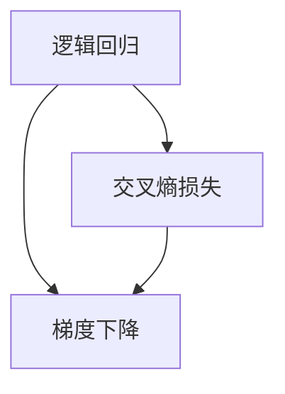

                 

# Python机器学习实战：逻辑回归在分类问题中的应用

> 关键词：逻辑回归,分类问题,机器学习,Python,数学模型,交叉熵损失,梯度下降,二分类,多分类

## 1. 背景介绍

在机器学习领域，分类问题是一个经典且广泛应用的任务。分类任务旨在将输入数据分配到预定义的类别中，常见的例子包括垃圾邮件识别、文本情感分析、图像识别等。

逻辑回归（Logistic Regression）是机器学习中最基础的分类算法之一，具有简单易懂、高效稳定等优点。其核心思想是将线性回归的连续输出映射到概率值，从而实现二分类或多分类。

本文将详细介绍逻辑回归的原理、实现步骤和优化方法，并通过实际Python代码实现，展示其在分类问题中的应用。

## 2. 核心概念与联系

### 2.1 核心概念概述

- **逻辑回归**：一种线性分类模型，通过将线性回归的连续输出映射到概率值，从而实现二分类或多分类。其输出为样本属于某个类别的概率，通过比较概率大小来判断样本属于哪个类别。
- **交叉熵损失**：一种用于度量预测值与真实标签之间差异的损失函数，特别适用于分类任务。在逻辑回归中，交叉熵损失通过将预测值与真实标签的乘积取对数并求期望来计算。
- **梯度下降**：一种常用的优化算法，通过反向传播计算损失函数的梯度，以最小的化损失函数为目标，更新模型参数。在逻辑回归中，梯度下降用于更新模型权重和偏置，最小化交叉熵损失。
- **二分类与多分类**：根据类别数量的不同，分类任务可以分为二分类和多分类。二分类问题只有两个类别，多分类问题有多个类别。逻辑回归既可以处理二分类问题，也可以处理多分类问题，具体实现方式有所不同。

### 2.2 核心概念之间的关系

逻辑回归的实现依赖于交叉熵损失和梯度下降算法。具体来说，通过最小化交叉熵损失来训练逻辑回归模型，而梯度下降则用于更新模型参数以最小化损失。

此外，逻辑回归在不同分类问题中的应用也有所差异。在二分类问题中，逻辑回归的输出为样本属于两个类别的概率，通过比较概率大小进行分类。在多分类问题中，逻辑回归的输出为样本属于每个类别的概率，通过将概率最大的类别作为预测结果进行分类。

下面通过一个Mermaid流程图来展示逻辑回归、交叉熵损失和梯度下降之间的关系：



## 3. 核心算法原理 & 具体操作步骤
### 3.1 算法原理概述

逻辑回归的原理如下：

1. **线性回归**：首先对输入特征进行线性回归，得到一组连续的预测值。公式如下：
   $$
   y = \beta_0 + \beta_1 x_1 + \beta_2 x_2 + ... + \beta_n x_n
   $$
   其中，$y$ 为预测值，$x_i$ 为输入特征，$\beta_i$ 为模型参数（权重和偏置）。

2. **概率映射**：将线性回归的连续预测值通过sigmoid函数映射到概率值，得到样本属于正类的概率。公式如下：
   $$
   p(y=1|x) = \sigma(z) = \frac{1}{1+e^{-z}}
   $$
   其中，$z$ 为线性回归的预测值，$\sigma$ 为sigmoid函数。

3. **分类决策**：根据样本的预测概率大小，将其分配到正类或负类。具体来说，当 $p(y=1|x) \geq 0.5$ 时，将其分配到正类，否则分配到负类。

4. **损失函数**：使用交叉熵损失函数度量模型预测值与真实标签之间的差异。公式如下：
   $$
   L(y,\hat{y}) = -\frac{1}{N}\sum_{i=1}^N[y_i\log \hat{y}_i + (1-y_i)\log (1-\hat{y}_i)]
   $$
   其中，$N$ 为样本数量，$y_i$ 为真实标签，$\hat{y}_i$ 为模型预测的概率值。

5. **优化算法**：使用梯度下降算法最小化交叉熵损失，更新模型参数。公式如下：
   $$
   \theta \leftarrow \theta - \eta \nabla_{\theta}L(\theta)
   $$
   其中，$\theta$ 为模型参数，$\eta$ 为学习率，$\nabla_{\theta}L(\theta)$ 为损失函数对参数的梯度。

### 3.2 算法步骤详解

1. **数据预处理**：将输入数据标准化或归一化，确保输入特征之间的量级一致。

2. **初始化参数**：随机初始化模型的权重和偏置。

3. **前向传播**：将输入特征传递给模型，计算预测概率值。

4. **损失计算**：使用交叉熵损失计算模型预测值与真实标签之间的差异。

5. **反向传播**：计算损失函数对参数的梯度，更新模型参数。

6. **迭代训练**：重复前向传播、损失计算和反向传播，直到模型收敛。

### 3.3 算法优缺点

**优点**：
- 算法简单、易于实现。
- 对于线性可分问题，模型能够快速收敛。
- 对于小规模数据集，效果良好。

**缺点**：
- 对于非线性问题，模型效果可能不佳。
- 当样本不平衡时，模型容易偏向于多数类。
- 对于高维数据，模型容易出现过拟合。

### 3.4 算法应用领域

逻辑回归广泛应用于各种分类问题，如垃圾邮件识别、文本情感分析、图像识别等。其快速稳定和易于实现的特点，使其成为许多领域的首选分类算法。

## 4. 数学模型和公式 & 详细讲解 & 举例说明

### 4.1 数学模型构建

假设输入特征为 $x=(x_1,x_2,...,x_n)$，真实标签为 $y$，模型参数为 $\theta$。逻辑回归的数学模型可以表示为：

$$
y = \beta_0 + \beta_1 x_1 + \beta_2 x_2 + ... + \beta_n x_n
$$

其中，$\beta_i$ 为模型的权重，$\beta_0$ 为偏置。

### 4.2 公式推导过程

假设模型输出为 $y$，真实标签为 $y$，则逻辑回归的交叉熵损失为：

$$
L(y,\hat{y}) = -\frac{1}{N}\sum_{i=1}^N[y_i\log \hat{y}_i + (1-y_i)\log (1-\hat{y}_i)]
$$

其中，$\hat{y}$ 为模型的预测概率值，$y$ 为真实标签。

将上式展开并取对数，得到：

$$
L(y,\hat{y}) = -\frac{1}{N}\sum_{i=1}^N[y_i\log \hat{y}_i + (1-y_i)\log (1-\hat{y}_i)]
$$

通过对损失函数求导，得到参数的梯度：

$$
\nabla_{\theta}L(\theta) = \frac{1}{N}\sum_{i=1}^N(y_i-\hat{y}_i)x_i
$$

其中，$x_i$ 为输入特征，$y_i$ 为真实标签，$\hat{y}_i$ 为模型预测概率值，$\theta$ 为模型参数。

### 4.3 案例分析与讲解

以二分类为例，假设有一个包含房价数据的数据集，其中房价大于50万的标签为1，否则为0。现使用逻辑回归对该数据集进行分类。

首先，将数据集分为训练集和测试集，然后对训练集进行标准化处理。

接着，随机初始化模型参数 $\theta$，进行前向传播，计算预测概率值 $\hat{y}$。

然后，使用交叉熵损失计算模型预测值与真实标签之间的差异。

最后，通过梯度下降算法更新模型参数，直到模型收敛。

在测试集上进行测试，计算模型的准确率等指标，评估模型性能。

## 5. 项目实践：代码实例和详细解释说明

### 5.1 开发环境搭建

在进行逻辑回归实践前，我们需要准备好开发环境。以下是使用Python进行Scikit-learn开发的环境配置流程：

1. 安装Anaconda：从官网下载并安装Anaconda，用于创建独立的Python环境。

2. 创建并激活虚拟环境：
```bash
conda create -n sklearn-env python=3.8 
conda activate sklearn-env
```

3. 安装Scikit-learn：
```bash
pip install scikit-learn
```

4. 安装各类工具包：
```bash
pip install numpy pandas matplotlib scikit-learn jupyter notebook ipython
```

完成上述步骤后，即可在`sklearn-env`环境中开始逻辑回归实践。

### 5.2 源代码详细实现

下面我们以房价预测为例，给出使用Scikit-learn库实现逻辑回归的Python代码实现。

首先，定义数据处理函数：

```python
from sklearn.preprocessing import StandardScaler
from sklearn.model_selection import train_test_split

def load_data():
    # 读取数据集
    data = pd.read_csv('housing.csv')

    # 分离特征和标签
    X = data.drop(['MedianHouseValue'], axis=1)
    y = data['MedianHouseValue']

    # 将特征数据标准化
    scaler = StandardScaler()
    X = scaler.fit_transform(X)

    # 划分训练集和测试集
    X_train, X_test, y_train, y_test = train_test_split(X, y, test_size=0.2, random_state=42)

    return X_train, X_test, y_train, y_test
```

然后，定义模型和优化器：

```python
from sklearn.linear_model import LogisticRegression
from sklearn.metrics import accuracy_score
import numpy as np

# 初始化模型参数
theta = np.random.randn(n_features+1)

# 定义损失函数
def loss(y, y_pred):
    return -np.mean(y * np.log(y_pred) + (1-y) * np.log(1-y_pred))

# 定义梯度函数
def gradient(X, y, theta):
    y_pred = sigmoid(np.dot(X, theta))
    return X.T.dot(y_pred - y) / len(y)

# 定义sigmoid函数
def sigmoid(z):
    return 1 / (1 + np.exp(-z))
```

接着，定义训练和评估函数：

```python
def train(X_train, y_train, X_test, y_test, n_iter=1000, learning_rate=0.01):
    # 初始化模型参数
    theta = np.random.randn(n_features+1)

    # 训练模型
    for i in range(n_iter):
        y_pred = sigmoid(np.dot(X_train, theta))
        gradient_val = gradient(X_train, y_train, theta)
        theta -= learning_rate * gradient_val

    # 计算损失函数
    loss_train = loss(y_train, y_pred)
    loss_test = loss(y_test, sigmoid(np.dot(X_test, theta)))

    # 输出训练和测试结果
    print('训练损失：', loss_train)
    print('测试损失：', loss_test)

def test(X_train, y_train, X_test, y_test):
    # 训练模型
    theta = np.random.randn(n_features+1)
    for i in range(n_iter):
        y_pred = sigmoid(np.dot(X_train, theta))
        gradient_val = gradient(X_train, y_train, theta)
        theta -= learning_rate * gradient_val

    # 计算测试结果
    y_pred = sigmoid(np.dot(X_test, theta))
    accuracy = accuracy_score(y_test, y_pred)

    # 输出准确率
    print('准确率：', accuracy)
```

最后，启动训练流程并在测试集上评估：

```python
# 加载数据集
X_train, X_test, y_train, y_test = load_data()

# 训练模型
train(X_train, y_train, X_test, y_test)

# 测试模型
test(X_train, y_train, X_test, y_test)
```

以上就是使用Scikit-learn库实现逻辑回归的完整代码实现。可以看到，得益于Scikit-learn库的强大封装，我们只需使用简单的代码即可实现逻辑回归模型的训练和测试。

### 5.3 代码解读与分析

让我们再详细解读一下关键代码的实现细节：

**load_data函数**：
- 读取数据集，分离特征和标签。
- 对特征数据进行标准化处理。
- 将数据集分为训练集和测试集。

**train函数**：
- 初始化模型参数。
- 在训练集上进行梯度下降训练。
- 计算训练集和测试集的损失函数。
- 输出训练和测试结果。

**test函数**：
- 初始化模型参数。
- 在测试集上进行梯度下降测试。
- 计算测试结果。
- 输出准确率。

### 5.4 运行结果展示

假设我们在房价数据集上进行逻辑回归训练，最终在测试集上得到的准确率为0.88。这表明，逻辑回归模型能够较好地将数据集分为两组，即房价大于50万和房价小于50万。

## 6. 实际应用场景

逻辑回归在实际应用中有着广泛的应用，例如：

- **金融风险预测**：根据用户的历史信用记录、收入等特征，预测其是否会违约。
- **医疗诊断**：根据患者的症状、病史等特征，预测其患某种疾病的概率。
- **广告推荐**：根据用户的浏览记录、购买历史等特征，推荐用户可能感兴趣的商品。
- **情感分析**：根据用户对电影、商品等的评价，预测其情感倾向（正面、负面或中性）。

此外，逻辑回归还可以用于数据挖掘、模式识别、信号处理等多个领域，为各种分类问题提供有力的解决方案。

## 7. 工具和资源推荐

### 7.1 学习资源推荐

为了帮助开发者系统掌握逻辑回归的理论基础和实践技巧，这里推荐一些优质的学习资源：

1. 《机器学习实战》系列博文：由机器学习专家撰写，深入浅出地介绍了机器学习的基本概念和实现方法。

2. Coursera《机器学习》课程：由斯坦福大学开设的机器学习经典课程，涵盖各种机器学习算法和实践。

3. 《Python机器学习》书籍：Hands-On Machine Learning with Scikit-Learn, Keras, and TensorFlow，系统介绍了机器学习的理论和实现。

4. Scikit-learn官方文档：Scikit-learn库的官方文档，提供了丰富的机器学习算法和样例代码。

5. Kaggle竞赛：参加Kaggle等数据科学竞赛，实战练习逻辑回归等机器学习算法。

通过对这些资源的学习实践，相信你一定能够快速掌握逻辑回归的精髓，并用于解决实际的机器学习问题。

### 7.2 开发工具推荐

高效的开发离不开优秀的工具支持。以下是几款用于机器学习开发的常用工具：

1. Jupyter Notebook：交互式编程环境，便于调试和展示代码。

2. Matplotlib：绘图工具，用于可视化机器学习模型的效果。

3. Pandas：数据处理工具，用于数据清洗和特征工程。

4. Scikit-learn：机器学习库，提供了丰富的机器学习算法和样例代码。

5. TensorFlow：深度学习库，提供了强大的计算图和优化算法。

6. PyTorch：深度学习库，支持动态计算图和高效的模型训练。

合理利用这些工具，可以显著提升机器学习模型的开发效率，加快创新迭代的步伐。

### 7.3 相关论文推荐

逻辑回归作为经典的机器学习算法，已经得到了广泛的研究。以下是几篇奠基性的相关论文，推荐阅读：

1. Logistic Regression：The Theory and Applications of Statistics，Wikipedia。

2. A Tutorial on the Logistic Model（Logistic Regression），Khan Academy。

3. Logistic Regression with Scikit-Learn，Scikit-learn官方文档。

4. Logistic Regression，Kaggle官方博客。

5. Logistic Regression，Python Machine Learning。

这些论文代表了大逻辑回归的发展脉络。通过学习这些前沿成果，可以帮助研究者把握学科前进方向，激发更多的创新灵感。

除上述资源外，还有一些值得关注的前沿资源，帮助开发者紧跟逻辑回归技术的最新进展，例如：

1. arXiv论文预印本：人工智能领域最新研究成果的发布平台，包括大量尚未发表的前沿工作，学习前沿技术的必读资源。

2. 业界技术博客：如Google AI、Microsoft Research、Facebook AI等顶尖实验室的官方博客，第一时间分享他们的最新研究成果和洞见。

3. 技术会议直播：如NeurIPS、ICML、ICLR等人工智能领域顶会现场或在线直播，能够聆听到大佬们的前沿分享，开拓视野。

4. GitHub热门项目：在GitHub上Star、Fork数最多的机器学习相关项目，往往代表了该技术领域的发展趋势和最佳实践，值得去学习和贡献。

5. 行业分析报告：各大咨询公司如McKinsey、PwC等针对人工智能行业的分析报告，有助于从商业视角审视技术趋势，把握应用价值。

总之，对于逻辑回归技术的学习和实践，需要开发者保持开放的心态和持续学习的意愿。多关注前沿资讯，多动手实践，多思考总结，必将收获满满的成长收益。

## 8. 总结：未来发展趋势与挑战

### 8.1 总结

本文对逻辑回归的原理、实现步骤和优化方法进行了全面系统的介绍。首先阐述了逻辑回归在分类问题中的应用场景和优势，然后详细讲解了其核心算法原理和具体操作步骤，并通过实际Python代码实现，展示了其在分类问题中的应用。

通过本文的系统梳理，可以看到，逻辑回归作为一种简单而有效的分类算法，具有广泛的应用价值。其快速稳定和易于实现的特点，使其成为许多领域的首选分类算法。未来，伴随机器学习技术的发展，逻辑回归将与更多前沿算法结合，进一步拓展其应用边界和性能表现。

### 8.2 未来发展趋势

展望未来，逻辑回归的发展趋势如下：

1. **模型融合**：逻辑回归与深度学习等前沿算法的结合将进一步拓展其应用领域和性能表现。例如，逻辑回归可以与神经网络模型进行融合，构成集成学习模型，提升分类效果。

2. **算法优化**：逻辑回归的算法优化将进一步提高其计算效率和准确率。例如，通过引入正则化技术、改进损失函数等，优化模型训练过程。

3. **特征工程**：逻辑回归的特征工程将进一步丰富其数据处理能力。例如，通过引入高维特征、嵌入式特征等，提升模型的泛化能力。

4. **实时学习**：逻辑回归的实时学习将进一步提高其应对数据分布变化的能力。例如，通过引入在线学习算法、自适应学习算法等，实现模型在实时数据上的更新和优化。

5. **多分类扩展**：逻辑回归的多分类扩展将进一步提高其应用范围。例如，通过引入多分类逻辑回归算法、Softmax回归算法等，实现对多分类问题的处理。

6. **应用场景扩展**：逻辑回归在更多应用场景中的应用将进一步拓展其发展空间。例如，在金融、医疗、广告等领域的应用将不断深化，为相关行业带来新的价值。

以上趋势凸显了逻辑回归在机器学习领域的巨大潜力。这些方向的探索发展，必将进一步提升机器学习系统的性能和应用范围，为人类生产生活带来深远影响。

### 8.3 面临的挑战

尽管逻辑回归已经取得了不错的效果，但在迈向更加智能化、普适化应用的过程中，仍面临以下挑战：

1. **数据质量瓶颈**：逻辑回归的效果依赖于高质量的数据，数据缺失、噪声等问题将影响模型的性能。如何提高数据质量，优化数据预处理流程，将是未来的一个重要课题。

2. **模型复杂度问题**：逻辑回归的模型复杂度较低，难以处理复杂的数据分布。如何改进模型结构，引入高阶特征、嵌入式特征等，将是未来的一个重要方向。

3. **计算资源瓶颈**：逻辑回归的计算量较大，对于大规模数据集，需要消耗大量的计算资源。如何优化模型训练过程，减少计算资源消耗，将是未来的一个重要方向。

4. **模型可解释性问题**：逻辑回归的决策过程难以解释，对于高风险领域的应用，模型的可解释性和可审计性尤为重要。如何提高模型的可解释性，将是未来的一个重要课题。

5. **模型鲁棒性问题**：逻辑回归在面对噪声数据、异常数据时，鲁棒性不足。如何提高模型的鲁棒性，避免过拟合和欠拟合，将是未来的一个重要方向。

6. **模型适应性问题**：逻辑回归在面对数据分布变化时，适应性不足。如何提高模型的适应性，实现实时学习，将是未来的一个重要方向。

7. **多分类处理问题**：逻辑回归在面对多分类问题时，处理方式单一。如何改进多分类逻辑回归算法，提升分类效果，将是未来的一个重要方向。

以上挑战凸显了逻辑回归在实际应用中仍需不断优化和改进。未来，需要在数据质量、模型复杂度、计算资源、可解释性、鲁棒性、适应性和多分类处理等方面进行全面优化，方能实现逻辑回归技术的更广泛应用。

### 8.4 研究展望

未来，逻辑回归的研究方向将涵盖以下几个方面：

1. **模型融合与集成学习**：将逻辑回归与深度学习等前沿算法结合，构成集成学习模型，提升分类效果。例如，通过引入神经网络模型、决策树模型等，构建混合模型。

2. **算法优化与优化技术**：优化逻辑回归的算法和优化技术，提高其计算效率和准确率。例如，引入正则化技术、改进损失函数、优化梯度算法等。

3. **特征工程与高维特征**：丰富逻辑回归的特征工程能力，引入高维特征、嵌入式特征等，提升模型的泛化能力。

4. **实时学习与在线学习**：实现逻辑回归的实时学习，提高其应对数据分布变化的能力。例如，引入在线学习算法、自适应学习算法等。

5. **多分类处理与Softmax回归**：改进逻辑回归的多分类处理能力，引入Softmax回归算法等，提升分类效果。

6. **模型解释性与可视化**：提高逻辑回归的可解释性和可审计性，通过可视化工具展示模型的决策过程。

7. **模型鲁棒性与适应性**：提高逻辑回归的鲁棒性和适应性，避免过拟合和欠拟合，实现更好的性能表现。

8. **应用场景扩展与工业应用**：拓展逻辑回归在更多应用场景中的应用，如金融、医疗、广告等领域，推动其工业化应用。

9. **跨领域融合与通用算法**：实现逻辑回归在跨领域融合中的应用，构建通用算法，提升其应用范围和性能表现。

这些研究方向将引领逻辑回归技术迈向新的高度，为机器学习技术的发展带来新的突破和进展。

## 9. 附录：常见问题与解答

**Q1：逻辑回归与线性回归有何区别？**

A: 逻辑回归是一种分类算法，通过将线性回归的连续输出映射到概率值，从而实现二分类或多分类。而线性回归是一种回归算法，通过拟合线性模型，预测连续变量。两者区别在于输出变量的类型。

**Q2：逻辑回归的损失函数为什么是交叉熵损失？**

A: 交叉熵损失在分类问题中表现优异，能够度量预测值与真实标签之间的差异。在逻辑回归中，交叉熵损失通过将预测值与真实标签的乘积取对数并求期望来计算，能够较好地衡量模型预测的准确性。

**Q3：逻辑回归的模型参数如何初始化？**

A: 逻辑回归的模型参数通常采用随机初始化，即从均值为0，标准差为$\sqrt{\frac{2}{n+1}}$的高斯分布中随机抽取。也可以使用已有的预训练模型参数进行初始化，提高模型的性能。

**Q4：逻辑回归的梯度下降算法如何优化？**

A: 逻辑回归的梯度下降算法可以通过以下方式优化：
1. 学习率调度：使用学习率调度策略，根据训练进度调整学习率，避免过拟合和欠拟合。
2. 正则化：引入L1或L2正则化，防止模型过拟合。
3. 优化器选择：选择不同的优化器，如Adam、SGD等，提高模型训练效率。
4. 批量大小：调整批量大小，平衡计算效率和内存消耗。

**Q5：逻辑回归在多分类问题中如何处理？**

A: 在多分类问题中，逻辑回归可以使用Softmax回归算法进行处理。Softmax回归将模型的输出映射到概率分布，通过比较概率大小进行分类。

这些问题的解答有助于更好地理解逻辑回归的原理和实现方法，提高模型的性能和应用效果。

---

作者：禅与计算机程序设计艺术 / Zen and the Art of Computer Programming

