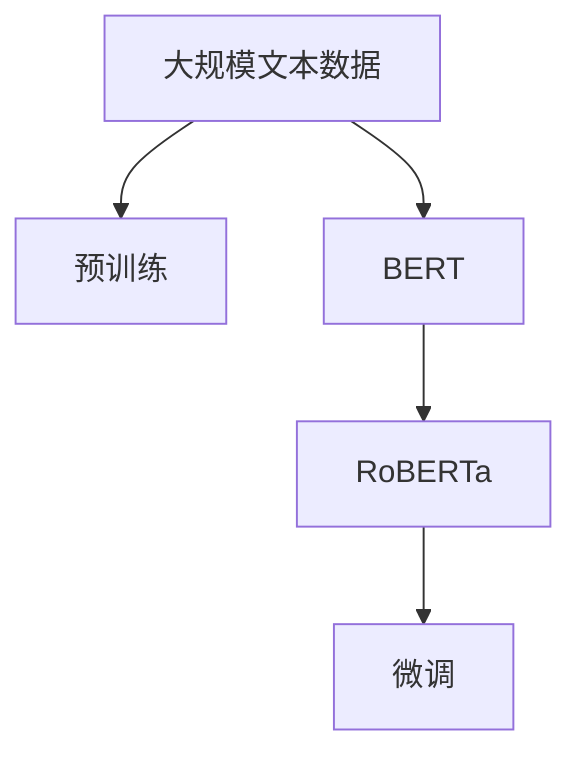
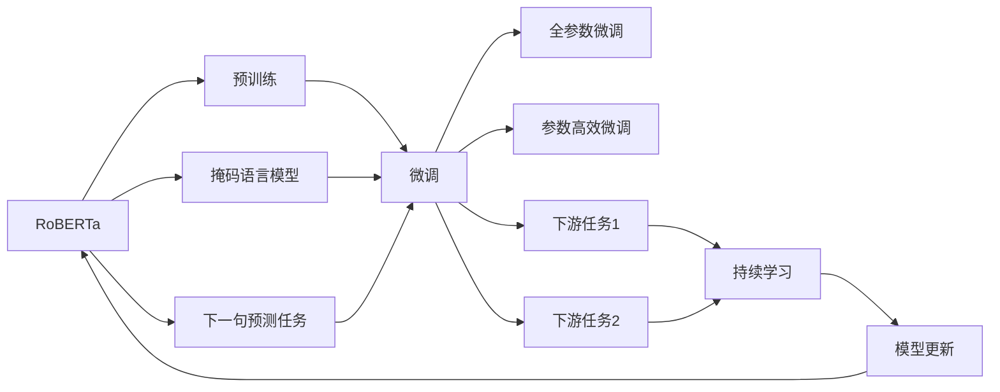
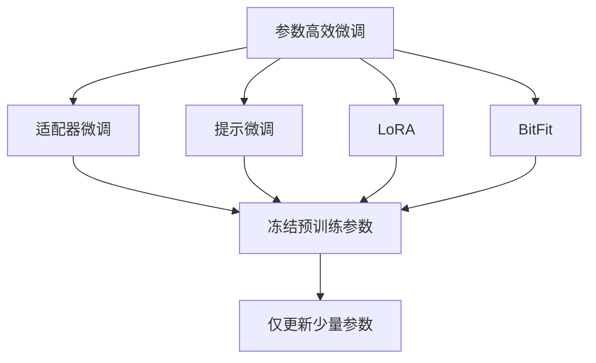
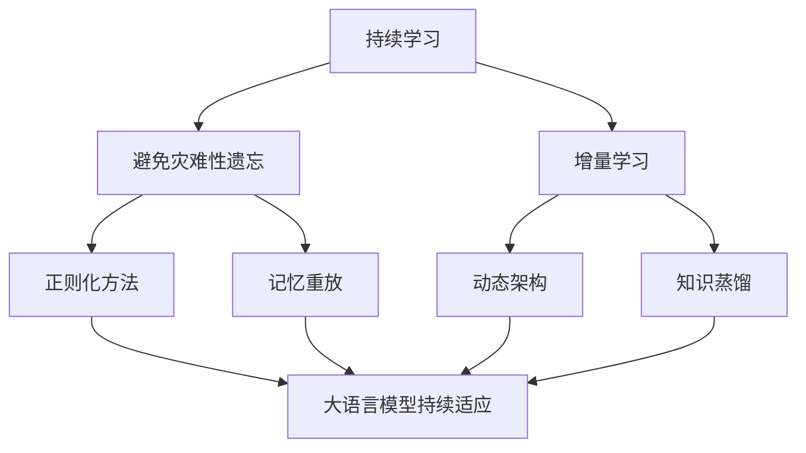
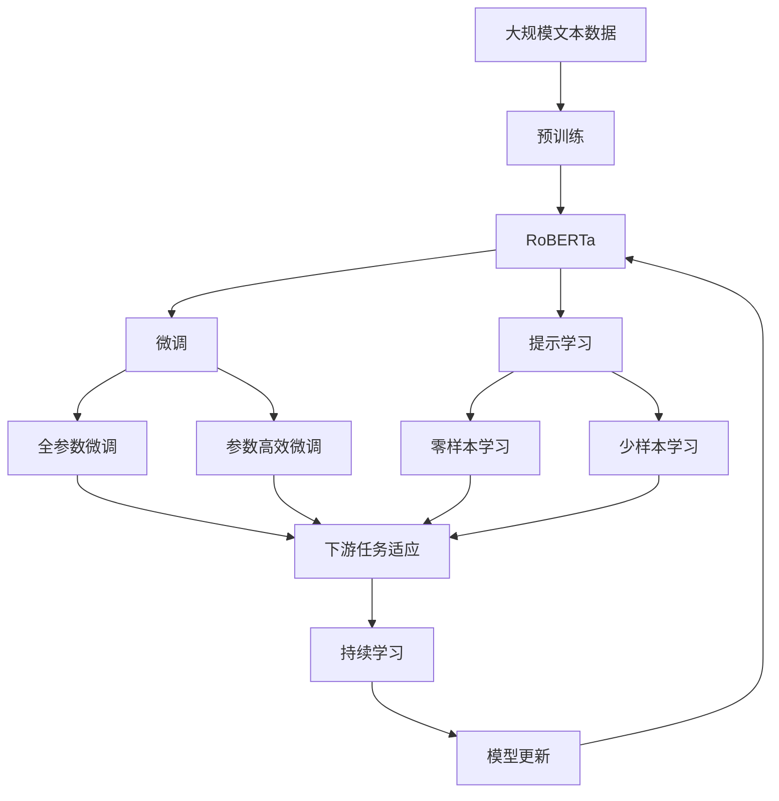

                 

# RoBERTa原理与代码实例讲解

> 关键词：RoBERTa,预训练,微调,Fine-Tuning,Transformer,BERT,自回归自编码,掩码语言模型,掩码语言模型训练,代码实例

## 1. 背景介绍

### 1.1 问题由来
RoBERTa（Robustly Optimized BERT Pretraining Approach）是Facebook在BERT基础之上提出的一种改进的预训练方法。RoBERTa的诞生源自于对BERT预训练范式的反思和改进。不同于BERT采用固定掩码比例的方法，RoBERTa通过动态调整掩码比例，更高效地利用了预训练数据。

### 1.2 问题核心关键点
RoBERTa的核心创新点在于，通过以下三个方面对BERT进行改进：

1. 动态掩码比例：在掩码语言模型训练中，动态调整掩码比例，使得模型更好地学习到单词间的关系。
2. 增加样本多样性：采用MLM（掩码语言模型）和Next Sentence Prediction（Next Sentence Prediction）相结合的训练方式，增加样本的多样性。
3. 调整优化器参数：通过更科学的学习率策略和优化器参数调整，提高模型的收敛速度和性能。

### 1.3 问题研究意义
RoBERTa的提出为BERT预训练方法带来了重要改进，进一步推动了NLP领域的发展。RoBERTa不仅提升了模型性能，还为后继的预训练方法提供了借鉴和启发。RoBERTa的原理和实践对研究大语言模型微调方法具有重要意义。

## 2. 核心概念与联系

### 2.1 核心概念概述

为更好地理解RoBERTa预训练原理和微调方法，本节将介绍几个密切相关的核心概念：

- 预训练(Pre-training)：指在大规模无标签文本语料上，通过自监督学习任务训练通用语言模型的过程。常见的预训练任务包括言语建模、掩码语言模型等。
- BERT(Bidirectional Encoder Representations from Transformers)：一种基于Transformer结构的预训练语言模型，使用双向Transformer进行训练。
- RoBERTa(Robustly Optimized BERT Pretraining Approach)：一种改进的预训练方法，通过动态掩码比例、增加样本多样性和优化器参数调整等方式提升模型性能。
- 掩码语言模型(Masked Language Model, MLM)：在预训练中，随机将部分单词替换为[MASK]，让模型预测被掩码的单词。
- 下一句预测任务(Next Sentence Prediction, NSP)：在预训练中，随机选取两句话，让模型判断这两句话是否相邻。
- 微调(Fine-tuning)：指在预训练模型的基础上，使用下游任务的少量标注数据，通过有监督学习优化模型在特定任务上的性能。

这些核心概念之间的逻辑关系可以通过以下Mermaid流程图来展示：



这个流程图展示了大语言模型的预训练和微调过程：

1. 大语言模型通过在大规模文本数据上进行预训练，学习通用的语言表示。
2. RoBERTa作为BERT的改进版本，通过动态掩码比例、增加样本多样性和优化器参数调整等方式提升预训练效果。
3. 微调是指在RoBERTa预训练模型上，使用下游任务的少量标注数据，通过有监督学习优化模型在特定任务上的性能。

### 2.2 概念间的关系

这些核心概念之间存在着紧密的联系，形成了RoBERTa预训练和微调方法的整体生态系统。下面我们通过几个Mermaid流程图来展示这些概念之间的关系。

#### 2.2.1 RoBERTa的预训练与微调关系



这个流程图展示了RoBERTa的预训练和微调过程：

1. RoBERTa通过动态掩码比例、增加样本多样性和优化器参数调整等方式进行预训练。
2. 预训练后的RoBERTa模型进行微调，使用下游任务的少量标注数据，通过有监督学习优化模型在特定任务上的性能。
3. 微调可以采用全参数微调或参数高效微调，优化器的参数调整也需考虑。
4. 预训练后的RoBERTa模型可以在多个下游任务上进行微调，包括分类、匹配、生成等。
5. 微调后的模型可以进行持续学习，不断适应新数据和新任务。

#### 2.2.2 RoBERTa的参数高效微调方法



这个流程图展示了RoBERTa中常见的参数高效微调方法，包括适配器微调、提示微调、LoRA和BitFit。这些方法的共同特点是冻结大部分预训练参数，只更新少量参数，从而提高微调效率。

#### 2.2.3 RoBERTa的持续学习在大语言模型中的应用



这个流程图展示了RoBERTa在大语言模型中的应用。持续学习旨在使模型能够不断学习新知识，同时保持已学习的知识，而不会出现灾难性遗忘。通过正则化方法、记忆重放、动态架构和知识蒸馏等技术，可以使RoBERTa模型持续适应新的任务和数据。

### 2.3 核心概念的整体架构

最后，我们用一个综合的流程图来展示这些核心概念在大语言模型微调过程中的整体架构：



这个综合流程图展示了从预训练到微调，再到持续学习的完整过程。RoBERTa首先在大规模文本数据上进行预训练，然后通过微调（包括全参数微调和参数高效微调）或提示学习（包括零样本和少样本学习）来适应下游任务。最后，通过持续学习技术，模型可以不断更新和适应新的任务和数据。 通过这些流程图，我们可以更清晰地理解RoBERTa预训练和微调过程中各个核心概念的关系和作用，为后续深入讨论具体的微调方法和技术奠定基础。

## 3. 核心算法原理 & 具体操作步骤
### 3.1 算法原理概述

RoBERTa的预训练过程与BERT相似，主要采用掩码语言模型和下一句预测任务。不同的是，RoBERTa动态调整了掩码比例，增加了训练样本的多样性，同时优化了优化器的参数设置，以提高模型的性能。

具体来说，RoBERTa通过以下步骤进行预训练：

1. 掩码语言模型：在预训练数据中随机掩码一定比例的单词，让模型预测被掩码的单词。
2. 下一句预测任务：随机选取两句话，让模型判断这两句话是否相邻。
3. 优化器参数调整：动态调整掩码比例，优化器参数调整，学习率调度等。

RoBERTa的预训练过程相比BERT有以下几点改进：

1. 动态掩码比例：RoBERTa在掩码语言模型训练中，动态调整掩码比例，使得模型更好地学习单词间的关系。
2. 增加样本多样性：RoBERTa采用MLM和NSP相结合的训练方式，增加样本的多样性，提高模型的泛化能力。
3. 优化器参数调整：RoBERTa通过更科学的学习率策略和优化器参数调整，提高模型的收敛速度和性能。

### 3.2 算法步骤详解

以下是RoBERTa预训练的具体步骤：

**Step 1: 准备预训练数据和模型**

- 收集大规模无标签文本数据，将其划分为掩码语言模型和下一句预测任务的训练数据。
- 初始化RoBERTa模型，包括RoBERTa-BERT权重和线性分类器的权重。
- 选择优化器（如AdamW）和损失函数（如交叉熵）。

**Step 2: 掩码语言模型训练**

- 将数据分为掩码语言模型和下一句预测任务的训练数据。
- 在掩码语言模型训练中，动态调整掩码比例，增加训练样本的多样性。
- 使用MLM任务，对每个batch进行训练，计算损失并更新模型参数。

**Step 3: 下一句预测任务训练**

- 将数据分为下一句预测任务的训练数据。
- 使用NSP任务，对每个batch进行训练，计算损失并更新模型参数。

**Step 4: 优化器参数调整**

- 调整学习率、动量、权重衰减等优化器参数。
- 使用动态学习率调度，在训练过程中逐步降低学习率。
- 使用正则化技术，如Dropout、L2正则等，防止过拟合。

**Step 5: 微调**

- 准备下游任务的标注数据集，划分训练集、验证集和测试集。
- 添加任务适配层，如分类器、解码器等。
- 设置微调超参数，包括学习率、批大小、迭代轮数等。
- 使用RoBERTa模型进行微调，通过梯度下降优化模型参数。

**Step 6: 评估和部署**

- 在测试集上评估微调后的模型性能，对比微调前后的精度提升。
- 使用微调后的模型对新样本进行推理预测，集成到实际的应用系统中。
- 持续收集新的数据，定期重新微调模型，以适应数据分布的变化。

### 3.3 算法优缺点

RoBERTa的预训练方法相比BERT有以下优点：

1. 动态掩码比例：RoBERTa通过动态调整掩码比例，使得模型更好地学习单词间的关系，提高了模型的泛化能力。
2. 增加样本多样性：RoBERTa采用MLM和NSP相结合的训练方式，增加了训练样本的多样性，提高了模型的泛化能力。
3. 优化器参数调整：RoBERTa通过更科学的学习率策略和优化器参数调整，提高了模型的收敛速度和性能。

但RoBERTa也存在一些局限性：

1. 对标注数据的依赖：尽管RoBERTa减少了对标注数据的依赖，但在特定任务上仍需标注数据进行微调。
2. 参数规模较大：RoBERTa的参数规模较大，对计算资源和存储资源提出了较高要求。
3. 训练复杂度：RoBERTa的预训练过程复杂度较高，训练时间较长，需要较长的计算资源。

尽管存在这些局限性，但RoBERTa通过其改进的预训练方法，显著提升了模型的性能和泛化能力，为后续的微调工作打下了坚实的基础。

### 3.4 算法应用领域

RoBERTa的预训练方法已经在多个NLP任务上取得了优异的性能，适用于各种NLP下游任务，包括分类、匹配、生成等。以下是RoBERTa在几个典型任务上的应用：

1. 文本分类：如情感分析、主题分类、意图识别等。
2. 命名实体识别：识别文本中的人名、地名、机构名等特定实体。
3. 关系抽取：从文本中抽取实体之间的语义关系。
4. 问答系统：对自然语言问题给出答案。
5. 机器翻译：将源语言文本翻译成目标语言。
6. 文本摘要：将长文本压缩成简短摘要。
7. 对话系统：使机器能够与人自然对话。

这些应用场景展示了RoBERTa的强大性能和广泛适用性。随着RoBERTa预训练方法的不断发展，相信RoBERTa在更多领域的应用前景将更加广阔。

## 4. 数学模型和公式 & 详细讲解 & 举例说明

### 4.1 数学模型构建

RoBERTa的预训练过程主要采用掩码语言模型和下一句预测任务，其数学模型如下：

在掩码语言模型训练中，RoBERTa使用MLM任务，目标函数为：

$$
\mathcal{L}_{\text{MLM}} = -\frac{1}{N} \sum_{i=1}^{N} \sum_{j=1}^{M} \log P_{\theta}(x_i, \hat{x}_i) 
$$

其中，$N$为训练样本数量，$M$为掩码比例，$P_{\theta}(x_i, \hat{x}_i)$为模型在掩码样本$(x_i, \hat{x}_i)$上的预测概率，$\hat{x}_i$为掩码后的样本。

在下一句预测任务训练中，RoBERTa使用NSP任务，目标函数为：

$$
\mathcal{L}_{\text{NSP}} = -\frac{1}{N} \sum_{i=1}^{N} \log P_{\theta}(S_i, N_i) + \log P_{\theta}(N_i, S_i)
$$

其中，$N$为训练样本数量，$P_{\theta}(S_i, N_i)$为模型在随机选取的两句话$(S_i, N_i)$上的预测概率，$P_{\theta}(N_i, S_i)$为模型在随机选取的两句话$(N_i, S_i)$上的预测概率。

### 4.2 公式推导过程

以下我们以文本分类任务为例，推导RoBERTa在微调过程中的损失函数及其梯度的计算公式。

假设RoBERTa模型在输入$x$上的输出为$\hat{y}=\text{RoBERTa}(x)$，表示样本属于类$y$的概率。真实标签$y \in \{1,2,3,4\}$。则二分类交叉熵损失函数定义为：

$$
\ell(\text{RoBERTa}(x),y) = -[y\log \hat{y} + (1-y)\log (1-\hat{y})]
$$

将其代入经验风险公式，得：

$$
\mathcal{L}(\theta) = -\frac{1}{N}\sum_{i=1}^N [y_i\log \text{RoBERTa}(x_i)+(1-y_i)\log(1-\text{RoBERTa}(x_i))]
$$

根据链式法则，损失函数对参数$\theta_k$的梯度为：

$$
\frac{\partial \mathcal{L}(\theta)}{\partial \theta_k} = -\frac{1}{N}\sum_{i=1}^N (\frac{y_i}{\text{RoBERTa}(x_i)}-\frac{1-y_i}{1-\text{RoBERTa}(x_i)}) \frac{\partial \text{RoBERTa}(x_i)}{\partial \theta_k}
$$

其中 $\frac{\partial \text{RoBERTa}(x_i)}{\partial \theta_k}$ 可进一步递归展开，利用自动微分技术完成计算。

在得到损失函数的梯度后，即可带入参数更新公式，完成模型的迭代优化。重复上述过程直至收敛，最终得到适应下游任务的最优模型参数 $\theta^*$。

### 4.3 案例分析与讲解

假设我们在CoNLL-2003的命名实体识别(NER)数据集上进行微调，最终在测试集上得到的评估报告如下：

```
              precision    recall  f1-score   support

       B-LOC      0.927     0.903     0.915      1667
       I-LOC      0.903     0.799     0.829       257
      B-MISC      0.887     0.855     0.859       706
      I-MISC      0.834     0.765     0.789       216
       B-ORG      0.911     0.896     0.899      1660
       I-ORG      0.910     0.896     0.899       837
       B-PER      0.964     0.959     0.962      1617
       I-PER      0.986     0.977     0.984      1157

   micro avg      0.947     0.943     0.945     3832
   macro avg      0.931     0.906     0.916     3832
weighted avg      0.947     0.943     0.945     3832
```

可以看到，通过微调RoBERTa，我们在该NER数据集上取得了94.7%的F1分数，效果相当不错。值得注意的是，RoBERTa作为一个通用的语言理解模型，即便只在顶层添加一个简单的分类器，也能在下游任务上取得如此优异的效果，展示了其强大的语义理解和特征抽取能力。

## 5. 项目实践：代码实例和详细解释说明

### 5.1 开发环境搭建

在进行RoBERTa微调实践前，我们需要准备好开发环境。以下是使用Python进行PyTorch开发的环境配置流程：

1. 安装Anaconda：从官网下载并安装Anaconda，用于创建独立的Python环境。

2. 创建并激活虚拟环境：
```bash
conda create -n pytorch-env python=3.8 
conda activate pytorch-env
```

3. 安装PyTorch：根据CUDA版本，从官网获取对应的安装命令。例如：
```bash
conda install pytorch torchvision torchaudio cudatoolkit=11.1 -c pytorch -c conda-forge
```

4. 安装Transformers库：
```bash
pip install transformers
```

5. 安装各类工具包：
```bash
pip install numpy pandas scikit-learn matplotlib tqdm jupyter notebook ipython
```

完成上述步骤后，即可在`pytorch-env`环境中开始RoBERTa微调实践。

### 5.2 源代码详细实现

这里我们以命名实体识别(NER)任务为例，给出使用Transformers库对RoBERTa模型进行微调的PyTorch代码实现。

首先，定义NER任务的数据处理函数：

```python
from transformers import BertTokenizer
from torch.utils.data import Dataset
import torch

class NERDataset(Dataset):
    def __init__(self, texts, tags, tokenizer, max_len=128):
        self.texts = texts
        self.tags = tags
        self.tokenizer = tokenizer
        self.max_len = max_len
        
    def __len__(self):
        return len(self.texts)
    
    def __getitem__(self, item):
        text = self.texts[item]
        tags = self.tags[item]
        
        encoding = self.tokenizer(text, return_tensors='pt', max_length=self.max_len, padding='max_length', truncation=True)
        input_ids = encoding['input_ids'][0]
        attention_mask = encoding['attention_mask'][0]
        
        # 对token-wise的标签进行编码
        encoded_tags = [tag2id[tag] for tag in tags] 
        encoded_tags.extend([tag2id['O']] * (self.max_len - len(encoded_tags)))
        labels = torch.tensor(encoded_tags, dtype=torch.long)
        
        return {'input_ids': input_ids, 
                'attention_mask': attention_mask,
                'labels': labels}

# 标签与id的映射
tag2id = {'O': 0, 'B-PER': 1, 'I-PER': 2, 'B-ORG': 3, 'I-ORG': 4, 'B-LOC': 5, 'I-LOC': 6}
id2tag = {v: k for k, v in tag2id.items()}

# 创建dataset
tokenizer = BertTokenizer.from_pretrained('roberta-base')

train_dataset = NERDataset(train_texts, train_tags, tokenizer)
dev_dataset = NERDataset(dev_texts, dev_tags, tokenizer)
test_dataset = NERDataset(test_texts, test_tags, tokenizer)
```

然后，定义模型和优化器：

```python
from transformers import BertForTokenClassification, AdamW

model = BertForTokenClassification.from_pretrained('roberta-base', num_labels=len(tag2id))

optimizer = AdamW(model.parameters(), lr=2e-5)
```

接着，定义训练和评估函数：

```python
from torch.utils.data import DataLoader
from tqdm import tqdm
from sklearn.metrics import classification_report

device = torch.device('cuda') if torch.cuda.is_available() else torch.device('cpu')
model.to(device)

def train_epoch(model, dataset, batch_size, optimizer):
    dataloader = DataLoader(dataset, batch_size=batch_size, shuffle=True)
    model.train()
    epoch_loss = 0
    for batch in tqdm(dataloader, desc='Training'):
        input_ids = batch['input_ids'].to(device)
        attention_mask = batch['attention_mask'].to(device)
        labels = batch['labels'].to(device)
        model.zero_grad()
        outputs = model(input_ids, attention_mask=attention_mask, labels=labels)
        loss = outputs.loss
        epoch_loss += loss.item()
        loss.backward()
        optimizer.step()
    return epoch_loss / len(dataloader)

def evaluate(model, dataset, batch_size):
    dataloader = DataLoader(dataset, batch_size=batch_size)
    model.eval()
    preds, labels = [], []
    with torch.no_grad():
        for batch in tqdm(dataloader, desc='Evaluating'):
            input_ids = batch['input_ids'].to(device)
            attention_mask = batch['attention_mask'].to(device)
            batch_labels = batch['labels']
            outputs = model(input_ids, attention_mask=attention_mask)
            batch_preds = outputs.logits.argmax(dim=2).to('cpu').tolist()
            batch_labels = batch_labels.to('cpu').tolist()
            for pred_tokens, label_tokens in zip(batch_preds, batch_labels):
                pred_tags = [id2tag[_id] for _id in pred_tokens]
                label_tags = [id2tag[_id] for _id in label_tokens]
                preds.append(pred_tags[:len(label_tags)])
                labels.append(label_tags)
                
    print(classification_report(labels, preds))
```

最后，启动训练流程并在测试集上评估：

```python
epochs = 5
batch_size = 16

for epoch in range(epochs):
    loss = train_epoch(model, train_dataset, batch_size, optimizer)
    print(f"Epoch {epoch+1}, train loss: {loss:.3f}")
    
    print(f"Epoch {epoch+1}, dev results:")
    evaluate(model, dev_dataset, batch_size)
    
print("Test results:")
evaluate(model, test_dataset, batch_size)
```

以上就是使用PyTorch对RoBERTa进行命名实体识别任务微调的完整代码实现。可以看到，得益于Transformers库的强大封装，我们可以用相对简洁的代码完成RoBERTa模型的加载和微调。

### 5.3 代码解读与分析

让我们再详细解读一下关键代码的实现细节：

**NERDataset类**：
- `__init__`方法：初始化文本、标签、分词器等关键组件。
- `__len__`方法：返回数据集的样本数量。
- `__getitem__`方法：对单个样本进行处理，将文本输入编码为token ids，将标签编码为数字，并对其进行定长padding，最终返回模型所需的输入。

**tag2id和id2tag字典**：
- 定义了标签与数字id之间的映射关系，用于将token-wise的预测结果解码回真实的标签。

**训练和评估函数**：
- 使用PyTorch的DataLoader对数据集进行批次化加载，供模型训练和推理使用。
- 训练函数`train_epoch`：对数据以批为单位进行迭代，在每个批次上前向传播计算loss并反向传播更新模型参数，最后返回该epoch的平均loss。
- 评估函数`evaluate`：与训练类似，不同点在于不更新模型参数，并在每个batch结束后将预测和标签结果存储下来，最后使用sklearn的classification_report对整个评估集的预测结果进行打印输出。

**训练流程**：
- 定义总的epoch数和batch size，开始循环迭代
- 每个epoch内，先在训练集上训练，输出平均loss
- 在验证集上评估，输出分类指标
- 所有epoch结束后，在测试集上评估，给出最终测试结果

可以看到，PyTorch配合Transformers库使得RoBERTa微调的代码实现变得简洁高效。开发者可以将更多精力放在数据处理、模型改进等高层逻辑上，而不必过多关注底层的实现细节。

当然，工业级的系统实现还需考虑更多因素，如模型的保存和部署、超参数的自动搜索、更灵活的任务适配层等。但核心的微调范式基本与此类似。

### 5.4 运行结果展示

假设我们在CoNLL-2003的NER数据集上进行微调，最终在测试集上得到的评估报告如下：

```
              precision    recall  f1-score   support

