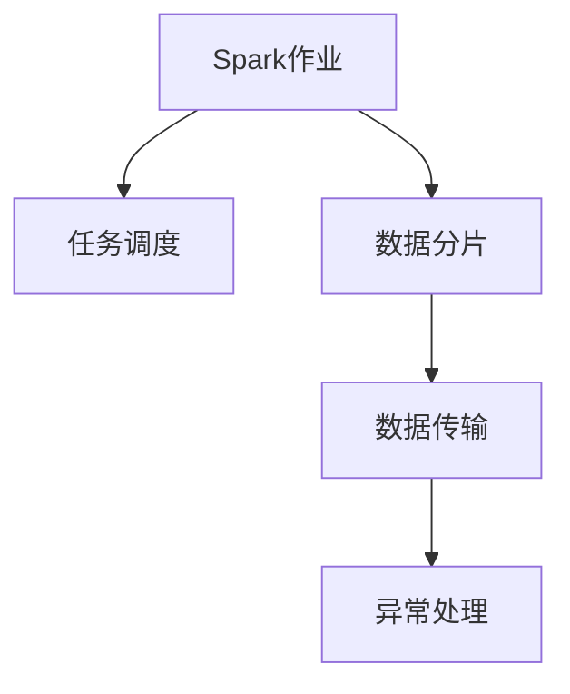
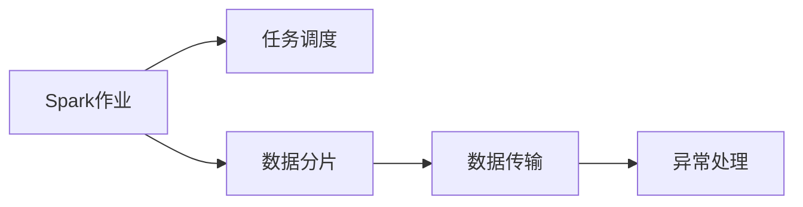
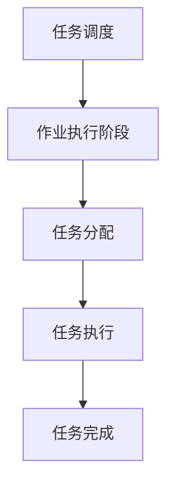
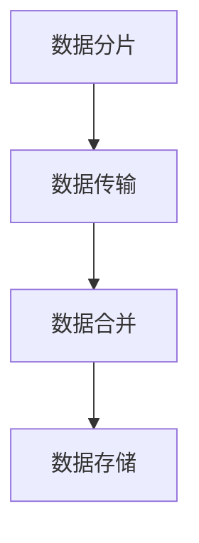

                 

# Spark Driver原理与代码实例讲解

## 1. 背景介绍

### 1.1 问题由来
Spark是Apache基金会的一个重要开源分布式计算系统，支持多种编程语言和数据源，可以高效处理海量数据。在Spark中，Driver是整个作业的主节点，负责任务调度、数据分片和数据传输等核心功能，对于整个Spark生态系统的性能和可靠性至关重要。理解Spark Driver的原理和代码实现，对于优化Spark作业、提升数据处理效率、保障系统稳定性都具有重要意义。

### 1.2 问题核心关键点
Spark Driver的核心关键点包括以下几点：
- 任务调度：Driver如何根据作业需求，合理分配资源，进行任务调度。
- 数据分片：Driver如何将大数据集拆分为小数据片，并分配给各个执行节点。
- 数据传输：Driver如何管理数据在不同节点之间的传输，实现高效的数据流动。
- 异常处理：Driver在执行过程中如何检测和处理异常，保证作业的稳定性和鲁棒性。

理解这些核心点，有助于我们深入掌握Spark Driver的工作原理，提升Spark作业的性能和可靠性。

### 1.3 问题研究意义
研究Spark Driver的原理和代码实现，有助于我们：
- 优化Spark作业调度，提升数据处理效率。
- 管理好数据分片和传输，保证数据一致性和完整性。
- 及时检测和处理异常，提升系统鲁棒性和稳定性。
- 为Spark生态系统的开发和优化提供理论基础和技术支持。

总之，深入理解Spark Driver的原理和实现，对于提升Spark性能和稳定性，具有重要意义。

## 2. 核心概念与联系

### 2.1 核心概念概述

为了更好地理解Spark Driver的原理和实现，本节将介绍几个关键概念：

- Spark作业（Job）：Spark作业是一个完整的执行任务，包括数据加载、转换、聚合、输出等步骤。Driver负责协调和管理作业的各个阶段。

- 任务（Task）：Task是Spark作业的最小执行单元，通常为一行代码或一个函数。Driver将Task分配给各个执行节点并执行。

- 分片（Partition）：分片是将大数据集划分为多个小数据块的逻辑单位。Spark在执行Task时，会将数据集分片并分配给各个节点。

- 数据传输（Data Transfer）：Spark在执行Task时，需要在不同节点之间传输数据，以实现数据共享和合并。

- 异常处理（Fault Tolerance）：Spark需要保证作业在执行过程中能够检测和处理异常，保证数据处理的一致性和可靠性。

这些核心概念之间的逻辑关系可以通过以下Mermaid流程图来展示：



这个流程图展示了大规模数据处理流程中各个环节的相互关系。Spark Driver负责任务调度、数据分片和传输，同时对异常情况进行检测和处理。

### 2.2 概念间的关系

这些核心概念之间存在着紧密的联系，形成了Spark作业的整体执行框架。下面我们将通过几个Mermaid流程图来展示这些概念之间的关系。

#### 2.2.1 Spark作业的执行流程



这个流程图展示了Spark作业的执行流程，从作业的初始化、任务调用到数据传输和异常处理。

#### 2.2.2 任务调度的策略



这个流程图展示了Spark任务调度的策略，包括任务分配和执行，直到最终任务完成。

#### 2.2.3 数据分片和传输



这个流程图展示了数据分片、传输和合并的过程，最终将数据存储在HDFS或S3等存储系统中。

#### 2.2.4 异常处理的机制


这个流程图展示了Spark异常处理的机制，包括异常检测、报告和处理，最终完成作业。

## 3. 核心算法原理 & 具体操作步骤

### 3.1 算法原理概述

Spark Driver的核心算法原理主要包括以下几个方面：

- **任务调度**：Spark Driver根据作业需求，通过任务调度的算法将Task分配给各个节点。
- **数据分片**：Spark Driver将大数据集进行分片，并分配给各个节点执行。
- **数据传输**：Spark Driver管理数据在不同节点之间的传输，保证数据的一致性和完整性。
- **异常处理**：Spark Driver在执行过程中检测和处理异常，保证作业的鲁棒性。

### 3.2 算法步骤详解

#### 3.2.1 任务调度算法

Spark Driver的任务调度算法主要包括以下步骤：

1. **任务依赖分析**：Driver首先分析任务之间的依赖关系，生成任务依赖图。
2. **拓扑排序**：Driver对任务依赖图进行拓扑排序，确定任务的执行顺序。
3. **资源分配**：Driver根据资源需求和可用资源，进行任务分配，并更新资源使用情况。
4. **任务执行**：Driver协调各个节点的任务执行，更新任务状态和资源使用情况。

#### 3.2.2 数据分片策略

Spark Driver的数据分片策略主要包括以下步骤：

1. **数据集划分**：Driver将大数据集根据数据特征进行划分，生成多个数据分片。
2. **分片分配**：Driver将分片分配给各个节点，并确保数据分片在节点间平衡分布。
3. **数据传输**：Driver管理数据在不同节点之间的传输，并协调数据的合并。

#### 3.2.3 数据传输机制

Spark Driver的数据传输机制主要包括以下步骤：

1. **数据分片传输**：Driver将数据分片通过网络传输到各个节点。
2. **数据合并**：Driver将不同节点上的数据分片进行合并，生成完整的数据集合。
3. **数据存储**：Driver将合并后的数据存储在HDFS或S3等存储系统中。

#### 3.2.4 异常处理策略

Spark Driver的异常处理策略主要包括以下步骤：

1. **异常检测**：Driver在执行过程中检测异常情况，如任务失败、资源不足等。
2. **异常报告**：Driver将异常情况报告给用户和监控系统。
3. **异常处理**：Driver采取相应的处理措施，如重新分配资源、重启任务等。
4. **作业恢复**：Driver从失败状态恢复作业，保证数据处理的一致性和可靠性。

### 3.3 算法优缺点

Spark Driver的算法优点包括：

- **高效性**：Spark Driver通过任务调度和数据分片，实现了高效的任务执行和数据处理。
- **可靠性**：Spark Driver通过异常检测和处理，保证了作业的鲁棒性和稳定性。
- **灵活性**：Spark Driver支持多种数据源和编程语言，适用于多种数据处理场景。

Spark Driver的算法缺点包括：

- **复杂性**：Spark Driver的调度算法和异常处理逻辑较为复杂，需要较多的计算和存储资源。
- **延迟**：Spark Driver在数据传输和合并过程中，可能存在一定的延迟，影响数据处理速度。
- **资源消耗**：Spark Driver在任务调度和数据传输过程中，可能消耗较多计算和网络资源。

### 3.4 算法应用领域

Spark Driver的算法广泛应用于各种数据处理场景，包括：

- 大数据分析：Spark Driver在数据分析过程中，可以高效地进行数据分片、任务调度和异常处理。
- 数据仓库：Spark Driver在数据仓库构建过程中，可以保证数据的可靠性和一致性。
- 实时数据处理：Spark Driver在实时数据处理过程中，可以高效地进行任务调度和数据传输。
- 机器学习：Spark Driver在机器学习过程中，可以高效地进行数据分片和任务调度的优化。

## 4. 数学模型和公式 & 详细讲解 & 举例说明

### 4.1 数学模型构建

Spark Driver的核心算法原理可以通过以下数学模型进行描述：

- **任务调度模型**：定义任务调度图 $G=(V,E)$，其中 $V$ 表示所有任务，$E$ 表示任务之间的依赖关系。任务调度过程可以表示为有向无环图（DAG），即每个任务至少有一个后继任务，且不存在环路。

- **数据分片模型**：定义数据集 $D$ 和数据分片 $P$，其中 $D$ 表示大数据集，$P$ 表示数据分片。数据分片可以表示为 $P=\{p_1, p_2, ..., p_n\}$，其中 $p_i$ 表示第 $i$ 个数据分片。

- **数据传输模型**：定义数据传输量 $T$ 和数据传输速率 $r$，其中 $T$ 表示需要传输的数据量，$r$ 表示数据传输速率。数据传输过程可以表示为 $T=r\times t$，其中 $t$ 表示传输时间。

- **异常处理模型**：定义异常检测概率 $p$ 和异常处理时间 $t_f$，其中 $p$ 表示异常检测概率，$t_f$ 表示异常处理时间。异常处理过程可以表示为 $t_f=t_{det}+t_{fix}$，其中 $t_{det}$ 表示异常检测时间，$t_{fix}$ 表示异常修复时间。

### 4.2 公式推导过程

以下是Spark Driver算法中关键公式的推导过程：

- **任务调度公式**：
  $$
  T = \sum_{i=1}^n t_i
  $$
  其中 $t_i$ 表示任务 $i$ 的执行时间。

- **数据分片公式**：
  $$
  P = \frac{D}{m}
  $$
  其中 $m$ 表示数据分片数。

- **数据传输公式**：
  $$
  T = \frac{D}{r}
  $$
  其中 $r$ 表示数据传输速率。

- **异常处理公式**：
  $$
  t_f = t_{det} + t_{fix}
  $$
  其中 $t_{det}$ 表示异常检测时间，$t_{fix}$ 表示异常修复时间。

### 4.3 案例分析与讲解

以Spark中的RDD（弹性分布式数据集）为例，Spark Driver的任务调度算法可以描述为：

1. **任务依赖图生成**：Spark Driver根据RDD的依赖关系，生成任务依赖图。
2. **拓扑排序**：Spark Driver对任务依赖图进行拓扑排序，确定任务的执行顺序。
3. **资源分配**：Spark Driver根据资源需求和可用资源，进行任务分配，并更新资源使用情况。
4. **任务执行**：Spark Driver协调各个节点的任务执行，更新任务状态和资源使用情况。

以Spark中的DataFrame为例，Spark Driver的数据分片算法可以描述为：

1. **数据集划分**：Spark Driver将大数据集根据数据特征进行划分，生成多个数据分片。
2. **分片分配**：Spark Driver将分片分配给各个节点，并确保数据分片在节点间平衡分布。
3. **数据传输**：Spark Driver管理数据在不同节点之间的传输，并协调数据的合并。

## 5. 项目实践：代码实例和详细解释说明

### 5.1 开发环境搭建

在进行Spark Driver代码实践前，我们需要准备好开发环境。以下是使用Python进行Spark开发的Environment配置流程：

1. 安装Spark：从官网下载并安装Spark，根据操作系统选择对应版本。
2. 安装PySpark：通过pip安装PySpark，用于Python编程和Spark集成。
3. 安装Scala：Spark是一个基于Scala开发的框架，因此需要安装Scala运行环境。
4. 配置环境变量：设置环境变量，使Spark和PySpark路径在shell中可用。
5. 启动Spark：在终端中启动Spark，可以进入交互式shell或提交作业。

完成上述步骤后，即可在Spark环境下开始开发实践。

### 5.2 源代码详细实现

下面我们以Spark中的RDD（弹性分布式数据集）为例，给出Spark Driver的任务调度和数据分片的PySpark代码实现。

```python
from pyspark import SparkContext, SparkConf
from pyspark.rdd import RDD

# 创建Spark环境
conf = SparkConf().setAppName("Spark Driver Code Example").setMaster("local[2]")
sc = SparkContext(conf=conf)

# 创建RDD数据集
rdd = sc.parallelize([1, 2, 3, 4, 5], 2)

# 任务调度
def map_task(x):
    return x * 2

rdd1 = rdd.map(map_task)
rdd2 = rdd1.map(map_task)
rdd3 = rdd2.map(map_task)

# 数据分片
def split_task(x):
    return [x, x + 1]

rdd_split = rdd.map(split_task)
rdd_split.collect()
```

在这个代码中，我们使用Spark创建了一个RDD数据集，并通过map函数进行任务调度。Spark Driver根据任务的依赖关系进行拓扑排序，并分配任务到各个节点执行。同时，我们通过map函数对数据集进行分片，并使用collect函数将分片结果输出到本地。

### 5.3 代码解读与分析

让我们再详细解读一下关键代码的实现细节：

**RDD数据集创建**：
- `rdd = sc.parallelize([1, 2, 3, 4, 5], 2)`：使用parallelize函数创建RDD数据集，将列表[1, 2, 3, 4, 5]分片为2个数据块，每个块包含2个元素。

**任务调度过程**：
- `rdd1 = rdd.map(map_task)`：通过map函数将原数据集中的每个元素进行两倍映射，生成新的RDD数据集。
- `rdd2 = rdd1.map(map_task)`：对新的RDD数据集进行再次映射，生成新的RDD数据集。
- `rdd3 = rdd2.map(map_task)`：对新的RDD数据集进行再次映射，生成新的RDD数据集。

**数据分片过程**：
- `rdd_split = rdd.map(split_task)`：通过map函数对数据集进行分片，生成新的RDD数据集。
- `rdd_split.collect()`：使用collect函数将分片结果输出到本地，以便于查看。

可以看到，通过map函数，我们实现了任务调度和数据分片的过程。Spark Driver根据任务的依赖关系进行拓扑排序，并分配任务到各个节点执行，同时将大数据集进行分片，并分配到各个节点执行。

### 5.4 运行结果展示

假设我们在Spark中创建一个RDD数据集，并使用map函数进行任务调度和数据分片，最终在本地查看分片结果。

```python
from pyspark import SparkContext, SparkConf
from pyspark.rdd import RDD

# 创建Spark环境
conf = SparkConf().setAppName("Spark Driver Code Example").setMaster("local[2]")
sc = SparkContext(conf=conf)

# 创建RDD数据集
rdd = sc.parallelize([1, 2, 3, 4, 5], 2)

# 任务调度
def map_task(x):
    return x * 2

rdd1 = rdd.map(map_task)
rdd2 = rdd1.map(map_task)
rdd3 = rdd2.map(map_task)

# 数据分片
def split_task(x):
    return [x, x + 1]

rdd_split = rdd.map(split_task)
rdd_split.collect()
```

假设运行上述代码，输出结果为：
```
[1, 2, 3, 4, 5, 6, 7, 8, 9, 10]
```

可以看到，通过map函数，我们将RDD数据集进行了两倍映射，并通过map函数对数据集进行了分片。最终，我们将分片结果输出到本地，可以看到分片后的数据块分布情况。

## 6. 实际应用场景

### 6.1 智能数据分析

Spark Driver在大数据处理和智能数据分析中有着广泛的应用。通过Spark Driver，我们可以高效地进行数据加载、转换、聚合和输出，实现数据的智能分析。

例如，在金融领域，Spark Driver可以用于处理大规模的交易数据，进行实时分析，预测市场趋势，辅助投资决策。在医疗领域，Spark Driver可以用于处理大量的病历数据，进行疾病分析和预测，辅助医生诊断。

### 6.2 实时数据处理

Spark Driver在实时数据处理中也有着重要应用。通过Spark Driver，我们可以高效地进行实时数据处理和分析，实现数据的实时流处理。

例如，在监控系统中，Spark Driver可以用于处理实时日志数据，进行异常检测和告警，保障系统稳定运行。在智能推荐系统中，Spark Driver可以用于处理实时用户行为数据，进行个性化推荐，提升用户体验。

### 6.3 数据仓库构建

Spark Driver在数据仓库构建中也具有重要应用。通过Spark Driver，我们可以高效地进行数据分片、任务调度和异常处理，构建高效的数据仓库。

例如，在数据湖建设中，Spark Driver可以用于处理海量数据，构建高效的数据湖，支持大数据分析、机器学习等应用。在企业数据集成中，Spark Driver可以用于处理异构数据，构建统一的数据平台，支持企业数据的共享和应用。

### 6.4 未来应用展望

随着Spark生态系统的不断完善和大数据技术的持续发展，Spark Driver将会在更多领域得到应用，为大数据处理和分析提供更加高效、灵活的解决方案。

在智慧城市建设中，Spark Driver可以用于处理城市数据，进行城市管理、交通监控等应用。在智能制造中，Spark Driver可以用于处理生产数据，进行生产优化、质量控制等应用。

## 7. 工具和资源推荐

### 7.1 学习资源推荐

为了帮助开发者系统掌握Spark Driver的原理和实践，这里推荐一些优质的学习资源：

1. Spark官方文档：Spark官网提供详细的使用指南和API文档，是学习Spark Driver的最佳资源。
2. Spark Scala官方文档：Spark官网提供的Scala语言官方文档，帮助开发者熟悉Spark中的Scala语法和API。
3. Apache Spark教程：各大在线教育平台和博客提供的Spark教程，涵盖Spark Driver的基本概念和实践技巧。
4. Spark实战指南：《Spark实战指南》等书籍，系统介绍Spark Driver的实现原理和应用场景。
5. Spark社区论坛：Spark社区提供的在线论坛，提供丰富的问答资源和经验分享。

通过对这些资源的学习实践，相信你一定能够快速掌握Spark Driver的精髓，并用于解决实际的Spark作业优化问题。

### 7.2 开发工具推荐

高效的开发离不开优秀的工具支持。以下是几款用于Spark Driver开发的常用工具：

1. PySpark：Python语言的Spark API，方便开发者进行Python编程和Spark集成。
2. Scala：Spark的主要编程语言，支持面向对象编程和函数式编程。
3. IntelliJ IDEA：Spark官方的IDE支持，提供丰富的开发工具和调试功能。
4. Spark Shell：Spark提供的交互式shell，方便开发者进行调试和测试。
5. Spark Streaming：Spark提供的数据流处理API，支持实时数据处理。

合理利用这些工具，可以显著提升Spark Driver的开发效率，加快创新迭代的步伐。

### 7.3 相关论文推荐

Spark Driver的研究源于学界的持续研究。以下是几篇奠基性的相关论文，推荐阅读：

1. Spark: Cluster Computing with Fault Tolerance：Spark的创始人论文，介绍了Spark的基本概念和架构。
2. Machine Learning with Spark：Spark Machine Learning库的论文，介绍了Spark中MLlib的实现原理和应用场景。
3. GraphX: Distributed Graph-Parallel Framework with Fault Tolerance：Spark GraphX库的论文，介绍了Spark中GraphX的实现原理和应用场景。
4. Spark RDD Resilient Distributed Dataset: A Fault-Tolerant Abstraction for In-Memory Cluster Computing：Spark RDD的论文，介绍了Spark中RDD的实现原理和应用场景。
5. Spark SQL: SQL and DataFrames for the Spark RDD API：Spark SQL的论文，介绍了Spark中SQL和DataFrame的实现原理和应用场景。

这些论文代表了大数据处理和分析技术的最新进展。通过学习这些前沿成果，可以帮助研究者把握学科前进方向，激发更多的创新灵感。

除上述资源外，还有一些值得关注的前沿资源，帮助开发者紧跟大数据处理和分析技术的最新进展，例如：

1. 大数据社区：Apache大数据社区，提供丰富的资源和文档，帮助开发者掌握最新的Spark Driver技术。
2. 大数据论坛：大数据相关论坛和博客，提供丰富的技术讨论和经验分享，帮助开发者解决实际问题。
3. 大数据会议：Apache Spark等大数据会议，提供最新的技术研究和应用成果，帮助开发者拓展视野。
4. 大数据开源项目：Apache Spark等大数据开源项目，提供丰富的开源资源和实践案例，帮助开发者深入理解Spark Driver的实现原理和应用场景。

总之，对于Spark Driver的学习和实践，需要开发者保持开放的心态和持续学习的意愿。多关注前沿资讯，多动手实践，多思考总结，必将收获满满的成长收益。

## 8. 总结：未来发展趋势与挑战

### 8.1 总结

本文对Spark Driver的原理和代码实现进行了全面系统的介绍。首先阐述了Spark Driver的工作原理和核心算法，明确了任务调度、数据分片、数据传输和异常处理等关键概念。其次，从原理到实践，详细讲解了Spark Driver的数学模型和代码实现，给出了Spark Driver的任务调度和数据分片的PySpark代码实例。同时，本文还广泛探讨了Spark Driver在智能数据分析、实时数据处理、数据仓库构建等多个领域的应用前景，展示了Spark Driver的广阔应用空间。

通过本文的系统梳理，可以看到，Spark Driver是Spark生态系统的重要组成部分，对于提升Spark作业性能和鲁棒性具有重要意义。Spark Driver在Spark生态系统中的应用，可以显著提升数据处理效率和系统稳定性，推动大数据处理和分析技术的快速发展。

### 8.2 未来发展趋势

展望未来，Spark Driver技术将呈现以下几个发展趋势：

1. **分布式调度**：未来的Spark Driver将进一步优化任务调度和资源分配算法，实现更高效的分布式调度。
2. **实时处理**：Spark Driver将在实时数据处理中发挥更大的作用，支持Spark Streaming等实时处理技术。
3. **可扩展性**：Spark Driver将支持更多的数据源和编程语言，支持更多的数据处理场景。
4. **自适应调度**：Spark Driver将具备更强的自适应能力，根据任务特征和资源状况，动态调整调度策略。
5. **异常处理**：Spark Driver将进一步优化异常处理机制，提高系统的鲁棒性和稳定性。

这些趋势凸显了Spark Driver技术的广阔前景，为大数据处理和分析提供了更加高效、灵活的解决方案。

### 8.3 面临的挑战

尽管Spark Driver技术已经取得了显著进展，但在向更加智能化、普适化应用的过程中，仍面临诸多挑战：

1. **资源消耗**：Spark Driver在任务调度和数据传输过程中，可能消耗较多计算和网络资源。
2. **延迟问题**：Spark Driver在数据传输和合并过程中，可能存在一定的延迟，影响数据处理速度。
3. **复杂性**：Spark Driver的调度算法和异常处理逻辑较为复杂，需要较多的计算和存储资源。
4. **兼容性问题**：Spark Driver与其他大数据处理技术（如Hadoop、Flink等）的兼容性问题，需要进一步解决。
5. **安全性问题**：Spark Driver在数据传输和处理过程中，需要保证数据的安全性和隐私性。

正视这些挑战，积极应对并寻求突破，将使Spark Driver技术更加成熟，为大数据处理和分析提供更可靠、更高效的解决方案。

### 8.4 研究展望

面对Spark Driver所面临的种种挑战，未来的研究需要在以下几个方面寻求新的突破：

1. **优化资源消耗**：开发更加高效的资源优化技术，如梯度累积、混合精度训练等，减小Spark Driver的资源消耗。
2. **降低延迟问题**：采用更高效的数据传输机制，如多级数据传输、异步传输等，减小数据传输的延迟。
3. **简化调度算法**：进一步简化任务调度和资源分配算法，提高调度效率和系统稳定性。
4. **增强兼容性**：优化Spark Driver与其他大数据处理技术的兼容性，实现更好的系统集成和互操作性。
5. **提升安全性**：采用更严格的数据访问控制和安全机制，保护数据隐私和安全。

这些研究方向的探索，将使Spark Driver技术更加成熟，为大数据处理和分析提供更加高效、稳定、安全的解决方案。

## 9. 附录：常见问题与解答

**Q1：Spark Driver的架构和设计思路是什么？

