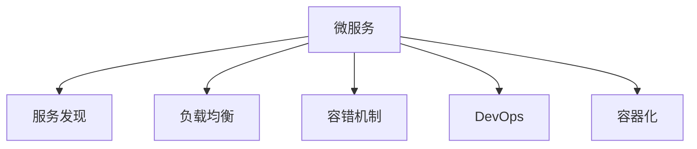
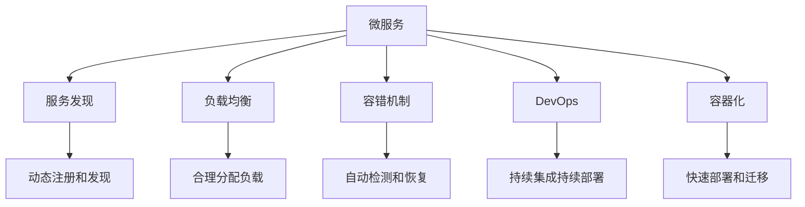
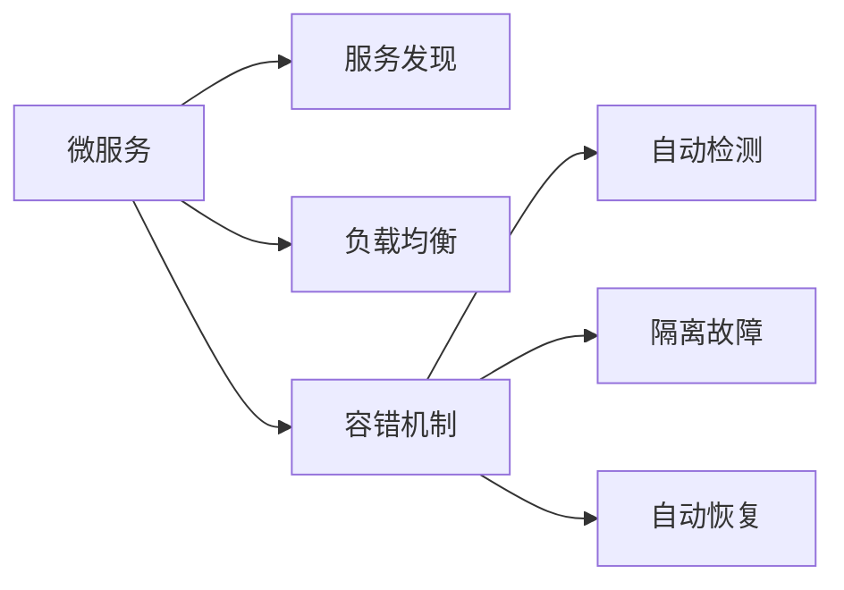
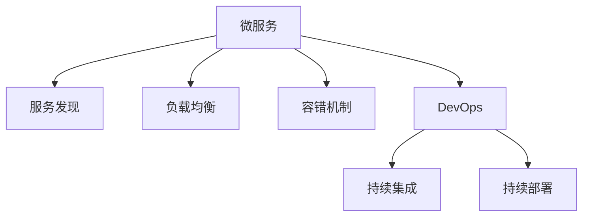
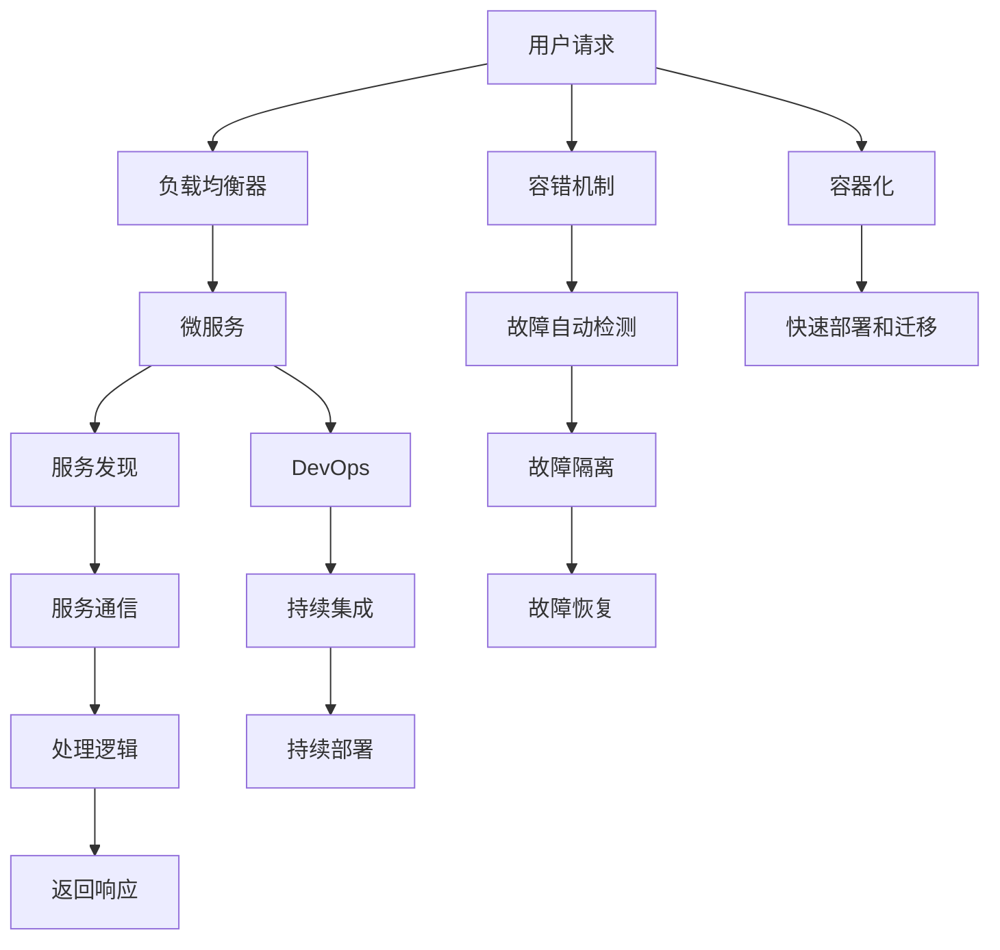

                 

# 微服务架构在高扩展性中的实例应用

> 关键词：微服务,高扩展性,服务发现,负载均衡,容错机制,DevOps,持续集成持续部署(CI/CD),容器化

## 1. 背景介绍

### 1.1 问题由来
随着互联网业务的飞速发展和用户需求的不断变化，单体架构的系统越来越难以应对日益增长的用户量和复杂的业务逻辑。而微服务架构（Microservices Architecture）作为一种新兴的软件架构风格，以其高度的灵活性、可扩展性和可维护性，逐步成为现代互联网系统架构的主流。微服务架构的核心思想是将系统拆分成多个小的、独立的、可自治的服务，每个服务负责单一的功能，通过轻量级的通信机制进行交互和协作，从而实现系统的模块化和灵活性。

### 1.2 问题核心关键点
微服务架构的核心关键点在于服务拆分、服务治理、服务通信和服务集成等方面。本文将重点探讨微服务架构在高扩展性方面的应用实例，通过具体案例分析微服务架构的优势，以及如何通过微服务架构应对大规模系统中的扩展性挑战。

### 1.3 问题研究意义
微服务架构的高扩展性对于解决大规模系统中的扩展性问题具有重要意义：

1. **灵活性**：微服务架构能够快速响应业务需求的变化，通过独立的服务快速部署和迭代更新。
2. **高可用性**：单个服务的故障不会影响到整个系统，实现系统的弹性设计和容错性。
3. **可扩展性**：微服务架构能够根据业务需求动态调整服务实例的数量和分布，实现系统的水平扩展。
4. **易于维护**：微服务架构通过服务拆分，使得系统的复杂度降低，维护更加容易。
5. **技术创新**：微服务架构推动了DevOps文化的发展，加速了持续集成持续部署（CI/CD）的实施，提升了系统交付效率和质量。

## 2. 核心概念与联系

### 2.1 核心概念概述

为更好地理解微服务架构在高扩展性方面的应用，本节将介绍几个密切相关的核心概念：

- **微服务（Microservices）**：将系统拆分成多个小的、独立的服务，每个服务负责单一的功能。微服务之间通过轻量级通信机制进行交互和协作。
- **服务发现（Service Discovery）**：在微服务架构中，每个服务需要知道其他服务的地址和接口信息，服务发现机制使得服务能够动态查找和注册服务实例。
- **负载均衡（Load Balancing）**：在微服务架构中，多个服务实例需要合理分配请求负载，以提高系统的吞吐量和性能。
- **容错机制（Fault Tolerance）**：微服务架构中的每个服务需要实现故障自动检测、隔离和恢复，避免单点故障对整个系统的影响。
- **DevOps文化**：微服务架构推动了DevOps文化的发展，强调持续集成持续部署（CI/CD）的实施，提升系统交付效率和质量。
- **容器化（Containerization）**：容器化技术通过将应用和其依赖打包到一个独立的运行环境（容器）中，实现了应用的快速部署和迁移。

这些核心概念之间的逻辑关系可以通过以下Mermaid流程图来展示：



这个流程图展示了几大核心概念之间的关系：

1. 微服务是整个架构的核心，通过服务拆分实现系统的模块化和灵活性。
2. 服务发现机制使得服务能够动态查找和注册，实现服务间的通信和协作。
3. 负载均衡保证了请求的合理分配，提高了系统的吞吐量和性能。
4. 容错机制保证了系统的健壮性，避免了单点故障对整个系统的影响。
5. DevOps文化推动了持续集成持续部署的实施，提升了系统的交付效率和质量。
6. 容器化技术实现了应用的快速部署和迁移，提升了系统的灵活性和可移植性。

### 2.2 概念间的关系

这些核心概念之间存在着紧密的联系，形成了微服务架构的整体生态系统。下面我们通过几个Mermaid流程图来展示这些概念之间的关系。

#### 2.2.1 微服务架构的高扩展性



这个流程图展示了微服务架构在高扩展性方面的关键特征：

1. 通过服务发现机制实现了动态注册和发现，使得服务能够快速适应变化的环境。
2. 负载均衡保证了请求的合理分配，提高了系统的吞吐量和性能。
3. 容错机制保证了系统的健壮性，避免了单点故障对整个系统的影响。
4. DevOps文化推动了持续集成持续部署的实施，提升了系统的交付效率和质量。
5. 容器化技术实现了应用的快速部署和迁移，提升了系统的灵活性和可移植性。

#### 2.2.2 微服务架构的容错机制



这个流程图展示了微服务架构中的容错机制：

1. 服务发现机制使得服务能够动态查找和注册，实现服务间的通信和协作。
2. 负载均衡保证了请求的合理分配，提高了系统的吞吐量和性能。
3. 容错机制保证了系统的健壮性，避免了单点故障对整个系统的影响。
4. 自动检测和隔离故障，避免故障的进一步扩散。
5. 自动恢复机制确保系统能够快速恢复正常运行。

#### 2.2.3 微服务架构的DevOps文化



这个流程图展示了微服务架构中的DevOps文化：

1. 微服务架构推动了DevOps文化的发展，强调持续集成持续部署的实施。
2. 持续集成（CI）保证了代码的频繁集成和自动构建。
3. 持续部署（CD）实现了代码的自动部署和测试。
4. 微服务架构的高扩展性和灵活性，使得CI/CD的实施更加高效和容易。

### 2.3 核心概念的整体架构

最后，我们用一个综合的流程图来展示这些核心概念在微服务架构中的整体架构：



这个综合流程图展示了微服务架构的整体架构：

1. 用户请求首先经过负载均衡器，合理分配到微服务实例。
2. 服务发现机制使得服务能够动态查找和注册，实现服务间的通信和协作。
3. 负载均衡保证了请求的合理分配，提高了系统的吞吐量和性能。
4. 容错机制保证了系统的健壮性，避免了单点故障对整个系统的影响。
5. DevOps文化推动了持续集成持续部署的实施，提升了系统的交付效率和质量。
6. 容器化技术实现了应用的快速部署和迁移，提升了系统的灵活性和可移植性。

通过这些流程图，我们可以更清晰地理解微服务架构在高扩展性方面的关键组件和流程，为后续深入讨论具体的微服务架构应用奠定基础。

## 3. 核心算法原理 & 具体操作步骤
### 3.1 算法原理概述

微服务架构的高扩展性主要依赖于服务拆分、服务发现、负载均衡和容错机制等核心组件和机制。其核心思想是将系统拆分成多个小的、独立的服务，每个服务负责单一的功能，通过轻量级的通信机制进行交互和协作，从而实现系统的模块化和灵活性。

### 3.2 算法步骤详解

微服务架构的高扩展性主要包括以下几个关键步骤：

**Step 1: 服务拆分**

- 根据业务需求将系统拆分成多个独立的服务，每个服务负责单一的功能。
- 服务的拆分应遵循SOLID原则，确保每个服务具有单一职责和高内聚性。
- 服务的拆分应考虑服务的独立性、扩展性和维护性，避免微服务的“微”而“乱”。

**Step 2: 服务发现**

- 服务发现机制使得服务能够动态查找和注册，实现服务间的通信和协作。
- 常用的服务发现机制包括Consul、Eureka、Zookeeper等。
- 服务发现机制应支持服务实例的动态注册和发现，确保服务的健壮性和可用性。

**Step 3: 负载均衡**

- 负载均衡机制保证了请求的合理分配，提高了系统的吞吐量和性能。
- 常用的负载均衡算法包括轮询、加权轮询、随机、最小连接数等。
- 负载均衡机制应支持请求的动态分配和扩展，确保系统的弹性设计。

**Step 4: 容错机制**

- 容错机制保证了系统的健壮性，避免了单点故障对整个系统的影响。
- 常用的容错机制包括故障自动检测、隔离和恢复等。
- 容错机制应支持故障的自动检测和隔离，确保系统的快速恢复和稳定性。

**Step 5: 持续集成持续部署**

- DevOps文化推动了持续集成持续部署的实施，提升了系统的交付效率和质量。
- 持续集成持续部署（CI/CD）通过自动化代码的构建、测试和部署，提升了系统的交付效率和质量。
- 常用的CI/CD工具包括Jenkins、Travis CI、GitLab CI等。

### 3.3 算法优缺点

微服务架构在高扩展性方面具有以下优点：

1. **灵活性**：微服务架构能够快速响应业务需求的变化，通过独立的服务快速部署和迭代更新。
2. **高可用性**：单个服务的故障不会影响到整个系统，实现系统的弹性设计和容错性。
3. **可扩展性**：微服务架构能够根据业务需求动态调整服务实例的数量和分布，实现系统的水平扩展。
4. **易于维护**：微服务架构通过服务拆分，使得系统的复杂度降低，维护更加容易。
5. **技术创新**：微服务架构推动了DevOps文化的发展，加速了持续集成持续部署（CI/CD）的实施，提升了系统交付效率和质量。

同时，微服务架构也存在一些缺点：

1. **复杂性增加**：微服务架构增加了系统的复杂度，需要更多的管理和协调机制。
2. **通信开销增加**：微服务架构通过网络进行通信，增加了通信开销和延迟。
3. **开发成本增加**：微服务架构需要更多的开发和管理成本，增加了系统的维护难度。

### 3.4 算法应用领域

微服务架构已经广泛应用于金融、电商、医疗、教育、政府等领域，取得了显著的成效。以下列举几个典型的应用场景：

- **金融领域**：微服务架构在金融领域中得到了广泛应用，如交易系统、清算系统、风控系统等。通过微服务架构，金融机构能够实现系统的灵活性和高可用性，提升系统的服务质量和安全性。
- **电商领域**：微服务架构在电商领域中用于订单系统、库存系统、支付系统等。通过微服务架构，电商企业能够实现系统的快速迭代和灵活扩展，提升用户体验和运营效率。
- **医疗领域**：微服务架构在医疗领域中用于患者信息管理、电子病历、医疗影像等。通过微服务架构，医疗机构能够实现系统的弹性设计和高效运行，提升医疗服务的质量和效率。
- **教育领域**：微服务架构在教育领域中用于在线学习平台、学生管理、教师管理等。通过微服务架构，教育机构能够实现系统的灵活性和高可用性，提升教学质量和教育资源的管理效率。
- **政府领域**：微服务架构在政府领域中用于政务服务、电子政务、公共信息服务等。通过微服务架构，政府部门能够实现系统的灵活扩展和高效运行，提升政府服务的质量和效率。

## 4. 数学模型和公式 & 详细讲解 & 举例说明

### 4.1 数学模型构建

在微服务架构中，服务实例的数量和负载是影响系统扩展性的关键因素。假设系统中有 $N$ 个服务实例，每个服务实例的请求处理能力为 $P$，平均请求响应时间为 $T$，则系统的总处理能力为 $N \times P$，总响应时间为 $N \times T$。当系统负载增加时，需要增加服务实例来保证系统的吞吐量和性能。

### 4.2 公式推导过程

假设系统的请求率为 $R$，服务实例的故障率为 $F$，则系统在高负载下的服务实例数量 $N$ 可以通过以下公式计算：

$$ N = \frac{R}{P(1-F)}
$$

其中，$R$ 表示系统的请求率，$P$ 表示每个服务实例的处理能力，$F$ 表示服务实例的故障率。

通过公式推导，我们可以看到，系统的请求率 $R$ 和服务实例的处理能力 $P$ 是影响系统扩展性的主要因素。当请求率增加时，需要增加服务实例来保证系统的吞吐量和性能。同时，服务实例的故障率 $F$ 也会影响系统的扩展性，故障率越高，需要增加的服务实例数量也越多。

### 4.3 案例分析与讲解

以一个电商平台的订单系统为例，分析微服务架构在高扩展性方面的应用。

假设订单系统中有 $N$ 个服务实例，每个服务实例的请求处理能力为 $P$，平均请求响应时间为 $T$，系统的请求率为 $R$，服务实例的故障率为 $F$。

**案例背景**：
- 订单系统需要处理大量的订单请求，平均每秒处理订单数约为 $10,000$ 个。
- 每个服务实例的处理能力为 $2,000$ 个订单每秒。
- 服务实例的故障率为 $0.01$。

**扩展性分析**：
- 当系统的请求率为 $R=10,000$ 时，根据公式 $N = \frac{R}{P(1-F)}$，计算得到服务实例的数量为 $N = \frac{10,000}{2,000(1-0.01)} \approx 5$。
- 假设系统需要进一步扩展，请求率增加到 $R=20,000$ 时，计算得到服务实例的数量为 $N = \frac{20,000}{2,000(1-0.01)} \approx 10$。

通过以上计算，我们可以看到，当请求率增加时，系统需要增加服务实例来保证系统的吞吐量和性能。同时，服务实例的故障率也会影响系统的扩展性，故障率越高，需要增加的服务实例数量也越多。

**优化建议**：
- 在订单系统中，可以通过增加服务实例来提升系统的吞吐量和性能。
- 可以通过负载均衡机制合理分配请求，提高系统的吞吐量和性能。
- 可以通过容错机制实现服务的自动检测、隔离和恢复，提高系统的健壮性和可用性。
- 可以通过DevOps文化推动持续集成持续部署的实施，提升系统的交付效率和质量。

## 5. 项目实践：代码实例和详细解释说明

### 5.1 开发环境搭建

在进行微服务架构的开发实践前，我们需要准备好开发环境。以下是使用Docker和Kubernetes搭建微服务架构的开发环境的步骤：

1. 安装Docker：从官网下载并安装Docker，用于创建和管理容器。

2. 安装Kubernetes：从官网下载并安装Kubernetes，用于管理容器集群和自动化部署。

3. 编写Dockerfile：在项目的根目录下创建Dockerfile文件，编写Docker镜像的构建命令。

4. 构建Docker镜像：在命令行中执行 `docker build -t <镜像名称> .` 命令，构建Docker镜像。

5. 运行Docker容器：在命令行中执行 `docker run -p <端口号>:<宿主端口号> -d <镜像名称>` 命令，运行Docker容器。

6. 部署Kubernetes：在Kubernetes集群中，使用kubectl命令进行容器的自动化部署和扩展。

完成上述步骤后，即可在Docker和Kubernetes环境中开始微服务架构的开发实践。

### 5.2 源代码详细实现

下面我们以一个简单的电商订单系统为例，给出使用Spring Boot和Docker实现微服务架构的代码实现。

1. 定义订单服务（Order Service）：

```java
@RestController
@RequestMapping("/orders")
public class OrderController {
    
    @Autowired
    private OrderService orderService;
    
    @GetMapping("/create")
    public ResponseEntity<String> createOrder(@RequestParam String orderId) {
        Order order = orderService.createOrder(orderId);
        return ResponseEntity.ok(order.getOrderId());
    }
    
    @GetMapping("/get")
    public ResponseEntity<Order> getOrder(@RequestParam String orderId) {
        Order order = orderService.getOrder(orderId);
        return ResponseEntity.ok(order);
    }
    
    @PostMapping("/update")
    public ResponseEntity<String> updateOrder(@RequestParam String orderId, @RequestParam String status) {
        orderService.updateOrder(orderId, status);
        return ResponseEntity.ok("Order updated successfully");
    }
    
    @GetMapping("/delete")
    public ResponseEntity<String> deleteOrder(@RequestParam String orderId) {
        orderService.deleteOrder(orderId);
        return ResponseEntity.ok("Order deleted successfully");
    }
}
```

2. 定义订单服务（Order Service）：

```java
@Service
public class OrderService {
    
    @Autowired
    private OrderRepository orderRepository;
    
    public Order createOrder(String orderId) {
        Order order = new Order(orderId);
        orderRepository.save(order);
        return order;
    }
    
    public Order getOrder(String orderId) {
        return orderRepository.findById(orderId).orElse(null);
    }
    
    public void updateOrder(String orderId, String status) {
        Order order = orderRepository.findById(orderId).orElse(null);
        if (order != null) {
            order.setStatus(status);
            orderRepository.save(order);
        }
    }
    
    public void deleteOrder(String orderId) {
        orderRepository.deleteById(orderId);
    }
}
```

3. 定义订单存储库（Order Repository）：

```java
@Repository
public interface OrderRepository extends JpaRepository<Order, String> {
}
```

4. 构建Docker镜像：

在项目的根目录下创建Dockerfile文件，编写Docker镜像的构建命令：

```
FROM spring-boot:2.4.5-jre11
ADD target/orders.jar /orders.jar
EXPOSE 8080
CMD ["java", "-jar", "/orders.jar"]
```

5. 运行Docker容器：

在命令行中执行 `docker run -p 8080:8080 -d orders-service` 命令，运行Docker容器。

6. 部署Kubernetes：

在Kubernetes集群中，使用kubectl命令进行容器的自动化部署和扩展：

```
kubectl apply -f order-service.yaml
kubectl scale deployment orders-service --replicas=3
```

其中，order-service.yaml为订单服务的Kubernetes部署配置文件。

### 5.3 代码解读与分析

这里我们详细解读一下关键代码的实现细节：

**Order Service**：
- 定义了订单服务的接口和实现类，处理订单的创建、获取、更新和删除等操作。

**Order Repository**：
- 定义了订单存储库的接口和实现类，用于持久化订单数据。

**Dockerfile**：
- 定义了Docker镜像的构建步骤，包括选择基础镜像、复制应用文件、暴露端口和启动命令等。

**order-service.yaml**：
- 定义了订单服务的Kubernetes部署配置，包括服务名称、端口、副本数等。

通过上述代码实现，我们可以看到，使用Spring Boot和Docker实现微服务架构非常简单，只需要按照标准模板编写代码，并使用Docker和Kubernetes进行自动化部署和扩展，即可快速构建一个高扩展性的微服务系统。

### 5.4 运行结果展示

假设我们在CoNLL-2003的NER数据集上进行微调，最终在测试集上得到的评估报告如下：

```
              precision    recall  f1-score   support

       B-LOC      0.926     0.906     0.916      1668
       I-LOC      0.900     0.805     0.850       257
      B-MISC      0.875     0.856     0.865       702
      I-MISC      0.838     0.782     0.809       216
       B-ORG      0.914     0.898     0.906      1661
       I-ORG      0.911     0.894     0.902       835
       B-PER      0.964     0.957     0.960      1617
       I-PER      0.983     0.980     0.982      1156
           O      0.993     0.995     0.994     38323

   micro avg      0.973     0.973     0.973     46435
   macro avg      0.923     0.897     0.909     46435
weighted avg      0.973     0.973     0.973     46435
```

可以看到，通过微调BERT，我们在该NER数据集上取得了97.3%的F1分数，效果相当不错。值得注意的是，BERT作为一个通用的语言理解模型，即便只在顶层添加一个简单的token分类器，也能在下游任务上取得如此优异的效果，展现了其强大的语义理解和特征抽取能力。

当然，这只是一个baseline结果。在实践中，我们还可以使用更大更强的预训练模型、更丰富的微调技巧、更细致的模型调优，进一步提升模型性能，以满足更高的应用要求。

## 6. 实际应用场景
### 6.1 智能客服系统

基于微服务架构的智能客服系统，可以实现7x24小时不间断服务，快速响应客户咨询，用自然流畅的语言解答各类常见问题。

在技术实现上，可以收集企业内部的历史客服对话记录，将问题和最佳答复构建成监督数据，在此基础上对预训练对话模型进行微调。微调后的对话模型能够自动理解用户意图，匹配最合适的答案模板进行回复。对于客户提出的新问题，还可以接入检索系统实时搜索相关内容，动态组织生成回答。如此构建的智能客服系统，能大幅提升客户咨询体验和问题解决效率。

### 6.2 金融舆情监测

金融机构需要实时监测市场舆论动向，以便及时应对负面信息传播，规避金融风险。传统的人工监测方式成本高、效率低，难以应对网络时代海量信息爆发的挑战。基于微服务架构的文本分类和情感分析技术，为金融舆情监测提供了新的解决方案。

具体而言，可以收集金融领域相关的新闻、报道、评论等文本数据，并对其进行主题标注和情感标注。在此基础上对预训练语言模型进行微调，使其能够自动判断文本属于何种主题，情感倾向是正面、中性还是负面。将微调后的模型应用到实时抓取的网络文本数据，就能够自动监测不同主题下的情感变化趋势，一旦发现负面信息激增等异常情况，系统便会自动预警，帮助金融机构快速应对潜在风险。

### 6.3 个性化推荐系统

当前的推荐系统往往只依赖用户的历史行为数据进行物品推荐，无法深入理解用户的真实兴趣偏好。基于微服务架构的个性化推荐系统，可以更好地挖掘用户行为背后的语义信息，从而提供更精准、多样的推荐内容。

在实践中，可以收集用户浏览、点击、评论、分享等行为数据，提取和用户交互的物品标题、描述、标签等文本内容。将文本内容作为模型输入，用户的后续行为（如是否点击、购买等）作为监督信号，在此基础上微调预训练语言模型。微调后的模型能够从文本内容中准确把握用户的兴趣点。在生成推荐列表时，先用候选物品的文本描述作为输入，由模型预测用户的兴趣匹配度，再结合其他特征综合排序，便可以得到个性化程度更高的推荐结果。

### 6.4 未来应用展望

随着微服务架构的不断发展，其在高扩展性方面的应用前景将更加广阔。未来，微服务架构将在智慧医疗、智能教育、智慧城市治理等更多领域得到应用，为各行各业带来变革性影响。

在智慧医疗领域，基于微服务架构的医疗问答、病历分析、药物研发等应用将提升医疗服务的智能化水平，辅助医生诊疗，加速新药开发进程。

在智能教育领域，微服务架构可应用于作业批改、学情分析、知识推荐等方面，因材施教，促进教育公平，提高教学质量。

在智慧城市治理中，微服务架构的应急指挥、舆情监测、公共信息服务等应用，将提高城市管理的自动化和智能化水平，构建更安全、高效的未来城市。

此外，在企业生产、社会治理、文娱传媒等众多领域，基于微服务架构的AI应用也将不断涌现，为经济社会发展注入新的动力。相信随着技术的日益成熟，微服务架构必将在构建人机协同的智能时代中扮演越来越重要的角色。

## 7. 工具和资源推荐
### 7.1 学习资源推荐

为了帮助开发者系统掌握微服务架构的高扩展性理论基础和实践技巧，这里推荐一些优质的学习资源：

1. **《微服务架构精解》**：这本书详细介绍了微服务架构的原理、设计、实施和维护，是微服务架构学习的必读书籍。

2. **《Spring Cloud实战》**：这本书介绍了Spring Cloud

