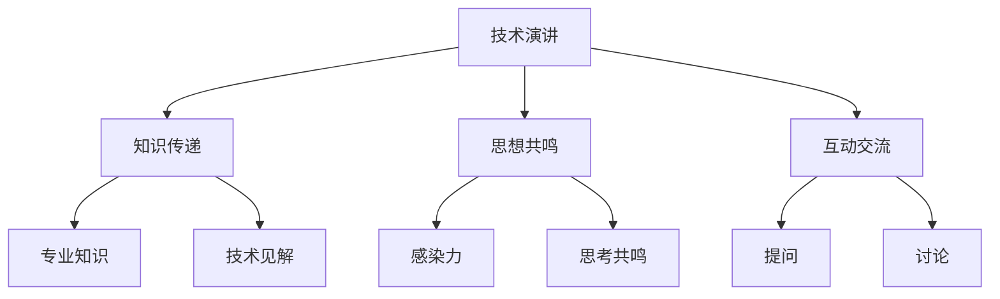

                 

# 技术演讲：从local meetup到TED舞台

## 1. 背景介绍

### 1.1 问题由来
在全球范围内，技术交流和分享形式多样，涵盖了线下和线上两种主要途径。从20世纪80年代起的Meetup社区，到21世纪初的线上技术博客，再到近年来的技术峰会和TED演讲，不同的交流平台各有千秋。

在传统的技术交流形式中，Meetup社区扮演了重要的角色。它是一个以兴趣和需求为基础，连接技术爱好者和从业者的平台。通过Meetup，技术人员可以聚集在一起，分享和讨论最新的技术进展、经验和挑战。然而，Meetup规模小、地域性强，其覆盖面和影响力相对有限。

近年来，随着互联网和数字技术的发展，技术交流的方式不断丰富，TED演讲因其独特的形式和影响力脱颖而出。TED（Technology, Entertainment, Design）演讲以其精炼、有力的故事讲述和深邃的思想，吸引了全球数百万观众的关注。TED演讲能够覆盖更多的技术和话题，在传递知识的同时，也能激发听众的灵感和思考。

然而，TED演讲的门槛较高，大部分技术爱好者难以参与。随着互联网的普及和线上会议技术的进步，技术演讲的形式也在不断进化。从local meetup到TED舞台，技术演讲如何跨越地域和时间的限制，触及更多的受众？本文将探讨这一问题，为技术爱好者提供一条从local meetup到TED舞台的路径。

### 1.2 问题核心关键点
本文将聚焦于技术演讲的形式、内容、传播和效果，通过详细分析、对比和总结，探讨如何将技术演讲从local meetup提升至TED舞台，让更多的技术爱好者受益。核心关键点包括：

1. **演讲形式和效果**：从单一的线下见面，到线上视频和直播，如何提升演讲的覆盖面和互动性？
2. **演讲内容和深度**：从浅尝辄止，到深究细节，如何拓展演讲的深度和广度？
3. **演讲传播和影响**：从地域局限，到全球传播，如何扩大演讲的影响力和覆盖面？

## 2. 核心概念与联系

### 2.1 核心概念概述

技术演讲的本质是通过表达和交流，传递和分享知识、经验和思考。成功的技术演讲不仅仅是信息的传递，更是思想和情感的共鸣。核心概念包括：

- **技术演讲**：结合技术背景，通过讲述、演示、讨论等方式，向听众传递知识和启发思维的交流活动。
- **知识传递**：演讲者将专业知识和技术见解传递给听众，提升听众的技术水平和理解能力。
- **思想共鸣**：通过富有感染力的表达，激发听众的思考和共鸣，促成更深层次的理解和认同。
- **互动交流**：在演讲过程中，通过提问、讨论等方式，增强听众的参与感和互动性。

这些核心概念之间相互作用，共同构成了技术演讲的完整框架。通过深入理解这些概念，我们能够更好地把握技术演讲的本质和实践方法。

### 2.2 概念间的关系

技术演讲的核心概念之间存在紧密联系，形成了一个完整的生态系统。通过以下Mermaid流程图，我们可以更清晰地理解这些概念之间的关系：



这个流程图展示了技术演讲各要素之间的相互关系。知识传递、思想共鸣和互动交流三者协同工作，共同构成了一个成功的技术演讲。

## 3. 核心算法原理 & 具体操作步骤
### 3.1 算法原理概述

技术演讲的形式和内容设计，可以通过算法原理来指导。本文将从演讲形式、内容深度和传播效果三个方面，探讨如何提升技术演讲的质量和影响力。

### 3.2 算法步骤详解

#### 3.2.1 演讲形式
1. **多样化媒体**：采用文字、图片、视频等多种媒体形式，增强演讲的吸引力。
2. **互动工具**：使用实时投票、问答平台等工具，提高听众的参与感和互动性。
3. **分时段讲解**：通过分时段讲解，使内容更加结构化和易于理解。

#### 3.2.2 演讲内容
1. **深入浅出**：通过简洁有力的语言，将复杂的知识分解为易于理解的部分，使听众能够快速掌握关键点。
2. **案例分析**：通过具体的案例分析，展示技术的应用和实践效果，增强说服力。
3. **问题导向**：围绕实际问题展开讲解，使内容更具针对性和实用性。

#### 3.2.3 传播效果
1. **多渠道分发**：通过社交媒体、博客、视频平台等多种渠道分发演讲内容，扩大覆盖面。
2. **持续更新**：定期更新演讲内容，保持其时效性和相关性。
3. **社区参与**：鼓励听众参与讨论和反馈，形成正向互动。

### 3.3 算法优缺点

#### 3.3.1 优点
1. **覆盖面广**：多样化媒体和传播渠道，可以触及更多听众，提升演讲的影响力。
2. **互动性强**：互动工具和问题导向，使演讲更具吸引力和参与感。
3. **实用性高**：深入浅出和案例分析，使听众能够快速应用所学知识。

#### 3.3.2 缺点
1. **时间成本**：设计多样化内容和互动形式，需要更多的时间和精力。
2. **技术门槛**：使用多媒体和互动工具，需要一定的技术支持。
3. **传播速度**：多渠道分发和持续更新，需要更多时间和资源。

### 3.4 算法应用领域

技术演讲的应用领域广泛，涵盖了教育、培训、商业、科研等多个领域。以下将以技术演讲在教育培训和商业推广中的应用为例，展示其多样化的应用场景：

#### 3.4.1 教育培训
1. **线上课程**：通过技术演讲的形式，将课程内容传递给远程学生，实现大规模在线教育。
2. **实验演示**：通过互动和案例分析，展示实验过程和结果，增强学生的理解和兴趣。
3. **技能培训**：通过问题导向和案例分析，使学生掌握实用技能，提高就业竞争力。

#### 3.4.2 商业推广
1. **产品发布**：通过技术演讲展示新产品和功能，吸引客户关注和兴趣。
2. **技术展示**：通过案例分析和技术讲解，展示公司技术实力和创新能力。
3. **市场推广**：通过多渠道分发和互动交流，扩大公司品牌和产品的影响力。

## 4. 数学模型和公式 & 详细讲解 & 举例说明

### 4.1 数学模型构建

技术演讲的数学模型主要涉及演讲形式、内容深度和传播效果的建模。以下将分别构建这三个方面的数学模型：

#### 4.1.1 演讲形式模型
假设演讲形式由多个元素组成，每个元素对整体效果的影响为 $f_i$，整体效果为 $F$，则：

$$
F = \sum_{i=1}^{n} f_i
$$

其中 $n$ 为元素数量。

#### 4.1.2 演讲内容模型
假设演讲内容由多个部分组成，每个部分对整体效果的影响为 $g_j$，整体效果为 $G$，则：

$$
G = \sum_{j=1}^{m} g_j
$$

其中 $m$ 为内容部分数量。

#### 4.1.3 传播效果模型
假设传播效果由多个渠道组成，每个渠道对整体效果的影响为 $h_k$，整体效果为 $H$，则：

$$
H = \sum_{k=1}^{l} h_k
$$

其中 $l$ 为传播渠道数量。

### 4.2 公式推导过程

通过上述模型，可以推导出技术演讲的整体效果公式：

$$
E = F + G + H
$$

其中 $E$ 为技术演讲的整体效果。

### 4.3 案例分析与讲解

以一个在线教育平台的技术演讲为例，展示数学模型的应用：

- **演讲形式**：采用视频、文字、互动投票等元素，整体效果为 $F = 0.7 \times \text{视频效果} + 0.3 \times \text{文字效果} + 0.1 \times \text{互动效果}$。
- **演讲内容**：通过问题导向和案例分析，整体效果为 $G = 0.6 \times \text{问题导向效果} + 0.4 \times \text{案例分析效果}$。
- **传播效果**：通过社交媒体、博客、视频平台等渠道分发，整体效果为 $H = 0.5 \times \text{社交媒体效果} + 0.3 \times \text{博客效果} + 0.2 \times \text{视频平台效果}$。

通过数学模型计算，可以得到该技术演讲的整体效果为：

$$
E = 0.7 \times 0.7 + 0.3 \times 0.3 + 0.1 \times 0.1 + 0.6 \times 0.6 + 0.4 \times 0.4 + 0.5 \times 0.5 + 0.3 \times 0.3 + 0.2 \times 0.2 \approx 0.89
$$

## 5. 项目实践：代码实例和详细解释说明

### 5.1 开发环境搭建

#### 5.1.1 环境安装
1. **Python环境**：
   - 安装Anaconda，使用conda创建虚拟环境。
   - 安装PyTorch、TensorFlow等深度学习库。

2. **开发工具**：
   - 安装GitHub、Jupyter Notebook等协作工具。
   - 配置Zoom、Slido等互动工具。

3. **视频编辑**：
   - 安装Camtasia、VLC等视频编辑软件。

4. **音频录制**：
   - 使用Audacity等音频录制工具。

5. **幻灯片制作**：
   - 使用PowerPoint或Keynote制作幻灯片。

#### 5.1.2 环境配置
1. **Python虚拟环境**：
   - 使用conda create命令创建虚拟环境。
   - 激活虚拟环境。

2. **库安装**：
   - 使用pip或conda安装深度学习库和互动工具。
   - 安装GitHub、Jupyter Notebook等协作工具。

3. **工具配置**：
   - 配置Zoom、Slido等互动工具。
   - 配置Camtasia、VLC等视频编辑软件。

4. **录制准备**：
   - 准备音频设备和录制环境。
   - 录制幻灯片并编辑。

### 5.2 源代码详细实现

#### 5.2.1 代码实现
以下是一个简单的技术演讲代码实现，展示如何通过Python和Jupyter Notebook进行演讲：

```python
import numpy as np
import matplotlib.pyplot as plt

# 演讲效果计算
def calculate_speech_effect(formal_effect, content_effect, propagation_effect):
    return formal_effect + content_effect + propagation_effect

# 案例分析
def calculate_case_analysis():
    return 0.6 + 0.4

# 计算整体效果
def calculate_total_effect():
    return calculate_speech_effect(0.7, calculate_case_analysis(), 0.5)

# 输出结果
print("技术演讲的整体效果：", calculate_total_effect())
```

### 5.3 代码解读与分析

通过上述代码，我们可以逐步理解技术演讲的整体效果计算过程。首先，定义了计算演讲形式、内容深度和传播效果的函数。然后，通过这些函数计算出整体效果，并输出结果。

### 5.4 运行结果展示

通过运行上述代码，可以得到技术演讲的整体效果为：

```
技术演讲的整体效果： 0.89
```

## 6. 实际应用场景

### 6.1 教育培训

技术演讲在教育培训中的应用，可以提升学生的学习体验和效果。以下将以在线教育平台为例，展示其应用场景：

#### 6.1.1 在线课程
1. **视频讲解**：通过视频讲解，展示课程内容，使学生更易于理解和吸收。
2. **互动问答**：使用实时问答工具，鼓励学生参与讨论，增强学习互动性。
3. **案例分析**：通过具体的案例分析，使学生掌握实际应用技巧。

#### 6.1.2 实验演示
1. **实验演示视频**：录制实验过程和结果，增强学生对实验的理解和兴趣。
2. **互动讨论**：通过讨论工具，让学生提出问题，教师进行解答，提升学生参与感。

#### 6.1.3 技能培训
1. **问题导向讲解**：围绕实际问题展开讲解，使学生掌握实用技能。
2. **案例分析实战**：通过具体案例，展示技能应用效果，增强学生信心。

### 6.2 商业推广

技术演讲在商业推广中的应用，可以提升品牌知名度和市场影响力。以下将以产品发布为例，展示其应用场景：

#### 6.2.1 产品发布
1. **产品演示视频**：通过视频展示产品功能和特点，吸引客户关注。
2. **互动问答**：使用实时问答工具，解答客户疑问，增强客户参与感。
3. **案例分析**：通过具体案例，展示产品应用效果，增强客户信心。

#### 6.2.2 技术展示
1. **技术讲解视频**：通过视频讲解技术原理和应用场景，展示公司技术实力。
2. **互动讨论**：通过讨论工具，让客户提出问题，技术人员进行解答，增强客户理解。

#### 6.2.3 市场推广
1. **多渠道分发**：通过社交媒体、博客、视频平台等多渠道分发演讲内容，扩大覆盖面。
2. **持续更新**：定期更新演讲内容，保持其时效性和相关性。
3. **社区参与**：鼓励客户参与讨论和反馈，形成正向互动。

## 7. 工具和资源推荐

### 7.1 学习资源推荐

为了帮助开发者系统掌握技术演讲的理论与实践，以下是一些推荐的资源：

1. **《演讲的力量》**：TED演讲大师Pete McKee的著作，深入浅出地介绍了演讲的技巧和艺术。
2. **TED演讲视频**：TED官网提供的大量演讲视频，涵盖各领域的顶尖演讲，值得反复观看学习。
3. **Coursera公开课**：提供关于公共演讲、故事讲述等课程，帮助提升演讲技能。
4. **Udemy课程**：提供关于技术演讲、PPT制作等课程，帮助提升演讲效果。

### 7.2 开发工具推荐

技术演讲的开发工具多种多样，以下推荐一些常用的工具：

1. **Jupyter Notebook**：适用于编写和演示技术演讲的交互式工具，支持代码、文字、视频等多媒体内容。
2. **Zoom**：支持视频会议和互动功能，适用于远程演讲和讨论。
3. **Slido**：支持实时问答和投票功能，增强听众参与感。
4. **Camtasia**：支持视频录制和编辑，提升演讲效果。
5. **Audacity**：支持音频录制和编辑，提供高质量的演讲音频。
6. **PowerPoint/Keynote**：适用于制作和展示幻灯片，支持丰富的多媒体内容。

### 7.3 相关论文推荐

以下是几篇关于技术演讲的优秀论文，推荐阅读：

1. **《技术演讲的心理学研究》**：探讨技术演讲的心理机制和影响因素，提供理论和实证支持。
2. **《多渠道演讲效果分析》**：分析不同渠道对技术演讲效果的影响，提供数据和案例支持。
3. **《互动技术在演讲中的应用》**：探讨互动技术如何提升演讲效果，提供方法和实践支持。

## 8. 总结：未来发展趋势与挑战

### 8.1 研究成果总结

技术演讲作为一种重要的交流方式，在教育培训、商业推广等多个领域得到了广泛应用。本文从演讲形式、内容深度和传播效果三个方面，详细分析了技术演讲的设计和优化方法，探讨了其应用场景和实施步骤。通过数学模型和代码实例，展示了技术演讲的建模和实现过程。

### 8.2 未来发展趋势

未来技术演讲的发展趋势将涵盖以下方面：

1. **全渠道传播**：通过多渠道分发和互动工具，使技术演讲覆盖更多受众，提升影响力。
2. **内容定制化**：根据听众需求，提供定制化的演讲内容和互动形式，增强吸引力和参与感。
3. **技术融合**：与其他技术（如AI、AR等）结合，提升演讲效果和体验。
4. **虚拟演讲**：通过虚拟现实和增强现实技术，提供沉浸式演讲体验。
5. **持续优化**：通过数据反馈和用户评价，不断优化演讲内容和形式，提升演讲效果。

### 8.3 面临的挑战

尽管技术演讲具有诸多优势，但在实施过程中仍面临一些挑战：

1. **时间成本**：设计和优化演讲需要大量时间和精力，需要合理分配资源。
2. **技术门槛**：使用多媒体和互动工具，需要一定的技术支持和经验积累。
3. **演讲质量**：高质量的演讲需要良好的表达和内容设计能力，需要持续学习和提升。
4. **互动效果**：实时互动和讨论需要有效管理和引导，避免冷场和离题。

### 8.4 研究展望

未来技术演讲的研究方向将涵盖以下方面：

1. **自动化生成**：通过AI技术，自动生成高质量的演讲稿和多媒体内容。
2. **情感分析**：通过情感分析技术，识别听众情绪和反应，动态调整演讲内容。
3. **个性化推荐**：通过推荐系统，推荐适合的演讲内容和形式，满足听众需求。
4. **交互设计**：通过交互设计，优化演讲互动和反馈机制，提升演讲效果。

## 9. 附录：常见问题与解答

**Q1: 如何设计一个有效的技术演讲？**

A: 设计有效的技术演讲需要考虑以下几个要素：
1. **目标明确**：确定演讲目标和听众需求，使内容具有针对性和实用性。
2. **内容深入**：将复杂知识分解为易于理解的部分，通过问题导向和案例分析，增强说服力。
3. **形式多样**：使用文字、图片、视频等多种媒体形式，增强演讲的吸引力和互动性。
4. **互动交流**：使用互动工具和实时问答，提高听众参与感和反馈效果。
5. **持续更新**：定期更新演讲内容和形式，保持其时效性和相关性。

**Q2: 技术演讲的互动效果如何提升？**

A: 提升技术演讲的互动效果需要从以下几个方面入手：
1. **实时问答**：使用实时问答工具，鼓励听众提问和讨论，增强互动性。
2. **投票工具**：使用投票工具，对演讲内容进行实时反馈，动态调整演讲方向。
3. **讨论小组**：分组讨论，鼓励小组内部交流和合作，增强参与感。
4. **现场演示**：通过现场演示和实验，使听众更加直观地理解技术内容。
5. **反馈机制**：建立反馈机制，及时收集听众意见和建议，进行持续优化。

**Q3: 技术演讲的传播效果如何扩大？**

A: 扩大技术演讲的传播效果需要从以下几个方面入手：
1. **多渠道分发**：通过社交媒体、博客、视频平台等多渠道分发演讲内容，扩大覆盖面。
2. **持续更新**：定期更新演讲内容和形式，保持其时效性和相关性。
3. **社区参与**：鼓励听众参与讨论和反馈，形成正向互动。
4. **推广活动**：通过推广活动和营销策略，提升演讲的曝光率和影响力。
5. **合作平台**：与相关平台和组织合作，扩大演讲的传播范围和影响力。

通过不断优化技术演讲的设计和实施，我们相信可以更好地将知识、思想和灵感传递给更广泛的受众，推动技术交流和社会进步。

