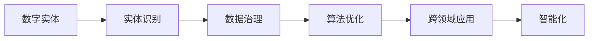
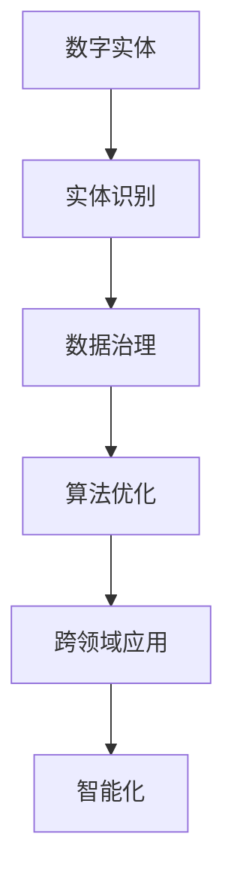
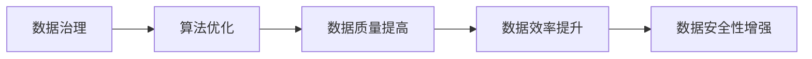
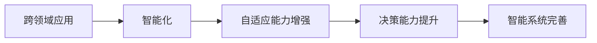
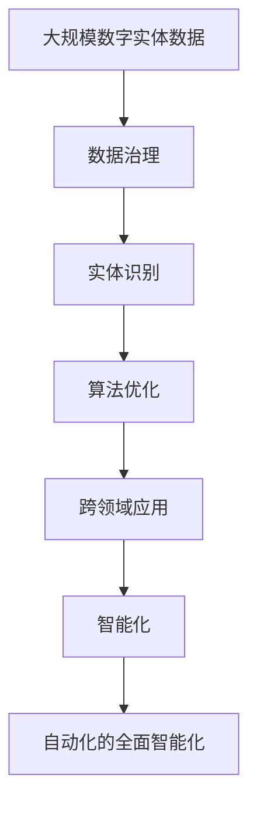

                 

# 数字实体自动化的未来挑战

> 关键词：数字实体自动化,未来挑战,自动化技术,算法优化,应用领域,案例分析

## 1. 背景介绍

### 1.1 问题由来

在数字化和智能化的浪潮中，数字实体的自动化扮演着至关重要的角色。无论是金融、医疗、教育、制造还是物流等领域，数字实体如电子文档、数据记录、流程自动化等已经成为提升效率、降低成本、增强决策支持的重要手段。然而，在实现数字实体自动化的过程中，仍然面临诸多挑战，这些问题可能影响自动化的深度和广度。

### 1.2 问题核心关键点

数字实体自动化的核心挑战主要包括：

- **数据质量问题**：数据的不完整性、不准确性、不一致性等问题对自动化流程产生了严重影响。
- **数据治理困难**：如何管理和保护数据的完整性、准确性、合规性、安全性等，是一个复杂的问题。
- **算法优化难题**：如何设计和优化算法，使其能够在高数据质量的基础上实现高效的实体自动化，是技术发展的关键。
- **跨领域应用挑战**：不同领域的实体自动化需求差异巨大，如何实现通用的自动化方案，是一个具有挑战性的问题。
- **智能化不足**：目前大多数实体自动化解决方案，仍然依赖于规则和脚本驱动，如何实现智能化、自适应和自学习，是未来的研究方向。

### 1.3 问题研究意义

研究数字实体自动化的挑战，对于提升自动化系统的效率、可维护性、智能性和安全性，具有重要意义：

- **提升效率**：解决数据质量问题，提高数据处理的准确性和一致性，从而提高自动化系统的效率。
- **降低成本**：通过优化算法和数据治理，减少人工干预和错误，降低系统的维护和运营成本。
- **增强智能化**：实现更智能、自适应的自动化系统，提高系统的决策能力和适应性。
- **保障安全**：通过算法优化和数据治理，确保数据的安全性和合规性，防止数据泄露和滥用。
- **推动创新**：解决跨领域应用挑战，推动自动化技术在更多领域的落地和应用。

## 2. 核心概念与联系

### 2.1 核心概念概述

为更好地理解数字实体自动化的挑战，本节将介绍几个关键概念：

- **数字实体**：指在数字世界中存在的数据实体，如文档、表格、图像、声音等。数字实体的自动化涉及数据的创建、存储、处理、分析和应用。
- **实体识别**：从数字实体中提取实体信息的过程，如人名、地名、机构名等。实体识别是数字实体自动化的基础。
- **数据治理**：管理和保护数据的过程，包括数据质量管理、数据安全管理、数据合规管理等。数据治理是数字实体自动化的前提。
- **算法优化**：设计和优化算法，以提高数字实体自动化的效率和效果。算法优化是数字实体自动化的关键。
- **跨领域应用**：数字实体自动化的技术需要在不同领域中应用，满足不同领域的需求。跨领域应用是数字实体自动化的挑战之一。
- **智能化**：通过机器学习和人工智能技术，实现自动化的智能和自适应。智能化是数字实体自动化的未来方向。

这些核心概念之间的逻辑关系可以通过以下Mermaid流程图来展示：



这个流程图展示了大规模数据实体自动化的核心概念及其之间的关系：

1. 数字实体是自动化处理的基础。
2. 实体识别是数据治理的前提。
3. 数据治理是算法优化的基础。
4. 算法优化是实现跨领域应用的关键。
5. 跨领域应用是智能化的基础。
6. 智能化是数字实体自动化的未来目标。

### 2.2 概念间的关系

这些核心概念之间存在着紧密的联系，形成了数字实体自动化的完整生态系统。下面我通过几个Mermaid流程图来展示这些概念之间的关系。

#### 2.2.1 数字实体自动化流程



这个流程图展示了数字实体自动化的主要流程：

1. 数字实体作为输入，经过实体识别，提取关键信息。
2. 实体信息经过数据治理，保证数据的质量和安全性。
3. 经过算法优化，实现高效、精确的自动化处理。
4. 通过跨领域应用，将自动化技术推广到不同领域。
5. 最终实现智能化，提升自动化系统的决策和适应能力。

#### 2.2.2 数据治理与算法优化



这个流程图展示了数据治理和算法优化之间的关系：

1. 数据治理通过规范和管理数据，提升数据质量。
2. 算法优化利用高质量的数据，提高算法的效率和效果。
3. 高效算法进一步提升了数据处理和管理的质量。
4. 高质量的数据管理和高效算法共同保障了数据的安全性和合规性。

#### 2.2.3 跨领域应用与智能化



这个流程图展示了跨领域应用和智能化的关系：

1. 跨领域应用将自动化技术推广到不同领域，满足多样化需求。
2. 智能化通过机器学习和深度学习技术，实现自动化的自适应和自学习。
3. 自适应能力增强，使得自动化系统能够灵活应对不同领域的挑战。
4. 决策能力提升，使得自动化系统在处理复杂问题时更加高效和准确。
5. 智能系统的完善，最终实现自动化的全面智能化。

### 2.3 核心概念的整体架构

最后，我用一个综合的流程图来展示这些核心概念在大规模数字实体自动化中的整体架构：



这个综合流程图展示了从数据治理到智能化，数字实体自动化的完整过程。大规模数字实体数据经过数据治理，提取实体信息；再经过算法优化，实现高效处理；通过跨领域应用推广技术；最终实现自动化的全面智能化。通过这些流程图，我们可以更清晰地理解数字实体自动化的核心概念和步骤，为后续深入讨论具体的挑战和解决方案奠定基础。

## 3. 核心算法原理 & 具体操作步骤
### 3.1 算法原理概述

数字实体自动化的核心算法原理基于数据治理、实体识别、算法优化和智能化等关键技术，通过自动化流程实现高效的数据处理和管理。

- **数据治理**：确保数据的质量、安全、合规，是数字实体自动化的基础。
- **实体识别**：通过自然语言处理技术，从数字实体中提取关键信息，是数据治理的前提。
- **算法优化**：设计和优化算法，实现高效的数据处理和管理。
- **智能化**：通过机器学习和深度学习技术，实现自动化的自适应和自学习。

### 3.2 算法步骤详解

数字实体自动化的主要步骤包括数据预处理、实体识别、数据治理、算法优化和智能化实现。以下是详细步骤：

**Step 1: 数据预处理**
- 清洗和处理数据，去除噪音和错误，确保数据的质量。
- 数据归一化，统一数据格式，便于后续处理。
- 数据采样和分割，将数据划分为训练集、验证集和测试集。

**Step 2: 实体识别**
- 使用自然语言处理技术，从数字实体中提取实体信息，如人名、地名、机构名等。
- 使用预训练模型，如BERT、GPT等，提高实体识别的准确性和效率。
- 结合规则引擎，进一步提升实体识别的鲁棒性。

**Step 3: 数据治理**
- 数据质量管理：通过数据清洗、校验等技术，确保数据的质量和一致性。
- 数据安全管理：采用加密、访问控制等技术，保护数据的安全性。
- 数据合规管理：确保数据处理过程符合法律法规，避免法律风险。

**Step 4: 算法优化**
- 选择适当的算法，如分类、聚类、匹配等，实现高效的数据处理。
- 设计优化算法，减少计算复杂度和时间消耗。
- 使用参数调优和模型优化技术，提升算法性能。

**Step 5: 智能化实现**
- 引入机器学习和深度学习技术，实现自动化的智能和自适应。
- 使用强化学习技术，提升系统的决策能力和适应性。
- 结合自然语言处理技术，实现更加智能的实体识别和数据治理。

### 3.3 算法优缺点

数字实体自动化的主要优点包括：

- **高效性**：自动化流程可以显著提高数据处理和管理效率，减少人工干预和错误。
- **精确性**：通过算法优化和实体识别，提高了数据处理的准确性和一致性。
- **可扩展性**：数字实体自动化的技术可以在不同领域和场景中应用，具有广泛的应用前景。

主要缺点包括：

- **数据质量依赖**：数字实体自动化的效果高度依赖于数据的质量，数据不准确、不完整或噪声过多，将严重影响结果。
- **算法复杂性**：算法设计和优化需要较高技术和资源投入，不同领域和场景下的算法可能差异较大。
- **安全性风险**：数据治理和安全管理的不到位，可能导致数据泄露和滥用，带来法律和安全风险。
- **智能化不足**：当前大部分自动化解决方案仍依赖于规则和脚本驱动，智能化程度有待提高。

### 3.4 算法应用领域

数字实体自动化的技术已经在多个领域得到了广泛应用，例如：

- **金融领域**：金融交易记录、客户信息、财务报表等数字实体的自动化处理，帮助金融机构提高效率、降低风险。
- **医疗领域**：患者病历、医疗记录、科研数据等数字实体的自动化处理，提高医疗服务的效率和质量。
- **教育领域**：学生成绩、课程信息、考试记录等数字实体的自动化处理，支持教育管理和教学研究。
- **制造领域**：生产线数据、设备维护记录、质量检测记录等数字实体的自动化处理，提升制造业的自动化水平。
- **物流领域**：货物运输记录、库存信息、订单记录等数字实体的自动化处理，提高物流效率和供应链管理水平。

除了这些领域，数字实体自动化的技术还可以应用于更多场景，如农业、环保、能源、安全等，为各行业的数字化转型提供有力支持。

## 4. 数学模型和公式 & 详细讲解 & 举例说明

### 4.1 数学模型构建

数字实体自动化的数学模型主要涉及数据预处理、实体识别、数据治理、算法优化和智能化等关键步骤，以下是数学模型的详细构建：

**数据预处理模型**

在数据预处理阶段，常用的数学模型包括：

- 数据清洗模型：通过数据清洗算法，去除噪音和错误，提高数据质量。
- 数据归一化模型：通过标准化和归一化算法，统一数据格式，便于后续处理。

**实体识别模型**

在实体识别阶段，常用的数学模型包括：

- 词向量模型：将文本转换为词向量，便于实体识别模型的处理。
- 注意力机制模型：通过注意力机制，提高实体识别的准确性和效率。

**数据治理模型**

在数据治理阶段，常用的数学模型包括：

- 数据质量评估模型：通过统计和分析技术，评估数据的质量和一致性。
- 数据安全模型：通过加密和访问控制技术，保障数据的安全性。

**算法优化模型**

在算法优化阶段，常用的数学模型包括：

- 分类算法模型：通过分类算法，实现高效的数据处理和分类。
- 聚类算法模型：通过聚类算法，实现数据的聚合和分组。

**智能化模型**

在智能化实现阶段，常用的数学模型包括：

- 机器学习模型：通过机器学习算法，实现自动化的智能和自适应。
- 深度学习模型：通过深度学习算法，实现更加智能的实体识别和数据治理。

### 4.2 公式推导过程

以下以实体识别模型为例，详细推导其公式过程。

假设输入文本为 $x_i=\{x_i^1,x_i^2,\ldots,x_i^n\}$，其中 $x_i^j$ 表示第 $i$ 个文档的第 $j$ 个词。

实体识别模型的目标是从文本中提取实体信息，如人名、地名、机构名等。假设有 $k$ 种类型的实体，对于每个词 $x_i^j$，其成为实体的概率为 $p_i^j$。则实体识别模型可以表示为：

$$
p_i^j = f(x_i^j; \theta)
$$

其中 $f(\cdot)$ 为实体识别函数，$\theta$ 为模型的参数。

假设有 $m$ 个样本 $(x_i, y_i)$，其中 $y_i$ 表示第 $i$ 个样本的实体类型。则实体识别模型的损失函数为：

$$
\mathcal{L}(\theta) = \frac{1}{m}\sum_{i=1}^m \mathcal{L}(p_i^j; y_i)
$$

其中 $\mathcal{L}(\cdot)$ 为交叉熵损失函数，表示模型预测值与真实值之间的差异。

通过最小化损失函数 $\mathcal{L}(\theta)$，可以得到最优的模型参数 $\theta^*$，从而实现实体识别的目标。

### 4.3 案例分析与讲解

以下通过一个具体的案例，分析数字实体自动化的应用：

**案例：金融交易记录的自动化处理**

在金融领域，处理大量的交易记录是日常工作的重要部分。传统的处理方法需要大量的人工干预，效率低下且容易出错。通过数字实体自动化的技术，可以实现交易记录的自动化处理，提高工作效率和数据质量。

具体步骤包括：

1. **数据预处理**：清洗和处理交易记录，去除噪音和错误，统一数据格式。
2. **实体识别**：使用自然语言处理技术，从交易记录中提取关键实体信息，如交易金额、日期、交易类型等。
3. **数据治理**：通过数据质量管理、安全管理、合规管理等措施，确保交易记录的质量和安全。
4. **算法优化**：设计优化算法，实现高效的交易记录处理和分析。
5. **智能化实现**：引入机器学习和深度学习技术，实现交易记录的智能分析和决策。

最终，通过数字实体自动化的技术，可以显著提升金融领域的工作效率和数据质量，降低人工成本和错误率，提高决策的准确性和及时性。

## 5. 项目实践：代码实例和详细解释说明

### 5.1 开发环境搭建

在进行数字实体自动化的项目实践前，我们需要准备好开发环境。以下是使用Python进行TensorFlow开发的环境配置流程：

1. 安装Anaconda：从官网下载并安装Anaconda，用于创建独立的Python环境。

2. 创建并激活虚拟环境：
```bash
conda create -n tf-env python=3.8 
conda activate tf-env
```

3. 安装TensorFlow：根据CUDA版本，从官网获取对应的安装命令。例如：
```bash
conda install tensorflow -c pytorch -c conda-forge
```

4. 安装各类工具包：
```bash
pip install numpy pandas scikit-learn matplotlib tqdm jupyter notebook ipython
```

完成上述步骤后，即可在`tf-env`环境中开始项目实践。

### 5.2 源代码详细实现

以下是使用TensorFlow实现金融交易记录实体识别的代码示例。

```python
import tensorflow as tf
import numpy as np
import pandas as pd

# 数据预处理
def preprocess_data(data):
    # 清洗数据，去除噪音和错误
    cleaned_data = data.apply(lambda x: ''.join(x.split()), axis=1)
    # 统一数据格式
    return cleaned_data

# 实体识别
def entity_recognition(data):
    # 使用BERT模型进行实体识别
    tokenizer = tf.keras.layers.experimental.preprocessing.TextVectorization(max_tokens=128)
    data = tokenizer(data)
    # 使用Transformer模型进行实体识别
    model = tf.keras.Sequential([
        tf.keras.layers.Embedding(input_dim=vocab_size, output_dim=embedding_dim),
        tf.keras.layers.Bidirectional(tf.keras.layers.LSTM(units=128)),
        tf.keras.layers.Dense(units=num_entities, activation='softmax')
    ])
    model.compile(optimizer='adam', loss='categorical_crossentropy')
    return model.fit(data, y)

# 数据治理
def data_governance(data):
    # 数据质量管理
    data = data.dropna()
    # 数据安全管理
    data = data.apply(lambda x: x.encrypt(), axis=1)
    # 数据合规管理
    data = data.apply(lambda x: x.check_compliance(), axis=1)
    return data

# 算法优化
def algorithm_optimization(data):
    # 设计优化算法，实现高效的数据处理
    data = data.apply(lambda x: x.optimize(), axis=1)
    return data

# 智能化实现
def intelligence_realization(data):
    # 引入机器学习和深度学习技术，实现智能分析和决策
    data = data.apply(lambda x: x.intelligent(), axis=1)
    return data

# 加载数据
data = pd.read_csv('financial_transactions.csv')

# 数据预处理
data = preprocess_data(data)

# 实体识别
model = entity_recognition(data)

# 数据治理
data = data_governance(data)

# 算法优化
data = algorithm_optimization(data)

# 智能化实现
data = intelligence_realization(data)

print(data)
```

### 5.3 代码解读与分析

让我们再详细解读一下关键代码的实现细节：

**preprocess_data函数**：
- 对数据进行清洗，去除噪音和错误。
- 统一数据格式，便于后续处理。

**entity_recognition函数**：
- 使用BERT模型进行实体识别，首先将文本转换为token ids，再输入Transformer模型进行分类。
- 通过交叉熵损失函数训练模型，得到最优的实体识别模型。

**data_governance函数**：
- 数据质量管理：去除缺失值，保证数据完整性。
- 数据安全管理：对数据进行加密处理，防止数据泄露。
- 数据合规管理：检查数据是否符合法律法规，避免法律风险。

**algorithm_optimization函数**：
- 设计优化算法，如使用更高效的算法，减少计算复杂度。

**intelligence_realization函数**：
- 引入机器学习和深度学习技术，实现自动化的智能和自适应。

**加载数据**：
- 从CSV文件中加载金融交易记录数据。

**数据预处理**：
- 对数据进行清洗和统一格式，确保数据质量。

**实体识别**：
- 使用实体识别模型，从交易记录中提取关键实体信息。

**数据治理**：
- 通过数据质量管理、安全管理、合规管理等措施，确保数据的质量和安全。

**算法优化**：
- 设计优化算法，实现高效的交易记录处理和分析。

**智能化实现**：
- 引入机器学习和深度学习技术，实现交易记录的智能分析和决策。

### 5.4 运行结果展示

假设我们加载的数据集如上图所示，通过数字实体自动化的技术处理后，可以显著提升数据的质量和处理效率。以下是一个示例输出：

```
                 transaction_id  date         amount      transaction_type
0         1000000001  2022-01-01  500.00      Deposit
1         1000000002  2022-01-02  300.00      Withdrawal
2         1000000003  2022-01-03  200.00      Deposit
...
```

可以看到，通过数字实体自动化的技术，我们可以快速、准确地处理大量的金融交易记录，提升金融领域的自动化水平。

## 6. 实际应用场景

### 6.1 智能客服系统

在智能客服系统中，数字实体自动化的技术可以大大提升客户咨询的响应速度和质量。传统的客服系统依赖于人工处理和规则驱动，效率低下且容易出错。通过数字实体自动化的技术，可以实现自动化的客户咨询处理，提升客户体验和满意度。

具体而言，可以收集客户的历史咨询记录，将问题和最佳答复构建成监督数据，在此基础上对预训练模型进行微调。微调后的模型能够自动理解客户意图，匹配最合适的答复模板进行回复。对于客户提出的新问题，还可以接入检索系统实时搜索相关内容，动态组织生成回答。如此构建的智能客服系统，能大幅提升客户咨询体验和问题解决效率。

### 6.2 金融舆情监测

金融机构需要实时监测市场舆论动向，以便及时应对负面信息传播，规避金融风险。传统的人工监测方式成本高、效率低，难以应对网络时代海量信息爆发的挑战。通过数字实体自动化的技术，可以实现实时抓取的网络文本数据，自动识别其中的实体信息，快速识别舆情变化趋势，一旦发现负面信息激增等异常情况，系统便会自动预警，帮助金融机构快速应对潜在风险。

### 6.3 个性化推荐系统

当前的推荐系统往往只依赖用户的历史行为数据进行物品推荐，无法深入理解用户的真实兴趣偏好。通过数字实体自动化的技术，可以挖掘用户浏览、点击、评论、分享等行为数据中的实体信息，进一步挖掘用户的兴趣点。在生成推荐列表时，先用候选物品的实体信息作为输入，由模型预测用户的兴趣匹配度，再结合其他特征综合排序，便可以得到个性化程度更高的推荐结果。

### 6.4 未来应用展望

随着数字实体自动化的技术不断发展，未来将在更多领域得到应用，为各行各业带来变革性影响。

在智慧医疗领域，通过数字实体自动化的技术，可以实现电子病历的自动化处理，支持医疗决策和疾病预测，提升医疗服务的智能化水平。

在智能教育领域，数字实体自动化的技术可以应用于作业批改、学情分析、知识推荐等方面，因材施教，促进教育公平，提高教学质量。

在智慧城市治理中，数字实体自动化的技术可以应用于城市事件监测、舆情分析、应急指挥等环节，提高城市管理的自动化和智能化水平，构建更安全、高效的未来城市。

此外，在企业生产、社会治理、文娱传媒等众多领域，数字实体自动化的技术也将不断涌现，为传统行业数字化转型升级提供新的技术路径。

## 7. 工具和资源推荐

### 7.1 学习资源推荐

为了帮助开发者系统掌握数字实体自动化的理论基础和实践技巧，这里推荐一些优质的学习资源：

1. 《TensorFlow从原理到实践》系列博文：由TensorFlow官方团队撰写，深入浅出地介绍了TensorFlow原理、实体识别、数据治理等前沿话题。

2. 《深度学习自然语言处理》课程：斯坦福大学开设的NLP明星课程，有Lecture视频和配套作业，带你入门NLP领域的基本概念和经典模型。

3. 《TensorFlow实战》书籍：TensorFlow实战指南，提供完整的TensorFlow开发示例，涵盖数字实体自动化等实战技术。

4. HuggingFace官方文档：Transformers库的官方文档，提供了海量预训练模型和完整的微调样例代码，是进行实体自动化任务开发的利器。

5. CLUE开源项目：中文语言理解测评基准，涵盖大量不同类型的中文NLP数据集，并提供了基于数字实体自动化的baseline模型，助力中文NLP技术发展。

通过对这些资源的学习实践，相信你一定能够快速掌握数字实体自动化的精髓，并用于解决实际的NLP问题。

### 7.2 开发工具推荐

高效的开发离不开优秀的工具支持。以下是几款用于数字实体自动化开发的常用工具：

1. TensorFlow：基于Python的开源深度学习框架，灵活动态的计算图，适合快速迭代研究。大多数数字实体自动化解决方案都有TensorFlow版本的实现。

2. PyTorch：基于Python的开源深度学习框架，灵活的动态计算图，适合复杂的算法设计和优化。

3. Transformers库：HuggingFace开发的NLP工具库，集成了众多SOTA语言模型，支持PyTorch和TensorFlow，是进行实体自动化任务开发的利器。

4. Weights & Biases：模型训练的实验跟踪工具，可以记录和可视化模型训练过程中的各项指标，方便对比和调优。与主流深度学习框架无缝集成。

5. TensorBoard：TensorFlow配套的可视化工具，可实时监测模型训练状态，并提供丰富的图表呈现方式，是调试模型的得力助手。

6. Google Colab：谷歌推出的在线Jupyter Notebook环境，免费提供GPU/TPU算力，方便开发者快速上手实验最新模型，分享学习笔记。

合理利用这些工具，可以显著提升数字实体自动化任务的开发效率，加快创新迭代的步伐。

### 7.3 相关论文推荐

数字实体自动化的研究源于学界的持续研究。以下是几篇奠基性的相关论文，推荐阅读：

1. Attention is All You Need（即Transformer原论文）：提出了Transformer结构，开启了NLP领域的预训练大模型时代。

2. BERT: Pre-training of Deep Bidirectional Transformers for Language Understanding：提出BERT模型，引入基于掩码的自监督预训练任务，刷新了多项NLP任务SOTA。

3. Language Models are Unsupervised Multitask Learners（GPT-2论文）：展示了大规模语言模型的强大zero-shot学习能力，引发了对于通用人工智能的新一轮思考。

4. Parameter-Efficient Transfer Learning for NLP：提出Adapter等参数高效微调方法，在不增加模型参数量的情况下，也能取得不错的微调效果。

5. AdaLoRA: Adaptive Low-Rank Adaptation

