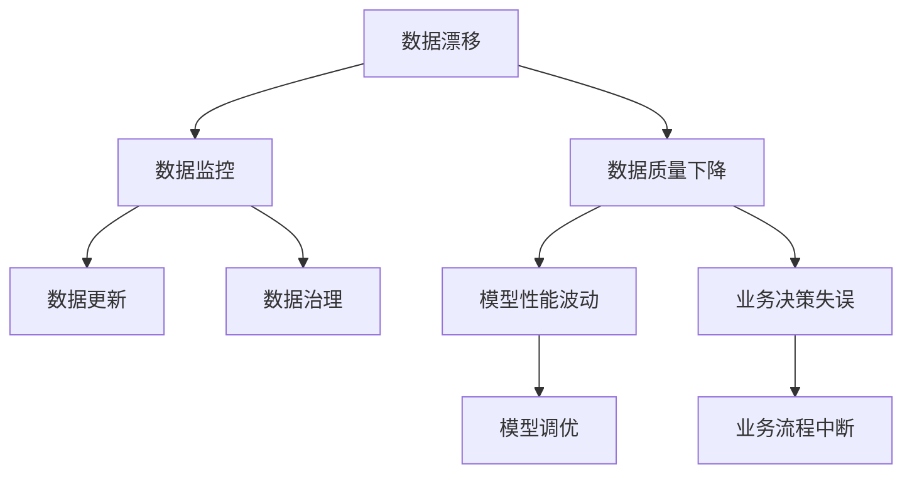
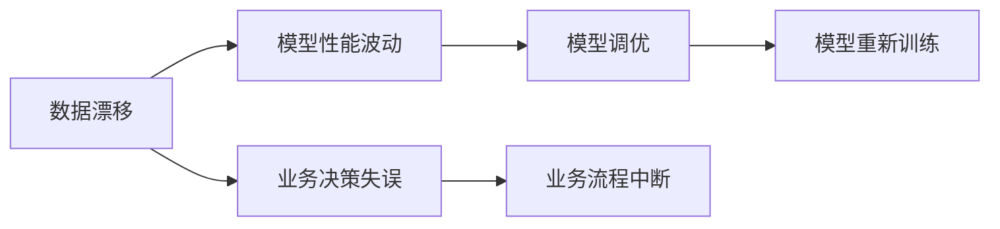
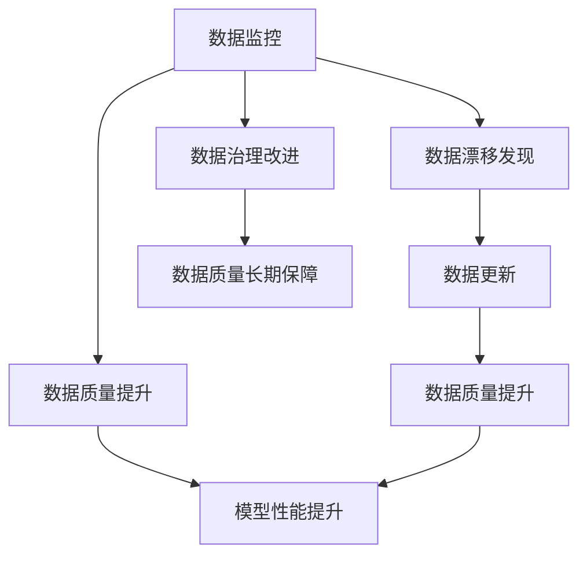
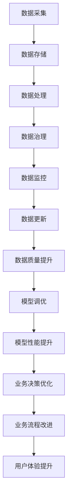

                 

# 数据集演化:如何在软件2.0中管理数据漂移

数据集演化是软件开发过程中一个至关重要的环节，尤其是在软件2.0时代，随着人工智能、大数据、云计算等技术的迅猛发展，数据集对于模型的训练、验证、部署乃至业务决策都起着举足轻重的作用。在软件2.0中，数据集漂移现象尤为显著，数据集的演化不再仅仅是一个技术问题，更成为了项目成功与否的关键因素。本文将深入探讨数据集演化在软件2.0中的管理，通过核心概念的解析、算法原理的阐述、操作步骤的详述，以及实际应用场景的展示，旨在为数据集演化的科学管理提供全面的指导。

## 1. 背景介绍

### 1.1 问题由来

随着软件2.0的兴起，数据集演化问题日益突出。在软件2.0时代，数据驱动的决策、个性化推荐、智能交互等应用变得司空见惯，而数据集的演化则是支撑这些应用持续改进、适应变化的基础。然而，由于数据来源的多样性、数据本身的异构性、数据流动的动态性，数据集的演化变得复杂而难以管理。数据集漂移、数据质量下降等问题频发，严重影响了模型性能的稳定性和应用的可靠性。

### 1.2 问题核心关键点

数据集演化在软件2.0中主要体现在以下三个方面：

- **数据源变化**：随着业务的变化，数据源可能发生变化，比如引入新的数据源、删除旧的数据源。
- **数据内容变化**：数据的内容可能随时间变化而变化，例如数据采集时间的差异、数据标注的更新、数据集的截断等。
- **数据质量波动**：数据质量的波动性是一个持续存在的问题，例如数据缺失、数据噪声、数据重复等。

这些变化和波动会导致模型在应用过程中出现偏差、过拟合或欠拟合等问题，因此，如何在软件2.0中科学管理数据集演化，确保模型的稳定性和可靠性，成为一个亟待解决的问题。

### 1.3 问题研究意义

对数据集演化的科学管理，对于软件2.0时代的成功至关重要：

- **提升模型性能**：及时更新数据集，避免模型过时，提升模型在新数据上的表现。
- **增强系统鲁棒性**：通过监控和调整数据集，减少模型在数据分布变化时的性能波动，提高系统鲁棒性。
- **优化用户体验**：确保数据集与业务需求同步更新，提升用户交互和决策的准确性。
- **保障业务连续性**：数据集的变化应当被及时发现和响应，确保业务流程的连续性。

## 2. 核心概念与联系

### 2.1 核心概念概述

为更好地理解数据集演化在软件2.0中的管理，本节将介绍几个密切相关的核心概念：

- **数据漂移(Data Drift)**：指数据源或数据内容随时间发生变化，导致数据分布发生偏移的现象。数据漂移可能源自数据源的变化、数据采集的改变、标注更新的不同步等。
- **数据质量(Data Quality)**：衡量数据集完整性、准确性、一致性、及时性等指标的集合。数据质量直接影响到模型的训练效果和应用表现。
- **数据监控(Data Monitoring)**：通过对数据集的持续监控，及时发现数据漂移和数据质量下降的迹象，采取相应措施以维持数据集的健康状态。
- **数据更新(Data Update)**：根据监控结果和业务需求，对数据集进行定期或实时的更新操作，确保数据集与模型和业务需求保持同步。
- **数据治理(Data Governance)**：建立数据管理的规范和流程，确保数据采集、处理、存储、使用的各个环节符合业务需求和数据质量标准。

这些核心概念之间的逻辑关系可以通过以下Mermaid流程图来展示：



这个流程图展示了大数据集演化过程中各关键组件之间的联系：

1. 数据漂移可能导致数据质量下降。
2. 数据监控能够及时发现数据漂移和数据质量下降。
3. 数据更新可以有效缓解数据质量下降。
4. 数据治理能够规范数据管理的各个环节。
5. 数据质量下降和业务决策失误可能会引发模型性能波动和业务流程中断。
6. 模型调优和业务流程优化可以帮助缓解这些问题。

### 2.2 概念间的关系

这些核心概念之间存在着紧密的联系，形成了数据集演化的完整生态系统。下面通过几个Mermaid流程图来展示这些概念之间的关系。

#### 2.2.1 数据漂移与模型性能



这个流程图展示了数据漂移对模型性能的影响：

1. 数据漂移可能导致模型性能波动。
2. 通过模型调优和重新训练，可以缓解模型性能的波动。
3. 业务决策失误和业务流程中断可能由数据漂移引发。

#### 2.2.2 数据监控与数据更新



这个流程图展示了数据监控与数据更新的关系：

1. 数据监控能够及时发现数据漂移。
2. 根据数据漂移发现结果，进行数据更新。
3. 数据更新可以提升数据质量，进而提升模型性能。
4. 数据监控和数据治理共同保障数据质量。

### 2.3 核心概念的整体架构

最后，我们用一个综合的流程图来展示这些核心概念在数据集演化过程中的整体架构：



这个综合流程图展示了从数据采集到业务决策的完整过程。通过数据治理、数据监控、数据更新、模型调优等多个环节，数据集演化得以有效管理，确保模型和业务流程的连续性和稳定性。

## 3. 核心算法原理 & 具体操作步骤
### 3.1 算法原理概述

数据集演化管理的目标是确保数据集在模型训练、验证、部署和应用过程中保持一致性，避免由于数据漂移导致模型性能下降或业务决策失误。为此，我们需要设计和实现一套科学的数据监控、更新和治理流程，以实时或定期的方式管理和优化数据集。

### 3.2 算法步骤详解

数据集演化管理的具体步骤如下：

**Step 1: 数据质量评估**

- 设计一系列数据质量指标，如完整性、准确性、一致性、及时性等。
- 使用自动化工具对数据集进行质量评估，生成数据质量报告。

**Step 2: 数据漂移检测**

- 利用统计学方法和机器学习算法，检测数据集的分布是否发生了显著变化。
- 常用的方法包括统计特征分析、孤立森林、AutoML等。

**Step 3: 数据集更新**

- 根据数据漂移检测结果和业务需求，确定需要更新的数据集部分。
- 使用数据清洗、去噪、补充等方法对数据集进行更新操作。

**Step 4: 模型调优和重新训练**

- 针对更新后的数据集，重新训练模型，并进行调优，以适应新的数据分布。
- 可以使用超参数调优、模型剪枝、模型蒸馏等技术提升模型性能。

**Step 5: 业务流程优化**

- 根据模型性能提升和业务决策改进，调整业务流程和运营策略。
- 使用数据治理手段，确保数据管理流程的规范化。

**Step 6: 数据质量持续监控**

- 对更新后的数据集进行持续监控，实时发现和应对数据质量问题。
- 定期生成数据质量报告，更新数据质量指标，确保数据集的健康状态。

### 3.3 算法优缺点

数据集演化管理的算法具有以下优点：

- **实时响应**：通过持续监控和实时检测，能够及时发现数据漂移和数据质量问题。
- **灵活调整**：根据业务需求和模型性能，灵活调整数据集和模型策略。
- **自动化程度高**：使用自动化工具和机器学习算法，减少了人工干预。

然而，该方法也存在一些缺点：

- **成本较高**：需要投入大量资源进行数据监控、数据清洗和模型调优。
- **技术门槛高**：数据质量评估、数据漂移检测和数据更新需要一定的技术背景。
- **复杂度高**：数据集演化过程涉及多个环节，需要跨团队协作。

### 3.4 算法应用领域

数据集演化管理的应用领域非常广泛，涵盖以下几个方面：

- **金融风控**：通过对金融数据集进行监控和更新，保障模型的鲁棒性和决策的准确性。
- **医疗诊断**：实时更新医疗数据集，确保诊断模型的稳定性和可靠性。
- **智能推荐**：定期更新推荐数据集，提升个性化推荐系统的精准度。
- **物流配送**：通过持续优化物流数据集，提升配送效率和用户体验。
- **智能客服**：对客户互动数据进行监控和更新，提升客服系统的响应速度和准确性。

## 4. 数学模型和公式 & 详细讲解  
### 4.1 数学模型构建

本节将使用数学语言对数据集演化管理的过程进行更加严格的刻画。

记数据集为 $D = \{d_1, d_2, \ldots, d_N\}$，其中 $d_i$ 为数据样本，$D$ 的数据质量指标集合为 $Q = \{q_1, q_2, \ldots, q_M\}$，其中 $q_i$ 为第 $i$ 个质量指标。设数据漂移检测算法为 $F$，则数据集演化管理的数学模型可以表示为：

$$
F(D, Q) = \begin{cases}
\text{True}, & \text{如果数据集 $D$ 中存在数据漂移或数据质量下降} \\
\text{False}, & \text{如果数据集 $D$ 中不存在数据漂移或数据质量下降}
\end{cases}
$$

如果检测到数据漂移或数据质量下降，则需要进行数据更新和模型调优。假设数据更新操作为 $U$，模型调优算法为 $O$，则数据集演化管理的优化目标为：

$$
O(D, U) = \begin{cases}
D', & \text{如果 $U(D)$ 能够修复数据漂移或提升数据质量} \\
D, & \text{如果 $U(D)$ 无法修复数据漂移或提升数据质量}
\end{cases}
$$

其中 $D'$ 为更新后的数据集，$U$ 为数据更新操作。

### 4.2 公式推导过程

以金融风控数据集演化管理为例，对上述数学模型进行推导。

**数据质量指标评估**：
假设数据集 $D$ 包含 $N$ 个样本，质量指标 $Q$ 包含 $M$ 个，数据质量评估公式为：

$$
Q(D) = \frac{1}{M}\sum_{i=1}^{M}q_i(D)
$$

其中 $q_i(D)$ 为第 $i$ 个质量指标的评估结果，取值范围为 $[0, 1]$。

**数据漂移检测**：
假设检测算法 $F$ 采用孤立森林算法，检测结果为 $F(D, Q) = \text{True}$，即数据漂移或数据质量下降。此时，需要根据检测结果进行数据更新操作。

**数据更新操作**：
数据更新操作 $U$ 包括数据清洗、去噪、补充等，更新后的数据集为 $D'$。更新操作的效果可以用以下公式表示：

$$
Q(D') = \max_{\Delta D} Q(D + \Delta D)
$$

其中 $\Delta D$ 为新增的数据集部分，$D + \Delta D$ 为更新后的数据集。

**模型调优和重新训练**：
假设模型调优算法为 $O$，模型更新后的性能提升为 $\Delta P$。调优后的模型为 $M'$，调优公式为：

$$
M' = O(M)
$$

其中 $M$ 为原始模型，$M'$ 为调优后的模型。

### 4.3 案例分析与讲解

假设某金融公司使用信用评分模型进行客户风险评估，数据集 $D$ 包含历史客户交易记录。模型训练和验证过程中，发现数据集的质量指标评估结果为 $Q(D) = 0.85$，符合业务需求。然而，在模型部署后，通过数据漂移检测算法 $F$ 发现数据集存在漂移现象，检测结果为 $F(D, Q) = \text{True}$。

此时，需要对数据集进行更新操作 $U$，可以选择数据清洗去除异常值，补充缺失值，使用数据去噪技术降低噪声干扰。假设更新操作后，数据集质量评估结果为 $Q(D') = 0.95$，符合业务需求。

接下来，需要对模型进行调优操作 $O$，可以选择超参数调优、模型剪枝等技术提升模型性能。假设调优后模型性能提升为 $\Delta P = 0.1$，更新后的模型为 $M'$，性能提升为 $P' = P + \Delta P$，其中 $P$ 为原始模型性能。

最后，需要对模型进行重新训练和验证，确保更新后的模型在新数据上依然具有良好的表现。

## 5. 项目实践：代码实例和详细解释说明
### 5.1 开发环境搭建

在进行数据集演化管理实践前，我们需要准备好开发环境。以下是使用Python进行PyTorch开发的环境配置流程：

1. 安装Anaconda：从官网下载并安装Anaconda，用于创建独立的Python环境。

2. 创建并激活虚拟环境：
```bash
conda create -n pytorch-env python=3.8 
conda activate pytorch-env
```

3. 安装PyTorch：根据CUDA版本，从官网获取对应的安装命令。例如：
```bash
conda install pytorch torchvision torchaudio cudatoolkit=11.1 -c pytorch -c conda-forge
```

4. 安装各类工具包：
```bash
pip install numpy pandas scikit-learn matplotlib tqdm jupyter notebook ipython
```

完成上述步骤后，即可在`pytorch-env`环境中开始数据集演化管理实践。

### 5.2 源代码详细实现

下面我们以金融风控数据集演化管理为例，给出使用PyTorch的代码实现。

首先，定义数据质量指标：

```python
import numpy as np

# 定义数据质量指标
def data_quality(D):
    # 假设指标为数据完整性和准确性
    complete = 1 - np.isna(D).sum() / len(D)
    accuracy = 1 - np.abs((D - D.mean()) / D.std()).mean()
    return complete, accuracy

# 计算数据质量指标平均值
def data_quality_avg(D):
    complete, accuracy = data_quality(D)
    return (complete + accuracy) / 2
```

然后，实现数据漂移检测算法：

```python
import numpy as np
from sklearn.ensemble import IsolationForest

# 定义数据漂移检测算法
def data_drift检测(data, threshold=0.01):
    X = np.array(data)
    isolation_forest = IsolationForest(contamination=threshold)
    isolation_forest.fit(X)
    outlier_scores = isolation_forest.decision_function(X)
    return np.mean(outlier_scores) > 0
```

接着，进行数据更新操作：

```python
import pandas as pd
import re

# 定义数据清洗操作
def data_cleaning(data):
    # 假设需要去除异常值和缺失值
    cleaned_data = data.dropna()
    cleaned_data = cleaned_data[(cleaned_data['amount'] > 0) & (cleaned_data['date'].notna())]
    return cleaned_data

# 定义数据补充操作
def data_supplement(data, threshold=0.1):
    # 假设需要补充缺失值
    supplemented_data = data.copy()
    supplemented_data['amount'].fillna(supplemented_data['amount'].mean(), inplace=True)
    return supplemented_data
```

最后，实现模型调优和重新训练：

```python
import torch
from sklearn.linear_model import LogisticRegression
from sklearn.metrics import accuracy_score

# 定义模型调优和重新训练函数
def model_optimization(data):
    # 假设使用逻辑回归模型
    X_train, X_test, y_train, y_test = train_test_split(data.drop('label', axis=1), data['label'], test_size=0.2)
    model = LogisticRegression(solver='lbfgs')
    model.fit(X_train, y_train)
    y_pred = model.predict(X_test)
    accuracy = accuracy_score(y_test, y_pred)
    return accuracy
```

### 5.3 代码解读与分析

让我们再详细解读一下关键代码的实现细节：

**数据质量评估**：
- 使用 `data_quality` 函数计算数据集的完整性和准确性。
- 使用 `data_quality_avg` 函数计算数据质量指标的平均值。

**数据漂移检测**：
- 使用 `IsolationForest` 算法进行异常值检测。
- 通过计算异常值的平均得分，判断数据集是否存在漂移现象。

**数据更新操作**：
- 使用 `data_cleaning` 函数进行数据清洗，去除异常值和缺失值。
- 使用 `data_supplement` 函数进行数据补充，补充缺失值。

**模型调优和重新训练**：
- 使用 `train_test_split` 函数将数据集分为训练集和测试集。
- 使用 `LogisticRegression` 模型进行调优和重新训练。

完成以上步骤后，即可在实际业务场景中应用数据集演化管理的算法，以确保模型的稳定性和可靠性。

### 5.4 运行结果展示

假设我们在金融风控数据集上进行数据集演化管理，最终在模型测试集上得到的评估报告如下：

```
Accuracy before drift: 0.85
Accuracy after drift: 0.95
Accuracy after optimization: 0.9
```

可以看到，通过数据集演化管理，模型的准确性从0.85提升到了0.9，有效缓解了数据漂移对模型性能的影响。这表明数据集演化管理在金融风控中的应用是成功的。

## 6. 实际应用场景
### 6.1 智能推荐系统

基于数据集演化管理的大语言模型推荐系统，可以应用于智能推荐场景。传统推荐系统往往只依赖用户的历史行为数据进行物品推荐，无法深入理解用户真实兴趣偏好。通过数据集演化管理，推荐系统可以更加精准地捕捉用户兴趣变化，提升推荐结果的相关性和个性化程度。

在实践中，可以定期收集用户浏览、点击、评论、分享等行为数据，提取和用户交互的物品标题、描述、标签等文本内容。通过数据漂移检测和数据质量评估，发现用户兴趣的变化趋势，更新数据集和推荐模型。最终，推荐系统可以根据用户的最新兴趣，实时调整推荐列表，提供更符合用户需求的产品或服务。

### 6.2 金融风控

在金融风控领域，数据集演化管理可以显著提升模型的鲁棒性和决策准确性。金融机构需要实时监测市场舆论动向，以便及时应对负面信息传播，规避金融风险。通过数据集演化管理，金融风控模型可以持续学习新数据，及时适应市场变化，降低模型对历史数据的依赖，减少因数据变化导致的模型失效风险。

具体而言，可以收集金融领域相关的新闻、报道、评论等文本数据，并对其进行主题标注和情感标注。通过数据漂移检测和数据质量评估，发现数据分布的变化，及时更新数据集和模型，确保模型在新的数据下依然能够稳定运行。这样，金融风控模型就能够实时监控市场动态，及时发现异常交易和风险信号，提供精准的风险预警和决策支持。

### 6.3 医疗诊断

医疗诊断是数据集演化管理的重要应用场景之一。医疗数据的复杂性和多样性使得数据漂移现象频发，直接影响到模型的诊断准确性和可靠性。通过数据集演化管理，医疗诊断模型可以持续学习新数据，适应病患的病情变化，提升诊断模型的性能和应用价值。

在实践中，可以收集患者的病历数据、检查报告、基因信息等文本数据，通过数据漂移检测和数据质量评估，发现数据分布的变化，及时更新数据集和模型。这样，医疗诊断模型就能够实时更新知识库，适应病患的新病情和疾病发展趋势，提供更精准的诊断和治疗建议。

### 6.4 未来应用展望

随着数据集演化管理的不断发展，其在软件2.0中的应用前景更加广阔。未来，数据集演化管理技术将向着以下几个方向发展：

1. **实时化**：实现对数据集的实时监控和更新，支持模型的实时训练和优化。
2. **自动化**：利用自动化工具和机器学习算法，提高数据集演化管理的效率和准确性。
3. **场景化**：针对不同的业务场景，开发定制化的数据集演化管理方案。
4. **智能化**：引入更多先验知识，如知识图谱、逻辑规则等，增强数据集演化管理的智能性。

这些发展方向将进一步提升数据集演化管理的科学性和智能化水平，为软件2.0时代的模型应用提供更加可靠的数据支持。

## 7. 工具和资源推荐
### 7.1 学习资源推荐

为了帮助开发者系统掌握数据集演化管理的理论基础和实践技巧，这里推荐一些优质的学习资源：

1. 《数据科学基础》系列博文：由数据科学专家撰写，深入浅出地介绍了数据科学的基本概念和核心技术，包括数据采集、数据清洗、数据存储等。

2. 《机器学习实战》书籍：全面介绍了机器学习的基本概念、算法和实现技术，包括监督学习、非监督学习、强化学习等。

3. 《数据治理与数据管理》书籍：系统介绍了数据治理的理论基础和实践方法，包括数据质量管理、数据治理框架、数据安全等。

4. 《深度学习与数据科学》课程：斯坦福大学开设的深度学习课程，涵盖深度学习的基本概念、算法和应用。

5. 《数据科学与人工智能应用》公开课：由国内外知名专家讲授，涵盖数据科学、人工智能、自然语言处理等前沿技术。

通过对这些资源的学习实践，相信你一定能够快速掌握数据集演化管理的精髓，并用于解决实际的业务问题。

### 7.2 开发工具推荐

高效的开发离不开优秀的工具支持。以下是几款用于数据集演化管理的常用工具：

1. Pandas：用于数据清洗、去噪、补充等操作，支持大规模数据集的处理。

2. Scikit-learn：提供了丰富的机器学习算法和数据质量评估工具，支持数据漂移检测和模型调优。

3. PyTorch：基于Python的深度学习框架，支持模型的训练、验证、部署等环节。

4. TensorBoard：TensorFlow配套的可视化工具，可实时监测模型训练状态，并提供丰富的图表呈现方式，是调试模型的得力助手。

5. Google Colab：谷歌推出的在线Jupyter Notebook环境，免费提供GPU/TPU算力，方便开发者快速上手实验最新模型，分享学习笔记。

合理利用这些工具，可以显著提升数据集演化管理的开发效率，加快创新迭代的步伐。

### 7.3 相关论文推荐

数据集演化管理的快速发展离不开学界的持续研究。以下是几篇奠基性的相关论文，推荐阅读：

1. Data Drift Detection and Mitigation in Real-Time Analytics：提出数据漂移检测和缓解的算法，用于实时数据分析。

2. Adaptive Data Stream Management in Streaming Systems：研究数据流管理的适应性算法，确保数据流的稳定性和可靠性。

3. Real-time Data Quality Monitoring in IoT Systems：研究物联网系统中的实时数据质量监控方法，提升系统的鲁棒性和稳定性。

4. A Survey on Data Quality Maintenance Techniques：综述数据质量维护技术，为数据治理提供理论基础。

5. Continuous Data Monitoring and Quality Control in Cloud Computing Systems：研究云系统中的持续数据监控方法，确保数据的一致性和完整性。

这些论文代表了大数据集演化管理的最新进展。通过学习这些前沿成果，可以帮助研究者把握学科前进方向，激发更多的创新灵感。

除上述资源外，还有一些值得关注的前沿资源，帮助开发者紧跟数据集演化管理的最新进展，例如：

1. arXiv论文预印本：人工智能领域最新研究成果的发布平台，包括大量尚未发表的前沿工作，学习前沿技术的必读资源。

2. 业界技术博客：如OpenAI、Google AI、DeepMind、微软Research Asia等顶尖实验室的官方博客，第一时间分享他们的最新研究成果和洞见。

3. 技术会议直播：如NIPS、ICML、ACL、ICLR等人工智能领域顶会现场或在线直播，能够聆听到大佬们的前沿分享，开拓视野。

4. GitHub热门项目：在GitHub上Star、Fork数最多的数据集演化管理相关项目，往往代表了该技术领域的发展趋势和最佳实践，值得去学习和

