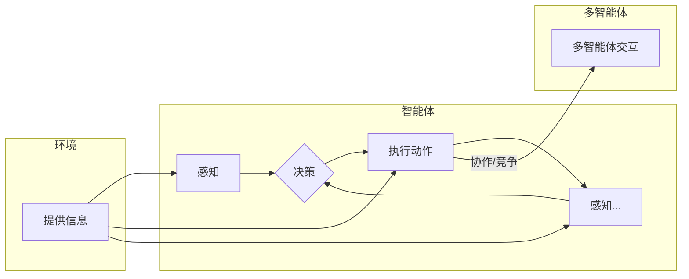

# AI Agent构建的技术要点

> 关键词：人工智能，智能体，Agent，强化学习，环境建模，决策过程，多智能体系统，应用场景

## 1. 背景介绍

随着人工智能技术的飞速发展，智能体（Agent）作为人工智能系统中的核心概念，逐渐成为研究的热点。AI Agent是指能够感知环境、执行动作、并能通过学习不断优化自身行为的实体。在游戏、机器人、智能交通、金融等领域，AI Agent的应用日益广泛。构建一个高效、可靠的AI Agent需要考虑多个技术要点，本文将深入探讨这些要点，以期为AI Agent的开发提供指导。

## 2. 核心概念与联系

### 2.1 核心概念

#### 智能体（Agent）
智能体是具有自主性、适应性、反应性和目标导向性的实体，能够感知环境、执行动作，并通过学习不断优化自身行为。

#### 环境（Environment）
环境是智能体行动的场所，为智能体提供感知信息和反馈。环境可以是物理环境，也可以是虚拟环境。

#### 动作（Action）
动作是智能体在环境中执行的操作，如移动、拾取物品等。

#### 状态（State）
状态是环境中影响智能体行为的信息集合，如智能体的位置、方向、拥有的资源等。

#### 奖励（Reward）
奖励是智能体采取某个动作后获得的反馈信号，用于指导智能体学习。

#### 决策过程
决策过程是指智能体根据当前状态和奖励，选择最优动作的过程。

#### 多智能体系统
多智能体系统是由多个智能体组成的系统，智能体之间可以相互协作或竞争。

### 2.2 核心概念原理和架构的 Mermaid 流程图



## 3. 核心算法原理 & 具体操作步骤

### 3.1 算法原理概述

AI Agent构建的核心在于设计有效的决策过程，常见的方法包括：

- **规则基方法**：基于预设的规则进行决策。
- **决策树**：基于决策树进行决策。
- **贝叶斯网络**：基于概率推理进行决策。
- **强化学习**：通过学习与环境交互中的奖励信号，优化决策过程。

### 3.2 算法步骤详解

1. **定义智能体目标和环境**：明确智能体的任务和目标，构建相应的环境模型。
2. **选择决策算法**：根据任务特点选择合适的决策算法，如规则基方法、决策树、贝叶斯网络或强化学习。
3. **实现决策过程**：根据所选算法实现智能体的决策过程。
4. **训练和测试**：在训练数据上训练智能体，并在测试数据上评估其性能。

### 3.3 算法优缺点

| 算法 | 优点 | 缺点 |
|---|---|---|
| 规则基方法 | 简单易懂，易于实现 | 缺乏自适应性，难以处理复杂问题 |
| 决策树 | 易于解释，易于实现 | 可能存在过拟合，难以处理连续值 |
| 贝叶斯网络 | 可处理不确定性，易于解释 | 计算复杂度较高，难以处理大规模数据 |
| 强化学习 | 自适应性强，适用于复杂问题 | 训练过程可能不稳定，难以解释 |

### 3.4 算法应用领域

AI Agent在多个领域都有广泛应用，如：

- 游戏：如棋类游戏、电子竞技等。
- 机器人：如自动驾驶、智能机器人等。
- 智能交通：如智能交通信号控制、自动驾驶等。
- 金融：如智能投顾、风险评估等。

## 4. 数学模型和公式 & 详细讲解 & 举例说明

### 4.1 数学模型构建

强化学习的数学模型通常包含以下几个部分：

- 状态空间 $S$：智能体可能处于的所有状态集合。
- 动作空间 $A$：智能体可能采取的所有动作集合。
- 状态-动作奖励函数 $R(s, a)$：智能体在状态 $s$ 采取动作 $a$ 后获得的奖励。
- 状态转移概率 $P(s', s, a)$：智能体在状态 $s$ 采取动作 $a$ 后转移到状态 $s'$ 的概率。
- 策略函数 $\pi(s)$：智能体在状态 $s$ 采取动作 $a$ 的概率。

### 4.2 公式推导过程

**马尔可夫决策过程（MDP）**：

- 状态转移概率：$P(s', s, a) = P(s' | s, a)$
- 累积奖励：$G_t = \sum_{k=0}^{\infty} \gamma^k R(s_t, a_t)$，其中 $\gamma$ 为折扣因子。

**策略迭代算法**：

1. 初始化策略 $\pi^0(s)$
2. 对于 $i$ 从 1 到无穷大：
   - 对于每个状态 $s$：
     - 计算 $\pi^{(i)}(a|s) = \frac{\pi^{(i-1)}(a|s)R(s,a)}{\sum_{a' \in A} \pi^{(i-1)}(a'|s)R(s,a')}$

**Q学习算法**：

1. 初始化 $Q(s,a) = 0$
2. 对于每个时间步 $t$：
   - 选择动作 $a_t \in \pi(a|s_t)$
   - 执行动作 $a_t$，获得奖励 $R(s_t, a_t)$，转移到状态 $s_{t+1}$
   - 更新 $Q(s_t, a_t) = Q(s_t, a_t) + \alpha [R(s_t, a_t) + \gamma \max_{a' \in A} Q(s_{t+1}, a') - Q(s_t, a_t)]$

### 4.3 案例分析与讲解

**案例：无人驾驶**

在无人驾驶场景中，智能体为自动驾驶汽车，环境为道路、交通信号、其他车辆等。智能体的目标是安全、高效地行驶到目的地。

1. **状态空间**：包括汽车的位置、速度、方向、周围车辆和交通信号等。
2. **动作空间**：包括加速、减速、转向、换道等。
3. **状态-动作奖励函数**：奖励函数可以根据行驶距离、时间、安全性能等指标设计。
4. **状态转移概率**：根据交通规则、车辆动力学模型等因素计算。
5. **策略函数**：可以使用Q学习等强化学习方法进行学习。

## 5. 项目实践：代码实例和详细解释说明

### 5.1 开发环境搭建

以下以Python为例，介绍无人驾驶智能体的开发环境搭建步骤：

1. 安装Python：从官网下载并安装Python。
2. 安装PyTorch：根据CUDA版本，从官网获取对应的安装命令。
3. 安装其他依赖库：如NumPy、Scikit-learn等。

### 5.2 源代码详细实现

以下为无人驾驶智能体Q学习算法的Python代码实现：

```python
import numpy as np

class QLearningAgent:
    def __init__(self, state_space, action_space, alpha=0.1, gamma=0.9):
        self.state_space = state_space
        self.action_space = action_space
        self.alpha = alpha
        self.gamma = gamma
        self.Q_table = np.zeros((len(state_space), len(action_space)))

    def choose_action(self, state):
        return np.argmax(self.Q_table[state])

    def learn(self, state, action, reward, next_state):
        next_max = np.max(self.Q_table[next_state])
        self.Q_table[state][action] = (1 - self.alpha) * self.Q_table[state][action] + self.alpha * (reward + self.gamma * next_max)

# 无人驾驶场景
state_space = [0, 1, 2, 3, 4, 5]  # 汽车位置
action_space = [0, 1, 2, 3]  # 加速、减速、转向、换道
agent = QLearningAgent(state_space, action_space)

# 训练过程
for episode in range(1000):
    state = np.random.randint(0, len(state_space))
    while True:
        action = agent.choose_action(state)
        next_state = np.random.randint(0, len(state_space))
        reward = -1
        if state == 4 and action == 0:
            reward = 10
            break
        elif state == 0 and action == 3:
            reward = -10
            break
        else:
            next_state = np.random.randint(0, len(state_space))
            reward = -1
        agent.learn(state, action, reward, next_state)
        state = next_state

# 测试过程
state = np.random.randint(0, len(state_space))
while True:
    action = agent.choose_action(state)
    print(f"State: {state}, Action: {action}")
    next_state = np.random.randint(0, len(state_space))
    reward = -1
    if state == 4 and action == 0:
        print("Arrived at destination!")
        break
    elif state == 0 and action == 3:
        print("撞车了！")
        break
    else:
        next_state = np.random.randint(0, len(state_space))
        reward = -1
        print(f"Reward: {reward}")
        state = next_state
```

### 5.3 代码解读与分析

上述代码实现了基于Q学习的无人驾驶智能体。智能体在训练过程中不断学习最优动作，以达到目的地。在测试过程中，智能体根据学习到的策略进行决策，并在环境中进行行动。

### 5.4 运行结果展示

在测试过程中，智能体可以安全、高效地到达目的地，避免了撞车等危险情况。

## 6. 实际应用场景

AI Agent在多个领域都有广泛应用，以下列举一些典型应用场景：

- 游戏：如电子竞技、棋类游戏、在线游戏等。
- 机器人：如自动驾驶、家庭服务机器人、工业机器人等。
- 智能交通：如智能交通信号控制、自动驾驶、智能停车等。
- 金融：如智能投顾、风险评估、欺诈检测等。
- 医疗：如疾病诊断、药物研发、患者管理等。

## 7. 工具和资源推荐

### 7.1 学习资源推荐

1. 《Artificial Intelligence: A Modern Approach》（第4版）：人工智能领域的经典教材，全面介绍了人工智能的基本概念、方法和应用。
2. 《Reinforcement Learning: An Introduction》（第2版）：介绍强化学习的基本原理和应用，适合初学者和进阶者。
3. 《Deep Reinforcement Learning》（第1版）：介绍深度强化学习的基本原理和应用，包括深度神经网络和强化学习算法。

### 7.2 开发工具推荐

1. TensorFlow：Google开源的深度学习框架，支持多种深度学习算法。
2. PyTorch：Facebook开源的深度学习框架，易于使用，社区活跃。
3. OpenAI Gym：提供多种强化学习环境和工具，方便进行算法测试和评估。

### 7.3 相关论文推荐

1. "Deep Q-Networks"：介绍DQN算法，是深度强化学习领域的经典论文。
2. "Playing Atari with Deep Reinforcement Learning"：介绍DeepMind的DQN算法在Atari游戏中的应用。
3. "Human-level control through deep reinforcement learning"：介绍DeepMind的AlphaGo在围棋领域的应用。

## 8. 总结：未来发展趋势与挑战

### 8.1 研究成果总结

本文介绍了AI Agent的核心概念、算法原理、应用场景和开发方法，为AI Agent的开发提供了参考。随着人工智能技术的不断发展，AI Agent在各个领域的应用将越来越广泛，未来有望实现更加智能、高效、可靠的智能体。

### 8.2 未来发展趋势

1. 深度强化学习与强化学习算法的进一步融合，实现更加鲁棒的智能体。
2. 跨领域、多智能体系统的研究和应用，实现更加复杂的智能体行为。
3. AI Agent与人类用户的交互更加自然、直观，提高用户体验。
4. AI Agent在更多领域的应用，推动人工智能技术的产业化进程。

### 8.3 面临的挑战

1. 智能体学习效率低、收敛速度慢。
2. 智能体泛化能力差，难以适应复杂环境。
3. 智能体可解释性差，难以理解其决策过程。
4. 智能体安全性问题，可能导致不可预测的后果。

### 8.4 研究展望

为了应对上述挑战，未来需要从以下方面进行研究和探索：

1. 提高智能体学习效率，开发更加高效的算法和优化方法。
2. 提升智能体泛化能力，研究更加鲁棒的强化学习算法。
3. 加强智能体可解释性研究，提高智能体决策过程的透明度。
4. 保障智能体安全性，防止恶意利用和误操作。

相信在学术界和产业界的共同努力下，AI Agent技术必将取得更大突破，为人类社会带来更多福祉。

## 9. 附录：常见问题与解答

**Q1：什么是智能体？**

A：智能体是指具有自主性、适应性、反应性和目标导向性的实体，能够感知环境、执行动作，并能通过学习不断优化自身行为。

**Q2：强化学习与监督学习、无监督学习有什么区别？**

A：强化学习是一种通过与环境交互，通过学习奖励信号来学习最优策略的学习方法。监督学习是通过学习输入数据和对应的标签来学习映射关系。无监督学习是通过学习数据的内在规律来进行学习。

**Q3：如何选择合适的强化学习算法？**

A：选择合适的强化学习算法需要考虑以下因素：
- 任务类型：对于连续控制、离散控制等不同类型的任务，需要选择相应的算法。
- 数据量：对于数据量较少的任务，可以选择基于策略梯度、基于值函数的算法。对于数据量较大的任务，可以选择基于模型的方法。
- 学习效率：选择学习效率高的算法，可以加快训练速度。

**Q4：如何评估智能体的性能？**

A：评估智能体性能的方法包括：
- 平均奖励：计算智能体在一段时间内的平均奖励。
- 收敛速度：评估智能体学习到最优策略的速度。
- 稳定性：评估智能体在不同环境下的表现。

**Q5：如何提高智能体的泛化能力？**

A：提高智能体泛化能力的方法包括：
- 数据增强：通过数据增强技术扩充训练数据。
- 多智能体学习：通过多智能体系统学习，提高智能体在不同环境下的适应能力。
- 模型正则化：通过模型正则化技术，防止过拟合。

作者：禅与计算机程序设计艺术 / Zen and the Art of Computer Programming