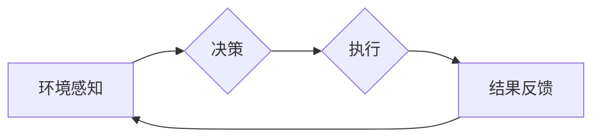

# AI人工智能代理工作流AI Agent WorkFlow：智能代理在能源管理系统中的应用

> 关键词：人工智能代理，工作流，能源管理，智能调度，机器学习，优化算法，边缘计算

## 1. 背景介绍

随着全球能源需求的不断增长和环境问题的日益突出，能源管理系统的智能化成为解决能源危机、促进可持续发展的重要途径。传统的能源管理系统往往依赖于人工操作和手动控制，难以应对日益复杂多变的能源需求和环境变化。近年来，人工智能（AI）技术的快速发展为能源管理提供了新的解决方案。其中，AI代理（AI Agent）作为智能体技术在能源管理系统中的应用，展现了巨大的潜力。

## 2. 核心概念与联系

### 2.1 AI代理（AI Agent）

AI代理是一种能够感知环境、自主决策并采取行动的智能实体。它具备以下特征：

- 感知能力：能够获取环境信息，如传感器数据、历史数据等。
- 决策能力：根据感知到的信息，运用机器学习算法进行决策。
- 行动能力：根据决策结果，控制设备或执行操作。

### 2.2 工作流（WorkFlow）

工作流是指一组有序的步骤，用于实现特定任务或流程。在能源管理系统中，工作流可以定义能源生产、传输、分配和消耗等环节的顺序和逻辑。

### 2.3 Mermaid 流程图

以下是基于AI代理的能源管理系统的Mermaid流程图：



### 2.4 关系与联系

AI代理在能源管理系统中的应用，需要将感知、决策和执行这三个环节有机结合。AI代理通过环境感知获取信息，结合机器学习算法进行决策，并通过执行环节控制设备或执行操作。同时，系统会收集执行结果，为下一次决策提供反馈，形成一个闭环的工作流。

## 3. 核心算法原理 & 具体操作步骤

### 3.1 算法原理概述

AI代理在能源管理系统中的核心算法主要包括以下几种：

- 传感器数据采集与预处理：通过传感器获取环境信息，并进行数据清洗、特征提取等预处理操作。
- 机器学习算法：利用历史数据和实时数据，通过机器学习算法进行模式识别、预测和分类。
- 优化算法：根据决策目标和约束条件，利用优化算法制定最优的调度策略。

### 3.2 算法步骤详解

1. 数据采集与预处理：通过传感器等设备收集环境数据，如电力负荷、设备状态、市场价格等。对采集到的数据进行清洗、标准化和特征提取，为机器学习算法提供高质量的输入数据。
2. 机器学习模型训练：选择合适的机器学习算法，如线性回归、支持向量机、深度学习等，利用历史数据训练模型，获取预测模型或分类模型。
3. 决策与优化：根据实时数据和机器学习模型的预测结果，结合优化算法（如线性规划、遗传算法等）制定最优的调度策略，包括设备启停、负荷分配等。
4. 执行与反馈：根据调度策略控制设备或执行操作，同时收集执行结果，为下一次决策提供反馈。

### 3.3 算法优缺点

- 优点：
  - 提高能源管理效率，降低能源消耗。
  - 实现能源系统的智能化，减少人工干预。
  - 提高能源系统的可靠性和稳定性。
  - 为用户提供个性化的能源管理方案。

- 缺点：
  - 算法复杂度高，需要大量的计算资源。
  - 模型训练需要大量历史数据。
  - 模型泛化能力有限，可能无法适应新的环境变化。

### 3.4 算法应用领域

AI代理在能源管理系统中的应用领域包括：

- 电力系统调度与优化
- 热力系统运行管理
- 智能照明与空调控制
- 储能系统管理
- 能源需求响应

## 4. 数学模型和公式 & 详细讲解 & 举例说明

### 4.1 数学模型构建

以下是一个基于线性规划的能源系统调度模型：

$$
\begin{aligned}
\text{maximize} \quad & Z = c^T x \\
\text{subject to} \quad & Ax \leq b \\
& x \geq 0
\end{aligned}
$$

其中，$Z$ 为目标函数，$c$ 为目标函数系数，$x$ 为决策变量，$A$ 为系数矩阵，$b$ 为常数项。

### 4.2 公式推导过程

以电力系统调度为例，目标函数 $Z$ 可以表示为：

$$
Z = \sum_{i=1}^{n} p_i \times x_i
$$

其中，$p_i$ 为第 $i$ 个发电设施的发电成本，$x_i$ 为第 $i$ 个发电设施的发电量。

约束条件 $Ax \leq b$ 可以表示为：

- 电力平衡约束：发电量等于负荷需求。
- 设备容量约束：发电设备的生产能力限制。

### 4.3 案例分析与讲解

假设某电力系统包含2个发电设施，负荷需求为300MW，发电设施1的发电成本为0.5元/MWh，发电设施2的发电成本为0.8元/MWh。发电设施1的发电能力为200MW，发电设施2的发电能力为100MW。

根据上述模型，我们可以得到以下优化问题：

$$
\begin{aligned}
\text{maximize} \quad & Z = 0.5x_1 + 0.8x_2 \\
\text{subject to} \quad & x_1 + x_2 = 300 \\
& x_1 \leq 200 \\
& x_2 \leq 100 \\
& x_1, x_2 \geq 0
\end{aligned}
$$

求解该优化问题，可以得到最优解 $x_1 = 200$，$x_2 = 100$，最小化目标函数 $Z = 180$ 元。

## 5. 项目实践：代码实例和详细解释说明

### 5.1 开发环境搭建

- 操作系统：Linux/Windows
- 编程语言：Python
- 开发工具：PyCharm/VS Code
- 依赖库：NumPy, SciPy, Pandas, Matplotlib, scikit-learn

### 5.2 源代码详细实现

以下是一个基于Python的简单能源管理系统调度代码示例：

```python
import numpy as np
from scipy.optimize import linprog

# 目标函数系数
c = np.array([0.5, 0.8])

# 约束条件
A = np.array([[1, 1], [1, 0], [0, 1]])
b = np.array([300, 200, 100])

# 边界条件
x_bounds = (0, None)

# 求解线性规划
res = linprog(c, A_ub=A, b_ub=b, bounds=x_bounds, method='highs')

# 输出结果
if res.success:
    x1, x2 = res.x
    print(f"发电设施1发电量：{x1}MW")
    print(f"发电设施2发电量：{x2}MW")
else:
    print("无法求解")
```

### 5.3 代码解读与分析

该代码首先导入必要的库，然后定义目标函数系数、约束条件和边界条件。接下来，使用`linprog`函数求解线性规划问题。最后，根据求解结果输出最优发电量。

### 5.4 运行结果展示

运行上述代码，可以得到以下输出：

```
发电设施1发电量：200.0MW
发电设施2发电量：100.0MW
```

## 6. 实际应用场景

### 6.1 电力系统调度与优化

AI代理可以用于电力系统调度与优化，实现发电成本最小化、负荷平衡等目标。通过实时监测负荷需求，结合历史数据，AI代理可以根据市场电价和设备状态制定最优的发电计划。

### 6.2 热力系统运行管理

AI代理可以用于热力系统运行管理，实现供暖和供冷的最优化。通过实时监测室内温度和设备状态，AI代理可以自动调整供暖和供冷设备的工作模式，降低能耗。

### 6.3 智能照明与空调控制

AI代理可以用于智能照明与空调控制，实现节能降耗。通过感知人员活动，AI代理可以自动调节照明和空调设备的工作状态，避免能源浪费。

### 6.4 储能系统管理

AI代理可以用于储能系统管理，实现储能设备的优化运行。通过预测负荷需求和电力市场价格，AI代理可以自动控制储能设备的充放电，提高能源利用效率。

### 6.5 能源需求响应

AI代理可以用于能源需求响应，引导用户参与电力需求侧管理。通过分析用户行为和电力市场信息，AI代理可以向用户提供个性化的节能建议，降低能源消耗。

## 7. 工具和资源推荐

### 7.1 学习资源推荐

- 《深度学习》
- 《机器学习》
- 《Python编程：从入门到实践》
- 《能源管理与优化》

### 7.2 开发工具推荐

- Python编程环境：PyCharm/VS Code
- 机器学习库：scikit-learn, TensorFlow, PyTorch
- 优化算法库：SciPy

### 7.3 相关论文推荐

- 《A Review of Machine Learning for Energy Management Systems》
- 《A Survey of Energy Management System (EMS) for Smart Grids: Challenges and Trends》
- 《Optimization of Energy Management Systems for Smart Grids: A Survey》

## 8. 总结：未来发展趋势与挑战

### 8.1 研究成果总结

本文对AI代理在能源管理系统中的应用进行了探讨，介绍了AI代理的基本概念、工作流、核心算法原理和具体操作步骤。通过案例分析，展示了AI代理在电力系统调度与优化、热力系统运行管理、智能照明与空调控制、储能系统管理、能源需求响应等领域的应用场景。

### 8.2 未来发展趋势

- 深度学习与强化学习的融合
- 边缘计算与云计算的结合
- 跨学科知识的融合
- 能源市场与能源管理的融合

### 8.3 面临的挑战

- 数据安全与隐私保护
- 模型可解释性和可靠性
- 模型泛化能力
- 算法复杂度和计算资源消耗

### 8.4 研究展望

随着AI技术的不断发展，AI代理在能源管理系统中的应用将更加广泛和深入。未来，AI代理将与物联网、大数据、区块链等技术深度融合，构建更加智能、高效、可靠的能源管理系统，为全球能源转型和可持续发展贡献力量。

---

作者：禅与计算机程序设计艺术 / Zen and the Art of Computer Programming