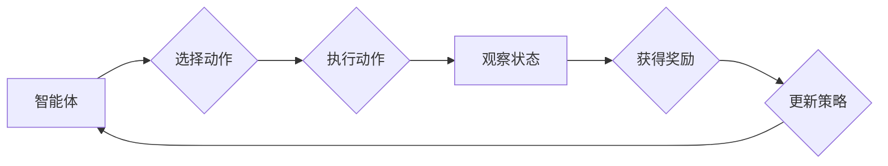

# AI人工智能核心算法原理与代码实例讲解：奖励函数

> 关键词：人工智能，强化学习，奖励函数，强化学习算法，Q学习，SARSA，深度Q网络，策略梯度，强化学习应用

## 1. 背景介绍

在人工智能领域，强化学习（Reinforcement Learning，RL）是一个重要的研究方向，它通过智能体（Agent）与环境的交互，使智能体能够学习到如何在复杂环境中做出最优决策。强化学习的关键在于奖励函数（Reward Function），它是强化学习中指导智能体行为的唯一信号。本文将深入探讨奖励函数的核心原理、设计方法以及代码实例，帮助读者全面理解这一人工智能的核心概念。

### 1.1 问题的由来

传统的机器学习方法，如监督学习和无监督学习，通常依赖于大量的标注数据或未标注数据。然而，在现实世界中，很多问题（如自动驾驶、游戏AI、机器人控制等）缺乏足够的标注数据，或者很难获取数据。强化学习提供了一种无需大量标注数据的学习方式，通过奖励函数来指导智能体学习最优策略。

### 1.2 研究现状

奖励函数的设计在强化学习中占有举足轻重的地位。近年来，随着深度学习技术的发展，深度强化学习（Deep Reinforcement Learning，DRL）在多个领域取得了显著进展，其中奖励函数的设计和优化成为了研究的热点。

### 1.3 研究意义

正确设计奖励函数对于强化学习的成功至关重要。本文将帮助读者深入理解奖励函数的原理，从而在构建和优化智能体时能够更有效地设计奖励函数，提高强化学习算法的效率和效果。

### 1.4 本文结构

本文将按以下结构展开：
- 第2部分，介绍强化学习和奖励函数的核心概念。
- 第3部分，详细阐述奖励函数的设计原理和常见方法。
- 第4部分，通过数学模型和公式对奖励函数进行详细讲解。
- 第5部分，给出奖励函数的代码实例和解释。
- 第6部分，探讨奖励函数在实际应用中的场景和挑战。
- 第7部分，推荐相关的学习资源和开发工具。
- 第8部分，总结研究现状和未来发展趋势。
- 第9部分，提供常见问题的解答。

## 2. 核心概念与联系

### 2.1 强化学习概述

强化学习是一种机器学习方法，通过智能体（Agent）与环境的交互，智能体不断学习以实现目标。强化学习的主要组成部分包括：
- 智能体（Agent）：执行动作，并通过观察环境状态和获得奖励来学习。
- 环境（Environment）：提供状态和奖励给智能体，并根据智能体的动作产生新的状态。
- 策略（Policy）：智能体在给定状态下选择动作的规则。
- 奖励函数（Reward Function）：衡量智能体动作效果的函数。
- 状态（State）：环境在某一时刻的描述。

### 2.2 奖励函数与策略的关系

奖励函数是强化学习中的关键因素，它决定了智能体的学习目标。智能体通过最大化累积奖励来学习策略。奖励函数的设计需要考虑以下因素：
- 目标：奖励函数应明确智能体的学习目标。
- 动态性：奖励函数应能够反映环境的动态变化。
- 鲁棒性：奖励函数应能应对环境的不确定性和噪声。
- 正向激励：奖励函数应包含正向激励，鼓励智能体学习有益行为。

### 2.3 Mermaid 流程图

以下是一个简化的Mermaid流程图，展示了强化学习的基本流程：



## 3. 核心算法原理 & 具体操作步骤

### 3.1 算法原理概述

强化学习算法的核心是学习一个策略，该策略能够最大化累积奖励。常见的强化学习算法包括：
- Q学习（Q-Learning）：通过学习Q值函数来预测在未来给定状态下采取某个动作的预期奖励。
- SARSA（SARSA）：Q学习的一个变体，通过同时考虑当前状态、动作、下一个状态和奖励来更新Q值。
- 深度Q网络（DQN）：结合深度学习技术，使用神经网络来近似Q值函数。

### 3.2 算法步骤详解

以下是一个基于Q学习的强化学习算法的基本步骤：

1. 初始化Q值函数。
2. 选择动作。
3. 执行动作，观察状态和奖励。
4. 更新Q值函数。
5. 返回步骤2，重复以上步骤。

### 3.3 算法优缺点

- Q学习：简单易实现，但收敛速度慢，容易陷入局部最优。
- SARSA：比Q学习更稳定，但计算量更大。
- DQN：结合深度学习技术，能够处理高维状态空间，但训练过程复杂，需要大量的样本。

### 3.4 算法应用领域

强化学习在多个领域都有广泛的应用，包括：
- 游戏：如国际象棋、围棋、电子游戏等。
- 机器人：如自动驾驶、无人驾驶、机器人控制等。
- 供应链管理：如库存控制、物流优化等。
- 资本市场：如股票交易、风险管理等。

## 4. 数学模型和公式 & 详细讲解 & 举例说明

### 4.1 数学模型构建

在强化学习中，Q值函数 $Q(s,a)$ 表示在状态 $s$ 下执行动作 $a$ 的预期奖励，可以表示为：

$$
Q(s,a) = \sum_{s'} P(s'|s,a) \cdot [R + \gamma \max_{a'} Q(s',a')]
$$

其中：
- $P(s'|s,a)$ 是在状态 $s$ 下执行动作 $a$ 转移到状态 $s'$ 的概率。
- $R$ 是执行动作 $a$ 获得的即时奖励。
- $\gamma$ 是折扣因子，表示对未来奖励的期望。
- $\max_{a'} Q(s',a')$ 是在状态 $s'$ 下采取最优动作 $a'$ 的预期奖励。

### 4.2 公式推导过程

Q值函数的推导过程如下：

- 首先，定义状态 $s$ 和动作 $a$ 的预期奖励为：

$$
R(s,a) = \sum_{s'} P(s'|s,a) \cdot [R + \gamma \max_{a'} Q(s',a')]
$$

- 然后，将 $R(s,a)$ 展开为：

$$
R(s,a) = R + \gamma \sum_{s'} P(s'|s,a) \cdot Q(s',a')
$$

- 由于 $\max_{a'} Q(s',a')$ 是在状态 $s'$ 下采取最优动作 $a'$ 的预期奖励，因此：

$$
R(s,a) = R + \gamma Q(s,a)
$$

- 最终得到：

$$
Q(s,a) = \sum_{s'} P(s'|s,a) \cdot [R + \gamma Q(s',a')]
$$

### 4.3 案例分析与讲解

假设一个简单的环境，其中智能体可以选择向上或向下移动。环境状态由智能体的位置表示，即状态空间 $S = \{1, 2, 3, 4\}$。奖励函数为到达终点（状态4）时获得正奖励，其他状态获得负奖励。智能体每次移动消耗一个步长，目标是最小化步数。

在这种情况下，我们可以设计一个Q值函数，通过Q学习算法来学习最优策略。以下是一个简化的Python代码示例：

```python
import numpy as np

# 初始化Q值函数
def init_q_function(num_states):
    return np.zeros((num_states, 2))

# Q学习算法
def q_learning(q_function, num_states, num_actions, learning_rate, discount_factor, epsilon):
    for episode in range(num_episodes):
        state = np.random.randint(num_states)
        while state != num_states - 1:
            action = choose_action(q_function, state, epsilon)
            next_state, reward = step(state, action)
            q_function[state, action] = q_function[state, action] + learning_rate * (
                reward + discount_factor * np.max(q_function[next_state, :]) - q_function[state, action]
            )
            state = next_state
        print(f"Episode {episode}: reached goal in {steps} steps")
    return q_function

# 选择动作（epsilon-greedy）
def choose_action(q_function, state, epsilon):
    if np.random.rand() < epsilon:
        return np.random.randint(num_actions)
    else:
        return np.argmax(q_function[state])

# 环境步骤
def step(state, action):
    if action == 0:
        next_state = max(0, state - 1)
    else:
        next_state = min(num_states - 1, state + 1)
    reward = -1 if next_state != num_states - 1 else 1
    return next_state, reward
```

通过运行上述代码，我们可以观察到Q值函数随时间的变化，并最终学习到最优策略，即总是向下移动以尽快到达终点。

## 5. 项目实践：代码实例和详细解释说明

### 5.1 开发环境搭建

为了运行以下代码，需要安装以下Python库：

```bash
pip install numpy gym stable-baselines3
```

### 5.2 源代码详细实现

以下是一个使用stable-baselines3库实现的深度Q网络（DQN）的代码实例：

```python
import gym
from stable_baselines3 import DQN

# 创建环境
env = gym.make("CartPole-v1")

# 创建DQN模型
model = DQN("MlpPolicy", env, verbose=1)

# 训练模型
model.learn(total_timesteps=10000)

# 保存模型
model.save("dqn_cartpole")

# 加载模型
model = DQN.load("dqn_cartpole")

# 进行测试
obs = env.reset()
while True:
    action, _states = model.predict(obs)
    obs, rewards, done, info = env.step(action)
    env.render()
    if done:
        break
```

### 5.3 代码解读与分析

上述代码首先创建了一个CartPole环境，然后创建了一个DQN模型，并使用该模型进行训练。训练完成后，将模型保存到本地。之后，加载模型并使用它进行测试，模拟智能体在CartPole环境中的行为。

在DQN模型中，`MlpPolicy` 是一个基于多层感知器的策略网络，`env` 是CartPole环境，`verbose=1` 表示输出训练过程中的详细信息。

在训练过程中，模型通过与环境交互，不断更新策略网络，直到达到预定的步数或性能指标。训练完成后，可以将模型保存到本地，以便后续使用。

### 5.4 运行结果展示

运行上述代码后，可以看到CartPole环境中的智能体在经过多次尝试后，能够学会在杠杆上保持平衡，最终完成任务。

## 6. 实际应用场景

奖励函数在强化学习中的应用场景非常广泛，以下是一些典型的应用示例：

- **游戏AI**：例如，在国际象棋、围棋等游戏中，奖励函数可以设计为赢得游戏的分数。
- **机器人控制**：例如，在自动驾驶中，奖励函数可以设计为到达目的地所需时间的倒数。
- **资源管理**：例如，在数据中心中，奖励函数可以设计为最大化能源效率。
- **电子商务**：例如，在推荐系统中，奖励函数可以设计为用户点击或购买商品的次数。

## 7. 工具和资源推荐

### 7.1 学习资源推荐

- 《Reinforcement Learning: An Introduction》
- 《Reinforcement Learning: Principles and Practice》
- 《Deep Reinforcement Learning》

### 7.2 开发工具推荐

- Stable Baselines3：一个基于PyTorch的强化学习库。
- Gym：一个用于开发强化学习算法的通用工具包。
- OpenAI Gym Environments：一个包含多种环境库。

### 7.3 相关论文推荐

- Q-Learning: https://ieeexplore.ieee.org/document/96822
- SARSA: https://www.sciencedirect.com/science/article/pii/S0950705116300259
- Deep Q-Networks: https://arxiv.org/abs/1509.02971

## 8. 总结：未来发展趋势与挑战

### 8.1 研究成果总结

本文深入探讨了强化学习中的奖励函数这一核心概念，介绍了其设计原理、常见方法、数学模型和代码实例。通过分析和讨论，读者可以更好地理解奖励函数在强化学习中的作用，并能够在实际应用中设计有效的奖励函数。

### 8.2 未来发展趋势

未来，奖励函数的研究将主要集中在以下几个方面：

- 设计更加智能的奖励函数，能够更好地反映现实世界的复杂性和动态性。
- 开发自动设计奖励函数的方法，减少人工干预。
- 将奖励函数与其他机器学习方法（如强化学习、深度学习等）相结合，提高算法的性能。

### 8.3 面临的挑战

奖励函数的设计和优化在强化学习中仍然面临着一些挑战：

- 设计合适的奖励函数需要深入理解问题和应用场景。
- 奖励函数的设计可能会引入主观性和偏见。
- 奖励函数的优化可能需要大量的计算资源和时间。

### 8.4 研究展望

随着人工智能技术的不断发展，奖励函数将在未来的人工智能系统中扮演越来越重要的角色。通过不断的研究和创新，我们有望设计出更加智能、高效的奖励函数，推动人工智能技术向更高水平发展。

## 9. 附录：常见问题与解答

**Q1：奖励函数在强化学习中的作用是什么？**

A：奖励函数是强化学习中的关键因素，它为智能体提供反馈，指导智能体学习最优策略。通过最大化累积奖励，智能体可以学习到如何在复杂环境中做出最优决策。

**Q2：如何设计有效的奖励函数？**

A：设计有效的奖励函数需要考虑以下因素：
- 目标：奖励函数应明确智能体的学习目标。
- 动态性：奖励函数应能够反映环境的动态变化。
- 鲁棒性：奖励函数应能应对环境的不确定性和噪声。
- 正向激励：奖励函数应包含正向激励，鼓励智能体学习有益行为。

**Q3：奖励函数与策略网络之间的关系是什么？**

A：奖励函数为策略网络提供目标函数，指导策略网络学习最优策略。策略网络通过最大化累积奖励来调整其参数，从而优化智能体的决策。

**Q4：奖励函数在深度强化学习中的应用有哪些？**

A：在深度强化学习中，奖励函数可以用于训练各种深度神经网络模型，如深度Q网络（DQN）、策略梯度（PG）、演员-评论家（AC）等。

**Q5：如何评估奖励函数的有效性？**

A：评估奖励函数的有效性可以通过以下方法：
- 在测试集上评估智能体的性能。
- 分析奖励函数的动态变化。
- 考虑奖励函数的鲁棒性和泛化能力。

作者：禅与计算机程序设计艺术 / Zen and the Art of Computer Programming