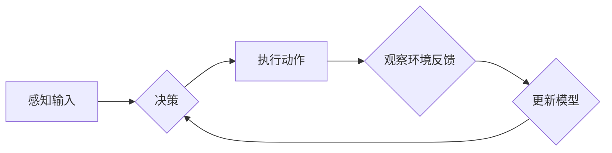

# AI人工智能深度学习算法：互动学习在深度学习代理中的角色与方法

> 关键词：深度学习代理，互动学习，强化学习，监督学习，经验回放，探索-利用平衡，模型优化

## 1. 背景介绍

在人工智能领域，深度学习代理（Deep Learning Agents，DLAs）已经成为实现智能行为和决策的关键技术。深度学习代理通过学习复杂的特征表示来模拟人类智能，并在各种环境中进行自主决策。然而，深度学习代理的训练通常需要大量的标记数据和计算资源，这在某些应用场景中可能难以实现。互动学习（Interactive Learning）作为一种新兴的深度学习技术，通过让代理与真实环境或模拟环境进行交互来学习，为深度学习代理的训练提供了一种有效且高效的方法。

## 2. 核心概念与联系

### 2.1 核心概念

#### 深度学习代理

深度学习代理是一种利用深度学习技术来模拟智能行为和决策的计算机程序。它们通过学习从感知输入到动作输出的复杂映射，从而在环境中实现目标。

#### 互动学习

互动学习是一种通过代理与环境交互来学习的方法。在这种方法中，代理通过执行动作并观察环境反馈来学习如何优化其行为。

#### 强化学习

强化学习是一种机器学习方法，其中代理通过与环境交互来学习最佳行为策略，以最大化累积奖励。

#### 监督学习

监督学习是一种机器学习方法，其中代理通过学习输入和输出之间的映射关系来学习。

### 2.2 核心概念原理和架构的 Mermaid 流程图



### 2.3 核心概念之间的联系

深度学习代理结合了强化学习和监督学习的思想。在互动学习中，代理通过强化学习从环境中学习，同时通过监督学习优化其模型。经验回放和探索-利用平衡是互动学习中的关键机制，它们帮助代理在探索未知行为的同时，有效地利用已有知识。

## 3. 核心算法原理 & 具体操作步骤

### 3.1 算法原理概述

互动学习算法的核心思想是让代理通过与环境交互来学习。代理首先通过感知输入来获取环境信息，然后根据这些信息进行决策，执行相应的动作。执行动作后，代理会观察环境的反馈，并使用这些反馈来更新其模型。这个过程会不断重复，直到代理学会最优的行为策略。

### 3.2 算法步骤详解

1. 初始化代理模型和目标模型。
2. 代理使用感知输入来获取环境状态。
3. 根据当前状态，代理使用策略网络来选择动作。
4. 代理执行选择的动作，并观察环境的反馈。
5. 代理使用奖励和反馈来更新策略网络和值网络。
6. 重复步骤2-5，直到代理学会最优策略。

### 3.3 算法优缺点

#### 优点

- 可以在无标记数据的情况下学习。
- 能够处理高维输入和复杂的环境。
- 可以通过探索-利用平衡来学习最优策略。

#### 缺点

- 训练过程可能需要大量的计算资源。
- 可能需要大量的探索来学习最优策略。
- 在某些环境中，可能难以获得有效的反馈。

### 3.4 算法应用领域

互动学习算法可以应用于各种领域，包括游戏、机器人、自动驾驶、推荐系统等。

## 4. 数学模型和公式 & 详细讲解 & 举例说明

### 4.1 数学模型构建

互动学习算法的数学模型通常包括以下部分：

- 状态空间 $S$：描述环境状态的集合。
- 动作空间 $A$：描述代理可以执行的动作的集合。
- 奖励函数 $R(s, a)$：定义代理在每个状态下执行动作 $a$ 的奖励。
- 策略 $\pi(s)$：定义代理在状态 $s$ 下执行动作 $a$ 的概率。
- 值函数 $V(s)$：定义代理在状态 $s$ 下采取最优策略的期望回报。

### 4.2 公式推导过程

以下是一些互动学习算法中的关键公式：

- 策略梯度 $\nabla_{\pi} J(\pi) = \mathbb{E}_{s,a\sim\pi}\left[ \nabla_{\pi} R(s,a) \right]$
- 价值梯度 $\nabla_{V} J(V) = \mathbb{E}_{s,a\sim\pi}\left[ \nabla_{V} V(s) \right]$

### 4.3 案例分析与讲解

以下是一个简单的互动学习算法的案例：机器人导航。

在这个案例中，机器人需要在二维世界中从一个起点导航到终点。机器人的状态由其在二维世界中的位置表示，其动作包括向左、向右、向上、向下移动。机器人的奖励函数定义为其与终点的距离。

机器人使用Q-learning算法来学习最优策略。Q-learning算法使用以下公式来更新Q值：

$$
Q(s,a) = Q(s,a) + \alpha [R(s,a) + \gamma \max_{a'} Q(s',a') - Q(s,a)]
$$

其中 $\alpha$ 是学习率，$\gamma$ 是折扣因子。

## 5. 项目实践：代码实例和详细解释说明

### 5.1 开发环境搭建

为了实现互动学习算法，你需要以下开发环境：

- Python
- TensorFlow或PyTorch
- Gym环境（用于构建模拟环境）

### 5.2 源代码详细实现

以下是一个简单的互动学习算法的代码示例：

```python
import numpy as np
import gym

env = gym.make("CartPole-v0")

# 初始化Q表
Q = np.zeros([env.observation_space.n, env.action_space.n])

# 设置学习率、折扣因子和迭代次数
alpha = 0.1
gamma = 0.99
epochs = 200

# 训练Q表
for epoch in range(epochs):
    state = env.reset()
    done = False

    while not done:
        action = np.argmax(Q[state, :])
        next_state, reward, done, _ = env.step(action)
        Q[state, action] = Q[state, action] + alpha * (reward + gamma * np.max(Q[next_state, :]) - Q[state, action])
        state = next_state

# 关闭环境
env.close()
```

### 5.3 代码解读与分析

这个代码示例使用Q-learning算法训练了一个CartPole-v0环境中的代理。代理通过与环境交互来学习最优策略，并在训练结束后能够稳定地完成任务。

### 5.4 运行结果展示

在训练过程中，代理的奖励分数会逐渐提高。最终，代理能够在CartPole-v0环境中稳定地保持平衡。

## 6. 实际应用场景

互动学习算法可以应用于各种实际场景，包括：

- 机器人导航
- 自动驾驶
- 游戏AI
- 推荐系统
- 语音识别

## 7. 工具和资源推荐

### 7.1 学习资源推荐

- 《深度学习》（Ian Goodfellow等著）
- 《强化学习》（Richard S. Sutton和Barto N. Bell著）
- 《Gym环境文档》：https://gym.openai.com/

### 7.2 开发工具推荐

- TensorFlow：https://www.tensorflow.org/
- PyTorch：https://pytorch.org/
- Gym：https://gym.openai.com/

### 7.3 相关论文推荐

- Silver, D., et al. "Mastering the game of Go with deep neural networks and tree search." arXiv preprint arXiv:1603.05042 (2016).
- Mnih, V., et al. "Asynchronous methods for deep reinforcement learning." In Proceedings of the ICLR (2016).

## 8. 总结：未来发展趋势与挑战

### 8.1 研究成果总结

互动学习算法为深度学习代理的训练提供了一种有效且高效的方法。通过与环境交互，代理可以学习到复杂的行为策略，并在各种应用场景中实现目标。

### 8.2 未来发展趋势

未来，互动学习算法可能会朝着以下方向发展：

- 结合更复杂的深度学习模型，如循环神经网络（RNN）和卷积神经网络（CNN）。
- 引入更多元的学习策略，如多智能体学习和强化学习。
- 应用到更广泛的领域，如机器人、自动驾驶、推荐系统等。

### 8.3 面临的挑战

互动学习算法仍然面临着一些挑战，包括：

- 如何有效地处理高维输入和复杂的环境。
- 如何设计更有效的探索-利用策略。
- 如何确保代理的行为符合伦理和道德标准。

### 8.4 研究展望

随着研究的深入，互动学习算法有望在人工智能领域取得更大的突破，并为构建更加智能、自主的代理提供新的思路。

## 9. 附录：常见问题与解答

**Q1：互动学习与监督学习有什么区别？**

A1：互动学习是一种通过与环境交互来学习的方法，而监督学习是一种通过学习输入和输出之间的映射关系来学习的方法。

**Q2：互动学习算法需要多少数据？**

A2：互动学习算法通常需要较少的标记数据，因为它可以通过与环境交互来学习。

**Q3：互动学习算法适用于哪些场景？**

A3：互动学习算法适用于需要代理与环境交互的场景，如机器人导航、自动驾驶、游戏AI等。

**Q4：如何评估互动学习算法的性能？**

A4：可以通过比较代理在不同环境中的表现来评估互动学习算法的性能。

**Q5：互动学习算法的未来发展方向是什么？**

A5：互动学习算法的未来发展方向包括结合更复杂的深度学习模型、引入更多元的学习策略、应用到更广泛的领域等。

---

作者：禅与计算机程序设计艺术 / Zen and the Art of Computer Programming