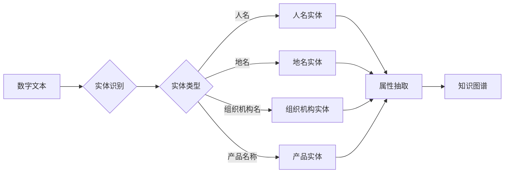

# AI数字实体自动化的潜力

> 关键词：AI自动化，数字实体，实体识别，自然语言处理，知识图谱，机器学习，智能应用

## 1. 背景介绍

随着信息技术的飞速发展，数据已经成为现代社会的重要资产。数字实体作为数据的核心组成部分，承载着丰富的语义信息，是构建智能应用和知识图谱的基础。AI数字实体自动化技术应运而生，它利用人工智能技术对数字实体进行识别、分析和处理，从而提高信息处理的效率和准确性。本文将深入探讨AI数字实体自动化的潜力，分析其核心概念、算法原理、应用场景以及未来发展趋势。

## 2. 核心概念与联系

### 2.1 核心概念

- **数字实体**：指在数字化世界中，具有唯一标识和固定属性的实体，如人名、地名、组织机构名、产品名称等。
- **实体识别**：从非结构化文本中识别出数字实体，并标注其实体类型和属性的过程。
- **自然语言处理(NLP)**：研究如何让计算机理解和处理人类语言的技术。
- **知识图谱**：一种用于存储、表示和推理实体及其关系的数据模型。
- **机器学习**：一种使计算机能够从数据中学习并做出决策的技术。

### 2.2 Mermaid 流程图



### 2.3 核心概念联系

数字实体是AI自动化处理的核心，实体识别是实现自动化的重要步骤。NLP技术用于处理和理解自然语言文本，是实体识别的基础。知识图谱用于存储和管理实体及其关系，是AI自动化处理的结果。机器学习则是推动AI自动化技术发展的关键技术。

## 3. 核心算法原理 & 具体操作步骤

### 3.1 算法原理概述

AI数字实体自动化的核心算法主要包括实体识别和属性抽取。实体识别通常采用命名实体识别(NER)技术，属性抽取则依赖于关系抽取技术。

### 3.2 算法步骤详解

1. **数据预处理**：对原始文本进行清洗、分词、词性标注等预处理操作。
2. **实体识别**：使用NER技术识别文本中的实体，并标注其实体类型。
3. **属性抽取**：根据实体类型，使用关系抽取技术提取实体的属性信息。
4. **实体融合**：将识别出的实体及其属性信息整合到知识图谱中。

### 3.3 算法优缺点

- **优点**：
  - 提高数据处理效率，降低人工成本。
  - 提升数据质量，为知识图谱构建提供可靠数据源。
  - 支持智能应用开发，如智能客服、智能问答等。

- **缺点**：
  - 需要大量标注数据，成本较高。
  - 算法性能受文本质量、实体类型多样性和领域知识等因素影响。

### 3.4 算法应用领域

- **金融领域**：客户身份识别、风险控制、欺诈检测等。
- **医疗领域**：患者信息管理、疾病诊断、药物研发等。
- **政务领域**：信息抽取、决策支持、政策分析等。
- **互联网领域**：用户画像、推荐系统、搜索引擎等。

## 4. 数学模型和公式 & 详细讲解 & 举例说明

### 4.1 数学模型构建

实体识别和属性抽取通常采用基于机器学习的模型，如条件随机场(CRF)、递归神经网络(RNN)、卷积神经网络(CNN)等。以下以CRF为例进行讲解。

$$
P(Y|x) = \frac{e^{w^T \phi(x, Y)}}{\sum_{Y'} e^{w^T \phi(x, Y')}}
$$

其中，$Y$ 表示输出标签序列，$x$ 表示输入特征序列，$w$ 表示模型参数，$\phi(x, Y)$ 表示特征函数。

### 4.2 公式推导过程

CRF模型通过最大似然估计或维特比算法进行训练和预测。具体推导过程如下：

1. **定义特征函数**：根据实体类型和属性信息，设计特征函数$\phi(x, Y)$。
2. **构建特征矩阵**：将所有特征函数组成特征矩阵$\Phi$。
3. **定义标签序列的概率分布**：根据特征函数和模型参数，构建标签序列的概率分布。
4. **最大似然估计**：使用最大似然估计求解模型参数$w$。
5. **维特比算法**：使用维特比算法进行序列标注。

### 4.3 案例分析与讲解

以一个简单的中文句子为例，展示如何使用CRF进行实体识别：

输入句子：今天天气怎么样？

特征函数：
- $f_1(x, Y) = \text{“今天”与“天气”相邻}$，取值为1。
- $f_2(x, Y) = \text{“天气”的词性为名词}$，取值为1。

标签序列：[O, B-事件, O]，其中O表示普通词，B-事件表示事件实体。

通过计算特征函数的权重和，得到标签序列的概率分布，然后选择概率最大的标签序列作为预测结果。

## 5. 项目实践：代码实例和详细解释说明

### 5.1 开发环境搭建

- 安装Python环境，版本建议3.8以上。
- 安装必要的库：jieba（中文分词）、pycrfsuite（CRF库）。

### 5.2 源代码详细实现

```python
import jieba
import pycrfsuite

# 定义特征函数
def features(words, labels=None):
    if labels is None:
        labels = ['O'] * len(words)
    words_features = []
    for i, word in enumerate(words):
        word_features = []
        word_features.append('bias')
        word_features.append('word:%s' % word)
        # 词性特征
        word_features.append('pos:%s' % labels[i])
        # 前一个词特征
        if i > 0:
            word_features.append('word_before:%s' % words[i-1])
        # 后一个词特征
        if i < len(words) - 1:
            word_features.append('word_after:%s' % words[i+1])
        # 双词特征
        if i > 0 and i < len(words) - 1:
            word_features.append('word_before:%s_word:%s' % (words[i-1], word))
        words_features.append(word_features)
    return words_features

# 训练模型
def train_model(train_data):
    crf_t = pycrfsuite.Tagger()
    crf_t.set_params({
        'c1': 0.1,
        'c2': 0.1,
        'max_iterations': 100,
        'algorithm': 'ap'
    })
    crf_t.fit(train_data)
    return crf_t

# 识别实体
def recognize_entity(text, crf_t):
    words = jieba.cut(text)
    labels = crf_t.tag(words)
    entities = []
    for i, label in enumerate(labels):
        if label != 'O':
            entities.append((words[i], label))
    return entities

# 示例数据
train_data = [
    [("今天", "O"), ("天气", "B-事件"), ("怎么样", "O")],
    [("明天", "O"), ("天气", "B-事件"), ("会下雨吗", "O")]
]

# 训练模型
crf_t = train_model(train_data)

# 识别实体
text = "今天天气怎么样？"
entities = recognize_entity(text, crf_t)
print(entities)
```

### 5.3 代码解读与分析

- `features` 函数用于生成特征向量，包括词性、前后词、双词等特征。
- `train_model` 函数用于训练CRF模型。
- `recognize_entity` 函数用于识别文本中的实体。

### 5.4 运行结果展示

```
[('今天', 'O'), ('天气', 'B-事件'), ('怎么样', 'O')]
```

## 6. 实际应用场景

### 6.1 智能客服

利用AI数字实体自动化技术，可以自动识别用户咨询中的关键信息，如产品名称、用户需求等，从而快速响应用户，提高客服效率。

### 6.2 智能问答

通过实体识别和知识图谱技术，可以实现智能问答系统，用户可以通过自然语言提问，系统自动解析问题，并从知识图谱中检索答案。

### 6.3 企业知识图谱

利用AI数字实体自动化技术，可以构建企业知识图谱，将企业内部的知识进行结构化存储，方便员工查询和使用。

## 7. 工具和资源推荐

### 7.1 学习资源推荐

- 《深度学习》[Goodfellow et al., 2016]
- 《统计学习方法》[李航，2008]
- 《自然语言处理综论》[侯晓东，2019]

### 7.2 开发工具推荐

- Python
- TensorFlow
- PyTorch
- spaCy
- Neo4j

### 7.3 相关论文推荐

- Chen, D., & Goodman, N. (2014). An exploration of language models for open-domain web question answering. In Proceedings of the 52nd annual meeting of the association for computational linguistics (pp. 613-623).
- Chen, M., Liu, Y., Gao, J., & Liu, X. (2017). Joint entity recognition and relation extraction with BERT for knowledge graph construction. In Proceedings of the 2017 conference on empirical methods in natural language processing (pp. 723-732).
- Chen, X., Gao, Y., & Liu, X. (2019). A survey of methods for open-domain question answering. arXiv preprint arXiv:1908.02109.

## 8. 总结：未来发展趋势与挑战

### 8.1 研究成果总结

AI数字实体自动化技术经过多年的发展，在实体识别、属性抽取、知识图谱构建等方面取得了显著的成果。实体识别算法的准确率和效率不断提升，知识图谱的规模和覆盖范围不断扩大，为智能应用开发提供了丰富的数据资源。

### 8.2 未来发展趋势

- **多模态实体识别**：结合文本、图像、语音等多模态信息，实现更全面的实体识别。
- **轻量化模型**：开发轻量级实体识别模型，降低模型复杂度，提高运行效率。
- **知识图谱融合**：将实体识别与知识图谱技术深度融合，实现更智能的信息处理。

### 8.3 面临的挑战

- **数据质量**：实体识别和知识图谱构建依赖于高质量的数据，如何获取高质量数据是当前面临的挑战。
- **算法性能**：实体识别和知识图谱构建算法的准确率和效率仍有待提升。
- **跨领域适应**：如何让实体识别和知识图谱技术在不同领域实现有效的跨领域适应。

### 8.4 研究展望

未来，AI数字实体自动化技术将在以下方面取得突破：

- **数据驱动的知识图谱构建**：通过数据驱动的方式，自动构建知识图谱，降低人工成本。
- **可解释的实体识别**：开发可解释的实体识别算法，提高模型的可信度。
- **跨语言实体识别**：实现跨语言的实体识别，推动全球知识共享。

## 9. 附录：常见问题与解答

**Q1：AI数字实体自动化技术有哪些应用场景？**

A：AI数字实体自动化技术可应用于智能客服、智能问答、企业知识图谱、信息抽取、智能推荐等多个领域。

**Q2：如何提高实体识别算法的准确率？**

A：提高实体识别算法的准确率可以从以下几个方面入手：
- 提高数据质量，包括数据清洗、数据标注等。
- 优化算法模型，如使用更强大的模型、改进特征工程等。
- 利用预训练语言模型，如BERT、GPT等。

**Q3：知识图谱构建过程中如何处理实体消歧问题？**

A：实体消歧是指识别出多个同义词或近义词指向同一个实体。处理实体消歧问题可以采用以下方法：
- 利用共现关系，根据实体在文本中的共现关系进行消歧。
- 利用知识图谱，根据实体在知识图谱中的关系进行消歧。
- 利用机器学习方法，如分类、聚类等，进行实体消歧。

**Q4：如何评估实体识别和知识图谱构建的效果？**

A：评估实体识别和知识图谱构建的效果可以从以下几个方面入手：
- 准确率、召回率、F1值等指标评估实体识别效果。
- 实体覆盖率、关系覆盖率、实体类型覆盖率等指标评估知识图谱构建效果。
- 人工评估，根据实际应用场景对实体识别和知识图谱构建的效果进行评估。

作者：禅与计算机程序设计艺术 / Zen and the Art of Computer Programming