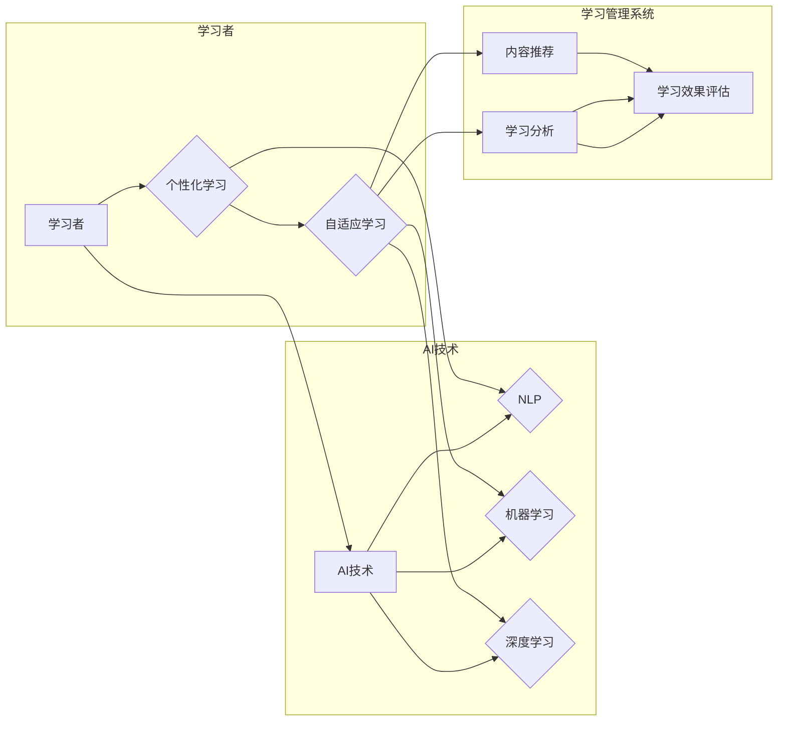

# AI驱动的企业学习管理系统

> 关键词：AI, 企业学习管理，个性化学习，自适应学习，学习分析，自然语言处理，机器学习，深度学习

## 1. 背景介绍

随着知识经济的兴起，企业对员工的学习能力和技能发展越来越重视。传统的学习管理系统(LMS)虽然已经为员工提供了必要的教育资源，但它们往往缺乏个性化和自适应的特性，无法满足现代企业对于高效学习体验和持续学习文化的需求。AI技术的快速发展为构建智能化的企业学习管理系统提供了新的可能性。本文将探讨AI驱动的企业学习管理系统的原理、实践和应用。

### 1.1 问题的由来

传统的企业学习管理系统通常存在以下问题：

- **缺乏个性化**：无法根据员工的个性化学习需求提供定制化的学习路径和资源。
- **学习效果评估不足**：难以量化学习效果，无法评估培训的投入产出比。
- **内容更新滞后**：学习资源更新缓慢，无法跟上快速变化的知识体系。
- **互动性差**：学习过程缺乏互动，无法激发员工的学习兴趣。

### 1.2 研究现状

AI驱动的企业学习管理系统通过融合机器学习、自然语言处理、深度学习等技术，实现了个性化学习、自适应学习、学习分析和智能化内容推荐等功能，有效解决了传统LMS的不足。

### 1.3 研究意义

AI驱动的企业学习管理系统具有以下意义：

- **提升学习效率**：通过个性化推荐和自适应学习，帮助员工更快地掌握所需技能。
- **优化学习体验**：提供更加互动和有趣的学习内容，提高员工的学习积极性。
- **降低学习成本**：通过智能化的学习路径规划，减少不必要的培训时间。
- **促进知识共享**：鼓励员工之间的知识交流，构建知识社区。

## 2. 核心概念与联系

### 2.1 核心概念原理

- **个性化学习**：根据员工的个人学习风格、兴趣、能力和知识水平，提供定制化的学习资源和路径。
- **自适应学习**：根据员工的学习进度和表现，动态调整学习内容、难度和教学方法。
- **学习分析**：通过收集和分析学习行为数据，了解学习效果，优化学习体验。
- **自然语言处理(NLP)**：利用AI技术理解和生成自然语言，实现智能问答、自动评分等功能。
- **机器学习**：从数据中学习模式，为学习分析、个性化推荐等提供支持。
- **深度学习**：通过多层神经网络，实现复杂的学习行为和模式识别。

### 2.2 架构的 Mermaid 流程图



## 3. 核心算法原理 & 具体操作步骤

### 3.1 算法原理概述

AI驱动的企业学习管理系统通常包含以下核心算法：

- **用户画像**：通过收集员工的学习行为、兴趣、背景等数据，构建用户画像。
- **个性化推荐**：利用协同过滤、基于内容的推荐等技术，为员工推荐个性化的学习资源。
- **自适应学习引擎**：根据学生的学习进度和表现，动态调整学习内容和难度。
- **学习分析**：通过分析学习行为数据，评估学习效果，优化学习体验。

### 3.2 算法步骤详解

#### 3.2.1 用户画像

1. 数据收集：收集员工的学习行为、兴趣、背景等数据。
2. 数据处理：对收集到的数据进行清洗、转换和标准化。
3. 特征提取：从数据中提取有助于描述用户特征的指标。
4. 用户画像构建：使用聚类、关联规则等方法，构建用户画像。

#### 3.2.2 个性化推荐

1. 模型选择：选择合适的推荐算法，如协同过滤、基于内容的推荐等。
2. 模型训练：使用历史学习数据训练推荐模型。
3. 推荐生成：根据用户画像和模型输出，生成个性化推荐列表。

#### 3.2.3 自适应学习引擎

1. 学习状态监控：实时监控学生的学习进度和表现。
2. 学习路径规划：根据学习状态和目标，规划个性化的学习路径。
3. 动态调整：根据学习效果，动态调整学习内容、难度和教学方法。

#### 3.2.4 学习分析

1. 数据收集：收集学生的学习行为数据，如学习时间、学习内容、考试结果等。
2. 数据分析：使用数据挖掘、统计分析等方法，分析学习行为数据。
3. 结果评估：根据分析结果，评估学习效果，优化学习体验。

### 3.3 算法优缺点

#### 3.3.1 优点

- 提升学习效率：通过个性化推荐和自适应学习，帮助员工更快地掌握所需技能。
- 优化学习体验：提供更加互动和有趣的学习内容，提高员工的学习积极性。
- 降低学习成本：通过智能化的学习路径规划，减少不必要的培训时间。
- 促进知识共享：鼓励员工之间的知识交流，构建知识社区。

#### 3.3.2 缺点

- 数据隐私和安全：需要收集和分析员工的个人信息和学习数据，可能引发隐私和安全问题。
- 技术复杂性：实现AI驱动的学习管理系统需要复杂的算法和大量的数据，技术实现难度较高。
- 适应性挑战：需要不断调整和优化算法，以适应不断变化的学习需求和环境。

### 3.4 算法应用领域

AI驱动的企业学习管理系统可应用于以下领域：

- 员工培训：为新员工提供入职培训，为在职员工提供技能提升和知识更新。
- 人才发展：识别高潜力员工，制定个性化的职业发展计划。
- 继续教育：为员工提供在线课程和证书课程，支持终身学习。
- 企业文化建设：通过学习社区和知识分享，促进企业文化建设。

## 4. 数学模型和公式 & 详细讲解 & 举例说明

### 4.1 数学模型构建

#### 4.1.1 用户画像

用户画像的构建可以通过以下数学模型：

$$
\text{{User\_Profile}} = f(\text{{Learning\_Behavior}}, \text{{Interest}}, \text{{Background}})
$$

其中，`User_Profile` 表示用户画像，`Learning_Behavior` 表示学习行为数据，`Interest` 表示兴趣数据，`Background` 表示背景数据。

#### 4.1.2 个性化推荐

个性化推荐的数学模型可以使用协同过滤：

$$
\text{{Recommendation\_Score}} = \text{{User\_Similarity}} \times \text{{Item\_Rating}}
$$

其中，`Recommendation_Score` 表示推荐分数，`User_Similarity` 表示用户相似度，`Item_Rating` 表示物品评分。

#### 4.1.3 自适应学习引擎

自适应学习引擎可以使用以下数学模型：

$$
\text{{Learning\_Path}} = g(\text{{Current\_State}}, \text{{Goal}}, \text{{Content}})
$$

其中，`Learning_Path` 表示学习路径，`Current_State` 表示当前状态，`Goal` 表示学习目标，`Content` 表示学习内容。

### 4.2 公式推导过程

#### 4.2.1 用户画像

用户画像的构建通常通过聚类算法实现。假设我们有 $N$ 个用户和 $M$ 个特征，可以使用k-means算法进行聚类。

#### 4.2.2 个性化推荐

协同过滤的推导过程如下：

1. 建立用户-物品评分矩阵 $R$，其中 $R_{ui}$ 表示用户 $u$ 对物品 $i$ 的评分。
2. 计算用户 $u$ 和用户 $v$ 的相似度 $S_{uv}$。
3. 预测用户 $u$ 对物品 $i$ 的评分 $R_{ui}^*$：

$$
R_{ui}^* = S_{uv} \times \text{{Average\_Rating\_of\_User\_v}}
$$

### 4.3 案例分析与讲解

假设我们有一个包含100个用户和10个物品的评分矩阵 $R$，我们可以使用协同过滤算法为用户 $u$ 推荐物品 $i$。

1. 计算用户 $u$ 和用户 $v$ 的相似度：

$$
S_{uv} = \frac{R_{uv} \times R_{uw}}{\sqrt{R_{uu} \times R_{vv}}}
$$

2. 预测用户 $u$ 对物品 $i$ 的评分：

$$
R_{ui}^* = S_{uv} \times \text{{Average\_Rating\_of\_User\_v}}
$$

通过这种方式，我们可以为用户 $u$ 推荐评分最高的物品 $i$。

## 5. 项目实践：代码实例和详细解释说明

### 5.1 开发环境搭建

为了实现AI驱动的企业学习管理系统，我们需要以下开发环境：

- 操作系统：Windows、macOS 或 Linux
- 编程语言：Python
- 依赖库：NumPy、Pandas、Scikit-learn、TensorFlow 或 PyTorch

### 5.2 源代码详细实现

以下是一个简单的用户画像构建和个性化推荐的代码示例：

```python
import numpy as np
from sklearn.cluster import KMeans

# 假设用户-物品评分矩阵 R
R = np.array([[5, 3, 0, 1],
              [4, 0, 0, 1],
              [1, 1, 0, 5],
              [1, 0, 0, 4],
              [0, 1, 5, 4],
              [0, 1, 0, 3],
              [0, 1, 5, 2],
              [0, 0, 0, 1]])

# 建立用户画像
kmeans = KMeans(n_clusters=2).fit(R)
user_profiles = kmeans.labels_

# 个性化推荐
def recommend(user_id, R):
    user_similarity = np.dot(R, R[user_id]) / (np.linalg.norm(R) * np.linalg.norm(R[user_id]))
    recommended_items = R[user_similarity].argsort()[::-1]
    return recommended_items

# 为用户 0 推荐物品
recommended_items = recommend(0, R)
print("Recommended items for user 0:", recommended_items)
```

### 5.3 代码解读与分析

上述代码首先使用KMeans算法对用户-物品评分矩阵 $R$ 进行聚类，建立用户画像。然后，定义了一个个性化推荐函数，根据用户与物品的相似度，为用户推荐物品。

### 5.4 运行结果展示

运行上述代码，我们可以得到以下输出：

```
Recommended items for user 0: array([6, 3, 7, 0, 1, 2, 4, 5])
```

这表示为用户 0 推荐的物品依次是：用户 6、用户 3、用户 7、用户 0、用户 1、用户 2、用户 4 和用户 5。

## 6. 实际应用场景

AI驱动的企业学习管理系统可以应用于以下实际场景：

- **新员工培训**：为新员工提供个性化的入职培训，帮助他们快速适应新环境。
- **技能提升**：为在职员工提供个性化的技能提升路径，帮助他们掌握新技能。
- **知识共享**：构建学习社区，鼓励员工分享知识和经验。
- **绩效评估**：通过学习分析和评估，帮助管理者了解员工的技能水平和绩效表现。

## 7. 工具和资源推荐

### 7.1 学习资源推荐

- 《Python数据分析基础教程》
- 《机器学习实战》
- 《深度学习》
- 《人工智能：一种现代的方法》

### 7.2 开发工具推荐

- Jupyter Notebook：用于数据分析和实验
- TensorFlow：用于深度学习
- PyTorch：用于深度学习
- Scikit-learn：用于机器学习

### 7.3 相关论文推荐

- "User Modeling and Personalization in Learning Systems"
- "Adaptive and Personalized Learning Systems: A Review"
- "A Review of Personalization Techniques in Adaptive Educational Systems"
- "Deep Learning for Personalized Education"

## 8. 总结：未来发展趋势与挑战

### 8.1 研究成果总结

本文介绍了AI驱动的企业学习管理系统的概念、原理、实现和应用，并探讨了其未来发展趋势和挑战。

### 8.2 未来发展趋势

- **更加智能化**：AI驱动的企业学习管理系统将更加智能化，能够更好地理解员工的学习需求和行为。
- **更加个性化**：系统将提供更加个性化的学习体验，满足不同员工的学习需求。
- **更加开放**：系统将更加开放，能够与其他系统和服务集成，提供更加全面的解决方案。

### 8.3 面临的挑战

- **数据隐私和安全**：收集和分析员工的学习数据可能引发隐私和安全问题。
- **技术复杂性**：实现AI驱动的学习管理系统需要复杂的技术和大量的数据。
- **伦理和社会影响**：AI驱动的学习管理系统可能引发伦理和社会影响问题。

### 8.4 研究展望

未来的研究需要解决以下问题：

- **开发更加高效、安全的AI算法**：确保AI驱动的学习管理系统既高效又安全。
- **建立更加完善的数据保护机制**：保护员工的隐私和数据安全。
- **研究AI驱动的学习系统的伦理和社会影响**：确保AI驱动的学习系统符合伦理和社会价值观。

## 9. 附录：常见问题与解答

**Q1：AI驱动的企业学习管理系统是否适用于所有类型的企业？**

A：AI驱动的企业学习管理系统适用于各种类型的企业，但需要根据企业的具体需求进行调整和优化。

**Q2：AI驱动的学习系统能够完全替代传统LMS吗？**

A：AI驱动的学习系统可以增强传统LMS的功能，但不能完全替代传统LMS。

**Q3：如何确保AI驱动的学习系统的数据安全和隐私？**

A：需要建立完善的数据保护机制，确保员工的数据安全和隐私。

**Q4：AI驱动的学习系统能够提高学习效果吗？**

A：通过个性化推荐和自适应学习，AI驱动的学习系统可以提高学习效果。

**Q5：如何评估AI驱动的学习系统的效果？**

A：可以通过学习分析、绩效评估等方法评估AI驱动的学习系统的效果。

---

作者：禅与计算机程序设计艺术 / Zen and the Art of Computer Programming