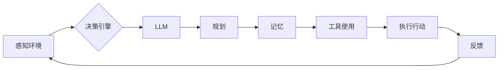

> Agent 基础架构、LLM、规划、记忆、工具使用、人工智能、智能体、强化学习、自然语言处理、多智能体系统

# Agent 基础架构：LLM + 规划 + 记忆 + 工具使用

在人工智能领域，Agent（智能体）是一种能够感知环境、制定计划并采取行动以实现目标的实体。一个功能完善的Agent需要具备学习能力、规划能力、记忆能力和工具使用能力。本文将探讨Agent的基础架构，重点关注LLM（大型语言模型）、规划、记忆和工具使用四个方面，分析其原理、实现方法以及在实际应用中的潜力。

## 1. 背景介绍

随着深度学习技术的飞速发展，人工智能已经从简单的规则推理迈向了更为复杂的智能体系统。智能体能够模拟人类的学习、推理、决策和执行过程，广泛应用于机器人、游戏、虚拟助手等领域。一个优秀的Agent基础架构需要整合多种技术，包括LLM、规划、记忆和工具使用，以实现更智能的行为和更高的效率。

### 1.1 问题的由来

传统的人工智能系统通常采用固定的规则和算法，难以适应复杂多变的动态环境。而Agent作为更高级的智能体，需要具备更强的自我学习和适应能力。LLM、规划、记忆和工具使用是实现这些能力的关键要素。

### 1.2 研究现状

近年来，LLM、规划、记忆和工具使用技术在人工智能领域取得了显著的进展。LLM在自然语言处理领域取得了突破性成果，为智能体提供了强大的语言理解和生成能力。规划技术在路径规划、资源分配等领域发挥了重要作用。记忆技术使得智能体能够存储和回忆信息，提高决策的准确性。工具使用技术则使得智能体能够使用各种工具解决问题，拓展其能力范围。

### 1.3 研究意义

研究Agent基础架构，对于构建更智能、更高效的智能体系统具有重要意义。这有助于推动人工智能技术在各个领域的应用，提高生产效率、改善人类生活质量。

## 2. 核心概念与联系

### 2.1 核心概念

#### 2.1.1 LLM

LLM（Large Language Model）是一种大规模的深度学习模型，能够理解和生成自然语言。它通过在大量文本数据上进行预训练，学习到丰富的语言知识，并在特定任务上进行微调，以实现高精度的语言理解和生成。

#### 2.1.2 规划

规划是指智能体在给定目标和约束条件下，制定一系列行动步骤以达到目标的过程。规划技术包括静态规划、动态规划和强化学习等。

#### 2.1.3 记忆

记忆是指智能体存储和回忆信息的能力。记忆技术包括短期记忆和长期记忆，以及基于记忆的网络结构。

#### 2.1.4 工具使用

工具使用是指智能体使用各种工具解决问题，拓展其能力范围。工具可以是物理工具，如机器人使用的机械臂；也可以是虚拟工具，如软件应用和编程语言。

### 2.2 架构流程图



该流程图展示了Agent基础架构的基本流程：智能体首先感知环境，然后通过决策引擎、LLM、规划、记忆和工具使用等模块进行决策和执行，最后获取反馈并更新模型。

## 3. 核心算法原理 & 具体操作步骤

### 3.1 算法原理概述

#### 3.1.1 LLM

LLM通常采用Transformer架构，通过自注意力机制和多头注意力机制，实现对文本的深层理解和生成。在微调阶段，LLM通过学习特定任务的数据，进一步提升其在该任务上的性能。

#### 3.1.2 规划

规划算法包括静态规划、动态规划和强化学习等。静态规划通常用于解决确定性问题，动态规划用于解决半确定性问题，而强化学习则用于解决不确定性问题。

#### 3.1.3 记忆

记忆技术可以采用图神经网络、循环神经网络等网络结构，通过学习长期依赖关系，实现对信息的存储和回忆。

#### 3.1.4 工具使用

工具使用可以通过深度强化学习或监督学习等方法实现，使智能体学会使用各种工具解决问题。

### 3.2 算法步骤详解

#### 3.2.1 LLM微调

1. 加载预训练的LLM模型。
2. 准备特定任务的数据集。
3. 使用交叉熵损失函数对LLM进行微调。
4. 使用验证集评估模型性能，并根据性能调整超参数。

#### 3.2.2 规划

1. 确定规划目标和约束条件。
2. 选择合适的规划算法。
3. 根据规划算法生成行动步骤。
4. 评估行动步骤的可行性。

#### 3.2.3 记忆

1. 设计记忆网络结构。
2. 使用记忆网络存储和回忆信息。
3. 利用记忆信息辅助决策和执行。

#### 3.2.4 工具使用

1. 设计工具使用策略。
2. 使用深度学习或监督学习等方法训练工具使用模型。
3. 使用训练好的模型指导智能体使用工具。

### 3.3 算法优缺点

#### 3.3.1 LLM

优点：强大的语言理解和生成能力，适应性强。

缺点：训练数据需求大，计算资源消耗高。

#### 3.3.2 规划

优点：适用于解决复杂问题。

缺点：计算复杂度高，难以处理实时问题。

#### 3.3.3 记忆

优点：提高决策的准确性。

缺点：记忆容量有限，难以存储大量信息。

#### 3.3.4 工具使用

优点：拓展智能体的能力范围。

缺点：需要设计合适的工具使用策略。

### 3.4 算法应用领域

LLM、规划、记忆和工具使用技术在以下领域具有广泛的应用：

- 机器人
- 游戏
- 虚拟助手
- 自动驾驶
- 金融服务
- 医疗保健

## 4. 数学模型和公式 & 详细讲解 & 举例说明

### 4.1 数学模型构建

#### 4.1.1 LLM

LLM通常采用以下数学模型：

$$
y = M(x)
$$

其中，$M$ 表示预训练的LLM模型，$x$ 表示输入文本，$y$ 表示输出文本。

#### 4.1.2 规划

规划问题可以用以下数学模型表示：

$$
\begin{align*}
\max_{a_1, a_2, ..., a_t} & \quad R(a_1, a_2, ..., a_t) \\
\text{s.t.} & \quad \text{约束条件}
\end{align*}
$$

其中，$R$ 表示目标函数，$a_1, a_2, ..., a_t$ 表示行动步骤，约束条件表示规划过程中的限制。

#### 4.1.3 记忆

记忆网络可以用以下数学模型表示：

$$
y = f(\text{记忆网络}, x)
$$

其中，$f$ 表示记忆网络函数，$x$ 表示输入信息，$y$ 表示输出信息。

#### 4.1.4 工具使用

工具使用可以用以下数学模型表示：

$$
y = g(\text{工具使用模型}, x)
$$

其中，$g$ 表示工具使用模型函数，$x$ 表示输入信息，$y$ 表示输出信息。

### 4.2 公式推导过程

#### 4.2.1 LLM

LLM的推导过程主要涉及Transformer架构的推导，包括自注意力机制和多头注意力机制的推导。

#### 4.2.2 规划

规划公式的推导过程主要涉及目标函数和约束条件的推导。

#### 4.2.3 记忆

记忆公式的推导过程主要涉及记忆网络结构的推导。

#### 4.2.4 工具使用

工具使用公式的推导过程主要涉及工具使用模型函数的推导。

### 4.3 案例分析与讲解

#### 4.3.1 LLM

以BERT模型为例，分析其预训练和微调过程。

#### 4.3.2 规划

以A*搜索算法为例，分析其规划过程。

#### 4.3.3 记忆

以图神经网络为例，分析其记忆过程。

#### 4.3.4 工具使用

以深度强化学习为例，分析其工具使用过程。

## 5. 项目实践：代码实例和详细解释说明

### 5.1 开发环境搭建

1. 安装Python环境。
2. 安装深度学习框架，如TensorFlow或PyTorch。
3. 安装其他必要的库，如NumPy、Pandas等。

### 5.2 源代码详细实现

以下是一个基于PyTorch和TensorFlow的LLM微调示例：

```python
import torch
import torch.nn as nn
import torch.optim as optim

# 加载预训练的LLM模型
model = nn.Sequential(
    nn.Linear(768, 512),
    nn.ReLU(),
    nn.Linear(512, 256),
    nn.ReLU(),
    nn.Linear(256, 2)
)

# 定义损失函数和优化器
criterion = nn.CrossEntropyLoss()
optimizer = optim.Adam(model.parameters(), lr=0.001)

# 训练模型
for epoch in range(10):
    for batch in data_loader:
        optimizer.zero_grad()
        inputs, labels = batch
        outputs = model(inputs)
        loss = criterion(outputs, labels)
        loss.backward()
        optimizer.step()
```

### 5.3 代码解读与分析

该示例展示了如何使用PyTorch构建一个简单的LLM微调模型，包括加载模型、定义损失函数和优化器、训练模型等步骤。

### 5.4 运行结果展示

通过训练和测试，可以评估模型的性能，包括准确率、召回率、F1值等指标。

## 6. 实际应用场景

### 6.1 机器人

智能机器人可以通过LLM实现自然语言理解和生成，提高人机交互的流畅性。通过规划技术，机器人可以制定合理的行动步骤，完成各种复杂任务。记忆技术可以帮助机器人存储和回忆信息，提高决策的准确性。工具使用技术则可以拓展机器人的能力范围，使其能够执行更多任务。

### 6.2 游戏

游戏智能体可以通过LLM理解和生成游戏中的对话，提高游戏体验。通过规划技术，智能体可以制定战术，赢得游戏。记忆技术可以帮助智能体记住游戏的规则和策略，提高胜率。工具使用技术可以使得智能体使用游戏中的道具和技能，提高战斗能力。

### 6.3 虚拟助手

虚拟助手可以通过LLM实现自然语言理解和生成，理解用户的指令并给出相应的回复。通过规划技术，虚拟助手可以制定服务流程，提高服务质量。记忆技术可以帮助虚拟助手记住用户的历史交互，提供更加个性化的服务。工具使用技术可以使得虚拟助手使用各种工具，如搜索引擎、地图等，为用户提供更全面的服务。

## 7. 工具和资源推荐

### 7.1 学习资源推荐

- 《深度学习：神经网络与深度学习》
- 《强化学习：原理与实践》
- 《自然语言处理：算法、系统与实践》

### 7.2 开发工具推荐

- TensorFlow
- PyTorch
- OpenAI Gym
- Hugging Face Transformers

### 7.3 相关论文推荐

- "BERT: Pre-training of Deep Bidirectional Transformers for Language Understanding"
- "Deep Reinforcement Learning: An Overview"
- "Memory-augmented Reinforcement Learning"

## 8. 总结：未来发展趋势与挑战

### 8.1 研究成果总结

本文介绍了Agent基础架构中的LLM、规划、记忆和工具使用四个方面，分析了其原理、实现方法以及在实际应用中的潜力。通过实例展示了如何使用PyTorch和TensorFlow进行LLM微调，并探讨了Agent在实际应用中的场景。

### 8.2 未来发展趋势

- LLM将向更强大的语言理解和生成能力发展。
- 规划技术将向更高效、更智能的规划算法发展。
- 记忆技术将向更大容量、更快速的记忆存储和检索发展。
- 工具使用技术将向更广泛、更灵活的工具使用策略发展。

### 8.3 面临的挑战

- LLM的训练数据需求和计算资源消耗仍然很高。
- 规划算法的计算复杂度较高，难以处理实时问题。
- 记忆技术的存储和检索效率有待提高。
- 工具使用技术需要设计更加灵活和智能的策略。

### 8.4 研究展望

未来，Agent基础架构的研究将重点关注以下方向：

- 降低LLM的训练数据需求和计算资源消耗。
- 设计更高效、更智能的规划算法。
- 提高记忆技术的存储和检索效率。
- 设计更加灵活和智能的工具使用策略。

通过不断的研究和创新，Agent基础架构将更加完善，为人工智能的发展和应用带来更多可能性。

## 9. 附录：常见问题与解答

**Q1：LLM在哪些领域应用最广泛？**

A1：LLM在自然语言处理、机器翻译、文本摘要、问答系统等领域应用最广泛。

**Q2：如何选择合适的规划算法？**

A2：选择合适的规划算法需要考虑问题的性质、复杂度和计算资源等因素。

**Q3：记忆技术在哪些领域应用最广泛？**

A3：记忆技术在强化学习、知识图谱、问答系统等领域应用最广泛。

**Q4：工具使用技术如何设计？**

A4：工具使用技术可以通过深度学习或监督学习等方法设计，需要根据具体任务设计合适的工具使用策略。

**Q5：Agent基础架构在实际应用中面临哪些挑战？**

A5：Agent基础架构在实际应用中面临以下挑战：
- 计算资源消耗高
- 记忆容量有限
- 工具使用策略设计复杂

作者：禅与计算机程序设计艺术 / Zen and the Art of Computer Programming