                 

# 自监督学习原理与代码实战案例讲解

> 关键词：自监督学习,自训练,预训练,生成对抗网络,GAN,潜在语义分析,LSA,稀疏矩阵分解,SVD,Transformer,语言模型

## 1. 背景介绍

### 1.1 问题由来
自监督学习（Self-Supervised Learning）是一种利用数据自身特性进行模型训练的技术。在传统监督学习中，模型需要通过人工标注数据来学习，这不仅耗费大量人力和时间，而且在标注不准确或不充分的情况下，模型的学习效果会大打折扣。自监督学习则通过设计一些无需标注的数据特性（比如数据本身的顺序、对立性、重复性等），来训练模型，从而提高模型泛化能力和学习效率。

### 1.2 问题核心关键点
自监督学习的核心在于如何设计合理的数据特性来引导模型学习。常见的自监督任务包括：
1. 数据顺序：利用数据的顺序特性进行学习，如下一个词预测、自回归语言模型等。
2. 数据对立性：通过对比数据中的正反例进行学习，如掩码语言模型、短语预测等。
3. 数据重复性：利用数据中出现的重复部分进行学习，如实例替换、句子重构等。

自监督学习被广泛应用于自然语言处理（NLP）、计算机视觉（CV）、语音识别等众多领域，成为现代深度学习中的重要组成部分。本文将详细讲解自监督学习的核心概念，并通过一个具体的例子——基于生成对抗网络（GAN）的图像自训练，来展示自监督学习的实践应用。

### 1.3 问题研究意义
研究自监督学习方法，对于提高模型的泛化能力、降低人工标注成本、加速模型训练速度、提升数据利用率等方面，具有重要意义：

1. 提高模型泛化能力：自监督学习能够学习到数据的潜在表示，从而提高模型在未见数据上的泛化能力。
2. 降低人工标注成本：无需人工标注数据，即可进行模型训练，大大降低标注成本。
3. 加速模型训练速度：自监督学习可以充分利用数据中隐含的信息，加快模型收敛速度。
4. 提升数据利用率：自监督学习能够挖掘更多数据的信息，提高数据利用率，减少浪费。
5. 赋能产业升级：自监督学习方法使得深度学习技术更容易被各行各业所采用，为传统行业数字化转型升级提供新的技术路径。

## 2. 核心概念与联系

### 2.1 核心概念概述

为更好地理解自监督学习，本节将介绍几个密切相关的核心概念：

- 自监督学习（Self-Supervised Learning）：利用数据本身的特性进行无标注模型训练的技术，提升模型泛化能力和学习效率。
- 自训练（Self-Training）：使用部分或全部预测标签进行模型训练，利用自身预测结果提高模型性能。
- 预训练（Pre-training）：在大规模无标签数据上，通过自监督学习任务进行模型训练，学习数据的通用表示。
- 生成对抗网络（GAN）：一种生成模型，通过对抗训练，生成高质量的图像、文本等数据。
- 潜在语义分析（LSA）：通过分解文本矩阵，学习词向量空间中的潜在语义结构，提高文本表示质量。
- 稀疏矩阵分解（SVD）：通过奇异值分解，将高维矩阵分解为低维矩阵，提高矩阵的稀疏性和可解释性。
- Transformer：一种基于自注意力机制的深度学习架构，广泛应用于NLP领域。
- 语言模型（Language Model）：衡量给定序列的概率分布，预测下一个词或字符的概率，提升NLP任务的性能。

这些核心概念之间的逻辑关系可以通过以下Mermaid流程图来展示：

```mermaid
graph TB
    A[自监督学习] --> B[自训练]
    A --> C[预训练]
    C --> D[生成对抗网络]
    C --> E[潜在语义分析]
    C --> F[稀疏矩阵分解]
    C --> G[Transformer]
    C --> H[语言模型]
    D --> I[图像生成]
    E --> J[词向量]
    F --> K[稀疏表示]
    G --> L[NLP任务]
    H --> M[预测概率]
```



这个流程图展示了一系列与自监督学习相关的核心概念及其之间的关系：

1. 自监督学习通过自训练、预训练、生成对抗网络等技术手段，学习数据的潜在表示。
2. 预训练通常在大规模无标签数据上进行，通过自监督学习任务，学习数据的通用表示。
3. 生成对抗网络通过对抗训练，生成高质量的图像、文本等数据，进一步丰富数据集。
4. 潜在语义分析和稀疏矩阵分解通过分解数据矩阵，学习数据中的潜在结构和特征。
5. Transformer和语言模型通过学习数据序列的表示，提升NLP任务的性能。

这些概念共同构成了自监督学习的生态系统，使得模型能够高效、准确地学习数据的潜在表示，从而提升其在特定任务上的表现。

### 2.2 概念间的关系

这些核心概念之间存在着紧密的联系，形成了自监督学习的完整生态系统。下面我们通过几个Mermaid流程图来展示这些概念之间的关系。

#### 2.2.1 自监督学习的核心架构


这个流程图展示了自监督学习的核心架构：

1. 自监督学习通过自训练和预训练等技术手段，学习数据的潜在表示。
2. 自训练利用数据特性进行模型训练，提升模型性能。
3. 预训练在大规模无标签数据上进行，学习数据的通用表示。
4. 生成对抗网络通过对抗训练，生成高质量的图像、文本等数据，丰富数据集。

#### 2.2.2 自监督学习的应用场景


这个流程图展示了自监督学习在实际应用中的场景：

1. 大规模数据通过预训练学习数据的通用表示。
2. 自监督学习利用生成对抗网络等技术，生成高质量的数据。
3. 潜在语义分析和稀疏矩阵分解通过分解数据矩阵，学习数据中的潜在结构和特征。
4. Transformer和语言模型通过学习数据序列的表示，提升NLP任务的性能。

## 3. 核心算法原理 & 具体操作步骤
### 3.1 算法原理概述

自监督学习的核心思想是利用数据自身的特性进行模型训练，提升模型泛化能力和学习效率。常见的自监督任务包括：

1. 数据顺序：利用数据的顺序特性进行学习，如下一个词预测、自回归语言模型等。
2. 数据对立性：通过对比数据中的正反例进行学习，如掩码语言模型、短语预测等。
3. 数据重复性：利用数据中出现的重复部分进行学习，如实例替换、句子重构等。

形式化地，假设自监督任务为 $T$，模型的参数为 $\theta$，训练数据为 $D=\{(x_i, y_i)\}_{i=1}^N$，其中 $x_i$ 为输入数据，$y_i$ 为模型的预测输出。自监督学习目标是最小化经验风险：

$$
\hat{\theta}=\mathop{\arg\min}_{\theta} \mathcal{L}(M_{\theta},D)
$$

其中 $\mathcal{L}$ 为损失函数，通常为负对数似然、交叉熵等。自监督学习通过优化 $\theta$，使得模型在未见数据上的泛化能力更强，学习效率更高。

### 3.2 算法步骤详解

自监督学习的一般步骤包括：

1. 数据准备：收集大规模无标签数据，确保数据的多样性和代表性。
2. 任务设计：根据数据特性设计自监督任务，如掩码语言模型、下一个词预测等。
3. 模型训练：使用自监督任务训练模型，通过对比模型输出与真实标签进行误差反馈。
4. 模型评估：在未见数据上评估模型性能，衡量泛化能力。
5. 任务适配：将预训练模型适应特定任务，通过微调或改写提示模板等方式进行优化。

以生成对抗网络（GAN）的图像自训练为例，具体步骤如下：

**Step 1: 准备数据集**

1. 收集大规模未标注图像数据集，如MNIST、CIFAR-10等。
2. 将图像数据转换为张量，并进行归一化处理，确保数据一致性。

**Step 2: 生成对抗网络（GAN）模型构建**

1. 设计生成器和判别器的网络结构，如U-Net、ResNet等。
2. 使用PyTorch等深度学习框架实现生成器和判别器。
3. 定义损失函数，如Wasserstein距离、Cross-Entropy损失等，用于训练GAN模型。

**Step 3: 生成对抗训练**

1. 交替训练生成器和判别器，生成器尝试生成逼真的假图像，判别器尝试区分真实图像和假图像。
2. 每轮训练中，生成器先优化，判别器后优化。
3. 通过梯度下降等优化算法，不断更新模型参数，提高生成质量和判别能力。

**Step 4: 图像自训练**

1. 使用预训练的GAN模型生成高质量的图像。
2. 将生成的图像作为训练数据，进行自训练。
3. 使用生成的图像进行模型微调或改写提示模板，进一步提升模型性能。

**Step 5: 模型评估**

1. 在未见数据上评估模型性能，如Inception Score、FID等指标。
2. 使用评估结果指导模型优化，确保模型泛化能力。

### 3.3 算法优缺点

自监督学习的优点包括：

1. 无需标注数据：自监督学习利用数据自身的特性进行训练，大大降低了标注成本。
2. 数据利用率高：自监督学习能够挖掘数据中的潜在结构和特征，提高数据利用率。
3. 泛化能力强：自监督学习能够学习到数据的潜在表示，提升模型泛化能力。
4. 训练效率高：自监督学习可以通过多任务学习等方式，提升模型训练速度。

自监督学习的缺点包括：

1. 数据生成质量：自监督学习的效果很大程度上依赖于生成的数据质量，如果生成数据质量不高，模型效果会大打折扣。
2. 任务设计复杂：自监督任务的设计需要深入理解数据特性，设计不当可能导致模型过拟合。
3. 模型训练复杂：自监督学习通常需要复杂的生成网络，训练难度较大，需要丰富的计算资源。
4. 模型可解释性差：自监督学习的模型难以解释其内部工作机制，缺乏可解释性。

尽管存在这些缺点，但自监督学习在数据稀缺、标注成本高昂的场景中具有显著优势，已经成为现代深度学习中的重要组成部分。

### 3.4 算法应用领域

自监督学习在众多领域中得到了广泛应用，包括：

- 计算机视觉：用于生成逼真的图像、增强数据多样性等。
- 自然语言处理：用于生成语义正确的句子、提升语言模型性能等。
- 语音识别：用于生成逼真的语音信号、增强语音识别效果等。
- 信号处理：用于生成高质量的信号波形、增强信号处理能力等。
- 推荐系统：用于生成个性化推荐、增强用户行为理解等。

## 4. 数学模型和公式 & 详细讲解 & 举例说明
### 4.1 数学模型构建

以生成对抗网络（GAN）的图像自训练为例，我们首先定义模型的数学模型：

假设生成器的参数为 $\theta_G$，判别器的参数为 $\theta_D$。训练数据为 $D=\{(x_i, y_i)\}_{i=1}^N$，其中 $x_i$ 为输入数据，$y_i$ 为真实标签。

生成器的目标是最小化生成图像和真实图像之间的距离，判别器的目标是最小化生成图像和真实图像之间的差异。具体的数学模型如下：

生成器损失函数：

$$
\mathcal{L}_G = \mathbb{E}_{x \sim D_G}[\log D(G(x))] + \mathbb{E}_{x \sim D_{\text{real}}}[\log(1 - D(G(x)))]
$$

判别器损失函数：

$$
\mathcal{L}_D = \mathbb{E}_{x \sim D_G}[\log D(G(x))] + \mathbb{E}_{x \sim D_{\text{real}}}[\log(1 - D(x))]
$$

其中 $D_G$ 和 $D_{\text{real}}$ 分别表示生成器和真实图像的分布。

### 4.2 公式推导过程

接下来，我们将推导生成器和判别器损失函数的梯度，并介绍具体的训练步骤：

生成器的梯度计算如下：

$$
\frac{\partial \mathcal{L}_G}{\partial \theta_G} = \nabla_{\theta_G} \log D(G(x)) - \nabla_{\theta_G} \log(1 - D(G(x)))
$$

判别器的梯度计算如下：

$$
\frac{\partial \mathcal{L}_D}{\partial \theta_D} = \nabla_{\theta_D} \log D(G(x)) - \nabla_{\theta_D} \log(1 - D(x))
$$

在训练过程中，我们交替更新生成器和判别器的参数，逐步提升生成器的生成能力和判别器的判别能力。具体的训练步骤如下：

1. 生成器先优化，生成一批假图像。
2. 判别器后优化，尝试区分真实图像和假图像。
3. 生成器再优化，利用判别器的反馈进一步优化生成质量。
4. 交替训练，直到生成器和判别器达到平衡状态。

### 4.3 案例分析与讲解

以MNIST手写数字数据集为例，展示GAN的图像自训练过程：

1. 数据准备：收集MNIST手写数字数据集，进行数据归一化和预处理。
2. 模型构建：设计生成器和判别器的网络结构，如U-Net、ResNet等。
3. 训练过程：交替训练生成器和判别器，逐步提升生成质量和判别能力。
4. 图像自训练：使用预训练的GAN模型生成高质量的假图像。
5. 模型评估：在未见数据上评估模型性能，如Inception Score、FID等指标。

在实际应用中，我们可以通过GAN生成高质量的图像数据，然后利用生成的图像进行自训练，进一步提升模型的泛化能力和性能。

## 5. 项目实践：代码实例和详细解释说明
### 5.1 开发环境搭建

在进行GAN的图像自训练实践前，我们需要准备好开发环境。以下是使用Python进行PyTorch开发的简单环境配置：

1. 安装Anaconda：从官网下载并安装Anaconda，用于创建独立的Python环境。
2. 创建并激活虚拟环境：
```bash
conda create -n pytorch-env python=3.8 
conda activate pytorch-env
```

3. 安装PyTorch：根据CUDA版本，从官网获取对应的安装命令。例如：
```bash
conda install pytorch torchvision torchaudio cudatoolkit=11.1 -c pytorch -c conda-forge
```

4. 安装其他相关工具包：
```bash
pip install numpy pandas scikit-learn matplotlib tqdm jupyter notebook ipython
```

完成上述步骤后，即可在`pytorch-env`环境中开始GAN的图像自训练实践。

### 5.2 源代码详细实现

下面我们以GAN的图像自训练为例，给出完整的代码实现。

首先，定义GAN模型的类：

```python
import torch
import torch.nn as nn
import torch.optim as optim
from torch.utils.data import DataLoader
import torchvision.transforms as transforms
import torchvision.datasets as datasets

class GAN(nn.Module):
    def __init__(self, input_size, output_size, hidden_size):
        super(GAN, self).__init__()
        self.encoder = nn.Sequential(
            nn.Linear(input_size, hidden_size),
            nn.ReLU(),
            nn.Linear(hidden_size, output_size),
            nn.Sigmoid()
        )
        self.decoder = nn.Sequential(
            nn.Linear(input_size, hidden_size),
            nn.ReLU(),
            nn.Linear(hidden_size, output_size),
            nn.Sigmoid()
        )
        
    def forward(self, x):
        return self.encoder(x), self.decoder(x)

    def sample(self, z):
        return self.encoder(z), self.decoder(z)
```

然后，定义训练函数：

```python
def train_GAN(gan, dataloader, num_epochs, batch_size, learning_rate):
    criterion = nn.BCELoss()
    optimizer_G = optim.Adam(gan.encoder.parameters(), lr=learning_rate)
    optimizer_D = optim.Adam(gan.decoder.parameters(), lr=learning_rate)
    
    for epoch in range(num_epochs):
        for batch_idx, (real_images, _) in enumerate(dataloader):
            real_images = real_images.view(real_images.size(0), -1)
            z = torch.randn(batch_size, 100)
            fake_images = gan.sample(z)
            
            # Adversarial loss for real images
            real_output = gan.decoder(real_images)
            real_loss = criterion(real_output, real_images)
            
            # Adversarial loss for fake images
            fake_output = gan.decoder(fake_images)
            fake_loss = criterion(fake_output, fake_images)
            
            # Adversarial loss for real and fake images
            combined_output = torch.cat([real_output, fake_output], 0)
            combined_loss = criterion(combined_output, torch.cat([real_images, real_images], 0))
            
            # Train GAN
            optimizer_G.zero_grad()
            real_loss.backward(torch.ones_like(real_loss))
            fake_loss.backward(torch.ones_like(fake_loss))
            combined_loss.backward(torch.ones_like(combined_loss))
            optimizer_G.step()
            
            optimizer_D.zero_grad()
            real_loss.backward(torch.ones_like(real_loss))
            fake_loss.backward(torch.ones_like(fake_loss))
            combined_loss.backward(torch.ones_like(combined_loss))
            optimizer_D.step()
            
            if (batch_idx+1) % 100 == 0:
                print('Epoch [{}/{}], Batch [{}/{}], G Loss: {:.4f}, D Loss: {:.4f}'
                      .format(epoch+1, num_epochs, batch_idx+1, len(dataloader), float(real_loss), float(fake_loss)))
```

最后，启动训练流程：

```python
batch_size = 100
num_epochs = 100
learning_rate = 0.0002

# 加载数据集
transform = transforms.Compose([transforms.ToTensor()])
dataloader = DataLoader(datasets.MNIST('../data', train=True, download=True, transform=transform), batch_size=batch_size, shuffle=True)

# 初始化模型
model = GAN(784, 100, 256)
optimizer = optim.Adam(model.parameters(), lr=learning_rate)

# 训练模型
train_GAN(model, dataloader, num_epochs, batch_size, learning_rate)
```

以上就是使用PyTorch进行GAN图像自训练的完整代码实现。可以看到，通过简单的代码实现，我们可以使用GAN生成高质量的图像数据，并进行自训练，进一步提升模型性能。

### 5.3 代码解读与分析

让我们再详细解读一下关键代码的实现细节：

**GAN类**：
- `__init__`方法：初始化生成器和判别器的参数和网络结构。
- `forward`方法：定义前向传播过程，将输入数据通过生成器和判别器，得到输出和损失函数。
- `sample`方法：生成一批随机噪声数据，通过生成器得到假图像，通过判别器得到判别结果。

**训练函数**：
- 定义损失函数：使用二元交叉熵损失函数。
- 定义优化器：使用Adam优化器，分别对生成器和判别器进行优化。
- 交替训练：交替进行生成器和判别器的优化，逐步提升生成质量和判别能力。

**训练流程**：
- 定义训练参数：batch size、epoch数、学习率等。
- 加载数据集：使用MNIST手写数字数据集，并进行数据归一化和预处理。
- 初始化模型：定义GAN模型，并进行参数初始化。
- 训练模型：调用训练函数，交替训练生成器和判别器，逐步提升模型性能。

通过以上代码实现，我们可以轻松地使用GAN生成高质量的图像数据，并利用生成的图像进行自训练，进一步提升模型的泛化能力和性能。

## 6. 实际应用场景
### 6.1 图像生成

GAN在图像生成领域有着广泛的应用，如生成逼真的图像、增强数据多样性等。具体应用场景包括：

- 艺术创作：使用GAN生成逼真的艺术作品，如油画、摄影作品等。
- 游戏设计：生成逼真的游戏角色和场景，提升游戏体验。
- 医疗影像：生成高质量的医疗影像，辅助医学诊断。

### 6.2 数据增强

GAN还可以用于数据增强，提升数据集的多样性和质量。具体应用场景包括：

- 自然语言处理：生成语义正确的句子，提升语言模型的泛化能力。
- 计算机视觉：生成多样化的图像，增强数据集的多样性。
- 语音识别：生成高质量的语音信号，增强语音识别效果。

### 6.3 图像修复

GAN还可以用于图像修复，修复受损或模糊的图像，提升图像质量。具体应用场景包括：

- 医学影像：修复受损的医学影像，辅助医学诊断和治疗。
- 视频处理：修复受损的视频帧，提升视频质量。
- 图形设计：修复模糊的图像，提升图像清晰度。

### 6.4 未来应用展望

随着GAN技术的不断进步，其在图像生成、数据增强、图像修复等领域的应用前景将更加广阔。未来，GAN技术还将与其他AI技术结合，如自监督学习、自然语言处理等，拓展其应用场景，提升其性能和实用性。

## 7. 工具和资源推荐
### 7.1 学习资源推荐

为了帮助开发者系统掌握GAN的图像自训练理论基础和实践技巧，这里推荐一些优质的学习资源：

1. 《Generative Adversarial Networks: An Overview》（Papers）：一篇综述性论文，系统介绍GAN的基本原理和应用。
2. CS231n《Convolutional Neural Networks for Visual Recognition》课程：斯坦福大学开设的计算机视觉课程，包含GAN相关的讲义和作业。
3. 《The Elements of Programming Interviews in Python》（书籍）：涵盖多种算法和数据结构，包括GAN的实现和应用。
4. TensorFlow官方文档：TensorFlow的官方文档，提供了丰富的GAN样例代码和教程，是学习GAN的重要资料。
5. PyTorch官方文档：PyTorch的官方文档，提供了详细的GAN实现和应用示例，是学习GAN的好帮手。

通过对这些资源的学习实践，相信你一定能够快速掌握GAN的图像自训练的精髓，并用于解决实际的计算机视觉问题。

### 7.2 开发工具推荐

高效的开发离不开优秀的工具支持。以下是几款用于GAN图像自训练开发的常用工具：

1. PyTorch：基于Python的开源深度学习框架，灵活动态的计算图，适合快速迭代研究。大部分深度学习模型都有PyTorch版本的实现。
2. TensorFlow：由Google主导开发的开源深度学习框架，生产部署方便，适合大规模工程应用。同样有丰富的深度学习模型资源。
3. Keras：高层API，提供了简单易用的深度学习模型构建接口，适合初学者入门。
4. Weights & Biases：模型训练的实验跟踪工具，可以记录和可视化模型训练过程中的各项指标，方便对比和调优。与主流深度学习框架无缝集成。
5. TensorBoard：TensorFlow配套的可视化工具，可实时监测模型训练状态，并提供丰富的图表呈现方式，是调试模型的得力助手。

合理利用这些工具，可以显著提升GAN图像自训练任务的开发效率，加快创新迭代的步伐。

### 7.3 相关论文推荐

GAN的图像自训练在学术界和工业界都得到了广泛关注。以下是几篇奠基性的相关论文，推荐阅读：

1. Generative Adversarial Nets（GAN原论文）：提出GAN的基本原理和架构，开启深度学习生成模型的新纪元。
2. Improved Techniques for Training GANs（WGAN）：提出Wasserstein GAN，改进了GAN的训练过程，提高生成质量。
3. Mode Regularization for Training Generative Networks（MARGAN）：提出MARGAN，引入模式回归约束，提高GAN的生成多样性和稳定性。
4. Progressive Growing of GANs for Improved Quality, Stability, and Variation（PG-GAN）：提出PG-GAN，逐步提升生成器网络的深度和宽度，提高生成质量。
5. Adversarial Discriminative Information Inference: An Alternative Approach for Generative Adversarial Networks（ADGAN）：提出ADGAN，通过替代训练方式，提高GAN的生成质量和稳定性。

这些论文代表了大规模语言模型微调技术的发展脉络。通过学习这些前沿成果，可以帮助研究者把握学科前进方向，激发更多的创新灵感。

除上述资源外，还有一些值得关注的前沿资源，帮助开发者紧跟GAN图像自训练技术的最新进展，例如：

1. arXiv论文预印本：人工智能领域最新研究成果的发布平台

