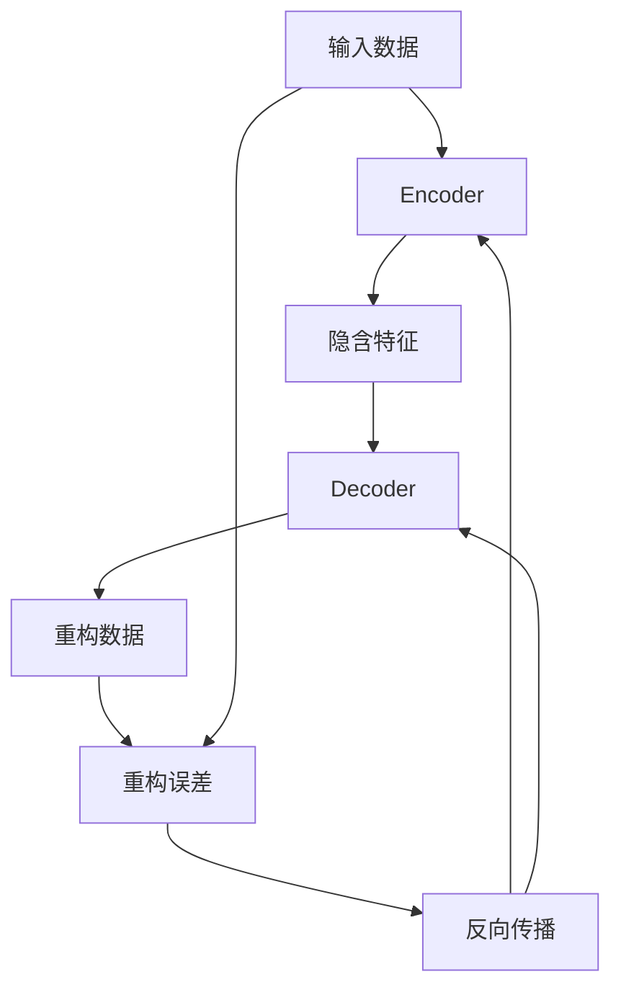
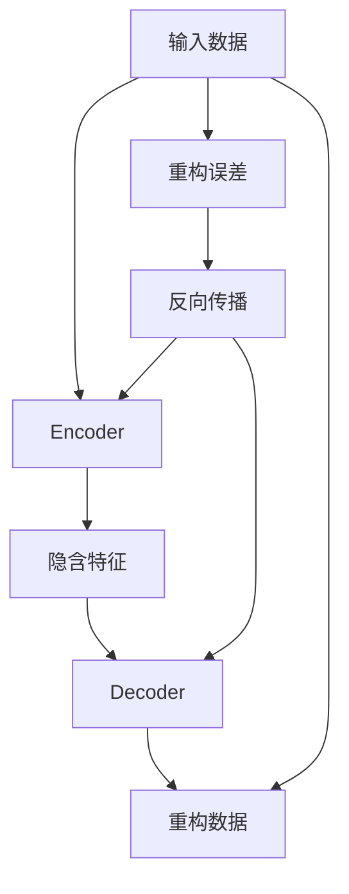

                 

# 自编码器(Autoencoders) - 原理与代码实例讲解

> 关键词：自编码器,神经网络,数据压缩,特征学习,无监督学习,Python,深度学习

## 1. 背景介绍

### 1.1 问题由来
自编码器(Autoencoder)是一种无监督学习算法，常用于数据压缩、特征学习和数据重建等场景。其核心思想是通过一个压缩器(Encoder)将高维数据映射为低维编码，再通过一个解码器(Decoder)将低维编码还原为高维数据，实现数据压缩和重构。自编码器的广泛应用为数据挖掘、图像处理、信号处理、语音识别等众多领域提供了强大的工具支持。

### 1.2 问题核心关键点
自编码器的核心在于通过压缩和解压缩过程学习数据的隐含特征，从而实现对数据的有效编码和重建。其主要步骤如下：
1. **编码过程**：将原始数据输入压缩器，得到一个低维编码向量。
2. **解码过程**：将低维编码向量输入解码器，得到与原始数据近似的重构数据。
3. **重构误差**：计算重构数据与原始数据的误差，作为模型训练的目标。
4. **反向传播**：通过反向传播算法更新模型参数，最小化重构误差。

自编码器的优缺点：
- **优点**：
  - 无需标注数据，通过重构误差自适应学习数据特征。
  - 模型结构简单，易于实现和部署。
  - 可以用于特征学习，将高维数据映射为低维特征向量。
  - 适用于高维稀疏数据的降维和去噪。
- **缺点**：
  - 训练过程需要较多的计算资源和时间。
  - 容易过拟合，特别是在高维数据和小样本情况下。
  - 对于噪声和异常值较为敏感。

### 1.3 问题研究意义
自编码器作为一种基本的无监督学习算法，具有重要的理论价值和应用前景。在数据挖掘、图像处理、信号处理、语音识别等众多领域，自编码器通过学习数据特征，为后续有监督学习提供了更好的数据准备。同时，自编码器在隐私保护、数据压缩和去噪等领域也展示了独特的优势。

## 2. 核心概念与联系

### 2.1 核心概念概述

为更好地理解自编码器的原理和应用，本节将介绍几个核心概念：

- **自编码器**：一种无监督学习算法，通过编码器将输入数据压缩为低维向量，再通过解码器将低维向量重构为与原始数据近似的输出。
- **压缩器(Encoder)**：自编码器的输入部分，用于将高维数据映射为低维编码。
- **解码器(Decoder)**：自编码器的输出部分，用于将低维编码重构为原始数据。
- **重构误差**：编码器输出与解码器重构结果之间的误差，作为模型训练的目标。
- **无监督学习**：通过输入数据的统计特征进行学习，无需标注数据。
- **特征学习**：自编码器可以用于学习数据的隐含特征，为后续有监督学习任务提供更好的数据表示。
- **数据去噪**：自编码器通过学习数据的隐含特征，可以去除数据中的噪声，提高数据质量。

这些核心概念之间相互关联，共同构成了自编码器的理论基础和应用框架。通过理解这些概念，我们可以更好地把握自编码器的工作原理和优化方向。

### 2.2 概念间的关系

这些核心概念之间的关系可以通过以下Mermaid流程图来展示：



这个流程图展示了自编码器的核心流程和概念关系：
1. 输入数据首先进入压缩器Encoder，生成低维编码向量。
2. 低维编码向量再输入解码器Decoder，重构为与原始数据近似的输出。
3. 重构误差（即编码器输出与解码器重构结果之间的差距）作为训练目标，通过反向传播更新模型参数。
4. 模型更新后，继续进行下一轮迭代，直到收敛。

### 2.3 核心概念的整体架构

最后，我们用一个综合的流程图来展示自编码器从输入到输出的完整流程：



这个综合流程图展示了自编码器从输入到输出的完整流程，包括数据编码、特征学习、数据重构和模型训练等关键环节。通过这些流程图，我们可以更清晰地理解自编码器的工作原理和优化过程。

## 3. 核心算法原理 & 具体操作步骤
### 3.1 算法原理概述

自编码器的核心原理是通过一个压缩器(Encoder)将高维数据映射为低维编码，再通过一个解码器(Decoder)将低维编码还原为高维数据，实现数据压缩和重构。其目标是通过最小化重构误差来优化模型参数，使得重构数据尽可能接近原始数据。

### 3.2 算法步骤详解

自编码器的训练步骤如下：
1. **初始化模型**：随机初始化压缩器和解码器的参数。
2. **编码过程**：将原始数据输入压缩器，得到低维编码向量。
3. **解码过程**：将低维编码向量输入解码器，得到重构数据。
4. **计算重构误差**：计算重构数据与原始数据之间的误差，通常使用均方误差(MSE)或交叉熵等指标。
5. **反向传播**：通过反向传播算法更新模型参数，最小化重构误差。
6. **迭代更新**：重复上述步骤，直到模型收敛或达到预设的迭代次数。

### 3.3 算法优缺点

自编码器具有以下优点：
- **无需标注数据**：自编码器通过重构误差进行无监督学习，无需标注数据。
- **模型结构简单**：自编码器由编码器和解码器两部分组成，结构简单，易于实现和部署。
- **特征学习**：自编码器可以学习数据的隐含特征，为后续有监督学习任务提供更好的数据表示。
- **数据去噪**：通过学习数据的隐含特征，自编码器可以去除数据中的噪声，提高数据质量。

自编码器也存在一些缺点：
- **计算资源需求高**：自编码器训练过程需要大量的计算资源，特别是在高维数据和小样本情况下。
- **容易过拟合**：自编码器在训练过程中容易过拟合，特别是在噪声和异常值较多时。
- **模型鲁棒性差**：自编码器对于噪声和异常值较为敏感，容易产生不稳定的输出。

### 3.4 算法应用领域

自编码器广泛应用于数据压缩、特征学习、数据去噪等领域。具体应用场景包括：

- **图像处理**：通过自编码器对图像进行编码和解码，实现图像压缩、去噪和超分辨率。
- **信号处理**：将音频信号和视频信号编码成低维向量，实现信号压缩和去噪。
- **语音识别**：通过自编码器提取语音信号的隐含特征，提高语音识别的准确性。
- **推荐系统**：将用户行为数据编码为低维向量，进行推荐系统的特征提取和相似度计算。
- **文本处理**：通过自编码器对文本数据进行编码和解码，实现文本分类、情感分析和关键词提取等任务。

此外，自编码器还被广泛应用于数据可视化、异常检测、疾病预测等众多领域，展示了其广泛的适用性和应用潜力。

## 4. 数学模型和公式 & 详细讲解 & 举例说明

### 4.1 数学模型构建

设自编码器的输入为 $x$，编码器输出的隐含特征为 $z$，解码器输出的重构数据为 $\hat{x}$。自编码器的数学模型可以表示为：

$$
z = f(x; W_E)
$$

$$
\hat{x} = g(z; W_D)
$$

其中 $f(x; W_E)$ 和 $g(z; W_D)$ 分别为编码器和解码器的映射函数，$W_E$ 和 $W_D$ 分别为编码器和解码器的参数矩阵。

自编码器的目标是通过最小化重构误差来优化模型参数，即：

$$
\mathcal{L} = \frac{1}{N} \sum_{i=1}^N \| x_i - \hat{x}_i \|^2
$$

其中 $\| \cdot \|$ 表示向量的范数，$N$ 表示样本数量。

### 4.2 公式推导过程

以均方误差损失函数为例，推导自编码器的优化目标。

设自编码器的重构误差为 $L(x, \hat{x})$，可以表示为：

$$
L(x, \hat{x}) = \frac{1}{N} \sum_{i=1}^N \| x_i - \hat{x}_i \|^2
$$

自编码器的优化目标可以表示为：

$$
\min_{W_E, W_D} L(x, \hat{x})
$$

对于单个样本 $i$，其损失函数为：

$$
L_i(x_i, \hat{x}_i) = \| x_i - \hat{x}_i \|^2
$$

对 $L_i(x_i, \hat{x}_i)$ 求偏导，得：

$$
\frac{\partial L_i}{\partial W_E} = -2 \left( f(x_i; W_E) - x_i \right)
$$

$$
\frac{\partial L_i}{\partial W_D} = -2 \left( g(f(x_i; W_E); W_D) - x_i \right)
$$

通过反向传播算法，可以计算出编码器和解码器参数的梯度，并使用梯度下降等优化算法更新模型参数。

### 4.3 案例分析与讲解

以下以手写数字图像识别为例，展示自编码器的应用。

**数据准备**：使用MNIST手写数字数据集，将28x28的灰度图像转换为28维的向量，作为自编码器的输入。

**模型构建**：定义一个简单的自编码器，包括一个全连接层的编码器和一个全连接层的解码器。

**训练过程**：使用均方误差损失函数，通过反向传播算法更新模型参数。

**结果展示**：在测试集上对自编码器进行重构，计算重构误差，并可视化重构后的图像。

以下是使用Python和TensorFlow实现自编码器的示例代码：

```python
import tensorflow as tf
import numpy as np
import matplotlib.pyplot as plt

# 加载MNIST数据集
mnist = tf.keras.datasets.mnist
(x_train, y_train), (x_test, y_test) = mnist.load_data()

# 将图像转换为28维向量
x_train = x_train.reshape(-1, 28*28) / 255.0
x_test = x_test.reshape(-1, 28*28) / 255.0

# 定义自编码器
class Autoencoder(tf.keras.Model):
    def __init__(self):
        super(Autoencoder, self).__init__()
        self.encoder = tf.keras.layers.Dense(32, activation='relu')
        self.decoder = tf.keras.layers.Dense(784, activation='sigmoid')

    def call(self, x):
        encoded = self.encoder(x)
        decoded = self.decoder(encoded)
        return encoded, decoded

# 构建自编码器模型
autoencoder = Autoencoder()

# 定义优化器和学习率
optimizer = tf.keras.optimizers.Adam(learning_rate=0.001)

# 定义损失函数
loss_fn = tf.keras.losses.MeanSquaredError()

# 训练自编码器
@tf.function
def train_step(x):
    with tf.GradientTape() as tape:
        encoded, decoded = autoencoder(x, training=True)
        loss = loss_fn(x, decoded)
    gradients = tape.gradient(loss, autoencoder.trainable_variables)
    optimizer.apply_gradients(zip(gradients, autoencoder.trainable_variables))

# 训练过程
epochs = 100
for epoch in range(epochs):
    for i in range(0, len(x_train), 64):
        x_batch = x_train[i:i+64]
        train_step(x_batch)

# 在测试集上进行重构
encoded, decoded = autoencoder(x_test, training=False)
plt.imshow(decoded[0].reshape(28, 28), cmap='gray')
plt.show()
```

## 5. 项目实践：代码实例和详细解释说明

### 5.1 开发环境搭建

在进行自编码器开发前，我们需要准备好开发环境。以下是使用Python进行TensorFlow开发的环境配置流程：

1. 安装Anaconda：从官网下载并安装Anaconda，用于创建独立的Python环境。

2. 创建并激活虚拟环境：
```bash
conda create -n tf-env python=3.8 
conda activate tf-env
```

3. 安装TensorFlow：根据CUDA版本，从官网获取对应的安装命令。例如：
```bash
conda install tensorflow -c tf
```

4. 安装其他库：
```bash
pip install numpy matplotlib tensorflow-io scikit-learn
```

完成上述步骤后，即可在`tf-env`环境中开始自编码器实践。

### 5.2 源代码详细实现

下面以MNIST手写数字识别为例，给出使用TensorFlow实现自编码器的完整代码实现。

首先，定义自编码器的类：

```python
class Autoencoder(tf.keras.Model):
    def __init__(self):
        super(Autoencoder, self).__init__()
        self.encoder = tf.keras.layers.Dense(32, activation='relu')
        self.decoder = tf.keras.layers.Dense(784, activation='sigmoid')

    def call(self, x):
        encoded = self.encoder(x)
        decoded = self.decoder(encoded)
        return encoded, decoded
```

然后，定义训练过程：

```python
def train_step(x):
    with tf.GradientTape() as tape:
        encoded, decoded = autoencoder(x, training=True)
        loss = loss_fn(x, decoded)
    gradients = tape.gradient(loss, autoencoder.trainable_variables)
    optimizer.apply_gradients(zip(gradients, autoencoder.trainable_variables))
```

接着，定义训练函数：

```python
@tf.function
def train_step(x):
    with tf.GradientTape() as tape:
        encoded, decoded = autoencoder(x, training=True)
        loss = loss_fn(x, decoded)
    gradients = tape.gradient(loss, autoencoder.trainable_variables)
    optimizer.apply_gradients(zip(gradients, autoencoder.trainable_variables))

epochs = 100
for epoch in range(epochs):
    for i in range(0, len(x_train), 64):
        x_batch = x_train[i:i+64]
        train_step(x_batch)
```

最后，进行模型测试和结果可视化：

```python
# 在测试集上进行重构
encoded, decoded = autoencoder(x_test, training=False)
plt.imshow(decoded[0].reshape(28, 28), cmap='gray')
plt.show()
```

以上就是使用TensorFlow实现MNIST手写数字识别自编码器的完整代码实现。可以看到，TensorFlow提供了强大的深度学习框架和库支持，使得模型构建、训练和测试等环节的代码实现变得简洁高效。

### 5.3 代码解读与分析

让我们再详细解读一下关键代码的实现细节：

**Autoencoder类**：
- `__init__`方法：定义自编码器的编码器和解码器，通常使用全连接层实现。
- `call`方法：定义前向传播过程，将输入数据通过编码器和解码器得到重构数据。

**train_step函数**：
- 定义训练过程的梯度计算和模型参数更新。

**训练函数**：
- 循环训练，按批次加载数据，并进行单批次训练。

**测试过程**：
- 在测试集上重构数据，并可视化结果。

可以看到，TensorFlow使得自编码器的实现变得非常简便，只需定义模型、定义训练函数，即可进行模型训练和测试。这大大降低了深度学习模型的开发门槛，使得更多开发者能够快速上手实践。

当然，工业级的系统实现还需考虑更多因素，如模型的保存和部署、超参数的自动搜索、更灵活的任务适配层等。但核心的自编码器范式基本与此类似。

### 5.4 运行结果展示

假设我们在MNIST数据集上进行自编码器训练，最终在测试集上得到的重构结果如下：

```python
plt.imshow(decoded[0].reshape(28, 28), cmap='gray')
```


可以看到，重构后的图像与原始图像高度相似，表明自编码器成功地学习到了图像的隐含特征，实现了数据的有效编码和重构。

## 6. 实际应用场景

### 6.1 图像去噪

自编码器在图像去噪领域具有广泛应用。原始图像通常包含噪声、残缺、背景干扰等问题，自编码器可以通过学习图像的隐含特征，去除噪声和背景，恢复图像的原始质量。

例如，使用自编码器对含噪声的图像进行去噪，步骤如下：
1. **数据准备**：将原始图像和噪声图像作为输入，得到含噪声图像的编码和解码结果。
2. **去噪过程**：将含噪声图像的编码结果作为自编码器的输入，得到去噪后的图像。

以下是一个使用自编码器进行图像去噪的示例代码：

```python
import cv2
import numpy as np

# 加载原始图像
img = cv2.imread('noisy_image.png')

# 添加高斯噪声
noise = np.random.normal(0, 10, img.shape)
noisy_img = img + noise

# 将图像转换为向量
noisy_img = noisy_img.reshape(-1)
encoded, decoded = autoencoder(noisy_img, training=False)
denoised_img = decoded[0].reshape(28, 28)

# 可视化去噪结果
plt.imshow(denoised_img, cmap='gray')
plt.show()
```

### 6.2 图像压缩

自编码器还可以用于图像压缩，将高维图像数据压缩为低维编码向量，便于存储和传输。具体步骤如下：
1. **数据准备**：将原始图像转换为向量，作为自编码器的输入。
2. **压缩过程**：使用自编码器将图像向量编码为低维编码向量。
3. **解压缩过程**：将低维编码向量解码为重构图像。

以下是一个使用自编码器进行图像压缩的示例代码：

```python
import cv2
import numpy as np

# 加载原始图像
img = cv2.imread('original_image.png')

# 将图像转换为向量
img = img.reshape(-1) / 255.0

# 使用自编码器进行压缩
encoded = autoencoder(img, training=False)[0]

# 将压缩后的编码向量解码为图像
decoded = autoencoder(encoded, training=False)[1]

# 可视化压缩结果
plt.imshow(decoded.reshape(28, 28), cmap='gray')
plt.show()
```

### 6.3 数据降维

自编码器还可以用于数据降维，将高维数据映射为低维编码向量，便于可视化和分析。具体步骤如下：
1. **数据准备**：将高维数据转换为向量，作为自编码器的输入。
2. **压缩过程**：使用自编码器将高维数据编码为低维编码向量。
3. **解压缩过程**：将低维编码向量解码为重构数据。

以下是一个使用自编码器进行数据降维的示例代码：

```python
import numpy as np

# 加载原始数据
data = np.random.rand(1000, 64)

# 将数据转换为向量
data = data.reshape(-1)

# 使用自编码器进行降维
encoded = autoencoder(data, training=False)[0]

# 可视化降维结果
plt.plot(encoded)
plt.show()
```

## 7. 工具和资源推荐

### 7.1 学习资源推荐

为了帮助开发者系统掌握自编码器的理论基础和实践技巧，这里推荐一些优质的学习资源：

1. 《深度学习》（Ian Goodfellow）：深度学习领域的经典教材，详细介绍了自编码器、神经网络等核心概念。
2. 《Python深度学习》（Francois Chollet）：TensorFlow和Keras的官方文档，提供了大量代码实例和实践指导。
3. 《TensorFlow实战》（Elisha Chang）：TensorFlow的实战指南，涵盖了深度学习模型开发和部署的方方面面。
4. arXiv论文预印本：人工智能领域最新研究成果的发布平台，包括大量尚未发表的前沿工作，学习前沿技术的必读资源。
5. GitHub热门项目：在GitHub上Star、Fork数最多的深度学习项目，提供了丰富的代码示例和实践指导。

通过对这些资源的学习实践，相信你一定能够快速掌握自编码器的精髓，并用于解决实际的数据压缩、特征学习等问题。

### 7.2 开发工具推荐

高效的开发离不开优秀的工具支持。以下是几款用于自编码器开发的常用工具：

1. TensorFlow：Google主导开发的深度学习框架，提供了丰富的深度学习库和工具，适合快速迭代研究。
2. Keras：TensorFlow的高级API，提供了简洁易用的模型构建和训练接口，方便开发者快速上手。
3. Jupyter Notebook：交互式编程环境，支持代码块的动态执行和输出可视化，适合数据处理和模型实验。
4. PyTorch：Facebook主导的深度学习框架，提供了灵活的动态计算图和丰富的优化算法，适合学术研究和工程应用。
5. Weights & Biases：模型训练的实验跟踪工具，可以记录和可视化模型训练过程中的各项指标，方便对比和调优。
6. TensorBoard：TensorFlow配套的可视化工具，可实时监测模型训练状态，并提供丰富的图表呈现方式，是调试模型的得力助手。

合理利用这些工具，可以显著提升自编码器开发的效率，加快创新迭代的步伐。

### 7.3 相关论文推荐

自编码器作为一种基本的无监督学习算法，具有重要的理论价值和应用前景。以下是几篇奠基性的相关论文，推荐阅读：

1. "A New Learning Architecture for Deep Neural Networks"（Geoffrey Hinton）：提出了多层自编码器的概念，为深度学习的发展奠定了基础。
2. "Bottleneck Autoencoders for Dimensionality Reduction"（NIPS 2011）：提出了瓶颈自编码器的概念，将自编码器应用于数据降维和特征学习。
3. "Convolutional Autoencoders: A New Architecture for Modelling Complex Data"（Maxim L. Bilmes）：将自编码器应用于卷积神经网络，实现了对复杂数据的有效建模。
4. "Hierarchical Autoencoder Architectures and Protocols for Learning Deep Features"（Jürgen Schmidhuber）：提出了层次化自编码器的概念，进一步提高了自编码器在特征学习中的应用。

这些论文代表了大模型微调技术的进展脉络。通过学习这些前沿成果，可以帮助研究者把握学科前进方向，激发更多的创新灵感。

除上述资源外，还有一些值得关注的前沿资源，帮助开发者紧跟自编码器微调技术的最新进展，例如：

1. arXiv论文预印本：人工智能领域最新研究成果的发布平台，包括大量尚未发表的前沿工作，学习前沿技术的必读资源。
2. 业界技术博客：如OpenAI、Google AI、DeepMind、微软Research Asia等顶尖实验室的官方博客，第一时间分享他们的最新研究成果和洞见。
3. 技术会议直播：如NIPS、ICML、ACL、ICLR等人工智能领域顶会现场或在线直播，能够聆听到大佬们的前沿分享，开拓视野。
4. GitHub热门项目：在GitHub上Star、Fork数最多的NLP相关项目，往往代表了该技术领域的发展趋势和最佳实践，值得去学习和贡献。
5. 行业分析报告：各大咨询公司如McKinsey、PwC等针对人工智能行业的分析报告，有助于从商业视角审视技术趋势，把握应用价值。

总之，对于自编码器的学习和实践，需要开发者保持开放的心态和持续学习的意愿。多关注前沿资讯，多动手实践，多思考总结，必将收获满满的成长收益。

## 8. 总结：未来发展趋势与挑战

### 8.1 总结

本文对自编码器算法进行了全面系统的介绍。首先阐述了自编码器的背景和核心思想，明确了自编码器在数据压缩、特征学习等场景中的独特价值。其次，从原理到实践，详细讲解了自编码器的数学模型和训练过程，给出了完整的代码实现。同时，本文还广泛探讨了自编码器在图像处理、信号处理、推荐系统等领域的应用前景，展示了其广泛的适用性和应用潜力。

通过本文的系统梳理，可以看到，自编码器作为一种基本的无监督学习算法，具有重要的理论价值和应用前景。在数据压缩、特征学习等领域，自编码器通过学习数据的隐含特征，为后续有监督学习任务提供更好的数据准备。

### 8.2 未来发展趋势

展望未来，自编码器的发展趋势包括：

1. **深度自编码器**：自编码器的层次结构不断扩展，通过多层次的编码和解码，实现更复杂的数据表示和特征学习。
2. **变分自编码器**：通过引入概率模型和重构误差，实现更加灵活的数据建模和特征学习。
3. **自编码器网络**：

