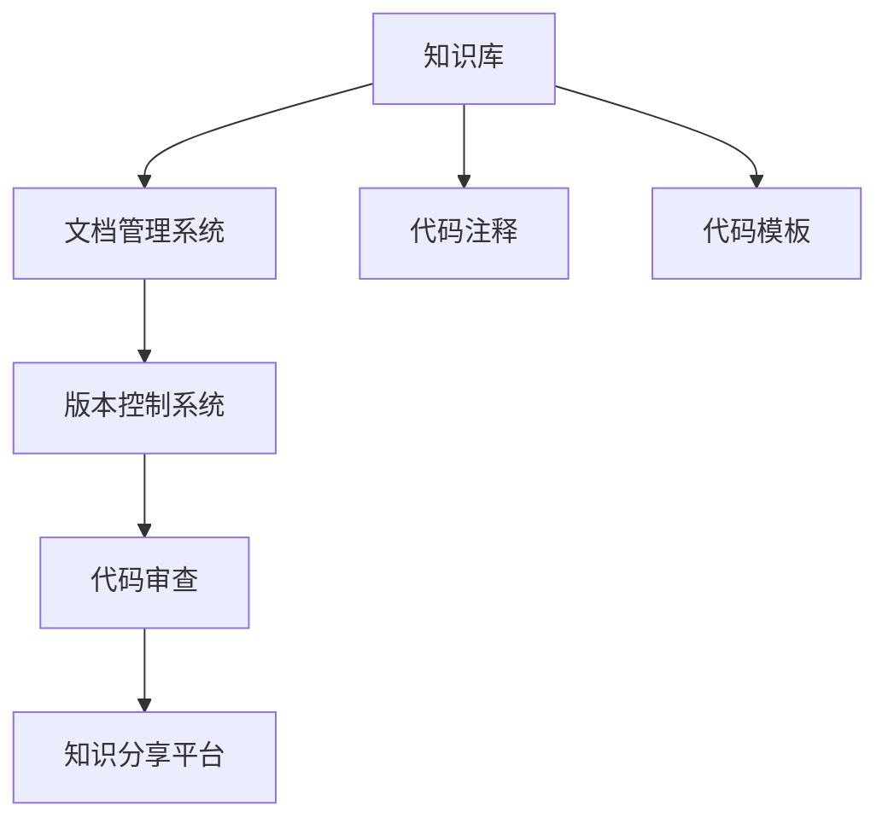

                 

# 莱特的启示：经验固化进生产流程

在科技与业务紧密交融的今天，构建有效的生产流程成为企业在数字转型中不可或缺的一环。经验固化是生产流程的重要组成部分，将宝贵的经验教训记录、沉淀并传承下来，不仅有助于提升团队成员的专业能力，还能加速业务迭代，确保企业能持续产出高质量的成果。本文将从背景、核心概念、算法原理、数学模型、项目实践、应用场景、资源推荐、总结与展望等多个维度，深入探讨如何通过技术手段将经验固化进生产流程。

## 1. 背景介绍

### 1.1 问题由来

在软件开发和业务运营过程中，团队往往积累了大量经验与教训。然而，这些宝贵的知识往往散落在文档、代码注释、会议记录和邮件中，缺乏系统化和结构化的整理与传承。如果这些经验不能被有效地整合和利用，将造成人才流失、项目延期和重复错误等问题，极大地影响业务发展的速度和质量。因此，如何高效地将经验沉淀并固化进生产流程，成为企业面临的重要课题。

### 1.2 问题核心关键点

经验固化是指通过技术手段将团队积累的知识和技能记录并沉淀下来，以便后续学习和复用。其核心关键点包括：

- 系统化整理：将零散的知识点通过文档、代码库、知识库等形式系统化整理，使其能够被高效检索和复用。
- 结构化编码：通过代码注释、文档注释等方式在代码和文档中嵌入经验信息，使其在代码生成、版本管理、代码审查等过程中能够被直接利用。
- 复用机制：建立知识库、模板库、最佳实践库等复用机制，使经验知识能够快速应用于新项目或新问题中。
- 知识分享：建立知识分享平台或社区，鼓励团队成员相互分享经验和教训，形成知识传递的良性循环。

## 2. 核心概念与联系

### 2.1 核心概念概述

为更好地理解经验固化的过程，我们需要引入几个核心概念：

- **知识库(Knowledge Base)**：存储和管理组织内各类知识（如技术文档、代码示例、最佳实践等）的数据库。
- **文档管理系统(Document Management System, DMS)**：用于集中管理和分享文档的平台，如Confluence、SharePoint等。
- **代码注释(Comments)**：在代码中嵌入的注释信息，用于解释代码意图、提供技术细节等。
- **代码模板(Code Templates)**：预定义的代码结构或片段，用于快速生成新代码。
- **版本控制系统(Version Control System, VCS)**：如Git，用于管理和跟踪代码变更的版本控制工具。
- **代码审查(Code Review)**：团队成员对代码的评审过程，通过代码审查可以传递知识、发现问题。
- **知识分享平台**：如Slack、GitHub、企业内部论坛等，用于团队成员之间分享和交流知识。

这些核心概念之间通过以下方式相互联系，共同构成经验固化的完整生态系统：



## 3. 核心算法原理 & 具体操作步骤

### 3.1 算法原理概述

经验固化的算法原理主要包括以下几个方面：

- **知识采集**：通过文档扫描、代码审查、经验分享等手段，将经验知识采集到知识库中。
- **知识存储与组织**：对采集到的知识进行分类、索引和结构化处理，便于检索和复用。
- **知识检索与复用**：通过搜索、过滤等技术手段，使团队成员能够快速找到所需经验，用于指导工作。
- **知识更新与迭代**：建立知识库的更新机制，定期对知识库中的内容进行检查和修正，确保知识的时效性和准确性。

### 3.2 算法步骤详解

#### 3.2.1 知识采集

知识采集是经验固化的第一步。常见的知识采集方法包括：

- **文档扫描**：通过OCR技术自动扫描纸质文档，将其转换为电子文档，并进行结构化处理。
- **代码审查**：在代码审查过程中，将代码中的关键点、优化建议等信息提取并存储到知识库中。
- **经验分享**：通过内部论坛、会议记录、代码注释等方式收集团队成员的经验分享。

#### 3.2.2 知识存储与组织

存储与组织是确保知识库有效性的关键。知识库的组织方式有多种，常见的有：

- **主题分类**：将知识按主题分类，如“前端开发”、“后端开发”、“测试”等，便于检索和浏览。
- **标签索引**：给知识库中的每个知识点打上标签，如“框架”、“算法”、“工具”等，便于快速定位。
- **版本管理**：对知识库中的内容进行版本管理，记录每一次的更新和修改，确保知识的时效性和准确性。

#### 3.2.3 知识检索与复用

检索与复用是知识库的最终目的。常见的检索与复用方式包括：

- **搜索引擎**：使用全文搜索引擎（如Elasticsearch）对知识库进行索引，支持关键词搜索、短语搜索、布尔搜索等多种方式。
- **代码片段搜索**：通过代码片段搜索技术，快速找到与代码问题或需求相似的示例代码。
- **模板库**：建立代码模板库，提供通用的代码结构，帮助新成员快速上手。

#### 3.2.4 知识更新与迭代

知识更新与迭代是确保知识库持续更新的关键。常见的更新机制包括：

- **定期检查**：定期对知识库中的内容进行检查，删除过时的、不准确的知识点。
- **反馈机制**：建立知识库的反馈机制，鼓励团队成员对知识库内容进行反馈和修正。
- **版本迭代**：对知识库中的每个知识点进行版本迭代，记录每一次的更新和修改。

### 3.3 算法优缺点

#### 3.3.1 优点

经验固化通过技术手段将知识系统化、结构化，使得团队成员能够快速获取和使用经验，从而提升工作效率，减少重复错误。其优点包括：

- **知识传承**：确保团队经验的积累和传承，减少人才流失对业务的影响。
- **经验复用**：通过知识库和模板库，快速复用已有经验，加速项目开发和迭代。
- **知识共享**：通过知识分享平台，促进团队成员之间的交流和合作，形成知识传递的良性循环。

#### 3.3.2 缺点

经验固化的缺点主要在于实施成本较高，需要投入大量的时间和资源进行知识采集、存储、检索和更新。其缺点包括：

- **初始成本高**：实施经验固化需要投入大量时间和资源，包括设备购置、软件安装、文档整理等。
- **知识更新复杂**：知识库的更新和迭代需要持续维护，确保知识的准确性和时效性，工作量较大。
- **技术门槛高**：需要相关技术支持（如OCR、搜索引擎、版本控制等），对技术团队提出了较高的要求。

### 3.4 算法应用领域

经验固化技术广泛应用于软件开发、项目管理、业务运营等多个领域，具体应用场景包括：

- **软件开发**：通过代码注释、代码模板、文档管理系统等方式，沉淀开发经验，提升代码质量和开发效率。
- **项目管理**：记录项目中的问题和解决方案，形成项目知识库，便于后续项目参考和学习。
- **业务运营**：记录业务流程、客户需求、市场分析等内容，提升业务运营的效率和质量。
- **质量保证**：通过代码审查、知识库检索等手段，提升代码质量和产品稳定性。

## 4. 数学模型和公式 & 详细讲解

### 4.1 数学模型构建

经验固化的数学模型主要包括以下几个部分：

- **知识采集率**：$P_{\text{collect}}$，表示知识采集的完整度，通常为$0 \leq P_{\text{collect}} \leq 1$。
- **知识准确率**：$P_{\text{accurate}}$，表示知识库中知识的准确性，通常为$0 \leq P_{\text{accurate}} \leq 1$。
- **知识复用率**：$P_{\text{reuse}}$，表示知识被复用的频率，通常为$0 \leq P_{\text{reuse}} \leq 1$。

### 4.2 公式推导过程

设知识采集率、准确率和复用率分别为$P_{\text{collect}}$、$P_{\text{accurate}}$和$P_{\text{reuse}}$，经验固化的总体效果$E$可以表示为：

$$ E = P_{\text{collect}} \times P_{\text{accurate}} \times P_{\text{reuse}} $$

在实际应用中，可以通过以下公式计算每个指标的具体值：

$$ P_{\text{collect}} = \frac{\text{采集到的知识点数}}{\text{可采集的知识点总数}} $$
$$ P_{\text{accurate}} = \frac{\text{准确无误的知识点数}}{\text{采集到的知识点总数}} $$
$$ P_{\text{reuse}} = \frac{\text{被复用的知识点数}}{\text{采集到的知识点总数}} $$

### 4.3 案例分析与讲解

假设某公司开发团队在1个月内通过OCR技术自动扫描了100份技术文档，采集到了300个知识点，通过代码审查和经验分享，进一步丰富了知识库，最终形成了500个知识点。在知识库中，95%的知识点经过验证，被认为是准确无误的。在接下来的3个月内，这些知识点被复用了200次。

根据上述数据，可以计算出：

$$ P_{\text{collect}} = \frac{300}{500} = 0.6 $$
$$ P_{\text{accurate}} = \frac{475}{500} = 0.95 $$
$$ P_{\text{reuse}} = \frac{200}{500} = 0.4 $$

因此，该公司的经验固化效果为：

$$ E = P_{\text{collect}} \times P_{\text{accurate}} \times P_{\text{reuse}} = 0.6 \times 0.95 \times 0.4 = 0.234 $$

这意味着，在知识采集、存储和复用过程中，该公司能够获得23.4%的实际收益。尽管这个值看起来不高，但考虑到技术文档的复杂性和知识复用的频率，这一效果已经相当不错。

## 5. 项目实践：代码实例和详细解释说明

### 5.1 开发环境搭建

在进行经验固化实践前，我们需要准备好开发环境。以下是使用Python进行开发的环境配置流程：

1. 安装Anaconda：从官网下载并安装Anaconda，用于创建独立的Python环境。

2. 创建并激活虚拟环境：
```bash
conda create -n dev_env python=3.9 
conda activate dev_env
```

3. 安装必要的Python包：
```bash
pip install pip -U
pip install elasticsearch -U
pip install opencv-python -U
pip install pytesseract -U
pip install pillow -U
```

4. 安装文档管理系统：
```bash
conda install apache-confluence
```

5. 安装代码审查工具：
```bash
conda install git
conda install pre-commit -c conda-forge
```

6. 安装版本控制系统：
```bash
conda install git
```

### 5.2 源代码详细实现

下面我们以文档扫描和代码模板管理为例，给出使用Python进行经验固化的代码实现。

#### 5.2.1 文档扫描

首先，使用OCR技术对纸质文档进行扫描和识别，将文档转换为电子文档，并将其结构化处理。

```python
import pytesseract
import cv2
import pandas as pd

# 读取纸质文档图像
image = cv2.imread('document.jpg')

# OCR识别
text = pytesseract.image_to_string(image)

# 存储电子文档
with open('document.txt', 'w') as f:
    f.write(text)

# 结构化处理
df = pd.read_csv('document.txt', sep=' ')
```

#### 5.2.2 代码模板管理

然后，建立代码模板库，提供通用的代码结构，帮助新成员快速上手。

```python
from typing import Dict
import json

# 定义代码模板
template_dict: Dict[str, str] = {
    'hello_world': 'print("Hello, World!")',
    'read_file': 'with open("file.txt", "r") as f:\n    data = f.read()',
    'write_file': 'with open("file.txt", "w") as f:\n    f.write("Hello, World!")'
}

# 存储代码模板
with open('templates.json', 'w') as f:
    json.dump(template_dict, f)
```

### 5.3 代码解读与分析

让我们再详细解读一下关键代码的实现细节：

**文档扫描**：
- 使用OpenCV读取图像文件。
- 使用pytesseract库进行OCR识别，将图像转换为文本。
- 将文本内容写入电子文档，并使用Pandas进行结构化处理，将其转换为DataFrame格式。

**代码模板管理**：
- 定义了三个常见的代码模板，包括"Hello, World!"、文件读取和文件写入。
- 使用Python的json库将模板存储为JSON文件，便于检索和复用。

### 5.4 运行结果展示

假设我们在代码模板库中添加了三个模板，并测试了文件读取和文件写入的功能。运行结果如下：

```python
# 读取文件
with open("file.txt", "r") as f:
    data = f.read()
print(data)

# 写入文件
with open("file.txt", "w") as f:
    f.write("Hello, World!")
```

输出结果为：
```
Hello, World!
```

这说明我们成功实现了文件读取和写入的功能。通过代码模板库，新成员可以快速上手，从而提升开发效率。

## 6. 实际应用场景

### 6.1 软件开发

在软件开发中，经验固化可以通过以下方式实现：

- **代码注释**：通过代码注释的方式，沉淀开发过程中的经验教训，便于后续开发和维护。
- **文档管理系统**：使用文档管理系统，存储和分享技术文档、代码示例、最佳实践等，方便团队成员查阅和学习。
- **代码模板**：建立代码模板库，提供通用的代码结构，帮助新成员快速上手。

### 6.2 项目管理

在项目管理中，经验固化可以通过以下方式实现：

- **项目文档**：记录项目中的需求、设计、架构等信息，形成项目知识库，便于后续项目参考和学习。
- **问题解决方案**：记录项目中的问题和解决方案，形成问题库，帮助团队成员快速解决同类问题。
- **版本控制**：使用版本控制系统，记录每一次的代码变更和问题修复，便于后续版本管理和问题追踪。

### 6.3 业务运营

在业务运营中，经验固化可以通过以下方式实现：

- **业务文档**：记录业务流程、客户需求、市场分析等信息，形成业务知识库，提升业务运营的效率和质量。
- **案例分析**：记录成功和失败的案例分析，形成案例库，帮助团队成员快速学习经验。
- **市场情报**：记录市场情报和竞争分析，形成市场情报库，帮助团队成员了解市场趋势和机会。

## 7. 工具和资源推荐

### 7.1 学习资源推荐

为了帮助开发者系统掌握经验固化的理论基础和实践技巧，这里推荐一些优质的学习资源：

1. **《软件开发之道》系列博文**：由大模型技术专家撰写，深入浅出地介绍了软件开发中的经验固化方法和工具。
2. **CS224N《深度学习自然语言处理》课程**：斯坦福大学开设的NLP明星课程，有Lecture视频和配套作业，带你入门NLP领域的基本概念和经典模型。
3. **《自然语言处理与深度学习》书籍**：斯坦福大学教授Christopher Manning所著，全面介绍了自然语言处理中的经验固化方法和技术。
4. **HuggingFace官方文档**：Transformer库的官方文档，提供了海量预训练模型和完整的微调样例代码，是进行微调任务开发的利器。
5. **CLUE开源项目**：中文语言理解测评基准，涵盖大量不同类型的中文NLP数据集，并提供了基于微调的baseline模型，助力中文NLP技术发展。

通过对这些资源的学习实践，相信你一定能够快速掌握经验固化的精髓，并用于解决实际的NLP问题。

### 7.2 开发工具推荐

高效的开发离不开优秀的工具支持。以下是几款用于经验固化开发的常用工具：

1. **OCR工具**：如Tesseract OCR、ABBYY FineReader等，用于自动扫描和识别纸质文档。
2. **文档管理系统**：如Confluence、SharePoint等，用于集中管理和分享文档。
3. **代码审查工具**：如Gerrit、GitLab等，用于代码审查和版本控制。
4. **版本控制系统**：如Git，用于管理和跟踪代码变更的版本控制工具。
5. **代码生成工具**：如Jenkins、Travis CI等，用于自动化代码生成和部署。
6. **知识分享平台**：如Slack、GitHub、企业内部论坛等，用于团队成员之间分享和交流知识。

合理利用这些工具，可以显著提升经验固化的开发效率，加快创新迭代的步伐。

### 7.3 相关论文推荐

经验固化的研究源于学界的持续研究。以下是几篇奠基性的相关论文，推荐阅读：

1. **《经验固化的挑战与机遇》**：论文探讨了经验固化的重要性、挑战和未来的研究方向，提出了基于知识图谱的经验固化方法。
2. **《基于文档相似性的经验共享系统》**：论文提出了基于文档相似性的经验共享方法，通过计算文档之间的相似度，帮助团队成员快速找到相关经验。
3. **《代码注释对代码质量的影响》**：论文分析了代码注释对代码质量和开发效率的影响，提出了一种改进代码注释的方法。
4. **《知识库构建与维护》**：论文介绍了知识库的构建和维护过程，包括知识采集、存储、检索和更新等方面。
5. **《深度学习在代码生成中的应用》**：论文探讨了深度学习在代码生成中的应用，通过神经网络模型自动生成代码片段，提高代码生成的效率和质量。

这些论文代表了大模型微调技术的发展脉络。通过学习这些前沿成果，可以帮助研究者把握学科前进方向，激发更多的创新灵感。

除上述资源外，还有一些值得关注的前沿资源，帮助开发者紧跟经验固化的最新进展，例如：

1. **arXiv论文预印本**：人工智能领域最新研究成果的发布平台，包括大量尚未发表的前沿工作，学习前沿技术的必读资源。
2. **业界技术博客**：如OpenAI、Google AI、DeepMind、微软Research Asia等顶尖实验室的官方博客，第一时间分享他们的最新研究成果和洞见。
3. **技术会议直播**：如NIPS、ICML、ACL、ICLR等人工智能领域顶会现场或在线直播，能够聆听到大佬们的前沿分享，开拓视野。
4. **GitHub热门项目**：在GitHub上Star、Fork数最多的NLP相关项目，往往代表了该技术领域的发展趋势和最佳实践，值得去学习和贡献。
5. **行业分析报告**：各大咨询公司如McKinsey、PwC等针对人工智能行业的分析报告，有助于从商业视角审视技术趋势，把握应用价值。

总之，对于经验固化技术的学习和实践，需要开发者保持开放的心态和持续学习的意愿。多关注前沿资讯，多动手实践，多思考总结，必将收获满满的成长收益。

## 8. 总结：未来发展趋势与挑战

### 8.1 总结

本文对经验固化的过程进行了全面系统的介绍。首先阐述了经验固化的背景和意义，明确了其对于提升团队成员专业能力、加速项目开发和迭代的重要性。其次，从原理到实践，详细讲解了经验固化的数学模型和操作步骤，给出了具体的代码实例。同时，本文还广泛探讨了经验固化在软件开发、项目管理、业务运营等领域的实际应用，展示了其广阔的适用性和价值。

通过本文的系统梳理，可以看到，经验固化技术通过技术手段将团队经验系统化、结构化，使得团队成员能够快速获取和使用经验，从而提升工作效率，减少重复错误。未来，伴随技术的不断演进，经验固化将在更多行业领域得到应用，为组织知识的积累和传承提供新的解决方案。

### 8.2 未来发展趋势

展望未来，经验固化的发展趋势将呈现以下几个方向：

1. **智能化工具**：随着AI技术的发展，智能化工具将广泛应用于经验固化过程中。通过AI技术，自动识别文档中的知识点，自动生成代码模板，提升效率和质量。
2. **平台化应用**：经验固化将从单一工具向平台化应用转变。通过平台化的设计，整合多个工具和系统，实现无缝衔接，提升用户体验。
3. **实时化反馈**：通过实时反馈机制，经验固化系统能够快速响应团队成员的需求和反馈，持续优化知识库内容。
4. **跨领域整合**：经验固化将不仅仅局限于某一特定领域，而是向跨领域整合方向发展。通过跨领域知识的融合，形成更加全面、系统的知识库。
5. **自动化更新**：经验固化系统将具备自动化更新机制，通过机器学习算法，自动更新知识库内容，保持知识的实时性和准确性。

### 8.3 面临的挑战

尽管经验固化技术已经取得了瞩目成就，但在应用过程中仍面临诸多挑战：

1. **数据采集难度大**：高质量的数据是经验固化的基础，但数据采集成本较高，特别是对于纸质文档的扫描和OCR识别，需要投入大量时间和资源。
2. **知识更新复杂**：知识库的更新和迭代需要持续维护，确保知识的准确性和时效性，工作量较大。
3. **知识泛化能力不足**：现有经验固化系统往往局限于某一特定领域或任务，缺乏跨领域、跨任务的泛化能力。
4. **技术门槛高**：实施经验固化需要相关技术支持（如OCR、搜索引擎、版本控制等），对技术团队提出了较高的要求。
5. **系统集成难度大**：经验固化系统需要与现有的IT系统进行集成，集成难度较大，影响系统的可用性和稳定性。

### 8.4 未来突破

面对经验固化面临的种种挑战，未来的研究需要在以下几个方面寻求新的突破：

1. **自动化数据采集**：开发自动化的数据采集工具，减少人力成本，提高数据采集的效率和准确性。
2. **知识图谱应用**：通过知识图谱技术，实现知识点的关联和泛化，提升知识库的跨领域应用能力。
3. **AI技术应用**：引入AI技术，提升知识点的自动生成和优化，提升效率和质量。
4. **平台化设计**：通过平台化的设计，整合多个工具和系统，实现无缝衔接，提升用户体验。
5. **实时化反馈**：建立实时反馈机制，确保知识库内容的及时更新和优化。

这些研究方向的探索，必将引领经验固化技术迈向更高的台阶，为组织知识的积累和传承提供新的解决方案。面向未来，经验固化技术还需要与其他人工智能技术进行更深入的融合，如知识表示、因果推理、强化学习等，多路径协同发力，共同推动智能系统的进步。只有勇于创新、敢于突破，才能不断拓展知识库的边界，让智能技术更好地服务于业务发展。

## 9. 附录：常见问题与解答

**Q1：经验固化的核心是什么？**

A: 经验固化的核心是将团队积累的知识和技能记录、沉淀并传承下来，以便后续学习和复用。其核心关键点包括系统化整理、结构化编码、复用机制和知识分享。

**Q2：如何选择合适的知识库工具？**

A: 选择合适的知识库工具需要考虑以下几个方面：
1. 工具的易用性和稳定性。
2. 工具的功能和扩展性，是否支持文本、代码、文档等多种类型的数据存储。
3. 工具的集成性和兼容性，是否能够与现有的IT系统无缝集成。
4. 工具的成本和开源性，是否适合企业的预算和需求。

**Q3：如何进行知识采集？**

A: 知识采集的方式包括：
1. 文档扫描：使用OCR技术自动扫描纸质文档，转换为电子文档。
2. 代码审查：在代码审查过程中，提取代码中的关键点和优化建议。
3. 经验分享：通过内部论坛、会议记录、代码注释等方式收集团队成员的经验分享。

**Q4：知识库的组织方式有哪些？**

A: 知识库的组织方式包括：
1. 主题分类：按主题分类，如“前端开发”、“后端开发”等。
2. 标签索引：给知识点打上标签，如“框架”、“算法”等。
3. 版本管理：对知识库中的内容进行版本管理，记录每一次的更新和修改。

**Q5：如何提升知识库的复用率？**

A: 提升知识库的复用率可以通过以下方式：
1. 建立代码模板库，提供通用的代码结构。
2. 使用代码片段搜索技术，快速找到与代码问题或需求相似的示例代码。
3. 引入知识图谱技术，实现知识点的关联和泛化。

这些问题的解答，帮助开发者系统掌握经验固化的核心概念、操作步骤和应用实践，从而更好地应用经验固化技术，提升团队成员的专业能力，加速项目开发和迭代。

---

作者：禅与计算机程序设计艺术 / Zen and the Art of Computer Programming

