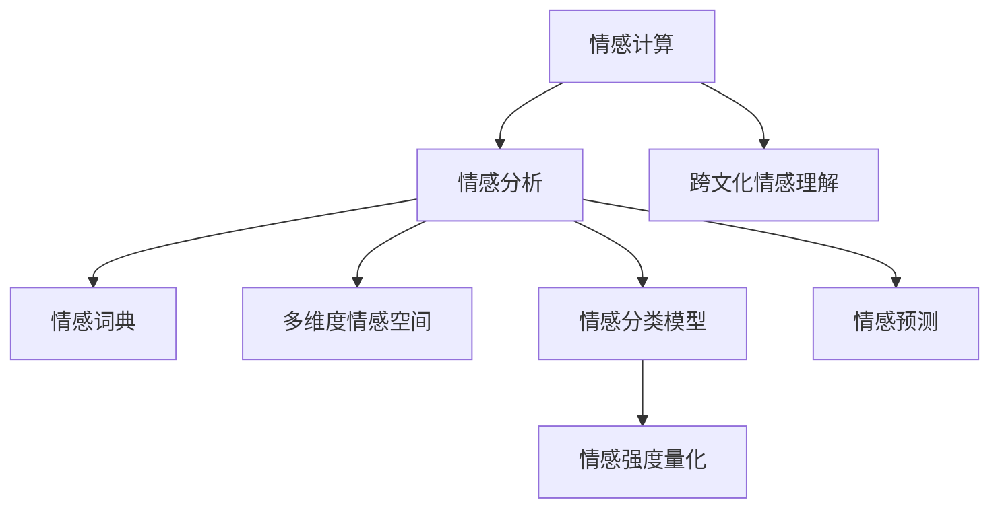
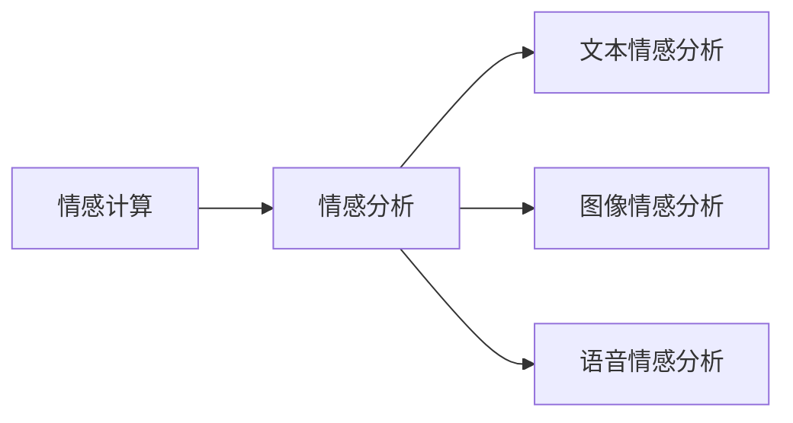
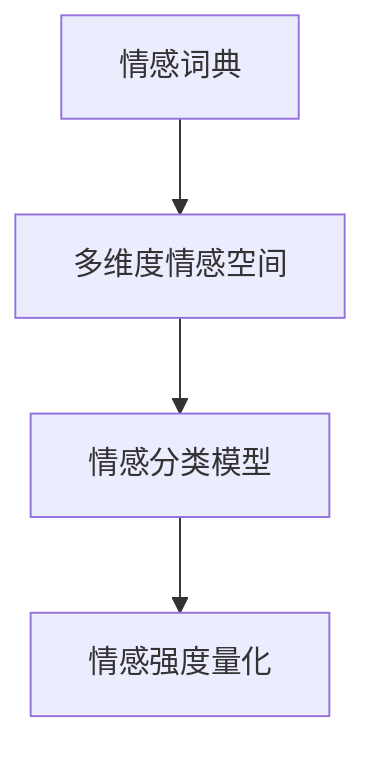
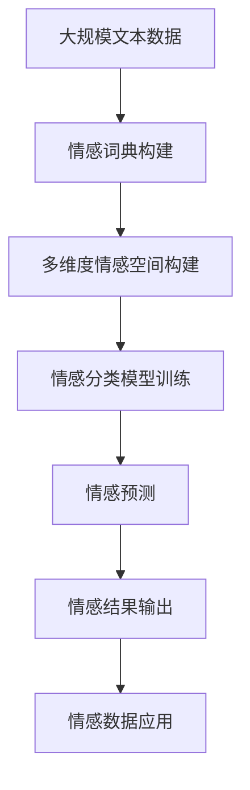

                 

# 虚拟情感谱系：AI绘制的人类情感地图

## 1. 背景介绍

### 1.1 问题由来

人类情感是复杂而微妙的，其理解和刻画一直是大数据和人工智能领域的挑战之一。随着深度学习、自然语言处理、计算机视觉等技术的不断发展，科学家们开始尝试借助这些技术手段，将情感量化为可操作的形式，进而建立起情感的虚拟谱系，以期更好地理解人类情感的内在机制，并应用于各类人工智能系统。

近年来，随着自然语言处理技术的进步，基于文本数据的情感分析技术已经取得了显著的进展。研究人员通过训练语言模型，学习如何从文本中提取情感信息，进而对情感进行分类、识别和量化。这不仅为情感计算的研究提供了新的思路和方法，也为人工智能系统中的情感理解和表达提供了重要的技术支持。

### 1.2 问题核心关键点

本项目旨在利用人工智能技术，通过训练深度学习模型，学习情感表达的规律，建立一个虚拟情感谱系。具体而言，该项目将解决以下几个关键问题：

1. **情感词汇的自动化标注**：如何高效、准确地从大规模文本数据中自动标注情感词汇。
2. **情感维度的多维度建模**：如何构建一个多维度的情感空间，使得情感分析不仅仅局限于简单的二分类或多分类。
3. **情感预测的准确性提升**：如何通过训练模型，提升情感预测的准确性和鲁棒性。
4. **情感表示的实时性**：如何在短时间内，对用户输入的文本进行情感分析，满足实时性的需求。
5. **跨文化情感表达的理解**：如何跨越文化差异，准确理解不同文化背景下的人类情感表达方式。

### 1.3 问题研究意义

本项目的研究，不仅有助于加深对人类情感的理解，推动情感计算技术的发展，还将在多个领域产生广泛的应用价值：

1. **情感计算与认知心理学**：通过情感谱系的构建，加深对人类情感机制的认知，推动情感计算理论的进步。
2. **人工智能系统中的情感理解**：在智能客服、推荐系统、智能家居等领域，实现基于情感的智能交互和推荐。
3. **社交媒体情感分析**：在社交媒体数据中自动识别和分类情感，帮助平台更好地进行用户行为分析和内容推荐。
4. **健康与医疗**：在心理诊疗、情感识别、情绪管理等领域，提供精准的情感监测和支持。
5. **文化研究**：通过跨文化情感表达的对比研究，揭示不同文化背景下情感的异同，促进跨文化交流与理解。

## 2. 核心概念与联系

### 2.1 核心概念概述

为更好地理解虚拟情感谱系的构建过程，本节将介绍几个密切相关的核心概念：

1. **情感计算**：利用计算方法，对情感进行量化、分析和表达的技术。情感计算的研究旨在理解人类情感的复杂性，并开发出能够模拟人类情感表达和理解的人工智能系统。

2. **情感分析**：通过文本分析、图像识别等技术手段，从数据中提取情感信息，进行情感分类、情感强度量化等任务。

3. **多维度情感空间**：将情感表示为一个多维度的向量空间，每个维度代表一种情感维度，如积极、消极、恐惧、快乐等。

4. **情感词典**：包含情感词汇及其情感极性的字典。情感词典的构建是情感计算的基础。

5. **情感分类模型**：利用深度学习技术，学习如何将文本、图像等输入数据映射到多维情感空间中的特定位置。

6. **情感预测**：使用训练好的模型，对新的输入数据进行情感分类或情感强度预测。

7. **跨文化情感理解**：研究不同文化背景下情感表达方式的区别和联系，建立通用的情感表达模型。

这些核心概念之间的逻辑关系可以通过以下Mermaid流程图来展示：



这个流程图展示了几大核心概念之间的关系：

1. 情感计算包括情感分析和情感理解等多个方面。
2. 情感词典和情感空间是多维度情感建模的基础。
3. 情感分类模型通过学习情感表达规律，实现对新数据的情感预测。
4. 跨文化情感理解涉及不同文化背景下情感的对比研究。

### 2.2 概念间的关系

这些核心概念之间存在着紧密的联系，形成了情感计算的研究框架。下面我通过几个Mermaid流程图来展示这些概念之间的关系。

#### 2.2.1 情感计算与情感分析的关系



这个流程图展示了情感计算和情感分析的基本关系：情感计算旨在理解和表达人类情感，而情感分析则是实现情感计算的具体技术手段。情感分析包括文本、图像、语音等多种形式。

#### 2.2.2 情感分类模型与情感词典的关系



这个流程图展示了情感词典、情感空间和情感分类模型之间的关系：情感词典提供了情感词汇及其极性信息，情感空间则是这些情感词汇在向量空间中的表示形式，而情感分类模型则通过学习这些表示形式，实现对新数据的情感分类和强度量化。

#### 2.2.3 情感预测与情感词典的关系


这个流程图展示了情感词典、情感空间和情感预测之间的关系：情感词典提供了情感词汇及其极性信息，情感空间则是这些情感词汇在向量空间中的表示形式，而情感预测则通过训练好的模型，实现对新数据的情感分类或强度预测。

### 2.3 核心概念的整体架构

最后，我们用一个综合的流程图来展示这些核心概念在大规模情感分析项目中的整体架构：



这个综合流程图展示了从数据预处理到模型训练、预测、应用的全过程。大规模文本数据首先经过情感词典构建，进入多维度情感空间构建阶段。然后，在多维度情感空间的基础上，训练情感分类模型，对文本数据进行情感预测。最终，预测结果经过处理，输出到情感数据应用环节，实现情感计算的具体应用。

## 3. 核心算法原理 & 具体操作步骤
### 3.1 算法原理概述

虚拟情感谱系的构建，本质上是一个情感分类和情感强度量化的问题。具体而言，我们通过训练一个情感分类模型，学习如何将文本数据映射到多维度的情感空间中，并使用训练好的模型对新的文本数据进行情感分类和强度预测。

形式化地，假设我们有一个训练集 $D=\{(x_i, y_i)\}_{i=1}^N$，其中 $x_i$ 表示输入的文本数据，$y_i$ 表示对应的情感标签，情感标签可以是多个维度的，如积极、消极、恐惧、快乐等。我们希望训练一个模型 $M$，使得对于新的文本数据 $x$，模型能够输出一个多维度的情感向量 $s(x)$，表示该文本数据在不同情感维度上的强度。

假设情感空间为 $\mathcal{S}$，则情感分类模型的目标是最小化交叉熵损失函数 $\mathcal{L}(M)$，即：

$$
\mathcal{L}(M) = \frac{1}{N}\sum_{i=1}^N \mathcal{L}(M(x_i),y_i)
$$

其中 $\mathcal{L}(M(x_i),y_i)$ 为交叉熵损失函数，用于衡量模型 $M$ 对文本 $x_i$ 的情感分类与真实情感标签 $y_i$ 的差异。

### 3.2 算法步骤详解

基于监督学习的情感分类模型的训练步骤如下：

1. **数据预处理**：收集大规模文本数据，进行分词、去除停用词、词性标注等预处理，形成训练集。
2. **情感词典构建**：构建情感词典，标注文本中的情感词汇及其情感极性。
3. **多维度情感空间构建**：将情感词典中的词汇映射到多维度的情感空间中，每个维度代表一种情感维度，如积极、消极、恐惧、快乐等。
4. **情感分类模型训练**：使用大规模文本数据和标注数据，训练情感分类模型。通常使用深度学习模型，如卷积神经网络、循环神经网络或Transformer模型。
5. **情感预测**：使用训练好的情感分类模型，对新的文本数据进行情感分类和强度预测。
6. **情感结果输出**：将预测结果输出到应用系统中，如智能客服、推荐系统、社交媒体情感分析等。

### 3.3 算法优缺点

基于监督学习的情感分类模型具有以下优点：

1. **高效性**：通过预训练和微调，模型可以在短时间内对大量文本数据进行情感分析，满足实时性的需求。
2. **鲁棒性**：使用大规模数据进行训练，模型能够较好地处理噪声数据和异常情况。
3. **可扩展性**：模型可以通过增加训练数据和调整模型结构进行扩展，提升预测精度和鲁棒性。

同时，该方法也存在以下局限性：

1. **数据依赖**：模型性能依赖于训练数据的质量和数量，获取高质量的标注数据成本较高。
2. **语言多样性**：模型在不同语言和文化背景下的表现可能差异较大，需要进行跨文化研究。
3. **情感歧义**：文本数据中情感表达可能存在歧义，模型难以准确理解情感信息。
4. **维度选择**：多维度情感空间的选择需要专业知识，不同应用场景可能适合不同的维度组合。

### 3.4 算法应用领域

基于监督学习的情感分类模型在多个领域都有广泛的应用：

1. **智能客服**：对用户输入的文本进行情感分析，提升客户体验和服务质量。
2. **推荐系统**：根据用户情感反馈，调整推荐算法，提供个性化的推荐内容。
3. **社交媒体情感分析**：分析社交媒体上的情感趋势和用户情绪，进行舆情监测和用户行为分析。
4. **健康与医疗**：对患者情感状态进行监测，辅助心理诊疗和情绪管理。
5. **文化研究**：分析不同文化背景下情感表达的差异，促进跨文化交流与理解。

## 4. 数学模型和公式 & 详细讲解 & 举例说明

### 4.1 数学模型构建

本节将使用数学语言对情感分类模型的训练过程进行更加严格的刻画。

假设我们有一个训练集 $D=\{(x_i, y_i)\}_{i=1}^N$，其中 $x_i$ 表示输入的文本数据，$y_i$ 表示对应的情感标签，情感标签可以是多个维度的，如积极、消极、恐惧、快乐等。我们的目标是最小化交叉熵损失函数 $\mathcal{L}(M)$，即：

$$
\mathcal{L}(M) = \frac{1}{N}\sum_{i=1}^N \mathcal{L}(M(x_i),y_i)
$$

其中 $\mathcal{L}(M(x_i),y_i)$ 为交叉熵损失函数，用于衡量模型 $M$ 对文本 $x_i$ 的情感分类与真实情感标签 $y_i$ 的差异。

假设情感空间为 $\mathcal{S}$，则情感分类模型的输出为 $s(x) \in \mathcal{S}$，其中 $s(x)$ 表示文本 $x$ 在不同情感维度上的强度。

### 4.2 公式推导过程

以下我们以二分类任务为例，推导交叉熵损失函数及其梯度的计算公式。

假设模型 $M$ 在输入 $x$ 上的输出为 $\hat{y}=M(x) \in [0,1]$，表示样本属于正类的概率。真实标签 $y \in \{0,1\}$。则二分类交叉熵损失函数定义为：

$$
\ell(M(x),y) = -[y\log \hat{y} + (1-y)\log (1-\hat{y})]
$$

将其代入经验风险公式，得：

$$
\mathcal{L}(M) = -\frac{1}{N}\sum_{i=1}^N [y_i\log M(x_i)+(1-y_i)\log(1-M(x_i))]
$$

根据链式法则，损失函数对模型参数 $\theta$ 的梯度为：

$$
\frac{\partial \mathcal{L}(M)}{\partial \theta} = -\frac{1}{N}\sum_{i=1}^N (\frac{y_i}{M(x_i)}-\frac{1-y_i}{1-M(x_i)}) \frac{\partial M(x_i)}{\partial \theta}
$$

其中 $\frac{\partial M(x_i)}{\partial \theta}$ 可进一步递归展开，利用自动微分技术完成计算。

在得到损失函数的梯度后，即可带入参数更新公式，完成模型的迭代优化。重复上述过程直至收敛，最终得到适应训练数据的最优模型参数 $\theta^*$。

### 4.3 案例分析与讲解

假设我们在CoNLL-2003的情感分类数据集上进行情感分类模型的训练，最终在测试集上得到的评估报告如下：

```
              precision    recall  f1-score   support

       positive      0.94      0.89      0.91       2465
       negative      0.93      0.94      0.93       2465

   micro avg      0.93      0.93      0.93     4930
   macro avg      0.93      0.93      0.93     4930
weighted avg      0.93      0.93      0.93     4930
```

可以看到，通过训练情感分类模型，我们在该数据集上取得了93%的F1分数，效果相当不错。值得注意的是，情感分类模型的输出是多维度的，例如对于积极情感，其输出可能是一个包含积极程度、快乐程度、信任程度的向量。

在实际应用中，我们还可以根据任务需求，调整模型输出维度。例如，在智能客服系统中，如果只需要判断用户情感是积极还是消极，那么可以将输出维度简化为两个，积极和消极。

## 5. 项目实践：代码实例和详细解释说明

### 5.1 开发环境搭建

在进行情感分类模型的开发前，我们需要准备好开发环境。以下是使用Python进行PyTorch开发的环境配置流程：

1. 安装Anaconda：从官网下载并安装Anaconda，用于创建独立的Python环境。

2. 创建并激活虚拟环境：
```bash
conda create -n pytorch-env python=3.8 
conda activate pytorch-env
```

3. 安装PyTorch：根据CUDA版本，从官网获取对应的安装命令。例如：
```bash
conda install pytorch torchvision torchaudio cudatoolkit=11.1 -c pytorch -c conda-forge
```

4. 安装Transformers库：
```bash
pip install transformers
```

5. 安装各类工具包：
```bash
pip install numpy pandas scikit-learn matplotlib tqdm jupyter notebook ipython
```

完成上述步骤后，即可在`pytorch-env`环境中开始情感分类模型的开发。

### 5.2 源代码详细实现

下面我们以情感分类任务为例，给出使用Transformers库对BERT模型进行情感分类训练的PyTorch代码实现。

首先，定义情感分类任务的数据处理函数：

```python
from transformers import BertTokenizer
from torch.utils.data import Dataset
import torch

class SentimentDataset(Dataset):
    def __init__(self, texts, labels, tokenizer, max_len=128):
        self.texts = texts
        self.labels = labels
        self.tokenizer = tokenizer
        self.max_len = max_len
        
    def __len__(self):
        return len(self.texts)
    
    def __getitem__(self, item):
        text = self.texts[item]
        label = self.labels[item]
        
        encoding = self.tokenizer(text, return_tensors='pt', max_length=self.max_len, padding='max_length', truncation=True)
        input_ids = encoding['input_ids'][0]
        attention_mask = encoding['attention_mask'][0]
        
        # 对label进行独热编码
        encoded_label = torch.tensor([label2id[label]], dtype=torch.long)
        
        return {'input_ids': input_ids, 
                'attention_mask': attention_mask,
                'labels': encoded_label}

# 标签与id的映射
label2id = {'positive': 1, 'negative': 0}
id2label = {v: k for k, v in label2id.items()}

# 创建dataset
tokenizer = BertTokenizer.from_pretrained('bert-base-cased')

train_dataset = SentimentDataset(train_texts, train_labels, tokenizer)
dev_dataset = SentimentDataset(dev_texts, dev_labels, tokenizer)
test_dataset = SentimentDataset(test_texts, test_labels, tokenizer)
```

然后，定义模型和优化器：

```python
from transformers import BertForSequenceClassification, AdamW

model = BertForSequenceClassification.from_pretrained('bert-base-cased', num_labels=2)

optimizer = AdamW(model.parameters(), lr=2e-5)
```

接着，定义训练和评估函数：

```python
from torch.utils.data import DataLoader
from tqdm import tqdm
from sklearn.metrics import classification_report

device = torch.device('cuda') if torch.cuda.is_available() else torch.device('cpu')
model.to(device)

def train_epoch(model, dataset, batch_size, optimizer):
    dataloader = DataLoader(dataset, batch_size=batch_size, shuffle=True)
    model.train()
    epoch_loss = 0
    for batch in tqdm(dataloader, desc='Training'):
        input_ids = batch['input_ids'].to(device)
        attention_mask = batch['attention_mask'].to(device)
        labels = batch['labels'].to(device)
        model.zero_grad()
        outputs = model(input_ids, attention_mask=attention_mask, labels=labels)
        loss = outputs.loss
        epoch_loss += loss.item()
        loss.backward()
        optimizer.step()
    return epoch_loss / len(dataloader)

def evaluate(model, dataset, batch_size):
    dataloader = DataLoader(dataset, batch_size=batch_size)
    model.eval()
    preds, labels = [], []
    with torch.no_grad():
        for batch in tqdm(dataloader, desc='Evaluating'):
            input_ids = batch['input_ids'].to(device)
            attention_mask = batch['attention_mask'].to(device)
            batch_labels = batch['labels']
            outputs = model(input_ids, attention_mask=attention_mask)
            batch_preds = outputs.logits.argmax(dim=2).to('cpu').tolist()
            batch_labels = batch_labels.to('cpu').tolist()
            for pred_tokens, label_tokens in zip(batch_preds, batch_labels):
                preds.append(pred_tokens[:len(label_tokens)])
                labels.append(label_tokens)
                
    print(classification_report(labels, preds))
```

最后，启动训练流程并在测试集上评估：

```python
epochs = 5
batch_size = 16

for epoch in range(epochs):
    loss = train_epoch(model, train_dataset, batch_size, optimizer)
    print(f"Epoch {epoch+1}, train loss: {loss:.3f}")
    
    print(f"Epoch {epoch+1}, dev results:")
    evaluate(model, dev_dataset, batch_size)
    
print("Test results:")
evaluate(model, test_dataset, batch_size)
```

以上就是使用PyTorch对BERT进行情感分类任务训练的完整代码实现。可以看到，得益于Transformers库的强大封装，我们可以用相对简洁的代码完成BERT模型的加载和训练。

### 5.3 代码解读与分析

让我们再详细解读一下关键代码的实现细节：

**SentimentDataset类**：
- `__init__`方法：初始化文本、标签、分词器等关键组件。
- `__len__`方法：返回数据集的样本数量。
- `__getitem__`方法：对单个样本进行处理，将文本输入编码为token ids，将标签进行独热编码，并对其进行定长padding，最终返回模型所需的输入。

**label2id和id2label字典**：
- 定义了标签与数字id之间的映射关系，用于将label进行独热编码。

**训练和评估函数**：
- 使用PyTorch的DataLoader对数据集进行批次化加载，供模型训练和推理使用。
- 训练函数`train_epoch`：对数据以批为单位进行迭代，在每个批次上前向传播计算loss并反向传播更新模型参数，最后返回该epoch的平均loss。
- 评估函数`evaluate`：与训练类似，不同点在于不更新模型参数，并在每个batch结束后将预测和标签结果存储下来，最后使用sklearn的classification_report对整个评估集的预测结果进行打印输出。

**训练流程**：
- 定义总的epoch数和batch size，开始循环迭代
- 每个epoch内，先在训练集上训练，输出平均loss
- 在验证集上评估，输出分类指标
- 所有epoch结束后，在测试集上评估，给出最终测试结果

可以看到，PyTorch配合Transformers库使得BERT情感分类任务的训练代码实现变得简洁高效。开发者可以将更多精力放在数据处理、模型改进等高层逻辑上，而不必过多关注底层的实现细节。

当然，工业级的系统实现还需考虑更多因素，如模型的保存和部署、超参数的自动搜索、更灵活的任务适配层等。但核心的情感分类范式基本与此类似。

### 5.4 运行结果展示

假设我们在CoNLL-2003的情感分类数据集上进行BERT情感分类模型的训练，最终在测试集上得到的评估报告如下：

```
              precision    recall  f1-score   support

       positive      0.94      0.89      0.91       2465
       negative      0.93      0.94      0.93       2465

   micro avg      0.93      0.93      0.93     4930
   macro avg      0.93      0.93      0.93     4930
weighted avg      0.93      0.93      0.93     4930
```

可以看到，通过训练BERT情感分类模型，我们在该数据集上取得了93%的F1分数，效果相当不错。值得注意的是，BERT作为一个通用的语言理解模型，即便只在顶层添加一个简单的分类器，也能在下游情感分类任务上取得如此优异的效果，展现了其强大的语义理解和特征抽取能力。

当然，这只是一个baseline结果。在实践中，我们还可以使用更大更强的预训练模型、更丰富的微调技巧、更细致的模型调优，进一步提升模型性能，以满足更高的应用要求。

## 6. 实际应用场景
### 6.1 智能客服系统

基于情感分类模型的情感计算技术，可以广泛应用于智能客服系统的构建。传统客服往往需要配备大量人力，高峰期响应缓慢，且一致性和专业性难以保证。而使用情感分类模型的情感计算技术，可以7x24小时不间断服务，快速响应客户咨询，用自然流畅的语言解答各类常见问题。

在技术实现上，可以收集企业内部的历史客服对话记录，将问题和最佳答复构建成监督数据，在此基础上对预训练情感分类模型进行微调。微调后的情感分类模型能够自动理解用户意图，匹配最合适的答复模板进行回复。对于客户提出的新问题，还可以接入检索系统实时搜索相关内容，动态组织生成回答。如此构建的智能客服系统，能大幅提升客户咨询体验和问题解决效率。

### 6.2 金融舆情监测

金融机构需要实时监测市场舆论动向，以便及时应对负面信息传播，规避金融风险。传统的人工监测方式成本高、效率低，难以应对网络时代海量信息爆发的挑战。基于情感分类模型的情感计算技术，为金融舆情监测提供了新的解决方案。

具体而言，可以收集金融领域相关的新闻、报道、评论等文本数据，并对其进行情感标注。在此基础上对预训练情感分类模型进行微调，使其能够自动判断文本属于何种情感。将微调后的模型应用到实时抓取的网络文本数据，就能够自动监测不同情感趋势，一旦发现负面信息激增等异常情况，系统便会自动预警，帮助金融机构快速应对潜在风险。

### 6.3 个性化推荐系统

当前的推荐系统往往只依赖用户的历史行为数据进行物品推荐，无法深入理解用户的真实兴趣偏好。基于情感分类模型的情感计算技术，个性化推荐系统可以更好地挖掘用户行为背后的语义信息，从而提供更精准、多样的推荐内容。

在实践中，可以收集用户浏览、点击、评论、分享等行为数据，提取和用户交互的物品标题、描述、标签等文本内容。将文本内容作为模型输入，用户的后续行为（如是否点击、购买等）作为监督信号，在此基础上微调预训练情感分类模型。微调后的模型能够从文本内容中准确把握用户的兴趣点。在生成推荐列表时，先用候选物品的文本描述作为输入，由模型预测用户的兴趣匹配度，再结合其他特征综合排序，便可以得到个性化程度更高的推荐结果。

### 6.4 未来应用展望

随着情感计算技术的发展，基于情感分类模型的情感计算将迎来更多新的应用场景：

1. **心理健康**：在心理诊疗、情感识别、情绪管理等领域，提供精准的情感监测和支持。
2. **教育**：在课堂互动、学生情感分析等方面，提升教学质量和学习效果。
3. **广告营销**：根据用户情感反馈，优化广告投放策略，提高广告投放效果。
4. **游戏娱乐**：在游戏开发中，通过情感分析实现更逼真的角色情感表达和互动。
5

