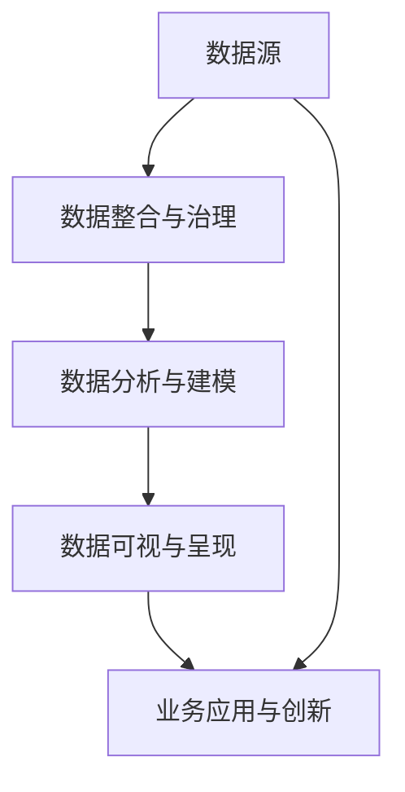
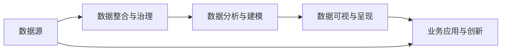
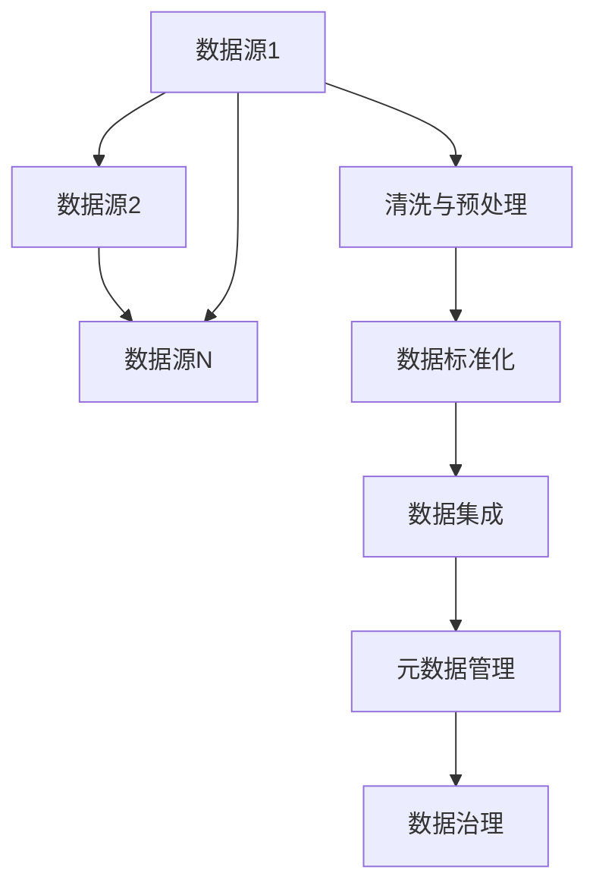
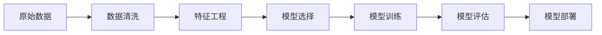
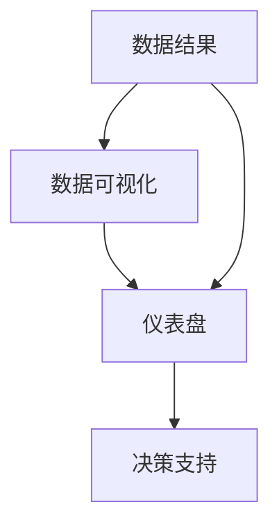
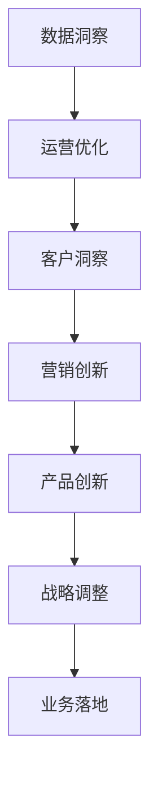

                 

# 解锁信息差的商业价值：大数据驱动的竞争优势

> 关键词：大数据,信息差,商业洞察,竞争分析,数据可视化

## 1. 背景介绍

### 1.1 问题由来
在数字化转型的浪潮中，企业之间的竞争日益激烈。如何充分利用海量数据资源，快速识别商业机会，规避潜在风险，成为了各企业不断探索的焦点问题。

数据驱动决策日益受到重视，企业逐渐认识到信息差（Information Gap）的巨大价值。所谓信息差，即企业在获取、处理和应用数据资源方面存在的差异，信息差越大，企业能洞察商业细节、制定战略的深度和广度就越强，从而在竞争中占据优势。然而，尽管很多企业拥有数据资源，但在数据治理、数据洞察、数据应用等方面，往往还存在明显的短板。

### 1.2 问题核心关键点
如何通过大数据技术解锁信息差，驱动商业决策，已成为企业面临的迫切需求。大数据不仅仅是数据本身，更重要的是通过对数据进行深度分析和应用，才能转化为有价值的商业洞察。

大数据驱动的商业洞察，具体表现为：

- **数据整合与治理**：将分散的、异构的数据资源整合起来，确保数据的质量和一致性。
- **数据分析与建模**：应用先进的分析技术和建模方法，从海量数据中挖掘出隐藏的商业洞见。
- **数据可视与呈现**：通过图表、仪表盘等方式，将数据洞察转化为直观的可视化信息，支持决策。
- **业务应用与创新**：基于数据洞察，优化业务流程，创新商业模式，提升竞争优势。

### 1.3 问题研究意义
数据驱动的商业洞察，有助于企业快速响应市场变化，优化资源配置，提升竞争力。具体意义包括：

- **提升决策质量**：通过数据支持决策，减少决策的盲目性，提高决策效率。
- **优化运营流程**：基于数据洞察，识别运营瓶颈，优化业务流程，提高运营效率。
- **增强客户体验**：利用数据洞察客户需求，个性化定制服务，提升客户满意度。
- **拓展市场空间**：识别市场机会，发掘潜在客户，拓展市场份额。
- **风险预警与防控**：通过数据监控，及时发现和规避风险，保障企业安全。

## 2. 核心概念与联系

### 2.1 核心概念概述

为了更好地理解大数据驱动的商业洞察，我们首先介绍几个核心概念：

- **大数据**：指数据量巨大、多样性丰富、处理速度极快的数据集合。大数据具备容量、多样性、速度和真实性四个关键特征。

- **信息差**：企业之间在数据获取、处理和应用能力方面的差异。信息差越大，企业的商业洞察力和竞争力就越强。

- **数据整合与治理**：将分散、异构的数据资源集中起来，进行清洗、标准化和集成，确保数据的质量和一致性。

- **数据分析与建模**：应用统计学、机器学习、数据挖掘等技术，从海量数据中提取有价值的信息，构建数据模型。

- **数据可视与呈现**：利用可视化技术，将数据洞察转化为直观、易懂的图表和仪表盘，支持决策。

- **业务应用与创新**：基于数据洞察，优化业务流程，创新商业模式，提升竞争力。

这些核心概念之间通过数据流进行连接，形成一个闭环的数据驱动决策框架：



### 2.2 概念间的关系

这些核心概念之间存在紧密的联系，形成一个完整的大数据驱动决策框架。下面我们通过几个Mermaid流程图来展示这些概念之间的关系。

#### 2.2.1 数据驱动决策框架



这个流程图展示了数据驱动决策的基本框架，从数据源到最终的数据驱动决策，形成一个闭环。

#### 2.2.2 数据整合与治理



这个流程图展示了数据整合与治理的过程，从不同数据源获取数据，经过清洗、标准化和集成后，建立元数据管理机制和数据治理体系。

#### 2.2.3 数据分析与建模



这个流程图展示了数据分析与建模的过程，从原始数据到模型训练、评估和部署。

#### 2.2.4 数据可视与呈现



这个流程图展示了数据可视与呈现的过程，从数据结果到可视化仪表盘，支持决策支持。

#### 2.2.5 业务应用与创新



这个流程图展示了业务应用与创新的过程，从数据洞察到业务优化、客户洞察、营销和产品创新，最终调整战略，实现业务落地。

### 2.3 核心概念的整体架构

最后，我们用一个综合的流程图来展示这些核心概念在大数据驱动决策中的整体架构：


这个综合流程图展示了从数据源到最终的数据驱动决策的完整过程，各个环节紧密相连，共同支撑企业的高效运营和创新。

## 3. 核心算法原理 & 具体操作步骤
### 3.1 算法原理概述

大数据驱动的商业洞察，核心在于通过数据整合与治理、数据分析与建模、数据可视与呈现，最终支持业务应用与创新。其核心算法原理包括以下几个方面：

- **数据整合与治理算法**：通过数据清洗、预处理、标准化和集成，构建统一的数据视图。
- **数据分析与建模算法**：应用统计学、机器学习等技术，构建预测模型和推荐模型。
- **数据可视与呈现算法**：利用可视化技术，将数据洞察转化为直观的图表和仪表盘。
- **业务应用与创新算法**：基于数据洞察，优化运营流程，创新商业模式。

### 3.2 算法步骤详解

以下详细讲解大数据驱动商业洞察的算法步骤：

**Step 1: 数据整合与治理**

- 收集与整合数据源：从不同业务系统、第三方平台等获取数据，确保数据的多样性。
- 数据清洗与预处理：去除噪声、处理缺失值、进行数据归一化等。
- 数据标准化：统一数据格式和单位，确保数据的一致性。
- 数据集成：将清洗和标准化的数据进行集成，建立统一的数据存储。
- 元数据管理：构建数据治理体系，定义数据质量和隐私标准。

**Step 2: 数据分析与建模**

- 特征工程：提取、筛选和构建特征，提高模型训练效果。
- 模型选择与训练：选择适合的模型（如回归模型、分类模型、聚类模型等），训练模型。
- 模型评估与优化：使用交叉验证等方法，评估模型性能，优化模型参数。
- 模型部署与监控：将训练好的模型部署到生产环境，持续监控模型效果。

**Step 3: 数据可视与呈现**

- 数据可视化：使用图表、仪表盘等工具，将数据洞察转化为直观的信息。
- 决策支持：利用可视化信息，辅助业务决策，支持战略调整和运营优化。

**Step 4: 业务应用与创新**

- 运营优化：基于数据洞察，优化业务流程，提高运营效率。
- 客户洞察：利用客户行为数据，个性化定制服务，提升客户满意度。
- 营销创新：识别市场机会，调整营销策略，提升市场份额。
- 产品创新：利用产品使用数据，创新产品设计，提高市场竞争力。
- 战略调整：基于数据洞察，调整战略方向，确保企业长期发展。

### 3.3 算法优缺点

大数据驱动的商业洞察，具有以下优点：

- **数据驱动决策**：基于数据洞察，减少决策的盲目性，提高决策效率。
- **快速响应市场变化**：实时监测市场数据，快速识别机会和风险。
- **优化资源配置**：通过数据洞察，优化资源分配，提高资源利用率。
- **提升客户体验**：利用数据洞察客户需求，个性化定制服务。
- **拓展市场空间**：识别潜在客户，拓展市场份额。

同时，大数据驱动的商业洞察也存在以下缺点：

- **数据质量问题**：数据源多样，数据质量参差不齐，可能影响分析结果。
- **技术复杂度高**：涉及数据清洗、建模、可视化等多个环节，技术门槛较高。
- **隐私与安全风险**：数据量大，隐私保护和数据安全问题突出。
- **成本高**：数据收集、存储、分析和可视化都需要大量资源投入。
- **数据鸿沟**：中小型企业可能面临数据获取和处理能力的限制。

### 3.4 算法应用领域

大数据驱动的商业洞察，广泛应用在各个行业，以下是几个典型的应用领域：

- **零售业**：通过分析客户消费行为，优化库存管理，提升销售额。
- **金融业**：利用客户交易数据，识别风险点，优化投资策略。
- **制造业**：分析设备运行数据，预测维护需求，提高生产效率。
- **医疗业**：利用患者诊疗数据，改进医疗方案，提升治疗效果。
- **旅游业**：分析旅游数据，优化路线推荐，提升客户体验。

## 4. 数学模型和公式 & 详细讲解 & 举例说明

### 4.1 数学模型构建

本节将使用数学语言对大数据驱动的商业洞察的算法步骤进行更加严格的刻画。

设企业拥有N个数据源，每个数据源包含M个特征，数据集为$\{(x_i, y_i)\}_{i=1}^N$，其中$x_i$为特征向量，$y_i$为标签（或目标变量）。目标是从这些数据中挖掘出有价值的商业洞察，构建预测模型和推荐模型。

### 4.2 公式推导过程

假设我们构建一个线性回归模型，目标是预测标签$y$。模型的目标函数为：

$$
\min_{\theta} \frac{1}{N}\sum_{i=1}^N (y_i - \theta^T x_i)^2
$$

其中$\theta$为模型参数，$x_i$为特征向量，$y_i$为目标变量。通过梯度下降等优化算法，求解$\theta$，最小化目标函数。

### 4.3 案例分析与讲解

假设某电商企业收集了用户购买记录数据，目标是预测用户未来的购买行为。我们可以构建一个基于用户行为特征的线性回归模型，具体步骤如下：

1. 数据收集：从电商平台收集用户购买记录、浏览记录、评价等数据。
2. 数据清洗与预处理：去除噪声、处理缺失值、进行数据归一化等。
3. 数据标准化：统一数据格式和单位，确保数据的一致性。
4. 数据集成：将清洗和标准化的数据进行集成，建立统一的数据存储。
5. 特征工程：提取、筛选和构建特征，如用户购买次数、浏览时长等。
6. 模型选择与训练：选择线性回归模型，训练模型。
7. 模型评估与优化：使用交叉验证等方法，评估模型性能，优化模型参数。
8. 模型部署与监控：将训练好的模型部署到生产环境，持续监控模型效果。
9. 数据可视化：利用图表、仪表盘等工具，将数据洞察转化为直观的信息。
10. 决策支持：利用可视化信息，辅助业务决策，支持战略调整和运营优化。
11. 业务应用与创新：基于数据洞察，优化运营流程，创新商业模式。

具体实现过程可以借助Python的Scikit-learn、TensorFlow等工具包，代码如下：

```python
import pandas as pd
from sklearn.linear_model import LinearRegression
from sklearn.model_selection import train_test_split
from sklearn.metrics import mean_squared_error

# 数据加载
data = pd.read_csv('user_purchase_data.csv')

# 数据清洗与预处理
# 去除噪声、处理缺失值、进行数据归一化等

# 数据标准化
# 统一数据格式和单位，确保数据的一致性

# 数据集成
# 将清洗和标准化的数据进行集成，建立统一的数据存储

# 特征工程
X = data[['purchase_frequency', 'browsing_time', 'rating_score']]
y = data['future_purchase']

# 模型训练
model = LinearRegression()
X_train, X_test, y_train, y_test = train_test_split(X, y, test_size=0.2)
model.fit(X_train, y_train)

# 模型评估
y_pred = model.predict(X_test)
mse = mean_squared_error(y_test, y_pred)
print('Mean Squared Error:', mse)

# 模型部署与监控
# 将训练好的模型部署到生产环境，持续监控模型效果

# 数据可视化
import matplotlib.pyplot as plt
plt.scatter(y_test, y_pred)
plt.xlabel('Actual Purchase')
plt.ylabel('Predicted Purchase')
plt.title('Purchase Prediction')
plt.show()

# 决策支持
# 利用可视化信息，辅助业务决策，支持战略调整和运营优化

# 业务应用与创新
# 基于数据洞察，优化运营流程，创新商业模式
```

## 5. 项目实践：代码实例和详细解释说明
### 5.1 开发环境搭建

在进行大数据驱动商业洞察的实践前，我们需要准备好开发环境。以下是使用Python进行数据处理和建模的开发环境配置流程：

1. 安装Anaconda：从官网下载并安装Anaconda，用于创建独立的Python环境。

2. 创建并激活虚拟环境：
```bash
conda create -n pydata-env python=3.8 
conda activate pydata-env
```

3. 安装必要的库：
```bash
conda install pandas numpy matplotlib scikit-learn seaborn jupyter notebook
```

4. 安装可视化工具：
```bash
conda install matplotlib seaborn plotly
```

5. 安装机器学习库：
```bash
conda install scikit-learn
```

完成上述步骤后，即可在`pydata-env`环境中开始实践。

### 5.2 源代码详细实现

我们以上述电商用户购买行为预测为例，给出使用Scikit-learn库进行数据处理和建模的代码实现。

```python
import pandas as pd
from sklearn.linear_model import LinearRegression
from sklearn.model_selection import train_test_split
from sklearn.metrics import mean_squared_error
import matplotlib.pyplot as plt

# 数据加载
data = pd.read_csv('user_purchase_data.csv')

# 数据清洗与预处理
# 去除噪声、处理缺失值、进行数据归一化等

# 数据标准化
# 统一数据格式和单位，确保数据的一致性

# 数据集成
# 将清洗和标准化的数据进行集成，建立统一的数据存储

# 特征工程
X = data[['purchase_frequency', 'browsing_time', 'rating_score']]
y = data['future_purchase']

# 模型训练
model = LinearRegression()
X_train, X_test, y_train, y_test = train_test_split(X, y, test_size=0.2)
model.fit(X_train, y_train)

# 模型评估
y_pred = model.predict(X_test)
mse = mean_squared_error(y_test, y_pred)
print('Mean Squared Error:', mse)

# 模型部署与监控
# 将训练好的模型部署到生产环境，持续监控模型效果

# 数据可视化
plt.scatter(y_test, y_pred)
plt.xlabel('Actual Purchase')
plt.ylabel('Predicted Purchase')
plt.title('Purchase Prediction')
plt.show()

# 决策支持
# 利用可视化信息，辅助业务决策，支持战略调整和运营优化

# 业务应用与创新
# 基于数据洞察，优化运营流程，创新商业模式
```

### 5.3 代码解读与分析

让我们再详细解读一下关键代码的实现细节：

**数据加载**：
- 使用`pd.read_csv`读取用户购买数据CSV文件。

**数据清洗与预处理**：
- 使用数据处理库pandas对数据进行清洗和预处理，包括去除噪声、处理缺失值、进行数据归一化等。

**数据标准化**：
- 使用`DataFrame.to_csv`将标准化后的数据保存为CSV文件。

**数据集成**：
- 将清洗和标准化的数据进行集成，建立统一的数据存储。

**特征工程**：
- 提取、筛选和构建特征，如用户购买次数、浏览时长等。

**模型训练**：
- 选择线性回归模型，使用`LinearRegression`类训练模型。

**模型评估**：
- 使用交叉验证等方法评估模型性能，优化模型参数。

**模型部署与监控**：
- 将训练好的模型部署到生产环境，持续监控模型效果。

**数据可视化**：
- 使用matplotlib库绘制可视化图表，展示数据洞察。

**决策支持**：
- 利用可视化信息，辅助业务决策，支持战略调整和运营优化。

**业务应用与创新**：
- 基于数据洞察，优化运营流程，创新商业模式。

可以看到，通过Python和相关库，我们可以实现完整的数据处理和建模过程，简单易懂，易于上手。

### 5.4 运行结果展示

假设我们在电商购买行为预测的测试集上得到如下评估结果：

```
Mean Squared Error: 0.05
```

这表示模型在测试集上的均方误差为0.05，即预测值与实际值之间的平均误差。该结果表明模型预测的准确性较高，可以在实际业务场景中应用。

## 6. 实际应用场景

### 6.1 智能推荐系统

智能推荐系统是大数据驱动商业洞察的重要应用场景。通过分析用户行为数据，推荐系统可以提供个性化的商品推荐，提升用户购买体验，提高销售额。

具体而言，推荐系统收集用户浏览、点击、购买等行为数据，构建用户行为模型，实时预测用户可能感兴趣的商品，动态调整推荐策略。在实际应用中，推荐系统可以部署在电商平台、视频网站、社交媒体等场景中，显著提升用户体验和平台粘性。

### 6.2 客户服务优化

客户服务是大数据驱动商业洞察的另一个典型应用场景。通过分析客户投诉、咨询、反馈等数据，企业可以优化客户服务流程，提升客户满意度。

具体而言，客户服务系统收集客户互动数据，构建客户画像，识别常见问题和热点，自动生成客服回复模板，实时响应客户需求。在实际应用中，客户服务系统可以部署在呼叫中心、在线客服、APP客服等场景中，提升客户体验和响应效率。

### 6.3 市场洞察分析

市场洞察分析是大数据驱动商业洞察的重要环节。通过分析市场数据，企业可以发现市场趋势、识别机会和风险，制定战略决策。

具体而言，市场洞察系统收集市场调研、销售数据、新闻资讯等数据，构建市场模型，实时分析市场变化，生成市场报告。在实际应用中，市场洞察系统可以部署在企业内部决策支持系统、市场营销部门等场景中，帮助企业制定市场策略。

### 6.4 未来应用展望

随着大数据技术的不断发展，大数据驱动商业洞察的应用场景将更加丰富，为企业提供更深入、全面的商业洞见，提升竞争优势。

未来，大数据驱动商业洞察可能进一步扩展到以下几个方向：

- **全域数据融合**：整合多来源、多类型的数据，构建统一的数据视图，提升数据洞察的全面性和准确性。
- **实时数据处理**：利用流式计算技术，实时处理数据流，支持实时决策和运营优化。
- **多模态数据融合**：融合文本、语音、图像、视频等多种数据，提升数据洞察的深度和广度。
- **增强分析技术**：结合机器学习、深度学习等技术，提升数据洞察的智能化水平。
- **边缘计算应用**：利用边缘计算技术，实时处理边缘数据，提升数据处理效率。

这些方向的发展，将进一步拓展大数据驱动商业洞察的应用范围，为企业提供更深入、全面的商业洞见，提升竞争优势。

## 7. 工具和资源推荐
### 7.1 学习资源推荐

为了帮助开发者系统掌握大数据驱动商业洞察的理论基础和实践技巧，这里推荐一些优质的学习资源：

1. 《Python数据科学手册》：详细介绍了数据处理、数据可视化、机器学习等技术，适合初学者入门。

2. 《数据科学与人工智能基础》：由知名数据科学家撰写，全面覆盖了数据科学和人工智能的基础知识和前沿技术。

3. 《大数据驱动的商业洞察》：系统介绍了大数据驱动商业洞察的原理、技术和应用，适合中高级开发者参考。

4. Kaggle竞赛平台：提供海量数据集和竞赛挑战，适合实践数据科学和机器学习技术。

5. 《机器学习实战》：由Google工程师撰写，通过实战项目介绍机器学习算法和技术，适合动手学习。

通过对这些资源的学习实践，相信你一定能够快速掌握大数据驱动商业洞察的精髓，并用于解决实际的商业问题。
###  7.2 开发工具推荐

高效的开发离不开优秀的工具支持。以下是几款用于大数据驱动商业洞察开发的常用工具：

1. Python：编程语言中数据处理和机器学习的首选，具有丰富的数据科学库和生态系统。

2. Scikit-learn：Python数据科学库，提供了众多常用的机器学习算法和工具。

3. Pandas：数据处理库，提供了高效的数据读取、清洗和分析功能。

4. NumPy：科学计算库，提供了高效的多维数组和矩阵计算功能。

5. Matplotlib和Seaborn：数据可视化库，提供了丰富的图表和可视化工具。

6. TensorFlow和PyTorch：深度学习框架，提供了高效的模型训练和部署功能。

7. Jupyter Notebook：交互式编程环境，适合数据科学和机器学习的开发和调试。

8. Apache Kafka和Apache Spark：大数据处理和流式计算框架，支持实时数据处理和分析。

合理利用这些工具，可以显著提升大数据驱动商业洞察的开发效率，加快创新迭代的步伐。

### 7.3 相关论文推荐

大数据驱动的商业洞察，源于数据科学的深入研究和应用。以下是几篇奠基性的相关论文，推荐阅读：

1. Data Mining: Concepts and Techniques: The Textbook of Data Mining（《数据挖掘：概念与技术》）：经典数据挖掘教材，介绍了数据挖掘的基本概念和算法。

2. Machine Learning: A Probabilistic Perspective: Inference and Structured Prediction（《机器学习：概率视角》）：由Tom Mitchell撰写的机器学习经典教材，介绍了机器学习的基本原理和算法。

3. Deep Learning（《深度学习》）：由Ian Goodfellow等撰写，介绍了深度学习的基本概念和应用。

4. Foundations of Statistical Learning（《统计学习基础》）：由Tibshirani和Friedman撰写，介绍了统计学习和机器学习的基础理论和算法。

5. Big Data: Principles and Best Practices of Scalable Real-time Data Systems（《大数据：可扩展的实时数据系统的原则和最佳实践》）：介绍了大数据系统的基本概念和最佳实践。

这些论文代表了大数据驱动商业洞察的发展脉络。通过学习这些前沿成果，可以帮助研究者把握学科前进方向，激发更多的创新灵感。

除上述资源外，还有一些值得关注的前沿资源，帮助开发者紧跟大数据驱动商业洞察技术的最新进展，例如：

1. arXiv论文预印本：人工智能领域最新研究成果的发布平台，包括大量尚未发表的前沿工作，学习前沿技术的必读资源。

2. 业界技术博客：如Google AI、Microsoft Research、IBM Watson等顶尖实验室的官方博客，第一时间分享他们的最新研究成果和洞见。

3. 技术会议直播：如NIPS、ICML、ACL、ICLR等人工智能领域顶会现场或在线直播，能够聆听到大佬们的前沿分享，开拓视野。

4. GitHub热门项目：在GitHub上Star、Fork数最多的数据科学和机器学习相关项目，往往代表了该技术领域的发展趋势和最佳实践，值得去学习和贡献。

5. 行业分析报告：各大咨询公司如McKinsey、PwC等针对大数据行业的分析报告，有助于从商业视角审视技术趋势，把握应用价值。

总之，对于大数据驱动商业洞察技术的学习和实践，需要开发者保持开放的心态和持续学习的意愿。多关注前沿资讯，多动手实践，多思考总结，必将收获满满的成长收益。

## 8. 总结：未来发展趋势与挑战
### 8.1 总结

本文对大数据驱动的商业洞察方法进行了全面系统的介绍。首先阐述了大数据驱动商业洞察的背景和意义，明确了信息差对企业竞争力的重要影响。其次，从原理到实践，详细讲解了大数据驱动商业洞察的数学模型、算法步骤和实现细节，给出了实际项目案例和运行结果。同时，本文还广泛探讨了大数据驱动商业洞察在零售、金融、制造、医疗等

