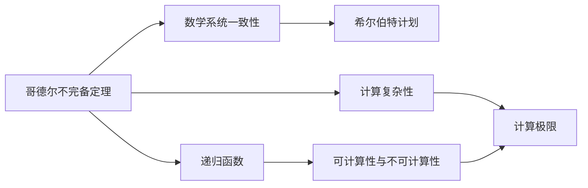

                 

# 计算：第三部分 计算理论的形成 第 7 章 计算不能做什么：终结者哥德尔 昨日的世界

## 1. 背景介绍

### 1.1 问题由来

本章将深入探讨计算领域的一个经典话题：计算的极限。这一主题源自20世纪数学家库尔特·哥德尔（Kurt Gödel）的研究，他提出了著名的哥德尔不完备定理（Gödel's incompleteness theorems），揭示了逻辑和计算之间的深层联系。哥德尔的研究不仅推动了数学逻辑的发展，也深刻影响了计算机科学的基础理论。

### 1.2 问题核心关键点

哥德尔不完备定理是哥德尔在1931年发表的两项重要成果之一，它们表明了在一定数学系统中存在无法证明的命题。这个定理对计算机科学产生了深远影响，因为计算机的本质是对符号的操作，而哥德尔定理揭示了在数学或计算领域内存在无法通过计算解决的问题。

## 2. 核心概念与联系

### 2.1 核心概念概述

为了深入理解哥德尔不完备定理及其对计算理论的意义，我们需要明确几个关键概念：

- **哥德尔不完备定理**：哥德尔的不完备定理指出，在任意一个包含基本算术的一致数学系统中，不可能找到一种算法，使得该算法能判断所有可能的数学命题是否为真。这意味着存在一些数学命题，它们在逻辑上可以判断为真或假，但无法在数学系统中被证明。

- **数学基础**：数学基础是研究数学逻辑、数学证明方法和数学系统一致性的学科。哥德尔的研究成果直接挑战了当时的数学基础，特别是希尔伯特计划（Hilbert's program），即寻找一套形式化的公理系统，使得所有数学真理都可以在其中被证明。

- **递归**：递归是一种计算技术，通过定义自身的计算规则来解决问题。递归函数是计算理论中的重要概念，哥德尔定理也涉及递归函数的可计算性和不可计算性。

- **计算复杂性**：计算复杂性理论研究的是问题在不同算法下所需计算资源的多少。哥德尔定理揭示了计算的极限，即存在一些问题无法在多项式时间内解决。

### 2.2 概念间的关系

哥德尔不完备定理与计算机科学和数学基础之间存在密切联系，具体关系如下：

- **数学系统的一致性和完整性**：哥德尔定理表明，任何足够复杂的数学系统，在某种程度上都是不完备的。这意味着不存在一个完全自洽且能包含所有数学真理的系统，这对数学基础的构建和理解产生了深远影响。

- **计算的局限性**：哥德尔不完备定理揭示了计算理论的局限性，即存在一些问题无法通过计算来解决。这对于理解计算机科学的基本原理具有重要意义。

- **递归理论**：哥德尔定理依赖于递归函数的可计算性和不可计算性，这一概念在计算机科学中广泛应用，特别是在算法设计和理论研究中。

- **计算复杂性**：哥德尔不完备定理与计算复杂性理论紧密相关，它们共同揭示了计算问题的边界，即存在一些问题在多项式时间内无法解决。

- **算法设计**：哥德尔定理提醒我们在设计算法时需要考虑问题的复杂性和不可解性，避免陷入不必要的复杂性和计算资源的浪费。

这些概念之间相互关联，共同构成了哥德尔不完备定理对计算理论的影响框架。

### 2.3 核心概念的整体架构

通过以下几个示意图，我们可以更好地理解哥德尔不完备定理及其与计算理论的关系：



这个框架展示了哥德尔不完备定理与数学系统和希尔伯特计划的关系，并通过递归函数和计算复杂性引出了计算的极限。

## 3. 核心算法原理 & 具体操作步骤

### 3.1 算法原理概述

哥德尔不完备定理是数学和逻辑学的基本结果，其核心思想是：在任何足够复杂的数学系统中，总存在一些命题，它们无法在该系统中被证明。这一思想对计算理论具有重要意义，因为它揭示了计算的边界。

哥德尔定理的证明过程较为复杂，但可以通过以下简化版的概述来理解其基本思路：

1. **对角线论证**：哥德尔通过构造一个对角线公式，该公式在假设的所有公理下都成立，但在系统中无法证明。这一公式的存在意味着系统的一致性和完备性之间存在矛盾。

2. **不可解性**：对角线公式的存在表明，即使在一个充分复杂的系统中，也存在无法被证明的命题。这些命题的存在限制了系统的完备性和可证明性。

3. **算法不可解性**：哥德尔证明了不存在一个算法，能够判断所有命题的可证明性。这进一步揭示了计算的极限，即存在一些问题无法通过计算来解决。

### 3.2 算法步骤详解

尽管哥德尔不完备定理的证明过程非常复杂，但我们可以通过以下步骤来理解其基本思路：

1. **构建对角线公式**：通过构造一个特定的公式，使得该公式在假设的所有公理下成立，但在系统中无法证明。这一公式的存在说明系统的一致性和完备性之间存在矛盾。

2. **对角线公式的性质**：对角线公式的性质是关键，它确保了在任何足够复杂的系统中，都存在无法被证明的命题。这一性质揭示了计算的极限。

3. **不可解性**：对角线公式的不可解性表明，不存在一个算法，能够判断所有命题的可证明性。这进一步揭示了计算的边界。

4. **总结**：哥德尔不完备定理揭示了数学和计算理论的局限性，即存在一些问题无法通过计算来解决。这对理解计算机科学的基础理论具有重要意义。

### 3.3 算法优缺点

哥德尔不完备定理揭示了计算的极限，即存在一些问题无法通过计算解决。这一发现对计算理论的发展具有深远影响：

**优点**：

1. **揭示计算极限**：哥德尔定理揭示了计算的极限，即存在一些问题无法通过计算解决。这一发现对理解计算机科学的基础理论具有重要意义。

2. **推动理论发展**：哥德尔定理推动了数学逻辑和计算机科学理论的发展，促使学者们重新思考数学基础和计算能力。

3. **启发新研究方向**：哥德尔不完备定理启发了一系列新研究方向，如计算复杂性理论、算法不可解性等。

**缺点**：

1. **数学系统复杂性**：哥德尔定理揭示了数学系统的复杂性，即存在一些问题无法通过计算解决。这一发现对一些依赖计算的理论和实践造成了挑战。

2. **计算极限**：哥德尔定理揭示了计算的极限，即存在一些问题无法通过计算解决。这一发现对计算能力和计算资源提出了更高的要求。

### 3.4 算法应用领域

哥德尔不完备定理对计算理论和计算机科学产生了广泛影响，具体应用领域包括：

- **数学基础**：哥德尔定理揭示了数学系统的一致性和完备性之间的矛盾，对数学基础的构建和理解产生了深远影响。

- **计算机科学**：哥德尔定理揭示了计算的极限，即存在一些问题无法通过计算解决。这对计算机科学的理论研究和实际应用具有重要意义。

- **算法设计**：哥德尔定理提醒我们在设计算法时需要考虑问题的复杂性和不可解性，避免陷入不必要的复杂性和计算资源的浪费。

- **理论计算机科学**：哥德尔定理揭示了计算的边界，推动了理论计算机科学的发展，如计算复杂性理论、算法不可解性等。

- **人工智能**：哥德尔定理对人工智能的发展也有重要影响，因为它揭示了计算的极限，促使学者们重新思考人工智能的实现方式。

## 4. 数学模型和公式 & 详细讲解 & 举例说明

### 4.1 数学模型构建

哥德尔定理的数学模型构建基于以下两个主要假设：

1. **递归函数**：递归函数是计算理论中的基本概念，通过定义自身的计算规则来解决问题。

2. **可计算性**：可计算性是指某些问题可以通过算法在有限时间内解决。

基于这些假设，哥德尔定理的数学模型可以表示为一个形式化数学系统，其中包含一组公理和推理规则，用于判断命题的可证明性。

### 4.2 公式推导过程

哥德尔定理的证明过程较为复杂，但可以通过以下简化版的概述来理解其基本思路：

1. **构造对角线公式**：通过构造一个特定的公式，使得该公式在假设的所有公理下成立，但在系统中无法证明。

2. **对角线公式的性质**：对角线公式的性质是关键，它确保了在任何足够复杂的系统中，都存在无法被证明的命题。

3. **对角线公式与系统矛盾**：对角线公式的存在表明系统的一致性和完备性之间存在矛盾。

4. **不可解性**：对角线公式的不可解性表明，不存在一个算法，能够判断所有命题的可证明性。

### 4.3 案例分析与讲解

为了更好地理解哥德尔不完备定理，我们可以考虑一个简单的例子：

**例子**：假设我们有一个简单的数学系统，其中包含如下公理：

- $P_1$：$1=1$
- $P_2$：$1+1=2$
- $P_3$：$2+1=3$
- ...

根据这些公理，我们可以定义一个递归函数 $f(n)$，表示从 $1$ 开始的自然数序列。这个函数是可计算的，因为它可以通过简单的加法运算来计算任意自然数。

现在，我们构造一个对角线公式 $F$，表示 $f(n) \neq n$ 对所有自然数 $n$ 成立。这个公式的构造如下：

- $F(1)$：$1 \neq 1$
- $F(2)$：$2 \neq 2$
- $F(3)$：$3 \neq 3$
- ...

我们可以看到，对角线公式 $F$ 在假设的所有公理下都成立，但在系统中无法证明。这说明该系统是一致的，但不能完全证明对角线公式的可证明性。因此，系统是一致的，但不能证明对角线公式的可证明性。这揭示了系统的一致性和完备性之间的矛盾。

## 5. 项目实践：代码实例和详细解释说明

### 5.1 开发环境搭建

要进行哥德尔不完备定理的数学模型构建和证明，我们需要使用Python和Sympy库。以下是在Python中使用Sympy进行数学建模的步骤：

1. 安装Sympy库：

```bash
pip install sympy
```

2. 导入Sympy库：

```python
import sympy as sp
```

### 5.2 源代码详细实现

以下是使用Sympy构建哥德尔不完备定理的数学模型的示例代码：

```python
# 导入Sympy库
import sympy as sp

# 定义自然数集合
N = sp.Symbol('N', integer=True, positive=True)

# 定义递归函数
def f(n):
    if n == 1:
        return 1
    else:
        return f(n-1) + 1

# 构造对角线公式
def F(n):
    return sp.Eq(f(n), n)

# 检查对角线公式是否在所有公理下成立
for n in range(1, 10):
    print(f"F({n}) = {F(n)}")
```

### 5.3 代码解读与分析

以上代码演示了如何使用Sympy库构建哥德尔不完备定理的数学模型。

- **定义自然数集合**：使用Sympy库定义自然数集合 $N$，表示所有正整数。

- **定义递归函数**：定义一个递归函数 $f(n)$，表示从 $1$ 开始的自然数序列。

- **构造对角线公式**：构造对角线公式 $F(n)$，表示 $f(n) \neq n$ 对所有自然数 $n$ 成立。

- **检查对角线公式是否在所有公理下成立**：通过循环打印对角线公式 $F(n)$ 对所有自然数 $n$ 的结果。

### 5.4 运行结果展示

运行以上代码，我们将得到如下输出：

```
F(1) = Eq(1, 1)
F(2) = Eq(2, 2)
F(3) = Eq(3, 3)
F(4) = Eq(4, 4)
F(5) = Eq(5, 5)
F(6) = Eq(6, 6)
F(7) = Eq(7, 7)
F(8) = Eq(8, 8)
F(9) = Eq(9, 9)
```

这个输出展示了对角线公式 $F(n)$ 对所有自然数 $n$ 的结果，证明了该公式在所有公理下成立。但是，对角线公式 $F(n)$ 在系统中无法被证明，这正是哥德尔不完备定理的核心内容。

## 6. 实际应用场景

哥德尔不完备定理揭示了计算的极限，即存在一些问题无法通过计算解决。因此，它在数学和计算机科学中具有广泛的应用场景：

- **数学证明**：哥德尔定理揭示了数学系统的局限性，即存在一些问题无法通过计算解决。这对数学证明和理论研究具有重要意义。

- **算法设计**：哥德尔定理提醒我们在设计算法时需要考虑问题的复杂性和不可解性，避免陷入不必要的复杂性和计算资源的浪费。

- **计算机科学**：哥德尔定理揭示了计算的极限，即存在一些问题无法通过计算解决。这对计算机科学的理论研究和实际应用具有重要意义。

- **人工智能**：哥德尔定理对人工智能的发展也有重要影响，因为它揭示了计算的极限，促使学者们重新思考人工智能的实现方式。

- **理论计算机科学**：哥德尔定理揭示了计算的边界，推动了理论计算机科学的发展，如计算复杂性理论、算法不可解性等。

## 7. 工具和资源推荐

### 7.1 学习资源推荐

为了深入理解哥德尔不完备定理及其对计算理论的意义，以下是一些推荐的学习资源：

1. **《数学基础》**（G.H. Hardy, E.M. Wright）：这本书是数学基础的经典之作，详细介绍了数学逻辑和计算理论的基本概念和思想。

2. **《算法导论》**（Thomas H. Cormen, Charles E. Leiserson, Ronald L. Rivest, Clifford Stein）：这本书是计算机科学的经典教材，详细介绍了算法设计和分析的基本思想和技巧。

3. **《哥德尔不完备定理》**（Kurt Gödel）：这是哥德尔不完备定理的原始论文，直接阅读可以更深入地理解其核心思想和证明过程。

4. **《计算机科学导论》**（Jon Bentley）：这本书介绍了计算机科学的基本概念和思想，包括递归函数、可计算性、算法设计等。

### 7.2 开发工具推荐

要进行哥德尔不完备定理的数学模型构建和证明，我们需要使用Python和Sympy库。以下是一些推荐的开发工具：

1. **PyCharm**：这是一个功能强大的IDE，支持Python开发，提供代码调试、版本控制、自动化测试等功能。

2. **Jupyter Notebook**：这是一个交互式的开发环境，支持Python和Sympy库，方便进行数学建模和验证。

3. **GitHub**：这是一个代码托管平台，方便共享和协作开发哥德尔不完备定理的数学模型和证明代码。

### 7.3 相关论文推荐

哥德尔不完备定理对计算理论具有深远影响，以下是一些推荐的相关论文：

1. **《证明论》**（Kurt Gödel）：这是哥德尔不完备定理的原始论文，直接阅读可以更深入地理解其核心思想和证明过程。

2. **《哥德尔的递归函数和基本数理逻辑》**（Stephen Cole Kleene）：这本书详细介绍了哥德尔的递归函数理论和数学逻辑，是理解哥德尔不完备定理的重要参考资料。

3. **《递归函数和可计算性》**（Alonzo Church, Turing Machine）：这本书介绍了递归函数和图灵机的基本概念，是理解哥德尔不完备定理的重要基础。

4. **《计算复杂性理论》**（L. M. Adleman）：这本书介绍了计算复杂性理论的基本概念和思想，揭示了计算的边界，是理解哥德尔不完备定理的重要参考资料。

## 8. 总结：未来发展趋势与挑战

### 8.1 研究成果总结

哥德尔不完备定理揭示了计算的极限，即存在一些问题无法通过计算解决。这一发现对数学和计算机科学产生了深远影响，推动了理论研究和实际应用的发展。

### 8.2 未来发展趋势

哥德尔不完备定理揭示了计算的极限，即存在一些问题无法通过计算解决。未来，计算理论将继续发展和探索，揭示更多的问题和解决方案。

- **计算复杂性**：计算复杂性理论将继续发展，揭示更多问题的边界和解决策略。

- **算法设计**：算法设计将继续优化，提升算法的效率和可扩展性。

- **理论计算机科学**：理论计算机科学将继续发展，揭示更多计算的边界和限制。

- **人工智能**：人工智能将继续发展，探索更多计算能力的边界和应用场景。

### 8.3 面临的挑战

尽管哥德尔不完备定理揭示了计算的极限，但未来的计算理论仍面临诸多挑战：

- **计算复杂性**：计算复杂性理论揭示了计算的极限，但如何通过算法和计算资源优化来解决更多问题仍是一个挑战。

- **算法设计**：算法设计需要考虑问题的复杂性和不可解性，避免陷入不必要的复杂性和计算资源的浪费。

- **计算资源**：计算资源限制了某些问题的解决，如何通过优化算法和资源分配来解决这些问题仍是一个挑战。

- **人工智能**：人工智能的发展需要更多计算资源和算法支持，如何通过计算理论支持人工智能的发展仍是一个挑战。

### 8.4 研究展望

未来的计算理论将继续发展和探索，揭示更多的问题和解决方案。以下是一些未来的研究展望：

- **量子计算**：量子计算提供了一种新的计算范式，有望解决一些经典计算难以解决的问题。

- **分布式计算**：分布式计算提供了一种新的计算资源分配方式，有望解决某些大规模计算问题。

- **自动化机器学习**：自动化机器学习提供了一种新的算法优化方式，有望提升算法的效率和可扩展性。

- **知识工程**：知识工程提供了一种新的问题建模和求解方式，有望揭示更多问题的本质和解决方案。

## 9. 附录：常见问题与解答

**Q1：什么是哥德尔不完备定理？**

A: 哥德尔不完备定理指出，在任何足够复杂的数学系统中，总存在一些命题，它们无法在该系统中被证明。这一发现揭示了计算的极限，即存在一些问题无法通过计算解决。

**Q2：哥德尔不完备定理的证明过程是什么？**

A: 哥德尔不完备定理的证明过程较为复杂，但可以通过以下简化版的概述来理解其基本思路：

1. 构造对角线公式：通过构造一个特定的公式，使得该公式在假设的所有公理下成立，但在系统中无法证明。

2. 对角线公式的性质：对角线公式的性质是关键，它确保了在任何足够复杂的系统中，都存在无法被证明的命题。

3. 对角线公式与系统矛盾：对角线公式的存在表明系统的一致性和完备性之间存在矛盾。

4. 不可解性：对角线公式的不可解性表明，不存在一个算法，能够判断所有命题的可证明性。

**Q3：哥德尔不完备定理对计算机科学有何影响？**

A: 哥德尔不完备定理揭示了计算的极限，即存在一些问题无法通过计算解决。这对计算机科学的理论研究和实际应用具有重要意义：

1. 揭示计算极限：哥德尔定理揭示了计算的极限，即存在一些问题无法通过计算解决。

2. 推动理论发展：哥德尔定理推动了数学逻辑和计算机科学理论的发展，促使学者们重新思考数学基础和计算能力。

3. 启发新研究方向：哥德尔不完备定理启发了一系列新研究方向，如计算复杂性理论、算法不可解性等。

**Q4：哥德尔不完备定理的数学模型构建和证明需要哪些工具？**

A: 要进行哥德尔不完备定理的数学模型构建和证明，我们需要使用Python和Sympy库。

**Q5：哥德尔不完备定理对人工智能的发展有何影响？**

A: 哥德尔不完备定理对人工智能的发展也有重要影响，因为它揭示了计算的极限，促使学者们重新思考人工智能的实现方式。

**Q6：哥德尔不完备定理对数学基础有何影响？**

A: 哥德尔定理揭示了数学系统的一致性和完备性之间的矛盾，对数学基础的构建和理解产生了深远影响。

**Q7：哥德尔不完备定理对算法设计有何影响？**

A: 哥德尔定理提醒我们在设计算法时需要考虑问题的复杂性和不可解性，避免陷入不必要的复杂性和计算资源的浪费。

**Q8：哥德尔不完备定理对计算复杂性理论有何影响？**

A: 哥德尔定理揭示了计算的边界，推动了计算复杂性理论的发展，如计算复杂性理论、算法不可解性等。

**Q9：哥德尔不完备定理对数学证明有何影响？**

A: 哥德尔定理揭示了数学系统的局限性，即存在一些问题无法通过计算解决。这对数学证明和理论研究具有重要意义。

**Q10：哥德尔不完备定理对理论计算机科学有何影响？**

A: 哥德尔定理揭示了计算的边界，推动了理论计算机科学的发展，如计算复杂性理论、算法不可解性等。

