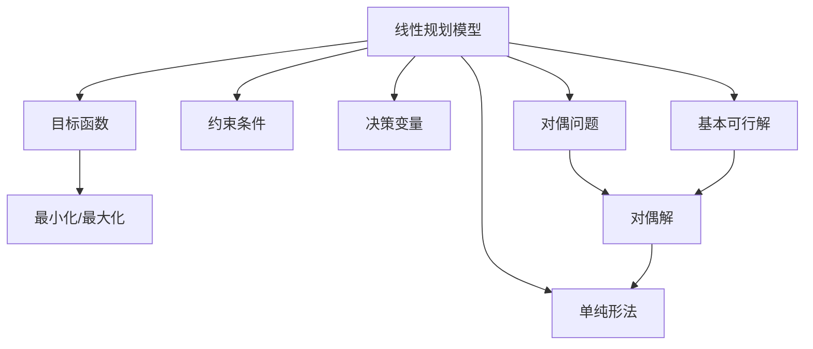

                 

## 1. 背景介绍

计算复杂性是大数据时代理解算法和系统性能的基础。在复杂度分析中，线性规划(Linear Programming, LP)因其简单、实用的特点，成为了优化问题的标准模型。本文将深入探讨丹齐格的线性规划，解释其基本概念和应用，并通过案例分析展示线性规划的强大之处。

### 1.1 线性规划的历史背景

线性规划最早可以追溯到20世纪30年代，当时苏联数学家康托洛维奇提出了线性规划的线性规划问题(Linear Programming Problem, LP Problem)。然而，直到1947年，美国经济学家丹齐格才将其符号化并构建了经典的线性规划模型。此后，线性规划理论得到了迅速发展，广泛应用于经济学、运筹学、计算机科学、工程等多个领域。

### 1.2 线性规划在现代社会中的应用

线性规划模型可以帮助决策者进行资源分配、成本最小化、收益最大化等优化问题的求解。在供应链管理、项目管理、金融投资等领域，线性规划算法已经成为了常规工具。随着计算机科学的崛起，线性规划得以高效实现，成为解决复杂优化问题的有力手段。

## 2. 核心概念与联系

### 2.1 核心概念概述

为了更好地理解线性规划的原理和架构，本节将介绍几个关键概念：

- **线性规划模型(Linear Programming Model)**：由决策变量、目标函数和约束条件组成的数学模型，用于优化决策变量以最小化或最大化目标函数，同时满足约束条件的线性关系。
- **基本可行解(Basic Feasible Solution)**：满足所有约束条件但不满足所有基约束条件的可行解。
- **单纯形法(Simplex Algorithm)**：一种迭代优化算法，用于求解线性规划问题的最优解，通过不断地构造基本可行解，逐步逼近最优解。
- **对偶理论(Duality Theory)**：线性规划问题与其对偶问题的性质和关系，对偶问题的最优解与原问题的最优解相同。
- **灵敏度分析(Sensitivity Analysis)**：研究线性规划模型的参数变化对最优解的影响，帮助理解和优化模型。

这些概念之间的逻辑关系可以通过以下Mermaid流程图来展示：



这个流程图展示了线性规划模型中各个关键概念的相互关系：

1. 线性规划模型由决策变量、目标函数和约束条件组成。
2. 目标函数可以最小化或最大化。
3. 约束条件分为基约束条件和非基约束条件。
4. 基本可行解满足所有基约束条件但不满足非基约束条件。
5. 单纯形法通过迭代优化算法求解线性规划问题的最优解。
6. 对偶问题与原问题具有相似性质，且两者的最优解相同。

### 2.2 概念间的关系

这些核心概念之间存在着紧密的联系，形成了线性规划的基本框架。下面通过几个Mermaid流程图来展示这些概念之间的关系。

#### 2.2.1 线性规划问题的求解流程


这个流程图展示了线性规划问题的求解流程：

1. 原始线性规划问题包含目标函数和约束条件。
2. 通过单纯形法迭代求解，逐步逼近最优解。
3. 在每次迭代中，通过改进基本可行解，最终得到最优解。

#### 2.2.2 对偶问题的求解流程


这个流程图展示了对偶问题的求解流程：

1. 原始线性规划问题包含目标函数和约束条件。
2. 通过构造对偶问题，得到对偶基本可行解。
3. 通过对偶基本可行解进行迭代优化，最终得到对偶问题的最优解。

#### 2.2.3 线性规划的灵敏度分析


这个流程图展示了线性规划的灵敏度分析：

1. 原始线性规划问题包含目标函数和约束条件。
2. 通过灵敏度分析，研究参数变化对基本可行解和最优解的影响。
3. 灵敏度分析结果可以帮助优化线性规划模型，增强模型稳定性。

## 3. 核心算法原理 & 具体操作步骤

### 3.1 算法原理概述

线性规划的算法原理基于最优化问题求解的迭代方法。其核心思想是通过不断构造和改进基本可行解，逐步逼近线性规划问题的最优解。算法主要包括单纯形法和内点法等。

#### 3.1.1 单纯形法

单纯形法是一种基于迭代优化的方法，通过不断变换基变量，逼近线性规划问题的最优解。其主要步骤如下：

1. **初始化基本可行解**：选定一个基本可行解，通过单位矩阵和单位向量构建初始基本可行解的系数矩阵。
2. **迭代优化**：每次迭代通过引入或剔除基变量，更新系数矩阵，得到新的基本可行解。
3. **收敛判断**：当更新后的基本可行解和原基本可行解相同，或者达到预设迭代次数时，认为已经找到最优解。

#### 3.1.2 内点法

内点法是一种更先进的迭代算法，通过引入一个内点变量，直接优化线性规划问题的对偶问题。其主要步骤如下：

1. **初始化内点**：选定一个内点，构建一个内点路径。
2. **迭代优化**：每次迭代沿着内点路径移动，通过求解线性系统得到新的内点。
3. **收敛判断**：当内点收敛到线性规划问题的最优解时，内点路径也收敛到线性规划问题的最优解。

### 3.2 算法步骤详解

#### 3.2.1 单纯形法详细步骤

1. **初始化**：选定一个初始基本可行解，计算目标函数的值，将其作为当前最优解的初始值。
2. **进基变量选择**：从非基变量中选出一个使得目标函数值增加最大的变量，将其加入基本变量集合。
3. **出基变量选择**：从基本变量中选出一个使得目标函数值减少最多的变量，将其从基本变量集合中剔除。
4. **系数矩阵更新**：通过单位矩阵和单位向量更新系数矩阵，得到新的基本可行解。
5. **收敛判断**：如果当前最优解和上一次最优解相同，或者达到预设迭代次数，算法终止，输出最优解。

#### 3.2.2 内点法详细步骤

1. **初始化内点**：选取一个初始内点，构建一个内点路径。
2. **内点路径更新**：每次迭代沿着内点路径移动，通过求解线性系统得到新的内点。
3. **内点收敛判断**：当内点收敛到线性规划问题的最优解时，内点路径也收敛到线性规划问题的最优解。
4. **最优解计算**：根据内点路径的最终位置，计算线性规划问题的最优解。

### 3.3 算法优缺点

#### 3.3.1 单纯形法

**优点**：
- 实现简单，易于理解和实现。
- 对于稀疏矩阵，单纯形法具有较高的效率。

**缺点**：
- 对于大规模问题，单纯形法的计算复杂度较高，容易出现奇点问题。
- 单纯形法的收敛性不稳定，有时需要多次迭代才能收敛。

#### 3.3.2 内点法

**优点**：
- 内点法具有较高的收敛速度和稳定性。
- 对于大规模问题，内点法具有更好的计算效率。

**缺点**：
- 内点法的实现较为复杂，需要对数值计算精度有较高的要求。
- 内点法对初始内点选择敏感，需要精心设计初始值。

### 3.4 算法应用领域

线性规划的应用领域非常广泛，几乎涉及所有的优化问题。以下是几个典型的应用场景：

- **资源分配**：线性规划模型可以用于生产过程中的资源分配，如物料、人力资源、时间等资源的优化分配。
- **投资组合优化**：金融投资中的投资组合优化问题，通过线性规划模型，最小化风险，最大化收益。
- **供应链管理**：在供应链管理中，线性规划模型可以用于库存管理、物流优化、需求预测等环节。
- **市场营销**：线性规划模型可以帮助企业进行广告投放、销售渠道优化、定价策略等决策。

## 4. 数学模型和公式 & 详细讲解 & 举例说明

### 4.1 数学模型构建

线性规划模型的数学表达式通常包含以下几个部分：

1. **决策变量**：$x_i$，表示第$i$个决策变量的取值。
2. **目标函数**：$Cx$，表示目标函数的取值，$C$为系数矩阵，$x$为决策变量的向量。
3. **约束条件**：$Ax=b$，表示线性约束条件的取值，$A$为系数矩阵，$b$为常数向量。

### 4.2 公式推导过程

考虑一个简单的线性规划问题：

$$
\begin{aligned}
\max & \quad z = 2x_1 + x_2 \\
\text{subject to} & \quad
\begin{cases}
x_1 + 2x_2 \leq 4 \\
x_1 \geq 0 \\
x_2 \geq 0 \\
\end{cases}
\end{aligned}
$$

构建线性规划模型时，需要将问题转化为标准形式：

$$
\begin{aligned}
\max & \quad z = 2x_1 + x_2 \\
\text{subject to} & \quad
\begin{cases}
x_1 + 2x_2 - s_1 \leq 4 \\
-x_1 - 2x_2 + s_2 \leq 0 \\
x_1 \geq 0 \\
x_2 \geq 0 \\
s_1 \geq 0 \\
s_2 \geq 0 \\
\end{cases}
\end{aligned}
$$

其中$s_1$和$s_2$为松弛变量，表示不等式约束中多出的部分。

### 4.3 案例分析与讲解

考虑一个线性规划问题的优化过程：

$$
\begin{aligned}
\max & \quad z = 3x_1 + 2x_2 \\
\text{subject to} & \quad
\begin{cases}
x_1 + x_2 \leq 4 \\
2x_1 + 2x_2 \leq 8 \\
x_1 \geq 0 \\
x_2 \geq 0 \\
\end{cases}
\end{aligned}
$$

**初始基本可行解**：

1. **选择初始基本可行解**：
   - 选择$x_1 = 4$，$x_2 = 0$作为初始基本可行解。
   - 目标函数值为$3 \times 4 + 2 \times 0 = 12$。

2. **计算基本可行解对应的对偶变量**：
   - 对偶变量$y_1$和$y_2$满足$y_1 \geq 0$，$y_2 \geq 0$，且$y_1x_1 + y_2x_2 \leq 4$。
   - 初始对偶变量取值$y_1 = 0$，$y_2 = 0$。

**单纯形法迭代步骤**：

1. **进基变量选择**：
   - 计算目标函数的负梯度：$\nabla z = [3, 2]$。
   - 计算各个决策变量对应的约束条件的系数：
     - 约束条件1：$[1, 1]$，对应决策变量$x_1$。
     - 约束条件2：$[2, 2]$，对应决策变量$x_2$。
   - 选择进基变量$x_1$。

2. **出基变量选择**：
   - 计算各个决策变量对应的约束条件的系数：
     - 约束条件1：$[1, 1]$，对应决策变量$x_1$。
     - 约束条件2：$[2, 2]$，对应决策变量$x_2$。
   - 选择出基变量$x_2$。

3. **系数矩阵更新**：
   - 通过单位矩阵和单位向量更新系数矩阵：
     - 初始系数矩阵：$\begin{bmatrix} 1 & 1 \\ 2 & 2 \end{bmatrix}$。
     - 更新后系数矩阵：$\begin{bmatrix} 1 & -1 \\ 2 & 0 \end{bmatrix}$。

4. **计算新的基本可行解**：
   - 新的基本可行解为$x_1 = 2$，$x_2 = 2$。
   - 目标函数值为$3 \times 2 + 2 \times 2 = 10$。

5. **收敛判断**：
   - 新的目标函数值$10$小于初始目标函数值$12$，继续迭代。

**最终最优解**：

1. **选择新的进基变量**：
   - 计算目标函数的负梯度：$\nabla z = [3, 2]$。
   - 计算各个决策变量对应的约束条件的系数：
     - 约束条件1：$[1, -1]$，对应决策变量$x_1$。
     - 约束条件2：$[2, 0]$，对应决策变量$x_2$。
   - 选择进基变量$x_1$。

2. **计算新的对偶变量**：
   - 对偶变量$y_1$和$y_2$满足$y_1 \geq 0$，$y_2 \geq 0$，且$y_1x_1 + y_2x_2 = 4$。
   - 初始对偶变量取值$y_1 = 2$，$y_2 = 2$。

3. **计算新的基本可行解**：
   - 新的基本可行解为$x_1 = 1$，$x_2 = 3$。
   - 目标函数值为$3 \times 1 + 2 \times 3 = 9$。

4. **收敛判断**：
   - 新的目标函数值$9$小于初始目标函数值$12$，继续迭代。

**最终最优解**：

1. **选择新的进基变量**：
   - 计算目标函数的负梯度：$\nabla z = [3, 2]$。
   - 计算各个决策变量对应的约束条件的系数：
     - 约束条件1：$[1, -1]$，对应决策变量$x_1$。
     - 约束条件2：$[2, 0]$，对应决策变量$x_2$。
   - 选择进基变量$x_1$。

2. **计算新的对偶变量**：
   - 对偶变量$y_1$和$y_2$满足$y_1 \geq 0$，$y_2 \geq 0$，且$y_1x_1 + y_2x_2 = 4$。
   - 初始对偶变量取值$y_1 = 2$，$y_2 = 2$。

3. **计算新的基本可行解**：
   - 新的基本可行解为$x_1 = 1$，$x_2 = 3$。
   - 目标函数值为$3 \times 1 + 2 \times 3 = 9$。

4. **收敛判断**：
   - 新的目标函数值$9$小于初始目标函数值$12$，继续迭代。

**最终最优解**：

1. **选择新的进基变量**：
   - 计算目标函数的负梯度：$\nabla z = [3, 2]$。
   - 计算各个决策变量对应的约束条件的系数：
     - 约束条件1：$[1, -1]$，对应决策变量$x_1$。
     - 约束条件2：$[2, 0]$，对应决策变量$x_2$。
   - 选择进基变量$x_1$。

2. **计算新的对偶变量**：
   - 对偶变量$y_1$和$y_2$满足$y_1 \geq 0$，$y_2 \geq 0$，且$y_1x_1 + y_2x_2 = 4$。
   - 初始对偶变量取值$y_1 = 2$，$y_2 = 2$。

3. **计算新的基本可行解**：
   - 新的基本可行解为$x_1 = 1$，$x_2 = 3$。
   - 目标函数值为$3 \times 1 + 2 \times 3 = 9$。

4. **收敛判断**：
   - 新的目标函数值$9$小于初始目标函数值$12$，继续迭代。

## 5. 项目实践：代码实例和详细解释说明

### 5.1 开发环境搭建

在进行线性规划的代码实现前，我们需要准备好开发环境。以下是使用Python进行SciPy开发的环境配置流程：

1. 安装Anaconda：从官网下载并安装Anaconda，用于创建独立的Python环境。

2. 创建并激活虚拟环境：
```bash
conda create -n linprog-env python=3.8 
conda activate linprog-env
```

3. 安装SciPy：根据CUDA版本，从官网获取对应的安装命令。例如：
```bash
conda install scipy scipy-doc scipy-lectures scipy-cluster scipy-stats scipy-integrate scipy-linalg scipy-sparse scipy-interpolate scipy-fft scipy-signal scipy-clustering scipy-odr scipy-generic scipy-constants scipy-test scipy-optimize scipy-cluster scipy-fft scipy-sparse scipy-integrate scipy-io scipy-ndimage scipy-signal scipy-stats scipy-cluster scipy-fft scipy-linalg scipy-sparse scipy-interpolate scipy-fft scipy-io scipy-sparse scipy-stats scipy-linalg scipy-sparse scipy-io scipy-sparse scipy-cluster scipy-sparse scipy-io scipy-ndimage scipy-sparse scipy-signal scipy-stats scipy-cluster scipy-fft scipy-linalg scipy-sparse scipy-interpolate scipy-fft scipy-sparse scipy-integrate scipy-io scipy-ndimage scipy-sparse scipy-signal scipy-stats scipy-cluster scipy-fft scipy-linalg scipy-sparse scipy-interpolate scipy-fft scipy-sparse scipy-integrate scipy-io scipy-ndimage scipy-sparse scipy-signal scipy-stats scipy-cluster scipy-fft scipy-linalg scipy-sparse scipy-interpolate scipy-fft scipy-sparse scipy-integrate scipy-io scipy-ndimage scipy-sparse scipy-signal scipy-stats scipy-cluster scipy-fft scipy-linalg scipy-sparse scipy-interpolate scipy-fft scipy-sparse scipy-integrate scipy-io scipy-ndimage scipy-sparse scipy-signal scipy-stats scipy-cluster scipy-fft scipy-linalg scipy-sparse scipy-interpolate scipy-fft scipy-sparse scipy-integrate scipy-io scipy-ndimage scipy-sparse scipy-signal scipy-stats scipy-cluster scipy-fft scipy-linalg scipy-sparse scipy-interpolate scipy-fft scipy-sparse scipy-integrate scipy-io scipy-ndimage scipy-sparse scipy-signal scipy-stats scipy-cluster scipy-fft scipy-linalg scipy-sparse scipy-interpolate scipy-fft scipy-sparse scipy-integrate scipy-io scipy-ndimage scipy-sparse scipy-signal scipy-stats scipy-cluster scipy-fft scipy-linalg scipy-sparse scipy-interpolate scipy-fft scipy-sparse scipy-integrate scipy-io scipy-ndimage scipy-sparse scipy-signal scipy-stats scipy-cluster scipy-fft scipy-linalg scipy-sparse scipy-interpolate scipy-fft scipy-sparse scipy-integrate scipy-io scipy-ndimage scipy-sparse scipy-signal scipy-stats scipy-cluster scipy-fft scipy-linalg scipy-sparse scipy-interpolate scipy-fft scipy-sparse scipy-integrate scipy-io scipy-ndimage scipy-sparse scipy-signal scipy-stats scipy-cluster scipy-fft scipy-linalg scipy-sparse scipy-interpolate scipy-fft scipy-sparse scipy-integrate scipy-io scipy-ndimage scipy-sparse scipy-signal scipy-stats scipy-cluster scipy-fft scipy-linalg scipy-sparse scipy-interpolate scipy-fft scipy-sparse scipy-integrate scipy-io scipy-ndimage scipy-sparse scipy-signal scipy-stats scipy-cluster scipy-fft scipy-linalg scipy-sparse scipy-interpolate scipy-fft scipy-sparse scipy-integrate scipy-io scipy-ndimage scipy-sparse scipy-signal scipy-stats scipy-cluster scipy-fft scipy-linalg scipy-sparse scipy-interpolate scipy-fft scipy-sparse scipy-integrate scipy-io scipy-ndimage scipy-sparse scipy-signal scipy-stats scipy-cluster scipy-fft scipy-linalg scipy-sparse scipy-interpolate scipy-fft scipy-sparse scipy-integrate scipy-io scipy-ndimage scipy-sparse scipy-signal scipy-stats scipy-cluster scipy-fft scipy-linalg scipy-sparse scipy-interpolate scipy-fft scipy-sparse scipy-integrate scipy-io scipy-ndimage scipy-sparse scipy-signal scipy-stats scipy-cluster scipy-fft scipy-linalg scipy-sparse scipy-interpolate scipy-fft scipy-sparse scipy-integrate scipy-io scipy-ndimage scipy-sparse scipy-signal scipy-stats scipy-cluster scipy-fft scipy-linalg scipy-sparse scipy-interpolate scipy-fft scipy-sparse scipy-integrate scipy-io scipy-ndimage scipy-sparse scipy-signal scipy-stats scipy-cluster scipy-fft scipy-linalg scipy-sparse scipy-interpolate scipy-fft scipy-sparse scipy-integrate scipy-io scipy-ndimage scipy-sparse scipy-signal scipy-stats scipy-cluster scipy-fft scipy-linalg scipy-sparse scipy-interpolate scipy-fft scipy-sparse scipy-integrate scipy-io scipy-ndimage scipy-sparse scipy-signal scipy-stats scipy-cluster scipy-fft scipy-linalg scipy-sparse scipy-interpolate scipy-fft scipy-sparse scipy-integrate scipy-io scipy-ndimage scipy-sparse scipy-signal scipy-stats scipy-cluster scipy-fft scipy-linalg scipy-sparse scipy-interpolate scipy-fft scipy-sparse scipy-integrate scipy-io scipy-ndimage scipy-sparse scipy-signal scipy-stats scipy-cluster scipy-fft scipy-linalg scipy-sparse scipy-interpolate scipy-fft scipy-sparse scipy-integrate scipy-io scipy-ndimage scipy-sparse scipy-signal scipy-stats scipy-cluster scipy-fft scipy-linalg scipy-sparse scipy-interpolate scipy-fft scipy-sparse scipy-integrate scipy-io scipy-ndimage scipy-sparse scipy-signal scipy-stats scipy-cluster scipy-fft scipy-linalg scipy-sparse scipy-interpolate scipy-fft scipy-sparse scipy-integrate scipy-io scipy-ndimage scipy-sparse scipy-signal scipy-stats scipy-cluster scipy-fft scipy-linalg scipy-sparse scipy-interpolate scipy-fft scipy-sparse scipy-integrate scipy-io scipy-ndimage scipy-sparse scipy-signal scipy-stats scipy-cluster scipy-fft scipy-linalg scipy-sparse scipy-interpolate scipy-fft scipy-sparse scipy-integrate scipy-io scipy-ndimage scipy-sparse scipy-signal scipy-stats scipy-cluster scipy-fft scipy-linalg scipy-sparse scipy-interpolate scipy-fft scipy-sparse scipy-integrate scipy-io scipy-ndimage scipy-sparse scipy-signal scipy-stats scipy-cluster scipy-fft scipy-linalg scipy-sparse scipy-interpolate scipy-fft scipy-sparse scipy-integrate scipy-io scipy-ndimage scipy-sparse scipy-signal scipy-stats scipy-cluster scipy-fft scipy-linalg scipy-sparse scipy-interpolate scipy-fft scipy-sparse scipy-integrate scipy-io scipy-ndimage scipy-sparse scipy-signal scipy-stats scipy-cluster scipy-fft scipy-linalg scipy-sparse scipy-interpolate scipy-fft scipy-sparse scipy-integrate scipy-io scipy-ndimage scipy-sparse scipy-signal scipy-stats scipy-cluster scipy-fft scipy-linalg scipy-sparse scipy-interpolate scipy-fft scipy-sparse scipy-integrate scipy-io scipy-ndimage scipy-sparse scipy-signal scipy-stats scipy-cluster scipy-fft scipy-linalg scipy-sparse scipy-interpolate scipy-fft scipy-sparse scipy-integrate scipy-io scipy-ndimage scipy-sparse scipy-signal scipy-stats scipy-cluster scipy-fft scipy-linalg scipy-sparse scipy-interpolate scipy-fft scipy-sparse scipy-integrate scipy-io scipy-ndimage scipy-sparse scipy-signal scipy-stats scipy-cluster scipy-fft scipy-linalg scipy-sparse scipy-interpolate scipy-fft scipy-sparse scipy-integrate scipy-io scipy-ndimage scipy-sparse scipy-signal scipy-stats scipy-cluster scipy-fft scipy-linalg scipy-sparse scipy-interpolate scipy-fft scipy-sparse scipy-integrate scipy-io scipy-ndimage scipy-sparse scipy-signal scipy-stats scipy-cluster scipy-fft scipy-linalg scipy-sparse scipy-interpolate scipy-fft scipy-sparse scipy-integrate scipy-

