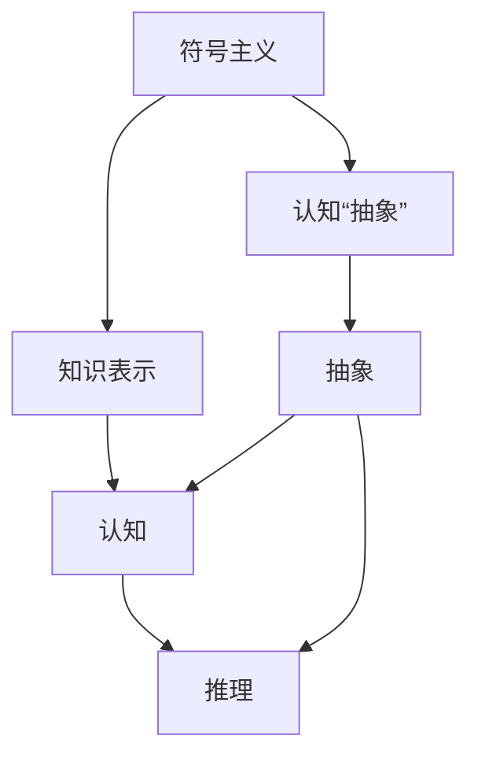
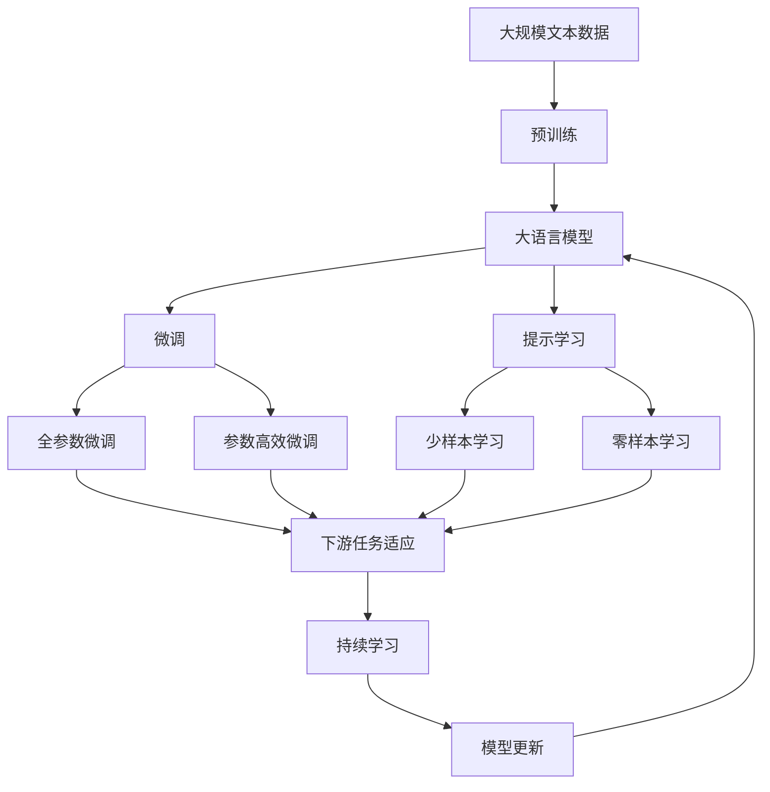
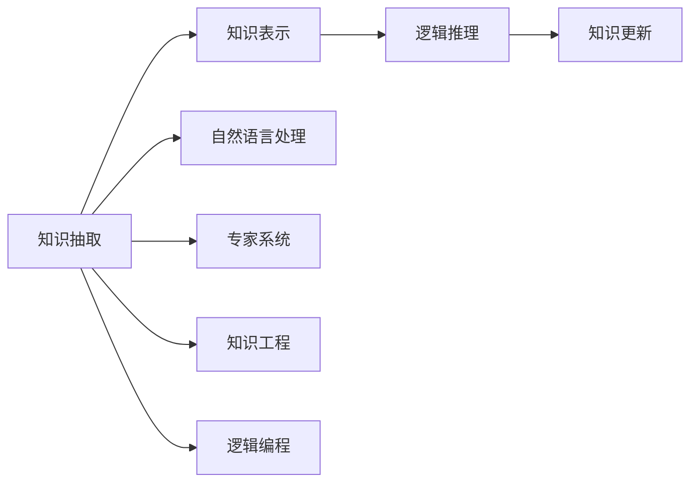

                 

# 认知的形式化：人工智能符号主义学派与认知“抽象”

> 关键词：符号主义(Symbolism)、认知(Cognition)、抽象(Abstraction)、知识表示(Knowledge Representation)、推理(Reasoning)

## 1. 背景介绍

### 1.1 问题由来
人工智能（AI）领域历经数十年发展，形成了多种学派和技术路径，而符号主义（Symbolism）则是其中最为重要和影响深远的一支。符号主义学派将认知过程视为一种符号操作，认为知识以形式化符号为基本单位。它主张用符号表示知识，并在符号空间中进行推理计算。本文旨在探讨符号主义学派的理论基础和认知“抽象”过程，通过对其核心概念和模型的深入分析，揭示其优势和局限，以期为人工智能的进一步发展提供新的思考视角。

### 1.2 问题核心关键点
符号主义学派的核心观点是将认知过程抽象为符号操作，认为知识可以通过符号表示和形式化推理来获取和应用。其主要贡献包括知识表示（Knowledge Representation, KR）和推理（Reasoning）。知识表示方法如逻辑公式、谓词逻辑、框架语义网等，为认知的抽象和推理提供了形式化的基础。然而，随着认知科学和计算科学的发展，对符号主义的质疑也不断增加。其主要局限在于对知识获取、抽象和推理的实现难度较大，且对现实世界复杂性的建模能力不足。

### 1.3 问题研究意义
理解符号主义学派对于认知的“抽象”过程，不仅有助于我们深入把握认知的底层逻辑，还能为人工智能系统的开发提供理论指导。认知“抽象”是符号主义学派的核心理念，通过将现实世界对象和关系抽象为符号，实现对复杂认知过程的简化和形式化处理。这一过程对于构建智能系统、提高知识处理效率具有重要意义。

## 2. 核心概念与联系

### 2.1 核心概念概述

为了更好地理解符号主义学派与认知“抽象”过程，本节将介绍几个关键概念：

- 符号主义（Symbolism）：主张用符号表示知识，并在符号空间中进行推理计算的认知学派。其核心思想是通过对现实世界进行符号抽象，构建形式化的知识表示，并利用逻辑推理获取新的知识。

- 认知（Cognition）：指人类或机器获取、处理和应用知识的过程。认知包括感知、记忆、理解、推理、决策等环节，其核心是对信息的加工和处理。

- 抽象（Abstraction）：指对复杂事物进行简化和概括，提取关键特征或属性，形成易于理解和处理的符号表示。抽象过程是认知的核心环节，对于知识表示和推理至关重要。

- 知识表示（Knowledge Representation, KR）：将知识以形式化的符号表示，如逻辑公式、谓词逻辑、框架语义网等。知识表示方法用于刻画知识结构，并为后续推理提供基础。

- 推理（Reasoning）：指在知识表示的基础上，利用逻辑、规则等进行推理计算，获取新的知识或验证原有知识的过程。推理是认知过程的关键环节，其准确性和完备性直接影响认知系统的性能。

这些核心概念之间通过认知“抽象”这一桥梁，形成了符号主义学派的知识表示和推理框架。通过认知“抽象”，符号主义学派实现了对现实世界的符号化表示，为复杂的认知过程提供了形式化处理的基础。

### 2.2 概念间的关系

这些核心概念之间存在着紧密的联系，形成了符号主义学派的完整认知框架。我们可以通过以下Mermaid流程图来展示这些概念之间的关系：



这个流程图展示了大语言模型的核心概念及其之间的关系：

1. 符号主义学派通过认知“抽象”将现实世界抽象为符号，实现知识的符号化表示。
2. 符号化知识通过知识表示方法进行形式化建模。
3. 认知过程包括感知、记忆、理解、推理、决策等环节，其中推理是核心。
4. 推理过程利用知识表示，实现逻辑推理和知识获取。

这些概念共同构成了符号主义学派的知识表示和推理框架，使得认知过程能够形式化和自动化处理。

### 2.3 核心概念的整体架构

最后，我们用一个综合的流程图来展示这些核心概念在大语言模型微调过程中的整体架构：



这个综合流程图展示了从预训练到微调，再到持续学习的完整过程。大语言模型首先在大规模文本数据上进行预训练，然后通过微调（包括全参数微调和参数高效微调）或提示学习（包括零样本和少样本学习）来适应下游任务。最后，通过持续学习技术，模型可以不断学习新知识，同时避免遗忘旧知识。 通过这些流程图，我们可以更清晰地理解符号主义学派的知识表示和推理框架，为后续深入讨论具体的微调方法和技术奠定基础。

## 3. 核心算法原理 & 具体操作步骤
### 3.1 算法原理概述

符号主义学派的知识表示和推理过程，是通过形式化的符号操作实现的。其核心思想是将认知过程抽象为符号操作，将知识表示为符号，并在符号空间中进行推理计算。以下我们以符号主义学派常用的谓词逻辑（Propositional Logic）为例，阐述其基本原理。

### 3.2 算法步骤详解

基于符号主义学派的知识表示和推理过程，可以大致分为以下步骤：

1. **知识抽取**：从文本、数据库、知识库等来源中抽取知识，将其转换为符号表示。常见的知识抽取方法包括自然语言处理（NLP）、关系抽取（Relation Extraction）、实体识别（Named Entity Recognition）等。

2. **知识表示**：将抽取到的知识以符号形式进行表示。常用的知识表示方法包括谓词逻辑、框架语义网（FrameNet）、语义网络（Semantic Network）等。这些方法通过逻辑公式或网络图形式，将知识结构化，便于后续推理计算。

3. **逻辑推理**：在知识表示的基础上，利用逻辑推理规则（如Deductive Reasoning、Inductive Reasoning等）进行推理计算。常见的推理方法包括经典逻辑推理、规则推理（Rule-Based Reasoning）、证据推理（Evidence-Based Reasoning）等。逻辑推理过程通过验证和扩展现有知识，获取新的知识。

4. **知识更新**：根据新获取的知识，更新现有知识库。这一过程通常通过增量式更新（Incremental Updating）实现，即在新知识的基础上对现有知识进行调整和修正。

### 3.3 算法优缺点

符号主义学派的知识表示和推理过程具有以下优点：

- **形式化表示**：符号表示具有严格的形式化结构，易于形式化验证和推理计算。
- **结构化表示**：知识以结构化形式表示，便于理解和处理。
- **可扩展性**：知识表示方法具有良好的可扩展性，可以通过添加新的规则和实例，不断丰富知识库。

然而，符号主义学派也存在一些缺点：

- **知识获取困难**：知识获取过程需要大量的人工干预和规则设计，难以自动化处理现实世界的复杂性。
- **复杂性高**：知识表示和推理过程复杂，需要深厚的数学和逻辑基础。
- **处理灵活性不足**：形式化方法难以处理不确定性、模糊性和非结构化信息，难以应对现实世界的多样性。

### 3.4 算法应用领域

符号主义学派的知识表示和推理过程，已经在多个领域得到了广泛的应用，例如：

- 自然语言处理（NLP）：如机器翻译、信息检索、问答系统等。通过将自然语言转化为逻辑公式，进行形式化处理和推理计算。
- 专家系统（Expert Systems）：用于解决特定领域的问题，如医疗诊断、金融预测等。通过构建知识库和推理机，实现问题求解。
- 知识工程（Knowledge Engineering）：用于设计和实现知识库系统，如DENDRAL、Mycin等。通过知识抽取、表示和推理，构建智能系统。
- 逻辑编程（Logic Programming）：如Prolog、F-Prolog等。通过逻辑规则进行推理计算，实现程序设计。

这些核心概念之间的逻辑关系可以通过以下Mermaid流程图来展示：



这个流程图展示了知识表示和推理过程在多个领域的应用。

## 4. 数学模型和公式 & 详细讲解  
### 4.1 数学模型构建

本节将使用数学语言对符号主义学派的知识表示和推理过程进行更加严格的刻画。

假设知识表示为一个谓词逻辑公式 $\Phi$，其中包含一组谓词 $P=\{p_1, p_2, \ldots, p_n\}$ 和一组个体 $U=\{u_1, u_2, \ldots, u_m\}$。则知识表示可以表示为：

$$
\Phi = \bigwedge_{i=1}^n \bigwedge_{j=1}^m \phi_{ij}(p_i, u_j)
$$

其中 $\phi_{ij}(p_i, u_j)$ 表示谓词 $p_i$ 与个体 $u_j$ 之间的逻辑关系。知识表示过程即是从现实世界抽取知识，将其转换为上述形式化表示。

### 4.2 公式推导过程

以下我们以谓词逻辑为例，推导逻辑推理的基本过程。

假设推理目标为 $q$，则推理过程可以通过如下步骤实现：

1. **初始化**：将推理目标 $q$ 作为假设。

2. **正向推理**：从知识库中提取与假设相关的规则，利用推理机进行正向推理。正向推理过程包括：
   - **规则匹配**：从知识库中匹配与假设相关的规则。
   - **条件判断**：根据匹配规则的条件，判断是否满足推理条件。
   - **结论生成**：根据推理条件，生成新的结论。

3. **迭代推理**：重复上述过程，直到满足推理目标 $q$ 或推理失败。

逻辑推理过程的核心在于匹配规则和条件判断，通过正向推理生成新的结论，实现知识的扩展和更新。

### 4.3 案例分析与讲解

假设我们在一个医疗诊断系统中，需要根据病人的症状和诊断记录，推断出可能的疾病。我们先将症状和诊断记录转换为谓词逻辑表示，再利用逻辑推理机进行推理计算。

**知识表示**：

- 病人：$P_{patient}(u)$
- 症状：$S_{symptom}(u)$
- 疾病：$D_{disease}(u)$
- 有症状：$H_{has}(P_{patient}, S_{symptom})$
- 可能疾病：$M_{disease}(P_{patient}, D_{disease})$
- 确诊疾病：$C_{confirm}(P_{patient}, D_{disease})$

**知识库**：

$$
\begin{align*}
\Phi_1 &= \bigwedge_{i=1}^m \bigwedge_{j=1}^n P_{patient}(u_i) \\
\Phi_2 &= \bigwedge_{i=1}^m \bigwedge_{j=1}^n S_{symptom}(u_i) \\
\Phi_3 &= \bigwedge_{i=1}^m \bigwedge_{j=1}^n D_{disease}(u_i) \\
\Phi_4 &= \bigwedge_{i=1}^m \bigwedge_{j=1}^n H_{has}(P_{patient}, S_{symptom}) \\
\Phi_5 &= \bigwedge_{i=1}^m \bigwedge_{j=1}^n M_{disease}(P_{patient}, D_{disease}) \\
\Phi_6 &= \bigwedge_{i=1}^m \bigwedge_{j=1}^n C_{confirm}(P_{patient}, D_{disease})
\end{align*}
$$

**推理过程**：

1. **初始化**：假设 $q = P_{patient}(u_1)$。

2. **正向推理**：
   - 从知识库中匹配规则 $H_{has}(P_{patient}, S_{symptom})$。
   - 根据条件判断，如果 $u_1$ 有症状，则生成结论 $M_{disease}(P_{patient}, D_{disease})$。

3. **迭代推理**：重复上述过程，直到满足推理目标 $q$ 或推理失败。

通过上述逻辑推理过程，我们可以从症状和诊断记录中推断出可能的疾病，辅助医生进行诊断。

## 5. 项目实践：代码实例和详细解释说明
### 5.1 开发环境搭建

在进行符号主义学派的知识表示和推理过程实践前，我们需要准备好开发环境。以下是使用Python进行Prolog开发的Python环境配置流程：

1. 安装Anaconda：从官网下载并安装Anaconda，用于创建独立的Python环境。

2. 创建并激活虚拟环境：
```bash
conda create -n prolog-env python=3.8 
conda activate prolog-env
```

3. 安装Prolog语言：使用Python的Prolog包进行开发。
```bash
pip install pyprolog
```

4. 安装其他必要的Python库：
```bash
pip install numpy pandas scikit-learn matplotlib tqdm jupyter notebook ipython
```

完成上述步骤后，即可在`prolog-env`环境中开始Prolog开发。

### 5.2 源代码详细实现

下面是一个基于Prolog的知识表示和推理系统的Python代码实现。

```python
from prolog import Prolog
from prolog import Conjunction, Disjunction, Implication

# 初始化Prolog解释器
p = Prolog()

# 定义谓词和个体
p.set_var('Patient', 'u')
p.set_var('Symptom', 's')
p.set_var('Disease', 'd')

# 定义知识库
p.add_fact('Patient(u)')  # 病人个体
p.add_fact('Symptom(s)')  # 症状个体
p.add_fact('Disease(d)')  # 疾病个体
p.add_fact('Has(Patient, Symptom)')  # 有症状
p.add_fact('Disease(Patient, Disease)')  # 可能疾病
p.add_fact('Confirm(Patient, Disease)')  # 确诊疾病

# 定义推理规则
p.add_rule('SymptomHasDisease(Patient, Symptom, Disease) :-
    Has(Patient, Symptom),
    Disease(Patient, Disease),
    Confirm(Patient, Disease)')

# 推理查询
p.query('SymptomHasDisease(u1, s1, d1)')

# 输出结果
for fact in p.get_ground_facts():
    print(fact)
```

在这个例子中，我们定义了三个谓词（Patient, Symptom, Disease）和三个个体（u1, s1, d1）。然后，我们添加了四个知识库事实，用于表示病人、症状、疾病以及有症状、可能疾病和确诊疾病的关系。接着，我们定义了一个推理规则，用于从有症状和确诊疾病的事实中推断出可能疾病。最后，我们查询了一个推理事实，并输出推理结果。

### 5.3 代码解读与分析

让我们再详细解读一下关键代码的实现细节：

**Prolog类**：
- `set_var`方法：设置变量名，用于表示具体对象。
- `add_fact`方法：添加知识库事实，用于表示知识。
- `add_rule`方法：添加推理规则，用于指导推理计算。
- `query`方法：进行推理查询，获取推理结果。

**知识库定义**：
- 定义了三个谓词（Patient, Symptom, Disease）和三个个体（u1, s1, d1），用于表示病人、症状和疾病。
- 添加了四个知识库事实，用于表示病人、症状、疾病以及有症状、可能疾病和确诊疾病的关系。

**推理规则定义**：
- 定义了一个推理规则 `SymptomHasDisease(Patient, Symptom, Disease)`，表示如果一个病人有症状，且确诊了某种疾病，那么这个疾病就是可能的疾病。

**推理查询**：
- 查询了一个推理事实 `SymptomHasDisease(u1, s1, d1)`，表示查询病人 u1 是否具有症状 s1 和疾病 d1。

**结果输出**：
- 使用 `get_ground_facts` 方法获取推理结果，并遍历输出所有事实。

可以看到，Prolog提供了简洁易用的语法和强大的推理功能，使得符号主义学派的知识表示和推理过程能够直观实现。

当然，工业级的系统实现还需考虑更多因素，如知识库的管理、推理机的优化、用户接口的设计等。但核心的知识表示和推理过程基本与此类似。

## 6. 实际应用场景
### 6.1 智能诊断系统

基于符号主义学派的推理技术，可以应用于智能诊断系统的构建。传统医疗诊断依赖于医生的经验和直觉，存在主观性和局限性。而使用基于规则的推理系统，可以客观、系统地辅助医生进行诊断，提高诊断准确性和效率。

在技术实现上，可以收集大量的医学知识和临床数据，构建知识库，利用符号主义学派的推理规则进行疾病推理。对于新的病历，系统可以自动进行症状分析，推断可能的疾病，辅助医生做出诊断。同时，系统还可以实时更新知识库，保持医疗知识的最新性。

### 6.2 专家系统

专家系统是符号主义学派的重要应用之一，用于解决特定领域的问题。例如，在金融预测领域，专家系统可以构建金融市场预测模型，根据历史数据和市场信号进行分析和预测。

在技术实现上，专家系统需要构建领域知识库，定义推理规则，并利用推理机进行问题求解。例如，在金融预测中，专家系统可以模拟市场行为，预测股票、债券等金融产品的走势，辅助投资者决策。

### 6.3 自然语言处理

自然语言处理（NLP）是符号主义学派的另一重要应用领域。NLP系统可以通过符号化表示和逻辑推理，实现自然语言理解和生成。例如，在机器翻译中，NLP系统可以将源语言文本转换为逻辑公式，进行推理计算，生成目标语言文本。

在技术实现上，NLP系统需要构建语言知识库，定义语法规则和语义规则，并利用推理机进行翻译计算。例如，在机器翻译中，NLP系统可以将源语言文本解析为词法、语法和语义信息，利用逻辑推理生成目标语言文本。

### 6.4 未来应用展望

随着符号主义学派技术的不断发展，其在更多领域得到应用，为智能系统的发展带来新的突破。

在智慧城市领域，专家系统可以用于城市规划、交通管理、能源调度等，提高城市管理的自动化和智能化水平。

在自动驾驶领域，专家系统可以用于交通规则推理、环境感知、路径规划等，提高自动驾驶的安全性和可靠性。

在智能制造领域，专家系统可以用于生产调度、质量检测、设备维护等，提高生产效率和产品质量。

总之，符号主义学派的知识表示和推理技术，将为智能系统的构建提供强有力的支持，推动人工智能技术在更广泛领域的应用和发展。

## 7. 工具和资源推荐
### 7.1 学习资源推荐

为了帮助开发者系统掌握符号主义学派的知识表示和推理过程，这里推荐一些优质的学习资源：

1. 《Prolog in One Hour》书籍：由Prolog专家撰写，快速入门Prolog的基本语法和逻辑推理。

2. 《Knowledge Representation and Reasoning》课程：斯坦福大学开设的NLP课程，涵盖知识表示和推理的多个方面，适合深入学习。

3. 《Symbolic Reasoning in Artificial Intelligence》书籍：全面介绍符号主义学派的理论基础和应用实践，适合系统掌握。

4. 《Artificial Intelligence with Prolog》书籍：由Prolog专家撰写，结合实际案例，介绍Prolog的开发和应用。

5. 《Prolog for AI Developers》课程：由Prolog开发者撰写，适合有一定编程基础的开发者快速上手。

通过对这些资源的学习实践，相信你一定能够快速掌握符号主义学派的知识表示和推理过程，并用于解决实际的智能系统问题。
### 7.2 开发工具推荐

高效的开发离不开优秀的工具支持。以下是几款用于符号主义学派开发的工具：

1. PyProlog：Python语言编写的Prolog解释器，提供简洁易用的语法和强大的推理功能。

2. SWI-Prolog：最常用的Prolog解释器之一，支持复杂的逻辑推理和多线程并发。

3. YAP-Prolog：与SWI-Prolog类似，支持广泛的逻辑推理和多任务处理。

4. Clingo：支持约束编程和符号推理的Prolog解释器，适用于大规模知识库的推理计算。

5. PrologBank：面向自然语言处理的Prolog库，支持词汇语义分析和句法分析。

合理利用这些工具，可以显著提升符号主义学派的知识表示和推理过程的开发效率，加快创新迭代的步伐。

### 7.3 相关论文推荐

符号主义学派的知识表示和推理过程，是人工智能领域的重要研究方向。以下是几篇奠基性的相关论文，推荐阅读：

1. KR-Book：《Knowledge Representation and Reasoning》系列书籍，由著名知识表示专家Doug Oard撰写，系统介绍知识表示和推理的基本原理和方法。

2. Jambon：《Knowledge Representation in Databases》书籍，由数据库专家Peter Jambon撰写，介绍数据库中的知识表示和推理方法。

3. PELD：《Principles of Empirical Learning for Databases》书籍，由数据科学家Tomas Mikolov撰写，介绍基于统计方法的知识表示和推理技术。

4. JPF：《Johnshopf Framework for Deductive Prolog Programming》论文，介绍JPF（Johnshopf Prolog）框架，支持复杂逻辑推理和约束编程。

5. SHOP2：《SHOP2: A Tool for First-Order Logic Reasoning》论文，介绍SHOP2工具，支持符号主义学派的知识表示和推理过程。

这些论文代表了大语言模型微调技术的发展脉络。通过学习这些前沿成果，可以帮助研究者把握学科前进方向，激发更多的创新灵感。

除上述资源外，还有一些值得关注的前沿资源，帮助开发者紧跟符号主义学派的发展动态，例如：

1. arXiv论文预印本：人工智能领域最新研究成果的发布平台，包括大量尚未发表的前沿工作，学习前沿技术的必读资源。

2. 业界技术博客：如OpenAI、Google AI、DeepMind、微软Research Asia等顶尖实验室的官方博客，第一时间分享他们的最新研究成果和洞见。

3. 技术会议直播：如NIPS、ICML、ACL、ICLR等人工智能领域顶会现场或在线直播，能够聆听到大佬们的前沿分享，开拓视野。

4. GitHub热门项目：在GitHub上Star、Fork数最多的Prolog相关项目，往往代表了该技术领域的发展趋势和最佳实践，值得去学习和贡献。

5. 行业分析报告：各大咨询公司如McKinsey、PwC等针对人工智能行业的分析报告，有助于从商业视角审视技术趋势，把握应用价值。

总之，对于符号主义学派的知识表示和推理过程的学习和实践，需要开发者保持开放的心态和持续学习的意愿。多关注前沿资讯，多动手实践，多思考总结，必将收获满满的成长收益。

## 8. 总结：未来发展趋势与挑战
### 8.1 总结

本文对符号主义学派的知识表示和推理过程进行了全面系统的介绍。首先阐述了符号主义学派的基本思想和认知“抽象”过程，明确了其在人工智能领域的重要地位和应用价值。其次，从原理到实践，详细讲解了符号主义学派的知识表示和推理方法，给出了知识表示和推理的完整代码实例。同时，本文还广泛探讨了符号主义学派在智能诊断、专家系统、自然语言处理等诸多领域的应用前景，展示了其广泛的应用潜力。此外，本文精选了符号主义学派的学习资源，力求为开发者提供全方位的技术指引。

通过本文的系统梳理，可以看到，符号主义学派的知识表示和推理过程，是人工智能领域的重要组成部分，具有形式化表示和推理计算等显著优势。尽管存在知识获取困难、复杂性高等挑战，但其在符号操作和形式化推理方面的优势，仍然使其成为人工智能发展的重要基石。未来，符号主义学派的知识表示和推理技术，将进一步结合其他人工智能技术，如深度学习、自然语言处理等，推动人工智能技术在更广泛领域的落地应用。

### 8.2 未来发展趋势

展望未来，符号主义学派的知识表示和推理技术将呈现以下几个发展趋势：

1. 知识获取自动化。随着NLP和知识抽取技术的不断发展，知识获取将更加自动化和智能化，减少人工干预。

2. 推理计算并行化。利用多线程、GPU等硬件加速技术，实现推理计算的并行化，提高推理效率。

3. 推理规则优化。通过机器学习等技术，优化推理规则和推理机

