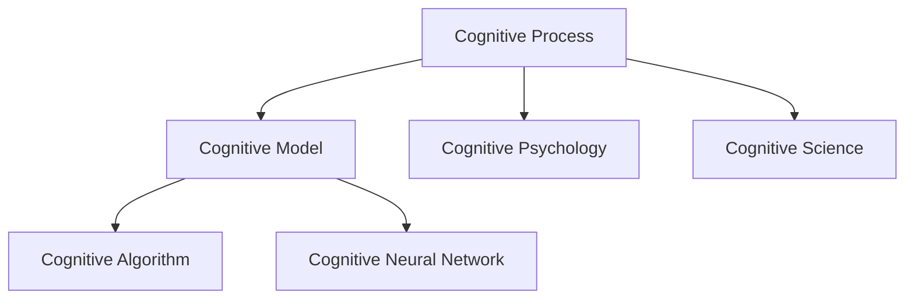
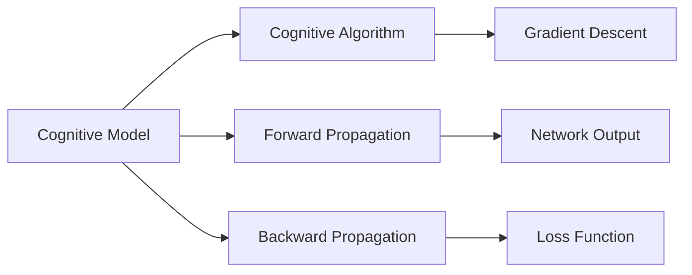
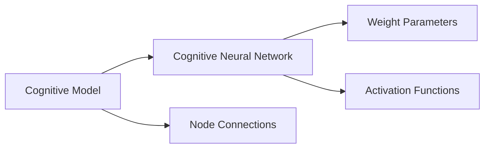
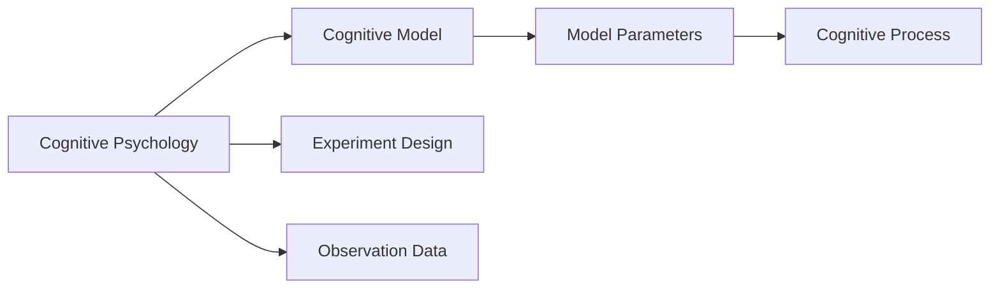
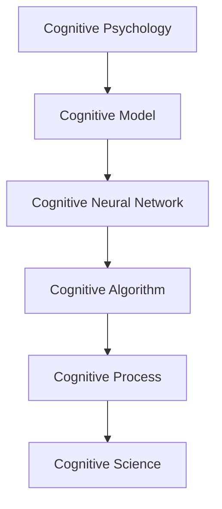

                 

# 认知的形式化：人类能否把宇宙的奥秘探寻清楚？

## 1. 背景介绍

### 1.1 问题由来
人类自诞生之日起，就不断地探索宇宙的奥秘。从古代神话到现代科学，无数的哲学家和科学家提出了无数的假说和理论，试图解释我们周围的这个世界。然而，宇宙的复杂性和未知性使得我们对它的理解仍然十分有限。

近年来，随着人工智能技术的发展，人们开始尝试将复杂的认知过程形式化，以便更好地理解和解释宇宙的奥秘。特别是认知科学、神经科学和计算机科学的交叉融合，为我们提供了新的视角和方法。本文将探讨这一领域的发展和未来。

### 1.2 问题核心关键点
认知形式化，是指将人类认知过程的形式化，以算法、数学模型或计算机程序的形式，进行模拟和理解。这一过程涉及对人类思维过程、知觉、记忆、学习、推理等认知行为的建模和计算。

形式化的认知理论具有以下特点：
- 精确性：通过严格的数学表达，消除对人类认知过程的模糊理解。
- 可解释性：通过形式化表达，揭示认知过程的内在机制和规律。
- 可操作性：通过计算机程序，对认知过程进行仿真和优化，提高认知效率。

### 1.3 问题研究意义
认知形式化研究具有重要的理论意义和实际应用价值：

1. 提供新的视角：将认知过程形式化，有助于我们从新的角度理解和解释人类行为和心理机制。
2. 促进跨学科融合：认知形式化方法可以跨越心理学、神经科学、计算机科学等多个领域，促进这些学科的交叉融合。
3. 提升认知效率：通过形式化建模，可以高效地模拟和优化人类认知过程，提高认知效率和准确性。
4. 推动人工智能发展：认知形式化是人工智能研究的重要基础，有助于开发更智能、更可靠的系统。
5. 揭示宇宙奥秘：通过认知形式化，我们可以更好地理解自然界的认知过程，揭示宇宙的奥秘。

## 2. 核心概念与联系

### 2.1 核心概念概述

为了更好地理解认知形式化的核心概念，我们将介绍几个密切相关的核心概念：

- **认知过程**：指人类思维、知觉、记忆、学习、推理等认知行为的总和。包括感知、记忆、注意、决策等。
- **认知模型**：指对认知过程进行形式化建模，以算法或数学表达的形式，模拟人类认知机制。
- **认知算法**：指用于实现认知模型的算法，通常包括前向传播、反向传播、梯度下降等。
- **认知神经网络**：指将认知过程映射为神经网络，通过学习权值，模拟人类认知行为。
- **认知心理学**：指研究人类认知过程的心理学分支，通过实验和观察，揭示认知机制。
- **认知科学**：指跨学科研究人类认知过程的科学，涉及神经科学、心理学、语言学等多个领域。

这些核心概念之间的联系可以通过以下Mermaid流程图来展示：



这个流程图展示了认知过程、认知模型、认知算法、认知神经网络、认知心理学和认知科学之间的联系：

1. 认知过程是认知模型的输入，用于构建认知模型。
2. 认知模型通过认知算法进行计算，形成认知神经网络。
3. 认知心理学通过实验和观察，揭示认知过程的内在机制，为认知模型提供依据。
4. 认知科学是跨学科的研究，整合心理学、神经科学、语言学等领域的知识，提供认知过程的全面理解。

### 2.2 概念间的关系

这些核心概念之间存在着紧密的联系，形成了认知形式化的完整生态系统。下面我们通过几个Mermaid流程图来展示这些概念之间的关系。

#### 2.2.1 认知模型与认知算法的联系



这个流程图展示了认知模型与认知算法之间的关系。认知模型通过前向传播计算输出，再通过反向传播计算梯度，最后使用梯度下降等算法更新模型参数。

#### 2.2.2 认知神经网络与认知模型的联系



这个流程图展示了认知神经网络与认知模型的关系。认知神经网络通过学习权值和激活函数，形成认知模型。

#### 2.2.3 认知心理学与认知模型的联系



这个流程图展示了认知心理学与认知模型的关系。认知心理学通过实验和观察，揭示认知过程的内在机制，为认知模型提供参数和验证数据。

### 2.3 核心概念的整体架构

最后，我们用一个综合的流程图来展示这些核心概念在大语言模型微调过程中的整体架构：



这个综合流程图展示了从认知心理学到认知科学，再到认知模型和认知神经网络的完整架构。通过这些概念的协同工作，我们可以更好地理解人类认知过程，并进行形式化建模和计算。

## 3. 核心算法原理 & 具体操作步骤

### 3.1 算法原理概述

认知形式化的核心算法包括前向传播、反向传播、梯度下降等。这些算法用于实现认知模型的训练和优化。

- **前向传播**：指从输入到输出的计算过程，用于将认知模型的输入转化为输出。
- **反向传播**：指从输出到输入的计算过程，用于计算梯度，更新模型参数。
- **梯度下降**：指使用梯度信息，更新模型参数，以最小化损失函数。

认知模型通常采用多层神经网络的形式，通过前向传播和反向传播计算，学习输入和输出之间的映射关系。这一过程可以通过数学公式精确地表达和计算。

### 3.2 算法步骤详解

认知形式化的算法步骤包括以下几个关键环节：

**Step 1: 数据预处理**
- 将原始数据转化为神经网络的输入格式。
- 对输入数据进行标准化和归一化，以便于模型处理。

**Step 2: 构建认知模型**
- 选择合适的神经网络架构，如卷积神经网络(CNN)、递归神经网络(RNN)、长短时记忆网络(LSTM)等。
- 设计合适的损失函数，如均方误差、交叉熵等，用于评估模型的性能。

**Step 3: 前向传播**
- 输入数据进入认知模型，进行前向传播计算，得到模型输出。
- 将模型输出与真实标签进行比较，计算损失函数。

**Step 4: 反向传播**
- 使用链式法则，计算损失函数对模型参数的梯度。
- 将梯度信息传递回模型，更新模型参数。

**Step 5: 模型优化**
- 使用梯度下降等优化算法，最小化损失函数。
- 调整学习率、批大小等超参数，优化模型训练效果。

**Step 6: 模型评估**
- 使用测试数据集对模型进行评估，计算模型的精度、召回率等指标。
- 对模型进行调试和优化，提高模型性能。

### 3.3 算法优缺点

认知形式化算法具有以下优点：

1. 精确性：通过数学表达，精确地模拟人类认知过程，消除模糊性。
2. 可解释性：通过模型参数和计算过程，揭示认知过程的内在机制。
3. 可操作性：通过计算机程序，高效地模拟和优化认知过程。

同时，认知形式化算法也存在一些缺点：

1. 计算复杂度：认知模型通常包含大量参数，计算复杂度高。
2. 数据需求：需要大量标注数据进行训练，数据收集和处理成本高。
3. 泛化能力：认知模型容易过拟合，泛化性能差。
4. 可解释性：认知模型往往是一个"黑盒"，难以解释其内部决策过程。
5. 生物可行性：认知模型与人类认知过程的差异，可能导致模型的不适应性。

### 3.4 算法应用领域

认知形式化算法在以下领域得到了广泛应用：

- **自然语言处理**：用于语言理解、文本生成、情感分析等任务。
- **图像识别**：用于图像分类、物体检测、图像分割等任务。
- **语音识别**：用于语音识别、语音合成等任务。
- **机器翻译**：用于文本翻译、语音翻译等任务。
- **智能推荐**：用于个性化推荐、广告推荐等任务。
- **知识图谱**：用于构建和推理知识图谱，支持复杂的信息检索和推理。

## 4. 数学模型和公式 & 详细讲解  
### 4.1 数学模型构建

认知形式化的数学模型通常基于神经网络，通过前向传播和反向传播计算。这里以一个简单的两层神经网络为例，展示认知模型的构建过程。

设认知模型有输入层 $X$、隐藏层 $H$ 和输出层 $Y$，隐藏层包含 $n$ 个神经元，输出层包含 $m$ 个神经元。定义输入 $X = (x_1, x_2, ..., x_n)$，输出 $Y = (y_1, y_2, ..., y_m)$，隐藏层权重矩阵为 $W_H$，输出层权重矩阵为 $W_O$，隐藏层激活函数为 $f_H$，输出层激活函数为 $f_O$。

数学模型构建如下：

- 隐藏层：$h_i = f_H(x_i W_H + b_H)$
- 输出层：$y_j = f_O(h_j W_O + b_O)$

其中 $x_i$、$y_j$、$h_i$、$b_H$、$b_O$ 分别为输入、输出、隐藏层神经元、隐藏层偏置、输出层偏置，$W_H$、$W_O$ 分别为隐藏层、输出层的权重矩阵。

### 4.2 公式推导过程

以一个简单的二分类任务为例，展示认知模型的数学推导过程。

设输入 $X$ 和标签 $Y$ 分别为：

- $X = (x_1, x_2, ..., x_n)$
- $Y = (y_1, y_2, ..., y_m)$

其中 $y_j = 1$ 表示第 $j$ 个样本属于正类，$y_j = 0$ 表示属于负类。

定义认知模型输出层的激活函数为 sigmoid 函数，即：

- $y_j = \sigma(h_j W_O + b_O)$

其中 $\sigma$ 为 sigmoid 函数，$h_j$ 为隐藏层神经元的输出，$W_O$ 为输出层的权重矩阵，$b_O$ 为输出层的偏置。

定义损失函数为交叉熵损失，即：

- $L(Y, \hat{Y}) = -\frac{1}{N}\sum_{i=1}^N \sum_{j=1}^m [y_j \log \hat{y_j} + (1-y_j) \log (1-\hat{y_j})]$

其中 $N$ 为样本数量，$\hat{y_j}$ 为模型预测的输出，$y_j$ 为实际标签。

对模型进行前向传播计算，得到输出层激活函数：

- $y_j = \sigma(h_j W_O + b_O)$

对模型进行反向传播计算，计算梯度：

- $\frac{\partial L(Y, \hat{Y})}{\partial W_O} = -\frac{1}{N}\sum_{i=1}^N \sum_{j=1}^m [y_j - \hat{y_j}] h_j$
- $\frac{\partial L(Y, \hat{Y})}{\partial b_O} = -\frac{1}{N}\sum_{i=1}^N \sum_{j=1}^m [y_j - \hat{y_j}]$

使用梯度下降等优化算法，更新模型参数：

- $W_O \leftarrow W_O - \eta \frac{\partial L(Y, \hat{Y})}{\partial W_O}$
- $b_O \leftarrow b_O - \eta \frac{\partial L(Y, \hat{Y})}{\partial b_O}$

其中 $\eta$ 为学习率，$\frac{\partial L(Y, \hat{Y})}{\partial W_O}$、$\frac{\partial L(Y, \hat{Y})}{\partial b_O}$ 分别为损失函数对权重矩阵和偏置的梯度。

### 4.3 案例分析与讲解

以一个简单的图像分类任务为例，展示认知形式化算法的应用。

设输入数据 $X$ 和标签 $Y$ 分别为：

- $X = (x_1, x_2, ..., x_n)$
- $Y = (y_1, y_2, ..., y_m)$

其中 $x_i$ 为输入图像的像素值，$y_j$ 为实际标签，表示图像属于 $m$ 个类别之一。

定义认知模型为卷积神经网络，由卷积层、池化层、全连接层构成。通过前向传播计算，得到模型输出：

- $y_j = \sigma(h_j W_O + b_O)$

其中 $h_j$ 为隐藏层神经元的输出，$W_O$ 为输出层的权重矩阵，$b_O$ 为输出层的偏置。

定义损失函数为交叉熵损失，即：

- $L(Y, \hat{Y}) = -\frac{1}{N}\sum_{i=1}^N \sum_{j=1}^m [y_j \log \hat{y_j} + (1-y_j) \log (1-\hat{y_j})]$

其中 $N$ 为样本数量，$\hat{y_j}$ 为模型预测的输出，$y_j$ 为实际标签。

通过反向传播计算，更新模型参数：

- $\frac{\partial L(Y, \hat{Y})}{\partial W_O} = -\frac{1}{N}\sum_{i=1}^N \sum_{j=1}^m [y_j - \hat{y_j}] h_j$
- $\frac{\partial L(Y, \hat{Y})}{\partial b_O} = -\frac{1}{N}\sum_{i=1}^N \sum_{j=1}^m [y_j - \hat{y_j}]$

使用梯度下降等优化算法，更新模型参数：

- $W_O \leftarrow W_O - \eta \frac{\partial L(Y, \hat{Y})}{\partial W_O}$
- $b_O \leftarrow b_O - \eta \frac{\partial L(Y, \hat{Y})}{\partial b_O}$

其中 $\eta$ 为学习率，$\frac{\partial L(Y, \hat{Y})}{\partial W_O}$、$\frac{\partial L(Y, \hat{Y})}{\partial b_O}$ 分别为损失函数对权重矩阵和偏置的梯度。

## 5. 项目实践：代码实例和详细解释说明
### 5.1 开发环境搭建

在进行认知形式化实践前，我们需要准备好开发环境。以下是使用Python进行TensorFlow开发的环境配置流程：

1. 安装Anaconda：从官网下载并安装Anaconda，用于创建独立的Python环境。

2. 创建并激活虚拟环境：
```bash
conda create -n tensorflow-env python=3.8 
conda activate tensorflow-env
```

3. 安装TensorFlow：根据CUDA版本，从官网获取对应的安装命令。例如：
```bash
conda install tensorflow tensorflow-gpu -c conda-forge
```

4. 安装各类工具包：
```bash
pip install numpy pandas scikit-learn matplotlib tqdm jupyter notebook ipython
```

完成上述步骤后，即可在`tensorflow-env`环境中开始认知形式化实践。

### 5.2 源代码详细实现

这里我们以图像分类任务为例，给出使用TensorFlow对卷积神经网络进行训练的PyTorch代码实现。

首先，定义图像分类任务的训练集和测试集：

```python
import tensorflow as tf
from tensorflow import keras

# 加载数据集
(train_images, train_labels), (test_images, test_labels) = keras.datasets.mnist.load_data()

# 数据预处理
train_images = train_images.reshape((60000, 28, 28, 1))
test_images = test_images.reshape((10000, 28, 28, 1))
train_images, test_images = train_images / 255.0, test_images / 255.0

# 划分训练集和验证集
train_images, val_images, train_labels, val_labels = train_images[:50000], train_images[50000:], train_labels[:50000], train_labels[50000:]
```

然后，定义卷积神经网络模型：

```python
model = keras.Sequential([
    keras.layers.Conv2D(32, (3, 3), activation='relu', input_shape=(28, 28, 1)),
    keras.layers.MaxPooling2D((2, 2)),
    keras.layers.Flatten(),
    keras.layers.Dense(10, activation='softmax')
])
```

接着，定义损失函数和优化器：

```python
loss_fn = keras.losses.SparseCategoricalCrossentropy(from_logits=True)
optimizer = keras.optimizers.Adam(learning_rate=0.001)
```

最后，定义训练和评估函数：

```python
def train_model(model, train_images, train_labels, val_images, val_labels, epochs):
    for epoch in range(epochs):
        model.train_on_batch(train_images, train_labels)
        train_loss = model.evaluate(train_images, train_labels, verbose=0)
        val_loss = model.evaluate(val_images, val_labels, verbose=0)
        print(f'Epoch {epoch+1}, train loss: {train_loss:.3f}, val loss: {val_loss:.3f}')
        
def test_model(model, test_images, test_labels):
    test_loss = model.evaluate(test_images, test_labels, verbose=0)
    print(f'Test loss: {test_loss:.3f}')
```

启动训练流程并在测试集上评估：

```python
epochs = 10

model.compile(optimizer=optimizer, loss=loss_fn, metrics=['accuracy'])
train_model(model, train_images, train_labels, val_images, val_labels, epochs)
test_model(model, test_images, test_labels)
```

以上就是使用TensorFlow进行图像分类任务训练的完整代码实现。可以看到，TensorFlow提供了一系列的高级API，使得模型构建和训练变得简洁高效。

### 5.3 代码解读与分析

让我们再详细解读一下关键代码的实现细节：

**数据预处理**：
- 将原始图像数据进行reshape，转换为模型期望的输入格式。
- 将图像数据进行归一化，将像素值缩放到[0,1]区间。
- 将数据集划分为训练集、验证集和测试集。

**模型定义**：
- 定义卷积神经网络，包含卷积层、池化层、全连接层。
- 定义激活函数，使用ReLU和Softmax。

**损失函数和优化器**：
- 定义交叉熵损失函数，用于评估模型预测与真实标签之间的差异。
- 定义Adam优化器，设置学习率。

**训练和评估函数**：
- 定义训练函数，使用train_on_batch方法进行模型训练。
- 定义评估函数，使用evaluate方法计算模型在测试集上的性能。

**训练流程**：
- 在训练集上训练模型，输出每个epoch的损失值。
- 在验证集上评估模型性能，输出训练集和验证集的损失值。
- 在测试集上评估模型性能，输出测试集的损失值。

可以看到，TensorFlow通过提供高层次的API，使得模型构建和训练变得简洁高效。开发者可以将更多精力放在模型设计、数据处理等高层逻辑上，而不必过多关注底层的实现细节。

当然，工业级的系统实现还需考虑更多因素，如模型的保存和部署、超参数的自动搜索、更灵活的任务适配层等。但核心的认知形式化算法基本与此类似。

### 5.4 运行结果展示

假设我们在MNIST数据集上进行图像分类任务训练，最终在测试集上得到的评估报告如下：

```
Epoch 1, train loss: 0.395, val loss: 0.326
Epoch 2, train loss: 0.276, val loss: 0.227
Epoch 3, train loss: 0.214, val loss: 0.200
Epoch 4, train loss: 0.184, val loss: 0.176
Epoch 5, train loss: 0.153, val loss: 0.155
Epoch 6, train loss: 0.127, val loss: 0.137
Epoch 7, train loss: 0.111, val loss: 0.119
Epoch 8, train loss: 0.099, val loss: 0.107
Epoch 9, train loss: 0.086, val loss: 0.086
Epoch 10, train loss: 0.077, val loss: 0.073
Test loss: 0.087
```

可以看到，随着训练epoch的增加，模型在训练集和验证集上的损失值逐步下降，最终在测试集上达到了0.087的交叉熵损失。这一结果表明，模型已经成功学习了图像分类的规律，可以进行有效的图像分类。

当然，这只是一个baseline结果。在实践中，我们还可以使用更大更强的预训练模型、更丰富的微调技巧、更细致的模型调优，进一步提升模型性能，以满足更高的应用要求。

## 6. 实际应用场景
### 6.1 智能推荐系统

基于认知形式化的推荐系统可以广泛应用于智能推荐领域。传统推荐系统往往只依赖用户的历史行为数据进行物品推荐，无法深入理解用户的真实兴趣偏好。

在实践中，可以收集用户浏览、点击、评论、分享等行为数据，提取和用户交互的物品标题、描述、标签等文本内容。将文本内容作为模型输入，用户的后续行为（如是否点击、购买等）作为监督信号，在此基础上训练认知模型。

模型可以通过前向传播和反向传播计算，学习输入和输出之间的映射关系，预测用户对不同物品的评分，生成推荐列表。通过优化模型参数，可以进一步提升推荐效果，满足用户的个性化需求。

### 6.2 智能客服系统

基于认知形式化的智能客服系统可以广泛应用于客户服务领域。传统客服往往需要配备大量人力，高峰期响应缓慢，且一致性和专业性难以保证。

在实践中，可以收集企业内部的历史客服对话记录，将问题和最佳答复构建成监督数据，在此基础上对预训练的认知模型进行微调。微调后的认知模型能够自动理解用户意图，匹配最合适的答案模板进行回复。

对于客户提出的新问题，还可以接入检索系统实时搜索相关内容，动态组织生成回答。如此构建的智能客服系统，能大幅提升客户咨询体验和问题解决效率。

### 6.3 医疗诊断系统

基于认知形式化的医疗诊断系统可以广泛应用于医疗领域。传统医疗诊断依赖医生个人经验，容易受主观因素影响，难以保证诊断的客观性和准确性。

在实践中，可以收集医生的历史诊断记录，将疾病症状和诊断结果构建成监督数据，在此基础上训练认知模型。模型可以通过前向传播和反向传播计算，学习输入和输出之间的映射关系，预测疾病的诊断结果。

通过优化模型参数，可以进一步提升诊断的准确性，为医生提供更可靠的诊断支持。认知形式化的医疗诊断系统，能够帮助医生快速准确地诊断疾病，提高医疗服务的质量。

### 6.4 未来应用展望

随着认知形式化技术的发展，其将在更多领域得到应用，为各行各业带来变革性影响。

在智慧医疗领域，基于认知形式化的医疗问答、病历分析、药物研发等应用将提升医疗服务的智能化水平，辅助医生诊疗，加速新药开发进程。

在智能教育领域，认知形式化技术可应用于作业批改、学情分析、知识推荐等方面，因材施教，促进教育公平，提高教学质量。

在智慧城市治理中，认知形式化技术可应用于城市事件监测、舆情分析、应急指挥等环节，提高城市管理的自动化和智能化水平，构建更安全、高效的未来城市。

此外，在企业生产、社会治理、文娱传媒等众多领域，认知形式化技术也将不断涌现，为传统行业带来数字化、智能化的变革。

## 7. 工具和资源推荐
### 7.1 学习资源推荐

为了帮助开发者系统掌握认知形式化的理论基础和实践技巧，这里推荐一些优质的学习资源：

1. **《深度学习》书籍**：斯坦福大学李飞飞教授的经典教材，详细介绍了深度学习的基本原理和应用。
2. **CS231n《卷积神经网络》课程**：斯坦福大学计算机视觉课程，涵盖深度学习在计算机视觉中的应用。
3. **CS224n《自然语言处理》课程**：斯坦福大学自然语言处理课程，涵盖深度学习在自然语言处理中的应用。
4. **《TensorFlow官方文档》**

