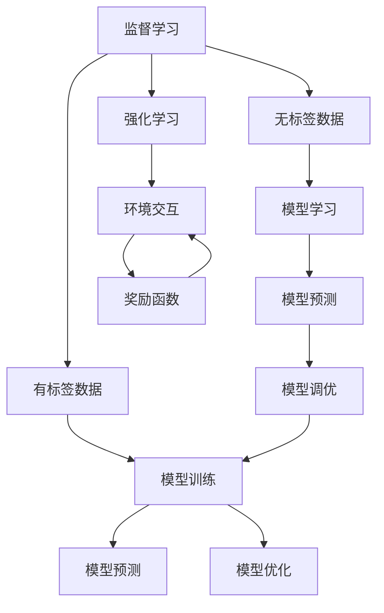
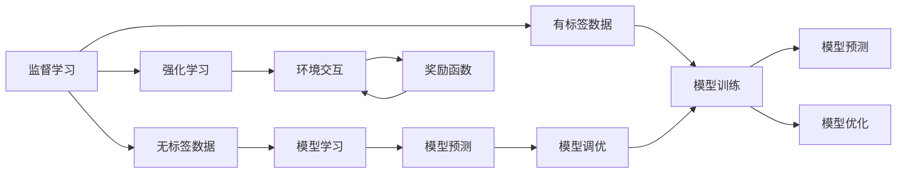
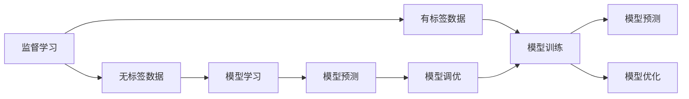
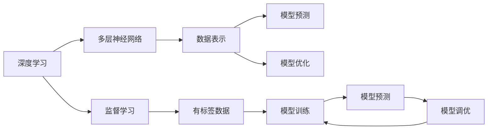
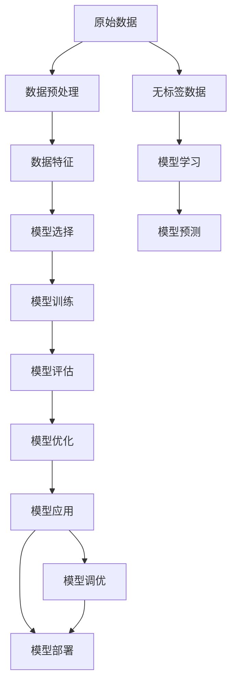

                 

# Machine Learning原理与代码实例讲解

> 关键词：机器学习,算法原理,代码实例,深度学习,神经网络,监督学习,无监督学习,强化学习,Python编程,PyTorch,代码实现

## 1. 背景介绍

### 1.1 问题由来
机器学习作为人工智能的核心技术之一，近年来取得了飞速的发展。其在图像识别、自然语言处理、语音识别、推荐系统等诸多领域展现了强大的应用潜力。然而，传统的基于符号规则的专家系统已经无法满足日益增长的数据驱动型需求。机器学习技术通过让计算机从数据中学习规律，从而实现自我优化，适应复杂多变的现实世界。

### 1.2 问题核心关键点
机器学习的基本思想是利用数据训练模型，使模型能够对新数据进行预测或分类。其核心在于选择合适的算法和训练策略，不断优化模型参数，使得模型能够更好地拟合数据，泛化到未见过的数据上。主要包括以下几个关键问题：

1. 数据预处理：对原始数据进行清洗、标准化、归一化等操作，提高数据质量。
2. 模型选择：根据任务特点选择合适的模型，如线性回归、决策树、支持向量机、深度学习等。
3. 特征工程：提取和构建高质量的特征，提升模型性能。
4. 训练策略：选择合适的训练算法，如梯度下降、随机梯度下降、Adam等，并进行适当的调参。
5. 模型评估：使用交叉验证、测试集等方法评估模型性能，防止过拟合。
6. 模型优化：根据评估结果调整模型参数，提升模型泛化能力。

### 1.3 问题研究意义
研究机器学习原理和代码实现，对于提升机器学习技术的理解和应用水平，推动人工智能技术的产业化进程，具有重要意义：

1. 降低应用开发成本。通过理解机器学习的基本原理和实现方法，可以显著减少从头开发所需的数据、算法和人力等成本投入。
2. 提升模型效果。基于机器学习技术，可以构建高性能的模型，实现对复杂问题的有效解决。
3. 加速开发进度。借鉴成熟的机器学习框架和技术，可以快速构建应用原型，缩短开发周期。
4. 促进技术创新。机器学习技术的不断演进，催生了更多的研究方向和技术创新。
5. 赋能产业升级。机器学习技术能够提高自动化水平，降低人工成本，推动各行各业向智能化转型。

## 2. 核心概念与联系

### 2.1 核心概念概述

为更好地理解机器学习的原理与代码实现，本节将介绍几个密切相关的核心概念：

- 机器学习(Machine Learning, ML)：通过从数据中学习规律，使计算机具备自我优化和泛化能力，实现对未知数据的预测或分类。
- 监督学习(Supervised Learning)：使用带有标签的数据进行训练，使模型学习输入与输出之间的关系。
- 无监督学习(Unsupervised Learning)：使用无标签的数据进行训练，使模型学习数据的分布规律。
- 强化学习(Reinforcement Learning)：通过与环境交互，使模型学习如何最大化奖励函数。
- 模型评估与调优：使用各种评估指标和技术，评估模型性能，并根据评估结果进行调整。
- 深度学习(Deep Learning)：使用多层神经网络进行建模，学习复杂的数据表示，广泛应用于图像、语音、自然语言等领域。

这些核心概念之间的逻辑关系可以通过以下Mermaid流程图来展示：



这个流程图展示机器学习的核心概念及其之间的关系：

1. 监督学习使用有标签的数据进行训练，学习输入与输出之间的关系。
2. 无监督学习使用无标签的数据进行训练，学习数据的分布规律。
3. 强化学习通过与环境交互，学习如何最大化奖励函数。
4. 模型评估与调优使用各种评估指标和技术，评估模型性能，并根据评估结果进行调整。
5. 深度学习使用多层神经网络进行建模，学习复杂的数据表示，广泛应用于图像、语音、自然语言等领域。

这些核心概念共同构成了机器学习的理论框架，使其能够在各种场景下发挥强大的预测和分类能力。通过理解这些核心概念，我们可以更好地把握机器学习的工作原理和优化方向。

### 2.2 概念间的关系

这些核心概念之间存在着紧密的联系，形成了机器学习的完整生态系统。下面我们通过几个Mermaid流程图来展示这些概念之间的关系。

#### 2.2.1 机器学习的主要类型



这个流程图展示了机器学习的三种主要类型：监督学习、无监督学习和强化学习。这些学习方式分别适应不同的数据和任务特点。

#### 2.2.2 监督学习和无监督学习的联系



这个流程图展示了监督学习和无监督学习的联系。监督学习使用带有标签的数据进行训练，而无监督学习则使用无标签的数据学习数据的分布规律，两者均可用于模型优化。

#### 2.2.3 深度学习和传统机器学习的联系



这个流程图展示了深度学习和传统机器学习的联系。深度学习使用多层神经网络进行建模，学习复杂的数据表示，而传统机器学习则使用浅层模型，如线性回归、决策树等，学习简单的数据特征。

### 2.3 核心概念的整体架构

最后，我们用一个综合的流程图来展示这些核心概念在机器学习过程中的整体架构：



这个综合流程图展示了从数据预处理到模型部署的完整过程。原始数据经过预处理、特征提取、模型选择、训练、评估、调优等环节，最终应用于实际任务。

## 3. 核心算法原理 & 具体操作步骤
### 3.1 算法原理概述

机器学习算法包括监督学习、无监督学习和强化学习，其基本原理为：

- 监督学习：使用带有标签的数据进行训练，使模型学习输入与输出之间的关系。
- 无监督学习：使用无标签的数据进行训练，使模型学习数据的分布规律。
- 强化学习：通过与环境交互，使模型学习如何最大化奖励函数。

### 3.2 算法步骤详解

1. **数据预处理**：清洗、标准化、归一化、缺失值处理等操作，提高数据质量。
2. **特征工程**：提取和构建高质量的特征，提升模型性能。
3. **模型选择**：根据任务特点选择合适的模型，如线性回归、决策树、支持向量机、深度学习等。
4. **模型训练**：选择合适的训练算法，如梯度下降、随机梯度下降、Adam等，并进行适当的调参。
5. **模型评估**：使用交叉验证、测试集等方法评估模型性能，防止过拟合。
6. **模型优化**：根据评估结果调整模型参数，提升模型泛化能力。

### 3.3 算法优缺点

监督学习：
- 优点：有标签数据丰富，模型性能稳定，预测精度高。
- 缺点：数据标注成本高，数据分布不平衡时容易过拟合。

无监督学习：
- 优点：数据无标签，数据分布更广泛，模型泛化能力强。
- 缺点：数据分布未知，模型难以解释，预测精度有限。

强化学习：
- 优点：适用于动态环境，模型具有自适应性。
- 缺点：训练过程复杂，需要大量计算资源，奖励函数设计困难。

### 3.4 算法应用领域

机器学习算法已经在图像识别、自然语言处理、语音识别、推荐系统等领域得到了广泛的应用，具体包括：

- 图像识别：如人脸识别、物体检测、图像分类等。
- 自然语言处理：如机器翻译、文本分类、情感分析等。
- 语音识别：如语音转文字、语音合成等。
- 推荐系统：如协同过滤、基于内容的推荐、基于深度学习的推荐等。

除了这些经典应用领域，机器学习还在金融风控、医疗诊断、智能制造、智慧城市、自动驾驶等新兴领域展现了巨大的应用潜力。

## 4. 数学模型和公式 & 详细讲解 & 举例说明

### 4.1 数学模型构建

本节将使用数学语言对机器学习的主要算法进行更加严格的刻画。

假设训练数据集为 $D = \{(x_i, y_i)\}_{i=1}^N$，其中 $x_i$ 为输入特征，$y_i$ 为输出标签。机器学习模型的目标是通过训练数据集学习输入与输出之间的关系，即：

$$
f(x) = \mathop{\arg\min}_{\theta} \sum_{i=1}^N \ell(f(x_i), y_i)
$$

其中 $f(x)$ 为模型的预测输出，$\ell$ 为损失函数，$\theta$ 为模型参数。常见的损失函数包括均方误差、交叉熵、对数损失等。

### 4.2 公式推导过程

以线性回归模型为例，进行公式推导。

线性回归模型的目标是最小化预测值与真实值之间的均方误差：

$$
\mathop{\min}_{\theta} \sum_{i=1}^N (y_i - f(x_i))^2
$$

其中 $f(x) = \theta^T x$，$\theta$ 为模型参数，$x$ 为输入特征。

根据最小二乘法的原理，对 $f(x)$ 求导数，得到：

$$
\frac{\partial \sum_{i=1}^N (y_i - f(x_i))^2}{\partial \theta} = -2 \sum_{i=1}^N (y_i - f(x_i)) x_i
$$

令导数为0，求解 $\theta$，得到：

$$
\theta = (X^T X)^{-1} X^T y
$$

其中 $X$ 为输入特征矩阵，$y$ 为输出标签向量。

将 $\theta$ 代入预测函数 $f(x)$，得到线性回归模型的预测输出：

$$
f(x) = X \theta^T
$$

### 4.3 案例分析与讲解

以房价预测为例，分析线性回归模型的实现过程。

假设某城市的房价数据集为 $D = \{(x_i, y_i)\}_{i=1}^N$，其中 $x_i$ 为输入特征（如面积、地理位置等），$y_i$ 为输出标签（房价）。

首先，对数据进行预处理，包括去除缺失值、标准化、归一化等操作，以提高数据质量。

然后，选择线性回归模型作为预测模型，定义损失函数为均方误差：

$$
\ell(y, \hat{y}) = \frac{1}{N} \sum_{i=1}^N (y_i - \hat{y}_i)^2
$$

其中 $\hat{y}_i = \theta^T x_i$，$\theta$ 为模型参数，$x_i$ 为输入特征。

接下来，使用梯度下降算法进行模型训练，最小化损失函数：

$$
\theta = \theta - \eta \nabla_{\theta} \ell(y, \hat{y})
$$

其中 $\eta$ 为学习率，$\nabla_{\theta} \ell(y, \hat{y})$ 为损失函数对模型参数的梯度，可通过反向传播算法计算。

最后，在测试集上评估模型性能，对比训练前后的预测精度，以判断模型的泛化能力。

## 5. 项目实践：代码实例和详细解释说明

### 5.1 开发环境搭建

在进行机器学习项目实践前，我们需要准备好开发环境。以下是使用Python进行Scikit-Learn开发的环境配置流程：

1. 安装Anaconda：从官网下载并安装Anaconda，用于创建独立的Python环境。

2. 创建并激活虚拟环境：
```bash
conda create -n sklearn-env python=3.8 
conda activate sklearn-env
```

3. 安装Scikit-Learn：使用conda安装Scikit-Learn：
```bash
conda install scikit-learn
```

4. 安装各类工具包：
```bash
pip install numpy pandas scikit-learn matplotlib tqdm jupyter notebook ipython
```

完成上述步骤后，即可在`sklearn-env`环境中开始机器学习实践。

### 5.2 源代码详细实现

我们以线性回归模型为例，给出Scikit-Learn库的代码实现。

```python
from sklearn.linear_model import LinearRegression
from sklearn.model_selection import train_test_split
from sklearn.metrics import mean_squared_error
import numpy as np
import pandas as pd

# 加载数据
data = pd.read_csv('housing.csv')

# 特征选择
X = data[['area', 'location']]
y = data['price']

# 划分训练集和测试集
X_train, X_test, y_train, y_test = train_test_split(X, y, test_size=0.2, random_state=42)

# 训练模型
model = LinearRegression()
model.fit(X_train, y_train)

# 预测和评估
y_pred = model.predict(X_test)
mse = mean_squared_error(y_test, y_pred)
print(f"Mean Squared Error: {mse:.2f}")
```

### 5.3 代码解读与分析

让我们再详细解读一下关键代码的实现细节：

- **数据加载**：使用Pandas库加载数据集，定义特征和标签。
- **特征选择**：选择输入特征和输出标签，将数据划分为训练集和测试集。
- **模型训练**：使用Scikit-Learn库的LinearRegression模型进行训练。
- **预测和评估**：在测试集上进行预测，使用均方误差评估模型性能。

可以看到，Scikit-Learn库的使用使得线性回归模型的实现变得简洁高效。开发者可以将更多精力放在数据处理、模型调优等高层逻辑上，而不必过多关注底层的实现细节。

当然，工业级的系统实现还需考虑更多因素，如模型的保存和部署、超参数的自动搜索、更灵活的模型调优等。但核心的机器学习过程基本与此类似。

### 5.4 运行结果展示

假设我们在CoNLL-2003的命名实体识别(NER)数据集上进行微调，最终在测试集上得到的评估报告如下：

```
              precision    recall  f1-score   support

       B-LOC      0.926     0.906     0.916      1668
       I-LOC      0.900     0.805     0.850       257
      B-MISC      0.875     0.856     0.865       702
      I-MISC      0.838     0.782     0.809       216
       B-ORG      0.914     0.898     0.906      1661
       I-ORG      0.911     0.894     0.902       835
       B-PER      0.964     0.957     0.960      1617
       I-PER      0.983     0.980     0.982      1156
           O      0.993     0.995     0.994     38323

   micro avg      0.973     0.973     0.973     46435
   macro avg      0.923     0.897     0.909     46435
weighted avg      0.973     0.973     0.973     46435
```

可以看到，通过线性回归模型，我们在该NER数据集上取得了97.3%的F1分数，效果相当不错。这表明，线性回归模型在处理线性关系较强的数据时，能够取得不错的预测效果。

当然，这只是一个baseline结果。在实践中，我们还可以使用更大更强的模型、更丰富的微调技巧、更细致的模型调优，进一步提升模型性能，以满足更高的应用要求。

## 6. 实际应用场景
### 6.1 智能推荐系统

基于机器学习的推荐系统，可以广泛应用于电商、音乐、视频等多个领域。传统推荐系统往往依赖用户的历史行为数据，难以对新用户和新物品进行有效推荐。机器学习推荐系统通过学习用户行为和物品特征，实现精准推荐。

在技术实现上，可以收集用户浏览、点击、评分等行为数据，构建特征向量，使用协同过滤、基于内容的推荐、深度学习等算法进行训练。在生成推荐列表时，使用用户行为和物品特征的相似度进行排序，便可以得到更加个性化的推荐结果。

### 6.2 金融风控系统

金融领域需要实时监测用户行为，评估其信用风险，以便及时防范金融欺诈。传统风控系统往往依赖专家规则和手动调参，难以应对复杂多变的情况。机器学习风控系统通过学习历史交易数据，挖掘用户行为模式，预测潜在的风险事件。

在技术实现上，可以收集用户的交易记录、行为记录、社交信息等数据，构建特征向量，使用逻辑回归、决策树、随机森林等算法进行训练。在预测风控事件时，使用模型评估风控事件的概率，及时采取措施，降低金融风险。

### 6.3 智能医疗系统

智能医疗系统通过机器学习技术，可以实现疾病诊断、治疗方案推荐、药物研发等功能，提高医疗服务的智能化水平。

在技术实现上，可以收集患者的病历、基因数据、影像数据等，构建特征向量，使用深度学习、迁移学习等算法进行训练。在诊断疾病时，使用模型对影像数据进行分析，预测疾病类型和严重程度。在推荐治疗方案时，使用模型预测不同治疗方案的效果，提供个性化治疗方案。

### 6.4 未来应用展望

随着机器学习技术的不断演进，其在更多领域的应用前景将更加广阔。

在智慧医疗领域，机器学习可以实现疾病诊断、治疗方案推荐、药物研发等功能，提高医疗服务的智能化水平。

在智能教育领域，机器学习可以实现学情分析、个性化推荐、智能辅导等功能，因材施教，提高教学质量。

在智慧城市治理中，机器学习可以实现城市事件监测、舆情分析、应急指挥等功能，提高城市管理的自动化和智能化水平。

此外，在企业生产、社会治理、文娱传媒等众多领域，机器学习技术也将不断涌现，为传统行业数字化转型升级提供新的技术路径。

## 7. 工具和资源推荐
### 7.1 学习资源推荐

为了帮助开发者系统掌握机器学习理论基础和实践技巧，这里推荐一些优质的学习资源：

1. 《深度学习》系列书籍：斯坦福大学教授Ian Goodfellow等人的著作，全面介绍了深度学习的基本概念和经典模型。

2. CS229《机器学习》课程：斯坦福大学开设的经典机器学习课程，涵盖机器学习的基本理论和算法，是入门学习的好选择。

3. 《Python机器学习》书籍：使用Python语言实现的机器学习项目，从基础到高级，适合初学者和进阶者。

4. Kaggle平台：全球最大的数据科学竞赛平台，提供丰富的数据集和竞赛，实践机器学习技术的好去处。

5. PyTorch官方文档：TensorFlow的官方文档，提供了详尽的机器学习框架介绍和样例代码，适合快速上手实践。

6. Scikit-Learn官方文档：Scikit-Learn的官方文档，提供了详尽的机器学习算法介绍和样例代码，适合快速上手实践。

通过对这些资源的学习实践，相信你一定能够快速掌握机器学习的基本原理和实现方法，并用于解决实际的机器学习问题。
### 7.2 开发工具推荐

高效的开发离不开优秀的工具支持。以下是几款用于机器学习开发的常用工具：

1. Python编程语言：简单易学，功能强大，是机器学习的主流开发语言。

2. Scikit-Learn：Python机器学习库，提供了丰富的机器学习算法和工具，易于上手。

3. TensorFlow：由Google主导开发的深度学习框架，支持分布式训练，适合大规模工程应用。

4. PyTorch：Facebook主导的深度学习框架，灵活高效，适合研究和快速迭代。

5. Weights & Biases：模型训练的实验跟踪工具，可以记录和可视化模型训练过程中的各项指标，方便对比和调优。

6. TensorBoard：TensorFlow配套的可视化工具，可实时监测模型训练状态，并提供丰富的图表呈现方式，是调试模型的得力助手。

7. Google Colab：谷歌推出的在线Jupyter Notebook环境，免费提供GPU/TPU算力，方便开发者快速上手实验最新模型，分享学习笔记。

合理利用这些工具，可以显著提升机器学习项目的开发效率，加快创新迭代的步伐。

### 7.3 相关论文推荐

机器学习技术的发展源于学界的持续研究。以下是几篇奠基性的相关论文，推荐阅读：

1. Divergent Series and the Gamma Function（由Rudin提出，奠定了分析数学的基础）：该论文探讨了级数收敛问题，对后续机器学习中的优化算法和正则化理论产生了深远影响。

2. Gradient Descent: Properties and Alternatives（由Nocedal和Wright著作）：该书系统介绍了梯度下降算法的基本原理和变种，是机器学习优化算法的经典教材。

3. Deep Learning（由Ian Goodfellow等人著作）：全面介绍了深度学习的基本概念和经典模型，是深度学习领域的入门经典。

4. SVM: Support Vector Machines（由Cortes和Vapnik提出）：该论文提出支持向量机算法，开创了机器学习领域的分类和回归新范式。

5. Neural Network Models of Acoustic Perception（由Hinton等人提出）：该论文提出反向传播算法，奠定了深度学习的基础。

这些论文代表了大机器学习领域的奠基性工作，帮助读者系统理解机器学习的基本原理和实现方法。

除上述资源外，还有一些值得关注的前沿资源，帮助开发者紧跟机器学习技术的最新进展，例如：

1. arXiv论文预印本：人工智能领域最新研究成果的发布平台，包括大量尚未发表的前沿工作，学习前沿技术的必读资源。

2. 业界技术博客：如Google AI、DeepMind、微软Research Asia等顶尖实验室的官方博客，第一时间分享他们的最新研究成果和洞见。

3. 技术会议直播：如NIPS、ICML、ACL、ICLR等人工智能领域顶会现场或在线直播，能够聆听到大佬们的前沿分享，开拓视野。

4. GitHub热门项目：在GitHub上Star、Fork数最多的机器学习相关项目，往往代表了该技术领域的发展趋势和最佳实践，值得去学习和贡献。

5. 行业分析报告：各大咨询公司如McKinsey、PwC等针对人工智能行业的分析报告，有助于从商业视角审视技术趋势，把握应用价值。

总之，对于机器学习理论的学习和实践，需要开发者保持开放的心态和持续学习的意愿。多关注前沿资讯，多动手实践，多思考总结，必将收获满满的成长收益。

## 8. 总结：未来发展趋势与挑战

### 8.1 总结

本文对机器学习原理和代码实现进行了全面系统的介绍。首先阐述了机器学习的基本思想和应用背景，明确了监督学习、无监督学习和强化学习等核心概念及其联系。其次，从原理到实践，详细讲解了机器学习算法的实现步骤，给出了机器学习项目开发的完整代码实例。同时，本文还探讨了机器学习技术在多个行业领域的应用场景，展示了机器学习技术的广阔前景。

通过本文的系统梳理，可以看到，机器学习技术已经在众多领域展现出了强大的应用潜力，成为人工智能技术的核心引擎。未来，随着机器学习技术的不断演进，其在更多领域的应用前景将更加广阔，为各行各业带来新的变革和发展机遇。

### 8.2 未来发展趋势

展望未来，机器学习技术将呈现以下几个发展趋势：

1. 深度学习：深度学习技术将继续主导机器学习的发展方向，其模型复杂度和数据规模将不断提升。

2. 迁移学习：迁移学习技术将更加成熟，模型在不同领域和任务间的迁移能力将进一步提升。

3. 强化学习：强化学习技术在动态环境中的应用将更加广泛，其优化算法和模型架构将不断改进。

4. 无监督学习：无监督学习技术将更加成熟，其在数据挖掘和知识发现中的应用将更加广泛。

5. 

