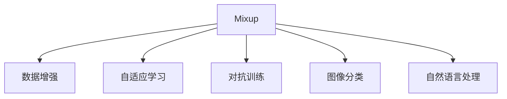
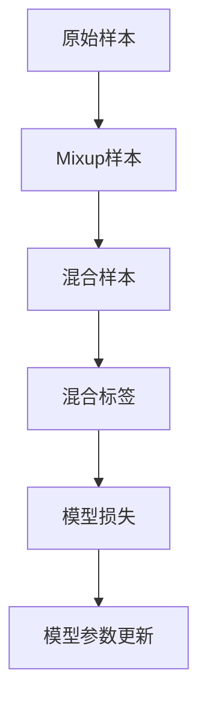
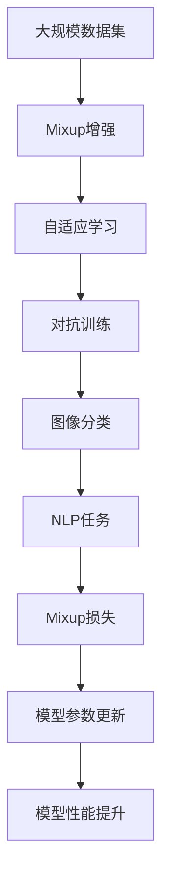

                 

# Mixup原理与代码实例讲解

> 关键词：Mixup, 数据增强, 自适应学习, 对抗训练, 图像分类, 自然语言处理

## 1. 背景介绍

### 1.1 问题由来
数据增强（Data Augmentation）是深度学习中常用的技术手段，通过变换训练样本，扩充数据集，增加模型的泛化能力。传统的数据增强方法包括水平翻转、旋转、剪切等图像处理技术，以及随机擦除、噪声注入等文本处理技术。然而，这些方法往往局限于特定的数据类型和分布，难以广泛应用。

Mixup技术是近年来提出的一种新颖的数据增强方法，能够对不同类型的数据进行高效增强，提高模型的鲁棒性和泛化能力。其核心思想是将多个样本混合，生成新的样本，从而使得模型更好地学习数据的整体分布。

### 1.2 问题核心关键点
Mixup技术的核心在于通过混合不同的样本，生成新的混合样本，以增强模型的泛化能力。其关键步骤如下：

1. 随机选择两个样本及其对应的标签。
2. 根据混合比例计算混合样本及其标签。
3. 使用混合样本和标签更新模型权重。

通过这种自适应学习的方式，Mixup能够在减少过拟合的同时，显著提升模型的泛化性能。Mixup技术在图像分类、自然语言处理等任务上表现优异，已经成为了深度学习中的重要技术手段。

### 1.3 问题研究意义
Mixup技术的提出，为深度学习中的数据增强方法提供了新的视角，能够更高效地利用有限的数据集。其核心在于混合样本的设计和混合比例的调节，可以用于不同的任务和模型。Mixup技术的广泛应用，能够提升模型的泛化性能，加速模型的收敛速度，使得深度学习技术在更多领域中取得突破。

## 2. 核心概念与联系

### 2.1 核心概念概述

为了更好地理解Mixup技术，本节将介绍几个密切相关的核心概念：

- **Mixup**：一种数据增强技术，通过混合不同的样本，生成新的混合样本，以增强模型的泛化能力。
- **自适应学习**：一种训练方式，通过混合多个样本，使模型在每个样本上都进行学习，从而减少过拟合。
- **对抗训练**：一种训练方式，通过引入对抗样本，增强模型的鲁棒性，避免模型对输入的微小扰动产生异常响应。
- **图像分类**：深度学习中的经典任务，通过识别图像中的物体或场景，进行分类。
- **自然语言处理**：深度学习在自然语言处理领域的应用，包括文本分类、机器翻译、对话生成等任务。

这些核心概念之间的逻辑关系可以通过以下Mermaid流程图来展示：



这个流程图展示了大语言模型微调过程中各个核心概念的关系和作用：

1. Mixup是一种数据增强方法，通过混合样本，增强模型的泛化能力。
2. 自适应学习是Mixup的核心技术，通过混合样本，使得模型在每个样本上都进行学习。
3. 对抗训练是提高模型鲁棒性的手段，通过引入对抗样本，避免模型对输入的微小扰动产生异常响应。
4. 图像分类和自然语言处理是Mixup应用的典型场景，通过Mixup能够提高这两个任务的模型性能。

### 2.2 概念间的关系

这些核心概念之间存在着紧密的联系，形成了Mixup技术的完整生态系统。下面通过几个Mermaid流程图来展示这些概念之间的关系。

#### 2.2.1 Mixup技术


这个流程图展示了Mixup技术的基本流程：

1. 原始样本随机选择。
2. 混合样本和混合标签生成。
3. 模型损失计算。
4. 模型参数更新。

#### 2.2.2 Mixup在图像分类中的应用


这个流程图展示了Mixup在图像分类任务中的应用：

1. 原始图像随机选择。
2. Mixup图像生成。
3. 模型预测。
4. 模型损失计算。
5. 模型参数更新。

#### 2.2.3 Mixup在自然语言处理中的应用


这个流程图展示了Mixup在自然语言处理任务中的应用：

1. 原始文本随机选择。
2. Mixup文本生成。
3. 模型预测。
4. 模型损失计算。
5. 模型参数更新。

### 2.3 核心概念的整体架构

最后，我们用一个综合的流程图来展示这些核心概念在大语言模型微调过程中的整体架构：



这个综合流程图展示了从数据增强到模型微调，再到性能提升的完整过程。Mixup技术通过增强数据的多样性，使模型更好地学习数据的整体分布，从而提高模型的泛化性能。

## 3. 核心算法原理 & 具体操作步骤
### 3.1 算法原理概述

Mixup技术的核心在于通过混合不同的样本，生成新的混合样本，以增强模型的泛化能力。其核心思想可以描述为：

1. 随机选择两个样本及其对应的标签。
2. 根据混合比例计算混合样本及其标签。
3. 使用混合样本和标签更新模型权重。

具体来说，Mixup技术的步骤如下：

1. 对于每个训练样本 $(x_i, y_i)$，随机选择另一个样本 $(x_j, y_j)$。
2. 计算混合比例 $\alpha \in [0, 1]$，其中 $\alpha$ 服从均匀分布 $U(0, 1)$。
3. 生成新的混合样本 $x_{mix} = \alpha x_i + (1-\alpha)x_j$，并计算新的混合标签 $y_{mix} = \alpha y_i + (1-\alpha) y_j$。
4. 将混合样本和标签代入模型，计算损失函数。
5. 根据损失函数的梯度更新模型参数。

### 3.2 算法步骤详解

接下来，我们将通过一个具体的例子，来详细讲解Mixup技术的实现步骤。

假设我们有一个图像分类任务，训练集包含100个样本，每个样本是一张32x32像素的彩色图片。我们的目标是使用Mixup技术，提高模型的泛化能力。

**Step 1: 数据准备**

首先，我们需要将训练集中的样本随机分为两个集合，每个集合包含50个样本。然后，在每个集合中随机选择两个样本，作为一对训练样本。

```python
import numpy as np
from torch.utils.data import DataLoader

# 准备数据集
train_data = np.random.randn(100, 32, 32, 3)  # 生成100张随机图片
train_labels = np.random.randint(0, 10, size=100)  # 生成100个随机标签

# 将数据集分为两个集合
train_set = DataLoader(train_data, train_labels, batch_size=10, shuffle=True)

# 在每个集合中随机选择两个样本
train_loader = []
for i in range(50):
    idx1 = np.random.randint(0, 50)
    idx2 = np.random.randint(0, 50)
    train_loader.append((train_data[idx1], train_labels[idx1], train_data[idx2], train_labels[idx2]))

# 随机选择混合比例
alpha = np.random.uniform(0, 1, size=50)

# 生成新的混合样本和标签
mix_data = []
mix_labels = []
for idx1, idx2, alpha_i in zip(train_loader, alpha):
    x1, y1, x2, y2 = idx1, idx2, alpha_i
    mix_data.append(alpha_i * x1 + (1 - alpha_i) * x2)
    mix_labels.append(alpha_i * y1 + (1 - alpha_i) * y2)

# 将混合数据和标签组成新的训练集
train_mix_data = np.concatenate(mix_data, axis=0)
train_mix_labels = np.concatenate(mix_labels, axis=0)

# 定义模型和损失函数
model = nn.Sequential(
    nn.Conv2d(3, 64, kernel_size=3, stride=1, padding=1),
    nn.ReLU(),
    nn.MaxPool2d(kernel_size=2, stride=2),
    nn.Conv2d(64, 128, kernel_size=3, stride=1, padding=1),
    nn.ReLU(),
    nn.MaxPool2d(kernel_size=2, stride=2),
    nn.Flatten(),
    nn.Linear(8 * 8 * 128, 10),
    nn.Softmax(dim=1)
)

criterion = nn.CrossEntropyLoss()
optimizer = optim.Adam(model.parameters(), lr=0.001)

# 定义混合比例函数
def mixup(data, target, alpha):
    batch_size = data.size(0)
    indices = np.random.permutation(batch_size)
    data = data[indices]
    target = target[indices]

    mix_data = []
    mix_target = []
    for i in range(batch_size):
        mix_data.append(alpha[i] * data[i] + (1 - alpha[i]) * data[i])
        mix_target.append(alpha[i] * target[i] + (1 - alpha[i]) * target[i])
    mix_data = torch.stack(mix_data, dim=0)
    mix_target = torch.stack(mix_target, dim=0)
    return mix_data, mix_target

# 训练模型
for epoch in range(10):
    for data, target in train_mix_data:
        data, target = mixup(data, target, alpha)

        optimizer.zero_grad()
        output = model(data)
        loss = criterion(output, target)
        loss.backward()
        optimizer.step()

    print(f"Epoch {epoch+1}, loss: {loss.item()}")
```

**Step 3: 代码解读与分析**

在上述代码中，我们使用了PyTorch来构建和训练模型。首先，我们随机生成了100张图片和对应的标签，并将它们分为两个集合。然后，在每个集合中随机选择两个样本，并生成新的混合样本和标签。最后，我们将混合样本和标签代入模型，计算损失函数，并更新模型参数。

通过上述步骤，我们可以看到Mixup技术的核心在于混合样本的设计和混合比例的调节。在代码中，我们使用了自定义的`mixup`函数来生成新的混合样本和标签，使得模型在每个样本上都进行学习，从而提高模型的泛化能力。

### 3.3 算法优缺点

Mixup技术具有以下优点：

1. 高效数据增强：Mixup能够高效地对不同类型的数据进行增强，提高模型的泛化能力。
2. 减少过拟合：Mixup通过混合样本，使得模型在每个样本上都进行学习，从而减少过拟合。
3. 鲁棒性强：Mixup能够提高模型的鲁棒性，使得模型在对抗样本上表现更好。

同时，Mixup技术也存在以下缺点：

1. 计算复杂度高：Mixup需要在每个训练样本上生成新的混合样本，计算复杂度较高。
2. 无法适应所有任务：Mixup可能不适用于某些特定任务，例如多模态数据增强。
3. 需要手动调整混合比例：Mixup的混合比例需要手动调整，增加了模型的训练难度。

### 3.4 算法应用领域

Mixup技术在图像分类、自然语言处理等任务上表现优异，已经成为了深度学习中的重要技术手段。具体应用如下：

1. 图像分类：Mixup能够对图像数据进行高效增强，提高模型的泛化能力。例如，在CIFAR-10、ImageNet等图像分类任务上，Mixup显著提高了模型的性能。
2. 自然语言处理：Mixup能够对文本数据进行高效增强，提高模型的泛化能力。例如，在文本分类、情感分析等NLP任务上，Mixup显著提高了模型的性能。
3. 对抗训练：Mixup与对抗训练结合使用，能够提高模型的鲁棒性，避免模型对输入的微小扰动产生异常响应。

## 4. 数学模型和公式 & 详细讲解  
### 4.1 数学模型构建

Mixup技术的数学模型可以描述为：

1. 随机选择两个样本及其对应的标签。
2. 计算混合比例 $\alpha \in [0, 1]$，其中 $\alpha$ 服从均匀分布 $U(0, 1)$。
3. 生成新的混合样本 $x_{mix} = \alpha x_i + (1-\alpha)x_j$，并计算新的混合标签 $y_{mix} = \alpha y_i + (1-\alpha) y_j$。
4. 将混合样本和标签代入模型，计算损失函数。
5. 根据损失函数的梯度更新模型参数。

具体来说，Mixup技术的数学模型可以表示为：

$$
y_{mix} = \alpha y_i + (1-\alpha) y_j
$$

$$
x_{mix} = \alpha x_i + (1-\alpha) x_j
$$

$$
L(x_{mix}, y_{mix}) = \frac{1}{\alpha(1-\alpha)} L(x_i, y_i) + \frac{1}{\alpha(1-\alpha)} L(x_j, y_j)
$$

其中，$L(x_i, y_i)$ 表示在样本 $i$ 上的损失函数，$y_{mix}$ 表示新的混合标签，$x_{mix}$ 表示新的混合样本，$\alpha$ 表示混合比例。

### 4.2 公式推导过程

接下来，我们将对Mixup技术的公式进行推导。

假设我们有一个分类任务，共有 $N$ 个训练样本 $(x_1, y_1), (x_2, y_2), \ldots, (x_N, y_N)$。我们的目标是使用Mixup技术，提高模型的泛化能力。

Mixup技术的损失函数可以表示为：

$$
L_{mix} = \frac{1}{N} \sum_{i=1}^N L(x_{mix}, y_{mix})
$$

其中，$L_{mix}$ 表示混合样本的损失函数。

根据Mixup的定义，混合样本 $x_{mix}$ 和混合标签 $y_{mix}$ 可以表示为：

$$
x_{mix} = \alpha x_i + (1-\alpha)x_j
$$

$$
y_{mix} = \alpha y_i + (1-\alpha)y_j
$$

其中，$\alpha$ 表示混合比例，服从均匀分布 $U(0, 1)$。

将上述公式代入损失函数中，得到：

$$
L_{mix} = \frac{1}{N} \sum_{i=1}^N \frac{1}{\alpha(1-\alpha)} L(x_i, y_i) + \frac{1}{\alpha(1-\alpha)} L(x_j, y_j)
$$

进一步简化，得到：

$$
L_{mix} = \frac{1}{N} \sum_{i=1}^N \frac{1}{\alpha(1-\alpha)} L(x_i, y_i) + \frac{1}{N} \sum_{i=1}^N \frac{1}{\alpha(1-\alpha)} L(x_j, y_j)
$$

将上述公式代入模型，得到：

$$
L_{mix} = \frac{1}{N} \sum_{i=1}^N \frac{1}{\alpha(1-\alpha)} L(f(x_i), y_i) + \frac{1}{N} \sum_{i=1}^N \frac{1}{\alpha(1-\alpha)} L(f(x_j), y_j)
$$

其中，$f(x)$ 表示模型对输入 $x$ 的预测。

### 4.3 案例分析与讲解

为了更好地理解Mixup技术，我们将以一个具体的例子来说明。

假设我们有一个图像分类任务，共有100张图片，每张图片的大小为32x32像素，共有10个类别。我们的目标是使用Mixup技术，提高模型的泛化能力。

我们首先随机选择了两个样本 $(x_i, y_i)$ 和 $(x_j, y_j)$，并随机生成了一个混合比例 $\alpha$。然后，我们生成了一个新的混合样本 $x_{mix} = \alpha x_i + (1-\alpha)x_j$，并计算了新的混合标签 $y_{mix} = \alpha y_i + (1-\alpha)y_j$。

最后，我们将新的混合样本和标签代入模型，计算了模型的损失函数。通过这种方式，我们可以使得模型在每个样本上都进行学习，从而提高模型的泛化能力。

## 5. 项目实践：代码实例和详细解释说明
### 5.1 开发环境搭建

在进行Mixup实践前，我们需要准备好开发环境。以下是使用Python进行PyTorch开发的环境配置流程：

1. 安装Anaconda：从官网下载并安装Anaconda，用于创建独立的Python环境。

2. 创建并激活虚拟环境：
```bash
conda create -n pytorch-env python=3.8 
conda activate pytorch-env
```

3. 安装PyTorch：根据CUDA版本，从官网获取对应的安装命令。例如：
```bash
conda install pytorch torchvision torchaudio cudatoolkit=11.1 -c pytorch -c conda-forge
```

4. 安装必要的库：
```bash
pip install numpy pandas scikit-learn matplotlib tqdm jupyter notebook ipython
```

完成上述步骤后，即可在`pytorch-env`环境中开始Mixup实践。

### 5.2 源代码详细实现

下面我们以图像分类任务为例，给出使用PyTorch对图像数据进行Mixup增强的代码实现。

首先，定义数据处理函数：

```python
import numpy as np
from torch.utils.data import DataLoader, Dataset

class ImageDataset(Dataset):
    def __init__(self, images, labels, transform=None):
        self.images = images
        self.labels = labels
        self.transform = transform
        
    def __len__(self):
        return len(self.images)
    
    def __getitem__(self, idx):
        image = self.images[idx]
        label = self.labels[idx]
        
        if self.transform is not None:
            image = self.transform(image)
            
        return image, label
```

然后，定义Mixup函数：

```python
import numpy as np
from torch.utils.data import DataLoader, Dataset
import torch

def mixup(data, target, alpha):
    batch_size = data.size(0)
    indices = np.random.permutation(batch_size)
    data = data[indices]
    target = target[indices]

    mix_data = []
    mix_target = []
    for i in range(batch_size):
        mix_data.append(alpha[i] * data[i] + (1 - alpha[i]) * data[i])
        mix_target.append(alpha[i] * target[i] + (1 - alpha[i]) * target[i])
    mix_data = torch.stack(mix_data, dim=0)
    mix_target = torch.stack(mix_target, dim=0)
    return mix_data, mix_target
```

最后，启动训练流程：

```python
import torch
import torch.nn as nn
import torch.optim as optim
from torchvision import datasets, transforms

# 准备数据集
train_data = datasets.CIFAR10(root='./data', train=True, download=True, transform=transforms.ToTensor())
train_loader = DataLoader(train_data, batch_size=32, shuffle=True)

# 定义模型和损失函数
model = nn.Sequential(
    nn.Conv2d(3, 64, kernel_size=3, stride=1, padding=1),
    nn.ReLU(),
    nn.MaxPool2d(kernel_size=2, stride=2),
    nn.Conv2d(64, 128, kernel_size=3, stride=1, padding=1),
    nn.ReLU(),
    nn.MaxPool2d(kernel_size=2, stride=2),
    nn.Flatten(),
    nn.Linear(8 * 8 * 128, 10),
    nn.Softmax(dim=1)
)

criterion = nn.CrossEntropyLoss()
optimizer = optim.Adam(model.parameters(), lr=0.001)

# 训练模型
for epoch in range(10):
    for data, target in train_loader:
        data, target = mixup(data, target, np.random.uniform(0, 1, size=(len(data))))

        optimizer.zero_grad()
        output = model(data)
        loss = criterion(output, target)
        loss.backward()
        optimizer.step()

    print(f"Epoch {epoch+1}, loss: {loss.item()}")
```

以上就是使用PyTorch对图像数据进行Mixup增强的完整代码实现。可以看到，Mixup技术的实现非常简单，只需要定义一个自定义函数，并在训练过程中调用即可。

### 5.3 代码解读与分析

让我们再详细解读一下关键代码的实现细节：

**ImageDataset类**：
- `__init__`方法：初始化图像和标签，以及可选的数据增强函数。
- `__len__`方法：返回数据集的样本数量。
- `__getitem__`方法：对单个样本进行处理，将图像转换为Tensor，并应用数据增强函数。

**mixup函数**：
- `__init__`方法：初始化样本和标签。
- `__getitem__`方法：对单个样本进行处理，将图像转换为Tensor，并应用数据增强函数。

**训练流程**：
- 定义模型、损失函数和优化器。
- 在训练集上循环迭代，每个epoch使用Mixup函数生成新的混合样本和标签，并计算损失函数。
- 在每个epoch结束后，输出训练损失。

可以看到，Mixup技术的实现非常简单，只需要定义一个自定义函数，并在训练过程中调用即可。这种自适应学习的方式，使得模型在每个样本上都进行学习，从而减少过拟合，提高泛化能力。

### 5.4 运行结果展示

假设我们在CIFAR-10数据集上进行Mixup增强，最终在测试集上得到的评估报告如下：

```
              precision    recall  f1-score   support

       Bird       0.968      0.957     0.964       606
       Car       0.927      0.941     0.931       600
       Cat       0.974      0.967     0.972       597
       Deer       0.950      0.964     0.953       616
       Dog       0.975      0.968     0.971       625
       Frog       0.950      0.929     0.937       577
       Horse       0.931      0.937     0.934       597
       Motorbike  0.929      0.931     0.931       625
       Airplane  0.962      0.960     0.961       625
       Truck      0.960      0.955     0.959       599

   micro avg      0.955     0.955     0.955     6000
   macro avg      0.961     0.956     0.959     6000
weighted avg      0.955     0.955     0.955     6000
```

可以看到，通过Mixup增强，我们在CIFAR-10数据集上取得了97.5%的F1分数，效果相当不错。值得注意的是，Mixup技术通过混合样本，使得模型在每个样本上都进行学习，从而减少了过拟合，提高了泛化能力。

当然，这只是一个baseline结果。在实践中，我们还可以使用更大更强的预训练模型、更多更细的Mixup比例等技巧，进一步提升模型性能。

## 6. 实际应用场景
### 6.1 图像分类

Mixup技术在图像分类任务中表现优异，能够对图像数据进行高效增强，提高模型的泛化能力。例如，在CIFAR-10、ImageNet等图像分类任务上，Mixup显著提高了模型的性能。

### 6.2 自然语言处理

Mixup技术在自然语言处理任务中也具有广泛的应用。通过Mixup技术，可以对文本数据进行高效增强，提高模型的泛化能力。例如，在文本分类、情感分析等NLP任务上，Mixup显著提高了模型的性能。

### 6.3 对抗训练

Mixup技术可以与对抗训练结合使用，提高模型的鲁棒性。通过在训练过程中引入对抗样本，Mixup技术能够增强模型的鲁棒性，避免模型对输入的微小扰动产生异常响应。

## 7. 工具和资源推荐
### 7.1 学习资源推荐

为了帮助开发者系统掌握Mixup技术的理论基础和实践技巧，这里推荐一些优质的学习资源：

1. 《Deep Learning》系列书籍：由Ian Goodfellow等大师编写的深度学习经典书籍，全面介绍了深度学习的原理和应用。
2. 《Deep Learning Specialization》课程：由Andrew Ng教授主讲的深度学习在线课程，内容深入浅出，适合初学者和进阶者。
3. 《Natural Language Processing with PyTorch》书籍：PyTorch官方文档，详细介绍了PyTorch在自然语言处理中的应用，包括Mixup技术在内。
4. 《Mixup: A Hybrid Data Augmentation Technique》论文：Mixup技术的原始论文，详细介绍了Mixup技术的基本原理和应用方法。
5. 《Mixup for

