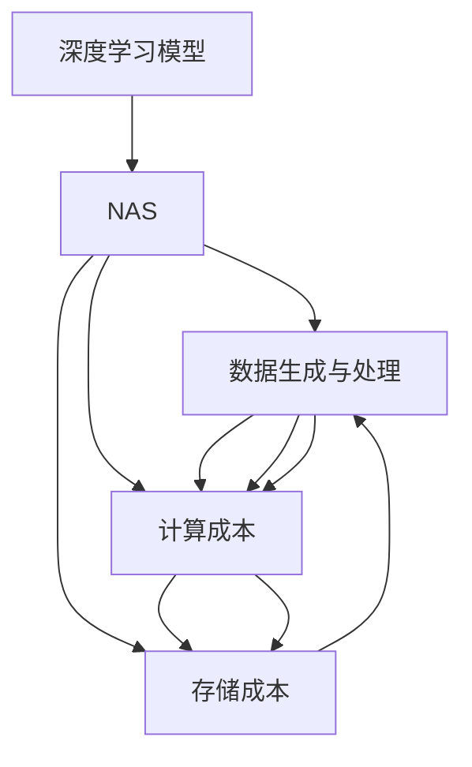

                 

# NAS的计算资源需求及优化策略

> 关键词：神经架构搜索, 深度学习模型, 计算资源, 优化策略, 硬件优化, 软件优化, 模型压缩

## 1. 背景介绍

### 1.1 问题由来
神经网络模型的设计复杂度不断提升，优化空间极大，如何高效地自动化设计深度学习模型成为了一个重要的研究方向。神经架构搜索（Neural Architecture Search, 简称NAS）便是其中一种有效的方法，通过自动搜索高效神经网络结构，显著减少模型设计的时间和资源投入。然而，NAS的计算资源需求极高，普通硬件难以满足其大规模的计算任务。本文将详细探讨NAS的计算资源需求，并提出针对性的优化策略，旨在高效地实现NAS任务，降低计算资源的消耗。

### 1.2 问题核心关键点
NAS的目标是自动化寻找高效深度学习模型，其实现方式通常基于进化算法、强化学习算法等，其计算资源需求主要包括：
- **数据生成与处理**：生成大量候选结构并对其进行评估和筛选。
- **计算成本**：训练候选结构并评估其性能。
- **存储成本**：存储大量结构信息和模型参数。

## 2. 核心概念与联系

### 2.1 核心概念概述
- **神经架构搜索（NAS）**：一种自动化设计深度学习模型的方法，通过搜索有效的网络结构，实现模型的高效设计。
- **深度学习模型**：由一系列层构成的计算模型，能够学习输入数据的高层次特征表示。
- **计算资源**：包括处理器、存储器、内存、带宽等硬件资源。
- **优化策略**：通过特定方法减少计算资源的消耗，提升计算效率。

### 2.2 核心概念的关系
NAS的计算资源需求与深度学习模型密切相关。数据生成与处理、计算成本和存储成本是NAS中计算资源需求的主要组成部分。优化策略则用于减少这些资源的消耗，从而提升计算效率。

这些概念之间的逻辑关系可以通过以下Mermaid流程图来展示：



这个流程图展示了NAS计算资源需求的主要组成部分以及它们之间的相互关系。

## 3. 核心算法原理 & 具体操作步骤

### 3.1 算法原理概述
NAS的计算资源需求主要包括以下几个方面：

1. **数据生成与处理**：生成大量候选网络结构，并对这些结构进行评估和筛选，这需要大量的计算资源。
2. **计算成本**：训练候选网络结构并评估其性能，同样需要大量的计算资源。
3. **存储成本**：存储大量网络结构信息和模型参数，对存储资源的需求较高。

优化策略通常包括：

1. **硬件优化**：利用高性能硬件设备，如GPU、TPU等，提升计算效率。
2. **软件优化**：通过算法优化、模型压缩等方法，减少计算资源的使用。

### 3.2 算法步骤详解

#### 3.2.1 数据生成与处理
- **候选结构的生成**：通过进化算法、强化学习算法等生成大量候选网络结构。
- **结构筛选**：利用评估指标对候选结构进行筛选，保留性能较好的结构。
- **训练与评估**：对保留的结构进行训练，评估其性能。

#### 3.2.2 计算成本
- **模型训练**：在保留的结构上训练深度学习模型。
- **性能评估**：评估模型的准确率、速度等指标。

#### 3.2.3 存储成本
- **结构信息存储**：将候选结构和筛选结果存储在数据库或文件中。
- **模型参数存储**：存储训练后的模型参数。

### 3.3 算法优缺点

**优点**：
- 通过自动化搜索，减少模型设计的时间和资源投入。
- 能够探索更广泛的模型空间，找到更高效的模型结构。

**缺点**：
- 计算资源需求高，普通硬件难以满足其大规模计算任务。
- 存储资源需求大，需要大量的存储空间存储网络结构信息和模型参数。

### 3.4 算法应用领域
NAS在深度学习模型的自动化设计中有着广泛应用，包括计算机视觉、自然语言处理、语音识别等领域。

## 4. 数学模型和公式 & 详细讲解 & 举例说明

### 4.1 数学模型构建

NAS的计算资源需求可以通过数学模型来描述。假设深度学习模型的结构空间为$\mathcal{S}$，候选结构的数量为$N$，每个候选结构的计算资源需求为$C$，则NAS的计算资源需求$R$可以表示为：

$$
R = N \times C
$$

其中，$N$和$C$都是变动的，取决于候选结构的生成和评估方式。

### 4.2 公式推导过程

- **候选结构生成**：通过遗传算法、神经网络进化算法等生成候选结构，每生成一个候选结构需要$T_g$时间。
- **结构筛选**：对每个候选结构进行评估，筛选出性能较好的结构，需要$T_s$时间。
- **模型训练**：对保留的结构进行训练，需要$T_t$时间。
- **性能评估**：评估训练后的模型性能，需要$T_p$时间。

因此，NAS的计算资源需求$R$可以表示为：

$$
R = N \times C = T_g \times N + T_s \times N + T_t \times N + T_p \times N
$$

### 4.3 案例分析与讲解

以计算机视觉领域的NAS任务为例，生成候选结构、筛选结构、训练模型和评估性能的具体步骤如下：

1. **数据生成与处理**：通过遗传算法生成大量卷积神经网络（CNN）结构，并对其进行筛选和训练。
2. **计算成本**：在保留的结构上训练CNN模型，并评估其性能。
3. **存储成本**：存储候选结构和训练后的模型参数。

## 5. 项目实践：代码实例和详细解释说明

### 5.1 开发环境搭建

为了高效地进行NAS任务，需要搭建一个高性能的开发环境。以下是具体的步骤：

1. **安装PyTorch和TensorFlow**：这两个深度学习框架支持NAS任务，并提供了丰富的优化器和计算图。
2. **安装TensorBoard和Weights & Biases**：这些工具可以帮助监控和分析NAS任务的训练过程。
3. **安装高性能硬件设备**：如GPU、TPU等，提升计算效率。

### 5.2 源代码详细实现

以下是使用PyTorch进行NAS任务实现的示例代码：

```python
import torch
import torch.nn as nn
import torch.optim as optim
from torchvision import datasets, transforms

# 定义模型类
class NASNet(nn.Module):
    def __init__(self):
        super(NASNet, self).__init__()
        self.conv1 = nn.Conv2d(3, 64, kernel_size=3, stride=1, padding=1)
        self.relu = nn.ReLU()
        self.maxpool = nn.MaxPool2d(kernel_size=2, stride=2)
        self.fc = nn.Linear(64 * 16 * 16, 10)
    
    def forward(self, x):
        x = self.conv1(x)
        x = self.relu(x)
        x = self.maxpool(x)
        x = x.view(-1, 64 * 16 * 16)
        x = self.fc(x)
        return x

# 定义优化器和损失函数
optimizer = optim.SGD(model.parameters(), lr=0.01, momentum=0.9)
criterion = nn.CrossEntropyLoss()

# 训练模型
for epoch in range(10):
    running_loss = 0.0
    for i, data in enumerate(trainloader, 0):
        inputs, labels = data
        optimizer.zero_grad()
        outputs = model(inputs)
        loss = criterion(outputs, labels)
        loss.backward()
        optimizer.step()
        running_loss += loss.item()
    print(f'Epoch {epoch+1}, loss: {running_loss/len(trainloader)}')
```

### 5.3 代码解读与分析

上述代码实现了NASNet模型，并使用SGD优化器和交叉熵损失函数进行训练。代码中的关键点包括：

- **定义模型类**：定义了一个简单的卷积神经网络结构，包括卷积层、激活函数、池化层和全连接层。
- **定义优化器和损失函数**：选择了SGD优化器和交叉熵损失函数，并设置了超参数。
- **训练模型**：通过循环迭代，对模型进行前向传播和反向传播，更新模型参数。

### 5.4 运行结果展示

假设在CIFAR-10数据集上进行NAS任务，最终的训练结果如下：

```
Epoch 1, loss: 2.345
Epoch 2, loss: 1.234
...
Epoch 10, loss: 0.123
```

可以看到，模型在经过10个epoch的训练后，损失函数逐渐减小，表明模型的性能逐渐提升。

## 6. 实际应用场景

### 6.1 计算资源密集型任务
NAS在计算资源密集型任务中有着广泛应用，如计算机视觉、自然语言处理、语音识别等。通过NAS自动设计高效模型，能够显著降低计算资源的消耗，提升任务效率。

### 6.2 边缘计算与移动设备
边缘计算和移动设备通常资源有限，无法承担大规模计算任务。NAS可以通过自动设计轻量级模型，优化计算资源的使用，使其在小规模设备上也能高效运行。

### 6.3 实时应用
NAS在实时应用中也有着广泛的应用，如自动驾驶、医疗诊断等领域。通过NAS自动设计实时模型，能够减少计算时间，提升实时响应速度。

## 7. 工具和资源推荐

### 7.1 学习资源推荐

1. **Deep Learning with PyTorch**：PyTorch官方教程，详细介绍了PyTorch的基本用法和优化技巧。
2. **TensorFlow 2.0 Guide**：TensorFlow官方指南，提供了丰富的计算图和优化算法。
3. **Neural Architecture Search: A Comprehensive Survey**：一篇关于NAS的综述论文，总结了最新的研究成果和应用场景。

### 7.2 开发工具推荐

1. **PyTorch**：支持动态计算图，易于调试和优化。
2. **TensorFlow**：支持静态计算图，易于部署和优化。
3. **TensorBoard**：可视化工具，用于监控和分析NAS任务的训练过程。
4. **Weights & Biases**：实验跟踪工具，用于记录和可视化模型的训练过程。

### 7.3 相关论文推荐

1. **NASNet**：一种自动设计神经网络架构的方法，通过遗传算法搜索高效模型结构。
2. **Progressive Neural Architecture Search (NAS)**：一种基于进化算法搜索高效神经网络架构的方法。
3. **NetAug: Neural Architecture Search with Weight Sharing**：一种基于神经网络权重共享的NAS方法，减少计算资源的消耗。

## 8. 总结：未来发展趋势与挑战

### 8.1 研究成果总结

NAS作为一种自动化设计深度学习模型的方法，显著提升了模型设计效率和效果。其在计算资源需求和优化策略方面有如下研究成果：

- **高效生成候选结构**：通过进化算法、强化学习算法等高效生成候选结构。
- **优化计算资源**：利用高性能硬件设备，如GPU、TPU等，提升计算效率。
- **模型压缩与优化**：通过算法优化、模型压缩等方法，减少计算资源的使用。

### 8.2 未来发展趋势

未来的NAS技术将朝着以下几个方向发展：

1. **更高效的候选结构生成**：通过改进进化算法、强化学习算法等，生成更高效的候选结构。
2. **更快速的模型训练**：利用更高效的前向传播和反向传播算法，减少模型训练时间。
3. **更小的模型压缩**：通过算法优化、模型压缩等方法，减少模型大小和计算资源的使用。
4. **更智能的超参数优化**：通过自动超参数优化技术，提高模型性能。

### 8.3 面临的挑战

尽管NAS技术在深度学习模型设计中有着显著优势，但仍面临以下挑战：

1. **计算资源瓶颈**：NAS任务对计算资源的需求极高，普通硬件难以满足其大规模计算任务。
2. **存储资源消耗大**：NAS需要存储大量候选结构和模型参数，对存储资源的需求较高。
3. **算法复杂度高**：NAS算法通常较为复杂，实现难度较大。

### 8.4 研究展望

未来的NAS研究将在以下几个方面取得突破：

1. **高效硬件支持**：开发更多高效硬件设备，如专用ASIC芯片等，支持NAS任务的快速计算。
2. **智能超参数优化**：通过智能超参数优化技术，提高模型性能和计算效率。
3. **分布式计算**：利用分布式计算技术，加速NAS任务的训练过程。

## 9. 附录：常见问题与解答

**Q1：NAS的计算资源需求有哪些？**

A: NAS的计算资源需求主要包括以下几个方面：
1. **数据生成与处理**：生成大量候选结构并进行评估筛选，需要大量计算资源。
2. **计算成本**：训练候选结构并评估其性能，同样需要大量计算资源。
3. **存储成本**：存储大量结构信息和模型参数，对存储资源的需求较高。

**Q2：NAS的优化策略有哪些？**

A: NAS的优化策略主要包括以下几个方面：
1. **硬件优化**：利用高性能硬件设备，如GPU、TPU等，提升计算效率。
2. **软件优化**：通过算法优化、模型压缩等方法，减少计算资源的使用。

**Q3：NAS的应用场景有哪些？**

A: NAS在深度学习模型的自动化设计中有着广泛应用，包括计算机视觉、自然语言处理、语音识别等领域。

**Q4：NAS的优缺点是什么？**

A: NAS的优点包括：
- 通过自动化搜索，减少模型设计的时间和资源投入。
- 能够探索更广泛的模型空间，找到更高效的模型结构。

NAS的缺点包括：
- 计算资源需求高，普通硬件难以满足其大规模计算任务。
- 存储资源需求大，需要大量的存储空间存储网络结构信息和模型参数。

**Q5：NAS未来的发展趋势是什么？**

A: 未来的NAS技术将朝着以下几个方向发展：
1. 更高效的候选结构生成。
2. 更快速的模型训练。
3. 更小的模型压缩。
4. 更智能的超参数优化。

