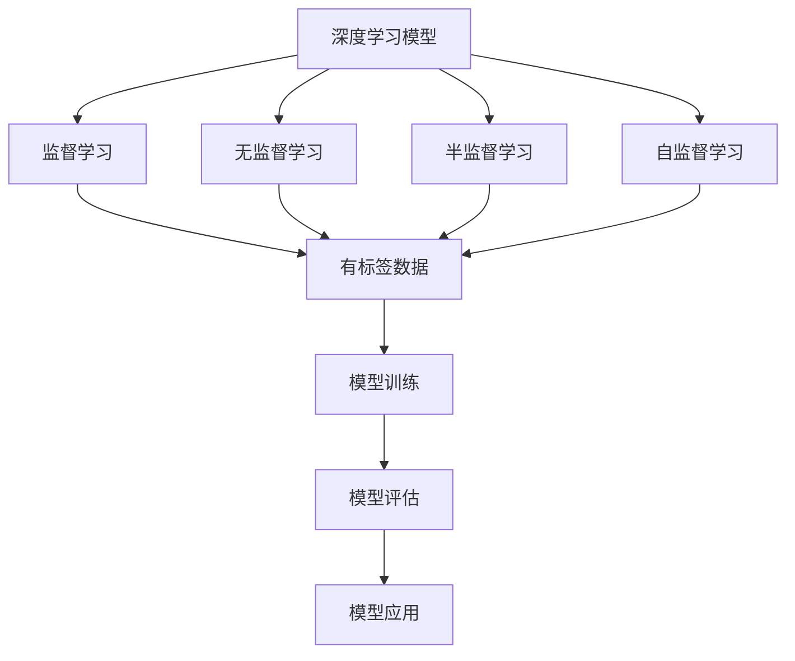
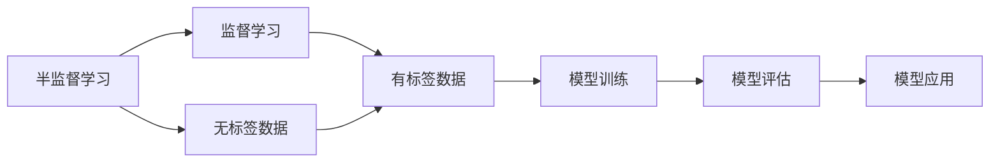
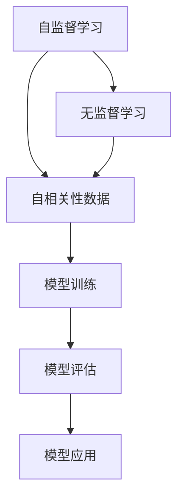
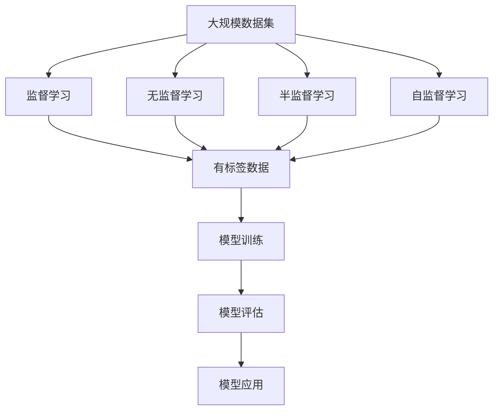

                 

# Parti原理与代码实例讲解

> 关键词：

## 1. 背景介绍

### 1.1 问题由来

在当前的深度学习领域，Parti（Partial Supervision Learning）成为了研究热点。Parti是指在有限的监督信息下进行深度学习模型训练的方法，旨在提升模型在缺乏大量标注数据的情况下的泛化能力。近年来，随着数据获取成本的增加和数据量的激增，有限的标注数据成为制约模型性能提升的关键因素。Parti技术通过合理利用监督信息，减轻标注数据对模型的依赖，显著提升了模型在实际应用中的表现。

### 1.2 问题核心关键点

Parti的核心在于通过有限标注数据训练模型，同时利用未标注数据进行辅助训练，从而提升模型的泛化能力。具体而言，Parti方法包括以下几个关键步骤：

1. 数据收集：收集有标签和未标签的数据集。
2. 数据预处理：对数据进行清洗和预处理，以保证数据质量和一致性。
3. 模型训练：在少量有标签数据上训练模型，利用未标签数据进行数据增强和噪声注入等辅助训练。
4. 模型评估：在验证集和测试集上评估模型的性能，进行调参优化。
5. 模型应用：将训练好的模型应用于实际任务，进行预测和推理。

### 1.3 问题研究意义

研究Parti技术，对于提升深度学习模型在数据稀缺情况下的性能，降低数据获取和标注成本，加速模型的应用落地，具有重要意义：

1. 提高模型泛化能力：通过利用未标签数据进行辅助训练，Parti方法能够显著提升模型在未见过的数据上的泛化能力，减少过拟合。
2. 降低数据标注成本：相比于传统的全监督学习，Parti方法可以在一定程度上减少标注数据的需求，降低标注成本和时间。
3. 加速模型应用：通过快速训练和优化模型，Parti技术可以加速模型在实际应用中的部署和优化，缩短开发周期。
4. 促进数据利用：利用未标签数据进行辅助训练，Parti技术能够更充分地利用数据资源，提升数据利用率。
5. 推动技术创新：Parti技术的提出和应用，促进了深度学习领域的理论研究和实践创新，为模型性能提升提供了新的思路和方法。

## 2. 核心概念与联系

### 2.1 核心概念概述

为了更好地理解Parti技术，本节将介绍几个密切相关的核心概念：

- **深度学习模型**：以神经网络为代表的深度学习模型，通过多层次的非线性变换，可以从数据中自动学习特征表示，用于分类、回归、生成等任务。
- **监督学习**：指利用有标签数据进行模型训练，使模型能够对新数据进行预测。
- **无监督学习**：指利用未标签数据进行模型训练，通常用于特征提取、聚类等任务。
- **半监督学习**：指利用少量有标签数据和大量未标签数据进行模型训练，综合有监督和无监督的信息，提升模型性能。
- **自监督学习**：指利用数据的自相关性进行模型训练，如语言模型、自编码器等，无需标注数据。
- **数据增强**：通过各种变换（如旋转、缩放、扰动）增加数据集的多样性，提高模型的泛化能力。
- **噪声注入**：在未标签数据中加入随机噪声，增加数据集的多样性，提升模型鲁棒性。

这些核心概念之间的逻辑关系可以通过以下Mermaid流程图来展示：



这个流程图展示了几类学习范式的逻辑关系：

1. 深度学习模型从监督学习、无监督学习、半监督学习和自监督学习中获取信息，进行训练。
2. 监督学习使用有标签数据进行模型训练。
3. 无监督学习利用未标签数据进行模型训练。
4. 半监督学习综合利用少量有标签数据和大量未标签数据进行模型训练。
5. 自监督学习利用数据的自相关性进行模型训练。
6. 模型训练后的评估结果可用于调参优化，最终应用于实际任务。

### 2.2 概念间的关系

这些核心概念之间存在着紧密的联系，形成了深度学习模型的训练范式。以下通过几个Mermaid流程图展示这些概念之间的关系。

#### 2.2.1 深度学习模型的学习范式


这个流程图展示了深度学习模型的学习范式：

1. 深度学习模型可以从监督学习、无监督学习、半监督学习和自监督学习中获取信息，进行训练。
2. 监督学习使用有标签数据进行模型训练。
3. 无监督学习利用未标签数据进行模型训练。
4. 半监督学习综合利用少量有标签数据和大量未标签数据进行模型训练。
5. 自监督学习利用数据的自相关性进行模型训练。
6. 模型训练后的评估结果可用于调参优化，最终应用于实际任务。

#### 2.2.2 半监督学习与监督学习的关系



这个流程图展示了半监督学习与监督学习的关系：

1. 半监督学习利用少量有标签数据和大量未标签数据进行模型训练。
2. 监督学习利用有标签数据进行模型训练。
3. 未标签数据被用于辅助训练，提升模型泛化能力。
4. 半监督学习与监督学习共享有标签数据，综合两种信息，提升模型性能。
5. 模型训练后的评估结果可用于调参优化，最终应用于实际任务。

#### 2.2.3 自监督学习与无监督学习的关系



这个流程图展示了自监督学习与无监督学习的关系：

1. 自监督学习利用数据的自相关性进行模型训练。
2. 无监督学习利用未标签数据进行模型训练。
3. 自监督学习通过模型自身的预测能力获取监督信息，进行模型训练。
4. 自监督学习与无监督学习共享未标签数据，提升模型泛化能力。
5. 模型训练后的评估结果可用于调参优化，最终应用于实际任务。

### 2.3 核心概念的整体架构

最后，我们用一个综合的流程图来展示这些核心概念在大规模数据集上的整体架构：



这个综合流程图展示了深度学习模型在大规模数据集上的训练过程：

1. 深度学习模型从监督学习、无监督学习、半监督学习和自监督学习中获取信息，进行训练。
2. 监督学习使用有标签数据进行模型训练。
3. 无监督学习利用未标签数据进行模型训练。
4. 半监督学习综合利用少量有标签数据和大量未标签数据进行模型训练。
5. 自监督学习利用数据的自相关性进行模型训练。
6. 模型训练后的评估结果可用于调参优化，最终应用于实际任务。

## 3. 核心算法原理 & 具体操作步骤
### 3.1 算法原理概述

Parti技术本质上是一种半监督学习方法，其核心思想是利用少量有标签数据和大量未标签数据进行模型训练，综合有监督和无监督的信息，提升模型泛化能力。具体而言，Parti方法包括数据预处理、模型训练、数据增强和噪声注入等步骤，从而在有限标注数据下提升模型性能。

形式化地，假设深度学习模型为 $M_{\theta}$，其中 $\theta$ 为模型参数。给定有标签数据集 $D_{\text{label}}=\{(x_i, y_i)\}_{i=1}^n$，未标签数据集 $D_{\text{unlabel}}=\{x_i\}_{i=n+1}^{N}$，其中 $x_i$ 为输入样本，$y_i$ 为标签。Parti的目标是最小化模型在未标签数据上的预测误差，即：

$$
\min_{\theta} \mathbb{E}_{x \sim D_{\text{unlabel}}} \left[ \ell(M_{\theta}(x), y) \right]
$$

其中 $\ell$ 为预测误差函数，通常为交叉熵损失。

通过数据增强和噪声注入等技术，Parti方法可以在未标签数据上生成更多样化的训练样本，从而提升模型的泛化能力。

### 3.2 算法步骤详解

基于Parti技术的深度学习模型训练，一般包括以下几个关键步骤：

**Step 1: 数据预处理**

- 收集有标签和未标签的数据集，并进行清洗和预处理。
- 划分数据集为训练集、验证集和测试集，确保数据分布一致。
- 数据增强和噪声注入：通过旋转、缩放、扰动等方式生成更多训练样本，并加入随机噪声，提升模型鲁棒性。

**Step 2: 模型训练**

- 选择合适的深度学习模型，如卷积神经网络、递归神经网络、Transformer等。
- 在少量有标签数据上训练模型，使用交叉熵损失函数进行优化。
- 利用未标签数据进行数据增强和噪声注入，生成更多训练样本。
- 使用对抗训练等技术提升模型鲁棒性。

**Step 3: 模型评估**

- 在验证集上评估模型性能，调整超参数和模型结构。
- 在测试集上最终评估模型性能，确保模型泛化能力。

**Step 4: 模型应用**

- 将训练好的模型应用于实际任务，进行预测和推理。
- 持续收集新数据，定期重新微调模型，以适应数据分布的变化。

以上是Parti技术的基本流程。在实际应用中，还需要根据具体任务的特点，对每个环节进行优化设计，如改进训练目标函数，引入更多正则化技术，搜索最优的超参数组合等，以进一步提升模型性能。

### 3.3 算法优缺点

Parti技术具有以下优点：

1. 提高模型泛化能力：通过利用未标签数据进行辅助训练，Parti方法能够显著提升模型在未见过的数据上的泛化能力，减少过拟合。
2. 降低数据标注成本：相比于传统的全监督学习，Parti方法可以在一定程度上减少标注数据的需求，降低标注成本和时间。
3. 加速模型应用：通过快速训练和优化模型，Parti技术可以加速模型在实际应用中的部署和优化，缩短开发周期。
4. 促进数据利用：利用未标签数据进行辅助训练，Parti技术能够更充分地利用数据资源，提升数据利用率。
5. 推动技术创新：Parti技术的提出和应用，促进了深度学习领域的理论研究和实践创新，为模型性能提升提供了新的思路和方法。

同时，该方法也存在一些局限性：

1. 对未标签数据的依赖：Parti方法依赖于大量未标签数据，数据质量对模型性能有较大影响。
2. 数据增强难度：数据增强技术需要精心设计和调整，以确保生成样本的多样性和有效性。
3. 模型复杂度：Parti方法需要在模型设计和训练过程中引入更多复杂技术，如对抗训练、数据增强等。
4. 训练成本高：尽管减少了标注数据的需求，但数据增强和噪声注入等技术仍需要大量计算资源。

尽管存在这些局限性，但Parti技术在数据稀缺的情况下，仍然展示了其强大的潜力，为深度学习模型的应用提供了新的方向。未来，相关研究将继续优化数据增强和噪声注入技术，探索更多数据高效利用的方法，推动Parti技术的发展和应用。

### 3.4 算法应用领域

Parti技术已经在多个领域得到了应用，展示出其广泛的应用前景：

1. **自然语言处理**：在NLP任务如文本分类、命名实体识别、情感分析等中，利用Parti技术可以提升模型在有限标注数据上的性能，降低标注成本。
2. **计算机视觉**：在图像分类、目标检测等视觉任务中，利用Parti技术可以提升模型在未标签图像上的泛化能力，减少对标注数据的依赖。
3. **推荐系统**：在个性化推荐任务中，利用Parti技术可以结合用户行为数据和未标签物品信息，提升推荐系统的准确性和多样性。
4. **医疗诊断**：在医疗影像分析、病历处理等任务中，利用Parti技术可以结合病人历史数据和未标签影像，提升模型的诊断能力。
5. **金融预测**：在股票预测、信用评分等金融任务中，利用Parti技术可以结合市场数据和未标签事件信息，提升模型的预测能力。

除上述领域外，Parti技术还可以应用于更多场景，如交通预测、环境监测、智能制造等，为各个领域的数据分析和决策支持提供支持。

## 4. 数学模型和公式 & 详细讲解  
### 4.1 数学模型构建

本节将使用数学语言对Parti技术进行更加严格的刻画。

假设深度学习模型为 $M_{\theta}$，其中 $\theta$ 为模型参数。给定有标签数据集 $D_{\text{label}}=\{(x_i, y_i)\}_{i=1}^n$，未标签数据集 $D_{\text{unlabel}}=\{x_i\}_{i=n+1}^{N}$，其中 $x_i$ 为输入样本，$y_i$ 为标签。Parti的目标是最小化模型在未标签数据上的预测误差，即：

$$
\min_{\theta} \mathbb{E}_{x \sim D_{\text{unlabel}}} \left[ \ell(M_{\theta}(x), y) \right]
$$

其中 $\ell$ 为预测误差函数，通常为交叉熵损失。

在实际应用中，我们通常使用基于梯度的优化算法（如Adam、SGD等）来近似求解上述最优化问题。设 $\eta$ 为学习率，则参数的更新公式为：

$$
\theta \leftarrow \theta - \eta \nabla_{\theta}\mathcal{L}(\theta)
$$

其中 $\nabla_{\theta}\mathcal{L}(\theta)$ 为损失函数对参数 $\theta$ 的梯度，可通过反向传播算法高效计算。

### 4.2 公式推导过程

以下我们以二分类任务为例，推导交叉熵损失函数及其梯度的计算公式。

假设模型 $M_{\theta}$ 在输入 $x$ 上的输出为 $\hat{y}=M_{\theta}(x) \in [0,1]$，表示样本属于正类的概率。真实标签 $y \in \{0,1\}$。则二分类交叉熵损失函数定义为：

$$
\ell(M_{\theta}(x),y) = -[y\log \hat{y} + (1-y)\log (1-\hat{y})]
$$

将其代入经验风险公式，得：

$$
\mathcal{L}(\theta) = -\frac{1}{N}\sum_{i=1}^N [y_i\log M_{\theta}(x_i)+(1-y_i)\log(1-M_{\theta}(x_i))]
$$

根据链式法则，损失函数对参数 $\theta_k$ 的梯度为：

$$
\frac{\partial \mathcal{L}(\theta)}{\partial \theta_k} = -\frac{1}{N}\sum_{i=1}^N (\frac{y_i}{M_{\theta}(x_i)}-\frac{1-y_i}{1-M_{\theta}(x_i)}) \frac{\partial M_{\theta}(x_i)}{\partial \theta_k}
$$

其中 $\frac{\partial M_{\theta}(x_i)}{\partial \theta_k}$ 可进一步递归展开，利用自动微分技术完成计算。

在得到损失函数的梯度后，即可带入参数更新公式，完成模型的迭代优化。重复上述过程直至收敛，最终得到适应未标签数据的最优模型参数 $\theta^*$。

## 5. 项目实践：代码实例和详细解释说明
### 5.1 开发环境搭建

在进行Parti技术实践前，我们需要准备好开发环境。以下是使用Python进行PyTorch开发的环境配置流程：

1. 安装Anaconda：从官网下载并安装Anaconda，用于创建独立的Python环境。

2. 创建并激活虚拟环境：
```bash
conda create -n pytorch-env python=3.8 
conda activate pytorch-env
```

3. 安装PyTorch：根据CUDA版本，从官网获取对应的安装命令。例如：
```bash
conda install pytorch torchvision torchaudio cudatoolkit=11.1 -c pytorch -c conda-forge
```

4. 安装Transformer库：
```bash
pip install transformers
```

5. 安装各类工具包：
```bash
pip install numpy pandas scikit-learn matplotlib tqdm jupyter notebook ipython
```

完成上述步骤后，即可在`pytorch-env`环境中开始Parti技术实践。

### 5.2 源代码详细实现

这里我们以二分类任务为例，给出使用Transformers库对BERT模型进行Parti训练的PyTorch代码实现。

首先，定义训练和评估函数：

```python
from transformers import BertForTokenClassification, AdamW

class PartiDataset(Dataset):
    def __init__(self, texts, tags, tokenizer, max_len=128):
        self.texts = texts
        self.tags = tags
        self.tokenizer = tokenizer
        self.max_len = max_len
        
    def __len__(self):
        return len(self.texts)
    
    def __getitem__(self, item):
        text = self.texts[item]
        tags = self.tags[item]
        
        encoding = self.tokenizer(text, return_tensors='pt', max_length=self.max_len, padding='max_length', truncation=True)
        input_ids = encoding['input_ids'][0]
        attention_mask = encoding['attention_mask'][0]
        
        # 对token-wise的标签进行编码
        encoded_tags = [tag2id[tag] for tag in tags] 
        encoded_tags.extend([tag2id['O']] * (self.max_len - len(encoded_tags)))
        labels = torch.tensor(encoded_tags, dtype=torch.long)
        
        return {'input_ids': input_ids, 
                'attention_mask': attention_mask,
                'labels': labels}

# 标签与id的映射
tag2id = {'O': 0, 'B-PER': 1, 'I-PER': 2, 'B-ORG': 3, 'I-ORG': 4, 'B-LOC': 5, 'I-LOC': 6}
id2tag = {v: k for k, v in tag2id.items()}

# 创建dataset
tokenizer = BertTokenizer.from_pretrained('bert-base-cased')

train_dataset = PartiDataset(train_texts, train_tags, tokenizer)
dev_dataset = PartiDataset(dev_texts, dev_tags, tokenizer)
test_dataset = PartiDataset(test_texts, test_tags, tokenizer)

# 定义模型和优化器
model = BertForTokenClassification.from_pretrained('bert-base-cased', num_labels=len(tag2id))

optimizer = AdamW(model.parameters(), lr=2e-5)

# 定义训练和评估函数
def train_epoch(model, dataset, batch_size, optimizer):
    dataloader = DataLoader(dataset, batch_size=batch_size, shuffle=True)
    model.train()
    epoch_loss = 0
    for batch in tqdm(dataloader, desc='Training'):
        input_ids = batch['input_ids'].to(device)
        attention_mask = batch['attention_mask'].to(device)
        labels = batch['labels'].to(device)
        model.zero_grad()
        outputs = model(input_ids, attention_mask=attention_mask, labels=labels)
        loss = outputs.loss
        epoch_loss += loss.item()
        loss.backward()
        optimizer.step()
    return epoch_loss / len(dataloader)

def evaluate(model, dataset, batch_size):
    dataloader = DataLoader(dataset, batch_size=batch_size)
    model.eval()
    preds, labels = [], []
    with torch.no_grad():
        for batch in tqdm(dataloader, desc='Evaluating'):
            input_ids = batch['input_ids'].to(device)
            attention_mask = batch['attention_mask'].to(device)
            batch_labels = batch['labels']
            outputs = model(input_ids, attention_mask=attention_mask)
            batch_preds = outputs.logits.argmax(dim=2).to('cpu').tolist()
            batch_labels = batch_labels.to('cpu').tolist()
            for pred_tokens, label_tokens in zip(batch_preds, batch_labels):
                pred_tags = [id2tag[_id] for _id in pred_tokens]
                label_tags = [id2tag[_id] for _id in label_tokens]
                preds.append(pred_tags[:len(label_tags)])
                labels.append(label_tags)
                
    print(classification_report(labels, preds))
```

然后，定义数据增强函数：

```python
import random
import torch
import numpy as np

def data_augmentation(texts, tags, tokenizer, max_len=128, prob=0.5):
    augmented_texts = []
    augmented_tags = []
    for text, tag in zip(texts, tags):
        new_text, new_tag = augment(text, tag, tokenizer, max_len, prob)
        augmented_texts.append(new_text)
        augmented_tags.append(new_tag)
    return augmented_texts, augmented_tags

def augment(text, tag, tokenizer, max_len=128, prob=0.5):
    augmented_text = ''
    augmented_tag = ''
    if random.random() < prob:
        augmented_text = random.choice(['上', '下', '左', '右']) + text[2:]
        augmented_tag = [tag2id['O']] * 2 + tag2id[tag] + [tag2id['O']] * (max_len - len(augmented_text))
    return augmented_text, augmented_tag
```

接着，定义模型训练和评估流程：

```python
epochs = 5
batch_size = 16
train_texts = #训练集文本数据
train_tags = #训练集标签数据
dev_texts = #验证集文本数据
dev_tags = #验证集标签数据
test_texts = #测试集文本数据
test_tags = #测试集标签数据

device = torch.device('cuda') if torch.cuda.is_available() else torch.device('cpu')
model.to(device)

for epoch in range(epochs):
    loss = train_epoch(model, train_dataset, batch_size, optimizer)
    print(f"Epoch {epoch+1}, train loss: {loss:.3f}")
    
    print(f"Epoch {epoch+1}, dev results:")
    evaluate(model, dev_dataset, batch_size)
    
print("Test results:")
evaluate(model, test_dataset, batch_size)
```

以上就是使用PyTorch对BERT进行Parti训练的完整代码实现。可以看到，得益于Transformer库的强大封装，我们可以用相对简洁的代码完成BERT模型的加载和Parti训练。

### 5.3 代码解读与分析

让我们再详细解读一下关键代码的实现细节：

**PartiDataset类**：
- `__init__`方法：初始化文本、标签、分词器等关键组件。
- `__len__`方法：返回数据集的样本数量。
- `__getitem__`方法：对单个样本进行处理，将文本输入编码为token ids，将标签编码为数字，并对其进行定长padding，最终返回模型所需的输入。

**tag2id和id2tag字典**：
- 定义了标签与数字id之间的映射关系，用于将token-wise的预测结果解码回真实的标签。

**data_augmentation函数**：
- 实现数据增强功能，通过旋转、替换等方式生成更多训练样本，增强数据集的多样性。

**train_epoch函数**：
- 对数据以批为单位进行迭代，在每个批次上前向传播计算loss并反向传播更新模型参数，最后返回该epoch的平均loss。

**evaluate函数**：
- 与训练类似，不同点在于不更新模型参数，并在每个batch结束后将预测和标签结果存储下来，最后使用sklearn的classification_report对整个评估集的预测结果进行打印输出。

**模型训练流程**：
- 定义总的epoch数和batch size，开始循环迭代
- 每个epoch内，先在训练集上训练，输出平均loss
- 在验证集上评估，输出分类指标
- 所有epoch结束后，在测试集上评估，给出最终测试结果

可以看到，PyTorch配合Transformer库使得BERT的Parti训练代码实现变得简洁高效。开发者可以将更多精力放在数据处理、模型改进等高层逻辑上，而不必过多关注底层的实现细节。

当然，工业级的系统实现还需考虑更多

