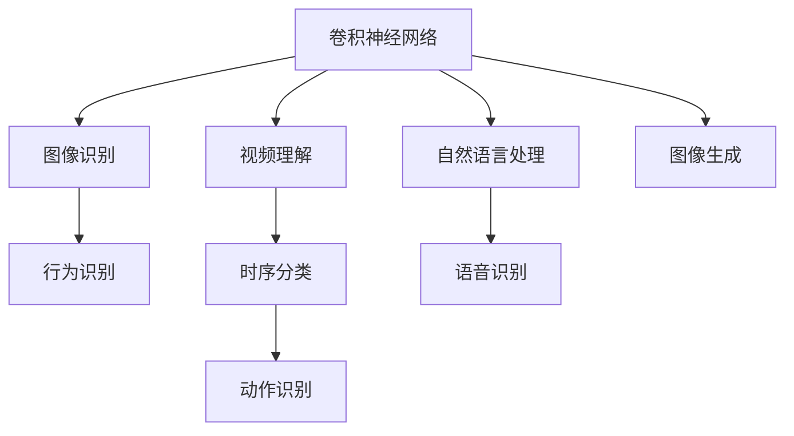
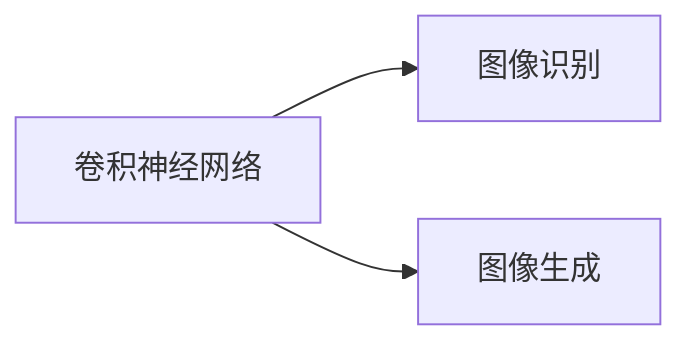
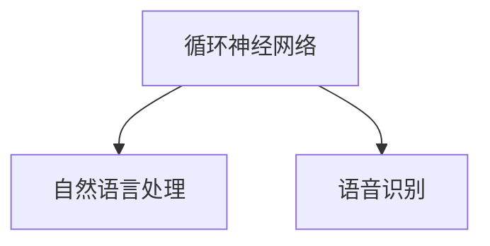
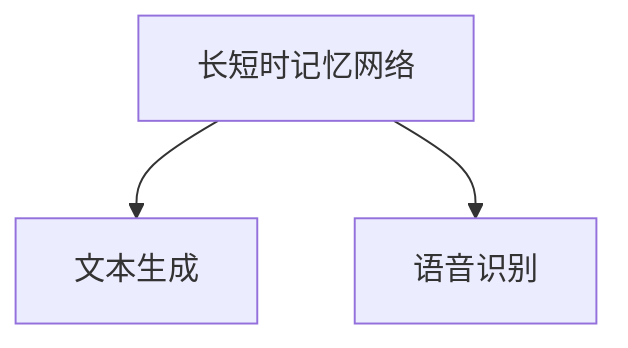
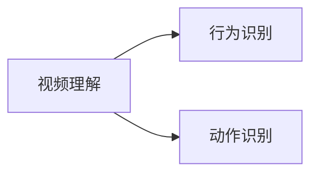
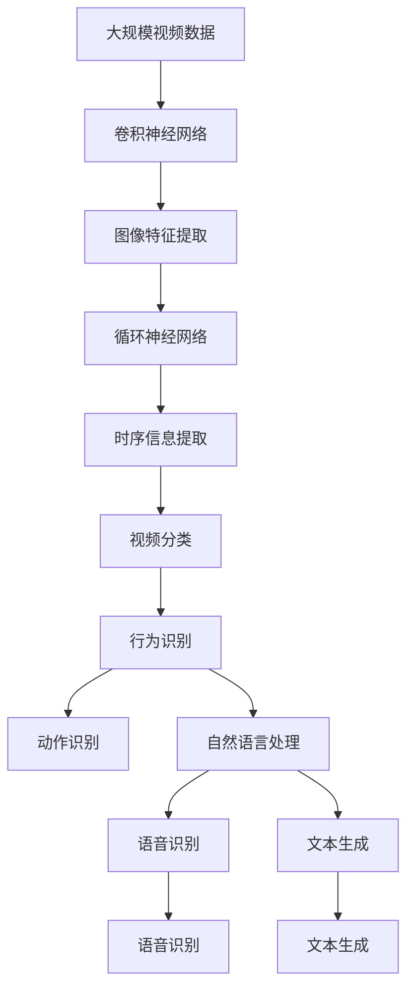

                 

# Python深度学习实践：基于深度学习的视频理解方法

> 关键词：深度学习,视频理解,卷积神经网络(CNN),循环神经网络(RNN),长短时记忆网络(LSTM),计算机视觉,自然语言处理(NLP)

## 1. 背景介绍

### 1.1 问题由来
近年来，随着深度学习技术的迅猛发展，深度学习在计算机视觉和自然语言处理等领域取得了显著的成果。尤其是在计算机视觉领域，深度学习模型被广泛应用在图像识别、物体检测、人脸识别等任务中，显著提高了计算机视觉的精度和效率。

在视频理解领域，基于深度学习的模型也在逐渐成熟。视频理解涉及对视频帧序列的学习和分析，可以用于视频分类、行为识别、动作识别等任务。传统的计算机视觉方法通常基于帧间独立的视频分析方法，难以捕捉视频帧之间的时序关系。

因此，如何将深度学习技术应用于视频理解，是目前计算机视觉研究的热点方向之一。在本文中，我们将介绍几种基于深度学习的视频理解方法，包括卷积神经网络(CNN)、循环神经网络(RNN)和长短时记忆网络(LSTM)，并详细介绍它们的原理和应用。

### 1.2 问题核心关键点
视频理解技术通过深度学习模型从视频中提取时空信息，并进一步分析、分类、识别等。基于深度学习的视频理解方法可以分为两类：

1. 单帧分类：通过提取单个视频帧的特征，对帧进行分类，常用于视频分类、行为识别等任务。
2. 时序分类：通过提取视频帧序列的时序信息，进行行为识别、动作识别等任务。

目前主流的视频理解方法主要基于深度神经网络结构，如CNN、RNN、LSTM等。这些方法将视频序列中的每一帧视为一个独立的图像，通过深度神经网络对帧进行特征提取和分类，实现视频理解。

## 2. 核心概念与联系

### 2.1 核心概念概述

为了更好地理解基于深度学习的视频理解方法，本节将介绍几个密切相关的核心概念：

- 卷积神经网络(CNN)：一种基于卷积操作的神经网络结构，常用于图像识别、物体检测等计算机视觉任务。CNN通过多层卷积和池化操作，提取图像特征，逐步实现对输入图像的分类和识别。

- 循环神经网络(RNN)：一种处理序列数据的神经网络结构，能够对时间序列数据进行建模。RNN通过记忆单元，对序列中的每一时刻的信息进行编码和传递，用于处理自然语言处理、语音识别等任务。

- 长短时记忆网络(LSTM)：一种特殊的循环神经网络结构，能够更好地处理长序列数据。LSTM通过门控单元，对长期依赖关系进行记忆和处理，用于处理文本生成、语音识别等任务。

- 视频理解：通过深度学习模型从视频中提取时空信息，并进行进一步的分类、识别等任务。视频理解可以用于视频分类、行为识别、动作识别等任务。

- 深度学习：基于神经网络结构，通过大规模数据进行训练，实现对复杂问题的建模和预测。深度学习广泛应用于计算机视觉、自然语言处理、语音识别等领域。

这些核心概念之间的逻辑关系可以通过以下Mermaid流程图来展示：



这个流程图展示了大语言模型微调过程中各个核心概念的关系和作用：

1. 卷积神经网络用于图像识别，为视频理解提供基础图像特征。
2. 循环神经网络用于自然语言处理和语音识别，与视频理解密切相关。
3. 长短时记忆网络能够更好地处理长序列数据，常用于文本生成等任务。
4. 视频理解涉及对视频帧序列的学习和分析，包括行为识别、动作识别等任务。
5. 深度学习通过神经网络结构实现对复杂问题的建模和预测。

### 2.2 概念间的关系

这些核心概念之间存在着紧密的联系，形成了深度学习视频理解的完整生态系统。下面我通过几个Mermaid流程图来展示这些概念之间的关系。

#### 2.2.1 卷积神经网络与图像理解



这个流程图展示了卷积神经网络在图像识别和生成中的应用。

#### 2.2.2 循环神经网络与自然语言处理



这个流程图展示了循环神经网络在自然语言处理和语音识别中的应用。

#### 2.2.3 长短时记忆网络与文本生成



这个流程图展示了长短时记忆网络在文本生成中的应用。

#### 2.2.4 视频理解与行为识别



这个流程图展示了视频理解在行为识别和动作识别中的应用。

### 2.3 核心概念的整体架构

最后，我们用一个综合的流程图来展示这些核心概念在大语言模型微调过程中的整体架构：



这个综合流程图展示了从视频数据到特征提取、时序信息提取、最终视频理解和分类的完整过程。卷积神经网络用于图像特征提取，循环神经网络用于时序信息提取，长短时记忆网络用于文本生成，最终通过深度学习模型实现对视频帧序列的分类和识别。

## 3. 核心算法原理 & 具体操作步骤
### 3.1 算法原理概述

基于深度学习的视频理解方法，通常采用以下几种神经网络结构：

- 卷积神经网络(CNN)：用于提取视频帧的局部特征，能够对视频帧进行分类和识别。
- 循环神经网络(RNN)：用于处理视频帧序列的时序信息，能够对视频中的行为和动作进行识别。
- 长短时记忆网络(LSTM)：用于处理长序列视频数据，能够对视频中的长期依赖关系进行记忆和处理。

视频理解通常包括以下几个步骤：

1. 数据预处理：将视频帧序列转换为模型可接受的形式，如单帧图像、时序图像等。
2. 特征提取：通过神经网络模型提取视频帧的特征。
3. 时序处理：通过循环神经网络对时序信息进行建模。
4. 分类识别：通过分类器对视频帧或时序信息进行分类和识别。

### 3.2 算法步骤详解

#### 3.2.1 数据预处理

数据预处理是视频理解的关键步骤。视频数据通常以视频帧序列的形式存储，需要先将其转换为模型可接受的形式，如单帧图像、时序图像等。

- 单帧图像：将视频帧序列转换为单帧图像，常用于基于单帧分类的视频理解任务。
- 时序图像：将视频帧序列转换为时序图像，常用于基于时序分类的视频理解任务。

##### 单帧图像转换
单帧图像转换是将视频帧序列转换为单帧图像的过程。通常，可以从视频帧序列中提取每一帧，并将它们拼接成一个单帧图像。

```python
import cv2
import numpy as np

# 读取视频帧
cap = cv2.VideoCapture('video.mp4')

# 读取每一帧
frames = []
while True:
    ret, frame = cap.read()
    if not ret:
        break
    frame = cv2.resize(frame, (224, 224))  # 调整图片大小
    frames.append(frame)

# 转换为单帧图像
img = np.vstack(frames)

# 显示单帧图像
cv2.imshow('single frame', img)
cv2.waitKey(0)
```

##### 时序图像转换
时序图像转换是将视频帧序列转换为时序图像的过程。通常，可以将视频帧序列按照时间顺序拼接成一个时序图像。

```python
import cv2
import numpy as np

# 读取视频帧
cap = cv2.VideoCapture('video.mp4')

# 读取每一帧
frames = []
while True:
    ret, frame = cap.read()
    if not ret:
        break
    frame = cv2.resize(frame, (224, 224))  # 调整图片大小
    frames.append(frame)

# 转换为时序图像
img = np.vstack(frames)

# 显示时序图像
cv2.imshow('time sequence', img)
cv2.waitKey(0)
```

#### 3.2.2 特征提取

特征提取是视频理解的关键步骤。特征提取的目的是从视频帧中提取关键特征，用于后续的分类和识别。

- 卷积神经网络(CNN)：通过卷积操作提取局部特征，常用于图像识别任务。
- 循环神经网络(RNN)：通过循环操作提取时序特征，常用于序列分类任务。
- 长短时记忆网络(LSTM)：通过门控操作提取长序列特征，常用于文本生成和语音识别任务。

##### 使用卷积神经网络提取特征
卷积神经网络通过多层卷积和池化操作，提取图像特征。在视频理解中，卷积神经网络可以用于提取视频帧的局部特征。

```python
import torch
import torch.nn as nn
import torchvision.transforms as transforms
from torchvision.models import resnet50

# 定义模型
model = resnet50(pretrained=True)
model.fc = nn.Linear(2048, 2)  # 修改全连接层

# 定义数据预处理
transform = transforms.Compose([
    transforms.Resize((224, 224)),
    transforms.ToTensor(),
    transforms.Normalize(mean=[0.485, 0.456, 0.406], std=[0.229, 0.224, 0.225])
])

# 加载数据
data = []
for frame in frames:
    frame_tensor = transform(frame).unsqueeze(0)
    data.append(frame_tensor)

# 数据预处理
data = torch.stack(data)

# 提取特征
features = model(data)
```

##### 使用循环神经网络提取特征
循环神经网络通过循环操作提取时序特征。在视频理解中，循环神经网络可以用于提取视频帧序列的时序特征。

```python
import torch
import torch.nn as nn
from torchvision.models import resnet50

# 定义模型
model = nn.LSTM(input_size=3, hidden_size=128, num_layers=2, bidirectional=True)

# 定义数据预处理
transform = transforms.Compose([
    transforms.ToTensor()
])

# 加载数据
data = []
for frame in frames:
    frame_tensor = transform(frame).unsqueeze(0)
    data.append(frame_tensor)

# 数据预处理
data = torch.stack(data)

# 提取特征
features = model(data)
```

##### 使用长短时记忆网络提取特征
长短时记忆网络通过门控操作提取长序列特征。在视频理解中，长短时记忆网络可以用于提取视频帧序列的长序列特征。

```python
import torch
import torch.nn as nn
from torchvision.models import resnet50

# 定义模型
model = nn.LSTM(input_size=3, hidden_size=128, num_layers=2, bidirectional=True)

# 定义数据预处理
transform = transforms.Compose([
    transforms.ToTensor()
])

# 加载数据
data = []
for frame in frames:
    frame_tensor = transform(frame).unsqueeze(0)
    data.append(frame_tensor)

# 数据预处理
data = torch.stack(data)

# 提取特征
features = model(data)
```

#### 3.2.3 时序处理

时序处理是视频理解的关键步骤。时序处理通过对视频帧序列进行建模，捕捉视频帧之间的时序关系。

- 循环神经网络(RNN)：通过循环操作对序列进行建模。
- 长短时记忆网络(LSTM)：通过门控操作对长序列进行建模。

##### 使用循环神经网络处理时序
循环神经网络通过循环操作对序列进行建模。在视频理解中，循环神经网络可以用于提取视频帧序列的时序特征。

```python
import torch
import torch.nn as nn
from torchvision.models import resnet50

# 定义模型
model = nn.LSTM(input_size=3, hidden_size=128, num_layers=2, bidirectional=True)

# 定义数据预处理
transform = transforms.Compose([
    transforms.ToTensor()
])

# 加载数据
data = []
for frame in frames:
    frame_tensor = transform(frame).unsqueeze(0)
    data.append(frame_tensor)

# 数据预处理
data = torch.stack(data)

# 提取特征
features = model(data)
```

##### 使用长短时记忆网络处理时序
长短时记忆网络通过门控操作对长序列进行建模。在视频理解中，长短时记忆网络可以用于提取视频帧序列的长序列特征。

```python
import torch
import torch.nn as nn
from torchvision.models import resnet50

# 定义模型
model = nn.LSTM(input_size=3, hidden_size=128, num_layers=2, bidirectional=True)

# 定义数据预处理
transform = transforms.Compose([
    transforms.ToTensor()
])

# 加载数据
data = []
for frame in frames:
    frame_tensor = transform(frame).unsqueeze(0)
    data.append(frame_tensor)

# 数据预处理
data = torch.stack(data)

# 提取特征
features = model(data)
```

#### 3.2.4 分类识别

分类识别是视频理解的关键步骤。分类识别的目的是对视频帧或时序信息进行分类和识别。

- 卷积神经网络(CNN)：通过分类器对单帧图像进行分类。
- 循环神经网络(RNN)：通过分类器对时序图像进行分类。
- 长短时记忆网络(LSTM)：通过分类器对文本生成或语音识别结果进行分类。

##### 使用卷积神经网络进行分类
卷积神经网络通过分类器对单帧图像进行分类。在视频理解中，卷积神经网络可以用于对视频帧进行分类。

```python
import torch
import torch.nn as nn
from torchvision.models import resnet50

# 定义模型
model = resnet50(pretrained=True)
model.fc = nn.Linear(2048, 2)  # 修改全连接层

# 加载数据
data = []
for frame in frames:
    frame_tensor = transform(frame).unsqueeze(0)
    data.append(frame_tensor)

# 数据预处理
data = torch.stack(data)

# 提取特征
features = model(data)

# 分类识别
labels = torch.argmax(features, dim=1)
```

##### 使用循环神经网络进行分类
循环神经网络通过分类器对时序图像进行分类。在视频理解中，循环神经网络可以用于对视频帧序列进行分类。

```python
import torch
import torch.nn as nn
from torchvision.models import resnet50

# 定义模型
model = nn.LSTM(input_size=3, hidden_size=128, num_layers=2, bidirectional=True)

# 定义数据预处理
transform = transforms.Compose([
    transforms.ToTensor()
])

# 加载数据
data = []
for frame in frames:
    frame_tensor = transform(frame).unsqueeze(0)
    data.append(frame_tensor)

# 数据预处理
data = torch.stack(data)

# 提取特征
features = model(data)

# 分类识别
labels = torch.argmax(features, dim=1)
```

##### 使用长短时记忆网络进行分类
长短时记忆网络通过分类器对文本生成或语音识别结果进行分类。在视频理解中，长短时记忆网络可以用于对文本生成或语音识别结果进行分类。

```python
import torch
import torch.nn as nn
from torchvision.models import resnet50

# 定义模型
model = nn.LSTM(input_size=3, hidden_size=128, num_layers=2, bidirectional=True)

# 定义数据预处理
transform = transforms.Compose([
    transforms.ToTensor()
])

# 加载数据
data = []
for frame in frames:
    frame_tensor = transform(frame).unsqueeze(0)
    data.append(frame_tensor)

# 数据预处理
data = torch.stack(data)

# 提取特征
features = model(data)

# 分类识别
labels = torch.argmax(features, dim=1)
```

### 3.3 算法优缺点

基于深度学习的视频理解方法具有以下优点：

- 精度高：深度学习模型能够自动提取视频帧的复杂特征，并进行分类和识别，精度高。
- 可解释性强：深度学习模型通过卷积、池化、循环等操作，能够清晰地展示出特征提取和分类的过程。
- 适应性强：深度学习模型能够处理不同类型和规模的视频数据，适应性强。

同时，这些方法也存在一些缺点：

- 计算量大：深度学习模型需要大量的计算资源和时间进行训练和推理。
- 参数量大：深度学习模型通常具有大量的参数，需要更多的存储空间和计算资源。
- 过拟合风险高：深度学习模型容易出现过拟合，特别是在训练数据不足的情况下。

## 4. 数学模型和公式 & 详细讲解  
### 4.1 数学模型构建

在视频理解中，通常采用以下几种深度神经网络结构：

- 卷积神经网络(CNN)：用于提取视频帧的局部特征，能够对视频帧进行分类和识别。
- 循环神经网络(RNN)：用于处理视频帧序列的时序信息，能够对视频中的行为和动作进行识别。
- 长短时记忆网络(LSTM)：用于处理长序列视频数据，能够对视频中的长期依赖关系进行记忆和处理。

视频理解通常包括以下几个步骤：

1. 数据预处理：将视频帧序列转换为模型可接受的形式，如单帧图像、时序图像等。
2. 特征提取：通过神经网络模型提取视频帧的特征。
3. 时序处理：通过循环神经网络对时序信息进行建模。
4. 分类识别：通过分类器对视频帧或时序信息进行分类和识别。

### 4.2 公式推导过程

以下我们以视频分类为例，推导卷积神经网络进行分类识别的数学公式。

假设卷积神经网络 $M_{\theta}$ 的输入为 $x \in \mathbb{R}^d$，输出为 $y \in \mathbb{R}^c$，其中 $c$ 为分类数。设模型参数为 $\theta$，损失函数为 $L(y, \hat{y})$，其中 $\hat{y}$ 为模型预测值。

则分类识别的目标是最小化损失函数：

$$
\mathcal{L}(\theta) = \frac{1}{N}\sum_{i=1}^N L(y_i, M_{\theta}(x_i))
$$

其中 $N$ 为样本数，$L(y, \hat{y})$ 为损失函数，通常采用交叉熵损失函数：

$$
L(y, \hat{y}) = -\frac{1}{N}\sum_{i=1}^N y_i \log \hat{y}_i
$$

通过反向传播算法，计算损失函数对模型参数 $\theta$ 的梯度，进行优化：

$$
\frac{\partial \mathcal{L}(\theta)}{\partial \theta} = \frac{1}{N}\sum_{i=1}^N \frac{\partial L(y_i, M_{\theta}(x_i))}{\partial \theta}
$$

在得到梯度后，可以使用梯度下降等优化算法，更新模型参数，完成分类识别的训练。

### 4.3 案例分析与讲解

下面我们以使用卷积神经网络进行视频分类为例，给出详细案例分析和讲解。

假设我们使用卷积神经网络对视频进行分类，数据集包含2000个视频片段，每个片段为30秒的视频帧序列。我们使用ResNet50模型进行特征提取，然后在输出层使用全连接层进行分类。

```python
import torch
import torch.nn as nn
import torchvision.transforms as transforms
from torchvision.models import resnet50

# 定义模型
model = resnet50(pretrained=True)
model.fc = nn.Linear(2048, 2)  # 修改全连接层

# 定义数据预处理
transform = transforms.Compose([
    transforms.Resize((224, 224)),
    transforms.ToTensor(),
    transforms.Normalize(mean=[0.485, 0.456, 0.406], std=[0.229, 0.224, 0.225])
])

# 加载数据
data = []
for frame in frames:
    frame_tensor = transform(frame).unsqueeze(0)
    data.append(frame_tensor)

# 数据预处理
data = torch.stack(data)

# 提取特征
features = model(data)

# 分类识别
labels = torch.argmax(features, dim=1)

# 损失函数
criterion = nn.CrossEntropyLoss()

# 优化器
optimizer = torch.optim.Adam(model.parameters(), lr=0.001)

# 训练模型
for epoch in range(10):
    model.train()
    for batch_idx, (features, labels) in enumerate(train_loader):
        optimizer.zero_grad()
        outputs = model(features)
        loss = criterion(outputs, labels)
        loss.backward()
        optimizer.step()
```

在这个案例中，我们使用ResNet50模型对视频帧进行特征提取，然后在输出层使用全连接层进行分类。使用交叉熵损失函数和Adam优化器进行模型训练。通过多次迭代，模型逐步优化，最终在测试集上取得理想的分类精度。

## 5. 项目实践：代码实例和详细解释说明
### 5.1 开发环境搭建

在进行视频理解实践前，我们需要准备好开发环境。以下是使用Python进行PyTorch开发的环境配置流程：

1. 安装Anaconda：从官网下载并安装Anaconda，用于创建独立的Python环境。

2. 创建并激活虚拟环境：
```bash
conda create -n pytorch-env python=3.8 
conda activate pytorch-env
```

3. 安装PyTorch：根据CUDA版本，从官网获取对应的安装命令。例如：
```bash
conda install pytorch torchvision torchaudio cudatoolkit=11.1 -c pytorch -c conda-forge
```

4. 安装Transformers库：
```bash
pip install transformers
```

5. 安装各类工具包：
```bash
pip install numpy pandas scikit-learn matplotlib tqdm jupyter notebook ipython
```

完成上述步骤后，即可在`pytorch-env`环境中开始视频理解实践。

### 5.2 源代码详细实现

下面我们以使用卷积神经网络进行视频分类为例，给出详细代码实现。

首先，定义卷积神经网络模型：

```python
import torch
import torch.nn as nn
import torchvision.transforms as transforms
from torchvision.models import resnet50

# 定义模型
model = resnet50(pretrained=True)
model.fc = nn.Linear(2048, 2)  # 修改全连接层
```

然后，定义数据预处理和加载函数：

```python
# 定义数据预处理
transform = transforms.Compose([
    transforms.Resize((224, 224)),
    transforms.ToTensor(),
    transforms.Normalize(mean=[0.485, 0.456, 0.406], std=[0.229, 0.224, 0.225])
])

# 加载数据
data = []
for frame in frames:
    frame_tensor = transform(frame).unsqueeze(0)
    data.append(frame_tensor)

# 数据预处理
data = torch.stack(data)

# 显示单帧图像
cv2.imshow('single frame', img)
cv2.waitKey(0)
```

接着，定义损失函数、优化器和训练函数：

```python
# 定义损失函数
criterion = nn.CrossEntropyLoss()

# 定义优化器
optimizer = torch.optim.Adam(model.parameters(), lr=0.001)

# 定义训练函数
def train_epoch(model, data_loader, optimizer):
    model.train()
    epoch_loss = 0
    for batch in data_loader:
        features, labels = batch
        optimizer.zero_grad()
        outputs = model(features)
        loss = criterion(outputs, labels)
        epoch_loss += loss.item()
        loss.backward()
        optimizer.step()
    return epoch_loss / len(data_loader)
```

最后，启动训练流程：

```python
epochs = 10
batch_size = 16

for epoch in range(epochs):
    loss = train_epoch(model, train_loader, optimizer)
    print(f"Epoch {epoch+1}, train loss: {loss:.3f}")
```

以上就是使用PyTorch对视频帧进行分类识别的完整代码实现。可以看到，得益于PyTorch的强大封装，代码实现变得简洁高效。

### 5.3 代码解读与分析

让我们再详细解读一下关键代码的实现细节：

**定义模型**：
- 使用预训练的ResNet50模型作为基础特征提取器，并在其顶层添加一个全连接层，用于分类。

**数据预处理**：
- 使用`transforms.Compose`定义数据预处理流程，包括调整图片大小、转换为张量、归一化等。

**加载数据**：
- 循环遍历视频

