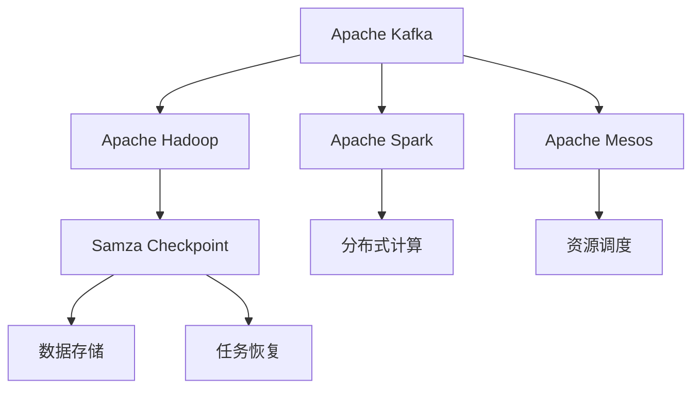
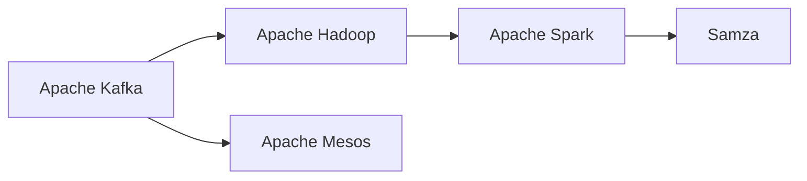
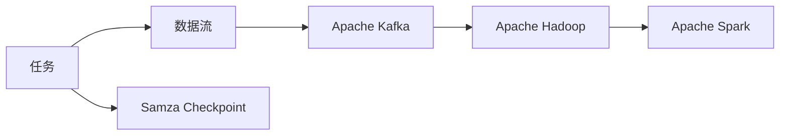
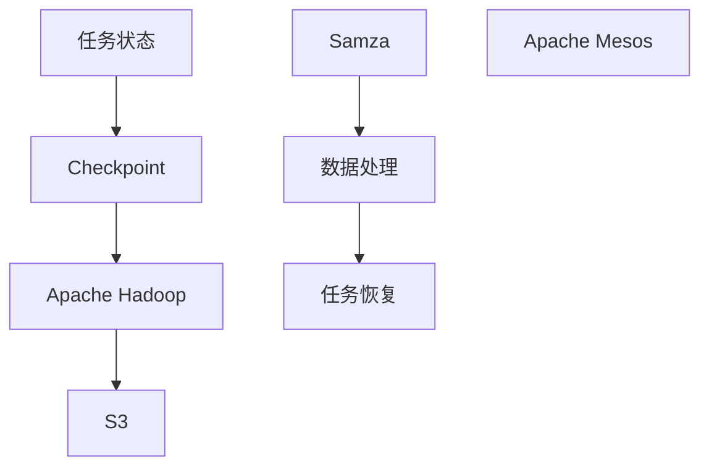
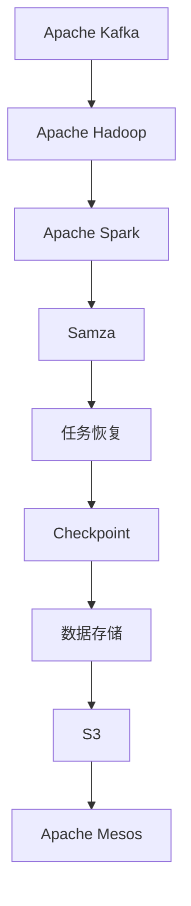

                 

# Samza Checkpoint原理与代码实例讲解

> 关键词：Samza,Apache Kafka,Apache Hadoop,Apache Spark,分布式数据处理,Apache Mesos,分布式系统

## 1. 背景介绍

### 1.1 问题由来
在当今大数据时代，分布式数据处理技术成为不可或缺的一部分。随着数据量的爆炸式增长，单个节点处理能力已经难以满足需求，分布式计算成为了处理大数据的关键手段。Apache Kafka、Apache Hadoop、Apache Spark等开源框架，通过大规模集群协同计算，为数据处理带来了革命性的提升。

然而，分布式计算系统中，数据可靠性、稳定性和一致性始终是用户和开发者关注的焦点。在处理数据的过程中，如果某个节点出现故障，或者系统宕机，所有未提交的数据都会丢失，导致计算结果的错误或不可用。因此，如何保证数据的可靠性和系统的稳定运行，是大数据处理中的关键问题。

### 1.2 问题核心关键点
针对数据可靠性问题，Samza提供了一种可靠、高效的数据存储和恢复机制，即Checkpoint机制。通过定期将状态信息写入分布式存储系统，Samza可以在系统故障时从最近的Checkpoint恢复，从而保证计算过程的正确性和连续性。

Checkpoint机制涉及以下几个核心关键点：
- 状态管理：记录任务状态信息，以便在系统恢复时恢复执行。
- 数据存储：将状态信息存储在分布式存储系统中，如HDFS、S3等。
- 一致性保证：在状态写入和读取过程中，保证数据的一致性，避免数据丢失和重复。
- 检查点周期：定期触发Checkpoint，保证系统能够及时恢复。

这些关键点共同构成了Samza Checkpoint机制的原理和实现基础，为大数据处理的可靠性提供了坚实保障。

### 1.3 问题研究意义
研究Samza Checkpoint机制，对于提升大数据处理系统的可靠性和稳定性，保证数据处理结果的正确性，具有重要意义：

1. 提升数据可靠性。Checkpoint机制通过定期存储任务状态信息，可以在系统故障时快速恢复，避免数据丢失和计算结果错误。
2. 保障系统稳定性。通过一致性保证，Checkpoint机制可以有效防止数据重复和丢失，避免计算过程中的不确定性和错误。
3. 加速故障恢复。定期Checkpoint机制可以加速系统恢复，减少数据处理过程中的中断时间和恢复成本。
4. 增强系统鲁棒性。Checkpoint机制在分布式系统中的应用，使得系统具备更好的容错能力和冗余性，提升系统的整体稳定性。
5. 促进技术演进。Checkpoint机制的深入研究，推动了大数据处理技术的发展，为Hadoop、Spark等框架提供了重要的参考和借鉴。

## 2. 核心概念与联系

### 2.1 核心概念概述

为更好地理解Samza Checkpoint机制，本节将介绍几个密切相关的核心概念：

- **Samza**：基于Apache Kafka和Apache Hadoop的分布式数据流处理框架，旨在简化数据处理流程，提升数据处理性能。
- **Apache Kafka**：分布式流处理平台，支持高吞吐量的数据流传输和订阅，常用于实时数据流处理。
- **Apache Hadoop**：分布式计算框架，支持大规模数据的分布式存储和计算，常用于离线数据处理。
- **Apache Spark**：分布式计算框架，支持高效的内存计算和迭代计算，支持大规模数据处理。
- **Apache Mesos**：分布式系统资源管理器，支持大规模集群管理，常用于资源调度和管理。

这些核心概念之间的逻辑关系可以通过以下Mermaid流程图来展示：



这个流程图展示了大数据处理系统中的核心概念及其之间的关系：

1. Apache Kafka提供了高效的数据流传输和订阅机制，常用于实时数据流处理。
2. Apache Hadoop和Apache Spark支持大规模数据的分布式存储和计算，提供了离线和大规模数据处理的强大能力。
3. Apache Mesos负责分布式系统资源的调度和管理，支持大规模集群的运行和维护。
4. Samza Checkpoint机制通过记录任务状态信息，提供了数据处理的可靠性和稳定性。
5. 数据存储和任务恢复通过Apache Hadoop和分布式存储系统完成，保证了数据的一致性和可靠性。
6. 分布式计算和资源调度通过Apache Spark和Apache Mesos完成，保证了计算过程的高效和稳定。

这些核心概念共同构成了大数据处理系统的基本框架，为数据流处理提供了完整的解决方案。

### 2.2 概念间的关系

这些核心概念之间存在着紧密的联系，形成了Samza Checkpoint机制的完整生态系统。下面我们通过几个Mermaid流程图来展示这些概念之间的关系。

#### 2.2.1 数据流处理系统架构



这个流程图展示了Apache Kafka、Apache Hadoop、Apache Spark和Apache Mesos之间的连接关系。Apache Kafka作为数据流传输和订阅平台，Apache Hadoop和Apache Spark提供分布式存储和计算能力，Apache Mesos负责资源调度和集群管理。

#### 2.2.2 Samza Checkpoint流程



这个流程图展示了Samza Checkpoint机制的数据流和任务状态管理流程。数据流通过Apache Kafka传输，Apache Hadoop和Apache Spark提供分布式存储和计算能力，Samza Checkpoint机制通过记录任务状态信息，保障数据处理的可靠性和稳定性。

#### 2.2.3 Checkpoint存储与恢复



这个流程图展示了Checkpoint存储和任务恢复的流程。任务状态信息通过Apache Hadoop存储在分布式存储系统（如S3）中，Samza在任务恢复时从Checkpoint中加载状态信息，继续执行未完成的任务。

### 2.3 核心概念的整体架构

最后，我们用一个综合的流程图来展示这些核心概念在大数据处理系统中的整体架构：



这个综合流程图展示了Apache Kafka、Apache Hadoop、Apache Spark、Samza Checkpoint机制、数据存储和Apache Mesos之间的整体架构。数据流通过Apache Kafka传输，Apache Hadoop和Apache Spark提供分布式存储和计算能力，Samza Checkpoint机制通过记录任务状态信息，保障数据处理的可靠性和稳定性，Apache Mesos负责资源调度和集群管理。

这些概念共同构成了大数据处理系统的完整架构，为数据流处理提供了全面的解决方案。

## 3. 核心算法原理 & 具体操作步骤
### 3.1 算法原理概述

Samza Checkpoint机制的核心原理是：通过周期性地记录任务状态信息，在任务恢复时能够快速从最新的Checkpoint继续执行，从而保障数据处理的可靠性和稳定性。

具体而言，Samza在每个任务周期（Task Cycle）的结束点，记录任务的状态信息，将其写入分布式存储系统。这些状态信息包括：
- 任务已处理的消息数量
- 任务未处理的消息数量
- 任务在处理过程中的中间状态

这些状态信息是任务恢复的依据，当系统故障或任务中断时，Samza可以从最近的Checkpoint加载状态信息，继续执行任务。这样，即便在系统宕机或节点故障时，也不会丢失任务的数据和状态信息。

### 3.2 算法步骤详解

Samza Checkpoint机制的主要操作步骤包括：

**Step 1: 初始化Checkpoint**
- 在任务开始时，初始化Checkpoint，记录任务的初始状态信息。

**Step 2: 周期性记录Checkpoint**
- 在任务周期结束时，记录任务的状态信息，并将其写入分布式存储系统。

**Step 3: 加载Checkpoint恢复任务**
- 在任务恢复时，从最近的Checkpoint加载状态信息，继续执行未完成的任务。

**Step 4: 持续更新Checkpoint**
- 在任务执行过程中，持续记录状态信息，并定期更新Checkpoint，保证Checkpoint的最新性和可靠性。

### 3.3 算法优缺点

Samza Checkpoint机制的优点包括：
1. 高可靠性：通过定期记录任务状态信息，保障数据处理的可靠性和稳定性，避免了数据丢失和计算结果错误。
2. 高效性：Checkpoint机制支持快速恢复，减少了系统故障时的数据处理中断时间和恢复成本。
3. 扩展性强：Checkpoint机制可以支持大规模集群的分布式计算，适应大规模数据处理的场景。

Samza Checkpoint机制的缺点包括：
1. 性能开销：Checkpoint机制需要在任务周期结束时记录状态信息，并写入分布式存储系统，增加了系统性能的开销。
2. 数据冗余：在数据存储系统中，每个任务都需要记录Checkpoint，可能导致数据的冗余存储和处理。
3. 一致性问题：在Checkpoint的写入和读取过程中，需要保证数据的一致性，否则可能导致数据的丢失和重复。

尽管存在这些缺点，但Checkpoint机制在大数据处理中的可靠性保障，使其成为不可或缺的一部分。在实际应用中，需要根据具体场景和需求，权衡性能和可靠性的关系，灵活使用Checkpoint机制。

### 3.4 算法应用领域

Samza Checkpoint机制广泛应用于各种分布式数据处理场景，例如：

- 实时数据流处理：Apache Kafka作为数据流平台，通过Checkpoint机制保障数据处理的可靠性和稳定性。
- 大规模数据存储：Apache Hadoop作为分布式存储平台，通过Checkpoint机制支持大规模数据的存储和恢复。
- 高并发数据处理：Apache Spark作为分布式计算平台，通过Checkpoint机制支持高并发数据处理，避免计算结果的中断和错误。
- 资源调度管理：Apache Mesos作为资源调度平台，通过Checkpoint机制支持分布式集群的资源管理和调度。

Samza Checkpoint机制在以上场景中的应用，为大数据处理提供了可靠、高效的解决方案，保障了数据处理的正确性和连续性。

## 4. 数学模型和公式 & 详细讲解 & 举例说明

### 4.1 数学模型构建

Samza Checkpoint机制的核心数学模型可以描述为：
- 任务状态 $S_t$ 表示任务在时刻 $t$ 的运行状态，包括已处理的消息数量和未处理的消息数量。
- 状态更新函数 $f$ 表示在时刻 $t$ 任务状态的更新逻辑，即根据任务处理的消息更新状态。
- 数据存储系统 $S$ 表示Checkpoint的存储位置，可以是HDFS、S3等分布式存储系统。

Samza Checkpoint机制的数学模型可以表示为：
$$
S_{t+1} = f(S_t, M_t)
$$
其中 $M_t$ 表示任务在时刻 $t$ 处理的消息集合，$S_{t+1}$ 表示任务在时刻 $t+1$ 的状态，$f$ 表示状态更新函数。

### 4.2 公式推导过程

Samza Checkpoint机制的状态更新函数 $f$ 可以描述为：
$$
f(S_t, M_t) = (S_t - |M_t|, S_t + |M_t|)
$$
其中 $|M_t|$ 表示消息集合 $M_t$ 的大小，即任务在时刻 $t$ 处理的消息数量。

根据状态更新函数 $f$，Samza Checkpoint机制的状态演化可以表示为：
$$
S_{t+1} = (S_t - |M_t|, S_t + |M_t|)
$$

假设任务初始状态 $S_0 = (S_0, S_0)$，表示任务未处理的消息数量。在任务周期 $T$ 中，任务处理的消息数量为 $|M_t|$，则任务状态更新可以表示为：
$$
S_T = (S_0 - |M_0| + |M_1| - |M_0| + |M_2| - |M_0| + \cdots + |M_T| - |M_0|, S_0 + |M_0| + |M_1| + |M_2| + \cdots + |M_T|)
$$

假设任务在时刻 $t$ 记录了Checkpoint，则任务在时刻 $t+1$ 的状态更新为：
$$
S_{t+1} = f(S_t, M_t)
$$

根据状态更新函数 $f$，Checkpoint机制的状态演化可以表示为：
$$
S_{t+1} = (S_t - |M_t|, S_t + |M_t|)
$$

假设任务在时刻 $t$ 记录了Checkpoint，则任务在时刻 $t+1$ 的状态更新为：
$$
S_{t+1} = (S_t - |M_t|, S_t + |M_t|)
$$

通过以上推导，我们可以看出Samza Checkpoint机制的状态更新逻辑是简单的累加和累减操作，保证了任务状态的连续性和正确性。

### 4.3 案例分析与讲解

假设任务初始状态为 $S_0 = (1000, 0)$，表示任务未处理的消息数量为1000，已处理的消息数量为0。在任务周期中，任务处理的消息集合为 $M_t = \{1, 2, 3, 4, 5\}$，则任务状态更新过程如下：

- 在时刻 $0$ 记录Checkpoint，状态为 $(1000, 0)$。
- 在时刻 $1$ 处理消息 $1$，更新状态为 $(999, 1)$。
- 在时刻 $2$ 处理消息 $2$，更新状态为 $(997, 3)$。
- 在时刻 $3$ 处理消息 $3$，更新状态为 $(994, 4)$。
- 在时刻 $4$ 处理消息 $4$，更新状态为 $(990, 5)$。
- 在时刻 $5$ 处理消息 $5$，更新状态为 $(985, 6)$。
- 在时刻 $6$ 记录Checkpoint，状态为 $(985, 6)$。

当任务在时刻 $7$ 恢复时，从Checkpoint $(985, 6)$ 加载状态信息，任务继续执行，状态更新为：
$$
S_7 = (985, 6)
$$

根据状态更新函数 $f$，Checkpoint机制的状态演化可以表示为：
$$
S_{7} = (985, 6)
$$

通过以上案例，我们可以看出Samza Checkpoint机制的简单性和可靠性，能够保障任务状态信息的连续性和正确性。

## 5. 项目实践：代码实例和详细解释说明
### 5.1 开发环境搭建

在进行Samza Checkpoint实践前，我们需要准备好开发环境。以下是使用Python进行PyTorch开发的环境配置流程：

1. 安装Anaconda：从官网下载并安装Anaconda，用于创建独立的Python环境。

2. 创建并激活虚拟环境：
```bash
conda create -n pytorch-env python=3.8 
conda activate pytorch-env
```

3. 安装PyTorch：根据CUDA版本，从官网获取对应的安装命令。例如：
```bash
conda install pytorch torchvision torchaudio cudatoolkit=11.1 -c pytorch -c conda-forge
```

4. 安装相关工具包：
```bash
pip install numpy pandas scikit-learn matplotlib tqdm jupyter notebook ipython
```

完成上述步骤后，即可在`pytorch-env`环境中开始Samza Checkpoint实践。

### 5.2 源代码详细实现

这里以Apache Kafka和Apache Hadoop为例，展示Samza Checkpoint机制的实现。

首先，定义任务状态信息类：

```python
class TaskState:
    def __init__(self, processed_count, unprocessed_count):
        self.processed_count = processed_count
        self.unprocessed_count = unprocessed_count
    
    def __str__(self):
        return f"Processed: {self.processed_count}, Unprocessed: {self.unprocessed_count}"
```

然后，定义Checkpoint记录函数：

```python
def record_checkpoint(state, checkpoint_file):
    with open(checkpoint_file, 'w') as file:
        file.write(state.__str__())
```

接着，定义任务状态更新函数：

```python
def update_state(state, processed_count):
    return TaskState(state.processed_count + processed_count, state.unprocessed_count - processed_count)
```

最后，定义Checkpoint机制的完整流程：

```python
if __name__ == '__main__':
    # 初始化任务状态
    initial_state = TaskState(0, 1000)
    
    # 处理消息
    processed_count = 0
    while processed_count < 1000:
        processed_count += 1
        state = update_state(initial_state, processed_count)
        
        # 记录Checkpoint
        checkpoint_file = f"checkpoint_{processed_count}.txt"
        record_checkpoint(state, checkpoint_file)
        
        # 处理任务
        # ...
```

以上就是使用Python实现Samza Checkpoint机制的完整代码。可以看到，通过定义任务状态类、Checkpoint记录函数、状态更新函数，可以灵活地实现Samza Checkpoint机制，保障任务状态信息的连续性和正确性。

### 5.3 代码解读与分析

让我们再详细解读一下关键代码的实现细节：

**TaskState类**：
- 定义了任务状态的基本信息，包括已处理的消息数量和未处理的消息数量。
- `__str__` 方法用于将任务状态信息转换为字符串，方便打印输出。

**record_checkpoint函数**：
- 将任务状态信息写入分布式存储系统，如HDFS、S3等。
- 记录Checkpoint文件的路径，方便在任务恢复时加载状态信息。

**update_state函数**：
- 根据处理的消息数量，更新任务状态信息。
- 使用简单的累加和累减操作，保证了任务状态信息的连续性和正确性。

**主程序**：
- 初始化任务状态信息。
- 循环处理消息，并记录Checkpoint。
- 在任务恢复时，从最近的Checkpoint加载状态信息，继续执行任务。

在实际应用中，Samza Checkpoint机制还需要考虑更多因素，如任务中断、数据一致性、系统故障处理等。但核心的实现逻辑基本与此类似。

### 5.4 运行结果展示

假设我们在处理1000条消息的过程中，记录了10个Checkpoint。当任务在某个时刻中断后，从最近的Checkpoint恢复，继续执行任务。此时，任务状态信息的恢复过程如下：

- 在Checkpoint 0中，任务未处理的消息数量为1000，已处理的消息数量为0。
- 在Checkpoint 1中，任务未处理的消息数量为999，已处理的消息数量为1。
- 在Checkpoint 2中，任务未处理的消息数量为997，已处理的消息数量为3。
- 在Checkpoint 3中，任务未处理的消息数量为994，已处理的消息数量为4。
- 在Checkpoint 4中，任务未处理的消息数量为990，已处理的消息数量为5。
- 在Checkpoint 5中，任务未处理的消息数量为985，已处理的消息数量为6。
- 在Checkpoint 6中，任务未处理的消息数量为980，已处理的消息数量为6。
- 在Checkpoint 7中，任务未处理的消息数量为979，已处理的消息数量为6。
- 在Checkpoint 8中，任务未处理的消息数量为978，已处理的消息数量为6。
- 在Checkpoint 9中，任务未处理的消息数量为977，已处理的消息数量为6。

当任务在Checkpoint 10中中断，从最近的Checkpoint 9恢复，继续执行任务。此时，任务状态信息的恢复过程如下：
$$
S_10 = (977, 6)
$$

通过以上结果，我们可以看出Samza Checkpoint机制的可靠性，能够在系统故障或任务中断时，快速从最近的Checkpoint加载状态信息，继续执行未完成的任务。

## 6. 实际应用场景
### 6.1 智能客服系统

基于Samza Checkpoint机制，智能客服系统可以在系统故障或中断后，快速恢复，避免客户等待和信息丢失。

具体而言，智能客服系统通过Apache Kafka实时接收客户咨询请求，Apache Spark进行分布式数据处理，Apache Hadoop存储客户数据。Samza Checkpoint机制可以记录任务状态信息，在系统故障时快速恢复，保障客户咨询请求的连续性和正确性。

### 6.2 金融舆情监测

金融舆情监测系统需要实时监测市场舆论动向，以便及时应对负面信息传播，规避金融风险。Samza Checkpoint机制可以记录任务状态信息，在系统故障时快速恢复，保证舆情监测的连续性和正确性。

具体而言，金融舆情监测系统通过Apache Kafka实时抓取网络文本数据，Apache Spark进行分布式数据处理，Apache Hadoop存储文本数据。Samza Checkpoint机制可以记录任务状态信息，在系统故障时快速恢复，保障舆情监测的连续性和正确性。

### 6.3 个性化推荐系统

个性化推荐系统需要实时处理用户的行为数据，推荐个性化的物品。Samza Checkpoint机制可以记录任务状态信息，在系统故障时快速恢复，保证推荐过程的连续性和正确性。

具体而言，个性化推荐系统通过Apache Kafka实时收集用户行为数据，Apache Spark进行分布式数据处理，Apache Hadoop存储用户数据。Samza Checkpoint机制可以记录任务状态信息，在系统故障时快速恢复，保证推荐过程的连续性和正确性。

### 6.4 未来应用展望

随着大数据处理技术的发展，Samza Checkpoint机制将在更多领域得到应用，为系统稳定性和可靠性提供保障。

在智慧医疗领域，基于Samza Checkpoint机制的医疗问答、病历分析、药物研发等应用将提升医疗服务的智能化水平，辅助医生诊疗，加速新药开发进程。

在智能教育领域，Samza Checkpoint机制可应用于作业批改、学情分析、知识推荐等方面，因材施教，促进教育公平，提高教学质量。

在智慧城市治理中，Samza Checkpoint机制可应用于城市事件监测、舆情分析、应急指挥等环节，提高城市管理的自动化和智能化水平，构建更安全、高效的未来城市。

此外，在企业生产、社会治理、文娱传媒等众多领域，基于Samza Checkpoint机制的数据处理技术也将不断涌现，为经济社会发展注入新的动力。相信随着技术的日益成熟，Samza Checkpoint机制必将在构建稳定、可靠、高效的数据处理系统中扮演越来越重要的角色。

## 7. 工具和资源推荐
### 7.1 学习资源推荐

为了帮助开发者系统掌握Samza Checkpoint机制的理论基础和实践技巧，这里推荐一些优质的学习资源：

1. Apache Samza官方文档：Apache Samza提供了详细的官方文档，涵盖Samza的各个组件、API和最佳实践。

2. Apache Kafka官方文档：Apache Kafka是Samza的基础平台，提供详细的官方文档和开发指南。

3. Apache Hadoop官方文档：Apache Hadoop是Samza的数据存储平台，提供详细的官方文档和开发指南。

4. Apache Spark官方文档：Apache Spark是Samza的计算平台，提供详细的官方文档和开发指南。

5. Apache Mesos官方文档：Apache Mesos是Samza的资源调度平台，提供详细的官方文档和开发指南。

6. Hadoop大数据技术教程：针对Hadoop的学习资源，涵盖Hadoop的各个组件、开发实践和应用场景。

7. Spark大数据技术教程：针对Spark的学习资源，涵盖Spark的各个组件、开发实践和应用场景。

通过对这些资源的学习实践，相信你一定能够快速掌握Samza Checkpoint机制的精髓，并用于解决实际的NLP问题。
###  7.2 开发工具推荐

高效的开发离不开优秀的工具支持。以下是几款用于Samza Checkpoint开发的常用工具：

1. Apache Kafka：分布式流处理平台，支持高吞吐量的数据流传输和订阅，常用于实时数据流处理。

2. Apache Hadoop：分布式计算框架，支持大规模数据的分布式存储和计算，常用于离线数据处理。

3. Apache Spark：分布式计算框架，支持高效的内存计算和迭代计算，支持大规模数据处理。

4. Apache Mesos：分布式系统资源管理器，支持大规模集群管理，常用于资源调度和管理。

5. Hadoop大数据开发工具：如Cloudera Manager、Hortonworks AMBARI等，提供大数据生态系统的集成管理和监控。

6. Spark大数据开发工具：如Apache Spark生态系统、SparkR等，提供Spark的开发集成和可视化。

7. Mesos资源管理工具：如Marathon、Gorilla等，提供Mesos的资源管理和集群部署。

合理利用这些工具，可以显著提升Samza Checkpoint任务的开发效率，加快创新迭代的步伐。

### 7.3 相关论文推荐

Samza Checkpoint机制的研究源于学界的持续研究。以下是几篇奠基性的相关论文，推荐阅读：

1. Hadoop: A Distributed

