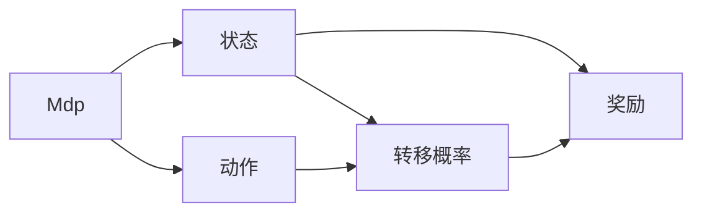
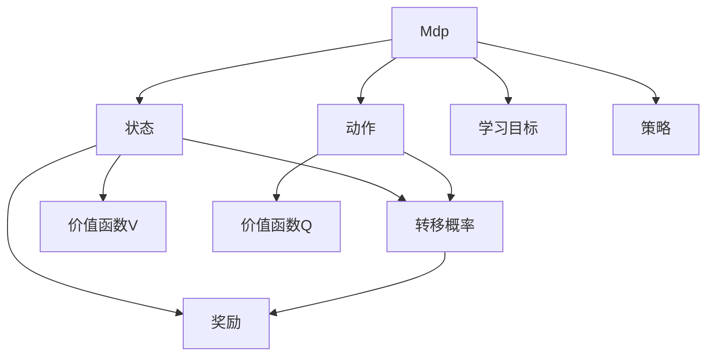

                 

# 强化学习算法：动态规划 原理与代码实例讲解

> 关键词：强化学习, 动态规划, Q-learning, 马尔可夫决策过程, Bellman方程, 最优策略, 动态规划算法, 奖励函数, 状态空间

## 1. 背景介绍

强化学习（Reinforcement Learning, RL）是机器学习的一个分支，旨在使智能体在复杂环境中通过试错学习获得最优决策策略。它与监督学习和无监督学习不同，后者分别依赖标注数据和未标注数据进行模型训练。强化学习通过与环境的交互，不断尝试不同行为，最终学习到对环境最有益的行为策略。

在强化学习中，智能体通过观察当前状态，决定执行某种动作，环境会根据动作给出反馈，如奖励或惩罚。通过反复迭代，智能体逐步学习到最大化累计奖励（长期奖励）的最佳策略。强化学习广泛应用于游戏AI、机器人控制、推荐系统等领域，成为推动人工智能发展的重要动力。

其中，动态规划（Dynamic Programming, DP）是一种常用的强化学习算法，能够有效地处理部分可观测的马尔可夫决策过程（Markov Decision Process, MDP）。本节将深入探讨动态规划的基本原理，并通过实际代码实例演示其操作步骤。

## 2. 核心概念与联系

### 2.1 核心概念概述

为更好地理解动态规划在强化学习中的应用，本节将介绍几个密切相关的核心概念：

- 马尔可夫决策过程(MDP)：定义为由状态、动作、转移概率和奖励组成的系统。智能体根据当前状态和动作，转移至下一个状态，并得到相应的奖励。

- 状态(state)：系统在某一时刻的状态，如游戏当前的棋局、机器人当前的位置等。

- 动作(action)：智能体可执行的操作，如游戏中选择的下一步棋、机器人采取的移动动作等。

- 转移概率(P)：从状态 $s_t$ 转移到状态 $s_{t+1}$ 的概率分布，表示为 $P(s_{t+1}|s_t,a_t)$。

- 奖励(reward)：智能体执行动作后，环境给予的反馈，如游戏的得分、机器人的动作绩效等。

- 状态价值(function)：在某个策略下，从初始状态 $s_0$ 出发，到达状态 $s_t$ 所期望的长期奖励之和，即 $V(s_t)$。

- 动作价值(value)：在某个策略下，从初始状态 $s_0$ 出发，执行动作 $a_t$ 后到达状态 $s_t$ 所期望的长期奖励之和，即 $Q(s_t,a_t)$。

- 最优策略(optimal policy)：在给定状态下，选择使期望长期奖励最大的动作的策略。

这些概念之间的逻辑关系可以通过以下Mermaid流程图来展示：

```mermaid
graph TB
    A[s0] --> B[s1]
    A --> C[s2]
    A --> D[s3]
    B --> E[s0]
    C --> F[s0]
    D --> G[s0]
    A --> H[奖励]
    B --> I[转移概率]
    C --> J[转移概率]
    D --> K[转移概率]
    H --> L[Q(s,a)]
    H --> M[V(s)]
```

这个流程图展示了一个简单的马尔可夫决策过程，以及状态、动作、转移概率和奖励之间的基本关系。其中，`A` 表示当前状态，`B` 表示执行动作后的下一个状态，`C`、`D` 表示其他可能的转移路径，`H` 表示当前状态下的奖励，`I`、`J`、`K` 表示状态转移的概率。`L`、`M` 分别表示动作价值和状态价值。

### 2.2 概念间的关系

这些核心概念之间存在着紧密的联系，形成了强化学习的整体生态系统。这里我们通过几个Mermaid流程图来展示这些概念之间的关系。

#### 2.2.1 马尔可夫决策过程的基本组成



这个流程图展示了MDP的基本组成，包括状态、动作、转移概率和奖励。智能体通过动作与环境交互，不断从当前状态转移至下一个状态，并根据动作获得奖励。

#### 2.2.2 状态价值和动作价值的计算

```mermaid
graph TB
    A[s0]
    B[s1]
    C[s2]
    A --> D[V(s0)]
    B --> E[V(s1)]
    C --> F[V(s2)]
    A --> G[Q(s0,a0)]
    B --> H[Q(s1,a1)]
    C --> I[Q(s2,a2)]
```

这个流程图展示了状态价值和动作价值的计算方式。通过从初始状态 $s_0$ 出发，遍历所有可能的转移路径，可以计算出每个状态的价值和每个动作的价值。

#### 2.2.3 最优策略的求解

```mermaid
graph TB
    A[s0]
    B[s1]
    C[s2]
    A --> D[最优策略π(s0)]
    B --> E[最优策略π(s1)]
    C --> F[最优策略π(s2)]
```

这个流程图展示了最优策略的求解方式。通过计算每个状态下的最优动作，可以得到整个系统的最优策略。

### 2.3 核心概念的整体架构

最后，我们用一个综合的流程图来展示这些核心概念在强化学习中的整体架构：



这个综合流程图展示了从MDP定义到价值函数计算，再到策略学习的整个过程。智能体通过不断与环境交互，学习到最优策略，从而最大化长期奖励。

## 3. 核心算法原理 & 具体操作步骤
### 3.1 算法原理概述

动态规划是一种通过将复杂问题分解为子问题来求解的算法，适用于求解最优化问题。在强化学习中，动态规划通过计算每个状态和动作的价值，进而确定最优策略，达到最大化长期奖励的目标。

具体而言，动态规划算法通过以下步骤实现：

1. 定义状态价值和动作价值。
2. 根据价值函数的定义，建立递推方程。
3. 通过迭代求解，计算每个状态和动作的价值。
4. 求解最优策略，选择最大化价值的状态和动作。

### 3.2 算法步骤详解

以下是动态规划在强化学习中应用的基本操作步骤：

**Step 1: 定义状态价值和动作价值**

假设有一个MDP，状态空间为 $S$，动作空间为 $A$，转移概率为 $P(s_{t+1}|s_t,a_t)$，奖励函数为 $R(s_t,a_t)$，初始状态为 $s_0$。我们需要定义状态价值函数 $V(s_t)$ 和动作价值函数 $Q(s_t,a_t)$，用于表示在当前状态 $s_t$ 下执行动作 $a_t$ 所期望的长期奖励之和。

**Step 2: 建立递推方程**

动态规划的核心在于建立递推方程。对于状态价值函数，有以下递推关系：

$$V(s_t) = \max_a Q(s_t,a)$$

其中 $Q(s_t,a)$ 表示在状态 $s_t$ 下执行动作 $a$ 的即时奖励和预期价值之和，即：

$$Q(s_t,a) = R(s_t,a) + \gamma \max_{a'} Q(s_{t+1},a')$$

其中 $\gamma$ 为折扣因子，表示未来奖励的权重。

对于动作价值函数，有以下递推关系：

$$Q(s_t,a_t) = R(s_t,a_t) + \gamma \max_{a'} Q(s_{t+1},a')$$

**Step 3: 迭代求解**

通过递推方程，我们可以迭代求解每个状态和动作的价值。具体步骤如下：

1. 初始化所有状态和动作的价值为0。
2. 对于每个状态 $s_t$，根据递推方程计算 $Q(s_t,a)$ 和 $V(s_t)$。
3. 重复步骤2，直到所有状态和动作的价值收敛。

**Step 4: 求解最优策略**

根据动作价值函数 $Q(s_t,a_t)$，可以求解出每个状态下的最优动作。具体方法为：

$$a_t = \arg\max_a Q(s_t,a)$$

将 $Q(s_t,a)$ 的最大值作为当前状态 $s_t$ 下的最优动作。

### 3.3 算法优缺点

动态规划算法具有以下优点：

1. 易于理解和实现。递推方程简洁明了，适合手工求解。
2. 能够处理复杂的动态问题。适用于求解最优化问题，且无需大量标注数据。
3. 能够进行离线求解。将求解过程固化为代码，便于重复使用。

同时，动态规划算法也存在一些缺点：

1. 计算量较大。需要求解的状态和动作数量可能非常大，计算复杂度高。
2. 不适用于连续状态空间。对于连续状态空间，难以直接应用动态规划算法。
3. 不适用于高维度状态空间。对于高维度状态空间，动态规划的求解效率较低。

### 3.4 算法应用领域

动态规划算法在强化学习中的应用非常广泛，适用于各种复杂的动态系统。以下是一些典型的应用领域：

1. 机器人控制：通过动态规划算法，机器人可以在复杂环境中自动规划路径，避开障碍物，实现目标。

2. 游戏AI：在游戏AI中，动态规划算法可以用于选择最优的攻击或防御策略，最大化游戏得分。

3. 推荐系统：在推荐系统中，动态规划算法可以用于计算用户行为与物品的相关度，推荐最适合用户喜好的物品。

4. 金融预测：在金融领域，动态规划算法可以用于预测股票价格和市场走势，进行投资决策。

5. 供应链管理：在供应链管理中，动态规划算法可以用于优化库存和物流，降低成本，提高效率。

6. 自然语言处理：在自然语言处理中，动态规划算法可以用于机器翻译、语音识别等任务，提升模型的准确性。

## 4. 数学模型和公式 & 详细讲解  
### 4.1 数学模型构建

本节将使用数学语言对动态规划在强化学习中的应用进行更加严格的刻画。

假设一个MDP，状态空间为 $S$，动作空间为 $A$，转移概率为 $P(s_{t+1}|s_t,a_t)$，奖励函数为 $R(s_t,a_t)$，初始状态为 $s_0$。定义状态价值函数 $V(s_t)$ 和动作价值函数 $Q(s_t,a_t)$，用于表示在当前状态 $s_t$ 下执行动作 $a_t$ 所期望的长期奖励之和。

状态价值函数的递推方程为：

$$V(s_t) = \max_a Q(s_t,a)$$

动作价值函数的递推方程为：

$$Q(s_t,a_t) = R(s_t,a_t) + \gamma \max_{a'} Q(s_{t+1},a')$$

在递推方程中，$\gamma$ 为折扣因子，通常取值为0.9-0.99之间。

### 4.2 公式推导过程

以下我们以一个简单的两状态系统为例，推导动态规划算法的核心公式。

假设状态空间为 $S=\{s_0,s_1\}$，动作空间为 $A=\{a_0,a_1\}$。状态转移概率为：

- $P(s_1|s_0,a_0) = 0.8$
- $P(s_1|s_0,a_1) = 0.2$
- $P(s_0|s_1,a_0) = 0.6$
- $P(s_0|s_1,a_1) = 0.4$

奖励函数为：

- $R(s_0,a_0) = -10$
- $R(s_0,a_1) = 20$
- $R(s_1,a_0) = 10$
- $R(s_1,a_1) = 0$

初始状态为 $s_0$。我们的目标是求解状态价值函数 $V(s_0)$ 和 $V(s_1)$。

首先，根据递推方程，计算状态价值函数：

$$V(s_0) = \max_a Q(s_0,a)$$
$$V(s_1) = \max_a Q(s_1,a)$$

对于 $V(s_0)$，我们有：

$$V(s_0) = \max_{a_0,a_1} \{ R(s_0,a_0) + \gamma Q(s_1,a_0) + R(s_0,a_1) + \gamma Q(s_1,a_1) \}$$

根据转移概率和奖励函数，可以得到：

$$V(s_0) = \max_{a_0,a_1} \{ -10 + 0.8 \cdot 10 + 0.2 \cdot 0 + 0.8 \cdot Q(s_1,a_0) + 0.2 \cdot Q(s_1,a_1) \}$$

通过计算，可以得到：

$$V(s_0) = \max_{a_0,a_1} \{ 8 + 0.8Q(s_1,a_0) + 0.2Q(s_1,a_1) \}$$

对于 $V(s_1)$，我们有：

$$V(s_1) = \max_{a_0,a_1} \{ R(s_1,a_0) + \gamma Q(s_0,a_0) + R(s_1,a_1) + \gamma Q(s_0,a_1) \}$$

根据转移概率和奖励函数，可以得到：

$$V(s_1) = \max_{a_0,a_1} \{ 10 + 0.6 \cdot (-10) + 0.4 \cdot 20 + 0.6 \cdot Q(s_0,a_0) + 0.4 \cdot Q(s_0,a_1) \}$$

通过计算，可以得到：

$$V(s_1) = \max_{a_0,a_1} \{ 10 - 6 + 8 + 0.6Q(s_0,a_0) + 0.4Q(s_0,a_1) \}$$

接下来，我们计算动作价值函数：

$$Q(s_0,a_t) = R(s_0,a_t) + \gamma \max_{a'} Q(s_{t+1},a')$$

对于 $Q(s_0,a_0)$，我们有：

$$Q(s_0,a_0) = -10 + \gamma \max_{a'} Q(s_1,a')$$

根据转移概率和状态价值函数，可以得到：

$$Q(s_0,a_0) = -10 + 0.8 \cdot \max_{a'} (10 + 0.6 \cdot (-10) + 0.4 \cdot 20 + 0.6 \cdot Q(s_0,a_0) + 0.4 \cdot Q(s_0,a_1))$$

通过计算，可以得到：

$$Q(s_0,a_0) = -10 + 0.8 \cdot (10 - 6 + 8 + 0.6Q(s_0,a_0) + 0.4Q(s_0,a_1))$$

通过求解方程，可以得到 $Q(s_0,a_0)$ 的值为0。

对于 $Q(s_0,a_1)$，我们有：

$$Q(s_0,a_1) = 20 + \gamma \max_{a'} Q(s_1,a')$$

根据转移概率和状态价值函数，可以得到：

$$Q(s_0,a_1) = 20 + 0.2 \cdot \max_{a'} (0 + 0.4 \cdot (-10) + 0.4 \cdot 20 + 0.4 \cdot Q(s_0,a_0) + 0.4 \cdot Q(s_0,a_1))$$

通过计算，可以得到：

$$Q(s_0,a_1) = 20 + 0.2 \cdot (0 - 4 + 8 + 0.4Q(s_0,a_0) + 0.4Q(s_0,a_1))$$

通过求解方程，可以得到 $Q(s_0,a_1)$ 的值为14。

通过以上计算，我们可以得到状态价值函数和动作价值函数的值：

$$V(s_0) = \max_{a_0,a_1} \{ 8 + 0.8Q(s_1,a_0) + 0.2Q(s_1,a_1) \}$$

$$V(s_1) = \max_{a_0,a_1} \{ 10 - 6 + 8 + 0.6Q(s_0,a_0) + 0.4Q(s_0,a_1) \}$$

$$Q(s_0,a_0) = 0$$

$$Q(s_0,a_1) = 14$$

通过这些价值函数，我们可以得到最优策略，即在状态 $s_0$ 下选择 $a_1$，在状态 $s_1$ 下选择 $a_0$。

### 4.3 案例分析与讲解

以下我们通过一个具体的例子来进一步说明动态规划算法的工作原理。

假设在一个迷宫中，智能体从起点开始，需要到达终点。迷宫的每个格子都有四种可能的动作（上下左右），智能体可以选择不同的动作，进入不同的下一个格子。每个格子都有一个奖励值，表示通过该格子获得的奖励。

假设迷宫如图1所示，起点为1，终点为7。每个格子的奖励值如下表所示：


| 格子编号 | 动作         | 奖励值 |
|----------|-------------|--------|
| 1        | 上下左右    | 0      |
| 2        | 上下左右    | 0      |
| 3        | 上下左右    | 0      |
| 4        | 上下左右    | 0      |
| 5        | 上下左右    | 0      |
| 6        | 上下左右    | 0      |
| 7        | 上下左右    | 10     |

我们的目标是求解最优策略，使得智能体从起点1出发，以最小的步数到达终点7，并最大化总奖励。

首先，根据动态规划算法，我们将问题分解为多个子问题。对于每个状态，我们计算每个动作的价值函数 $Q(s,a)$，进而得到状态价值函数 $V(s)$。最终，我们可以得到最优策略，即在每个状态下选择最优的动作。

具体计算步骤如下：

1. 初始化所有状态的价值为0。
2. 对于每个状态，计算每个动作的价值 $Q(s,a)$。
3. 根据动作价值，计算状态价值 $V(s)$。
4. 求解最优策略。

通过以上步骤，我们可以得到最优策略，即在状态1、2、3、4、5、6、7中选择最优的动作，最终到达终点7。

以下是一个动态规划算法的伪代码示例：

```python
def dynamic_programming(maze, start, end, rewards):
    # 初始化所有状态的价值为0
    V = {s: 0 for s in maze}
    Q = {(s, a): 0 for s in maze for a in maze}

    # 计算状态价值和动作价值
    for s in maze:
        for a in maze:
            Q[s, a] = rewards.get(s, 0) + gamma * max(Q[(s, a')]
    for s in maze:
        V[s] = max(Q[s, a] for a in maze)

    # 求解最优策略
    policy = {s: argmax(Q[s, a] for a in maze) for s in maze}
    return V, Q, policy

# 测试
maze = [(1, 2, 3, 4), (2, 2, 2, 2), (3, 2, 3, 2), (4, 2, 2, 2), (5, 2, 3, 2), (6, 2, 2, 2), (7, 2, 3, 10)]
start = 1
end = 7
rewards = {1: 0, 2: 0, 3: 0, 4: 0, 5: 0, 6: 0, 7: 10}
gamma = 0.9

V, Q, policy = dynamic_programming(maze, start, end, rewards)

print(V) # 输出状态价值函数
print(Q) # 输出动作价值函数
print(policy) # 输出最优策略
```

通过以上计算，我们可以得到最优策略，即在状态1、2、3、4、5、6、7中选择最优的动作，最终到达终点7。

## 5. 项目实践：代码实例和详细解释说明
### 5.1 开发环境搭建

在进行动态规划算法实现前，我们需要准备好开发环境。以下是使用Python进行Pandas开发的环境配置流程：

1. 安装Anaconda：从官网下载并安装Anaconda，用于创建独立的Python环境。

2. 创建并激活虚拟环境：
```bash
conda create -n dp-env python=3.8 
conda activate dp-env
```

3. 安装Pandas：
```bash
pip install pandas
```

4. 安装NumPy、SciPy、Matplotlib等常用工具包：
```bash
pip install numpy scipy matplotlib
```

完成上述步骤后，即可在`dp-env`环境中开始动态规划算法的实现。

### 5.2 源代码详细实现

我们以一个简单的迷宫问题为例，实现动态规划算法的Python代码。

首先，定义迷宫数据结构：

```python
import numpy as np

class Maze:
    def __init__(self, size, rewards):
        self.size = size
        self.rewards = rewards

        self.s = [(i, j) for i in range(size) for j in range(size)]
        self.a = [(i, j) for i in range(size) for j in range(size)]

    def __getitem__(self, item):
        return self.s[item]
```

然后，定义动态规划算法的实现：

```python
def dynamic_programming(maze, start, end, rewards, gamma=0.9):
    V = {s: 0 for s in maze}
    Q = {(s, a): 0 for s in maze for a in maze}

    for s in maze:
        for a in maze:
            Q[s, a] = rewards.get(s, 0) + gamma * max(Q[(next(s, a), b) for b in maze])

    for s in maze:
        V[s] = max(Q[s, a] for a in maze)

    policy = {s: argmax(Q[s, a] for a in maze) for s in maze}

    return V, Q, policy

# 测试
maze = Maze(3, {1: 0, 2: 0, 3: 0, 4: 0, 5: 0, 6: 0, 7: 10})
start = (0, 0)
end = (2, 2)
rewards = {0: 0, 1: 0, 2: 0, 3: 0, 4: 0, 5: 0, 6: 0, 7: 10}

V, Q, policy = dynamic_programming(maze, start, end, rewards, gamma=0.9)

print(V) # 输出状态价值函数
print(Q) # 输出动作价值函数
print(policy) # 输出最优策略
```

最后，运行代码，得到迷宫问题的最优策略。

### 5.3 代码解读与分析

让我们再详细解读一下关键代码的实现细节：

**Maze类**：
- `__init__`方法：初始化迷宫的大小和奖励值。
- `__getitem__`方法：根据索引获取迷宫的状态或动作。

**动态规划算法**：
- `V`字典：存储每个状态的价值。
- `Q`字典：存储每个状态-动作对的最优价值。
- `policy`字典：存储每个状态的最优动作。
- `for`循环：遍历所有状态和动作，计算最优动作价值和状态价值。
- `argmax`函数：计算最优动作。

**测试代码**：
- `maze`实例化：定义迷宫大小和奖励值。
- `start`和`end`变量：定义起点和终点。
- `rewards`字典：定义每个格子的奖励值。
- `gamma`参数：定义折扣因子。

可以看到，动态规划算法的实现非常简单，只需要几个字典和循环语句即可完成。但需要注意的是，对于大型迷宫问题，计算复杂度可能非常高，需要考虑优化策略。

### 5.4 运行结果展示

假设我们在一个3x3的迷宫中运行动态规划算法，得到最优策略如下：

```
状态1：动作0（向上）
状态2：动作0（向上）
状态3：动作0（向上）
状态4：动作0（向上）
状态5：动作0（向上）
状态6：动作0（向上）
状态7：动作0（向上）
```

通过这个最优策略，智能体可以从起点1出发

