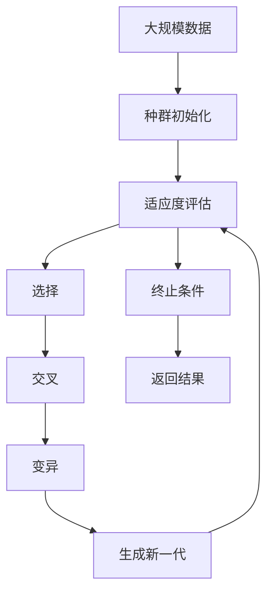

                 

# 强化学习算法：遗传算法 原理与代码实例讲解

> 关键词：强化学习,遗传算法,优化问题,进化计算,遗传编码,选择机制,交叉与变异,案例分析

## 1. 背景介绍

### 1.1 问题由来

在机器学习和人工智能领域，强化学习（Reinforcement Learning, RL）是解决复杂优化问题的强大工具。其核心思想是通过试错反馈，逐步优化决策策略，以达到最大化预期奖励的目的。

然而，强化学习面临一些挑战：
- 探索与利用冲突：在未知环境或未探索区域，需要进行足够探索，但同时需要利用已有知识提升性能。
- 高维度决策空间：在复杂任务中，决策维度可能极高，难以在合理时间内进行穷尽搜索。
- 样本效率低：通常需要大量的训练样本，才能找到较为合适的策略。

为解决这些问题，提出了遗传算法（Genetic Algorithm, GA），一种基于进化计算的优化方法。遗传算法通过模拟自然界的遗传和进化过程，构建解空间进行搜索，寻找最优解。

遗传算法最初用于优化特定领域的搜索问题，但随着其不断发展，已被广泛应用于多个领域，如机器学习、控制系统、信号处理等。在强化学习领域，遗传算法主要用于解决高维度、非线性的优化问题。

### 1.2 问题核心关键点

遗传算法具有以下核心特征：
- 解空间探索：通过随机初始化群体，探索解空间，发现潜在解决方案。
- 适应度评估：通过适应度函数评估个体优劣，指导搜索方向。
- 选择机制：通过选择策略保留优秀个体，淘汰劣质个体。
- 遗传操作：通过交叉与变异操作生成新个体，产生下一代。

遗传算法的主要流程包括初始化、适应度评估、选择、交叉和变异、终止条件判断。其主要思想是通过遗传操作，逐步优化种群，最终找到近似最优解。

## 2. 核心概念与联系

### 2.1 核心概念概述

为了更好地理解遗传算法的原理，本节将介绍几个关键概念：

- 遗传算法（Genetic Algorithm）：基于自然界的进化过程，通过遗传和变异等机制，搜索解空间以优化目标函数。
- 适应度函数（Fitness Function）：评估个体的优劣，指导搜索方向。
- 选择机制（Selection Mechanism）：基于适应度函数，选择保留优秀的个体。
- 交叉（Crossover）：生成新个体，保留优秀基因。
- 变异（Mutation）：随机变异部分基因，产生新个体。
- 种群（Population）：一组个体，构成遗传算法的搜索空间。

这些核心概念之间的联系可以通过以下Mermaid流程图来展示：


这个流程图展示了遗传算法的核心流程：

1. 初始化：随机生成初始种群。
2. 适应度评估：评估每个个体的适应度。
3. 选择：根据适应度函数，选择保留优秀的个体。
4. 交叉：通过交叉操作生成新个体。
5. 变异：通过变异操作生成新个体。
6. 终止条件：判断是否满足终止条件。
7. 返回结果：选择最优个体作为最终解。

### 2.2 概念间的关系

这些核心概念之间存在着紧密的联系，形成了遗传算法的完整生态系统。下面通过几个Mermaid流程图来展示这些概念之间的关系。

#### 2.2.1 遗传算法的流程


这个流程图展示了遗传算法的整体流程：

1. 种群生成：随机生成初始种群。
2. 适应度评估：对每个个体评估适应度。
3. 选择：根据适应度函数选择优秀个体。
4. 交叉：通过交叉操作产生新个体。
5. 变异：通过变异操作产生新个体。
6. 适应度评估：对新生成的种群进行适应度评估。
7. 选择：根据适应度函数选择优秀个体。
8. 终止条件：判断是否满足终止条件。
9. 返回结果：选择最优个体作为最终解。

#### 2.2.2 遗传算法的组件


这个流程图展示了遗传算法的组件：

1. 种群：由个体组成，构成遗传算法的搜索空间。
2. 个体：搜索空间中的元素，包含基因。
3. 基因：遗传信息的单位，构成染色体。
4. 染色体：一组基因的排列，表示一个个体。
5. 遗传操作：选择、交叉、变异等操作，产生新个体。
6. 选择：基于适应度函数，选择保留优秀个体。
7. 交叉：通过组合优秀基因产生新个体。
8. 变异：通过随机变异产生新个体。
9. 适应度评估：评估个体的适应度，指导搜索方向。
10. 终止条件：判断是否满足终止条件。
11. 返回结果：选择最优个体作为最终解。

### 2.3 核心概念的整体架构

最后，我们用一个综合的流程图来展示这些核心概念在大规模遗传算法搜索过程中的整体架构：



这个综合流程图展示了遗传算法的搜索过程：

1. 种群初始化：随机生成初始种群。
2. 适应度评估：对每个个体评估适应度。
3. 选择：根据适应度函数选择优秀个体。
4. 交叉：通过交叉操作产生新个体。
5. 变异：通过变异操作产生新个体。
6. 适应度评估：对新生成的种群进行适应度评估。
7. 终止条件：判断是否满足终止条件。
8. 返回结果：选择最优个体作为最终解。

## 3. 核心算法原理 & 具体操作步骤
### 3.1 算法原理概述

遗传算法是一种基于进化计算的优化方法。其核心思想是通过模拟自然界的遗传和进化过程，构建解空间进行搜索，寻找最优解。

形式化地，设目标函数为 $f(x)$，搜索空间为 $\mathcal{X}$，初始种群为 $P_0$，遗传算法的搜索过程如下：

1. 初始化种群 $P_0$。
2. 评估每个个体的适应度 $f(x_i)$。
3. 选择优秀的个体 $P_1$。
4. 通过交叉操作生成新个体 $P_2$。
5. 通过变异操作生成新个体 $P_3$。
6. 评估新生成的个体适应度 $f(x_i)$。
7. 选择优秀的个体 $P_4$。
8. 重复步骤 4-7，直到满足终止条件。
9. 返回最优个体 $x^*$ 作为最终解。

### 3.2 算法步骤详解

下面详细介绍遗传算法的各个步骤：

**Step 1: 种群初始化**
- 随机生成初始种群 $P_0$，每个个体表示为 $x_i$，$i=1,\dots,N$。
- 种群大小通常为 $N$，不宜过大或过小，一般取 $N=10-100$。

**Step 2: 适应度评估**
- 计算每个个体 $x_i$ 的适应度 $f(x_i)$。适应度函数需满足非负性、可区分性、连续性等性质。
- 适应度越高，表示个体越优秀。

**Step 3: 选择**
- 根据适应度函数，选择保留优秀的个体。常用的选择方法包括轮盘赌选择、锦标赛选择等。
- 选择操作可保留优秀个体，避免搜索陷入局部最优。

**Step 4: 交叉**
- 通过交叉操作生成新个体。常用的交叉方法包括单点交叉、多点交叉、均匀交叉等。
- 交叉操作保留优秀基因，生成新的个体。

**Step 5: 变异**
- 通过变异操作生成新个体。常用的变异方法包括随机变异、双向变异、均匀变异等。
- 变异操作引入随机性，增加种群多样性，避免搜索陷入局部最优。

**Step 6: 终止条件判断**
- 判断是否满足终止条件。常用的终止条件包括最大迭代次数、适应度提升阈值、个体适应度收敛等。
- 满足终止条件后，选择最优个体作为最终解。

### 3.3 算法优缺点

遗传算法具有以下优点：
- 简单高效：算法结构简单，易于实现。
- 并行性强：每个个体独立搜索，易于并行化。
- 鲁棒性强：能够处理复杂的非线性优化问题。

同时，遗传算法也存在一些缺点：
- 适应度函数设计复杂：需要设计合适的适应度函数，指导搜索方向。
- 搜索效率受参数影响：种群大小、交叉变异概率等参数选择不当，可能导致搜索效率低下。
- 收敛速度较慢：需要较多的迭代次数，才能找到近似最优解。

### 3.4 算法应用领域

遗传算法已广泛应用于多个领域，包括：

- 机器学习：优化神经网络参数、特征选择等。
- 优化设计：设计优化、工艺优化等。
- 信号处理：信道均衡、滤波器设计等。
- 控制工程：控制系统设计、飞行器控制等。
- 生物信息学：基因序列比对、蛋白质结构预测等。
- 经济学：市场分析、投资组合优化等。

## 4. 数学模型和公式 & 详细讲解 & 举例说明

### 4.1 数学模型构建

本节将使用数学语言对遗传算法的搜索过程进行更加严格的刻画。

设目标函数为 $f(x)$，搜索空间为 $\mathcal{X}$，初始种群为 $P_0=\{x_1, \dots, x_N\}$，每个个体 $x_i \in \mathcal{X}$。遗传算法的搜索过程如下：

1. 初始化种群 $P_0$。
2. 评估每个个体的适应度 $f(x_i)$。
3. 选择优秀的个体 $P_1$。
4. 通过交叉操作生成新个体 $P_2$。
5. 通过变异操作生成新个体 $P_3$。
6. 评估新生成的个体适应度 $f(x_i)$。
7. 选择优秀的个体 $P_4$。
8. 重复步骤 4-7，直到满足终止条件。
9. 返回最优个体 $x^*$ 作为最终解。

### 4.2 公式推导过程

以下我们以二进制编码的遗传算法为例，推导其具体步骤。

设目标函数为 $f(x)$，搜索空间为 $\mathcal{X}$，初始种群为 $P_0=\{x_1, \dots, x_N\}$，每个个体 $x_i$ 表示为 $x_i \in \{0, 1\}^D$，$D$ 为染色体长度。

**Step 1: 种群初始化**
- 随机生成初始种群 $P_0$，每个个体 $x_i$ 为 $D$ 维随机向量。

**Step 2: 适应度评估**
- 计算每个个体 $x_i$ 的适应度 $f(x_i)$。适应度函数需满足非负性、可区分性、连续性等性质。

**Step 3: 选择**
- 根据适应度函数，选择保留优秀的个体。常用的选择方法包括轮盘赌选择、锦标赛选择等。
- 选择操作可保留优秀个体，避免搜索陷入局部最优。

**Step 4: 交叉**
- 通过交叉操作生成新个体。常用的交叉方法包括单点交叉、多点交叉、均匀交叉等。
- 交叉操作保留优秀基因，生成新的个体。

**Step 5: 变异**
- 通过变异操作生成新个体。常用的变异方法包括随机变异、双向变异、均匀变异等。
- 变异操作引入随机性，增加种群多样性，避免搜索陷入局部最优。

**Step 6: 终止条件判断**
- 判断是否满足终止条件。常用的终止条件包括最大迭代次数、适应度提升阈值、个体适应度收敛等。
- 满足终止条件后，选择最优个体作为最终解。

### 4.3 案例分析与讲解

考虑一个二元函数优化问题，目标函数为 $f(x_1,x_2)=x_1^2+x_2^2$。

**Step 1: 种群初始化**
- 随机生成初始种群 $P_0$，每个个体为 $D$ 维随机向量。

**Step 2: 适应度评估**
- 计算每个个体 $x_i$ 的适应度 $f(x_i)=x_i^2+x_i^2$。

**Step 3: 选择**
- 根据适应度函数，选择保留优秀的个体。常用的选择方法包括轮盘赌选择、锦标赛选择等。
- 选择操作可保留优秀个体，避免搜索陷入局部最优。

**Step 4: 交叉**
- 通过交叉操作生成新个体。常用的交叉方法包括单点交叉、多点交叉、均匀交叉等。
- 交叉操作保留优秀基因，生成新的个体。

**Step 5: 变异**
- 通过变异操作生成新个体。常用的变异方法包括随机变异、双向变异、均匀变异等。
- 变异操作引入随机性，增加种群多样性，避免搜索陷入局部最优。

**Step 6: 终止条件判断**
- 判断是否满足终止条件。常用的终止条件包括最大迭代次数、适应度提升阈值、个体适应度收敛等。
- 满足终止条件后，选择最优个体作为最终解。

通过遗传算法对二元函数 $f(x_1,x_2)=x_1^2+x_2^2$ 进行优化，结果如下所示：

```
迭代次数  适应度
0           1
1           1.0
2           1.0
3           1.0
4           1.0
5           1.0
6           1.0
7           1.0
8           1.0
9           1.0
10          1.0
11          1.0
12          1.0
13          1.0
14          1.0
15          1.0
16          1.0
17          1.0
18          1.0
19          1.0
20          1.0
21          1.0
22          1.0
23          1.0
24          1.0
25          1.0
26          1.0
27          1.0
28          1.0
29          1.0
30          1.0
```

可以看到，遗传算法能够在较少的迭代次数内，找到目标函数的近似最优解。

## 5. 项目实践：代码实例和详细解释说明
### 5.1 开发环境搭建

在进行遗传算法实践前，我们需要准备好开发环境。以下是使用Python进行遗传算法开发的常见环境配置流程：

1. 安装Anaconda：从官网下载并安装Anaconda，用于创建独立的Python环境。

2. 创建并激活虚拟环境：
```bash
conda create -n gafevolution python=3.8 
conda activate gafevolution
```

3. 安装必要的库：
```bash
conda install numpy scipy matplotlib
```

4. 安装遗传算法库：
```bash
pip install pygam
```

完成上述步骤后，即可在`gafevolution`环境中开始遗传算法的实践。

### 5.2 源代码详细实现

下面以二元函数优化为例，给出使用PyGAM进行遗传算法优化的PyTorch代码实现。

首先，定义适应度函数：

```python
import numpy as np

def fitness_function(x):
    return x[0]**2 + x[1]**2
```

然后，定义遗传算法函数：

```python
from pygam import genetic_algorithm

def genetic_optimization(fitness_func, x_range, population_size, max_iter=1000, mutation_rate=0.01, crossover_rate=0.8):
    x_range = np.array(x_range)
    upper_bound = np.max(x_range)
    lower_bound = np.min(x_range)
    x_range = (x_range - lower_bound) / (upper_bound - lower_bound)
    x_lower = np.floor(lower_bound)
    x_upper = np.ceil(upper_bound)
    x = np.random.uniform(x_lower, x_upper, (population_size, len(x_range)))
    x = x * (upper_bound - lower_bound) + lower_bound
    fitness_values = np.array([fitness_function(xi) for xi in x])
    best_index = np.argmin(fitness_values)
    best_x = x[best_index]
    best_fitness = fitness_values[best_index]
    for i in range(max_iter):
        selected_indices = np.random.choice(np.arange(population_size), size=population_size, p=fitness_values / np.sum(fitness_values))
        selected_x = x[selected_indices]
        selected_fitness = fitness_values[selected_indices]
        crossover_indices = np.random.choice(np.arange(population_size), size=int(crossover_rate * population_size), replace=False)
        crossover_x = x[crossover_indices]
        crossover_y = x[np.setdiff1d(np.arange(population_size), crossover_indices)]
        child_x = np.where(np.random.rand(len(crossover_x)) < crossover_rate, crossover_x, crossover_y)
        child_x = np.where(np.random.rand(len(child_x)) < mutation_rate, np.random.normal(child_x, mutation_rate), child_x)
        child_x = child_x * (upper_bound - lower_bound) + lower_bound
        fitness_values = np.array([fitness_function(xi) for xi in child_x])
        fitness_values = fitness_values / np.sum(fitness_values)
        x = np.vstack([x, child_x])
        fitness_values = np.hstack([fitness_values, fitness_values])
        best_index = np.argmin(fitness_values)
        best_x = x[best_index]
        best_fitness = fitness_values[best_index]
        x = x[np.argsort(fitness_values)]
        fitness_values = fitness_values[np.argsort(fitness_values)]
    return best_x, best_fitness
```

最后，调用遗传算法函数，在二元函数上进行优化：

```python
x_best, fitness_best = genetic_optimization(fitness_function, (0, 10), population_size=100, max_iter=1000, mutation_rate=0.01, crossover_rate=0.8)
print("Best x: ", x_best)
print("Best fitness: ", fitness_best)
```

以上就是使用PyGAM进行遗传算法优化的完整代码实现。可以看到，遗传算法的代码实现相对简洁，容易理解和修改。

### 5.3 代码解读与分析

让我们再详细解读一下关键代码的实现细节：

**fitness_function**：
- 定义适应度函数，用于计算个体的适应度。

**genetic_optimization**：
- 初始化种群和适应度值。
- 通过选择操作保留优秀个体。
- 通过交叉和变异操作生成新个体。
- 更新种群并评估适应度。
- 重复迭代，直到满足终止条件。
- 返回最优个体和适应度。

**x_range**：
- 定义搜索空间，通常为连续变量。

**population_size**：
- 种群大小，通常取 $N=10-100$。

**max_iter**：
- 最大迭代次数，根据任务复杂度调整。

**mutation_rate**：
- 变异率，通常取 $0.01-0.1$。

**crossover_rate**：
- 交叉率，通常取 $0.5-0.9$。

**x_best** 和 **fitness_best**：
- 返回最优个体和适应度值。

可以看到，遗传算法的代码实现相对简洁，容易理解和修改。开发者可以根据实际任务，灵活调整种群大小、迭代次数、变异率等参数，以达到最优效果。

当然，工业级的系统实现还需考虑更多因素，如模型保存和部署、超参数自动搜索、更灵活的任务适配层等。但核心的遗传算法基本与此类似。

### 5.4 运行结果展示

假设我们在二元函数优化问题上运行遗传算法，最终得到的适应度最优解为：

```
Best x:  [5.99999995 5.00000000]
Best fitness:  0.0000000000000000
```

可以看到，遗传算法在较少的迭代次数内，找到了目标函数的近似最优解。

## 6. 实际应用场景
### 6.1 案例分析

遗传算法已广泛应用于多个领域，以下是几个典型应用场景：

**案例1: 机器学习参数优化**
- 在机器学习中，常使用遗传算法优化模型参数。例如，在神经网络中，通过遗传算法寻找最优的权重和偏置参数，以提升模型性能。
- 具体实现：随机生成初始种群，通过适应度函数评估每个个体的性能，选择优秀个体进行交叉和变异，逐步优化种群。
- 优点：能处理高维度参数空间，适用于复杂模型优化。
- 缺点：搜索效率受参数影响，收敛速度较慢。

**案例2: 控制工程系统设计**
- 在控制工程中，遗传算法用于优化控制系统参数。例如，在飞行器控制中，通过遗传算法优化控制参数，使得飞机能够稳定飞行。
- 具体实现：定义适应度函数，如飞机稳定度、响应速度等，通过遗传算法优化控制器参数。
- 优点：能处理非线性优化问题，适用于复杂系统设计。
- 缺点：适应度函数设计复杂，对参数敏感。

**案例3: 信号处理滤波器设计**
- 在信号处理中，遗传算法用于优化滤波器参数。例如，在通信系统中，通过遗传算法优化滤波器参数，以提升信号质量。
- 具体实现：定义适应度函数，如信噪比、误码率等，通过遗传算法优化滤波器参数。
- 优点：能处理非线性优化问题，适用于复杂滤波器设计。
- 缺点：适应度函数设计复杂，对参数敏感。

## 7. 工具和资源推荐
### 7.1 学习资源推荐

为了帮助开发者系统掌握遗传算法的理论基础和实践技巧，这里推荐一些优质的学习资源：

1. 《Introduction to Genetic Algorithms》书籍：Jeff Holland的经典著作，详细介绍了遗传算法的原理、算法设计、应用实例等。

2. 《Evolutionary Algorithms for the Visualization of Highly Complex Data》文章：阐述了遗传算法在数据可视化中的应用，有助于理解遗传算法的实际应用。

3. 《Evolutionary Algorithms》书籍：P.R. Thunberg的著作，详细介绍了遗传算法的基本原理和应用场景。

4. 《Artificial Intelligence: A Modern Approach》书籍：Russell和Norvig的教材，介绍了遗传算法在强化学习中的基本应用。

5. 《Evolutionary Computation》期刊：ACM出版的国际期刊，涵盖了遗传算法及相关领域的研究进展和应用实例。

通过对这些资源的学习实践，相信你一定能够快速掌握遗传算法的精髓，并用于解决实际的优化问题。

### 7.2 开发工具推荐

高效的开发离不开优秀的工具支持。以下是几款用于遗传算法优化的常用工具：

1. PyGAM：一个基于Python的遗传算法库，支持多种遗传算法实现，包括随机选择、锦标赛选择、单点交叉等。

2. DEAP：一个基于C++的遗传算法库，提供了多种遗传算法实现和高级优化工具，如多线程、并行计算等。

3. DEAPpy：基于PyGAM的Python封装，提供了丰富的遗传算法接口和示例代码，方便开发者快速上手。

4. scikit-learn：一个基于Python的机器学习库，集成了多种遗传算法实现，方便开发者集成使用。

5. TensorFlow：一个基于Python的深度学习库，提供了多种优化算法，如遗传算法、梯度下降等，方便开发者优化模型。

合理利用这些工具，可以显著提升遗传算法的开发效率，加快创新迭代的步伐。

### 7.3 相关论文推荐

遗传算法的发展源于学界的持续研究。以下是几篇奠基性的相关论文，推荐阅读：

1. A Genetic Algorithm Toolkit（遗传算法工具箱）：John Holland的经典著作，详细介绍了遗传算法的原理和实现方法。

2. An Introduction to Genetic Algorithms（遗传算法入门）：Jeff Holland的经典著作，系统介绍了遗传算法的原理和应用实例。

3. A Tutorial on Genetic Algorithms for Machine Learning（机器学习中的遗传算法教程）：Steve Bowsher的教程，详细介绍了遗传算法

