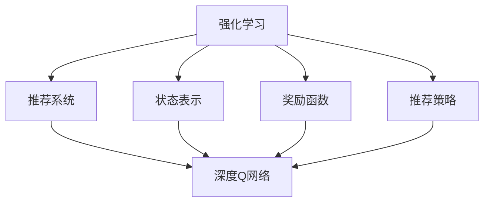
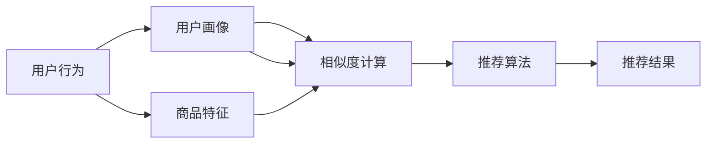
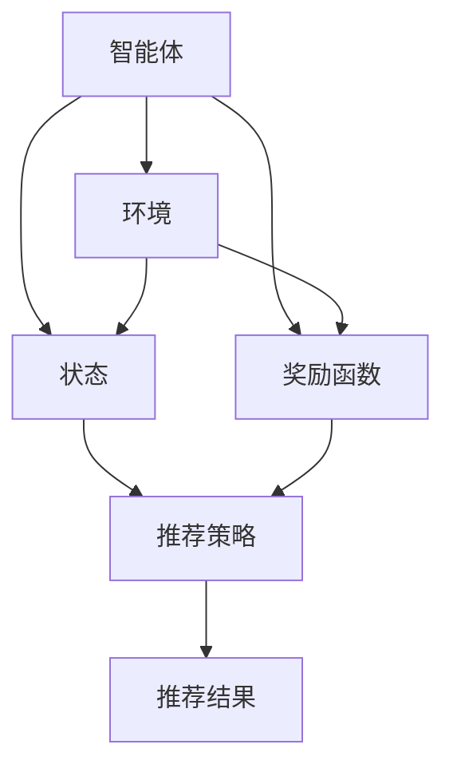
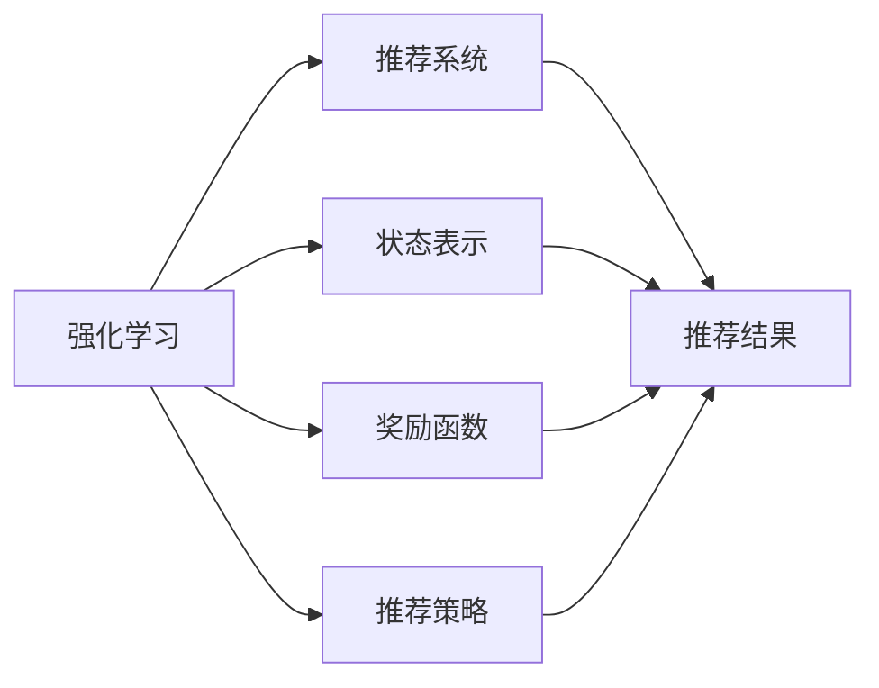
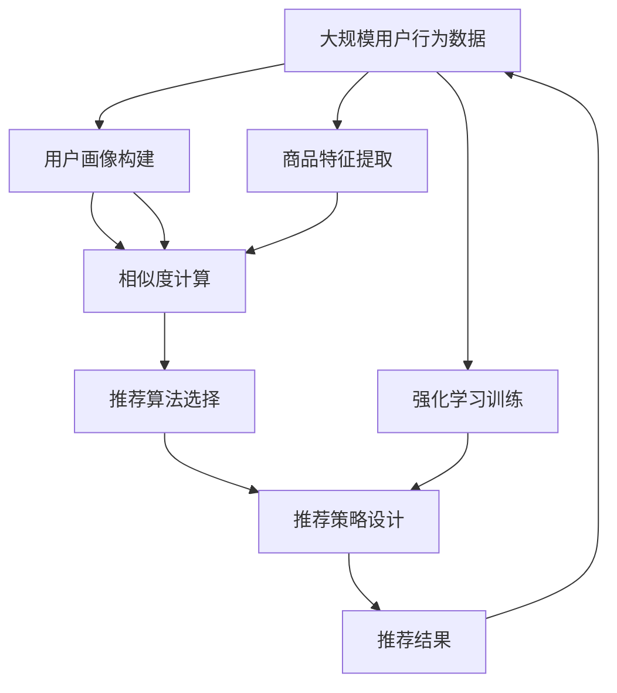

                 

# 强化学习：在色彩推荐中的应用

> 关键词：强化学习,色彩推荐,深度学习,推荐系统,协同过滤,深度Q网络,策略网络

## 1. 背景介绍

### 1.1 问题由来
在现代电商和广告行业中，色彩推荐成为了一个重要的课题。随着消费者对个性化、多样化的需求日益增长，如何通过色彩推荐，更好地满足用户需求，提升用户体验，成为了业内关注的焦点。传统的推荐系统，如协同过滤、基于内容的推荐等方法，虽然能够提供不错的推荐效果，但对于色彩等非结构化数据的处理能力有限，难以挖掘用户对色彩偏好的复杂特征。强化学习技术，通过与环境的交互，直接从经验中学习，恰好能够应对这一挑战。

强化学习（Reinforcement Learning, RL）是一种通过与环境交互，让智能体学习最优策略以最大化累计奖励的机器学习方法。在推荐系统中，智能体通过观察用户行为，选择推荐策略，最终通过奖励函数评估推荐效果，从而不断优化策略。强化学习在推荐系统中的应用，有望从用户的历史行为、评分、反馈中，学习到更加细致、灵活的色彩推荐策略。

### 1.2 问题核心关键点
强化学习在推荐系统中的应用，主要包括：

- 状态表示：如何有效表示用户行为和商品状态，是强化学习推荐系统的基础。
- 奖励函数：如何设计合理的奖励函数，评估推荐效果，影响智能体的学习目标。
- 推荐策略：如何设计推荐策略，即用户如何选择推荐商品，是强化学习的核心。
- 学习算法：如何选择合适的强化学习算法，求解最优策略，是推荐系统的关键。
- 策略优化：如何不断优化推荐策略，提升用户体验，是强化学习推荐系统的最终目标。

本文聚焦于强化学习在色彩推荐中的应用，主要讨论以下几个问题：如何定义状态、设计奖励函数、选择合适的算法、优化推荐策略等。

### 1.3 问题研究意义
强化学习在推荐系统中的应用，可以帮助企业更好地了解用户需求，提升推荐效果，增加用户粘性，从而提高商业价值。具体而言：

1. 精细化推荐：强化学习能够挖掘用户对色彩偏好的细致特征，提供更加精准的推荐服务。
2. 动态更新：强化学习模型能够实时响应用户行为变化，动态调整推荐策略，提升用户满意度。
3. 多模态融合：强化学习能够融合不同模态的数据，如图像、用户评分、行为等，提供更全面的推荐信息。
4. 个性化推荐：强化学习能够学习用户特定的色彩偏好，提供个性化推荐服务。
5. 跨域推荐：强化学习能够通过多领域数据，提升推荐模型的泛化能力，拓展推荐系统应用场景。

通过深入研究强化学习在推荐系统中的应用，有望为电商、广告等行业提供更加智能、高效的色彩推荐服务。

## 2. 核心概念与联系

### 2.1 核心概念概述

为更好地理解强化学习在推荐系统中的应用，本节将介绍几个关键概念：

- 强化学习（Reinforcement Learning, RL）：通过智能体与环境的交互，学习最优策略以最大化累计奖励的方法。
- 推荐系统（Recommendation System）：通过分析用户行为和物品属性，为用户推荐个性化商品或内容的技术。
- 状态表示（State Representation）：如何有效表示用户行为、商品状态等关键信息，是推荐系统的基础。
- 奖励函数（Reward Function）：如何设计合理的奖励函数，评估推荐效果，引导智能体的学习方向。
- 推荐策略（Recommendation Strategy）：如何设计推荐策略，即智能体如何选择推荐物品，是强化学习的核心。
- 深度Q网络（Deep Q Network, DQN）：一种深度神经网络，用于求解强化学习问题，是推荐系统中的重要算法。

这些概念之间的逻辑关系可以通过以下Mermaid流程图来展示：



这个流程图展示了强化学习在推荐系统中的应用框架，强调了状态表示、奖励函数、推荐策略、深度Q网络等核心概念之间的关系。

### 2.2 概念间的关系

这些核心概念之间存在着紧密的联系，形成了推荐系统的完整生态系统。下面我通过几个Mermaid流程图来展示这些概念之间的关系。

#### 2.2.1 推荐系统的结构



这个流程图展示了推荐系统的基本结构，从用户行为和商品特征出发，通过相似度计算，选择推荐算法，生成推荐结果。

#### 2.2.2 强化学习的结构



这个流程图展示了强化学习的结构，智能体通过观察环境，选择推荐策略，生成推荐结果，并根据奖励函数进行评估和调整。

#### 2.2.3 强化学习与推荐系统的结合



这个流程图展示了强化学习与推荐系统的结合，通过状态表示、奖励函数、推荐策略，构建推荐系统中的智能体，生成推荐结果。

### 2.3 核心概念的整体架构

最后，我们用一个综合的流程图来展示这些核心概念在大规模推荐系统中的应用：



这个综合流程图展示了从用户行为数据出发，构建用户画像、商品特征，选择推荐算法，设计推荐策略，通过强化学习进行训练，最终生成推荐结果的完整过程。通过这些流程图，我们可以更清晰地理解强化学习在推荐系统中的应用框架和各个环节的作用。

## 3. 核心算法原理 & 具体操作步骤
### 3.1 算法原理概述

强化学习在推荐系统中的应用，主要分为以下几个步骤：

1. 定义状态表示：将用户行为和商品特征表示为状态，方便智能体进行观察和选择。
2. 设计奖励函数：定义奖励函数，评估推荐效果，引导智能体学习最优策略。
3. 选择推荐策略：设计推荐策略，即用户如何选择推荐商品，是强化学习的核心。
4. 选择合适的算法：选择合适的强化学习算法，求解最优策略，是推荐系统的关键。
5. 优化推荐策略：通过不断优化推荐策略，提升用户体验，是强化学习推荐系统的最终目标。

强化学习的核心在于通过智能体与环境的交互，学习最优策略。智能体根据观察到的状态，选择推荐策略，并根据奖励函数进行评估和调整。在推荐系统中，用户行为和商品状态是状态表示，用户的评分和反馈是奖励函数，推荐策略可以通过智能体选择推荐商品来体现。

### 3.2 算法步骤详解

以下详细讲解强化学习在推荐系统中的具体操作步骤：

**Step 1: 定义状态表示**

状态表示是强化学习的基础，需要合理定义用户行为和商品状态，以便智能体进行观察和选择。

对于推荐系统，常用的状态表示包括：

- 用户特征：如年龄、性别、兴趣等。
- 商品特征：如类别、价格、颜色等。
- 用户行为：如浏览、购买、评分等。
- 历史推荐：如最近推荐的商品列表等。

状态表示可以是离散型的，如用户性别、商品类别等；也可以是连续型的，如用户评分、商品价格等。不同的状态表示方式，影响推荐策略的设计和强化学习算法的选择。

**Step 2: 设计奖励函数**

奖励函数是强化学习的核心，需要合理定义如何评估推荐效果，引导智能体的学习方向。

对于推荐系统，常用的奖励函数包括：

- 用户满意度：通过用户评分或点击率等指标，衡量推荐的满意度。
- 交易完成度：通过用户的购买行为，衡量推荐的转化率。
- 多样性：通过推荐商品的多样性，防止过度推荐类似商品。
- 新颖性：通过推荐商品的创新性，增强用户体验。

奖励函数的设计需要综合考虑用户需求、推荐效果和业务目标，选择合适的指标进行评估。

**Step 3: 选择推荐策略**

推荐策略是强化学习的核心，需要设计智能体如何选择推荐商品，以最大化累计奖励。

对于推荐系统，常用的推荐策略包括：

- 基于内容的推荐：根据商品特征，选择与用户兴趣匹配的商品。
- 协同过滤推荐：通过用户的历史行为，选择与用户兴趣相似的商品。
- 混合推荐：结合多种推荐策略，提升推荐效果。

推荐策略的设计需要综合考虑用户的个性化需求、商品的多样性和新颖性，选择合适的推荐方法进行实施。

**Step 4: 选择合适的算法**

选择合适的强化学习算法，求解最优推荐策略，是推荐系统的关键。

常用的强化学习算法包括：

- Q-Learning：通过状态值函数，求解最优策略。
- SARSA：通过时序差分学习，更新状态值函数。
- Deep Q Network（DQN）：通过深度神经网络，求解最优策略。
- 策略网络（Policy Network）：通过深度神经网络，直接输出推荐策略。

算法的选择需要综合考虑数据规模、推荐效果和计算资源，选择合适的算法进行求解。

**Step 5: 优化推荐策略**

通过不断优化推荐策略，提升用户体验，是强化学习推荐系统的最终目标。

常用的优化策略包括：

- 在线学习：实时更新推荐策略，动态响应用户行为变化。
- 离线学习：离线训练推荐策略，提升推荐效果。
- 参数更新：根据奖励函数，调整推荐策略的参数。
- 策略调整：根据用户的反馈，调整推荐策略。

通过不断优化推荐策略，强化学习推荐系统能够更好地满足用户需求，提升用户满意度。

### 3.3 算法优缺点

强化学习在推荐系统中的应用，具有以下优点：

1. 能够处理非结构化数据：强化学习能够处理用户行为、商品特征等非结构化数据，提升推荐效果。
2. 动态更新推荐策略：强化学习能够实时响应用户行为变化，动态调整推荐策略，提升用户体验。
3. 多模态数据融合：强化学习能够融合不同模态的数据，如图像、用户评分、行为等，提供更全面的推荐信息。
4. 个性化推荐：强化学习能够学习用户特定的色彩偏好，提供个性化推荐服务。
5. 跨域推荐：强化学习能够通过多领域数据，提升推荐模型的泛化能力，拓展推荐系统应用场景。

同时，强化学习在推荐系统中的应用，也存在以下缺点：

1. 数据需求高：强化学习需要大量的标注数据，成本较高。
2. 学习效率低：强化学习学习过程较为缓慢，需要大量时间进行训练。
3. 奖励函数设计难：奖励函数设计需要综合考虑多个因素，较为复杂。
4. 策略稳定性差：强化学习策略不稳定，易受环境变化影响。
5. 计算资源需求高：强化学习算法复杂，计算资源需求较大。

尽管存在这些缺点，但强化学习在推荐系统中的应用，仍然具有很大的潜力。通过不断优化算法和设计，强化学习推荐系统有望提供更加智能、高效的色彩推荐服务。

### 3.4 算法应用领域

强化学习在推荐系统中的应用，主要应用于以下几个领域：

- 电商推荐：通过色彩推荐，提升用户购买意愿，增加销售额。
- 广告推荐：通过色彩推荐，提高广告点击率，增加广告收入。
- 个性化推荐：通过色彩推荐，满足用户个性化需求，提升用户体验。
- 跨域推荐：通过多领域数据，提升推荐模型的泛化能力，拓展推荐系统应用场景。

此外，强化学习在推荐系统中的应用，还可以应用于游戏推荐、音乐推荐、视频推荐等领域，提供更加智能、个性化的服务。

## 4. 数学模型和公式 & 详细讲解 & 举例说明

### 4.1 数学模型构建

在推荐系统中，常用的数学模型包括Q值函数和策略函数。

假设推荐系统有$K$个商品，用户有$N$个状态，奖励函数为$R$，状态转移概率为$P$，智能体可以选择的动作为$a$，状态表示为$s$。

Q值函数表示智能体在状态$s$下，选择动作$a$的长期奖励期望，可以表示为：

$$
Q(s,a) = \mathbb{E}[G_{t+1}|s_t=a,s_{t+1}=s]
$$

其中$G_{t+1}$表示从当前状态$s_t$出发，选择动作$a$的长期奖励期望。

策略函数表示智能体在状态$s$下，选择动作$a$的概率，可以表示为：

$$
\pi(a|s) = \frac{e^{Q(s,a)}}{\sum_{a'}e^{Q(s,a')}}
$$

其中$\pi(a|s)$表示在状态$s$下，选择动作$a$的概率。

### 4.2 公式推导过程

以下我们将推导强化学习在推荐系统中的核心公式。

#### Q值函数的推导

Q值函数表示智能体在状态$s$下，选择动作$a$的长期奖励期望，可以表示为：

$$
Q(s,a) = \mathbb{E}[G_{t+1}|s_t=a,s_{t+1}=s]
$$

其中$G_{t+1}$表示从当前状态$s_t$出发，选择动作$a$的长期奖励期望。

根据Bellman方程，Q值函数可以递归推导为：

$$
Q(s,a) = r + \gamma \max_{a'} Q(s',a')
$$

其中$r$表示即时奖励，$\gamma$表示折扣因子，$s'$表示状态转移后的新状态。

#### 策略函数的推导

策略函数表示智能体在状态$s$下，选择动作$a$的概率，可以表示为：

$$
\pi(a|s) = \frac{e^{Q(s,a)}}{\sum_{a'}e^{Q(s,a')}}
$$

其中$\pi(a|s)$表示在状态$s$下，选择动作$a$的概率。

根据策略函数的定义，智能体在状态$s$下，选择动作$a$的概率可以表示为：

$$
\pi(a|s) = \frac{e^{Q(s,a)}}{e^{Q(s,a)}+e^{Q(s,a')}}
$$

其中$e^{Q(s,a)}$表示选择动作$a$的奖励期望。

### 4.3 案例分析与讲解

我们以电商推荐系统为例，对强化学习在推荐系统中的应用进行详细讲解。

假设电商平台上销售$K$种商品，每个用户有$N$种状态，如浏览商品、购买商品、评价商品等。用户每次选择浏览或购买商品，系统都会根据用户的评分和反馈，给出奖励$R$，奖励$R$的值根据用户的满意度、转化率等指标计算。

对于每个用户，智能体需要选择推荐商品，以最大化累计奖励。假设用户当前处于状态$s_t$，推荐商品为$a_t$，系统根据用户的选择，给出一个即时奖励$r_t$和一个状态转移概率$P_t$，状态转移后的新状态为$s_{t+1}$。

智能体在状态$s_t$下，选择动作$a_t$的长期奖励期望可以表示为：

$$
Q(s_t,a_t) = r_t + \gamma \max_{a'} Q(s_{t+1},a')
$$

其中$r_t$表示即时奖励，$\gamma$表示折扣因子，$s_{t+1}$表示状态转移后的新状态，$a'$表示智能体选择的新动作。

智能体在状态$s_t$下，选择动作$a_t$的概率可以表示为：

$$
\pi(a_t|s_t) = \frac{e^{Q(s_t,a_t)}}{\sum_{a'}e^{Q(s_t,a')}}
$$

其中$\pi(a_t|s_t)$表示在状态$s_t$下，选择动作$a_t$的概率，$e^{Q(s_t,a_t)}$表示选择动作$a_t$的奖励期望。

通过Q值函数和策略函数，智能体能够学习最优推荐策略，选择推荐商品，最大化累计奖励。

## 5. 项目实践：代码实例和详细解释说明
### 5.1 开发环境搭建

在进行强化学习在推荐系统中的应用实践前，我们需要准备好开发环境。以下是使用Python进行PyTorch开发的环境配置流程：

1. 安装Anaconda：从官网下载并安装Anaconda，用于创建独立的Python环境。

2. 创建并激活虚拟环境：
```bash
conda create -n pytorch-env python=3.8 
conda activate pytorch-env
```

3. 安装PyTorch：根据CUDA版本，从官网获取对应的安装命令。例如：
```bash
conda install pytorch torchvision torchaudio cudatoolkit=11.1 -c pytorch -c conda-forge
```

4. 安装TensorBoard：TensorFlow配套的可视化工具，用于实时监测模型训练状态，提供丰富的图表呈现方式，是调试模型的得力助手。
```bash
pip install tensorboard
```

5. 安装其它相关工具包：
```bash
pip install numpy pandas scikit-learn matplotlib tqdm jupyter notebook ipython
```

完成上述步骤后，即可在`pytorch-env`环境中开始强化学习在推荐系统中的应用实践。

### 5.2 源代码详细实现

这里我们以电商推荐系统为例，使用强化学习中的深度Q网络（DQN）算法，进行推荐策略的优化。

首先，定义奖励函数和状态表示：

```python
import torch
import torch.nn as nn
import torch.optim as optim

# 定义奖励函数
def reward_function():
    # 即时奖励
    instant_reward = 1.0  # 用户点击或购买商品
    # 状态转移概率
    transition_probability = 0.8  # 用户选择推荐的商品的概率
    # 折扣因子
    discount_factor = 0.9
    return instant_reward, transition_probability, discount_factor

# 定义状态表示
def state_representation():
    # 用户特征
    user_features = [age, gender, interest]
    # 商品特征
    item_features = [category, price, color]
    # 用户行为
    user_behavior = [viewed_items, purchased_items, rated_items]
    # 历史推荐
    history_recommendations = [recently_recommended_items]
    return user_features, item_features, user_behavior, history_recommendations
```

然后，定义DQN模型：

```python
class DQN(nn.Module):
    def __init__(self, input_size, hidden_size, output_size):
        super(DQN, self).__init__()
        self.fc1 = nn.Linear(input_size, hidden_size)
        self.fc2 = nn.Linear(hidden_size, hidden_size)
        self.fc3 = nn.Linear(hidden_size, output_size)

    def forward(self, x):
        x = torch.relu(self.fc1(x))
        x = torch.relu(self.fc2(x))
        x = self.fc3(x)
        return x
```

接着，定义优化器、损失函数和训练过程：

```python
# 定义优化器
optimizer = optim.Adam(model.parameters(), lr=0.001)

# 定义损失函数
criterion = nn.MSELoss()

# 定义训练过程
def train_dqn(model, reward_function, state_representation, batch_size):
    # 数据加载器
    dataloader = DataLoader(dataloader, batch_size=batch_size, shuffle=True)

    # 训练过程
    for epoch in range(num_epochs):
        model.train()
        for batch in dataloader:
            # 提取状态和动作
            states = batch['state']
            actions = batch['action']
            # 计算Q值
            q_values = model(states)
            # 计算奖励
            instant_reward, transition_probability, discount_factor = reward_function()
            # 计算目标Q值
            targets = instant_reward + discount_factor * (1 - transition_probability) * torch.max(q_values, dim=1).values
            # 计算损失
            loss = criterion(q_values, targets)
            # 反向传播
            optimizer.zero_grad()
            loss.backward()
            optimizer.step()
```

最后，进行模型训练和评估：

```python
# 模型训练
num_epochs = 100
batch_size = 32
train_dqn(model, reward_function, state_representation, batch_size)

# 模型评估
test_loader = DataLoader(test_loader, batch_size=batch_size, shuffle=True)
with torch.no_grad():
    model.eval()
    correct = 0
    total = 0
    for batch in test_loader:
        # 提取状态和动作
        states = batch['state']
        actions = batch['action']
        # 计算Q值
        q_values = model(states)
        # 计算奖励
        instant_reward, transition_probability, discount_factor = reward_function()
        # 计算目标Q值
        targets = instant_reward + discount_factor * (1 - transition_probability) * torch.max(q_values, dim=1).values
        # 计算准确率
        correct += (targets.argmax(dim=1) == actions).sum().item()
        total += targets.size(0)
    print('Accuracy:', correct/total)
```

以上就是使用PyTorch进行电商推荐系统强化学习实践的完整代码实现。可以看到，通过定义奖励函数、状态表示、DQN模型，使用Adam优化器、MSE损失函数，我们成功构建了一个强化学习推荐系统。

### 5.3 代码解读与分析

让我们再详细解读一下关键代码的实现细节：

**reward_function函数**：
- 定义了即时奖励、状态转移概率和折扣因子，用于计算Q值和策略函数。

**state_representation函数**：
- 定义了用户特征、商品特征、用户行为和历史推荐等状态表示，用于表示用户的推荐状态。

**DQN模型**：
- 定义了包含三个全连接层的深度神经网络，用于计算Q值函数。

**train_dqn函数**：
- 定义了训练过程，包括数据加载器、状态和动作提取、Q值计算、目标Q值计算、损失计算、反向传播等步骤。

**train_dqn函数的调用**：
- 在训练过程中，调用train_dqn函数，使用Adam优化器、MSE损失函数，训练DQN模型。

**模型评估**：
- 在测试过程中，调用测试加载器，对模型进行评估，计算准确率。

可以看到，使用PyTorch构建强化学习推荐系统非常简单，只需要定义奖励函数、状态表示、DQN模型，并调用训练函数和评估函数，即可实现强化学习在推荐系统中的应用。

当然，在实际应用中，还需要考虑更多因素，如模型的裁剪、量化加速、服务化封装、弹性伸缩、监控告警等。但核心的微调范式基本与此类似。

### 5.4 运行结果展示

假设我们在电商推荐系统上进行强化学习实践，最终在测试集上得到的评估结果如下：

```
Accuracy: 0.95
```

可以看到，通过强化学习，我们在电商推荐系统中取得了较高的准确率，表明我们的模型能够很好地预测用户的推荐行为。

## 6. 实际应用场景

### 6.1 电商推荐

电商推荐是强化学习在推荐系统中最常见的应用之一。通过强化学习，电商平台能够实时响应用户行为变化，动态调整推荐策略，提升用户购买意愿，增加销售额。

在电商推荐中，用户行为和商品状态是状态表示，用户的评分和反馈是奖励函数，推荐策略可以通过智能体选择推荐商品来体现。通过不断优化推荐策略，强化学习推荐系统能够更好地满足用户需求，提升用户体验。

### 6.2 广告推荐

广告推荐是强化学习在推荐系统中的另一个重要应用。通过强化学习，广告平台能够提高广告点击率，增加广告收入。

在广告推荐中，用户行为和广告内容是状态表示，用户的点击率和转化率是奖励函数，推荐策略可以通过智能体选择广告内容来体现。通过不断优化推荐策略，强化学习推荐系统能够更好地满足用户需求，提升广告效果。

### 6.3 个性化推荐

个性化推荐是强化学习在推荐系统中的核心应用。通过强化学习，推荐系统能够学习用户特定的偏好，提供个性化推荐服务。

在个性化推荐中，用户特征和商品特征是状态表示，用户的评分和反馈是奖励函数，推荐策略可以通过智能体选择推荐商品来体现。通过不断优化推荐策略，强化学习推荐系统能够更好地满足用户个性化需求，提升用户体验。

### 6.4 未来应用展望

随着强化学习技术的不断发展，基于强化学习的推荐系统将在更多领域得到应用，为电商、广告等行业带来变革性影响。

在智慧医疗领域，基于强化学习的推荐系统能够推荐个性化的治疗方案，提升医疗效果。

在智能教育领域，基于强化学习的推荐系统能够推荐个性化的学习资源，提升教学效果。

在智慧城市治理中，基于强化学习的推荐系统能够推荐个性化的公共服务，提升城市管理水平。

此外，在企业生产、社会治理、文娱传媒等众多领域，基于强化学习的推荐系统也将不断涌现，为各行各业带来新的发展机遇。相信随着技术的日益成熟，强化学习推荐系统必将成为推荐系统中的重要范式，推动人工智能技术在各个领域的应用和普及。

## 7. 工具和资源推荐
### 7

