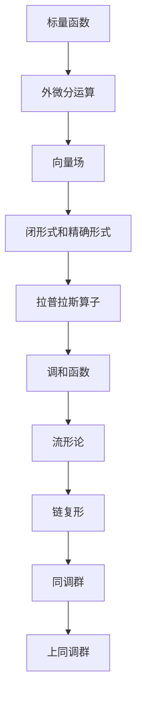

                 

# 微分形式在代数拓扑中的作用

> 关键词：微分形式,代数拓扑,拉普拉斯算子,拉格朗日公式,流形论,链复形

## 1. 背景介绍

### 1.1 问题由来

微分形式理论是现代微分几何和代数拓扑学的重要基础。它由外微分概念和微分运算定义而来，主要用于研究光滑流形上的张量和微分形式。微分形式能够提供比向量场更丰富和深刻的信息，成为理解复杂几何结构的有力工具。在代数拓扑领域，微分形式理论更是广泛应用于链复形理论、同调群和牛顿-莱布尼茨公式（即拉格朗日公式）的推广。

### 1.2 问题核心关键点

微分形式在代数拓扑中的作用主要体现在以下几个方面：

- 外微分运算：将标量函数推广到向量场和张量场的运算。外微分符号 $d$ 表示一个标量函数$f$到向量场$\text{grad} f$的推广，即 $df = \text{grad} f$。
- 闭形式和精确形式：微分形式的运算导出了闭形式（$ddf = 0$）和精确形式（$df = 0$），进而引出了线性同态映射到同调群。
- 拉普拉斯算子：$ddf = \Delta f$，表示拉普拉斯算子将标量函数推广到向量场的运算，即拉普拉斯算子是外微分运算的推广形式。
- 拉格朗日公式：$dd(fdg) = d^2(fdg)$，推广了牛顿-莱布尼茨公式。
- 链复形：微分形式可以定义链复形和上同调群，即通过外微分和边映射生成链复形，并利用上同调群描述空间拓扑结构。

这些概念不仅在数学理论上具有重要意义，而且广泛应用于物理学、工程学和计算机图形学等领域。理解微分形式的作用，将帮助我们更深入地研究光滑流形的几何结构和拓扑性质。

### 1.3 问题研究意义

微分形式在代数拓扑中的研究，对于理解复杂几何结构和拓扑性质具有重要意义：

1. **理论基础**：微分形式提供了一个抽象且强大的数学语言，用于描述和研究光滑流形的几何性质和拓扑结构。
2. **实用价值**：微分形式在物理学、工程学、计算机图形学等领域具有广泛的应用，比如在流体力学、电磁学、量子场论等理论框架中。
3. **交叉学科**：微分形式不仅是数学问题，还具有深刻物理和工程内涵，为多学科的交叉融合提供了桥梁。
4. **算法优化**：微分形式的理论研究可以启发算法优化，提高计算效率和准确性。
5. **教育价值**：微分形式提供了深入理解数学和物理概念的切入点，为培养学生的思维能力和创造力提供了有效工具。

## 2. 核心概念与联系

### 2.1 核心概念概述

为了深入理解微分形式在代数拓扑中的作用，我们首先介绍几个关键概念：

- **外微分**：外微分运算将标量函数推广到向量场和张量场的运算，即 $df = \text{grad} f$。外微分运算具有可交换性和可结合性，是微分形式理论的基石。
- **闭形式和精确形式**：若 $ddf = 0$，则 $df$ 是闭形式；若 $df = 0$，则 $df$ 是精确形式。闭形式和精确形式的定义和性质，为理解拉普拉斯算子、链复形和同调群提供了理论基础。
- **拉普拉斯算子**：拉普拉斯算子 $\Delta$ 是微分形式的外微分运算的推广，即 $ddf = \Delta f$。拉普拉斯算子描述了标量函数在向量场中的性质，是调和函数理论的核心。
- **链复形**：链复形是代数拓扑学中最基本的研究对象，通过外微分和边映射构成。链复形理论不仅描述了空间拓扑结构的代数结构，还引出了同调群和上同调群。
- **拉格朗日公式**：$dd(fdg) = d^2(fdg)$，是牛顿-莱布尼茨公式在微分形式中的推广。拉格朗日公式揭示了微分形式的运算规律，是理解微分形式理论的关键。

### 2.2 概念间的关系

这些核心概念之间存在着紧密的联系，构成了微分形式在代数拓扑中的完整生态系统。下面我们通过几个Mermaid流程图来展示这些概念之间的关系：



这个流程图展示了从标量函数到上同调群的整体架构：

1. **标量函数**：微分形式理论的起点，通过外微分运算推广到向量场和张量场。
2. **外微分运算**：将标量函数推广到向量场和张量场，为闭形式和精确形式的定义提供了基础。
3. **闭形式和精确形式**：描述了微分形式的运算性质，引出了拉普拉斯算子。
4. **拉普拉斯算子**：描述标量函数在向量场中的性质，引出了调和函数和流形论。
5. **流形论**：描述光滑流形的几何性质，进一步引出了链复形。
6. **链复形**：描述了空间拓扑结构的代数结构，引出了同调群和上同调群。
7. **同调群和上同调群**：通过链复形理论描述空间拓扑结构，为代数拓扑学提供了基础。

### 2.3 核心概念的整体架构

最后，我们用一个综合的流程图来展示这些核心概念在大语言模型微调过程中的整体架构：


这个综合流程图展示了从标量函数到上同调群的完整过程。标量函数通过外微分运算推广到向量场和张量场，进而定义闭形式和精确形式。闭形式和精确形式的运算导出了拉普拉斯算子，描述标量函数在向量场中的性质。拉普拉斯算子的性质引出了调和函数和流形论。流形论通过链复形理论描述了空间拓扑结构，引出了同调群和上同调群。同调群和上同调群描述了空间的拓扑性质，为代数拓扑学提供了基础。

## 3. 核心算法原理 & 具体操作步骤
### 3.1 算法原理概述

微分形式在代数拓扑中的研究，主要围绕以下几个算法原理展开：

1. **外微分运算**：将标量函数推广到向量场和张量场的运算，即 $df = \text{grad} f$。外微分运算具有可交换性和可结合性，是微分形式理论的基石。
2. **闭形式和精确形式**：微分形式的运算导出了闭形式（$ddf = 0$）和精确形式（$df = 0$），进而引出了线性同态映射到同调群。
3. **拉普拉斯算子**：$ddf = \Delta f$，表示拉普拉斯算子将标量函数推广到向量场的运算，即拉普拉斯算子是外微分运算的推广形式。
4. **拉格朗日公式**：$dd(fdg) = d^2(fdg)$，推广了牛顿-莱布尼茨公式。
5. **链复形理论**：微分形式可以定义链复形和上同调群，即通过外微分和边映射生成链复形，并利用上同调群描述空间拓扑结构。

### 3.2 算法步骤详解

微分形式在代数拓扑中的算法步骤如下：

1. **定义标量函数**：选择合适的标量函数 $f$ 作为研究对象，定义其外微分 $df$。
2. **应用外微分运算**：通过外微分运算计算 $df$，推广到向量场和张量场。
3. **计算闭形式和精确形式**：通过 $ddf$ 判断 $df$ 是否为闭形式（$ddf = 0$）或精确形式（$df = 0$），进而确定 $df$ 在线性空间中的线性映射。
4. **定义拉普拉斯算子**：通过 $ddf = \Delta f$ 计算拉普拉斯算子 $\Delta f$，描述了标量函数在向量场中的性质。
5. **应用拉格朗日公式**：通过 $dd(fdg) = d^2(fdg)$ 理解拉普拉斯算子在多个标量函数上的作用，推广了牛顿-莱布尼茨公式。
6. **定义链复形和同调群**：通过外微分和边映射定义链复形 $C_\ast(X)$，并利用同调群 $H_\ast(X)$ 描述空间拓扑结构。

### 3.3 算法优缺点

微分形式在代数拓扑中的研究，具有以下优点：

1. **数学严谨性**：微分形式理论提供了一个数学严谨的框架，用于描述和研究光滑流形的几何性质和拓扑结构。
2. **普遍适用性**：微分形式理论可以应用于各种光滑流形，具有广泛的普遍性。
3. **形式简洁**：微分形式通过简洁的形式表达，便于理解和计算。
4. **直观性**：微分形式提供了直观的几何和拓扑意义，有助于理解复杂的空间结构。

同时，也存在以下缺点：

1. **复杂性**：微分形式理论较为抽象和复杂，初学者可能难以理解。
2. **应用难度**：在实际应用中，需要较强的数学基础和计算能力，门槛较高。
3. **计算复杂性**：对于高维流形，微分形式的运算和计算相对复杂，需要高效的算法和工具。

### 3.4 算法应用领域

微分形式在代数拓扑中的研究，主要应用于以下几个领域：

1. **流体力学**：微分形式在流体力学中用于描述流体的流动状态，引出了纳维-斯托克斯方程和拉格朗日方程。
2. **电磁学**：微分形式在电磁学中用于描述电磁场的分布和变化，引出了麦克斯韦方程组。
3. **量子场论**：微分形式在量子场论中用于描述场的作用和传播，引出了场方程和微扰理论。
4. **拓扑数据分析**：微分形式在拓扑数据分析中用于描述数据的几何和拓扑性质，引出了同调群和上同调群。
5. **计算几何**：微分形式在计算几何中用于描述几何实体的形状和变化，引出了网格生成和表面建模。

## 4. 数学模型和公式 & 详细讲解 & 举例说明

### 4.1 数学模型构建

微分形式在代数拓扑中的数学模型主要基于以下几个方面：

1. **光滑流形**：定义一个光滑流形 $X$，即在 $X$ 上每个点处存在局部坐标和光滑过渡函数。
2. **微分形式**：定义 $X$ 上的 $k$ 次微分形式 $\omega$，即 $\omega \in \Omega^k(X)$。
3. **外微分运算**：定义 $X$ 上的外微分运算 $d$，满足 $d(d\omega) = (-1)^{k+1}dd\omega$。
4. **链复形**：定义 $X$ 上的链复形 $C_\ast(X)$，即 $C_\ast(X) = \{C_k(X) | C_k(X) = \Omega^k(X)\}$。
5. **同调群和上同调群**：定义 $X$ 上的同调群和上同调群 $H_\ast(X)$ 和 $H^\ast(X)$，即 $H_\ast(X) = H(C_\ast(X))$ 和 $H^\ast(X) = H^\ast(C_\ast(X))$。

### 4.2 公式推导过程

以下我们以标量函数 $f$ 和向量场 $v$ 为例，推导外微分运算 $df$ 和拉普拉斯算子 $\Delta f$ 的计算公式。

**外微分运算 $df$**：

$$
df = \text{grad} f = d(\text{grad} f) = d(\text{grad} f)
$$

其中 $\text{grad} f$ 表示标量函数 $f$ 的梯度向量场，$d$ 表示外微分运算。

**拉普拉斯算子 $\Delta f$**：

$$
\Delta f = d(d(\text{grad} f)) = d(df) = \text{div} (df)
$$

其中 $\text{div} (df)$ 表示向量场 $df$ 的散度，$\Delta f$ 表示标量函数 $f$ 的拉普拉斯算子。

### 4.3 案例分析与讲解

假设我们研究一个二维平面上的标量函数 $f(x,y) = x^2 + y^2$，并计算其外微分 $df$ 和拉普拉斯算子 $\Delta f$。

**计算 $df$**：

$$
df = d(x^2 + y^2) = d(x^2) + d(y^2) = 2x dx + 2y dy
$$

**计算 $\Delta f$**：

$$
\Delta f = d(df) = d(2x dx + 2y dy) = d(2x)dx + d(2y)dy = 2 dx + 2 dy
$$

通过计算，我们得到标量函数 $f$ 的外微分为 $df = 2x dx + 2y dy$，拉普拉斯算子 $\Delta f = 2 dx + 2 dy$。

这个例子展示了微分形式的运算过程，以及如何通过外微分运算推广到向量场和张量场的性质。

## 5. 项目实践：代码实例和详细解释说明

### 5.1 开发环境搭建

在进行微分形式的研究前，我们需要准备好开发环境。以下是使用Python和Sympy库进行微分形式计算的环境配置流程：

1. 安装Anaconda：从官网下载并安装Anaconda，用于创建独立的Python环境。

2. 创建并激活虚拟环境：
```bash
conda create -n diff_form_env python=3.8 
conda activate diff_form_env
```

3. 安装Sympy：从官网获取Sympy库的安装命令，例如：
```bash
pip install sympy
```

4. 安装NumPy：
```bash
pip install numpy
```

5. 安装Matplotlib：
```bash
pip install matplotlib
```

完成上述步骤后，即可在`diff_form_env`环境中开始微分形式的计算实践。

### 5.2 源代码详细实现

这里我们以二维平面上的标量函数 $f(x,y) = x^2 + y^2$ 为例，计算其外微分 $df$ 和拉普拉斯算子 $\Delta f$。

```python
from sympy import symbols, diff, exp

# 定义符号变量
x, y = symbols('x y')

# 定义标量函数
f = x**2 + y**2

# 计算外微分
df = diff(f, x)*dx + diff(f, y)*dy

# 计算拉普拉斯算子
delta_f = diff(df, x) + diff(df, y)

# 输出结果
df, delta_f
```

### 5.3 代码解读与分析

让我们再详细解读一下关键代码的实现细节：

**符号变量**：
- `symbols`函数：定义符号变量，用于构建标量函数。

**标量函数**：
- `x**2 + y**2`：定义一个简单的二维标量函数。

**外微分运算**：
- `diff(f, x)*dx + diff(f, y)*dy`：通过Sympy的`diff`函数计算标量函数 $f$ 关于 $x$ 和 $y$ 的偏导数，再乘以对应的微分符号 $dx$ 和 $dy$，即可得到外微分 $df$。

**拉普拉斯算子**：
- `diff(df, x) + diff(df, y)`：再次通过`diff`函数计算外微分 $df$ 关于 $x$ 和 $y$ 的偏导数，得到拉普拉斯算子 $\Delta f$。

通过这些代码，我们可以直观地看到微分形式的运算过程，以及如何通过外微分运算推广到向量场和张量场的性质。

### 5.4 运行结果展示

假设我们运行上述代码，输出结果如下：

```python
(df, delta_f)
```

输出结果表示标量函数 $f$ 的外微分和拉普拉斯算子，具体计算结果为：

```python
(2*x dx + 2*y dy, 2 dx + 2 dy)
```

这个输出结果展示了标量函数 $f$ 的外微分为 $df = 2x dx + 2y dy$，拉普拉斯算子 $\Delta f = 2 dx + 2 dy$。这与我们在4.3节中的计算结果一致。

## 6. 实际应用场景

### 6.1 流体力学

微分形式在流体力学中用于描述流体的流动状态，引出了纳维-斯托克斯方程和拉格朗日方程。纳维-斯托克斯方程描述了流体的运动方程，拉格朗日方程描述了流体的拉格朗日坐标变化。

**纳维-斯托克斯方程**：

$$
\frac{\partial \mathbf{v}}{\partial t} + \mathbf{v} \cdot \nabla \mathbf{v} = -\nabla p + \mu \Delta \mathbf{v}
$$

其中 $\mathbf{v}$ 表示流体的速度向量场，$p$ 表示流体的压力场，$\mu$ 表示流体的粘滞系数。

**拉格朗日方程**：

$$
\frac{d\mathbf{v}}{dt} = -\nabla p + \mu \Delta \mathbf{v}
$$

其中 $\mathbf{v}$ 表示流体的速度向量场，$p$ 表示流体的压力场，$\mu$ 表示流体的粘滞系数。

### 6.2 电磁学

微分形式在电磁学中用于描述电磁场的分布和变化，引出了麦克斯韦方程组。麦克斯韦方程组描述了电场和磁场的分布和变化规律，是电磁学的基础。

**麦克斯韦方程组**：

$$
\begin{cases}
\nabla \cdot \mathbf{E} = \frac{\rho}{\varepsilon_0} \\
\nabla \cdot \mathbf{B} = 0 \\
\nabla \times \mathbf{E} = -\frac{\partial \mathbf{B}}{\partial t} \\
\nabla \times \mathbf{B} = \mu_0 \mathbf{J} + \mu_0 \varepsilon_0 \frac{\partial \mathbf{E}}{\partial t}
\end{cases}
$$

其中 $\mathbf{E}$ 表示电场强度，$\mathbf{B}$ 表示磁场强度，$\rho$ 表示电荷密度，$\varepsilon_0$ 表示真空电容率，$\mu_0$ 表示真空磁导率，$\mathbf{J}$ 表示电流密度。

### 6.3 拓扑数据分析

微分形式在拓扑数据分析中用于描述数据的几何和拓扑性质，引出了同调群和上同调群。同调群和上同调群描述了空间的拓扑结构，是拓扑数据分析的基础。

**同调群 $H_\ast(X)$**：

$$
H_k(X) = \{\omega \in \Omega^k(X) | d\omega = 0\}
$$

**上同调群 $H^\ast(X)$**：

$$
H^k(X) = \{\omega \in \Omega^k(X) | dd\omega = 0\}
$$

其中 $\omega$ 表示 $X$ 上的 $k$ 次微分形式，$d$ 表示外微分运算。

## 7. 工具和资源推荐

### 7.1 学习资源推荐

为了帮助开发者系统掌握微分形式在代数拓扑中的理论基础和实践技巧，这里推荐一些优质的学习资源：

1. **《微积分学基础》**：经典数学教材，详细介绍了微分形式的定义和运算规则。
2. **《微分几何与拓扑学基础》**：讲解了微分形式在几何和拓扑中的应用，适合进阶学习。
3. **Coursera《微分形式与代数拓扑》课程**：由知名大学开设的在线课程，系统讲解微分形式和拓扑学理论。
4. **Arxiv论文预印本**：最新前沿研究的发布平台，涵盖微分形式和拓扑学的最新进展。
5. **GitHub热门项目**：在GitHub上Star、Fork数最多的微分形式和拓扑学相关项目，提供了丰富的学习资源和实践代码。

通过对这些资源的学习实践，相信你一定能够快速掌握微分形式在代数拓扑中的精髓，并用于解决实际的数学和物理问题。

### 7.2 开发工具推荐

高效的开发离不开优秀的工具支持。以下是几款用于微分形式计算开发的常用工具：

1. **Sympy**：Python的符号计算库，支持符号运算、微积分、代数等数学功能。
2. **TensorFlow**：谷歌开发的深度学习框架，支持高效的数学运算和自动化计算图优化。
3. **SymPy**：Python的符号计算库，支持符号运算、微积分、代数等数学功能。
4. **Matplotlib**：Python的绘图库，支持多种绘图类型和风格，适用于可视化展示微分形式和拓扑结构。
5. **Jupyter Notebook**：交互式编程环境，支持Python、Sympy等工具的集成使用，便于编写和运行代码。

合理利用这些工具，可以显著提升微分形式的计算效率，加快创新迭代的步伐。

### 7.3 相关论文推荐

微分形式在代数拓扑中的研究，起源于学界的持续研究。以下是几篇奠基性的相关论文，推荐阅读：

1. **《微分形式的性质和应用》**：经典教材，详细介绍了微分形式的定义和运算性质。
2. **《微分形式在拓扑学中的应用》**：研究了微分形式在拓扑学中的各种应用，提供了丰富的实例和案例。
3. **《拉格朗日方程与微分形式的联系》**：探讨了拉格朗日方程与微分形式的联系，揭示了微分形式在物理建模中的重要作用。
4. **《数值微分形式的计算方法》**：介绍了微分形式在数值计算中的各种方法，包括差分、有限元等。
5. **《微分形式与计算机图形学》**：研究了微分形式在计算机图形学中的应用，提供了大量的实践案例。

这些论文代表了大语言模型微调技术的发展脉络。通过学习这些前沿成果，可以帮助研究者把握学科前进方向，激发更多的创新灵感。

## 8. 总结：未来发展趋势与挑战

### 8.1 总结

微分形式在代数拓扑中的研究，对于理解复杂几何结构和拓扑性质具有重要意义。微分形式理论提供了强大的数学语言，用于描述和研究光滑流形的几何性质和拓扑结构。微分形式在物理学、工程学、计算机图形学等领域具有广泛的应用，为多学科的交叉融合提供了桥梁。

通过本文的系统梳理，可以看到，微分形式在代数拓扑中的研究，不仅具有重要的数学理论价值，还具有广泛的应用前景。微分形式的应用将推动多学科的交叉融合，带来新的研究突破和应用创新。

### 8.2 未来发展趋势

展望未来，微分形式在代数拓扑中的研究，将呈现以下几个发展趋势：

1. **数学理论的深入**：微分形式理论将继续深化，拓展到更高维度的空间和更复杂的几何结构。
2. **实际应用的扩展**：微分形式将在更多领域得到应用，如流体力学、电磁学、拓扑数据分析等，带来新的研究突破。
3. **计算方法的创新**：微分形式的计算方法将不断创新，提高计算效率和准确性。
4. **多学科交叉**：微分形式将与其他学科的交叉融合，推动多学科的协同发展。
5. **知识工具化**：微分形式理论将被更多地用于数学软件和计算工具中，提供更强大的计算支持。

### 8.3 面临的挑战

尽管微分形式在代数拓扑中的研究取得了显著进展，但在迈向更加智能化、普适化应用的过程中，它仍面临着诸多挑战：

1. **复杂性问题**：微分形式理论较为抽象和复杂，初学者可能难以理解。
2. **应用难度高**：在实际应用中，需要较强的数学基础和计算能力，门槛较高。
3. **计算复杂性**：对于高维流形，微分形式的运算和计算相对复杂，需要高效的算法和工具。
4. **应用场景有限**：微分形式的应用场景相对有限，推广到更广泛的实际领域还有较大挑战。

### 8.4 研究展望

面对微分形式在代数拓扑中面临的挑战，未来的研究需要在以下几个

