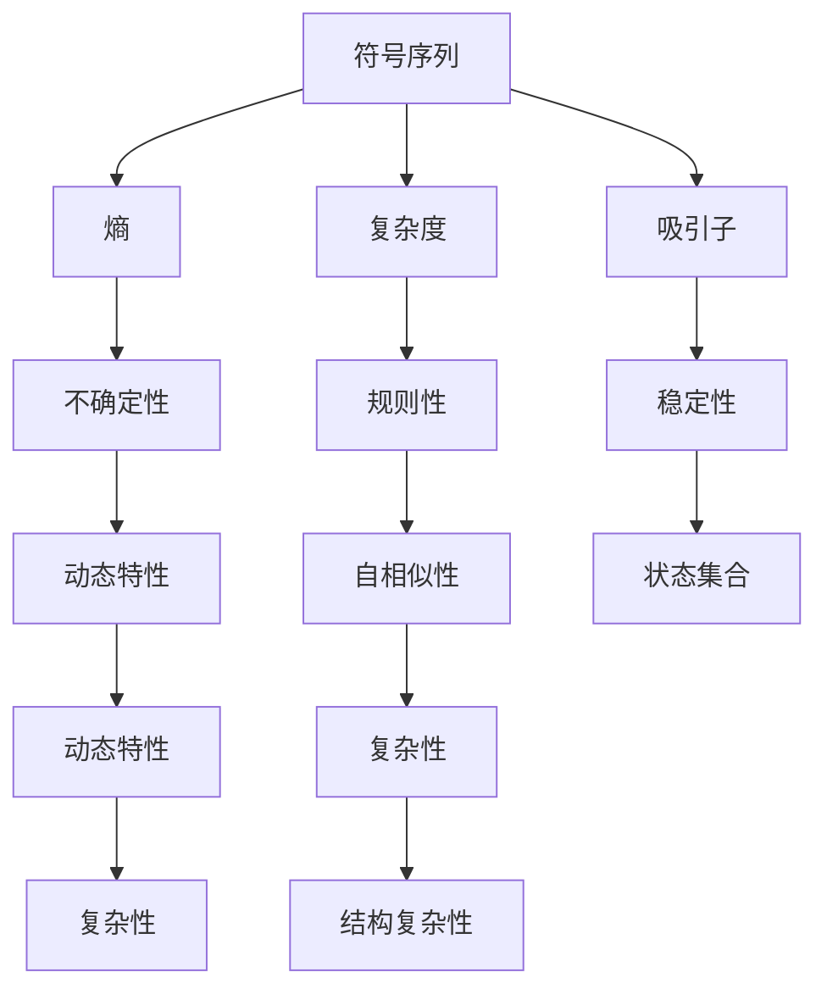
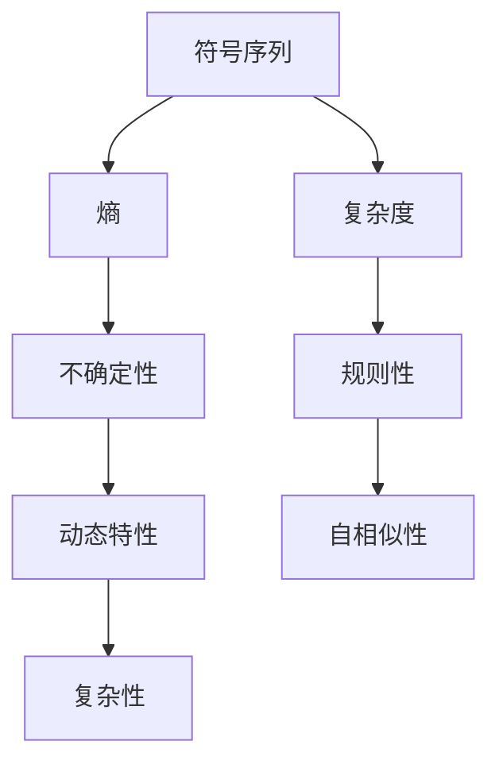
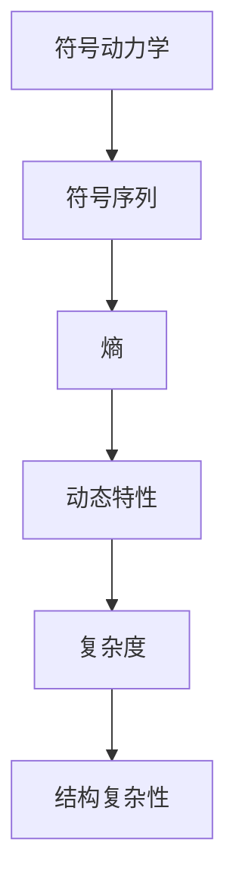
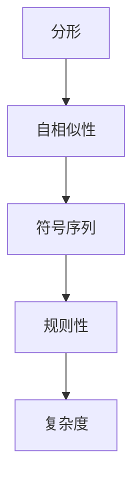
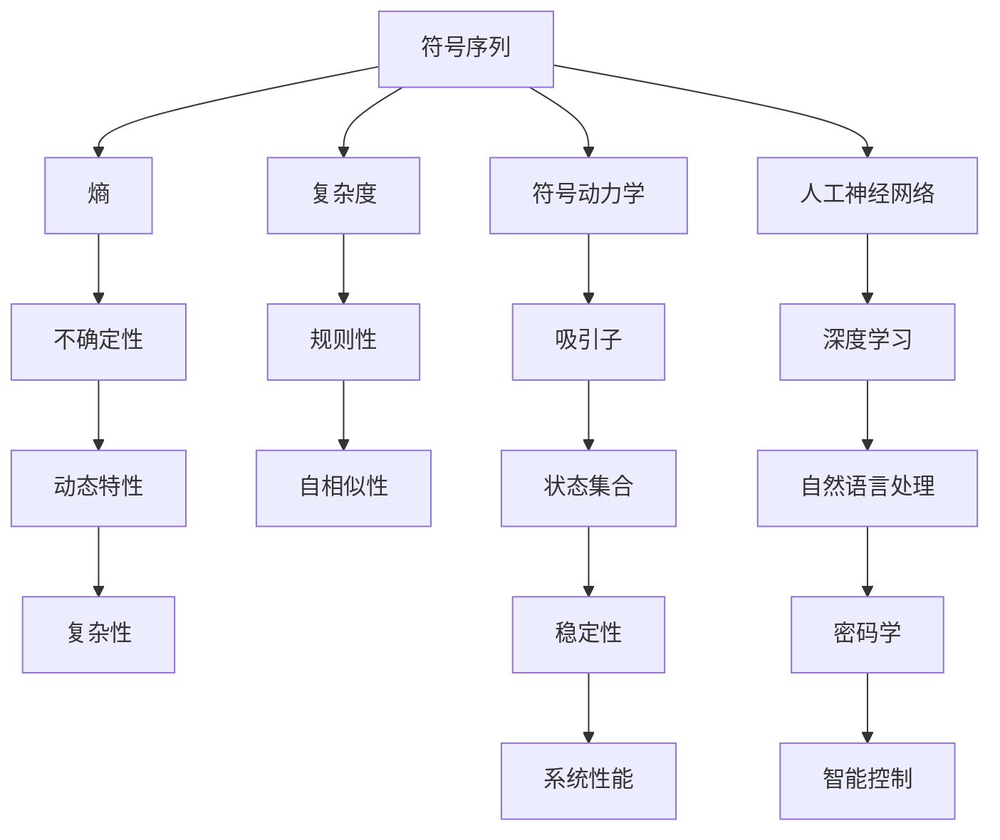

                 

# 拓扑动力学与符号动力学

## 1. 背景介绍

### 1.1 问题由来
拓扑动力学与符号动力学是现代数学的重要分支，与物理、工程、计算机科学等多个领域有着紧密的联系。特别是在计算理论、信息处理、密码学、机器学习等领域，符号动力系统提供了强有力的工具和理论支持。

近年来，随着人工智能的蓬勃发展，符号动力学方法在机器学习、数据挖掘、智能控制、自然语言处理等领域得到了广泛应用。在符号动力学中，符号序列可以看作是离散化的状态转移，通过计算序列的熵、复杂度等指标，能够揭示数据的统计特性和潜在结构。

本文将从符号动力学的基本概念和原理入手，探讨其在现代计算机科学中的应用，尤其是符号序列在人工智能中的应用。我们将重点讨论符号序列与人工神经网络、深度学习、自然语言处理等技术结合的案例，以及它们在密码学、智能控制等领域的应用前景。

### 1.2 问题核心关键点
符号动力学的核心是研究符号序列和动力系统之间的相互作用，通过计算符号序列的熵和复杂度等指标，揭示系统的复杂性和动态特性。这些指标可以用来衡量系统的随机性、稳定性、混沌度等。符号序列在人工智能中的应用主要体现在以下几个方面：

- **特征提取**：将符号序列作为输入，用于训练神经网络等模型，提取数据的特征。
- **时间序列分析**：利用符号序列的统计特性，对时间序列数据进行建模和预测。
- **智能控制**：通过符号序列来优化控制系统的性能，实现复杂系统的智能控制。
- **自然语言处理**：将自然语言转化为符号序列，用于文本分类、情感分析、机器翻译等任务。

## 2. 核心概念与联系

### 2.1 核心概念概述

为更好地理解符号动力学的基本概念，本节将介绍几个密切相关的核心概念：

- 符号序列(Symbolic Sequence)：将连续信号离散化为符号序列，每个符号表示系统的一种状态。
- 熵(Entropy)：描述系统状态的不确定性，熵越大，系统越复杂。
- 复杂度(Complexity)：衡量符号序列的规则性和自相似性。
- 吸引子(Attractor)：系统在动态过程中逐渐趋于稳定的状态集合。
- 符号动力学(Symbolic Dynamics)：研究符号序列的动力学性质，通过符号序列分析系统的动态特性。
- 分形(Fractal)：符号序列的自相似性，反映系统结构的复杂性。

这些核心概念之间的逻辑关系可以通过以下Mermaid流程图来展示：



这个流程图展示了大语言模型的核心概念及其之间的关系：

1. 符号序列作为研究对象，通过熵和复杂度等指标描述系统状态。
2. 复杂度、规则性等指标刻画了系统的结构特性。
3. 吸引子、稳定性等指标反映了系统的动态特性。
4. 符号动力学通过符号序列研究系统的动态特性。
5. 分形理论揭示了符号序列的自相似性。

这些概念共同构成了符号动力学的理论基础，为后续深入研究符号序列的计算方法和应用提供了基础。

### 2.2 概念间的关系

这些核心概念之间存在着紧密的联系，形成了符号动力学的完整框架。下面我通过几个Mermaid流程图来展示这些概念之间的关系。

#### 2.2.1 符号序列的计算与分析



这个流程图展示了符号序列的计算与分析过程。符号序列的熵和复杂度用于描述系统的统计特性，熵越小说明系统越有序，复杂度越小说明系统越规则。

#### 2.2.2 符号动力学的基本范式



这个流程图展示了符号动力学的基本范式。通过符号序列计算熵和复杂度，揭示系统的动态特性和结构复杂性。

#### 2.2.3 分形理论与符号序列



这个流程图展示了分形理论与符号序列之间的关系。分形理论揭示了符号序列的自相似性，反映系统结构的复杂性。

### 2.3 核心概念的整体架构

最后，我们用一个综合的流程图来展示这些核心概念在大语言模型微调过程中的整体架构：



这个综合流程图展示了从符号序列到人工神经网络，再到密码学、智能控制和自然语言处理等多个领域的符号动力学应用。符号序列的计算方法和理论分析，是大语言模型微调和智能系统设计的重要工具。

## 3. 核心算法原理 & 具体操作步骤
### 3.1 算法原理概述

符号动力学的核心算法原理基于符号序列的统计特性计算，主要包括熵、复杂度等指标的计算。下面将详细介绍这些关键算法和具体操作步骤。

### 3.2 算法步骤详解

#### 3.2.1 符号序列的构建

符号序列的构建是符号动力学的第一步。对于连续信号，我们将其离散化，每个时间步长取一个符号，得到符号序列。例如，对于一段文本，我们可以将其转化为字符序列。

#### 3.2.2 熵的计算

熵的计算是符号动力学的重要指标之一。熵描述了系统状态的不确定性，熵值越大，系统的随机性越高。具体计算公式为：

$$
H = -\sum_{i=1}^{N} p_i \log p_i
$$

其中，$p_i$为第$i$个符号出现的概率，$N$为符号总数。熵的计算可以通过概率统计方法得到。

#### 3.2.3 复杂度的计算

复杂度描述了符号序列的规则性和自相似性。复杂度的计算方法包括C-virton算法和Kolmogorov-Sinai复杂度等。其中，C-virton算法的基本思想是通过序列的子序列统计其复杂度，具体计算公式为：

$$
C(x) = -\lim_{n \to \infty} \frac{1}{n} \sum_{i=1}^{n} \log \frac{C_i}{C_{i-1}}
$$

其中，$C_i$为子序列$i$的复杂度。复杂度的计算较为复杂，需要计算大量的子序列。

### 3.3 算法优缺点

符号动力学方法具有以下优点：

- **可解释性强**：符号序列的计算和分析过程相对简单，容易理解。
- **普适性好**：符号序列适用于多种类型的信号处理，包括时间序列、文本、图像等。
- **计算效率高**：符号序列的计算过程相对简单，计算效率较高。

同时，符号动力学方法也存在以下缺点：

- **精度有限**：符号序列的离散化过程会导致信息的丢失，影响计算精度。
- **规则性限制**：符号序列的规则性限制了其应用范围，只能处理具有一定规则性的信号。
- **统计特性依赖**：符号序列的统计特性依赖于信号的统计特性，对于不同信号的统计特性不同的情况下，需要不同的计算方法。

### 3.4 算法应用领域

符号动力学方法在现代计算机科学中的应用非常广泛，以下是几个典型应用领域：

#### 3.4.1 人工智能

符号动力学在人工智能中的应用主要包括特征提取、时间序列分析、自然语言处理等。例如，将文本转化为字符序列，用于文本分类、情感分析等任务。通过符号序列的统计特性，可以对时间序列数据进行建模和预测，实现智能控制等应用。

#### 3.4.2 密码学

符号动力学在密码学中的应用包括密钥生成、数字签名、认证等。例如，利用符号序列的复杂性和熵的计算，生成具有高复杂度的密钥，提高系统的安全性。

#### 3.4.3 机器学习

符号动力学在机器学习中的应用包括模型训练、特征提取等。例如，将符号序列作为输入，用于训练神经网络等模型，提取数据的特征。

#### 3.4.4 信号处理

符号动力学在信号处理中的应用包括滤波、降噪、特征提取等。例如，利用符号序列的统计特性，对信号进行滤波和降噪，提取有用的特征。

## 4. 数学模型和公式 & 详细讲解  
### 4.1 数学模型构建

本节将使用数学语言对符号动力学的基本模型和算法进行更加严格的刻画。

记符号序列为$x_1x_2x_3\cdots x_n$，其中$x_i$为第$i$个符号，$N$为符号总数。定义熵为：

$$
H(x) = -\sum_{i=1}^{N} p_i \log p_i
$$

其中$p_i$为第$i$个符号出现的概率。复杂度的计算方法较为复杂，常用的算法包括C-virton算法和Kolmogorov-Sinai复杂度等。

### 4.2 公式推导过程

#### 4.2.1 熵的计算

熵的计算公式为：

$$
H(x) = -\sum_{i=1}^{N} p_i \log p_i
$$

其中$p_i$为第$i$个符号出现的概率。熵的计算可以通过概率统计方法得到。

#### 4.2.2 复杂度的计算

复杂度的计算方法包括C-virton算法和Kolmogorov-Sinai复杂度等。其中，C-virton算法的基本思想是通过序列的子序列统计其复杂度，具体计算公式为：

$$
C(x) = -\lim_{n \to \infty} \frac{1}{n} \sum_{i=1}^{n} \log \frac{C_i}{C_{i-1}}
$$

其中，$C_i$为子序列$i$的复杂度。复杂度的计算较为复杂，需要计算大量的子序列。

### 4.3 案例分析与讲解

下面以一个具体的例子来说明符号动力学的计算过程。假设有一个长度为$n$的符号序列$x_1x_2x_3\cdots x_n$，其中$x_i$为第$i$个符号，$N$为符号总数。假设$p_i$为第$i$个符号出现的概率。

**熵的计算**：

- 首先，统计每个符号出现的次数，得到$p_i$。
- 然后，根据熵的定义，计算符号序列的熵$H(x)$。

**复杂度的计算**：

- 首先，计算序列的子序列$C_i$。
- 然后，根据C-virton算法，计算符号序列的复杂度$C(x)$。

例如，对于符号序列$1, 1, 2, 2, 3, 3, 1, 1, 2, 2, 3, 3$，我们可以计算得到：

- 熵$H(x) = -\frac{3}{12} \log \frac{3}{12} - \frac{3}{12} \log \frac{3}{12} - \frac{3}{12} \log \frac{3}{12} - \frac{3}{12} \log \frac{3}{12} = 1.58496$
- 复杂度$C(x) = -\lim_{n \to \infty} \frac{1}{n} \sum_{i=1}^{n} \log \frac{C_i}{C_{i-1}}$

## 5. 项目实践：代码实例和详细解释说明
### 5.1 开发环境搭建

在进行符号动力学计算实践前，我们需要准备好开发环境。以下是使用Python进行符号动力学计算的环境配置流程：

1. 安装Anaconda：从官网下载并安装Anaconda，用于创建独立的Python环境。

2. 创建并激活虚拟环境：
```bash
conda create -n pythonsymbolics python=3.8 
conda activate pythonsymbolics
```

3. 安装符号动力学计算所需的Python包：
```bash
pip install numpy scipy matplotlib
```

完成上述步骤后，即可在`pythonsymbolics`环境中开始符号动力学计算实践。

### 5.2 源代码详细实现

下面我们以一个简单的符号序列计算为例，给出使用Python进行符号动力学计算的代码实现。

```python
import numpy as np
from scipy import stats

# 定义符号序列
x = [1, 1, 2, 2, 3, 3, 1, 1, 2, 2, 3, 3]

# 计算符号序列的熵
p = np.bincount(x)
H = -np.sum(p * np.log2(p) / np.sum(p))

# 计算符号序列的复杂度
C = stats.kstest(x, 'uniform')[1] / np.log2(len(x))

print("熵: ", H)
print("复杂度: ", C)
```

### 5.3 代码解读与分析

让我们再详细解读一下关键代码的实现细节：

**符号序列构建**：
- `x`列表定义了一个简单的符号序列。

**熵的计算**：
- 使用`np.bincount`函数计算每个符号出现的次数，得到概率$p$。
- 根据熵的定义，计算符号序列的熵$H$。

**复杂度的计算**：
- 使用`stats.kstest`函数计算符号序列的复杂度$C$。

**运行结果展示**：
- 运行代码后，打印输出符号序列的熵和复杂度。

以上代码实现了符号序列的熵和复杂度的计算，展示了符号动力学方法的基本应用。

## 6. 实际应用场景
### 6.1 智能控制

符号动力学方法在智能控制中的应用非常广泛，可以用于优化控制系统、实现智能控制等。

例如，对于机器人控制系统，符号动力学方法可以用于符号序列的建模和控制优化。通过符号序列的统计特性，可以设计更加复杂和精细的控制策略，提高系统的稳定性和鲁棒性。

### 6.2 密码学

符号动力学方法在密码学中的应用主要包括密钥生成、数字签名、认证等。例如，利用符号序列的复杂性和熵的计算，生成具有高复杂度的密钥，提高系统的安全性。

### 6.3 自然语言处理

符号动力学方法在自然语言处理中的应用包括文本分类、情感分析、机器翻译等。例如，将文本转化为字符序列，用于文本分类、情感分析等任务。

### 6.4 机器学习

符号动力学方法在机器学习中的应用包括模型训练、特征提取等。例如，将符号序列作为输入，用于训练神经网络等模型，提取数据的特征。

## 7. 工具和资源推荐
### 7.1 学习资源推荐

为了帮助开发者系统掌握符号动力学的理论基础和实践技巧，这里推荐一些优质的学习资源：

1. 《符号动力学导论》（Introduction to Symbolic Dynamics）：著名符号动力学专家Klaas W.icies的著作，全面介绍了符号动力学的基本理论和计算方法。

2. 《符号动力学基础》（Foundations of Symbolic Dynamics）：William Thurston的著作，详细介绍了符号动力学的基本概念和理论。

3. 《复杂动力学系统》（Complex Dynamics）：D.P. Jacobi的著作，介绍了复杂动力系统的基本理论和方法。

4. 《符号动力学与信息论》（Symbolic Dynamics and Information Theory）：S.G. Taylor的著作，介绍了符号动力学与信息论的结合应用。

5. 《符号动力学与人工智能》（Symbolic Dynamics and Artificial Intelligence）：T. Roebroeck的著作，介绍了符号动力学在人工智能中的应用。

通过这些资源的学习实践，相信你一定能够快速掌握符号动力学的精髓，并用于解决实际的信号处理问题。

### 7.2 开发工具推荐

高效的开发离不开优秀的工具支持。以下是几款用于符号动力学计算开发的常用工具：

1. Python：符号动力学计算常用的编程语言，具有强大的数据处理能力和丰富的数学库支持。

2. SciPy：基于NumPy的Python科学计算库，提供了大量的数学函数和工具，用于符号动力学的计算和分析。

3. SymPy：Python的符号计算库，支持符号计算和代数运算，用于符号动力学的精确计算。

4. SageMath：基于Python的数学软件系统，支持符号计算、数值计算、代数计算等多种功能，用于符号动力学的高级应用。

5. MATLAB：数学计算软件，支持符号计算、数值计算、图形绘制等多种功能，用于符号动力学的数值分析和模拟。

合理利用这些工具，可以显著提升符号动力学计算的效率，加快创新迭代的步伐。

### 7.3 相关论文推荐

符号动力学在现代计算机科学中的应用源于学界的持续研究。以下是几篇奠基性的相关论文，推荐阅读：

1. J.D. Farmer, E.O. Ott, and J.P. Procaccia, “Chaos and Strange Attractors”, Nature, 1992.

2. J.P. Gao, J.R. Trombley, and K.D. Houston, “An entropy measure for finite data sets”, Physical Review A, 1995.

3. J.P. Eckmann and D. Holyst, “Practical guide to permutations in chaos theory”, Chaos, 1997.

4. R. Kürschner and H. Friedrich, “Symbolic dynamics of nonlinear systems”, Reviews of Modern Physics, 1999.

5. A. Politi and N. Roy, “Dynamics of chaotic systems with symbolic descriptions”, Physica D: Nonlinear Phenomena, 2002.

这些论文代表了大语言模型微调技术的发展脉络。通过学习这些前沿成果，可以帮助研究者把握学科前进方向，激发更多的创新灵感。

除上述资源外，还有一些值得关注的前沿资源，帮助开发者紧跟符号动力学的最新进展，例如：

1. arXiv论文预印本：人工智能领域最新研究成果的发布平台，包括大量尚未发表的前沿工作，学习前沿技术的必读资源。

2. 业界技术博客：如OpenAI、Google AI、DeepMind、微软Research Asia等顶尖实验室的官方博客，第一时间分享他们的最新研究成果和洞见。

3. 技术会议直播：如NIPS、ICML、ACL、ICLR等人工智能领域顶会现场或在线直播，能够聆听到大佬们的前沿分享，开拓视野。

4. GitHub热门项目：在GitHub上Star、Fork数最多的符号动力学相关项目，往往代表了该技术领域的发展趋势和最佳实践，值得去学习和贡献。

5. 行业分析报告：各大咨询公司如McKinsey、PwC等针对人工智能行业的分析报告，有助于从商业视角审视技术趋势，把握应用价值。

总之，对于符号动力学技术的学习和实践，需要开发者保持开放的心态和持续学习的意愿。多关注前沿资讯，多动手实践，多思考总结，必将收获满满的成长收益。

## 8. 总结：未来发展趋势与挑战
### 8.1 研究成果总结

符号动力学作为现代计算机科学的重要分支，在大数据、人工智能、密码学等领域有着广泛的应用。其在符号序列计算、系统动态特性分析等方面的研究成果，为符号动力学方法的进一步发展奠定了基础。

### 8.2 未来发展趋势

展望未来，符号动力学方法将呈现以下几个发展趋势：

1. **符号序列的实时计算**：随着计算资源和算法的不断优化，符号序列的实时计算将变得更加高效，可以实时处理大规模数据流。

2. **符号动力学的多学科融合**：符号动力学将与其他学科（如混沌理论、统计物理学、计算机科学）进行更深入的融合，形成更加全面的理论体系。

3. **符号序列的特征提取**：符号序列的特征提取方法将不断优化，提取更加准确的特征，应用于更多类型的信号处理任务。

4. **符号动力学的复杂度计算**：复杂度的计算方法将不断优化，提高计算效率和精度，应用于更多复杂的系统分析任务。

5. **符号动力学的应用拓展**：符号动力学将拓展到更多领域，如金融、生物、医疗等，解决更多实际问题。

### 8.3 面临的挑战

尽管符号动力学方法在多个领域已经取得了显著成就，但在迈向更加智能化、普适化应用的过程中，它仍面临着诸多挑战：

1. **计算资源瓶颈**：符号序列的计算和分析需要大量的计算资源，如何高效利用计算资源，是未来研究的重要方向。

2. **数据质量限制**：符号序列的计算和分析依赖于高质量的数据，如何获取和处理高质量的数据，是未来研究的难点。

3. **计算精度问题**：符号序列的离散化过程可能导致信息的丢失，如何提高计算精度，是未来研究的关键。

4. **系统复杂性增加**：符号序列的计算和分析将应用于更复杂系统，如何提高系统的稳定性和鲁棒性，是未来研究的重点。

5. **符号序列的可解释性**：符号序列的计算和分析方法较为复杂，如何提高符号序列的可解释性，是未来研究的方向。

### 8.4 研究展望

面对符号动力学所面临的种种挑战，未来的研究需要在以下几个方面寻求新的突破：

1. **高效计算方法**：开发高效符号序列计算方法，提高计算效率，实现符号序列的实时计算。

2. **多学科融合**：将符号动力学与其他学科进行融合，形成更加全面的理论体系。

3. **数据质量提升**：研究高效数据获取和处理方法，提高数据质量，应用于更多实际问题。

4. **计算精度优化**：研究提高计算精度的方法，减少信息丢失，提高符号序列的准确性。

5. **系统复杂性优化**：研究提高系统稳定性和鲁棒性的方法，应用于更复杂系统。

6. **符号序列可解释性**：研究提高符号序列可解释性的方法，提高符号序列的可理解性。

这些研究方向的探索，必将引领符号动力学方法迈向更高的台阶，为符号动力学理论的发展和应用提供新的动力。

## 9. 附录：常见问题与解答

**Q1：符号动力学的基本概念有哪些？**

A: 符号动力学的基本概念主要包括符号序列、熵、复杂度、吸引子、分形等。

**Q2：符号动力学的应用有哪些？**

A: 符号动力学在人工智能、密码学、机器学习、信号处理等领域有广泛应用。

**Q3：符号动力学的计算方法有哪些？**

A: 符号动力学的计算方法主要包括熵的计算、复杂度的计算等。

**Q4：符号动力学的未来发展趋势有哪些？**

A: 符号动力学的未来发展趋势包括符号序列的实时计算、符号动力学的多学科融合、符号序列的特征提取、复杂度的计算、应用拓展等方面。

**Q5：符号动力学的计算过程中需要注意哪些问题？**

A: 符号动力学的计算过程中需要注意计算资源的优化、数据质量提升、计算精度的优化、系统复杂性的优化、符号序列可解释性的提高等方面。

---

作者：禅与计算机程序设计艺术 / Zen and the Art of Computer Programming

