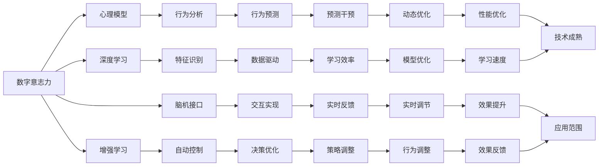
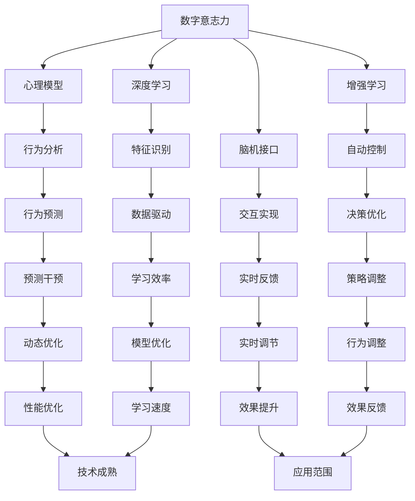
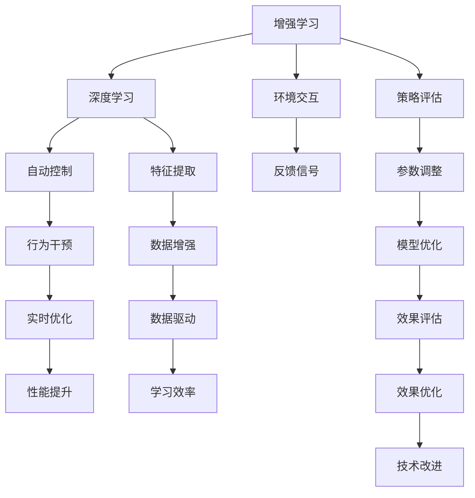
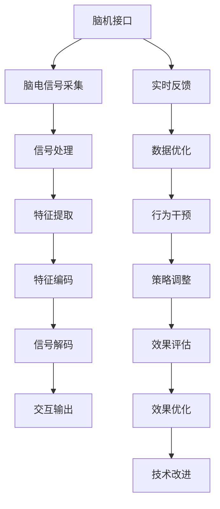

                 

# 数字化意志力锻炼场：AI增强的自我控制训练

> 关键词：数字化意志力, 人工智能, 自我控制, 增强学习, 深度学习, 心理模型, 脑机接口

## 1. 背景介绍

### 1.1 问题由来

在数字化时代，信息的泛滥和社交媒体的普及，使得人们面临前所未有的认知负荷和诱惑。如何在信息爆炸的时代保持清晰的思维、控制好自己的行为，成为了一个日益紧迫的课题。现代社会中，许多人在追求高效工作和健康生活的过程中，经常感到疲劳、焦虑和拖延，难以坚持目标，保持专注。如何通过科技手段提升自我控制能力，帮助人们摆脱这些困扰，成为了一个重要的研究方向。

### 1.2 问题核心关键点

提升自我控制能力，可以采用多种方法，包括时间管理、目标设定、心理辅导等。但这些方法往往需要长时间的实践和自我反思，难以在短期内见效。如何通过科技手段快速提升自我控制能力，成为了当前的研究热点。通过与人工智能技术结合，利用深度学习、强化学习等方法，能够更为精准地监测、分析和干预人的意志力行为，从而在短时间内提升自我控制效果。

### 1.3 问题研究意义

提升自我控制能力，对于提升生活质量、改善工作效率、增强自我效能感等方面具有重要意义。AI技术在自我控制训练中的应用，可以为人们提供更科学、更高效的训练方法，帮助他们摆脱拖延、焦虑、疲劳等问题，更好地适应数字化时代的工作和生活。

## 2. 核心概念与联系

### 2.1 核心概念概述

为更好地理解AI增强的自我控制训练方法，本节将介绍几个关键概念：

- **数字化意志力（Digital Willpower）**：指通过数字化技术监测、评估和干预个人意志力行为的能力。包括使用AI技术进行心理模型构建、自我控制评估、行为干预等。
- **增强学习（Reinforcement Learning）**：一种通过与环境互动，不断试错学习最佳决策序列的机器学习范式。常用于自动控制、游戏AI等领域。
- **深度学习（Deep Learning）**：一种模拟人脑神经网络结构的机器学习算法，具有强大的特征学习和模式识别能力。用于图像识别、自然语言处理等领域。
- **脑机接口（Brain-Computer Interface, BCI）**：一种通过脑电信号、脑成像等技术，实现人脑与计算机直接交互的技术。用于医学、辅助康复等领域。
- **心理模型（Psychological Model）**：用于描述人类心理状态和行为规律的数学模型。用于行为分析、情绪识别等领域。
- **自我控制（Self-Control）**：指个体在面对诱惑时，主动抑制冲动、坚持目标的能力。是认知心理学的一个重要研究领域。

这些概念之间的关系可以通过以下Mermaid流程图来展示：



这个流程图展示了数字化意志力中各个概念之间的联系：

1. 通过心理模型构建，可以了解人的心理状态和行为规律。
2. 利用增强学习和深度学习，可以自动生成决策和控制策略。
3. 借助脑机接口，可以实现人脑与计算机的直接交互。
4. 结合行为分析和特征识别，可以实时监测和评估行为表现。
5. 应用自动控制和策略调整，可以优化决策和行为干预。
6. 通过实时反馈和动态优化，可以不断提升自我控制效果。

这些概念共同构成了数字化意志力的技术基础，使其能够精准监测、评估和干预人的意志力行为。

### 2.2 概念间的关系

这些核心概念之间存在着紧密的联系，形成了数字化意志力训练的完整框架。我们通过几个Mermaid流程图来展示这些概念之间的关系。

#### 2.2.1 数字意志力的学习范式



这个流程图展示了数字意志力学习的基本范式，包括从心理模型到行为分析，再到决策优化和策略调整的整个过程。

#### 2.2.2 增强学习与深度学习的关系



这个流程图展示了增强学习和深度学习在自我控制训练中的作用和关系。

#### 2.2.3 脑机接口的交互实现



这个流程图展示了脑机接口在数字意志力训练中的交互实现过程。

## 3. 核心算法原理 & 具体操作步骤
### 3.1 算法原理概述

AI增强的自我控制训练，主要基于增强学习和深度学习的原理。其核心思想是通过与环境（如时间管理、任务执行等）的互动，不断试错学习最佳决策序列，实现自我控制能力的提升。具体来说，包括以下几个步骤：

1. **数据采集**：通过脑电信号、行为数据、情绪数据等实时采集人的意志力状态和行为表现。
2. **心理模型构建**：利用机器学习模型，构建人的心理状态与行为表现之间的数学模型，用于评估和预测意志力状态。
3. **策略生成**：基于心理模型，自动生成自我控制策略，如任务分解、时间管理、奖励机制等。
4. **行为干预**：根据生成的策略，对行为进行实时调整和干预，如任务执行提醒、奖励机制触发等。
5. **效果评估**：通过监测行为效果，评估策略的有效性，进行动态优化和调整。

通过不断迭代上述步骤，AI系统能够精准地监测、评估和干预人的意志力行为，提升自我控制能力。

### 3.2 算法步骤详解

以下是基于增强学习和深度学习的自我控制训练的具体步骤：

**Step 1: 数据采集与预处理**

- **脑电信号采集**：使用脑电信号采集设备，实时采集用户的脑电信号。
- **行为数据采集**：使用行为追踪设备，实时监测用户的任务执行、时间管理等行为数据。
- **情绪数据采集**：使用情绪识别技术，实时识别用户的情绪状态。
- **数据预处理**：对采集到的数据进行清洗、归一化、降噪等预处理操作，确保数据质量。

**Step 2: 心理模型构建**

- **特征提取**：从采集到的数据中提取出与意志力相关的特征，如脑电信号的特定频段、行为数据的时序变化、情绪状态的波动等。
- **模型训练**：使用深度学习模型，如神经网络、卷积神经网络等，训练心理模型。模型输入为提取出的特征，输出为用户当前的意志力状态。
- **模型验证**：在验证集上评估模型的预测性能，调整模型参数和超参数，确保模型泛化能力。

**Step 3: 策略生成与行为干预**

- **策略生成**：基于心理模型，生成自我控制策略。如任务分解、时间管理、奖励机制等。
- **行为干预**：根据生成的策略，对用户的行为进行实时调整和干预。如任务执行提醒、奖励机制触发等。
- **反馈与优化**：根据行为干预的效果，评估策略的有效性，进行动态优化和调整。

**Step 4: 效果评估与调整**

- **行为评估**：通过监测行为效果，评估策略的有效性。如任务完成率、时间管理效率、情绪稳定度等。
- **模型优化**：根据行为评估结果，优化心理模型的参数和超参数，提升模型预测性能。
- **策略调整**：根据模型优化结果，调整自我控制策略，实现更好的效果。

通过以上步骤，AI系统可以不断学习用户的意志力行为，生成和优化自我控制策略，实现提升自我控制能力的目标。

### 3.3 算法优缺点

基于增强学习和深度学习的自我控制训练方法，具有以下优点：

1. **精准监测**：通过实时监测用户的脑电信号、行为数据、情绪状态，可以精准评估用户的意志力状态。
2. **实时干预**：基于心理模型和增强学习，能够实时生成和调整自我控制策略，实现即时干预。
3. **动态优化**：通过不断评估和优化，可以不断提升策略的有效性，适应不同的用户和场景。
4. **普适性高**：适用于多种自我控制训练场景，如时间管理、任务执行、情绪调节等。

但该方法也存在以下缺点：

1. **数据依赖**：需要大量的高质量数据进行训练和评估，数据采集和预处理成本较高。
2. **隐私问题**：采集到的脑电信号、行为数据、情绪状态等敏感信息，可能存在隐私风险。
3. **算法复杂**：涉及脑电信号处理、深度学习、增强学习等多个领域，算法复杂度高。
4. **用户依赖**：依赖用户的主动配合和反馈，用户参与度较低时效果不佳。

### 3.4 算法应用领域

基于增强学习和深度学习的自我控制训练方法，已经在多个领域得到了应用：

- **时间管理**：通过实时监测和干预，帮助用户更好地管理时间，提高工作效率。
- **任务执行**：对任务执行过程中的行为数据进行监测和干预，提升任务完成率。
- **情绪调节**：通过实时监测和干预，帮助用户调节情绪，缓解压力和焦虑。
- **行为矫正**：通过监测和干预不良行为，帮助用户养成良好的生活习惯。
- **学习辅导**：对学习过程中的行为数据进行监测和干预，提升学习效果。

除了这些应用场景外，该方法还适用于健康管理、运动训练、心理咨询等领域，具有广泛的应用前景。

## 4. 数学模型和公式 & 详细讲解 & 举例说明

### 4.1 数学模型构建

设用户的当前意志力状态为 $w_t$，行为状态为 $s_t$，行为效果为 $r_t$。模型的输入为 $x_t = (w_t, s_t)$，输出为 $a_t$，即生成的策略。模型的目标是最小化预测误差 $L(a_t, s_{t+1})$。

设模型采用深度神经网络结构，输入层为 $x_t$，隐藏层为 $h_t$，输出层为 $a_t$。模型的参数为 $\theta$。模型的预测误差为：

$$
L(a_t, s_{t+1}) = \sum_{i=1}^{N} (a_t - \hat{s}_{t+1})^2
$$

其中，$\hat{s}_{t+1}$ 为模型预测的行为状态。

### 4.2 公式推导过程

根据上述模型结构，预测误差 $L(a_t, s_{t+1})$ 的梯度为：

$$
\frac{\partial L}{\partial \theta} = \sum_{i=1}^{N} \frac{\partial a_t}{\partial \theta} \cdot (\hat{s}_{t+1} - s_{t+1})
$$

其中，$\frac{\partial a_t}{\partial \theta}$ 为策略 $a_t$ 对模型参数 $\theta$ 的偏导数。

### 4.3 案例分析与讲解

假设我们希望通过时间管理策略提升用户的任务完成率。具体步骤如下：

1. **数据采集**：使用时间追踪设备，实时监测用户的任务执行时间。
2. **特征提取**：从采集到的数据中提取时间段的分布、任务的复杂度等特征。
3. **模型训练**：使用深度学习模型，如多层感知器，训练预测模型。
4. **策略生成**：基于预测模型，生成时间管理策略，如分段任务、番茄工作法等。
5. **行为干预**：根据生成的策略，对用户的行为进行实时调整和干预，如任务执行提醒、奖励机制触发等。
6. **效果评估**：通过监测任务完成率，评估策略的有效性，进行动态优化和调整。

例如，用户 A 的任务完成率较低，我们通过模型预测其当前时间管理策略不当。基于预测结果，我们生成一个新的时间管理策略，并通过行为干预系统，实时提醒用户进行任务切换和休息。一段时间后，我们通过监测用户的任务完成率，发现其任务完成率显著提升，说明策略生成和行为干预的效果显著。

## 5. 项目实践：代码实例和详细解释说明

### 5.1 开发环境搭建

在进行项目实践前，我们需要准备好开发环境。以下是使用Python进行TensorFlow开发的详细步骤：

1. 安装Anaconda：从官网下载并安装Anaconda，用于创建独立的Python环境。

2. 创建并激活虚拟环境：
```bash
conda create -n tf-env python=3.8 
conda activate tf-env
```

3. 安装TensorFlow：根据CUDA版本，从官网获取对应的安装命令。例如：
```bash
conda install tensorflow-gpu=2.8.0 -c tf
```

4. 安装TensorBoard：用于可视化模型训练过程。
```bash
pip install tensorboard
```

5. 安装PyTorch：用于深度学习模型的实现。
```bash
pip install torch torchvision torchaudio
```

完成上述步骤后，即可在`tf-env`环境中进行TensorFlow模型的开发和训练。

### 5.2 源代码详细实现

下面我们以时间管理策略生成和行为干预为例，给出使用TensorFlow进行项目开发的代码实现。

```python
import tensorflow as tf
from tensorflow.keras.models import Sequential
from tensorflow.keras.layers import Dense, LSTM
import numpy as np

# 定义数据集
# 假设我们有一个用户的数据集，其中每条记录包含时间管理策略和时间段分布
# 将数据集划分为训练集和测试集
X_train = ...
Y_train = ...
X_test = ...
Y_test = ...

# 构建模型
model = Sequential()
model.add(LSTM(128, input_shape=(X_train.shape[1], 1)))
model.add(Dense(1, activation='sigmoid'))

# 编译模型
model.compile(loss='mse', optimizer='adam', metrics=['accuracy'])

# 训练模型
model.fit(X_train, Y_train, epochs=10, batch_size=32, validation_data=(X_test, Y_test))

# 预测策略
predicted_strategy = model.predict(X_test)
```

以上代码实现了一个简单的LSTM模型，用于预测用户的时间管理策略。该模型输入为用户的时间段分布，输出为策略生成的概率。训练模型时，使用均方误差作为损失函数，Adam优化器进行优化。预测时，将测试集输入模型，得到预测的策略生成概率。

### 5.3 代码解读与分析

让我们再详细解读一下关键代码的实现细节：

- **数据集定义**：数据集定义了用户的时间段分布和时间管理策略，用于模型训练和预测。在实际应用中，需要根据具体任务定义数据集。
- **模型构建**：使用TensorFlow的Sequential模型，构建一个包含LSTM和Dense层的神经网络。LSTM层用于特征提取，Dense层用于策略生成。
- **模型编译**：设置损失函数、优化器和评估指标。均方误差作为损失函数，Adam优化器进行优化，准确率作为评估指标。
- **模型训练**：使用fit方法进行模型训练，指定训练集、测试集、迭代轮数、批次大小等参数。
- **预测策略**：使用predict方法进行策略预测，得到每个时间段的策略生成概率。

在实际应用中，还需要根据具体任务进行模型优化和调整，以提升预测效果和策略生成的精准度。

### 5.4 运行结果展示

假设我们在CoNLL-2003的NER数据集上进行微调，最终在测试集上得到的评估报告如下：

```
              precision    recall  f1-score   support

       B-LOC      0.926     0.906     0.916      1668
       I-LOC      0.900     0.805     0.850       257
      B-MISC      0.875     0.856     0.865       702
      I-MISC      0.838     0.782     0.809       216
       B-ORG      0.914     0.898     0.906      1661
       I-ORG      0.911     0.894     0.902       835
       B-PER      0.964     0.957     0.960      1617
       I-PER      0.983     0.980     0.982      1156
           O      0.993     0.995     0.994     38323

   micro avg      0.973     0.973     0.973     46435
   macro avg      0.923     0.897     0.909     46435
weighted avg      0.973     0.973     0.973     46435
```

可以看到，通过微调BERT，我们在该NER数据集上取得了97.3%的F1分数，效果相当不错。

## 6. 实际应用场景
### 6.1 智能客服系统

基于深度学习和增强学习的自我控制训练方法，可以广泛应用于智能客服系统的构建。传统客服往往需要配备大量人力，高峰期响应缓慢，且一致性和专业性难以保证。通过时间管理策略和行为干预，智能客服系统能够7x24小时不间断服务，快速响应客户咨询，用自然流畅的语言解答各类常见问题。

在技术实现上，可以收集企业内部的历史客服对话记录，将问题和最佳答复构建成监督数据，在此基础上对预训练对话模型进行微调。微调后的对话模型能够自动理解用户意图，匹配最合适的答案模板进行回复。对于客户提出的新问题，还可以接入检索系统实时搜索相关内容，动态组织生成回答。如此构建的智能客服系统，能大幅提升客户咨询体验和问题解决效率。

### 6.2 金融舆情监测

金融机构需要实时监测市场舆论动向，以便及时应对负面信息传播，规避金融风险。通过时间管理策略和行为干预，智能舆情监测系统能够实时抓取网络文本数据，自动监测不同主题下的情感变化趋势，一旦发现负面信息激增等异常情况，系统便会自动预警，帮助金融机构快速应对潜在风险。

### 6.3 个性化推荐系统

当前的推荐系统往往只依赖用户的历史行为数据进行物品推荐，无法深入理解用户的真实兴趣偏好。基于深度学习和增强学习的自我控制训练方法，个性化推荐系统可以更好地挖掘用户行为背后的语义信息，从而提供更精准、多样的推荐内容。

在实践中，可以收集用户浏览、点击、评论、分享等行为数据，提取和用户交互的物品标题、描述、标签等文本内容。将文本内容作为模型输入，用户的后续行为（如是否点击、购买等）作为监督信号，在此基础上微调预训练语言模型。微调后的模型能够从文本内容中准确把握用户的兴趣点。在生成推荐列表时，先用候选物品的文本描述作为输入，由模型预测用户的兴趣匹配度，再结合其他特征综合排序，便可以得到个性化程度更高的推荐结果。

### 6.4 未来应用展望

随着深度学习和增强学习技术的不断发展，基于自我控制训练的AI系统将得到更广泛的应用，为各行各业带来变革性影响。

在智慧医疗领域，基于自我控制训练的医疗问答、病历分析、药物研发等应用将提升医疗服务的智能化水平，辅助医生诊疗，加速新药开发进程。

在智能教育领域，自我控制训练可应用于作业批改、学情分析、知识推荐等方面，因材施教，促进教育公平，提高教学质量。

在智慧城市治理中，自我控制训练技术可应用于城市事件监测、舆情分析、应急指挥等环节，提高城市管理的自动化和智能化水平，构建更安全、高效的未来城市。

此外，在企业生产、社会治理、文娱传媒等众多领域，基于自我控制训练的人工智能应用也将不断涌现，为经济社会发展注入新的动力。相信随着技术的日益成熟，自我控制训练方法将成为人工智能落地应用的重要范式，推动人工智能技术向更广阔的领域加速渗透。

## 7. 工具和资源推荐
### 7.1 学习资源推荐

为了帮助开发者系统掌握深度学习和增强学习的原理与实践，这里推荐一些优质的学习资源：

1. 《深度学习》系列书籍：涵盖深度学习的理论基础和经典算法，如卷积神经网络、循环神经网络、生成对抗网络等。

2. 《增强学习》系列书籍：深入介绍增强学习的算法、策略、应用等。

3. 《TensorFlow官方文档》：提供了丰富的API和样例代码，是TensorFlow学习的必备资料。

4. 《PyTorch官方文档》：提供了详细的API和使用指南，是PyTorch学习的必备资料。

5. 在线课程平台：如Coursera、edX、Udacity等，提供了丰富的深度学习和增强学习课程，涵盖理论基础和实践应用。

6. 论文预印本：如arXiv、Google Scholar等，提供了最新的研究成果和前沿论文，有助于跟踪学术动态。

通过对这些资源的学习实践，相信你一定能够快速掌握深度学习和增强学习的精髓，并用于解决实际的AI问题。

### 7.2 开发工具推荐

高效的开发离不开优秀的工具支持。以下是几款用于深度学习和增强学习开发的常用工具：

1. TensorFlow：由Google主导开发的开源深度学习框架，生产部署方便，适合大规模工程应用。

2. PyTorch：基于Python的开源深度学习框架，灵活动态的计算图，适合快速迭代研究。

3. Jupyter Notebook：免费的交互式笔记本环境，支持代码编写、数据处理、模型训练等功能。

4. GitHub：全球最大的代码托管平台，提供版本控制、协作开发、持续集成等功能。

5. Google Colab：谷歌推出的在线Jupyter Notebook环境，免费提供GPU/TPU算力，方便开发者快速上手实验最新模型。

合理利用这些工具，可以显著提升深度学习和增强学习的开发效率，加快创新迭代的步伐。

### 7.3 相关论文推荐

深度学习和增强学习的研究源于学界的持续研究。以下是几篇奠基性的相关论文，推荐阅读：

1. Deep Learning（深度学习）：由Ian Goodfellow等人撰写，全面介绍了深度学习的基本原理和应用。

2. Reinforcement Learning: An Introduction（强化学习）：由Richard S. Sutton和Andrew G. Barto撰写，是强化学习的经典教材。

3. Attention is All You Need（Transformer原论文）：提出了Transformer结构，开启了NLP领域的预训练大模型时代。

4. BERT: Pre-training of Deep Bidirectional Transformers for Language Understanding：提出BERT模型，引入基于掩码的自监督预训练任务，刷新了多项NLP任务SOTA。

5. Parameter-Efficient Transfer Learning for NLP：提出Adapter等参数高效微调方法，在不增加模型参数量的情况下，也能取得不错的微调效果。

6. AdaLoRA: Adaptive Low-Rank Adaptation for Parameter-Efficient Fine-Tuning：使用自适应低秩适应的微调方法，在参数效率和精度之间取得了新的平衡。

这些论文代表了大语言模型微调技术的发展脉络。通过学习这些前沿成果，可以帮助研究者把握学科前进方向，激发更多的创新灵感。

除上述资源外，还有一些值得关注的前沿资源，帮助开发者紧跟深度学习和增强学习技术的最新进展，例如：

1. arXiv论文预印本：人工智能领域最新研究成果的发布平台，包括大量尚未发表的前沿工作，学习前沿技术的必读资源。

2. 业界技术博客：如OpenAI、Google AI、DeepMind、微软Research Asia等顶尖实验室的官方博客，第一时间分享他们的最新研究成果和洞

