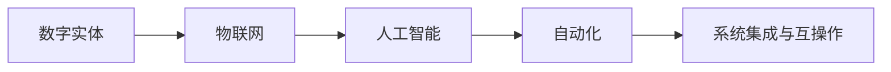
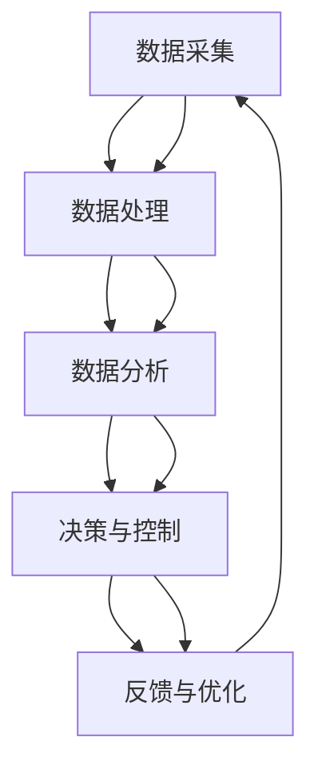

                 

# 数字实体与物理实体的自动化进展

## 1. 背景介绍

### 1.1 问题由来
在现代信息技术日新月异的发展过程中，数字实体的概念逐渐兴起。数字实体指的是在计算机系统中被表示的数据，它们可以被用于程序逻辑的实现、数据存储、计算资源的管理和分配等。而物理实体，则是指现实世界中的物体、设备或人等具体的物理对象。

数字实体和物理实体的自动化管理是实现数字化转型、智能化升级的重要环节。随着物联网、人工智能、大数据等技术的深入应用，如何有效实现数字实体与物理实体的自动化融合，成为当前技术研究和应用的关键方向。

### 1.2 问题核心关键点
数字实体与物理实体的自动化，主要涉及以下关键点：

- **数据集成与管理**：如何在不同系统之间高效集成和整合数据，以实现统一的视图和管理。
- **智能感知与控制**：如何通过传感器、机器学习等技术，实现对物理实体的实时感知和智能化控制。
- **自动化流程**：如何通过自动化流程，提高效率，减少人为错误，优化资源配置。
- **系统互联与互操作**：如何建立跨系统、跨平台的应用生态，实现资源的有效共享和协同工作。
- **数据安全与隐私**：如何在自动化过程中，保障数据的安全与隐私，防止数据泄露和滥用。

### 1.3 问题研究意义
数字实体与物理实体的自动化，能够显著提升企业生产效率，优化资源配置，降低运营成本，增强企业的竞争力。具体而言，其研究意义包括：

- **提高效率**：通过自动化实现批量化、标准化操作，降低人工操作成本，提高作业效率。
- **优化资源**：通过智能感知与控制，实现物理实体的最优运行，提高资源利用率。
- **强化决策**：通过数据的实时感知与分析，提供科学的决策依据，提升决策准确性。
- **增强安全性**：通过自动化流程和安全策略，降低人为失误和事故发生的可能性。
- **推动技术创新**：推动企业在自动化领域的技术创新，推动智能制造、智慧城市等新兴产业的发展。

## 2. 核心概念与联系

### 2.1 核心概念概述

为了更好地理解数字实体与物理实体的自动化，本节将介绍几个关键概念及其联系：

- **数字实体(Digital Entity)**：在计算机系统中被表示的数据，可以包括各种类型的数据，如文本、图片、音频、视频等。数字实体是实现数字与物理融合的基础。
- **物理实体(Physical Entity)**：现实世界中的物体、设备或人等具体物理对象。物理实体的状态和行为需要通过传感器、物联网等技术进行感知和控制。
- **物联网(IoT)**：通过传感器、RFID等技术，将物理实体连接到互联网，实现对物理实体的实时监控和控制。
- **人工智能(AI)**：利用机器学习、深度学习等技术，实现对数字实体和物理实体的智能处理与决策。
- **自动化(Automation)**：通过智能算法和系统，实现对数字实体和物理实体的自动操作与控制。
- **系统集成与互操作(Interoperability)**：通过标准化的数据接口和协议，实现不同系统之间的数据交换和协同工作。

这些核心概念之间有着密切的联系，通过它们的相互配合，可以实现数字实体与物理实体的自动化融合。以下是一个Mermaid流程图，展示了这些概念之间的关系：



### 2.2 概念间的关系

这些核心概念之间的关系可以总结如下：

- **数字实体**是**物联网**和**人工智能**的数据基础，提供了对物理实体进行智能化感知与控制所需的信息。
- **物联网**通过传感器、RFID等技术，实现了对物理实体的实时监控和控制，提供了数字实体与物理实体交互的基础。
- **人工智能**通过对数字实体的分析与处理，实现了对物理实体的智能决策与控制。
- **自动化**通过智能算法和系统，实现了对数字实体和物理实体的自动操作与控制。
- **系统集成与互操作**通过标准化数据接口和协议，实现了不同系统之间的数据交换和协同工作，为数字实体与物理实体的自动化融合提供了保障。

### 2.3 核心概念的整体架构

以下是一个综合的流程图，展示了数字实体与物理实体的自动化整体架构：



这个流程图展示了从数据采集、处理、分析、决策与控制、反馈与优化的完整过程。数据采集模块负责从传感器、RFID等设备中获取物理实体的实时状态，数据处理模块对数据进行清洗、转换和集成，数据分析模块通过机器学习、深度学习等技术对数据进行智能分析和处理，决策与控制模块根据分析结果，对物理实体进行智能化控制，反馈与优化模块根据控制结果，不断调整算法和策略，提高系统性能。

## 3. 核心算法原理 & 具体操作步骤
### 3.1 算法原理概述

数字实体与物理实体的自动化，主要涉及以下几个核心算法：

- **数据采集算法**：通过传感器、RFID等技术，从物理实体中实时采集数据，并将其转换为数字格式。
- **数据处理算法**：对采集到的数字数据进行清洗、转换和集成，确保数据的准确性和完整性。
- **数据分析算法**：通过机器学习、深度学习等技术，对处理后的数据进行智能分析和处理，提取有价值的信息。
- **决策与控制算法**：根据分析结果，对物理实体进行智能化控制和决策。
- **反馈与优化算法**：通过实时反馈机制，不断调整算法和策略，优化系统性能。

### 3.2 算法步骤详解

以下是对数字实体与物理实体自动化过程的具体步骤详解：

1. **数据采集**：
   - 通过传感器、RFID等技术，从物理实体中实时采集数据，如温度、湿度、位置等。
   - 将采集到的数据转换为数字格式，如文本、图片、音频、视频等。

2. **数据处理**：
   - 对采集到的数字数据进行清洗、转换和集成，去除噪声和不一致性。
   - 对数据进行格式化和标准化，使其符合后续分析的要求。

3. **数据分析**：
   - 通过机器学习、深度学习等技术，对处理后的数据进行智能分析和处理，提取有价值的信息。
   - 利用时间序列分析、聚类分析、分类算法等方法，对数据进行建模和预测。

4. **决策与控制**：
   - 根据分析结果，对物理实体进行智能化控制和决策。
   - 利用强化学习、决策树等算法，实现对物理实体的自动化控制。

5. **反馈与优化**：
   - 通过实时反馈机制，不断调整算法和策略，优化系统性能。
   - 利用模型调优、超参数搜索等技术，提高系统的精度和效率。

### 3.3 算法优缺点

数字实体与物理实体的自动化算法具有以下优点：

- **高效性**：通过自动化流程，减少了人工操作，提高了效率。
- **准确性**：通过智能分析和决策，提高了数据的准确性和处理质量。
- **可扩展性**：可以通过标准化接口和协议，实现系统的可扩展性和互操作性。
- **灵活性**：可以根据实际需求，灵活调整算法和策略，适应不同场景和任务。

同时，也存在一些缺点：

- **复杂性**：算法实现复杂，需要多种技术手段的结合。
- **数据依赖性**：对数据的准确性和完整性要求高，数据质量差将影响系统性能。
- **系统安全性**：需要采取多层次的安全措施，防止数据泄露和系统漏洞。
- **资源消耗**：对计算资源和存储资源的需求较高，需要高效的资源管理策略。

### 3.4 算法应用领域

数字实体与物理实体的自动化算法在多个领域中得到了广泛应用，以下是几个典型应用场景：

- **智能制造**：通过物联网技术，实现对生产设备的实时监控和控制，提高生产效率和产品质量。
- **智慧城市**：利用传感器和数据分析技术，实现对交通、能源、环境等系统的智能化管理。
- **智能农业**：通过物联网和数据分析技术，实现对农田环境的实时监控和精准管理。
- **智能医疗**：利用传感器和数据分析技术，实现对患者生命体征的实时监测和智能诊断。
- **智能物流**：通过物联网和数据分析技术，实现对物流运输的实时监控和优化管理。

## 4. 数学模型和公式 & 详细讲解 & 举例说明

### 4.1 数学模型构建

以下是对数字实体与物理实体的自动化过程进行数学建模，以线性回归模型为例：

设物理实体的状态变量为 $x$，通过传感器采集的数字数据为 $y$，则线性回归模型的目标是最小化预测值 $\hat{y}$ 与真实值 $y$ 之间的均方误差（Mean Squared Error, MSE），即：

$$
\min_{\theta} \frac{1}{n} \sum_{i=1}^n (y_i - \hat{y_i})^2
$$

其中 $\theta$ 为模型参数，$n$ 为数据样本数量。

### 4.2 公式推导过程

线性回归模型的参数 $\theta$ 可以通过最小二乘法求解，其最小化目标函数为：

$$
\min_{\theta} \sum_{i=1}^n (y_i - \theta_0 - \theta_1 x_i)^2
$$

通过求导和求解，可以得到 $\theta_0$ 和 $\theta_1$ 的表达式为：

$$
\theta_0 = \bar{y} - \theta_1 \bar{x}
$$

$$
\theta_1 = \frac{\sum_{i=1}^n (x_i - \bar{x})(y_i - \bar{y})}{\sum_{i=1}^n (x_i - \bar{x})^2}
$$

其中 $\bar{x}$ 和 $\bar{y}$ 分别为 $x$ 和 $y$ 的均值。

### 4.3 案例分析与讲解

假设我们有一个智能仓库，需要实时监控货物的库存量，并自动调整采购计划。

1. **数据采集**：通过传感器实时采集货物的重量和体积数据。
2. **数据处理**：对采集到的数据进行清洗和转换，如去除异常值和单位转换。
3. **数据分析**：利用时间序列分析，对货物的销售数据进行预测，并生成采购计划。
4. **决策与控制**：根据预测结果，自动调整采购计划，并控制仓储设备的自动补货功能。
5. **反馈与优化**：实时监控采购计划的执行情况，并根据执行结果调整算法和策略，优化系统性能。

## 5. 项目实践：代码实例和详细解释说明

### 5.1 开发环境搭建

在进行数字实体与物理实体的自动化实践前，我们需要准备好开发环境。以下是使用Python进行TensorFlow开发的环境配置流程：

1. 安装Anaconda：从官网下载并安装Anaconda，用于创建独立的Python环境。

2. 创建并激活虚拟环境：
```bash
conda create -n tf-env python=3.8 
conda activate tf-env
```

3. 安装TensorFlow：根据CUDA版本，从官网获取对应的安装命令。例如：
```bash
conda install tensorflow -c conda-forge -c pytorch -c anaconda
```

4. 安装必要的库：
```bash
pip install numpy pandas scikit-learn matplotlib jupyter notebook ipython
```

完成上述步骤后，即可在`tf-env`环境中开始开发实践。

### 5.2 源代码详细实现

下面我们以智能仓库的库存管理为例，给出使用TensorFlow进行数据分析和决策的PyTorch代码实现。

首先，定义数据集：

```python
import numpy as np
import pandas as pd
from tensorflow.keras.layers import Dense, LSTM, Input
from tensorflow.keras.models import Model

# 定义样本数据
X = np.array([[1, 2, 3], [4, 5, 6], [7, 8, 9], [10, 11, 12]])
y = np.array([3, 6, 9, 12])

# 定义模型输入和输出
input_shape = (X.shape[1], 1)
input_layer = Input(shape=input_shape, name='input')
output_layer = Dense(1, activation='sigmoid', name='output')(input_layer)

# 构建模型
model = Model(inputs=input_layer, outputs=output_layer)

# 编译模型
model.compile(optimizer='adam', loss='mse', metrics=['mae'])

# 训练模型
model.fit(X, y, epochs=100, verbose=0)

# 预测
y_pred = model.predict(X)
```

然后，定义数据分析和决策函数：

```python
from sklearn.metrics import mean_squared_error

# 定义预测函数
def predict(X):
    y_pred = model.predict(X)
    return y_pred

# 定义评估函数
def evaluate(y_true, y_pred):
    mse = mean_squared_error(y_true, y_pred)
    mae = mean_absolute_error(y_true, y_pred)
    return mse, mae
```

最后，启动预测和评估流程：

```python
# 预测
y_pred = predict(X)

# 评估
mse, mae = evaluate(y, y_pred)
print(f"Mean Squared Error: {mse}")
print(f"Mean Absolute Error: {mae}")
```

以上就是使用TensorFlow进行数据分析和决策的完整代码实现。可以看到，TensorFlow提供了丰富的模型组件和便捷的API接口，使得数据分析和决策的实现变得简单高效。

### 5.3 代码解读与分析

让我们再详细解读一下关键代码的实现细节：

**数据集定义**：
- `X` 和 `y` 分别为模型的输入和输出，定义了样本数量和特征维度。

**模型构建**：
- 通过定义输入层和输出层，并连接它们，构建了简单的线性回归模型。
- 使用 `compile` 方法设置优化器、损失函数和评估指标。

**训练过程**：
- 使用 `fit` 方法对模型进行训练，其中 `epochs` 参数指定训练轮数，`verbose` 参数指定是否输出训练日志。

**预测和评估**：
- 通过 `predict` 方法进行预测，使用 `evaluate` 方法评估预测结果的误差。

## 6. 实际应用场景

### 6.1 智能制造

在智能制造领域，数字实体与物理实体的自动化应用广泛。通过物联网技术，实现对生产设备的实时监控和控制，提高生产效率和产品质量。例如，可以利用传感器采集设备的温度、湿度、振动等数据，通过数据分析和智能决策，实现设备的预测性维护和自适应调整。

### 6.2 智慧城市

在智慧城市领域，数字实体与物理实体的自动化应用同样重要。通过传感器和数据分析技术，实现对交通、能源、环境等系统的智能化管理。例如，可以利用摄像头和传感器采集交通流量、能源消耗、环境污染等数据，通过数据分析和智能决策，实现交通流量调控、能源优化分配和环境监测。

### 6.3 智能农业

在智能农业领域，数字实体与物理实体的自动化应用逐渐兴起。通过物联网和数据分析技术，实现对农田环境的实时监控和精准管理。例如，可以利用传感器采集土壤湿度、气温、光照等数据，通过数据分析和智能决策，实现精准灌溉、施肥和病虫害防治。

### 6.4 未来应用展望

随着数字实体与物理实体的自动化技术的不断发展，未来将有更多行业和领域实现智能化升级。以下是几个未来应用展望：

- **智能医疗**：利用传感器和数据分析技术，实现对患者生命体征的实时监测和智能诊断。例如，可以利用心率、血压等传感器采集数据，通过数据分析和智能决策，实现疾病的早期预警和个性化治疗。
- **智能物流**：通过物联网和数据分析技术，实现对物流运输的实时监控和优化管理。例如，可以利用GPS和传感器采集货物的位置和状态数据，通过数据分析和智能决策，实现运输路线的优化和货物的实时跟踪。
- **智能教育**：利用传感器和数据分析技术，实现对学生的实时监控和智能指导。例如，可以利用摄像头和传感器采集学生的行为数据，通过数据分析和智能决策，实现个性化学习路径的推荐和学术表现的预测。

## 7. 工具和资源推荐

### 7.1 学习资源推荐

为了帮助开发者系统掌握数字实体与物理实体的自动化技术，这里推荐一些优质的学习资源：

1. **《Python数据科学手册》**：由Jake VanderPlas撰写，全面介绍了Python在数据分析和机器学习中的应用，是一本非常实用的入门书籍。
2. **TensorFlow官方文档**：TensorFlow的官方文档，提供了完整的API参考和示例代码，是学习TensorFlow的最佳资源。
3. **IoT Notebook Platform**：Google提供的物联网开发平台，支持TensorFlow等框架，提供了丰富的学习资源和项目实践机会。
4. **Coursera《机器学习》课程**：由Andrew Ng教授主讲，是机器学习领域的经典课程，涵盖了各种机器学习算法和应用实例。
5. **Kaggle数据科学竞赛平台**：Kaggle提供了大量数据集和竞赛项目，可以帮助开发者实践和提升数据处理和分析能力。

通过这些资源的学习，相信你一定能够快速掌握数字实体与物理实体的自动化技术，并应用于实际项目中。

### 7.2 开发工具推荐

高效的开发离不开优秀的工具支持。以下是几款用于数字实体与物理实体的自动化开发的常用工具：

1. **TensorFlow**：由Google主导开发的开源深度学习框架，生产部署方便，适合大规模工程应用。
2. **PyTorch**：基于Python的开源深度学习框架，灵活高效，适合快速迭代研究。
3. **TensorBoard**：TensorFlow配套的可视化工具，可实时监测模型训练状态，并提供丰富的图表呈现方式。
4. **Jupyter Notebook**：开源的交互式笔记本，支持Python、R等多种语言，适合科学计算和数据分析。
5. **Scikit-learn**：基于Python的数据科学库，提供了丰富的机器学习算法和数据预处理方法。

合理利用这些工具，可以显著提升数字实体与物理实体的自动化开发效率，加快创新迭代的步伐。

### 7.3 相关论文推荐

数字实体与物理实体的自动化技术的研究源于学界的持续研究。以下是几篇奠基性的相关论文，推荐阅读：

1. **《深度强化学习与自主驾驶》**：提出基于深度强化学习的自主驾驶技术，展示了如何将深度学习与强化学习结合，实现智能驾驶。
2. **《基于物联网的智慧城市管理》**：提出基于物联网的智慧城市管理方案，展示了如何通过传感器和数据分析技术，实现城市资源的优化配置和管理。
3. **《智能农业中的物联网应用》**：提出基于物联网的智能农业方案，展示了如何通过传感器和数据分析技术，实现农田环境的精准管理和农作物生长的优化。
4. **《医疗大数据分析与智能诊断》**：提出基于大数据分析的智能诊断技术，展示了如何通过数据挖掘和机器学习技术，实现疾病的早期预警和个性化治疗。
5. **《智能物流中的传感器应用》**：提出基于传感器和大数据分析的智能物流方案，展示了如何通过GPS和传感器数据，实现物流运输的实时监控和优化管理。

这些论文代表了大规模数据驱动的技术发展脉络。通过学习这些前沿成果，可以帮助研究者把握学科前进方向，激发更多的创新灵感。

## 8. 总结：未来发展趋势与挑战

### 8.1 总结

本文对数字实体与物理实体的自动化技术进行了全面系统的介绍。首先阐述了数字实体与物理实体的自动化技术的研究背景和意义，明确了数字实体与物理实体的自动化在提高生产效率、优化资源配置、降低运营成本、增强决策支持等方面的重要价值。其次，从原理到实践，详细讲解了数字实体与物理实体的自动化的核心算法和操作步骤，提供了完整的代码实现和详细解释。同时，本文还探讨了数字实体与物理实体的自动化技术在多个行业领域的应用前景，展示了其广阔的应用潜力。最后，本文精选了数字实体与物理实体的自动化的各类学习资源，力求为读者提供全方位的技术指引。

通过本文的系统梳理，可以看到，数字实体与物理实体的自动化技术正在成为智能制造、智慧城市、智能农业等领域的重要应用方向，极大地提升了各行业的智能化水平。随着技术的不断发展，相信数字实体与物理实体的自动化技术将进一步拓展应用场景，为各行各业带来更加高效、精准、智能的服务。

### 8.2 未来发展趋势

展望未来，数字实体与物理实体的自动化技术将呈现以下几个发展趋势：

1. **数据融合与协同**：通过数据融合技术，实现不同数据源的协同工作和互操作性，提高数据的准确性和完整性。
2. **智能感知与控制**：利用深度学习和强化学习等技术，实现对物理实体的智能感知与控制，提高系统的智能化水平。
3. **模型集成与优化**：通过模型集成和优化技术，提高系统的稳定性和鲁棒性，实现更加高效的资源管理和决策支持。
4. **跨领域应用拓展**：将数字实体与物理实体的自动化技术应用于更多领域，如医疗、金融、教育等，推动各行各业的智能化转型。
5. **安全性与隐私保护**：加强系统安全性和隐私保护，防止数据泄露和滥用，确保系统的可靠性和安全性。

### 8.3 面临的挑战

尽管数字实体与物理实体的自动化技术已经取得了显著进展，但在实现广泛应用的过程中，仍然面临诸多挑战：

1. **数据质量问题**：数据采集和处理的准确性和完整性直接影响系统的性能，如何提高数据质量，仍然是关键问题。
2. **技术复杂性**：数字实体与物理实体的自动化技术涉及多种技术手段的结合，实现起来较为复杂，需要跨学科的知识和技能。
3. **资源消耗**：系统对计算资源和存储资源的需求较高，需要高效的资源管理策略，防止资源浪费。
4. **安全性与隐私**：系统的安全性与隐私保护问题，如数据泄露和系统漏洞，需要采取多层次的安全措施。
5. **标准化与互操作性**：不同系统之间的数据格式和接口标准不一致，导致互操作性差，需要推动标准化和互操作性技术的发展。

### 8.4 研究展望

面对数字实体与物理实体的自动化技术面临的挑战，未来的研究需要在以下几个方面寻求新的突破：

1. **数据质量提升**：通过数据清洗、数据增强和数据融合等技术，提高数据的质量和完整性，为系统的智能化升级奠定基础。
2. **模型优化与集成**：开发更加高效、鲁棒的模型，通过模型集成和优化技术，提升系统的稳定性和鲁棒性，推动系统的可靠性和智能化。
3. **跨领域应用拓展**：将数字实体与物理实体的自动化技术应用于更多领域，如医疗、金融、教育等，推动各行各业的智能化转型。
4. **安全性与隐私保护**：加强系统安全性和隐私保护，防止数据泄露和滥用，确保系统的可靠性和安全性。
5. **标准化与互操作性**：推动数据格式和接口标准的统一和互操作性技术的发展，实现不同系统之间的数据交换和协同工作。

## 9. 附录：常见问题与解答

**Q1: 什么是数字实体与物理实体的自动化？**

A: 数字实体与物理实体的自动化是指通过数字技术，将物理实体的状态和行为转化为数字信号，再通过数据分析和智能决策，实现对物理实体的自动化控制和管理。

**Q2: 数字实体与物理实体的自动化主要涉及哪些技术？**

A: 数字实体与物理实体的自动化主要涉及数据采集与处理、数据分析与建模、智能决策与控制、反馈与优化等技术。

**Q3: 数字实体与物理实体的自动化应用有哪些？**

A: 数字实体与物理实体的自动化应用广泛，包括智能制造、智慧城市、智能农业、智能医疗、智能物流等多个领域。

**Q4: 数字实体与物理实体的自动化的未来发展方向是什么？**

A: 数字实体与物理实体的自动化的未来发展方向包括数据融合与协同、智能感知与控制、模型集成与优化、跨领域应用拓展、安全性与隐私保护、标准化与互操作性等。

**Q5: 如何应对数字实体与物理实体的自动化技术面临的挑战？**

A: 应对数字实体与物理实体的自动化技术面临的挑战，需要在数据质量提升、模型优化与集成、跨领域应用拓展、安全性与隐私保护、标准化与互操作性等方面寻求新的突破。

---

作者：禅与计算机程序设计艺术 / Zen and the Art of Computer Programming

