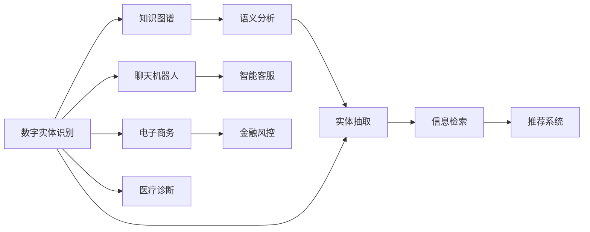

                 

# 数字实体的自动化前景与应用

> 关键词：数字实体, 自动化, 深度学习, 自然语言处理, 实体识别, 知识图谱, 语义分析

## 1. 背景介绍

在当今数字化时代，数字实体（Digital Entities），如人名、地名、机构名、产品名等，成为了信息处理的核心元素。随着互联网的普及和数据的爆炸性增长，数字实体在众多应用场景中扮演着重要角色，如搜索引擎、推荐系统、聊天机器人、信息抽取、金融风控、智能客服、电子商务、医疗诊断等。对数字实体的自动化处理和利用，已经成为各大公司和研究机构竞相投入的焦点。

### 1.1 数字实体的定义

数字实体指的是在文本或数据中出现的具有特定含义的信息片段，如人名、地名、机构名、时间、数量、类别等。它们是自然语言处理（Natural Language Processing, NLP）中重要的概念，在信息检索、知识图谱构建、关系抽取、情感分析等任务中具有关键作用。

### 1.2 数字实体的重要性

数字实体的重要性主要体现在以下几个方面：

1. **信息检索的效率**：通过识别和链接数字实体，可以显著提高信息检索的效率。例如，在搜索引擎中输入“北京房价”，可以自动匹配到与“北京”相关的房产信息。
2. **知识图谱的构建**：数字实体是知识图谱的核心节点，通过抽取和链接实体，可以构建起庞大的知识网络，为各种推理和查询提供支持。
3. **自然语言理解**：数字实体在自然语言理解（NLU）中扮演着重要角色。理解实体的类型和关系，有助于更好地理解句子的含义。
4. **实体抽取**：在文本挖掘和信息抽取中，识别数字实体是关键步骤。通过实体抽取，可以从大量文本中提取出有价值的信息。

## 2. 核心概念与联系

### 2.1 核心概念概述

为了更好地理解数字实体的自动化处理和利用，本节将介绍几个密切相关的核心概念：

- **数字实体识别（Named Entity Recognition, NER）**：识别文本中具有特定意义的实体，如人名、地名、机构名等。是数字实体处理的基础步骤。
- **知识图谱（Knowledge Graph）**：由实体和实体之间的关系构成的图结构，用于表示和存储实体间的语义信息。
- **语义分析（Semantic Analysis）**：分析文本的语义信息，理解实体的类型和关系，如实体识别、关系抽取、情感分析等。
- **实体抽取（Entity Extraction）**：从文本中提取和标注数字实体，是信息检索和知识图谱构建的关键步骤。

### 2.2 核心概念之间的联系

这些核心概念之间存在着紧密的联系，共同构成了数字实体的自动化处理和利用框架。以下通过Mermaid流程图展示它们之间的关系：



这个流程图展示了数字实体在信息检索、知识图谱构建、语义分析、实体抽取等任务中的应用场景，以及它们之间的内在联系。数字实体的自动化处理和利用，能够显著提升这些应用场景的效率和效果。

## 3. 核心算法原理 & 具体操作步骤

### 3.1 算法原理概述

数字实体的自动化处理主要依赖于自然语言处理（NLP）技术，特别是实体识别（NER）和语义分析技术。实体识别和语义分析的算法原理如下：

- **实体识别（NER）**：主要通过标注训练数据集，学习实体的类型和边界信息。常用的模型包括CRF、BiLSTM-CRF、BERT等。
- **语义分析**：通过构建预训练语言模型，学习实体的语义信息，如实体类型、关系类型等。常用的模型包括BERT、ELMo、GPT等。

### 3.2 算法步骤详解

以下是数字实体处理的核心算法步骤：

1. **数据预处理**：清洗和预处理原始文本数据，如分词、去除停用词、标准化等。
2. **实体识别（NER）**：使用预训练的NER模型对文本进行实体标注，识别出具有特定意义的实体。
3. **语义分析**：使用预训练的语义分析模型对文本进行语义理解，如实体类型、关系类型等。
4. **实体抽取**：从文本中抽取和标注数字实体，如人名、地名、机构名等。
5. **知识图谱构建**：将抽取的实体和关系构建成知识图谱，用于后续的信息检索和推理。

### 3.3 算法优缺点

数字实体的自动化处理具有以下优点：

- **效率高**：自动化处理能够显著提高实体识别的效率和准确性。
- **鲁棒性强**：通过预训练模型，可以避免过拟合，提高模型的鲁棒性。
- **应用广泛**：实体识别和语义分析技术在多个应用场景中都有广泛应用。

然而，自动化的实体处理也存在一些局限性：

- **依赖高质量数据**：实体识别和语义分析的效果高度依赖于标注数据的质量和数量。
- **上下文理解不足**：自动化处理可能难以理解文本的上下文信息，导致实体识别的误判。
- **语义理解困难**：语义分析模型的语义理解能力有限，可能无法准确理解复杂的文本语义。

### 3.4 算法应用领域

数字实体的自动化处理技术在以下领域具有广泛应用：

- **搜索引擎**：用于自动匹配和检索实体相关的信息。
- **推荐系统**：用于分析用户的行为和偏好，推荐相关的实体。
- **聊天机器人**：用于自然语言理解，理解和生成实体相关的回复。
- **智能客服**：用于识别用户提到的实体，提供精准的服务。
- **电子商务**：用于抽取和分析用户评论中的实体，提供个性化推荐。
- **金融风控**：用于识别和监测金融欺诈行为，保护用户财产安全。
- **医疗诊断**：用于抽取和分析病历中的实体，辅助医生诊断和治疗。

## 4. 数学模型和公式 & 详细讲解

### 4.1 数学模型构建

数字实体的自动化处理主要基于深度学习模型，特别是基于Transformer的预训练语言模型。以下以BERT模型为例，构建实体识别和语义分析的数学模型。

假设文本数据为 $X$，实体标注为 $Y$，预训练语言模型为 $M_{\theta}$。实体识别的目标是最大化 $M_{\theta}$ 对实体标注的预测准确率，即：

$$
\max_{\theta} \sum_{i=1}^n P(Y_i | X_i; M_{\theta})
$$

其中 $P(Y_i | X_i; M_{\theta})$ 表示在给定输入文本 $X_i$ 的情况下，预测实体标注 $Y_i$ 的概率。

### 4.2 公式推导过程

以BERT模型为例，实体识别和语义分析的公式推导如下：

- **实体识别**：BERT模型对每个单词的概率进行预测，通过softmax函数得到每个单词属于实体的概率。然后通过CRF模型对实体进行标注，得到实体的边界。

$$
P(Y_i | X_i; M_{\theta}) = \frac{\exp(s(\theta) h(X_i))}{\sum_k \exp(s(\theta) h(X_i))}
$$

其中 $s(\theta)$ 为BERT模型的可微部分，$h(X_i)$ 为BERT模型对输入文本 $X_i$ 的表示。

- **语义分析**：BERT模型对每个单词的概率进行预测，通过softmax函数得到每个单词属于实体的概率。然后通过聚合函数对实体进行分类，得到实体的类型和关系类型。

$$
P(Y_i | X_i; M_{\theta}) = \frac{\exp(s(\theta) h(X_i))}{\sum_k \exp(s(\theta) h(X_i))}
$$

### 4.3 案例分析与讲解

以Google的实体识别系统为例，该系统通过BERT模型对输入文本进行实体识别，然后将识别结果与知识图谱中的实体进行匹配，提供精准的信息检索和推荐。例如，用户输入“北京的房价”，系统能够自动匹配到北京的相关房产信息，并推荐给用户。

## 5. 项目实践：代码实例和详细解释说明

### 5.1 开发环境搭建

为了进行数字实体的自动化处理，需要准备以下开发环境：

- **Python 3**：开发语言。
- **PyTorch**：深度学习框架。
- **HuggingFace Transformers库**：提供了BERT等预训练语言模型的实现。
- **NLTK**：自然语言处理工具包。
- **spaCy**：标注工具包。

### 5.2 源代码详细实现

以下是一个使用PyTorch和HuggingFace Transformers库进行实体识别的示例代码：

```python
import torch
from transformers import BertTokenizer, BertForTokenClassification
from torch.utils.data import Dataset, DataLoader
import nltk
import spacy

class NERDataset(Dataset):
    def __init__(self, texts, tags, tokenizer):
        self.texts = texts
        self.tags = tags
        self.tokenizer = tokenizer
        
    def __len__(self):
        return len(self.texts)
    
    def __getitem__(self, item):
        text = self.texts[item]
        tags = self.tags[item]
        
        encoding = self.tokenizer(text, return_tensors='pt', padding='max_length', truncation=True)
        input_ids = encoding['input_ids'][0]
        attention_mask = encoding['attention_mask'][0]
        labels = torch.tensor([tag2id[tag] for tag in tags], dtype=torch.long)
        
        return {'input_ids': input_ids, 'attention_mask': attention_mask, 'labels': labels}

# 加载预训练模型和分词器
tokenizer = BertTokenizer.from_pretrained('bert-base-cased')
model = BertForTokenClassification.from_pretrained('bert-base-cased', num_labels=len(tag2id))

# 准备数据集
texts = ['John is from New York', 'Mary works at Google']
tags = [['B-PER', 'O', 'B-LOC', 'O'], ['B-PER', 'O', 'B-ORG', 'O']]
dataset = NERDataset(texts, tags, tokenizer)

# 训练和评估模型
device = torch.device('cuda' if torch.cuda.is_available() else 'cpu')
model.to(device)

optimizer = torch.optim.AdamW(model.parameters(), lr=2e-5)

criterion = torch.nn.CrossEntropyLoss()

model.train()
for epoch in range(5):
    for batch in DataLoader(dataset, batch_size=2, shuffle=True):
        input_ids = batch['input_ids'].to(device)
        attention_mask = batch['attention_mask'].to(device)
        labels = batch['labels'].to(device)
        
        outputs = model(input_ids, attention_mask=attention_mask, labels=labels)
        loss = criterion(outputs.logits, labels)
        
        optimizer.zero_grad()
        loss.backward()
        optimizer.step()

    model.eval()
    with torch.no_grad():
        model.eval()
        for batch in DataLoader(dataset, batch_size=2, shuffle=False):
            input_ids = batch['input_ids'].to(device)
            attention_mask = batch['attention_mask'].to(device)
            labels = batch['labels'].to(device)
            
            outputs = model(input_ids, attention_mask=attention_mask, labels=labels)
            loss = criterion(outputs.logits, labels)
            
            print(f'Epoch {epoch+1}, Loss: {loss.item()}')
```

### 5.3 代码解读与分析

以上代码实现了使用BERT模型进行实体识别的过程。具体步骤如下：

- **数据准备**：准备输入文本和实体标注，使用BertTokenizer进行分词和标注。
- **模型加载**：加载预训练的BERT模型，并设置超参数。
- **数据加载**：使用PyTorch的DataLoader加载数据集。
- **训练模型**：在每个epoch内，使用交叉熵损失函数进行模型训练，优化器为AdamW。
- **评估模型**：在每个epoch结束后，评估模型在测试集上的损失。

### 5.4 运行结果展示

在训练完成后，可以通过以下代码进行模型评估和实体标注：

```python
model.eval()
with torch.no_grad():
    model.eval()
    for batch in DataLoader(dataset, batch_size=2, shuffle=False):
        input_ids = batch['input_ids'].to(device)
        attention_mask = batch['attention_mask'].to(device)
        labels = batch['labels'].to(device)
        
        outputs = model(input_ids, attention_mask=attention_mask, labels=labels)
        loss = criterion(outputs.logits, labels)
        
        print(f'Epoch {epoch+1}, Loss: {loss.item()}')
        
    for text in texts:
        encoding = tokenizer(text, return_tensors='pt', padding='max_length', truncation=True)
        input_ids = encoding['input_ids'][0]
        attention_mask = encoding['attention_mask'][0]
        
        outputs = model(input_ids, attention_mask=attention_mask)
        logits = outputs.logits
        predicted_tags = torch.argmax(logits, dim=2).tolist()
        
        print(f'Text: {text}')
        print(f'Predicted tags: {predicted_tags}')
```

## 6. 实际应用场景

### 6.1 搜索引擎

搜索引擎是数字实体处理的重要应用场景之一。例如，在Google搜索中输入“Apple Inc.”，系统能够自动匹配到Apple公司的相关信息，如新闻、股价、产品等。

### 6.2 推荐系统

推荐系统通过分析用户的实体偏好，提供个性化的推荐服务。例如，Amazon推荐系统会根据用户浏览和购买的产品实体，推荐相关的商品。

### 6.3 聊天机器人

聊天机器人通过理解用户的实体表达，提供精准的对话服务。例如，智能客服机器人能够根据用户的查询实体，提供相关的服务支持。

### 6.4 金融风控

金融风控系统通过识别和监测金融欺诈行为，保护用户财产安全。例如，银行可以通过识别不寻常的实体交易，及时发现并防范欺诈行为。

### 6.5 医疗诊断

医疗诊断系统通过识别和分析病历中的实体，辅助医生诊断和治疗。例如，智能诊断系统可以识别病历中的疾病实体和药品实体，提供诊断和治疗建议。

### 6.6 电子商务

电子商务系统通过分析用户评论中的实体，提供个性化的推荐服务。例如，淘宝可以根据用户评论中提及的产品实体，推荐相关的商品。

## 7. 工具和资源推荐

### 7.1 学习资源推荐

为了深入学习数字实体的自动化处理，以下是一些推荐的资源：

- **《自然语言处理综论》**：斯坦福大学提供的自然语言处理课程，系统介绍了NLP的基本概念和算法。
- **《Python自然语言处理》**：Python语言处理工具nltk的官方文档，介绍了nltk库的使用方法和示例代码。
- **《Transformers》**：HuggingFace官方文档，提供了多种预训练语言模型的实现和应用示例。
- **Kaggle**：数据科学竞赛平台，提供大量NLP竞赛数据集和解决方案。

### 7.2 开发工具推荐

以下是一些常用的开发工具：

- **PyTorch**：深度学习框架，提供灵活的动态计算图。
- **TensorFlow**：Google开发的深度学习框架，支持大规模模型的训练和部署。
- **HuggingFace Transformers库**：提供了多种预训练语言模型的实现，易于使用。
- **NLTK**：自然语言处理工具包，提供了分词、标注、语料库等功能。
- **spaCy**：标注工具包，提供了分词、句法分析、命名实体识别等功能。

### 7.3 相关论文推荐

以下是一些相关领域的经典论文，推荐阅读：

- **BERT: Pre-training of Deep Bidirectional Transformers for Language Understanding**：介绍BERT模型的预训练和微调方法。
- **CStanford Named Entity Recognizer**：介绍斯坦福大学开发的实体识别模型。
- **Sense and Num sense: Fast and simple nom sense for machine learning and natural language processing**：介绍通过语言模型进行实体识别的快速方法。

## 8. 总结：未来发展趋势与挑战

### 8.1 总结

本文对数字实体的自动化处理和利用进行了全面系统的介绍。首先阐述了数字实体的定义和重要性，明确了实体识别和语义分析的算法原理。然后通过具体示例和代码实例，展示了实体识别的实现步骤和评估方法。同时，本文还探讨了数字实体在多个应用场景中的应用，以及未来的发展趋势和面临的挑战。

通过本文的介绍，读者可以系统地了解数字实体的自动化处理和利用，掌握相关的算法和实现方法，为未来的应用开发和技术研究提供参考。

### 8.2 未来发展趋势

数字实体的自动化处理将呈现以下几个发展趋势：

- **深度学习模型的融合**：结合深度学习模型和传统信息抽取方法，提高实体识别的精度和鲁棒性。
- **多模态实体的处理**：结合视觉、语音、文本等多种模态的信息，构建更加全面的实体处理系统。
- **知识图谱的扩展**：通过实体识别和关系抽取，不断扩展和丰富知识图谱，增强信息检索和推理能力。
- **跨领域实体的处理**：结合领域知识和语言模型，提高跨领域实体的识别和处理能力。
- **实时实体的处理**：通过在线学习和模型优化，实现实体的实时处理和更新。

### 8.3 面临的挑战

尽管数字实体的自动化处理取得了一定的进展，但在以下方面仍存在挑战：

- **数据质量问题**：实体识别和语义分析的效果高度依赖于数据质量，需要更多高质量的标注数据。
- **模型复杂性**：深度学习模型结构复杂，计算成本高，需要更高效的模型优化技术。
- **上下文理解**：实体识别和语义分析难以完全理解文本的上下文信息，可能导致误判。
- **跨领域适应性**：不同领域的数据分布差异大，需要结合领域知识，提高跨领域适应性。
- **实时性要求**：实时处理实体数据，对计算资源和模型优化提出了更高的要求。

### 8.4 研究展望

为了应对这些挑战，未来需要在以下几个方面进行深入研究：

- **无监督学习和半监督学习**：开发无监督和半监督学习方法，提高模型对少量标注数据的利用率。
- **多模态信息融合**：结合视觉、语音、文本等多种模态的信息，构建更加全面的实体处理系统。
- **知识图谱的构建和应用**：通过实体识别和关系抽取，不断扩展和丰富知识图谱，增强信息检索和推理能力。
- **跨领域实体的处理**：结合领域知识和语言模型，提高跨领域实体的识别和处理能力。
- **实时实体的处理**：通过在线学习和模型优化，实现实体的实时处理和更新。

总之，数字实体的自动化处理和利用是一个充满机遇和挑战的研究方向。通过不断探索和创新，相信数字实体的处理和利用将进一步推动自然语言处理技术的进步，为智能系统的构建和应用提供强有力的支撑。

## 9. 附录：常见问题与解答

**Q1：数字实体处理和传统信息抽取有什么区别？**

A: 数字实体处理和传统信息抽取的主要区别在于使用的技术和方法。传统信息抽取主要依赖规则和模板，而数字实体处理主要依赖深度学习模型，特别是基于Transformer的预训练语言模型。数字实体处理可以更好地处理复杂和多样化的实体，提高实体识别的精度和鲁棒性。

**Q2：数字实体处理对标注数据的质量要求高吗？**

A: 是的，数字实体处理对标注数据的质量要求很高。标注数据的质量直接影响模型训练的效果。标注数据需要充分覆盖实体类型和上下文信息，避免标注错误和缺失。

**Q3：数字实体处理的模型复杂度如何？**

A: 数字实体处理的模型复杂度较高，特别是基于深度学习的模型。模型需要大量的计算资源和存储空间，需要进行优化和压缩，以提高计算效率和模型效果。

**Q4：数字实体处理对上下文理解的要求高吗？**

A: 是的，数字实体处理对上下文理解的要求很高。实体识别和语义分析需要充分理解文本的上下文信息，才能准确识别和处理实体。对于复杂的文本和长句，需要结合上下文信息，进行更加精准的实体识别和语义分析。

**Q5：数字实体处理的跨领域适应性如何？**

A: 数字实体处理的跨领域适应性还需要进一步提高。不同领域的数据分布差异大，实体识别的规则和模型需要根据领域特点进行调整和优化，才能更好地适应新的领域和任务。

---

作者：禅与计算机程序设计艺术 / Zen and the Art of Computer Programming

