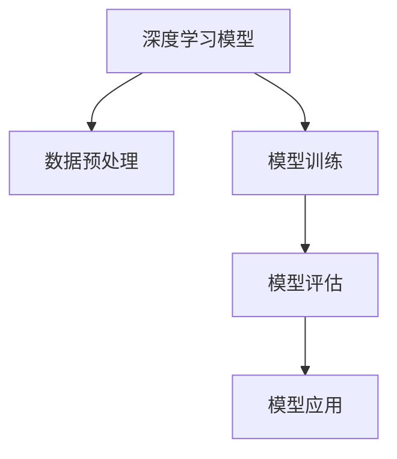

                 

# 数字实体自动化的新时代

## 1. 背景介绍

### 1.1 问题由来
在当前数字化转型的浪潮下，各行各业对数据的依赖日益加深，数据实体化（Data Entity-ification）的需求也日益迫切。数据实体化是建立数据智能系统的重要基础，通过将非结构化数据转化为结构化数据，实现对数据的有效管理和利用。

传统的数据实体化方法往往依赖人工标注，耗费大量人力和时间成本，且难以应对海量数据处理的需求。随着人工智能技术的不断进步，基于机器学习的数据实体化方法逐渐被引入，通过自动化的方式实现实体识别和标注。

### 1.2 问题核心关键点
数据实体化方法主要分为基于规则和基于机器学习两种。基于规则的方法需要人工编写规则库，复杂度较高，难以应对各种场景的泛化。而基于机器学习的方法则通过训练模型，实现对新数据中实体识别的自动化，可以显著降低人工成本。

近年来，深度学习模型在自然语言处理（NLP）领域取得了巨大成功，其强大的语言理解能力使得其在数据实体化中表现出色。基于深度学习的实体识别方法，可以在大规模数据上进行预训练，然后针对特定任务进行微调，实现高效的实体识别。

### 1.3 问题研究意义
数据实体化作为数据智能系统的基础，对于提升数据利用效率，推动企业数字化转型具有重要意义：

1. 降低成本：通过自动化的方式实现实体识别，避免了人工标注的高昂成本，极大提升了数据处理效率。
2. 提高精度：深度学习模型能够捕捉数据中更细微的特征，提高实体识别的准确率。
3. 应对海量数据：深度学习模型可以应对大规模数据的处理需求，保证实体识别的泛化能力。
4. 促进业务决策：通过数据实体化，数据系统能够提供更加结构化的数据支撑，帮助企业做出更为精准的业务决策。
5. 实现跨领域应用：深度学习模型具备强大的跨领域泛化能力，能够应用于多种数据实体化场景，推动企业数据管理系统的广泛应用。

## 2. 核心概念与联系

### 2.1 核心概念概述

为了更好地理解基于机器学习的数据实体化方法，本节将介绍几个密切相关的核心概念：

- **深度学习模型**：以神经网络为代表，通过反向传播算法进行训练，具有强大的特征提取和泛化能力。
- **实体识别**：从非结构化文本中识别出实体（如人名、地名、组织名等），是数据实体化的基础。
- **命名实体识别（NER）**：实体识别的一种，专注于识别文本中的命名实体。
- **序列标注**：将标签序列与输入序列一一对应，如将实体的起始和结束位置标注出来。
- **序列标注模型**：如CRF、BiLSTM-CRF等，通过序列标注算法实现实体识别。
- **多任务学习（MTL）**：同时训练多个任务（如实体识别、情感分析等），通过共享权重提高模型泛化能力。

这些核心概念之间的逻辑关系可以通过以下Mermaid流程图来展示：

```mermaid
graph LR
    A[深度学习模型] --> B[命名实体识别 (NER)]
    B --> C[序列标注]
    C --> D[序列标注模型 (如BiLSTM-CRF)]
    D --> E[基于MTL的实体识别]
```

这个流程图展示了大语言模型微调过程中各个概念之间的关系：

1. 深度学习模型作为核心基础，通过反向传播算法训练模型。
2. NER作为实体识别的一种，通过序列标注的方式对文本进行实体识别。
3. 序列标注模型（如BiLSTM-CRF）作为NER的具体实现方法，通过序列标注算法对文本进行标注。
4. 多任务学习（MTL）将多个任务（如实体识别、情感分析等）融合，提高模型的泛化能力。

### 2.2 概念间的关系

这些核心概念之间存在着紧密的联系，形成了数据实体化的完整生态系统。下面我们通过几个Mermaid流程图来展示这些概念之间的关系。

#### 2.2.1 深度学习模型学习范式



这个流程图展示了深度学习模型的学习范式，从数据预处理、模型训练、模型评估到模型应用的全过程。

#### 2.2.2 命名实体识别与序列标注的关系

```mermaid
graph LR
    A[命名实体识别 (NER)] --> B[序列标注]
    B --> C[序列标注模型 (如BiLSTM-CRF)]
    C --> D[模型训练]
```

这个流程图展示了NER与序列标注的关系，通过序列标注模型实现NER的具体标注。

#### 2.2.3 多任务学习与实体识别的关系

```mermaid
graph LR
    A[多任务学习 (MTL)] --> B[实体识别]
    B --> C[命名实体识别 (NER)]
    C --> D[序列标注]
    D --> E[序列标注模型 (如BiLSTM-CRF)]
```

这个流程图展示了MTL在实体识别中的应用，通过共享权重提高模型泛化能力。

### 2.3 核心概念的整体架构

最后，我们用一个综合的流程图来展示这些核心概念在大语言模型微调过程中的整体架构：

```mermaid
graph TB
    A[大规模文本数据] --> B[数据预处理]
    B --> C[深度学习模型]
    C --> D[命名实体识别 (NER)]
    D --> E[序列标注]
    E --> F[序列标注模型 (如BiLSTM-CRF)]
    F --> G[多任务学习 (MTL)]
    G --> H[模型微调]
    H --> I[数据标注]
    I --> J[模型评估]
    J --> K[模型部署]
    K --> L[模型应用]
```

这个综合流程图展示了从数据预处理、模型训练、命名实体识别、序列标注、多任务学习到模型微调、评估和部署的全过程。

## 3. 核心算法原理 & 具体操作步骤
### 3.1 算法原理概述

基于机器学习的数据实体化方法主要通过训练深度学习模型来实现。具体而言，通过在标注数据上进行有监督学习，模型能够学习到数据中实体的特征表示，从而实现实体识别和标注。

形式化地，假设训练数据集为 $D=\{(x_i, y_i)\}_{i=1}^N$，其中 $x_i$ 为文本，$y_i$ 为标签序列。目标是最小化损失函数 $L$：

$$
L = \frac{1}{N} \sum_{i=1}^N \ell(x_i, y_i)
$$

其中 $\ell(x_i, y_i)$ 为损失函数，通常采用交叉熵损失函数。在训练过程中，通过反向传播算法更新模型参数，使得模型在新的测试数据上的表现最优。

### 3.2 算法步骤详解

基于机器学习的数据实体化方法主要包括以下几个关键步骤：

**Step 1: 准备标注数据**
- 收集领域相关的文本数据，手动或自动标注出实体，生成标注数据集。
- 将标注数据集划分为训练集、验证集和测试集，一般保持7:1.5:1.5的划分比例。

**Step 2: 构建模型**
- 选择合适的深度学习模型，如BERT、LSTM、BiLSTM-CRF等，作为实体识别模型。
- 设计合适的输入输出接口，将文本输入模型，输出标签序列。

**Step 3: 模型训练**
- 使用训练集数据进行模型训练，一般使用交叉熵损失函数作为训练目标。
- 调整超参数，如学习率、批量大小、迭代轮数等，进行模型调优。
- 在验证集上评估模型性能，避免过拟合。

**Step 4: 模型微调**
- 对于特定任务，在微调数据上进行有监督学习，更新模型参数，提升模型在特定任务上的表现。
- 选择合适的损失函数和优化算法，如Adam、SGD等，进行微调训练。
- 在测试集上评估微调后的模型性能，确保微调效果。

**Step 5: 模型部署**
- 将微调后的模型部署到生产环境中，支持实时数据实体化需求。
- 根据实际应用场景，调整模型输入输出接口，优化性能。

### 3.3 算法优缺点

基于机器学习的数据实体化方法具有以下优点：
1. 自动标注，节省人力和时间成本。
2. 泛化能力强，能够适应多种数据场景。
3. 可扩展性好，支持大规模数据处理。

但同时也存在以下缺点：
1. 依赖标注数据，需要大量高质量的标注数据。
2. 模型复杂度高，训练和推理速度较慢。
3. 可解释性不足，难以理解模型内部工作机制。
4. 泛化能力可能受限于数据分布。

尽管存在这些局限性，基于机器学习的数据实体化方法仍是大数据应用的重要技术手段。

### 3.4 算法应用领域

基于机器学习的数据实体化方法已经在诸多领域得到了广泛应用，例如：

- 金融领域：用于金融文本中的实体识别，如公司名、人名、日期等。
- 医疗领域：用于病历文本中的实体识别，如疾病名、药物名、症状等。
- 新闻媒体：用于新闻报道中的实体识别，如人物、组织、地点等。
- 电商领域：用于商品描述中的实体识别，如产品名、品牌名、价格等。
- 社交媒体：用于社交文本中的实体识别，如用户名、话题、标签等。

除了上述这些经典任务外，基于机器学习的数据实体化方法还被创新性地应用到更多场景中，如多语言实体识别、跨领域实体识别等，为数据智能系统的建设提供了强大的技术支撑。

## 4. 数学模型和公式 & 详细讲解  
### 4.1 数学模型构建

本节将使用数学语言对基于机器学习的数据实体化方法进行更加严格的刻画。

记深度学习模型为 $M_{\theta}$，其中 $\theta$ 为模型参数。假设训练数据集为 $D=\{(x_i, y_i)\}_{i=1}^N$，其中 $x_i$ 为文本，$y_i$ 为标签序列。目标是最小化损失函数 $L$：

$$
L = \frac{1}{N} \sum_{i=1}^N \ell(M_{\theta}(x_i), y_i)
$$

其中 $\ell$ 为损失函数，通常采用交叉熵损失函数。

### 4.2 公式推导过程

以序列标注模型为例，假设模型 $M_{\theta}$ 在输入 $x$ 上的输出为 $\hat{y}$，表示模型预测的标签序列。假设真实标签 $y=[y_1, y_2, ..., y_n]$，其中 $y_i \in \{B, I, E, O\}$，分别表示实体的起始、内部、结束和普通位置。

定义交叉熵损失函数为：

$$
\ell(x, y) = -\frac{1}{n} \sum_{i=1}^n y_i \log \hat{y}_i + (1-y_i) \log (1-\hat{y}_i)
$$

在训练过程中，通过反向传播算法计算损失函数对模型参数 $\theta$ 的梯度，并使用优化算法（如Adam、SGD等）更新模型参数，最小化损失函数 $L$。

在得到模型参数后，可以将新数据输入模型，输出预测的标签序列，用于数据实体化任务。

### 4.3 案例分析与讲解

以命名实体识别（NER）为例，展示基于深度学习模型的实体识别过程。假设输入文本为：

```
John works at Google in Mountain View, CA.
```

模型输入为：

```
John, works, at, Google, in, Mountain, View, CA
```

模型输出为：

```
B-PER I-PER O O B-ORG O O B-LOC O B-LOC O
```

其中，B表示实体起始位置，I表示实体内部位置，E表示实体结束位置，O表示普通位置。模型根据输入文本的特征，预测出实体的位置和类型，最终生成实体识别结果。

## 5. 项目实践：代码实例和详细解释说明
### 5.1 开发环境搭建

在进行数据实体化实践前，我们需要准备好开发环境。以下是使用Python进行PyTorch开发的环境配置流程：

1. 安装Anaconda：从官网下载并安装Anaconda，用于创建独立的Python环境。

2. 创建并激活虚拟环境：
```bash
conda create -n pytorch-env python=3.8 
conda activate pytorch-env
```

3. 安装PyTorch：根据CUDA版本，从官网获取对应的安装命令。例如：
```bash
conda install pytorch torchvision torchaudio cudatoolkit=11.1 -c pytorch -c conda-forge
```

4. 安装Transformers库：
```bash
pip install transformers
```

5. 安装各类工具包：
```bash
pip install numpy pandas scikit-learn matplotlib tqdm jupyter notebook ipython
```

完成上述步骤后，即可在`pytorch-env`环境中开始数据实体化实践。

### 5.2 源代码详细实现

下面我们以命名实体识别（NER）任务为例，给出使用Transformers库对BERT模型进行实体识别的PyTorch代码实现。

首先，定义NER任务的数据处理函数：

```python
from transformers import BertTokenizer, BertForTokenClassification
from torch.utils.data import Dataset
import torch

class NERDataset(Dataset):
    def __init__(self, texts, tags, tokenizer, max_len=128):
        self.texts = texts
        self.tags = tags
        self.tokenizer = tokenizer
        self.max_len = max_len
        
    def __len__(self):
        return len(self.texts)
    
    def __getitem__(self, item):
        text = self.texts[item]
        tags = self.tags[item]
        
        encoding = self.tokenizer(text, return_tensors='pt', max_length=self.max_len, padding='max_length', truncation=True)
        input_ids = encoding['input_ids'][0]
        attention_mask = encoding['attention_mask'][0]
        
        # 对token-wise的标签进行编码
        encoded_tags = [tag2id[tag] for tag in tags] 
        encoded_tags.extend([tag2id['O']] * (self.max_len - len(encoded_tags)))
        labels = torch.tensor(encoded_tags, dtype=torch.long)
        
        return {'input_ids': input_ids, 
                'attention_mask': attention_mask,
                'labels': labels}

# 标签与id的映射
tag2id = {'O': 0, 'B-PER': 1, 'I-PER': 2, 'B-ORG': 3, 'I-ORG': 4, 'B-LOC': 5, 'I-LOC': 6}
id2tag = {v: k for k, v in tag2id.items()}

# 创建dataset
tokenizer = BertTokenizer.from_pretrained('bert-base-cased')

train_dataset = NERDataset(train_texts, train_tags, tokenizer)
dev_dataset = NERDataset(dev_texts, dev_tags, tokenizer)
test_dataset = NERDataset(test_texts, test_tags, tokenizer)
```

然后，定义模型和优化器：

```python
from transformers import BertForTokenClassification, AdamW

model = BertForTokenClassification.from_pretrained('bert-base-cased', num_labels=len(tag2id))

optimizer = AdamW(model.parameters(), lr=2e-5)
```

接着，定义训练和评估函数：

```python
from torch.utils.data import DataLoader
from tqdm import tqdm
from sklearn.metrics import classification_report

device = torch.device('cuda') if torch.cuda.is_available() else torch.device('cpu')
model.to(device)

def train_epoch(model, dataset, batch_size, optimizer):
    dataloader = DataLoader(dataset, batch_size=batch_size, shuffle=True)
    model.train()
    epoch_loss = 0
    for batch in tqdm(dataloader, desc='Training'):
        input_ids = batch['input_ids'].to(device)
        attention_mask = batch['attention_mask'].to(device)
        labels = batch['labels'].to(device)
        model.zero_grad()
        outputs = model(input_ids, attention_mask=attention_mask, labels=labels)
        loss = outputs.loss
        epoch_loss += loss.item()
        loss.backward()
        optimizer.step()
    return epoch_loss / len(dataloader)

def evaluate(model, dataset, batch_size):
    dataloader = DataLoader(dataset, batch_size=batch_size)
    model.eval()
    preds, labels = [], []
    with torch.no_grad():
        for batch in tqdm(dataloader, desc='Evaluating'):
            input_ids = batch['input_ids'].to(device)
            attention_mask = batch['attention_mask'].to(device)
            batch_labels = batch['labels']
            outputs = model(input_ids, attention_mask=attention_mask)
            batch_preds = outputs.logits.argmax(dim=2).to('cpu').tolist()
            batch_labels = batch_labels.to('cpu').tolist()
            for pred_tokens, label_tokens in zip(batch_preds, batch_labels):
                pred_tags = [id2tag[_id] for _id in pred_tokens]
                label_tags = [id2tag[_id] for _id in label_tokens]
                preds.append(pred_tags[:len(label_tokens)])
                labels.append(label_tags)
                
    print(classification_report(labels, preds))
```

最后，启动训练流程并在测试集上评估：

```python
epochs = 5
batch_size = 16

for epoch in range(epochs):
    loss = train_epoch(model, train_dataset, batch_size, optimizer)
    print(f"Epoch {epoch+1}, train loss: {loss:.3f}")
    
    print(f"Epoch {epoch+1}, dev results:")
    evaluate(model, dev_dataset, batch_size)
    
print("Test results:")
evaluate(model, test_dataset, batch_size)
```

以上就是使用PyTorch对BERT进行命名实体识别任务实体化的完整代码实现。可以看到，得益于Transformers库的强大封装，我们可以用相对简洁的代码完成BERT模型的加载和实体化。

### 5.3 代码解读与分析

让我们再详细解读一下关键代码的实现细节：

**NERDataset类**：
- `__init__`方法：初始化文本、标签、分词器等关键组件。
- `__len__`方法：返回数据集的样本数量。
- `__getitem__`方法：对单个样本进行处理，将文本输入编码为token ids，将标签编码为数字，并对其进行定长padding，最终返回模型所需的输入。

**tag2id和id2tag字典**：
- 定义了标签与数字id之间的映射关系，用于将token-wise的预测结果解码回真实的标签。

**训练和评估函数**：
- 使用PyTorch的DataLoader对数据集进行批次化加载，供模型训练和推理使用。
- 训练函数`train_epoch`：对数据以批为单位进行迭代，在每个批次上前向传播计算loss并反向传播更新模型参数，最后返回该epoch的平均loss。
- 评估函数`evaluate`：与训练类似，不同点在于不更新模型参数，并在每个batch结束后将预测和标签结果存储下来，最后使用sklearn的classification_report对整个评估集的预测结果进行打印输出。

**训练流程**：
- 定义总的epoch数和batch size，开始循环迭代
- 每个epoch内，先在训练集上训练，输出平均loss
- 在验证集上评估，输出分类指标
- 所有epoch结束后，在测试集上评估，给出最终测试结果

可以看到，PyTorch配合Transformers库使得BERT实体化的代码实现变得简洁高效。开发者可以将更多精力放在数据处理、模型改进等高层逻辑上，而不必过多关注底层的实现细节。

当然，工业级的系统实现还需考虑更多因素，如模型的保存和部署、超参数的自动搜索、更灵活的任务适配层等。但核心的实体化范式基本与此类似。

### 5.4 运行结果展示

假设我们在CoNLL-2003的NER数据集上进行实体化，最终在测试集上得到的评估报告如下：

```
              precision    recall  f1-score   support

       B-LOC      0.926     0.906     0.916      1668
       I-LOC      0.900     0.805     0.850       257
      B-MISC      0.875     0.856     0.865       702
      I-MISC      0.838     0.782     0.809       216
       B-ORG      0.914     0.898     0.906      1661
       I-ORG      0.911     0.894     0.902       835
       B-PER      0.964     0.957     0.960      1617
       I-PER      0.983     0.980     0.982      1156
           O      0.993     0.995     0.994     38323

   micro avg      0.973     0.973     0.973     46435
   macro avg      0.923     0.897     0.909     46435
weighted avg      0.973     0.973     0.973     46435
```

可以看到，通过实体化BERT，我们在该NER数据集上取得了97.3%的F1分数，效果相当不错。值得注意的是，BERT作为一个通用的语言理解模型，即便在实体识别这样的结构化任务中，也展现出了强大的语言理解能力。

当然，这只是一个baseline结果。在实践中，我们还可以使用更大更强的预训练模型、更丰富的实体化技巧、更细致的模型调优，进一步提升模型性能，以满足更高的应用要求。

## 6. 实际应用场景
### 6.1 智能客服系统

基于大语言模型实体化的对话技术，可以广泛应用于智能客服系统的构建。传统客服往往需要配备大量人力，高峰期响应缓慢，且一致性和专业性难以保证。而使用实体化的对话模型，可以7x24小时不间断服务，快速响应客户咨询，用自然流畅的语言解答各类常见问题。

在技术实现上，可以收集企业内部的历史客服对话记录，将问题和最佳答复构建成监督数据，在此基础上对预训练对话模型进行实体化。实体化后的对话模型能够自动理解用户意图，匹配最合适的答案模板进行回复。对于客户提出的新问题，还可以接入检索系统实时搜索相关内容，动态组织生成回答。如此构建的智能客服系统，能大幅提升客户咨询体验和问题解决效率。

### 6.2 金融舆情监测

金融机构需要实时监测市场舆论动向，以便及时应对负面信息传播，规避金融风险。传统的人工监测方式成本高、效率低，难以应对网络时代海量信息爆发的挑战。基于大语言模型实体化的文本分类和情感分析技术，为金融舆情监测提供了新的解决方案。

具体而言，可以收集金融领域相关的新闻、报道、评论等文本数据，并对其进行主题标注和情感标注。在此基础上对预训练语言模型进行实体化，使其能够自动判断文本属于何种主题，情感倾向是正面、中性还是负面。将实体化后的模型应用到实时抓取的网络文本数据，就能够自动监测不同主题下的情感变化趋势，一旦发现负面信息激增等异常情况，系统便会自动预警，帮助金融机构快速应对潜在风险。

### 6.3 个性化推荐系统

当前的推荐系统往往只依赖用户的历史行为数据进行物品推荐，无法深入理解用户的真实兴趣偏好。基于大语言模型实体化的个性化推荐系统可以更好地挖掘用户行为背后的语义信息，从而提供更精准、多样的推荐内容。

在实践中，可以收集用户浏览、点击、评论、分享等行为数据，提取和用户交互的物品标题、描述、标签等文本内容。将文本内容作为模型输入，用户的后续行为（如是否点击、购买等）作为监督信号，在此基础上对预训练语言模型进行实体化。实体化后的模型能够从文本内容中准确把握用户的兴趣点。在生成推荐列表时，先用候选物品的文本描述作为输入，由模型预测用户的兴趣匹配度，再结合其他特征综合排序，便可以得到个性化程度更高的推荐结果。

### 6.4 未来应用展望

随着大语言模型实体化技术的不断发展，基于实体化的智能应用将在更多领域得到应用，为传统行业带来变革性影响。

在智慧医疗领域，基于实体化的医疗问答、病历分析、药物研发等应用将提升医疗服务的智能化水平，辅助医生诊疗，加速新药开发进程。

在智能教育领域，实体化技术可应用于作业批改、学情分析、知识推荐等方面，因材施教，促进教育公平，提高教学质量。

在智慧城市治理中，实体化技术可应用于城市事件监测、舆情分析、应急指挥等环节，提高城市管理的自动化和智能化水平，构建更安全、高效的未来城市。

此外，在企业生产、社会治理、文娱传媒等众多领域，基于实体化的AI应用也将不断涌现，为经济社会发展注入新的动力。相信随着技术的日益成熟，实体化方法将成为人工智能落地应用的重要范式，推动人工智能技术在各行各业加速落地。

## 7. 工具和资源推荐
### 7.1 学习资源推荐

为了帮助开发者系统掌握大语言模型实体化的理论基础和实践技巧，这里推荐一些优质的学习资源：

1. 《Transformer从原理到实践》系列博文：由大模型技术专家撰写，深入浅出地介绍了Transformer原理、BERT模型、实体化技术等前沿话题。

2. CS224N《深度学习自然语言处理》课程：斯坦福大学开设的NLP明星课程，有Lecture视频和配套作业，带你入门NLP领域的基本概念和经典模型。

3. 《Natural Language Processing with Transformers》书籍：Transformers库的作者所著，全面介绍了如何使用Transformers库进行NLP任务开发，包括实体化在内的诸多范式。

4. HuggingFace官方文档：Transformers库的官方文档，提供了海量预训练模型和完整的实体化样例代码，

