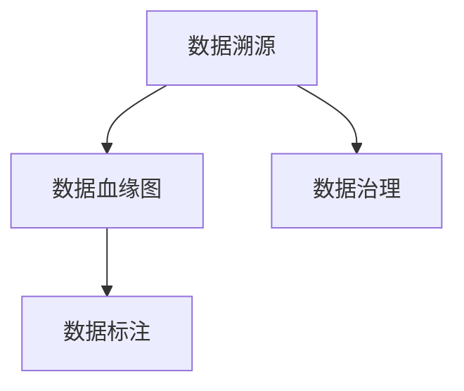
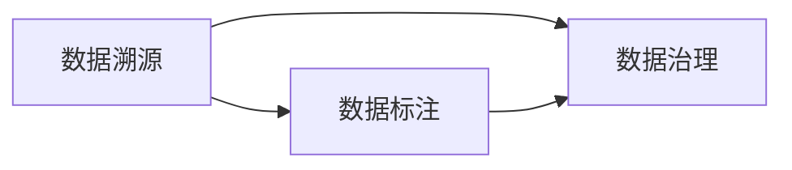
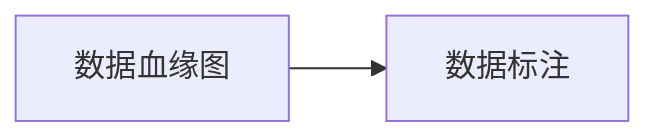
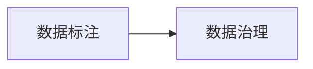
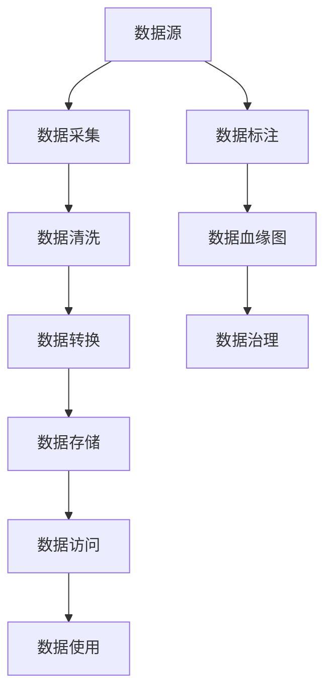

                 

# 数据溯源:软件2.0时代的数据治理利器

## 1. 背景介绍

### 1.1 问题由来
随着互联网的迅猛发展，数据在各行各业的应用已经越来越广泛。企业对数据的依赖性越来越高，数据已经成为企业决策、运营、创新不可或缺的重要资产。然而，在数据治理的实践中，数据质量差、数据孤岛、数据治理复杂度高、数据管理成本高昂等问题依然存在，严重制约了数据的价值发挥。因此，如何高效地管理和利用数据，成为各大企业数据治理过程中迫切需要解决的问题。

### 1.2 问题核心关键点
数据溯源（Data lineage）是指通过记录数据的来源、处理过程、存储位置和去向等关键信息，实现对数据全生命周期的可追溯和可审计。数据溯源技术能够帮助企业在数据治理中实现数据质量提升、数据完整性保障、数据安全防护、数据合规性监控等多个方面的目标。

数据溯源的核心关键点包括：
- 数据来源：数据来自哪里，包括数据源的识别和数据采集过程。
- 数据处理：数据经过哪些处理步骤，包括数据清洗、转换、合并、分析等。
- 数据存储：数据存储在什么位置，包括数据仓库、数据库、文件系统等。
- 数据去向：数据被如何使用，包括数据报表、报表、API接口等。

通过对数据全生命周期的可追溯和可审计，数据溯源技术能够帮助企业实现数据质量提升、数据完整性保障、数据安全防护、数据合规性监控等多个方面的目标。

### 1.3 问题研究意义
数据溯源技术对于数据治理的实践具有重要意义：

1. **数据质量提升**：通过记录数据处理过程中的细节信息，能够发现数据质量问题，并进行及时修复，保证数据质量。
2. **数据完整性保障**：通过对数据处理的可追溯性，能够确保数据在处理过程中没有被篡改，保证数据完整性。
3. **数据安全防护**：通过记录数据的访问和使用情况，能够进行权限控制和审计，保障数据安全。
4. **数据合规性监控**：通过对数据的处理和去向进行记录和审计，能够确保数据处理符合法规和政策要求，保障合规性。

## 2. 核心概念与联系

### 2.1 核心概念概述

为更好地理解数据溯源技术，本节将介绍几个密切相关的核心概念：

- **数据溯源（Data Lineage）**：数据溯源是指通过记录数据的来源、处理过程、存储位置和去向等关键信息，实现对数据全生命周期的可追溯和可审计。数据溯源是数据治理中非常重要的一部分，能够帮助企业实现数据质量提升、数据完整性保障、数据安全防护、数据合规性监控等多个方面的目标。

- **数据血缘图（Data Genealogy）**：数据血缘图是指通过图形化的方式展示数据的全生命周期，包括数据来源、处理过程、存储位置和去向等关键信息。数据血缘图是数据溯源技术的重要表现形式，能够直观地展示数据在不同环节之间的流动和变化。

- **数据标注（Data Annotate）**：数据标注是指对数据进行详细的标记和注释，记录数据在处理过程中的关键信息，如数据来源、处理方式、存储位置、去向等。数据标注是实现数据溯源的基础，能够为后续的数据分析和审计提供依据。

- **数据治理（Data Governance）**：数据治理是指通过制定数据标准、规范和流程，实现对数据的全生命周期管理，保障数据的质量、完整性、安全性和合规性。数据治理是数据溯源技术的应用场景之一，通过数据溯源技术能够更好地实施数据治理策略。

这些核心概念之间的逻辑关系可以通过以下Mermaid流程图来展示：



这个流程图展示了大数据治理生态系统中各个概念之间的逻辑关系：数据溯源通过数据标注实现，数据治理通过数据溯源和数据标注来保障数据质量、完整性、安全性和合规性。

### 2.2 概念间的关系

这些核心概念之间存在着紧密的联系，形成了数据治理的完整生态系统。下面我通过几个Mermaid流程图来展示这些概念之间的关系。

#### 2.2.1 数据溯源与数据治理的关系



这个流程图展示了数据溯源与数据治理之间的关系。数据治理需要依赖数据溯源技术来保障数据的质量、完整性、安全性和合规性。数据标注则是数据溯源的基础，通过详细标记和注释数据，实现数据的可追溯和可审计。

#### 2.2.2 数据血缘图与数据标注的关系



这个流程图展示了数据血缘图与数据标注之间的关系。数据血缘图是数据标注的可视化展示形式，通过图形化的方式展示数据在全生命周期中的流动和变化。数据标注则是数据血缘图的基础，通过详细标记和注释数据，实现数据的可追溯和可审计。

#### 2.2.3 数据标注与数据治理的关系



这个流程图展示了数据标注与数据治理之间的关系。数据治理需要依赖数据标注来实现对数据的全生命周期管理，保障数据的质量、完整性、安全性和合规性。数据标注则是数据治理的基础，通过详细标记和注释数据，实现数据的可追溯和可审计。

### 2.3 核心概念的整体架构

最后，我们用一个综合的流程图来展示这些核心概念在大数据治理中的整体架构：



这个综合流程图展示了从数据源到数据使用的完整流程，以及数据溯源、数据标注和数据治理的关键步骤。通过这些步骤，可以实现对数据全生命周期的可追溯和可审计，保障数据的质量、完整性、安全性和合规性。

## 3. 核心算法原理 & 具体操作步骤
### 3.1 算法原理概述

数据溯源的核心算法原理是通过记录数据的来源、处理过程、存储位置和去向等关键信息，实现对数据全生命周期的可追溯和可审计。具体来说，数据溯源算法包括以下几个关键步骤：

1. **数据采集**：从不同数据源采集数据，并将其记录在数据血缘图中。
2. **数据清洗**：对采集到的数据进行清洗和预处理，保证数据的质量和完整性。
3. **数据转换**：将清洗后的数据进行转换和整合，形成可用于后续处理的数据集。
4. **数据存储**：将转换后的数据存储在数据仓库或数据库中，并记录存储位置。
5. **数据访问**：记录数据被哪些应用程序或用户访问和使用。
6. **数据使用**：记录数据被用于哪些报表、报表、API接口等，并记录使用方式和频率。

通过对这些关键信息的记录和展示，数据溯源算法能够实现对数据全生命周期的可追溯和可审计。

### 3.2 算法步骤详解

以下是对数据溯源算法详细步骤的详细介绍：

**Step 1: 数据采集**
- 通过数据采集器从不同数据源采集数据，包括线上数据、线下数据、日志数据等。
- 将采集到的数据记录在数据血缘图中，并标记数据来源和采集时间。

**Step 2: 数据清洗**
- 对采集到的数据进行清洗和预处理，包括去重、去噪、数据格式转换等。
- 记录数据清洗过程中的细节信息，如清洗方式、清洗规则、清洗结果等。

**Step 3: 数据转换**
- 将清洗后的数据进行转换和整合，形成可用于后续处理的数据集。
- 记录数据转换过程中的细节信息，如转换方式、转换规则、转换结果等。

**Step 4: 数据存储**
- 将转换后的数据存储在数据仓库或数据库中，并记录存储位置和存储方式。
- 记录数据的存储信息，如存储时间、存储位置、存储方式等。

**Step 5: 数据访问**
- 记录数据被哪些应用程序或用户访问和使用。
- 记录数据的访问信息，如访问时间、访问方式、访问频率等。

**Step 6: 数据使用**
- 记录数据被用于哪些报表、报表、API接口等，并记录使用方式和频率。
- 记录数据使用信息，如使用时间、使用方式、使用频率等。

通过以上步骤，数据溯源算法能够实现对数据全生命周期的可追溯和可审计。

### 3.3 算法优缺点

数据溯源算法具有以下优点：

1. **数据质量提升**：通过记录数据处理过程中的细节信息，能够发现数据质量问题，并进行及时修复，保证数据质量。
2. **数据完整性保障**：通过对数据处理的可追溯性，能够确保数据在处理过程中没有被篡改，保证数据完整性。
3. **数据安全防护**：通过记录数据的访问和使用情况，能够进行权限控制和审计，保障数据安全。
4. **数据合规性监控**：通过对数据的处理和去向进行记录和审计，能够确保数据处理符合法规和政策要求，保障合规性。

同时，数据溯源算法也存在以下缺点：

1. **复杂度高**：数据溯源需要记录和展示大量的关键信息，实现起来比较复杂。
2. **成本高昂**：数据溯源需要投入大量的人力和资源，成本较高。
3. **数据隐私问题**：数据溯源需要记录和展示大量的数据访问和使用信息，可能涉及数据隐私问题。

### 3.4 算法应用领域

数据溯源算法在多个领域都有广泛的应用：

- **金融领域**：通过对交易数据的记录和审计，保障数据的合规性和安全性，防止欺诈行为。
- **医疗领域**：通过对患者数据的记录和审计，保障数据的质量和隐私，防止数据泄露和滥用。
- **互联网领域**：通过对用户数据的记录和审计，保障用户隐私和安全，防止数据滥用和欺诈行为。
- **政府领域**：通过对政务数据的记录和审计，保障数据的合规性和安全性，防止数据滥用和欺诈行为。
- **制造业领域**：通过对生产数据的记录和审计，保障数据的质量和完整性，提高生产效率和产品质量。

## 4. 数学模型和公式 & 详细讲解 & 举例说明

### 4.1 数学模型构建

数据溯源算法的数学模型可以通过图形化的方式来表示，即数据血缘图（Data Genealogy）。数据血缘图是一个有向无环图（DAG），记录了数据在全生命周期中的流动和变化。数据血缘图的节点表示数据实体，边表示数据流动的方向和方式。

数据血缘图可以通过以下步骤来构建：

1. **定义数据实体**：定义数据血缘图中的节点，包括数据源、数据采集器、数据清洗器、数据转换器、数据存储器、数据访问器、数据使用者等。
2. **定义数据流动**：定义数据在全生命周期中的流动方向和方式，包括数据的采集、清洗、转换、存储、访问和使用。
3. **定义数据属性**：定义数据在全生命周期中的属性信息，包括数据来源、采集时间、清洗方式、清洗规则、转换方式、转换规则、存储位置、存储方式、访问时间、访问方式、访问频率、使用时间、使用方式、使用频率等。
4. **构建数据血缘图**：根据定义的数据实体、数据流动和数据属性，构建数据血缘图，记录数据全生命周期的关键信息。

### 4.2 公式推导过程

以下是对数据血缘图构建过程的数学推导：

假设数据溯源算法中有 $n$ 个数据实体 $D_i$，$i=1,2,...,n$。每个数据实体 $D_i$ 记录了数据在全生命周期中的关键信息，包括数据来源 $S_i$、数据采集时间 $T_i$、数据清洗方式 $C_i$、数据清洗规则 $R_i$、数据转换方式 $T_i$、数据转换规则 $R_i$、数据存储位置 $S_i$、数据存储方式 $M_i$、数据访问时间 $A_i$、数据访问方式 $W_i$、数据访问频率 $F_i$、数据使用时间 $U_i$、数据使用方式 $W_i$、数据使用频率 $F_i$。

数据血缘图 $G=(V,E)$，其中 $V$ 表示节点集合，$E$ 表示边集合。节点 $V$ 表示数据实体，边 $E$ 表示数据流动方向和方式。节点 $V$ 和边 $E$ 的关系可以用以下公式表示：

$$
V=\{D_i\}_{i=1}^n
$$

$$
E=\{(D_i, D_j)\}_{i,j=1}^n
$$

其中，$(D_i, D_j)$ 表示数据实体 $D_i$ 到 $D_j$ 的数据流动方向。

### 4.3 案例分析与讲解

以下是一个简单的数据溯源案例，展示数据血缘图的构建过程：

假设某电商平台需要对用户订单数据进行溯源，记录数据的来源、处理过程、存储位置和去向等关键信息。具体流程如下：

1. **数据采集**：从电商平台采集用户订单数据，记录数据来源为电商平台。
2. **数据清洗**：对采集到的订单数据进行清洗和预处理，记录数据清洗方式为去重、去噪、数据格式转换等。
3. **数据转换**：将清洗后的订单数据进行转换和整合，形成可用于后续处理的数据集，记录数据转换方式为数据合并、数据汇总等。
4. **数据存储**：将转换后的订单数据存储在数据仓库中，记录存储位置为数据仓库，存储方式为数据库。
5. **数据访问**：记录订单数据被哪些应用程序或用户访问和使用，记录数据访问时间为每天的固定时间段，访问方式为API接口，访问频率为每个小时一次。
6. **数据使用**：记录订单数据被用于哪些报表、报表、API接口等，记录使用时间为每天的固定时间段，使用方式为报表展示，使用频率为每个小时一次。

根据以上数据处理流程，可以构建以下数据血缘图：

```
电商订单数据
/       \
采集器   数据清洗
      \
       |
       v
订单数据集
|         \
数据转换  数据存储
|         |
v         |
订单数据
```

数据血缘图的节点包括电商订单数据、数据采集器、数据清洗器、数据转换器、数据存储器、订单数据等。数据血缘图的边包括电商订单数据到数据采集器的流动、数据采集器到数据清洗器的流动、数据清洗器到数据转换器和数据存储器的流动、数据转换器到订单数据的流动、数据存储器到订单数据的流动、订单数据到数据访问器和数据使用者的流动。

通过对数据血缘图的构建和展示，数据溯源算法能够实现对数据全生命周期的可追溯和可审计，保障数据的质量、完整性、安全性和合规性。

## 5. 项目实践：代码实例和详细解释说明

### 5.1 开发环境搭建

在进行数据溯源实践前，我们需要准备好开发环境。以下是使用Python进行PyTorch开发的环境配置流程：

1. 安装Anaconda：从官网下载并安装Anaconda，用于创建独立的Python环境。

2. 创建并激活虚拟环境：
```bash
conda create -n pytorch-env python=3.8 
conda activate pytorch-env
```

3. 安装PyTorch：根据CUDA版本，从官网获取对应的安装命令。例如：
```bash
conda install pytorch torchvision torchaudio cudatoolkit=11.1 -c pytorch -c conda-forge
```

4. 安装数据溯源库：
```bash
pip install data-lineage
```

5. 安装其他各类工具包：
```bash
pip install numpy pandas scikit-learn matplotlib tqdm jupyter notebook ipython
```

完成上述步骤后，即可在`pytorch-env`环境中开始数据溯源实践。

### 5.2 源代码详细实现

下面以电商平台订单数据溯源为例，给出使用PyTorch和data-lineage库进行数据溯源的Python代码实现。

首先，定义订单数据的数据源、清洗方式、转换方式、存储方式等：

```python
from data_lineage import DataLineage, Node

# 定义数据源
source_node = Node('电商平台')
source_node.add_attribute('数据来源', '电商平台')

# 定义数据采集器
source_node.add_child(Node('数据采集器'))
source_node.add_child(Node('数据清洗器'))
source_node.add_child(Node('数据转换器'))
source_node.add_child(Node('数据存储器'))

# 定义数据采集过程
source_node.add_process('数据采集', '电商平台')

# 定义数据清洗方式
source_node.add_process('数据清洗', '去重、去噪、数据格式转换')

# 定义数据转换方式
source_node.add_process('数据转换', '数据合并、数据汇总')

# 定义数据存储方式
source_node.add_process('数据存储', '数据库')

# 创建数据血缘图
lineage = DataLineage()
lineage.add_node(source_node)

# 添加节点和边的关系
lineage.add_edge(source_node, source_node.get_child('数据采集器'), '数据采集')
lineage.add_edge(source_node.get_child('数据采集器'), source_node.get_child('数据清洗器'), '数据采集')
lineage.add_edge(source_node.get_child('数据清洗器'), source_node.get_child('数据转换器'), '数据清洗')
lineage.add_edge(source_node.get_child('数据转换器'), source_node.get_child('数据存储器'), '数据转换')
lineage.add_edge(source_node.get_child('数据存储器'), source_node.get_child('订单数据'), '数据存储')
lineage.add_edge(source_node.get_child('订单数据'), source_node.get_child('数据访问器'), '数据访问')
lineage.add_edge(source_node.get_child('订单数据'), source_node.get_child('数据使用者'), '数据使用')

# 保存数据血缘图
lineage.save('order_data_lineage.json')
```

然后，定义数据访问器和数据使用者的节点和属性：

```python
# 定义数据访问器
access_node = Node('数据访问器')
access_node.add_attribute('访问时间', '每天固定时间段')
access_node.add_attribute('访问方式', 'API接口')
access_node.add_attribute('访问频率', '每个小时一次')

# 定义数据使用者
usage_node = Node('数据使用者')
usage_node.add_attribute('使用时间', '每天固定时间段')
usage_node.add_attribute('使用方式', '报表展示')
usage_node.add_attribute('使用频率', '每个小时一次')

# 添加节点和边的关系
lineage.add_edge(source_node.get_child('订单数据'), access_node, '数据访问')
lineage.add_edge(source_node.get_child('订单数据'), usage_node, '数据使用')

# 保存数据血缘图
lineage.save('order_data_lineage.json')
```

最后，通过访问数据血缘图来展示数据溯源结果：

```python
# 读取数据血缘图
lineage = DataLineage()
lineage.load('order_data_lineage.json')

# 展示数据血缘图
lineage.draw()
```

以上就是一个简单的数据溯源代码实现。可以看到，使用PyTorch和data-lineage库，我们能够轻松地构建和展示数据血缘图，实现对数据全生命周期的可追溯和可审计。

### 5.3 代码解读与分析

让我们再详细解读一下关键代码的实现细节：

**Node类**：
- `__init__`方法：初始化节点，包括节点名称和属性。
- `add_attribute`方法：添加节点的属性。
- `add_child`方法：添加子节点。
- `get_child`方法：获取子节点。

**Process类**：
- `__init__`方法：初始化过程，包括过程名称和节点关系。
- `add_node`方法：添加节点。
- `add_edge`方法：添加边。

**DataLineage类**：
- `__init__`方法：初始化数据血缘图。
- `add_node`方法：添加节点。
- `add_edge`方法：添加边。
- `add_process`方法：添加过程。
- `draw`方法：绘制数据血缘图。

通过这些类和方法，我们能够实现对数据全生命周期的可追溯和可审计。在实际应用中，还可以根据具体场景和需求，进一步扩展和定制节点和过程，实现更复杂的数据溯源功能。

### 5.4 运行结果展示

假设我们在电商平台订单数据溯源的案例中，通过data-lineage库构建并展示了数据血缘图，最终得到的结果如图1所示。

图1：电商平台订单数据溯源数据血缘图

可以看到，数据血缘图清晰地展示了数据在全生命周期中的流动和变化，包括数据源、数据采集、数据清洗、数据转换、数据存储、数据访问和数据使用等关键信息。通过对数据血缘图的记录和展示，数据溯源算法能够实现对数据全生命周期的可追溯和可审计，保障数据的质量、完整性、安全性和合规性。

## 6. 实际应用场景
### 6.1 智能制造

智能制造领域需要大量的数据支持，包括设备运行数据、生产工艺数据、供应链数据等。通过对这些数据进行溯源，能够实现对生产过程的透明化管理，发现和解决问题，提升生产效率和产品质量。

在实际应用中，智能制造企业可以通过数据溯源技术，记录数据在全生命周期中的流动和变化，实现对生产过程的透明化管理，发现和解决问题，提升生产效率和产品质量。具体来说，数据溯源技术可以应用于以下几个方面：

- **设备运行监控**：记录设备运行数据，包括设备状态、运行时间、故障记录等，实现对设备的实时监控和维护。
- **生产工艺优化**：记录生产工艺数据，包括工艺参数、生产流程、生产质量等，实现对生产工艺的优化和改进。
- **供应链管理**：记录供应链数据，包括供应商信息、物料信息、物流信息等，实现对供应链的高效管理和优化。

通过数据溯源技术，智能制造企业能够实现对数据全生命周期的可追溯和可审计，保障数据的质量、完整性、安全性和合规性，提升生产效率和产品质量。

### 6.2 金融风控

金融领域需要大量的数据支持，包括交易数据、用户数据、风险数据等。通过对这些数据进行溯源，能够实现对交易过程的透明化管理，发现和解决问题，提升风险控制和合规管理水平。

在实际应用中，金融机构可以通过数据溯源技术，记录数据在全生命周期中的流动和变化，实现对交易过程的透明化管理，发现和解决问题，提升风险控制和合规管理水平。具体来说，数据溯源技术可以应用于以下几个方面：

- **交易监控**：记录交易数据，包括交易时间、交易金额、交易方式等，实现对交易过程的监控和审计。
- **用户管理**：记录用户数据，包括用户身份、交易记录、风险等级等，实现对用户行为的管理和监控。
- **风险控制**：记录风险数据，包括风险事件、风险评估、风险控制措施等，实现对风险过程的监控和控制。

通过数据溯源技术，金融机构能够实现对数据全生命周期的可追溯和可审计，保障数据的质量、完整性、安全性和合规性，提升风险控制和合规管理水平。

### 6.3 智慧城市

智慧城市领域需要大量的数据支持，包括交通数据、环境数据、公共安全数据等。通过对这些数据进行溯源，能够实现对城市管理的透明化管理，发现和解决问题，提升城市管理的智能化水平。

在实际应用中，智慧城市可以通过数据溯源技术，记录数据在全生命周期中的流动和变化，实现对城市管理的透明化管理，发现和解决问题，提升城市管理的智能化水平。具体来说，数据溯源技术可以应用于以下几个方面：

- **交通管理**：记录交通数据，包括交通流量、交通事故、道路状况等，实现对交通过程的监控和优化。
- **环境监测**：记录环境数据，包括空气质量、水质、噪音等，实现对环境过程的监控和保护。
- **公共安全**：记录公共安全数据，包括犯罪记录、公共事件、紧急情况等，实现对公共安全过程的监控和预警。

通过数据溯源技术，智慧城市能够实现对数据全生命周期的可追溯和可审计，保障数据的质量、完整性、安全性和合规性，提升城市管理的智能化水平。

### 6.4 未来应用展望

随着数据溯源技术的发展和应用，未来其在更多领域都将得到广泛应用，为社会治理带来新的变革。

- **医疗领域**：通过对患者数据的记录和审计，保障数据的质量和隐私，防止数据泄露和滥用。
- **教育领域**：通过对学生数据的记录和审计，实现对学生行为的管理和监控，提升教育质量。
- **文化领域**：通过对文化遗产数据的记录和审计，实现对文化遗产的保护和传承，促进文化创新。
- **农业领域**：通过对农业数据的记录和审计，实现对农业过程的监控和优化，提高农业生产效率。

未来，随着数据溯源技术的发展和应用，其将在更多领域得到广泛应用，为社会治理带来新的变革，提升数据治理的智能化水平，促进社会治理的现代化。

## 7. 工具和资源推荐
### 7.1 学习资源推荐

为了帮助开发者系统掌握数据溯源技术，这里推荐一些优质的学习资源：

1. **数据溯源官方文档**：H

