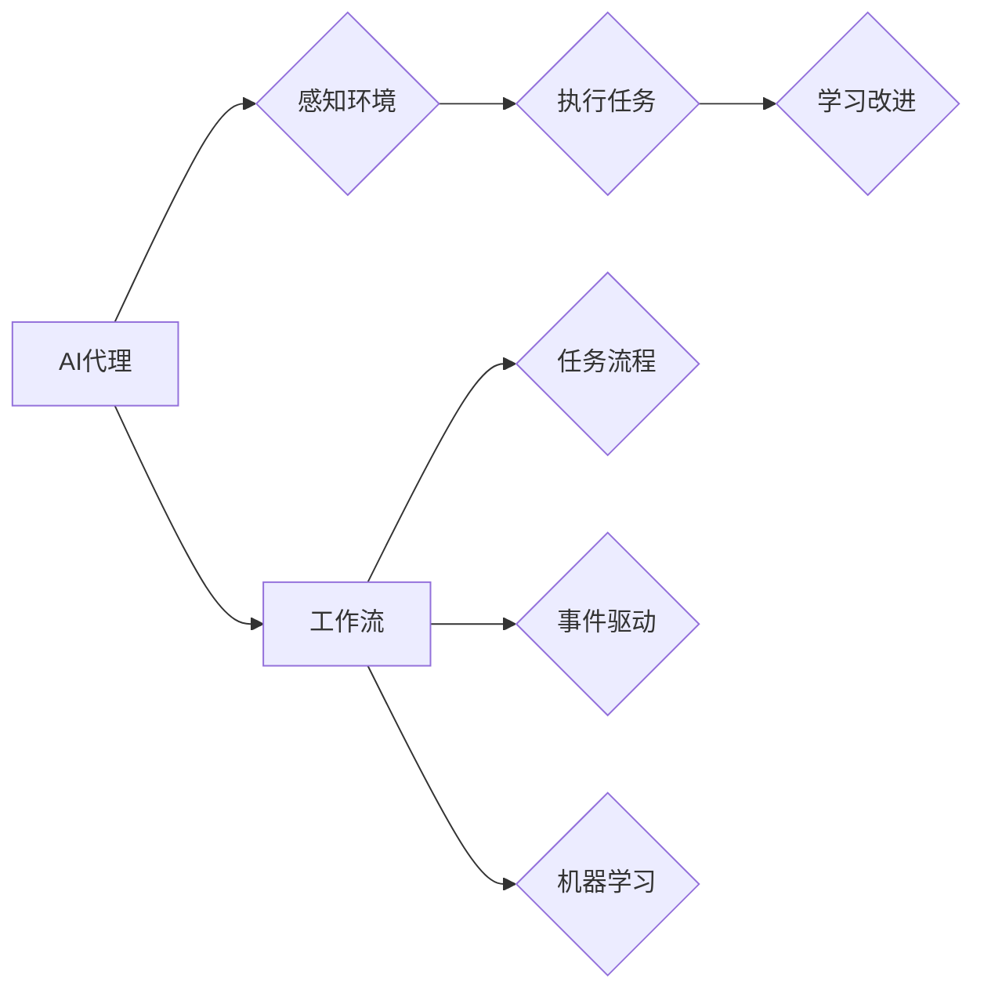

# AI人工智能代理工作流 AI Agent WorkFlow：在物联网中的应用

> 关键词：AI代理，工作流，物联网，智能设备，自动化，事件驱动，机器学习

## 1. 背景介绍

随着物联网（IoT）技术的飞速发展，智能设备在各个领域得到广泛应用。这些设备通过传感器收集数据，并通过网络传输至云端或其他设备进行处理和分析。然而，随着设备数量的增加和复杂性的提升，如何有效地管理和控制这些设备成为了一个重要挑战。AI人工智能代理工作流（AI Agent WorkFlow）作为一种新兴的解决方案，旨在通过智能代理（AI Agents）来简化物联网设备的管理和自动化流程。

### 1.1 问题的由来

物联网设备通常具有以下特点：

- **数量庞大**：物联网设备种类繁多，数量庞大，传统的集中式管理方式难以有效应对。
- **分布式部署**：设备通常分布在不同的地理位置，网络环境复杂。
- **实时性要求**：物联网应用往往对实时性有较高要求，需要快速响应和处理数据。
- **异构性**：不同类型的设备具有不同的功能和接口，需要统一的管理框架。

### 1.2 研究现状

当前，针对物联网设备管理和自动化，主要有以下几种解决方案：

- **集中式管理平台**：通过构建集中式管理平台，实现对设备的统一监控、配置和运维。但这种方案存在单点故障风险，且难以适应大量异构设备的接入。
- **边缘计算**：将计算任务从云端下放到边缘设备或边缘服务器，提高数据处理速度和实时性。但边缘计算设备资源有限，难以承载复杂的应用。
- **AI代理**：利用人工智能技术，为每个设备或设备群组分配智能代理，实现自主决策和协同工作。

### 1.3 研究意义

AI人工智能代理工作流在物联网中的应用具有重要的研究意义：

- **提高效率**：通过自动化处理，减少人工干预，提高设备管理和运维效率。
- **降低成本**：减少人力成本和维护成本，降低运营风险。
- **提升智能**：使物联网设备具备更强的自主决策能力，适应复杂多变的环境。
- **创新应用**：为物联网应用带来新的可能性，推动产业变革。

### 1.4 本文结构

本文将围绕AI人工智能代理工作流在物联网中的应用展开讨论，内容安排如下：

- 第2部分，介绍AI代理和AI代理工作流的核心概念。
- 第3部分，阐述AI人工智能代理工作流的基本原理和具体操作步骤。
- 第4部分，介绍AI代理工作流的设计和实现方法。
- 第5部分，分析AI人工智能代理工作流在实际应用中的场景和案例。
- 第6部分，展望AI人工智能代理工作流未来的发展趋势与挑战。
- 第7部分，推荐AI人工智能代理工作流相关的学习资源、开发工具和参考文献。
- 第8部分，总结全文，展望AI人工智能代理工作流技术的发展前景。

## 2. 核心概念与联系

为了更好地理解AI人工智能代理工作流在物联网中的应用，本节将介绍几个核心概念：

- **AI代理**：一种具有智能决策能力的软件实体，能够感知环境、执行任务、学习改进。
- **工作流**：一组有序的操作步骤，用于完成特定的任务或业务流程。
- **事件驱动**：一种编程范式，通过事件触发程序执行，提高系统的响应速度和可扩展性。
- **机器学习**：一种让计算机模拟人类学习行为的算法，用于从数据中学习规律和模式。

它们的逻辑关系如下图所示：



可以看出，AI代理通过感知环境、执行任务和学习改进，实现智能行为。工作流则将这些行为组织成有序的步骤，通过事件驱动和机器学习等技术实现高效、智能的物联网管理。

## 3. 核心算法原理 & 具体操作步骤

### 3.1 算法原理概述

AI人工智能代理工作流的核心原理是利用AI代理来管理物联网设备，通过工作流技术将设备的操作步骤串联起来，实现自动化、智能化的流程控制。

### 3.2 算法步骤详解

AI人工智能代理工作流通常包含以下步骤：

**Step 1: 设备接入**

将物联网设备接入网络，并为其分配唯一的标识符。

**Step 2: 代理配置**

为每个设备或设备群组配置AI代理，包括感知器、执行器、决策器等组件。

**Step 3: 工作流设计**

根据业务需求，设计工作流，包括任务流程、事件触发、规则引擎等。

**Step 4: 代理执行**

AI代理根据工作流的要求，执行相应的任务，如数据采集、事件处理、决策决策等。

**Step 5: 结果反馈**

AI代理将执行结果反馈给系统，包括数据、状态、日志等。

**Step 6: 持续优化**

根据执行结果和学习到的知识，持续优化AI代理的行为和工作流。

### 3.3 算法优缺点

**优点**：

- **自动化**：通过工作流实现设备操作的自动化，减少人工干预。
- **智能化**：AI代理能够根据环境变化和学习到的知识，自主决策和执行任务。
- **灵活性**：工作流可以灵活配置，适应不同的业务需求。
- **可扩展性**：可扩展到更多设备和更复杂的场景。

**缺点**：

- **复杂性**：设计和实现AI人工智能代理工作流需要一定的技术门槛。
- **学习成本**：AI代理需要通过大量数据学习，学习成本较高。
- **安全性**：需要确保AI代理的安全性和可靠性。

### 3.4 算法应用领域

AI人工智能代理工作流可以应用于以下领域：

- **智慧城市**：环境监测、交通管理、能源管理等。
- **智能家居**：家电控制、安全监控、健康管理等。
- **工业物联网**：设备监控、生产调度、故障诊断等。
- **农业物联网**：环境监测、灌溉控制、病虫害防治等。

## 4. 数学模型和公式 & 详细讲解 & 举例说明

### 4.1 数学模型构建

AI人工智能代理工作流的数学模型主要包括以下部分：

- **感知模型**：用于描述AI代理如何感知环境，如传感器数据、环境状态等。
- **决策模型**：用于描述AI代理如何进行决策，如决策树、神经网络等。
- **执行模型**：用于描述AI代理如何执行任务，如控制器、动作序列等。

### 4.2 公式推导过程

以感知模型为例，假设传感器收集到的数据为 $x$，则感知模型的输出为 $y=f(x)$，其中 $f$ 为感知函数。

### 4.3 案例分析与讲解

以智能家居场景为例，假设用户需要控制家中的灯光。当用户打开手机上的智能家居应用，并发送“打开客厅灯光”的指令时，AI代理感知到该事件，并根据工作流的要求，向灯光设备发送控制指令，使灯光亮起。

## 5. 项目实践：代码实例和详细解释说明

### 5.1 开发环境搭建

为了实现AI人工智能代理工作流，我们需要搭建以下开发环境：

- 操作系统：Linux或Windows
- 编程语言：Python
- 框架：Django、Flask等
- 数据库：MySQL、MongoDB等

### 5.2 源代码详细实现

以下是一个简单的AI代理工作流示例：

```python
# 代理类
class Agent:
    def __init__(self, name):
        self.name = name

    def perceive(self):
        # 感知环境
        pass

    def decide(self):
        # 决策
        pass

    def act(self):
        # 执行任务
        pass

# 工作流类
class Workflow:
    def __init__(self, steps):
        self.steps = steps

    def execute(self, agent):
        for step in self.steps:
            step(agent)

# 感知步骤
class PerceiveStep:
    def __init__(self, sensor):
        self.sensor = sensor

    def __call__(self, agent):
        data = self.sensor.read()
        agent.perceive(data)

# 决策步骤
class DecideStep:
    def __init__(self, rule_engine):
        self.rule_engine = rule_engine

    def __call__(self, agent):
        rule = self.rule_engine.get_rule(agent)
        agent.decide(rule)

# 执行步骤
class ActStep:
    def __init__(self, actuator):
        self.actuator = actuator

    def __call__(self, agent):
        action = agent.act()
        self.actuator.execute(action)

# 传感器类
class Sensor:
    def read(self):
        # 读取传感器数据
        pass

# 执行器类
class Actuator:
    def execute(self, action):
        # 执行动作
        pass

# 规则引擎类
class RuleEngine:
    def get_rule(self, agent):
        # 获取规则
        pass

# 创建代理、工作流、传感器、执行器和规则引擎
agent = Agent("LivingRoomLightAgent")
sensor = Sensor()
actuator = Actuator()
rule_engine = RuleEngine()

# 设计工作流
perceive_step = PerceiveStep(sensor)
decide_step = DecideStep(rule_engine)
act_step = ActStep(actuator)
workflow = Workflow([perceive_step, decide_step, act_step])

# 执行工作流
workflow.execute(agent)
```

### 5.3 代码解读与分析

以上代码展示了AI人工智能代理工作流的基本结构。其中，Agent类代表AI代理，包含感知、决策和执行等方法。Workflow类代表工作流，包含一系列步骤，如感知步骤、决策步骤和执行步骤。Sensor类代表传感器，用于读取环境数据。Actuator类代表执行器，用于执行动作。RuleEngine类代表规则引擎，用于获取决策规则。

### 5.4 运行结果展示

在实际运行过程中，代理会根据工作流的要求，依次执行感知、决策和执行步骤，最终实现设备控制。

## 6. 实际应用场景

### 6.1 智慧城市

在智慧城市中，AI人工智能代理工作流可以用于以下场景：

- **环境监测**：监测空气质量、水质、噪声等环境指标，并及时报警。
- **交通管理**：智能交通信号灯控制、交通流量监控、事故预警等。
- **能源管理**：智能电网控制、节能降耗、故障诊断等。

### 6.2 智能家居

在智能家居中，AI人工智能代理工作流可以用于以下场景：

- **家电控制**：智能空调、照明、安防等设备控制。
- **安全监控**：入侵检测、火灾报警、燃气泄漏检测等。
- **健康管理**：心率监测、睡眠监测、用药提醒等。

### 6.3 工业物联网

在工业物联网中，AI人工智能代理工作流可以用于以下场景：

- **设备监控**：设备运行状态监控、故障诊断、预防性维护等。
- **生产调度**：生产流程优化、资源调度、生产数据监控等。
- **安全监控**：生产环境监测、危险源预警等。

## 7. 工具和资源推荐

### 7.1 学习资源推荐

- 《人工智能：一种现代的方法》
- 《Python编程：从入门到实践》
- 《物联网技术：原理与应用》

### 7.2 开发工具推荐

- Python编程语言
- Django、Flask等Web框架
- MySQL、MongoDB等数据库
- TensorFlow、PyTorch等机器学习框架

### 7.3 相关论文推荐

- **《An Overview of AI Agent Technologies**》
- **《AI Agents for IoT**》
- **《A Survey of IoT Security and Privacy**》

## 8. 总结：未来发展趋势与挑战

### 8.1 研究成果总结

本文介绍了AI人工智能代理工作流在物联网中的应用，阐述了其基本原理、操作步骤、设计方法和实际应用场景。通过AI代理和物联网设备的结合，AI人工智能代理工作流可以实现对物联网设备的自动化、智能化的管理，提高效率、降低成本，并推动物联网技术的应用和发展。

### 8.2 未来发展趋势

未来，AI人工智能代理工作流将呈现以下发展趋势：

- **更加智能**：AI代理将具备更强的学习能力、决策能力和适应性。
- **更加开放**：AI人工智能代理工作流将与其他技术（如区块链、5G等）结合，形成更加开放、互联的生态系统。
- **更加高效**：AI人工智能代理工作流将进一步提高效率，降低成本，推动物联网技术的普及。

### 8.3 面临的挑战

尽管AI人工智能代理工作流在物联网中具有广泛的应用前景，但仍面临以下挑战：

- **安全性**：确保AI代理和物联网设备的安全性和可靠性。
- **隐私保护**：保护用户隐私和数据安全。
- **标准化**：建立统一的接口和协议，实现不同设备和平台的互联互通。
- **伦理问题**：确保AI代理的行为符合伦理道德标准。

### 8.4 研究展望

未来，AI人工智能代理工作流的研究将重点关注以下方向：

- **安全性与可靠性**：提高AI代理和物联网设备的安全性和可靠性，确保系统的稳定运行。
- **隐私保护**：研究隐私保护技术，保护用户隐私和数据安全。
- **标准化**：建立统一的接口和协议，推动物联网设备的互联互通。
- **伦理道德**：研究AI代理的伦理道德问题，确保其行为符合人类价值观。

相信通过不断的努力，AI人工智能代理工作流将在物联网领域发挥越来越重要的作用，推动物联网技术的进步和应用。

## 9. 附录：常见问题与解答

**Q1：AI人工智能代理工作流与传统的集中式管理平台有何区别？**

A：传统的集中式管理平台通过一个中心化的系统对设备进行管理，而AI人工智能代理工作流则通过AI代理和物联网设备进行分布式管理，具有更高的灵活性和可扩展性。

**Q2：AI人工智能代理工作流需要大量的数据吗？**

A：AI人工智能代理工作流需要一定的数据支持，但相比传统的机器学习模型，其对数据量的要求较低，更适合在数据量有限的情况下进行应用。

**Q3：AI人工智能代理工作流如何保证安全性？**

A：为了保证安全性，需要从硬件、软件、数据等多个层面进行安全设计和控制，如使用安全的通信协议、数据加密、权限控制等。

**Q4：AI人工智能代理工作流如何实现跨平台兼容？**

A：为了实现跨平台兼容，需要建立统一的接口和协议，并支持多种操作系统、编程语言和数据库。

**Q5：AI人工智能代理工作流如何应用于其他领域？**

A：AI人工智能代理工作流可以应用于各种需要设备管理和自动化控制的领域，如工业制造、医疗保健、交通运输等。

---

作者：禅与计算机程序设计艺术 / Zen and the Art of Computer Programming