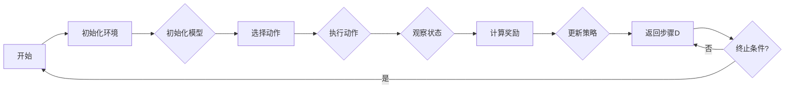

> 关键词：人工智能，深度学习，强化学习，模型优化，组合优化，反馈循环，自适应学习

# AI人工智能深度学习算法：使用强化学习优化深度学习模型

深度学习已经在计算机视觉、自然语言处理和语音识别等领域取得了显著的成就。然而，深度学习模型的设计往往需要大量的经验和对问题的深入理解。强化学习作为一种新兴的机器学习范式，能够通过与环境交互来学习如何优化深度学习模型。本文将探讨如何结合强化学习来优化深度学习模型，包括核心概念、算法原理、具体步骤、应用案例以及未来展望。

## 1. 背景介绍

### 1.1 问题的由来

传统的深度学习模型优化主要依赖于人类专家的知识和经验。这种优化方法效率低下，且难以适应复杂多变的现实问题。强化学习作为一种智能体学习如何与环境交互以最大化奖励的算法，为深度学习模型的优化提供了一种新的思路。

### 1.2 研究现状

近年来，强化学习在深度学习模型优化中的应用逐渐增多。研究者们提出了许多结合强化学习与深度学习的模型，如深度确定性策略梯度（DDPG）、策略梯度（PG）和信任域策略优化（TD3）等。

### 1.3 研究意义

结合强化学习优化深度学习模型具有以下意义：

- 提高模型性能：强化学习能够帮助模型在复杂环境中学习到更好的策略，从而提高模型的性能。
- 自动化模型优化：强化学习能够自动化深度学习模型的优化过程，减轻人类专家的工作负担。
- 灵活适应新环境：强化学习模型能够适应新的环境和任务，提高模型的泛化能力。

### 1.4 本文结构

本文将按照以下结构进行展开：

- 第2章将介绍强化学习和深度学习的核心概念及其联系。
- 第3章将详细阐述强化学习优化深度学习模型的原理和具体步骤。
- 第4章将介绍相关的数学模型和公式，并通过实例进行讲解。
- 第5章将给出一个强化学习优化深度学习模型的代码实例。
- 第6章将探讨强化学习优化深度学习模型的应用场景。
- 第7章将推荐相关的学习资源、开发工具和参考文献。
- 第8章将总结全文，展望未来发展趋势与挑战。

## 2. 核心概念与联系

### 2.1 核心概念

#### 强化学习

强化学习是一种通过与环境交互来学习如何采取行动的机器学习方法。强化学习中的智能体（Agent）通过观察环境状态（State）、选择动作（Action）、获得奖励（Reward）来学习最优策略（Policy）。

#### 深度学习

深度学习是一种基于神经网络的学习方法，能够从大量数据中自动学习特征和模式。

#### 深度学习模型优化

深度学习模型优化是指通过调整模型参数来提高模型在特定任务上的性能。

### 2.2 架构流程图

以下是一个简单的 Mermaid 流程图，展示了强化学习优化深度学习模型的架构：



## 3. 核心算法原理 & 具体操作步骤

### 3.1 算法原理概述

强化学习优化深度学习模型的基本原理是使用强化学习智能体学习一个策略，该策略能够指导深度学习模型在特定任务上取得更好的性能。

### 3.2 算法步骤详解

以下是一个强化学习优化深度学习模型的典型步骤：

1. 初始化环境：定义深度学习模型和环境交互的细节，包括状态空间、动作空间、奖励函数等。
2. 初始化模型：初始化深度学习模型的参数。
3. 选择动作：根据当前状态和策略选择一个动作。
4. 执行动作：使用选择的动作与环境交互，得到新的状态和奖励。
5. 观察状态：获取新的环境状态。
6. 计算奖励：根据新的状态和动作计算奖励。
7. 更新策略：根据奖励更新策略。
8. 返回步骤3。

### 3.3 算法优缺点

强化学习优化深度学习模型的优点：

- 能够学习到更加复杂和自适应的策略。
- 能够适应新的环境和任务。
- 能够自动化模型优化过程。

强化学习优化深度学习模型的缺点：

- 需要大量的训练数据和计算资源。
- 学习过程可能收敛到局部最优解。
- 可能需要调整大量的超参数。

### 3.4 算法应用领域

强化学习优化深度学习模型的应用领域包括：

- 游戏人工智能：如围棋、国际象棋等。
- 自动驾驶：如无人驾驶汽车等。
- 机器人控制：如机器人路径规划等。
- 金融交易：如股票交易策略等。

## 4. 数学模型和公式 & 详细讲解 & 举例说明

### 4.1 数学模型构建

在强化学习优化深度学习模型中，常用的数学模型包括：

- 策略网络（Policy Network）：用于表示智能体的策略。
- 价值网络（Value Network）：用于表示智能体在给定状态下期望获得的奖励。
- 状态空间（State Space）：表示智能体可能处于的所有状态。
- 动作空间（Action Space）：表示智能体可能采取的所有动作。
- 奖励函数（Reward Function）：用于衡量智能体采取动作后的结果。

### 4.2 公式推导过程

以下是一个简单的公式推导过程，展示了如何使用策略梯度算法更新策略网络：

$$
\theta_{t+1} = \theta_t - \alpha \nabla_{\theta_t} J(\theta_t)
$$

其中，$\theta_t$ 表示策略网络在时刻 t 的参数，$\alpha$ 表示学习率，$J(\theta_t)$ 表示策略网络在时刻 t 的期望回报。

### 4.3 案例分析与讲解

以下是一个使用强化学习优化深度学习模型的案例：

假设我们想要训练一个智能体在CartPole环境中取得更好的成绩。CartPole环境是一个经典的强化学习环境，其中智能体需要控制一根杆子保持平衡。

在这个案例中，状态空间由杆子的角度和角速度组成，动作空间由向左或向右推杆子组成。奖励函数是每个时间步长中杆子保持平衡的时间。

我们可以使用一个简单的策略网络来表示智能体的策略，该策略网络根据当前状态输出一个动作。使用价值网络来评估策略网络输出的动作的期望回报。

通过迭代地更新策略网络和值网络的参数，我们可以训练出一个在CartPole环境中能够取得更好成绩的智能体。

## 5. 项目实践：代码实例和详细解释说明

### 5.1 开发环境搭建

为了实现上述案例，我们需要搭建以下开发环境：

- Python 3.7+
- TensorFlow 2.2+
- Gym 0.17.3+

### 5.2 源代码详细实现

以下是一个使用 TensorFlow 和 Gym 库实现的 CartPole 强化学习案例：

```python
import gym
import tensorflow as tf
import numpy as np

# 定义策略网络
class PolicyNetwork(tf.keras.Model):
    def __init__(self):
        super(PolicyNetwork, self).__init__()
        self.fc1 = tf.keras.layers.Dense(24, activation=tf.nn.relu)
        self.fc2 = tf.keras.layers.Dense(24, activation=tf.nn.relu)
        self.fc3 = tf.keras.layers.Dense(2)

    def call(self, x):
        x = self.fc1(x)
        x = self.fc2(x)
        x = self.fc3(x)
        return x

# 定义值网络
class ValueNetwork(tf.keras.Model):
    def __init__(self):
        super(ValueNetwork, self).__init__()
        self.fc1 = tf.keras.layers.Dense(24, activation=tf.nn.relu)
        self.fc2 = tf.keras.layers.Dense(24, activation=tf.nn.relu)
        self.fc3 = tf.keras.layers.Dense(1)

    def call(self, x):
        x = self.fc1(x)
        x = self.fc2(x)
        x = self.fc3(x)
        return x

# 初始化模型
policy_network = PolicyNetwork()
value_network = ValueNetwork()

# 定义优化器
optimizer = tf.keras.optimizers.Adam(learning_rate=0.01)

# 定义损失函数
def loss(y_true, y_pred):
    return tf.reduce_mean(tf.keras.losses.mean_squared_error(y_true, y_pred))

# 训练模型
def train():
    env = gym.make('CartPole-v1')
    episode_count = 1000
    for episode in range(episode_count):
        state = env.reset()
        done = False
        total_reward = 0
        while not done:
            action = policy_network(state)
            next_state, reward, done, _ = env.step(action)
            total_reward += reward
            target = value_network(next_state) + 0.99 * value_network(state)
            with tf.GradientTape() as tape:
                value_pred = value_network(state)
                loss_value = loss(target, value_pred)
            gradients = tape.gradient(loss_value, value_network.trainable_variables)
            optimizer.apply_gradients(zip(gradients, value_network.trainable_variables))

            with tf.GradientTape() as tape:
                action_prob = policy_network(state)
                loss_policy = loss(target, action_prob)
            gradients = tape.gradient(loss_policy, policy_network.trainable_variables)
            optimizer.apply_gradients(zip(gradients, policy_network.trainable_variables))

        print(f"Episode {episode}, Total Reward: {total_reward}")

if __name__ == '__main__':
    train()
```

### 5.3 代码解读与分析

上述代码首先定义了策略网络和价值网络，然后使用 TensorFlow 的自动微分功能计算损失和梯度，最后使用 Adam 优化器更新网络参数。

在 `train` 函数中，我们初始化了一个 Gym 环境并运行了指定数量的回合。在每个回合中，智能体根据策略网络选择的动作与环境交互，并更新价值网络和策略网络的参数。

通过多次迭代训练，我们可以训练出一个能够在 CartPole 环境中取得更好成绩的智能体。

### 5.4 运行结果展示

通过运行上述代码，我们可以在终端看到训练过程中的信息，包括回合数和总奖励。随着训练的进行，智能体的表现会逐渐提高。

## 6. 实际应用场景

强化学习优化深度学习模型在实际应用场景中具有广泛的应用，以下是一些例子：

- 自动驾驶：使用强化学习优化自动驾驶车辆的导航策略。
- 游戏AI：使用强化学习优化游戏角色的行为。
- 机器人控制：使用强化学习优化机器人的动作。
- 金融交易：使用强化学习优化股票交易策略。

## 7. 工具和资源推荐

### 7.1 学习资源推荐

- 《Reinforcement Learning: An Introduction》
- 《Deep Reinforcement Learning》
- TensorFlow官方文档
- Gym官方文档

### 7.2 开发工具推荐

- TensorFlow
- Gym
- PyTorch

### 7.3 相关论文推荐

- "Deep Reinforcement Learning" by DeepMind
- "Asynchronous Methods for Deep Reinforcement Learning" by OpenAI
- "Algorithms for Reinforcement Learning" by Csaba Szepesvari

## 8. 总结：未来发展趋势与挑战

### 8.1 研究成果总结

本文介绍了如何使用强化学习优化深度学习模型，包括核心概念、算法原理、具体步骤、应用案例以及未来展望。

### 8.2 未来发展趋势

- 结合深度学习和其他机器学习技术，如迁移学习、主动学习等。
- 研究更加高效的强化学习算法，如模型无关的策略梯度、多智能体强化学习等。
- 将强化学习应用于更多复杂和大规模的任务。

### 8.3 面临的挑战

- 强化学习模型的学习过程可能非常缓慢，需要大量的训练数据和计算资源。
- 强化学习模型的可解释性较差，难以理解模型的决策过程。
- 强化学习模型在现实世界中的应用可能受到伦理和安全的限制。

### 8.4 研究展望

随着技术的不断发展，强化学习优化深度学习模型将在更多领域得到应用，并推动人工智能技术的进步。

## 9. 附录：常见问题与解答

**Q1：强化学习优化深度学习模型是否适用于所有深度学习任务？**

A1：强化学习优化深度学习模型适用于大多数需要策略优化的任务，但在某些需要精确控制和实时响应的任务中可能效果不佳。

**Q2：如何解决强化学习优化深度学习模型的可解释性问题？**

A2：目前，提高强化学习模型的可解释性仍然是一个开放性问题。一些方法包括使用可视化工具、解释性强化学习算法和可解释的模型结构。

**Q3：如何提高强化学习优化深度学习模型的性能？**

A3：提高强化学习优化深度学习模型的性能可以通过以下方法：

- 使用更强大的硬件设备。
- 使用更高效的强化学习算法。
- 优化训练策略，如增加探索策略、调整奖励函数等。

**Q4：强化学习优化深度学习模型在金融交易中的应用前景如何？**

A4：强化学习优化深度学习模型在金融交易中具有很大的应用前景。它可以用于开发自动化交易策略，提高交易效率，降低交易成本。

作者：禅与计算机程序设计艺术 / Zen and the Art of Computer Programming