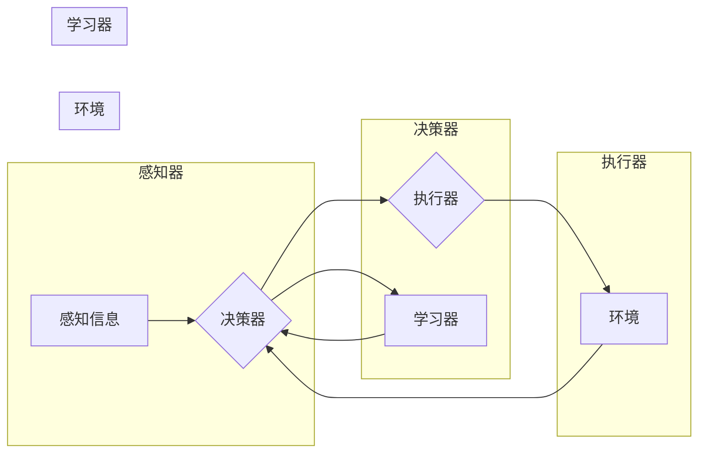

> 人工智能, 深度学习, 智能深度学习代理, 机器学习代理, 面向未来, 算法研究, 自适应学习, 强化学习, 生成对抗网络, 多智能体系统

# AI人工智能深度学习算法：智能深度学习代理的面向未来的研究方向

> 关键词：人工智能, 深度学习, 智能深度学习代理, 机器学习代理, 面向未来, 算法研究, 自适应学习, 强化学习, 生成对抗网络, 多智能体系统

## 1. 背景介绍

随着人工智能（AI）和深度学习（DL）技术的飞速发展，我们已经见证了AI在图像识别、自然语言处理、语音识别等领域的突破性进展。然而，这些进展背后是庞大计算资源、海量数据和复杂算法的支撑。为了解决这些挑战，研究人员提出了智能深度学习代理（Intelligent DL Agents）的概念，旨在构建能够自我学习和适应的AI系统。本文将探讨智能深度学习代理的核心概念、算法原理、未来研究方向及其应用前景。

## 2. 核心概念与联系

### 2.1 智能深度学习代理

智能深度学习代理是一种能够自主学习、适应和交互的计算机程序。它们通过深度学习算法从数据中学习模式，并能够根据环境变化调整其行为策略。智能深度学习代理的核心特征包括：

- **自主学习**：能够从数据中学习，无需人工干预。
- **自适应**：能够根据环境变化调整其行为策略。
- **交互**：能够与其他智能体或人类交互。

### 2.2 智能深度学习代理架构

智能深度学习代理的架构通常包括以下几个关键组件：

- **感知器**：用于感知环境中的信息，如图像、文本、声音等。
- **决策器**：根据感知到的信息做出决策。
- **执行器**：将决策转化为实际行动。
- **学习器**：根据执行结果调整决策器。

以下是智能深度学习代理架构的Mermaid流程图：



## 3. 核心算法原理 & 具体操作步骤

### 3.1 算法原理概述

智能深度学习代理的核心算法通常包括以下几种：

- **深度学习**：用于从数据中学习特征和模式。
- **强化学习**：用于使代理在环境中学习最优策略。
- **生成对抗网络**：用于生成高质量的数据样本。
- **多智能体系统**：用于构建协同工作的智能体群体。

### 3.2 算法步骤详解

智能深度学习代理的算法步骤如下：

1. **数据收集**：收集环境中的数据，包括感知数据、执行结果等。
2. **特征提取**：使用深度学习算法从感知数据中提取特征。
3. **策略学习**：使用强化学习算法学习最优策略。
4. **执行行动**：根据学习到的策略执行行动。
5. **评估反馈**：根据执行结果评估策略效果，并收集反馈。
6. **更新策略**：根据反馈调整策略。

### 3.3 算法优缺点

- **优点**：
  - 能够从数据中学习，无需人工干预。
  - 能够适应环境变化。
  - 能够与其他智能体或人类交互。
- **缺点**：
  - 计算资源需求大。
  - 需要大量的数据。
  - 算法复杂，难以理解和解释。

### 3.4 算法应用领域

智能深度学习代理的应用领域包括：

- **自动驾驶**：自动驾驶汽车可以学习道路规则，避免碰撞。
- **游戏AI**：游戏AI可以学习游戏策略，与人类玩家对抗。
- **智能客服**：智能客服可以学习用户需求，提供个性化服务。
- **医疗诊断**：智能代理可以学习医学知识，辅助医生进行诊断。

## 4. 数学模型和公式 & 详细讲解 & 举例说明

### 4.1 数学模型构建

智能深度学习代理的数学模型通常包括以下几个部分：

- **感知模型**：用于从感知数据中提取特征。
- **决策模型**：用于学习最优策略。
- **执行模型**：用于将策略转化为行动。
- **评估模型**：用于评估策略效果。

### 4.2 公式推导过程

以下是一个简单的感知模型的例子，使用卷积神经网络（CNN）进行图像识别：

$$
\hat{y} = f(W \cdot \phi(x) + b)
$$

其中，$x$ 是输入图像，$\phi(x)$ 是特征提取函数，$W$ 是权重，$b$ 是偏置，$f$ 是激活函数，$\hat{y}$ 是预测结果。

### 4.3 案例分析与讲解

以下是一个简单的强化学习案例，使用Q-learning算法学习迷宫导航策略：

- **状态空间**：迷宫中的每个位置。
- **动作空间**：向上下左右移动。
- **奖励函数**：到达终点时奖励1分，否则奖励-1分。
- **Q值**：表示在当前状态下执行某个动作的预期奖励。

Q-learning算法的目标是学习一个策略，使得每个状态的Q值最大化：

$$
Q(s,a) = Q(s,a) + \alpha [R + \gamma \max_{a'} Q(s',a') - Q(s,a)]
$$

其中，$\alpha$ 是学习率，$R$ 是奖励，$\gamma$ 是折扣因子。

## 5. 项目实践：代码实例和详细解释说明

### 5.1 开发环境搭建

为了进行智能深度学习代理的项目实践，需要以下开发环境：

- Python编程语言
- 深度学习框架（如TensorFlow或PyTorch）
- 强化学习库（如OpenAI Gym或stable_baselines3）

### 5.2 源代码详细实现

以下是一个简单的智能体在OpenAI Gym环境中的Q-learning代码示例：

```python
import gym
import numpy as np
import random

env = gym.make('CartPole-v1')
alpha = 0.1
gamma = 0.99
epsilon = 0.1

q_table = np.zeros([env.observation_space.n, env.action_space.n])

for episode in range(1000):
    state = env.reset()
    done = False
    while not done:
        if random.uniform(0, 1) < epsilon:
            action = random.choice(env.action_space.n)
        else:
            action = np.argmax(q_table[state, :])

        next_state, reward, done, _ = env.step(action)
        q_table[state, action] = (1 - alpha) * q_table[state, action] + alpha * (reward + gamma * np.max(q_table[next_state, :]))

        state = next_state

print("Training complete.")
```

### 5.3 代码解读与分析

这段代码实现了一个简单的Q-learning智能体，在CartPole-v1环境中学习如何保持平衡。智能体通过不断尝试不同的动作，并从经验中学习，最终能够稳定地保持平衡。

### 5.4 运行结果展示

运行上述代码后，智能体会在CartPole-v1环境中进行训练。通过多次尝试和错误，智能体最终能够学会保持平衡。

## 6. 实际应用场景

智能深度学习代理在以下实际应用场景中表现出色：

- **自动驾驶**：智能代理可以学习道路规则、交通标志和行人行为，实现自动驾驶。
- **机器人**：智能代理可以使机器人适应不同的环境和工作任务。
- **游戏**：智能代理可以与人类玩家进行交互，提供更具挑战性的游戏体验。
- **金融**：智能代理可以分析市场趋势，提供投资建议。

## 7. 工具和资源推荐

### 7.1 学习资源推荐

- 《深度学习》（Goodfellow, Bengio, Courville）
- 《强化学习：原理与练习》（Sutton, Barto）
- 《生成对抗网络：原理与应用》（Goodfellow, Pouget-Abadie, Arjovsky）

### 7.2 开发工具推荐

- TensorFlow
- PyTorch
- OpenAI Gym

### 7.3 相关论文推荐

- “Deep Reinforcement Learning” by David Silver
- “Generative Adversarial Nets” by Ian Goodfellow et al.
- “Reinforcement Learning: A Survey” by Volodymyr Mnih et al.

## 8. 总结：未来发展趋势与挑战

### 8.1 研究成果总结

智能深度学习代理是AI领域的一个重要研究方向，它结合了深度学习、强化学习和生成对抗网络等多种技术，使得AI系统能够自主学习、适应和交互。通过不断的研究和探索，智能深度学习代理已经在多个领域取得了显著的成果。

### 8.2 未来发展趋势

- **多智能体系统**：未来的智能深度学习代理将能够协同工作，共同完成任务。
- **可解释性**：研究者将致力于提高智能深度学习代理的可解释性，使其决策过程更加透明。
- **知识整合**：智能深度学习代理将能够整合来自不同来源的知识，提高其智能水平。

### 8.3 面临的挑战

- **数据隐私**：如何保护用户数据隐私是一个重要挑战。
- **模型可解释性**：提高模型的可解释性是一个长期挑战。
- **计算资源**：智能深度学习代理需要大量的计算资源。

### 8.4 研究展望

未来，随着技术的不断进步，智能深度学习代理将在更多领域发挥重要作用。通过解决面临的挑战，智能深度学习代理将成为构建未来智能系统的关键。

## 9. 附录：常见问题与解答

**Q1：智能深度学习代理与传统的机器学习模型有什么区别？**

A：智能深度学习代理与传统机器学习模型的主要区别在于其自主学习、适应和交互的能力。智能深度学习代理能够从数据中学习，根据环境变化调整其行为策略，并与人类或其他智能体交互。

**Q2：智能深度学习代理有哪些应用场景？**

A：智能深度学习代理在自动驾驶、机器人、游戏、金融等多个领域都有广泛的应用。

**Q3：如何提高智能深度学习代理的可解释性？**

A：提高智能深度学习代理的可解释性是一个长期挑战，可以通过以下方法实现：

- **特征可视化**：将模型中的特征可视化，帮助理解模型的决策过程。
- **解释性模型**：开发可解释的机器学习模型，如决策树、线性回归等。
- **可视化工具**：使用可视化工具展示模型的决策过程。

**Q4：智能深度学习代理的未来发展趋势是什么？**

A：智能深度学习代理的未来发展趋势包括多智能体系统、可解释性和知识整合等。

---

作者：禅与计算机程序设计艺术 / Zen and the Art of Computer Programming