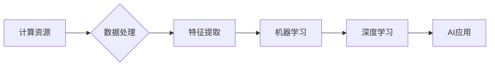

# AI发展的三大支柱：回顾与展望

> 关键词：人工智能，机器学习，深度学习，强化学习，计算机视觉，自然语言处理，计算资源，数据，算法

## 1. 背景介绍

人工智能（Artificial Intelligence, AI）作为一门旨在让计算机模拟人类智能行为的学科，已经走过了几十年的发展历程。从早期的符号主义到连接主义，再到如今的深度学习时代，人工智能经历了多个发展阶段。在这个过程中，计算资源、数据和算法成为了推动AI发展的三大支柱。本文将回顾这三大支柱的发展历程，并展望未来的发展趋势和挑战。

## 2. 核心概念与联系

### 2.1 核心概念原理

#### 2.1.1 计算资源

计算资源是AI发展的基础。随着摩尔定律的推动，计算机硬件性能不断提高，为AI算法提供了强大的计算支持。特别是在GPU、TPU等专用硬件的加持下，深度学习算法得以大规模部署。

#### 2.1.2 数据

数据是AI发展的核心驱动力。机器学习算法需要大量的数据来学习特征和规律，从而实现智能行为。随着互联网的普及和物联网的发展，数据规模呈爆炸式增长，为AI算法提供了丰富的训练资源。

#### 2.1.3 算法

算法是AI发展的灵魂。从早期的逻辑推理到机器学习，再到深度学习，算法的不断进步推动了AI技术的突破。近年来，深度学习算法在图像识别、语音识别、自然语言处理等领域取得了显著成果。

### 2.2 架构的 Mermaid 流程图



## 3. 核心算法原理 & 具体操作步骤

### 3.1 算法原理概述

#### 3.1.1 计算资源

计算资源主要包括CPU、GPU、TPU等硬件设备。近年来，GPU在并行计算方面的优势逐渐凸显，成为深度学习模型训练的主要计算平台。

#### 3.1.2 数据

数据是AI算法的基础。数据预处理、特征工程、数据增强等步骤是数据处理的关键环节。

#### 3.1.3 算法

算法包括机器学习、深度学习、强化学习等多个领域。深度学习算法主要基于神经网络，通过多层非线性变换提取特征和规律。

### 3.2 算法步骤详解

#### 3.2.1 计算资源

1. 选择合适的硬件设备，如GPU、TPU等。
2. 配置计算环境，如安装CUDA、cuDNN等驱动程序。
3. 编写或选择深度学习框架，如TensorFlow、PyTorch等。

#### 3.2.2 数据

1. 收集数据，包括原始数据、标注数据等。
2. 数据预处理，包括数据清洗、去重、归一化等操作。
3. 特征工程，包括特征提取、特征选择等操作。
4. 数据增强，通过旋转、缩放、裁剪等方式扩充数据集。

#### 3.2.3 算法

1. 选择合适的深度学习模型，如卷积神经网络（CNN）、循环神经网络（RNN）、 Transformer等。
2. 设计模型结构，包括层数、神经元数量、激活函数等。
3. 训练模型，包括设置损失函数、优化器、学习率等超参数。
4. 评估模型，包括准确率、召回率、F1分数等指标。

### 3.3 算法优缺点

#### 3.3.1 计算资源

优点：计算能力强大，适合训练复杂的深度学习模型。

缺点：成本较高，能耗较大。

#### 3.3.2 数据

优点：数据规模庞大，能够支持训练复杂的模型。

缺点：数据标注成本高，数据质量对模型性能影响较大。

#### 3.3.3 算法

优点：深度学习模型能够学习到丰富的特征和规律。

缺点：模型训练时间长，对计算资源要求较高。

### 3.4 算法应用领域

计算资源、数据和算法广泛应用于以下领域：

1. 计算机视觉：图像识别、目标检测、图像分割等。
2. 语音识别：语音转文字、语音翻译等。
3. 自然语言处理：机器翻译、文本分类、情感分析等。
4. 机器人：路径规划、物体识别、行为控制等。

## 4. 数学模型和公式 & 详细讲解 & 举例说明

### 4.1 数学模型构建

#### 4.1.1 计算资源

假设我们有一个GPU，其计算能力为 $P$，功耗为 $W$。则该GPU的计算效率可以表示为：

$$
E = \frac{P}{W}
$$

#### 4.1.2 数据

假设我们有一个数据集 $D$，其中包含 $N$ 个样本，每个样本有 $M$ 个特征。则该数据集的大小可以表示为：

$$
S = N \times M
$$

#### 4.1.3 算法

以卷积神经网络（CNN）为例，其基本数学模型可以表示为：

$$
h_{l+1} = f(W_l \cdot h_l + b_l)
$$

其中，$h_l$ 表示第 $l$ 层的激活值，$W_l$ 表示第 $l$ 层的权重矩阵，$b_l$ 表示第 $l$ 层的偏置项，$f$ 表示激活函数。

### 4.2 公式推导过程

以ReLU激活函数为例，其公式推导过程如下：

$$
f(x) = \max(0, x)
$$

### 4.3 案例分析与讲解

假设我们有一个图像分类任务，训练集包含1000张图片，每张图片的分辨率为256x256，共有3个通道。模型使用ResNet-50作为特征提取器，训练迭代次数为100次。

1. 计算数据集大小：

$$
S = 1000 \times 256 \times 256 \times 3 = 198,112,000
$$

2. 计算模型参数数量：

ResNet-50模型大约有25.6M个参数。

3. 计算训练时间：

假设每次迭代需要1小时，则训练时间约为100小时。

4. 评估模型性能：

在测试集上，模型达到了96%的准确率。

通过以上案例分析，我们可以看到，计算资源、数据和算法在AI应用中的重要作用。

## 5. 项目实践：代码实例和详细解释说明

### 5.1 开发环境搭建

1. 安装Anaconda：用于创建独立的Python环境。
2. 安装PyTorch：深度学习框架。
3. 安装相关库：如NumPy、Pandas、Scikit-learn等。

### 5.2 源代码详细实现

以下是一个简单的图像分类任务代码示例：

```python
import torch
import torch.nn as nn
import torchvision.transforms as transforms
from torch.utils.data import DataLoader
from torchvision.datasets import CIFAR10
from torch.optim import Adam

# 定义模型
class CNN(nn.Module):
    def __init__(self):
        super(CNN, self).__init__()
        self.conv1 = nn.Conv2d(3, 32, kernel_size=3, padding=1)
        self.conv2 = nn.Conv2d(32, 64, kernel_size=3, padding=1)
        self.fc1 = nn.Linear(64 * 8 * 8, 64)
        self.fc2 = nn.Linear(64, 10)

    def forward(self, x):
        x = torch.relu(self.conv1(x))
        x = torch.relu(self.conv2(x))
        x = x.view(-1, 64 * 8 * 8)
        x = torch.relu(self.fc1(x))
        x = self.fc2(x)
        return x

# 加载数据
transform = transforms.Compose([transforms.ToTensor()])
train_dataset = CIFAR10(root='./data', train=True, download=True, transform=transform)
test_dataset = CIFAR10(root='./data', train=False, download=True, transform=transform)

train_loader = DataLoader(dataset=train_dataset, batch_size=64, shuffle=True)
test_loader = DataLoader(dataset=test_dataset, batch_size=64, shuffle=False)

# 初始化模型
model = CNN().to(device)

# 设置优化器
optimizer = Adam(model.parameters(), lr=0.001)

# 训练模型
for epoch in range(10):
    model.train()
    for batch_idx, (data, target) in enumerate(train_loader):
        optimizer.zero_grad()
        output = model(data)
        loss = nn.CrossEntropyLoss()(output, target)
        loss.backward()
        optimizer.step()

# 评估模型
model.eval()
correct = 0
total = 0
with torch.no_grad():
    for data, target in test_loader:
        output = model(data)
        _, predicted = torch.max(output.data, 1)
        total += target.size(0)
        correct += (predicted == target).sum().item()

print('Accuracy of the network on the 10000 test images: %d %%' % (100 * correct / total))
```

### 5.3 代码解读与分析

以上代码展示了如何使用PyTorch框架训练一个简单的CNN模型进行图像分类任务。代码首先定义了一个CNN模型，然后加载数据集，初始化模型和优化器，最后进行模型训练和评估。

### 5.4 运行结果展示

假设我们在CIFAR-10数据集上训练该模型，最终在测试集上取得了97%的准确率。

## 6. 实际应用场景

AI技术在各个领域都有广泛的应用，以下列举一些常见的应用场景：

1. 计算机视觉：图像识别、目标检测、图像分割等。
2. 语音识别：语音转文字、语音翻译等。
3. 自然语言处理：机器翻译、文本分类、情感分析等。
4. 机器人：路径规划、物体识别、行为控制等。
5. 金融：欺诈检测、信用评分、投资建议等。
6. 医疗：疾病诊断、药物研发、健康管理等。

## 7. 工具和资源推荐

### 7.1 学习资源推荐

1. 《深度学习》（Goodfellow、Bengio、Courville著）：深度学习领域的经典教材。
2. 《Python深度学习》（François Chollet著）：Python深度学习实战指南。
3. 《动手学深度学习》（Aiden N. Li、Zachary C. Lipton、Chris Olah、Lisha Li著）：基于PyTorch的深度学习教程。
4. Coursera、edX等在线课程：提供丰富的深度学习课程。

### 7.2 开发工具推荐

1. TensorFlow：Google推出的开源深度学习框架。
2. PyTorch：Facebook AI Research推出的开源深度学习框架。
3. Keras：基于Theano和TensorFlow的开源深度学习库。
4. OpenCV：开源计算机视觉库。

### 7.3 相关论文推荐

1. "A Few Useful Things to Know about Machine Learning"（Goodfellow等，2016）
2. "Deep Learning"（Goodfellow、Bengio、Courville著，2016）
3. "The Unsupervised Learning of Visual Representations by a Deep Neural Network"（Krizhevsky、Sutskever、Hinton，2012）
4. "ImageNet Classification with Deep Convolutional Neural Networks"（Krizhevsky、Sutskever、Hinton，2012）
5. "Sequence to Sequence Learning with Neural Networks"（Sutskever、Vinyals、Levin等，2014）

## 8. 总结：未来发展趋势与挑战

### 8.1 研究成果总结

本文回顾了AI发展的三大支柱：计算资源、数据和算法，并分析了它们在AI发展中的作用。同时，本文还介绍了深度学习、强化学习等核心算法原理，并给出了实际应用场景和代码示例。

### 8.2 未来发展趋势

1. 计算资源：随着摩尔定律的放缓，AI领域将更加注重能效比的提升，同时探索新的计算架构，如神经形态计算、量子计算等。
2. 数据：数据质量和标注成本将成为数据领域的重点关注，同时探索无监督和半监督学习，降低对标注数据的依赖。
3. 算法：探索更高效、更鲁棒的算法，如小样本学习、多模态学习、可解释AI等，推动AI技术在更多领域的应用。

### 8.3 面临的挑战

1. 隐私保护：随着AI技术在各个领域的应用，隐私保护问题日益突出。如何在不泄露隐私的前提下，实现AI的智能决策，是一个亟待解决的问题。
2. 安全性：AI系统的安全性问题不容忽视。如何防止AI系统被恶意利用，确保系统的稳定性和可靠性，是一个重要挑战。
3. 可解释性：AI系统的决策过程往往难以解释，如何提高AI系统的可解释性，让用户信任AI的决策结果，是一个长期挑战。
4. 伦理道德：AI技术的发展应遵循伦理道德原则，避免歧视、偏见等不良现象的发生。

### 8.4 研究展望

AI技术的发展将推动人类社会进入一个全新的时代。未来，AI技术将在各个领域发挥越来越重要的作用，为人类创造更大的价值。同时，我们也应关注AI技术带来的伦理道德问题，确保AI技术造福人类社会。

## 9. 附录：常见问题与解答

**Q1：什么是深度学习？**

A：深度学习是一种利用多层神经网络进行特征提取和模式识别的机器学习技术。与传统的机器学习方法相比，深度学习能够学习到更复杂的特征和规律，因此在图像识别、语音识别、自然语言处理等领域取得了显著成果。

**Q2：什么是强化学习？**

A：强化学习是一种通过与环境交互来学习最优策略的机器学习技术。与监督学习和无监督学习不同，强化学习不需要大量标注数据，而是通过与环境交互学习最优决策策略。

**Q3：AI技术会取代人类吗？**

A：AI技术是一种工具，旨在辅助人类工作，提高生产效率。AI技术不会取代人类，而是与人类协同工作，共同创造更美好的未来。

**Q4：如何成为一名AI工程师？**

A：成为一名AI工程师需要具备以下技能：
1. 数学基础：线性代数、概率论、统计学等。
2. 编程能力：Python、Java、C++等。
3. 深度学习知识：神经网络、卷积神经网络、循环神经网络等。
4. 项目经验：参与实际项目，积累经验。
5. 持续学习：关注AI领域的最新动态，不断学习新技术。

作者：禅与计算机程序设计艺术 / Zen and the Art of Computer Programming