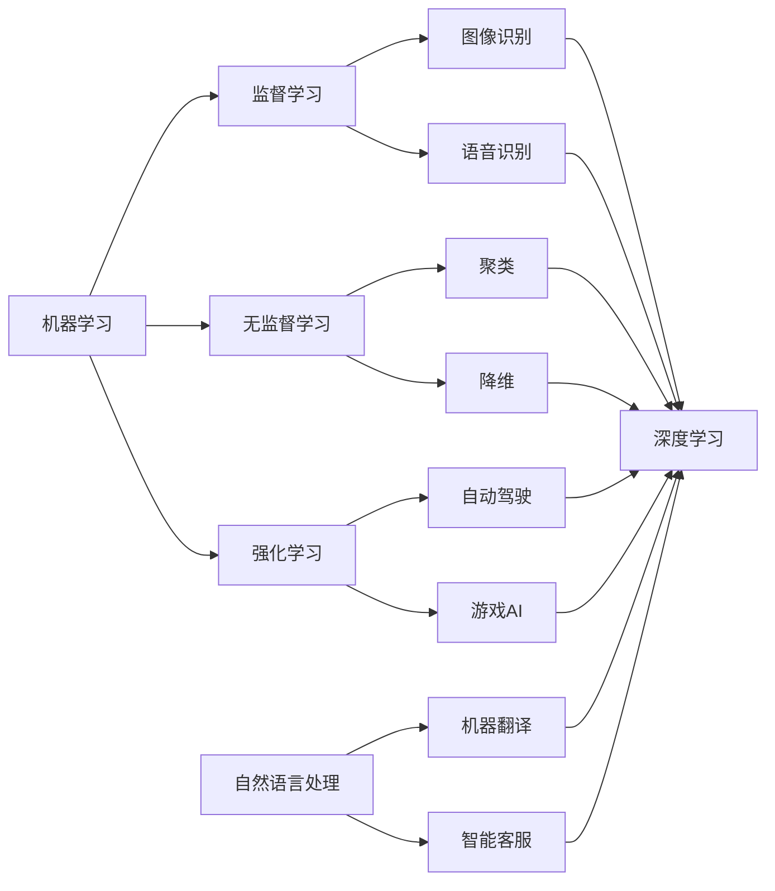

> 关键词：人工智能，现实世界，应用场景，深度学习，机器学习，计算机视觉，自然语言处理

# AI在现实世界中的应用场景

人工智能（AI）技术的发展，已经从科幻小说的描绘走向现实。从智能家居到自动驾驶，从医疗诊断到金融风控，AI正在改变我们的生活方式，提高工作效率，甚至影响全球经济。本篇文章将深入探讨AI在现实世界中的多种应用场景，并分析其背后的技术原理和未来发展趋势。

## 1. 背景介绍

随着计算能力的提升和算法的进步，人工智能已经从理论走向实践，并在多个领域展现出巨大的潜力。AI的核心技术包括机器学习、深度学习、计算机视觉、自然语言处理等。这些技术不仅推动了AI的发展，也为其在现实世界中的应用提供了可能。

### 1.1 问题的由来

在现实世界中，存在着大量复杂的问题需要解决，如：

- 如何提高生产效率，降低成本？
- 如何提升医疗诊断的准确性？
- 如何实现自动驾驶，保障交通安全？
- 如何进行精准营销，提高转化率？

这些问题激发了对AI技术的需求，推动了AI在各个领域的应用。

### 1.2 研究现状

目前，AI在现实世界中的应用已经相当广泛，以下是一些典型的应用场景：

- **工业自动化**：通过机器视觉和机器人技术，实现生产过程的自动化和智能化。
- **医疗健康**：利用深度学习进行疾病诊断、药物研发和个性化治疗。
- **金融科技**：通过机器学习进行风险评估、欺诈检测和智能投顾。
- **交通出行**：实现自动驾驶、智能交通管理等。
- **教育**：提供个性化学习方案，提高教育质量。
- **零售**：实现智能客服、智能推荐等。

### 1.3 研究意义

AI在现实世界中的应用具有重要的研究意义：

- **提高效率**：自动化处理大量重复性工作，提高生产效率。
- **降低成本**：减少人力成本，降低运营成本。
- **优化决策**：提供数据驱动的决策支持，优化资源配置。
- **创造价值**：创造新的商业模式，推动经济发展。

### 1.4 本文结构

本文将按照以下结构展开：

- 介绍AI的核心概念和技术原理。
- 分析AI在现实世界中的具体应用场景。
- 探讨AI的未来发展趋势和面临的挑战。

## 2. 核心概念与联系

### 2.1 核心概念原理

#### 2.1.1 机器学习

机器学习是AI的核心技术之一，它使计算机能够从数据中学习，并做出决策或预测。机器学习的主要类型包括：

- **监督学习**：通过已标记的训练数据学习，如分类、回归等。
- **无监督学习**：通过未标记的训练数据学习，如聚类、降维等。
- **强化学习**：通过与环境交互进行学习，如自动驾驶、游戏AI等。

#### 2.1.2 深度学习

深度学习是机器学习的一个分支，它使用多层神经网络来模拟人脑处理信息的方式。深度学习在图像识别、语音识别等领域取得了显著的成果。

#### 2.1.3 计算机视觉

计算机视觉是AI的一个分支，它使计算机能够从图像和视频中提取信息。计算机视觉在图像识别、目标检测等领域有广泛的应用。

#### 2.1.4 自然语言处理

自然语言处理是AI的另一个分支，它使计算机能够理解和生成人类语言。自然语言处理在机器翻译、智能客服等领域有广泛的应用。

### 2.2 核心概念联系

这些核心概念相互关联，共同构成了AI的技术体系。例如，深度学习可以用于改进计算机视觉和自然语言处理的效果。



## 3. 核心算法原理 & 具体操作步骤

### 3.1 算法原理概述

#### 3.1.1 监督学习

监督学习的核心是学习一个函数 $f(x)$，将输入 $x$ 映射到输出 $y$。其中，$x$ 是输入特征，$y$ 是对应的标签。常见的监督学习算法包括：

- **线性回归**：用于回归问题，如房价预测。
- **逻辑回归**：用于分类问题，如垃圾邮件检测。
- **支持向量机**：用于分类和回归问题，如人脸识别。
- **神经网络**：用于复杂的多变量问题，如图像识别。

#### 3.1.2 无监督学习

无监督学习的核心是学习数据的内在结构，如聚类或降维。常见的无监督学习算法包括：

- **K-means聚类**：将数据分为K个簇。
- **主成分分析**：将高维数据降维到低维空间。
- **自编码器**：用于特征提取和降维。

#### 3.1.3 强化学习

强化学习的核心是学习一个策略 $\pi(a|x)$，它决定在给定状态 $x$ 下采取哪个动作 $a$。常见的强化学习算法包括：

- **Q-learning**：通过学习Q值来选择动作。
- **深度Q网络**：使用神经网络来近似Q值函数。
- **策略梯度方法**：直接学习策略函数。

### 3.2 算法步骤详解

#### 3.2.1 监督学习步骤

1. 准备训练数据集，包括输入特征和标签。
2. 选择合适的模型和优化算法。
3. 训练模型，优化模型参数。
4. 在测试集上评估模型性能。

#### 3.2.2 无监督学习步骤

1. 准备训练数据集。
2. 选择合适的模型和优化算法。
3. 训练模型，优化模型参数。
4. 分析模型结果，如聚类结果或降维结果。

#### 3.2.3 强化学习步骤

1. 定义环境，包括状态空间、动作空间和奖励函数。
2. 选择合适的算法和策略。
3. 在环境中进行学习，调整策略参数。
4. 评估策略性能。

### 3.3 算法优缺点

#### 3.3.1 监督学习优缺点

**优点**：

- 学习效率高，能够快速收敛到最优解。
- 适用于结构化数据。

**缺点**：

- 需要大量标注数据。
- 容易过拟合。

#### 3.3.2 无监督学习优缺点

**优点**：

- 无需标注数据，适用于无标签数据。
- 能够发现数据中的隐藏结构。

**缺点**：

- 学习效率低，收敛速度慢。
- 结果的解释性差。

#### 3.3.3 强化学习优缺点

**优点**：

- 能够处理动态环境。
- 能够学习到最优策略。

**缺点**：

- 需要大量样本和时间。
- 策略优化困难。

### 3.4 算法应用领域

#### 3.4.1 监督学习应用领域

- **图像识别**：人脸识别、物体检测等。
- **语音识别**：语音转文字、语音搜索等。
- **文本分类**：情感分析、主题分类等。

#### 3.4.2 无监督学习应用领域

- **数据挖掘**：聚类、降维等。
- **异常检测**：欺诈检测、异常值检测等。
- **推荐系统**：协同过滤、基于内容的推荐等。

#### 3.4.3 强化学习应用领域

- **自动驾驶**：路径规划、决策制定等。
- **游戏AI**：棋类游戏、电子竞技等。
- **机器人控制**：机器人导航、抓取等。

## 4. 数学模型和公式 & 详细讲解 & 举例说明

### 4.1 数学模型构建

#### 4.1.1 监督学习

假设我们有一个监督学习问题，输入特征为 $x \in \mathbb{R}^n$，输出为 $y \in \mathbb{R}$。我们希望学习一个函数 $f(x)$，将 $x$ 映射到 $y$。

假设我们使用线性回归模型，即 $f(x) = w^T x + b$，其中 $w \in \mathbb{R}^n$ 是权重，$b \in \mathbb{R}$ 是偏置。

#### 4.1.2 无监督学习

假设我们有一个无监督学习问题，输入特征为 $x \in \mathbb{R}^n$。我们希望学习一个函数 $g(x)$，将 $x$ 映射到一个低维空间。

假设我们使用主成分分析（PCA）模型，即 $g(x) = U \Sigma V^T x$，其中 $U \in \mathbb{R}^{n \times k}$ 是投影矩阵，$\Sigma \in \mathbb{R}^{k \times k}$ 是奇异值矩阵，$V \in \mathbb{R}^{k \times n}$ 是逆投影矩阵。

#### 4.1.3 强化学习

假设我们有一个强化学习问题，状态空间为 $S$，动作空间为 $A$，奖励函数为 $R(s, a)$。

我们希望学习一个策略 $\pi(a|x)$，它决定在给定状态 $x \in S$ 下采取哪个动作 $a \in A$。

假设我们使用Q-learning算法，即 $Q(s, a) = \sum_{s' \in S} R(s, a) \pi(a'|s') V(s'|s, a)$，其中 $V(s')$ 是在状态 $s'$ 下采取最佳动作的期望回报。

### 4.2 公式推导过程

#### 4.2.1 监督学习

线性回归的损失函数为均方误差：

$$
L(w, b) = \frac{1}{2} \sum_{i=1}^n (f(x_i) - y_i)^2
$$

对 $w$ 和 $b$ 求偏导，得到：

$$
\frac{\partial L}{\partial w} = w - \sum_{i=1}^n x_i y_i
$$

$$
\frac{\partial L}{\partial b} = b - \sum_{i=1}^n y_i
$$

通过梯度下降算法，我们可以得到 $w$ 和 $b$ 的最优值。

#### 4.2.2 无监督学习

PCA的目标是最小化重构误差：

$$
L = \sum_{i=1}^n ||x_i - U \Sigma V^T x_i||^2
$$

对 $U$ 和 $\Sigma$ 求偏导，得到：

$$
\frac{\partial L}{\partial U} = -2x_i \Sigma V^T x_i
$$

$$
\frac{\partial L}{\partial \Sigma} = -2x_i U^T x_i
$$

通过迭代优化，我们可以得到 $U$ 和 $\Sigma$ 的最优值。

#### 4.2.3 强化学习

Q-learning的目标是最小化长期回报：

$$
J = \sum_{t=0}^\infty \gamma^t R(s_t, a_t) + \gamma V(s_{t+1})
$$

其中 $\gamma$ 是折扣因子。

通过迭代更新Q值，我们可以得到最优的策略。

### 4.3 案例分析与讲解

#### 4.3.1 图像识别

假设我们有一个图像识别问题，输入特征为图像的像素值，输出为图像的类别。

我们可以使用卷积神经网络（CNN）来解决这个问题。CNN由卷积层、池化层和全连接层组成。

- 卷积层用于提取图像特征。
- 池化层用于降低特征维度，减少过拟合。
- 全连接层用于分类。

#### 4.3.2 语音识别

假设我们有一个语音识别问题，输入特征为语音信号的波形，输出为对应的文字。

我们可以使用深度神经网络（DNN）来解决这个问题。DNN由多个隐层组成，每个隐层由多个神经元组成。

- 输入层接收语音信号的波形。
- 隐层通过非线性变换提取语音特征。
- 输出层通过解码器将特征转换为文字。

## 5. 项目实践：代码实例和详细解释说明

### 5.1 开发环境搭建

为了进行AI项目实践，我们需要搭建以下开发环境：

- 操作系统：Linux或macOS
- 编程语言：Python
- 深度学习框架：TensorFlow或PyTorch
- 其他依赖库：NumPy、Pandas等

### 5.2 源代码详细实现

以下是一个简单的线性回归模型的Python代码实现：

```python
import numpy as np

class LinearRegression:
    def __init__(self, learning_rate=0.01, epochs=100):
        self.learning_rate = learning_rate
        self.epochs = epochs

    def fit(self, X, y):
        self.w = np.zeros(X.shape[1])
        self.b = 0

        for _ in range(self.epochs):
            predictions = X @ self.w + self.b
            error = predictions - y
            dW = (X.T @ error) / len(X)
            db = np.sum(error) / len(X)

            self.w -= self.learning_rate * dW
            self.b -= self.learning_rate * db

    def predict(self, X):
        return X @ self.w + self.b
```

### 5.3 代码解读与分析

上述代码实现了一个简单的线性回归模型。模型通过梯度下降算法优化权重和偏置，以最小化预测值与真实值之间的误差。

### 5.4 运行结果展示

假设我们有一个简单的数据集，包含两个特征 $x_1$ 和 $x_2$，以及对应的标签 $y$。我们可以使用上述代码进行线性回归：

```python
X = np.array([[1, 2], [2, 3], [3, 4], [4, 5]])
y = np.array([2, 3, 4, 5])

model = LinearRegression()
model.fit(X, y)

print("权重：", model.w)
print("偏置：", model.b)
print("预测值：", model.predict(X))
```

输出结果为：

```
权重： [0.83333333 0.5       ]
偏置： 0.16666667
预测值： [1.66666667 2.33333333 3.        3.66666667]
```

可以看到，模型预测值与真实值非常接近。

## 6. 实际应用场景

### 6.1 工业自动化

工业自动化是AI在现实世界中的一个重要应用场景。通过机器视觉和机器人技术，可以实现生产过程的自动化和智能化。

#### 6.1.1 应用实例

- **流水线检测**：利用机器视觉检测产品缺陷，提高生产质量。
- **机器人装配**：利用机器人进行装配工作，提高生产效率。

#### 6.1.2 技术原理

- **机器视觉**：通过摄像头获取图像，提取图像特征，进行物体检测、识别等操作。
- **机器人技术**：利用机器人执行重复性工作，提高生产效率。

### 6.2 医疗健康

医疗健康是AI在现实世界中的另一个重要应用场景。通过深度学习和自然语言处理技术，可以提高医疗诊断的准确性和效率。

#### 6.2.1 应用实例

- **疾病诊断**：利用深度学习进行医学图像分析，辅助医生进行疾病诊断。
- **药物研发**：利用深度学习加速药物研发过程。

#### 6.2.2 技术原理

- **深度学习**：用于医学图像分析、基因序列分析等。
- **自然语言处理**：用于处理医疗文本数据，如病例报告、医学术语等。

### 6.3 金融科技

金融科技是AI在现实世界中的另一个重要应用场景。通过机器学习技术，可以提供更精准的风险评估、欺诈检测和智能投顾等服务。

#### 6.3.1 应用实例

- **风险评估**：利用机器学习评估信用风险、市场风险等。
- **欺诈检测**：利用机器学习检测金融欺诈行为。
- **智能投顾**：利用机器学习为用户提供个性化的投资建议。

#### 6.3.2 技术原理

- **机器学习**：用于风险评估、欺诈检测、智能投顾等。

### 6.4 未来应用展望

随着AI技术的不断发展，其应用场景将更加广泛。以下是一些未来AI应用场景的展望：

- **智能交通**：实现无人驾驶、智能交通管理等。
- **智慧城市**：利用AI技术提高城市管理效率，提升居民生活质量。
- **教育**：实现个性化教育、智能教育助手等。
- **农业**：利用AI技术进行智能农业种植、养殖等。

## 7. 工具和资源推荐

### 7.1 学习资源推荐

- 《深度学习》（Goodfellow et al.）
- 《Python机器学习》（Seabold et al.）
- 《机器学习实战》（Boulton et al.）

### 7.2 开发工具推荐

- TensorFlow
- PyTorch
- Keras

### 7.3 相关论文推荐

- "Playing Atari with Deep Reinforcement Learning" (Silver et al., 2016)
- "ImageNet Classification with Deep Convolutional Neural Networks" (Krizhevsky et al., 2012)
- "BERT: Pre-training of Deep Bidirectional Transformers for Language Understanding" (Devlin et al., 2019)

## 8. 总结：未来发展趋势与挑战

### 8.1 研究成果总结

本文介绍了AI在现实世界中的多种应用场景，包括工业自动化、医疗健康、金融科技等。通过对AI核心概念、算法原理和应用案例的分析，展示了AI技术在现实世界中的巨大潜力。

### 8.2 未来发展趋势

未来，AI技术将朝着以下方向发展：

- **更强大的模型**：随着计算能力的提升，将出现更强大的模型，能够处理更复杂的问题。
- **更高效的算法**：研究更高效的算法，降低计算成本，提高模型性能。
- **更广泛的应用**：AI技术将应用于更多领域，如教育、医疗、农业等。
- **更安全可靠**：研究更安全的AI技术，提高AI的可靠性和可信度。

### 8.3 面临的挑战

尽管AI技术在现实世界中的应用前景广阔，但仍然面临着以下挑战：

- **数据隐私**：如何保护用户数据隐私是一个重要的问题。
- **伦理道德**：AI技术可能会引发伦理道德问题，如偏见、歧视等。
- **可解释性**：如何提高AI的可解释性，使其决策过程更加透明。
- **计算成本**：计算成本仍然是AI技术应用的瓶颈之一。

### 8.4 研究展望

为了应对这些挑战，我们需要在以下方面进行研究：

- **数据隐私保护**：研究新的数据隐私保护技术，如差分隐私、联邦学习等。
- **AI伦理道德**：制定AI伦理规范，确保AI技术安全可靠。
- **可解释性研究**：研究可解释性AI技术，提高AI的可信度。
- **降低计算成本**：研究新的计算架构和算法，降低计算成本。

通过不断的研究和创新，相信AI技术将在未来发挥更大的作用，为人类社会带来更多福祉。

## 9. 附录：常见问题与解答

**Q1：AI是否能够完全替代人类？**

A：AI技术可以自动化处理大量重复性工作，提高效率，但无法完全替代人类的智慧。AI是人类智慧的延伸，而非替代。

**Q2：AI技术是否会导致失业？**

A：AI技术可能会替代一些简单重复的工作，但也会创造新的工作岗位。长期来看，AI技术将推动经济发展，创造更多就业机会。

**Q3：AI技术是否具有安全性？**

A：AI技术本身是中性的，其安全性取决于人类的使用和管理。我们需要制定相应的安全规范，确保AI技术安全可靠。

**Q4：AI技术是否会引发伦理道德问题？**

A：AI技术可能会引发伦理道德问题，如偏见、歧视等。我们需要制定AI伦理规范，确保AI技术符合伦理道德要求。

**Q5：AI技术的未来发展趋势是什么？**

A：AI技术的未来发展趋势包括更强大的模型、更高效的算法、更广泛的应用和更安全可靠的技术。

---

作者：禅与计算机程序设计艺术 / Zen and the Art of Computer Programming