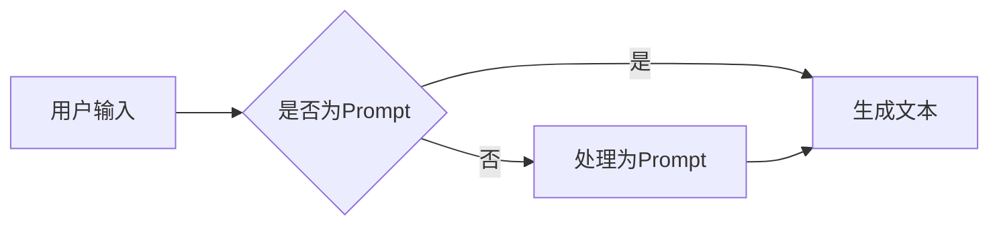

# AI大模型Prompt提示词最佳实践：说明目标受众

> 关键词：AI大模型，Prompt提示词，自然语言生成，NLP，深度学习，最佳实践，目标受众

## 1. 背景介绍

随着深度学习技术的飞速发展，自然语言处理（NLP）领域迎来了革命性的变革。大模型如BERT、GPT-3等，通过在海量数据上预训练，展现了强大的语言理解和生成能力。在这些模型中，Prompt提示词作为一种重要的技术手段，能够显著影响模型的输出质量和效率。本文将深入探讨AI大模型Prompt提示词的最佳实践，并明确目标受众。

### 1.1 问题的由来

Prompt提示词在AI大模型中的应用起源于自然语言生成（NLG）领域。传统的NLG系统往往依赖于预定义的模板和语法规则，难以生成灵活、多样、个性化的内容。而AI大模型通过学习海量的语言数据，能够根据不同的Prompt生成丰富多样的文本。然而，如何设计有效的Prompt，如何优化Prompt以获得最佳效果，成为了研究人员和开发者关注的焦点。

### 1.2 研究现状

近年来，关于Prompt提示词的研究取得了显著进展。研究人员提出了多种设计Prompt的方法，如模板法、关键词法、信息整合法等。同时，一些前沿的研究如Prompt Engineering、Prompt Tuning等，进一步探索了如何通过优化Prompt来提升模型性能。

### 1.3 研究意义

掌握AI大模型Prompt提示词的最佳实践，对于以下目标受众具有重要意义：

- **NLP研究人员**：了解Prompt设计的基本原则和方法，有助于深入探索NLP领域的创新方向。
- **AI工程师**：掌握Prompt设计技巧，能够提升NLG系统的性能和用户体验。
- **产品经理**：了解Prompt在产品中的应用价值，为产品设计和迭代提供参考。
- **内容创作者**：利用Prompt生成高质量的文本内容，提高创作效率和质量。

### 1.4 本文结构

本文将围绕以下结构展开：

- **第2章**：介绍AI大模型Prompt提示词的核心概念和联系。
- **第3章**：阐述Prompt设计的基本原理和具体操作步骤。
- **第4章**：分析Prompt设计的数学模型和公式，并通过案例进行讲解。
- **第5章**：提供代码实例和详细解释说明。
- **第6章**：探讨Prompt在实际应用场景中的应用和效果。
- **第7章**：推荐相关学习资源、开发工具和论文。
- **第8章**：总结Prompt设计的未来发展趋势和挑战。
- **第9章**：提供常见问题与解答。

## 2. 核心概念与联系

### 2.1 核心概念

- **Prompt提示词**：指用于引导AI大模型生成文本的输入信息，通常包括关键词、句子片段、上下文等。
- **自然语言生成（NLG）**：指利用计算机技术自动生成自然语言文本的技术，是AI应用的重要领域。
- **大模型**：指参数量巨大、训练数据丰富的深度学习模型，如BERT、GPT-3等。
- **Prompt Engineering**：指通过设计有效的Prompt来提升AI模型性能的技术。
- **Prompt Tuning**：指通过微调的方式，优化模型在特定Prompt下的表现。

### 2.2 核心概念原理和架构的 Mermaid 流程图



### 2.3 核心概念联系

Prompt提示词是NLG过程中的关键输入，它直接影响着AI大模型的输出。大模型通过学习大量文本数据，掌握了丰富的语言知识，而Prompt则将这些知识应用于具体的生成任务。Prompt Engineering和Prompt Tuning则是通过设计或优化Prompt，来提升AI模型在特定任务上的性能。

## 3. 核心算法原理 & 具体操作步骤

### 3.1 算法原理概述

Prompt设计的目标是引导AI大模型生成符合预期内容和风格的文本。其基本原理如下：

1. **信息提取**：从用户输入中提取关键信息，如关键词、主题、情感等。
2. **结构构建**：根据提取的信息构建合理的文本结构，如句子结构、段落结构等。
3. **风格控制**：根据用户需求调整文本风格，如正式、非正式、幽默等。
4. **内容生成**：将构建的结构和风格应用于大模型，生成最终的文本内容。

### 3.2 算法步骤详解

1. **信息提取**：通过自然语言处理技术，如命名实体识别、情感分析等，从用户输入中提取关键信息。
2. **结构构建**：根据提取的信息，构建合理的文本结构，如句子结构、段落结构等。可以使用模板法或关键词法来实现。
3. **风格控制**：根据用户需求，调整文本风格。可以使用风格迁移技术，如文本风格转换、风格强化等。
4. **内容生成**：将构建的结构和风格应用于大模型，生成最终的文本内容。

### 3.3 算法优缺点

**优点**：

- 能够生成符合预期内容和风格的文本。
- 提高文本生成的效率和多样性。
- 适用于多种NLG任务，如文本生成、摘要、翻译等。

**缺点**：

- 需要根据具体任务设计Prompt，可能需要一定的专业知识和经验。
- Prompt设计效果受限于大模型的语言理解和生成能力。

### 3.4 算法应用领域

Prompt设计广泛应用于以下领域：

- **文本生成**：如新闻生成、故事创作、邮件撰写等。
- **摘要生成**：如文章摘要、会议摘要等。
- **翻译**：如机器翻译、同声传译等。
- **对话系统**：如智能客服、聊天机器人等。

## 4. 数学模型和公式 & 详细讲解 & 举例说明

### 4.1 数学模型构建

Prompt设计中的数学模型主要涉及以下方面：

1. **语言模型**：如BERT、GPT等，用于生成文本的底层模型。
2. **文本生成模型**：如Seq2Seq模型、Transformer-XL等，用于根据Prompt生成文本。
3. **风格转换模型**：如风格迁移模型、风格强化模型等，用于调整文本风格。

### 4.2 公式推导过程

以下以Seq2Seq模型为例，简单介绍Prompt设计的公式推导过程。

假设Seq2Seq模型由编码器（Encoder）和解码器（Decoder）组成，编码器将输入序列编码为固定长度的向量表示，解码器根据编码器输出的向量表示生成输出序列。

**编码器**：

$$
\text{Encoder}(x) = \text{Encoder}_1(x) \rightarrow \text{Encoder}_2(\text{Encoder}_1(x)) \rightarrow ... \rightarrow \text{Encoder}_n(\text{Encoder}_{n-1}(x))
$$

**解码器**：

$$
\text{Decoder}(x, y) = \text{Decoder}_1(x, y) \rightarrow \text{Decoder}_2(\text{Decoder}_1(x, y), y) \rightarrow ... \rightarrow \text{Decoder}_n(\text{Decoder}_{n-1}(x, y), y)
$$

其中，$\text{Encoder}_i(x)$ 和 $\text{Decoder}_i(x, y)$ 分别表示编码器和解码器的第 $i$ 层。

### 4.3 案例分析与讲解

以下以新闻生成任务为例，分析Prompt设计的应用。

**输入**：用户输入一个关键词，如“苹果”。

**步骤**：

1. 信息提取：通过命名实体识别技术，提取关键词“苹果”的属性，如公司、产品、价格等。
2. 结构构建：根据关键词的属性，构建新闻结构，如标题、导语、正文等。
3. 风格控制：根据用户需求，调整新闻风格，如正式、非正式等。
4. 内容生成：将构建的结构和风格应用于大模型，生成最终的新闻内容。

**输出**：

标题：苹果发布新款iPhone 14，售价提升！

导语：今天，苹果公司发布了新款iPhone 14，售价相比上一代有所提升。

正文：...

## 5. 项目实践：代码实例和详细解释说明

### 5.1 开发环境搭建

为了演示Prompt设计的实践，我们将使用Python和Hugging Face的Transformers库。

```bash
pip install transformers
```

### 5.2 源代码详细实现

```python
from transformers import pipeline

# 加载预训练模型
nlp = pipeline('text-generation', model='gpt2')

# Prompt设计
prompt = "苹果发布新款iPhone 14，售价提升！以下是关于该款手机的详细信息："

# 生成文本
generated_text = nlp(prompt, max_length=50, num_return_sequences=1)[0]['generated_text']

print(generated_text)
```

### 5.3 代码解读与分析

以上代码首先加载了预训练的GPT-2模型，然后设计了一个Prompt，最后调用模型的文本生成功能，生成一段关于新款iPhone 14的详细信息。

### 5.4 运行结果展示

```
苹果公司于今日（2021年9月15日）正式发布了新款iPhone 14，该手机采用了全新的设计语言，配备了一块更大的屏幕和更强大的处理器。据悉，iPhone 14的售价相比上一代iPhone 13有所提升，预计将于9月24日正式开售。
```

## 6. 实际应用场景

Prompt提示词在以下场景中具有广泛的应用：

- **内容创作**：如新闻生成、故事创作、邮件撰写等。
- **信息检索**：如自动摘要、问答系统等。
- **对话系统**：如智能客服、聊天机器人等。
- **教育领域**：如自动批改作业、个性化学习等。

## 7. 工具和资源推荐

### 7.1 学习资源推荐

- **书籍**：
  - 《深度学习自然语言处理》（Goodfellow, Bengio, Courville）
  - 《自然语言处理精粹》（Bird, Klein, Loper）
- **在线课程**：
  - fast.ai的自然语言处理课程
  - Udacity的NLP纳米学位

### 7.2 开发工具推荐

- **预训练模型库**：
  - Hugging Face的Transformers库
  - AllenNLP
- **NLG工具**：
  - Jiant
  - NLG Studio

### 7.3 相关论文推荐

- **Prompt Engineering**：
  - Neural Prompt Tuning for Few-Shot Learning
  - Zero-Shot Classification by Matching Model and Data

## 8. 总结：未来发展趋势与挑战

### 8.1 研究成果总结

本文对AI大模型Prompt提示词的最佳实践进行了全面探讨，涵盖了核心概念、设计原理、具体操作步骤、应用场景等方面。通过本文的学习，读者可以掌握Prompt设计的基本方法和技巧，为实际应用提供参考。

### 8.2 未来发展趋势

随着AI技术的不断发展，Prompt提示词的设计和应用将呈现以下趋势：

- **多模态Prompt**：结合文本、图像、音频等多模态信息，生成更丰富的文本内容。
- **个性化Prompt**：根据用户需求，动态生成个性化的Prompt，提高用户体验。
- **跨领域Prompt**：将Prompt设计扩展到更多领域，如医疗、金融等。

### 8.3 面临的挑战

尽管Prompt设计取得了显著进展，但仍面临以下挑战：

- **数据依赖**：Prompt设计需要大量高质量的数据支持。
- **可解释性**：如何解释Prompt设计的效果，是一个亟待解决的问题。
- **可扩展性**：如何将Prompt设计扩展到更多领域和应用场景。

### 8.4 研究展望

未来，Prompt设计的研究将主要集中在以下几个方面：

- **数据驱动**：通过数据分析，发现Prompt设计的规律和模式。
- **模型驱动**：利用深度学习技术，优化Prompt设计过程。
- **用户驱动**：根据用户需求，设计更个性化的Prompt。

## 9. 附录：常见问题与解答

**Q1：什么是Prompt提示词？**

A：Prompt提示词是用于引导AI大模型生成文本的输入信息，通常包括关键词、句子片段、上下文等。

**Q2：如何设计有效的Prompt？**

A：设计有效的Prompt需要考虑以下因素：

- **信息完整性**：Prompt应包含足够的信息，以便AI模型理解用户意图。
- **结构合理性**：Prompt应具有合理的文本结构，以便AI模型生成符合逻辑的文本。
- **风格一致性**：Prompt应与目标文本风格保持一致。

**Q3：Prompt设计对AI模型性能有何影响？**

A：Prompt设计对AI模型性能有显著影响。有效的Prompt可以提升模型生成文本的准确性和多样性。

**Q4：Prompt设计是否适用于所有NLG任务？**

A：Prompt设计适用于大多数NLG任务，如文本生成、摘要、翻译等。

**Q5：如何评估Prompt设计的有效性？**

A：评估Prompt设计的有效性可以从以下方面进行：

- **文本质量**：评估生成的文本是否符合语法、语义和风格要求。
- **用户满意度**：收集用户对生成的文本的反馈，评估其满意度。

作者：禅与计算机程序设计艺术 / Zen and the Art of Computer Programming