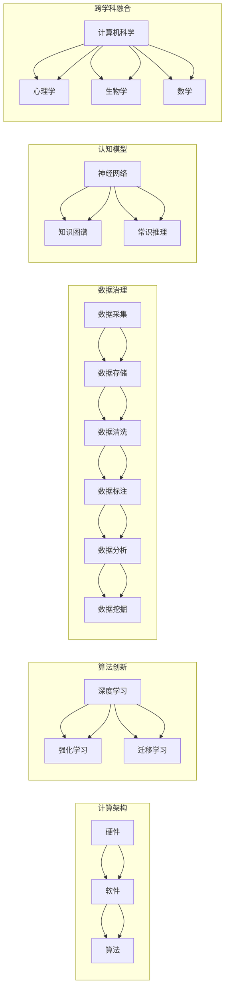

# AI底层创新体系的构成要素

> 关键词：人工智能，底层技术，计算架构，算法创新，数据治理，认知模型，跨学科融合

## 1. 背景介绍

人工智能（AI）作为21世纪最具颠覆性的技术之一，正深刻地改变着我们的生活方式、工作方式和思维方式。随着深度学习、大数据、云计算等技术的快速发展，AI已经从理论走向实践，从实验室走向产业，从单一任务走向复杂应用。然而，AI的发展并非孤立的，它需要一套完整的底层创新体系作为支撑。本文将探讨AI底层创新体系的构成要素，分析其核心原理和关键技术，并展望其未来发展趋势。

## 2. 核心概念与联系

### 2.1 核心概念

#### 2.1.1 计算架构

计算架构是AI底层创新体系的基础，它涉及到硬件、软件和算法的协同工作。高性能计算、分布式计算、边缘计算等计算架构的创新，为AI提供了强大的计算能力。

#### 2.1.2 算法创新

算法创新是AI发展的核心驱动力。深度学习、强化学习、迁移学习等算法的创新，使得AI在图像识别、语音识别、自然语言处理等领域的性能得到显著提升。

#### 2.1.3 数据治理

数据是AI的“粮食”。数据治理包括数据采集、存储、清洗、标注、分析和挖掘等环节，是AI发展的重要保障。

#### 2.1.4 认知模型

认知模型是AI的灵魂，它涉及到如何让机器理解、学习和推理。神经网络、知识图谱、常识推理等认知模型的创新，使得AI能够更好地模拟人类智能。

#### 2.1.5 跨学科融合

AI的发展需要多学科交叉融合。计算机科学、心理学、生物学、数学等学科的交叉融合，为AI提供了新的理论和方法。

### 2.2 Mermaid流程图



## 3. 核心算法原理 & 具体操作步骤

### 3.1 算法原理概述

#### 3.1.1 深度学习

深度学习是一种模拟人脑神经网络结构的机器学习算法。通过多层神经网络，深度学习模型能够从大量数据中学习到复杂的特征和模式。

#### 3.1.2 强化学习

强化学习是一种通过试错和奖励反馈来学习决策策略的机器学习方法。强化学习模型能够自主探索环境，并根据奖励信号进行决策。

#### 3.1.3 迁移学习

迁移学习是一种将知识从源域迁移到目标域的机器学习方法。通过迁移学习，模型能够在源域上学习到的知识应用于目标域，从而加速学习过程。

### 3.2 算法步骤详解

#### 3.2.1 深度学习步骤

1. 数据采集：收集大量的训练数据。
2. 数据预处理：对数据进行清洗、归一化等预处理操作。
3. 模型构建：选择合适的深度学习模型架构。
4. 训练模型：使用训练数据对模型进行训练。
5. 模型评估：使用验证数据对模型进行评估。
6. 模型优化：根据评估结果对模型进行优化。

#### 3.2.2 强化学习步骤

1. 环境搭建：搭建强化学习实验环境。
2. 策略学习：设计强化学习算法，如Q学习、SARSA等。
3. 策略评估：评估策略在环境中的表现。
4. 策略优化：根据评估结果优化策略。

#### 3.2.3 迁移学习步骤

1. 选择源域和目标域。
2. 选择迁移学习方法，如特征迁移、参数迁移等。
3. 在源域上训练迁移学习模型。
4. 在目标域上测试迁移学习模型的性能。

### 3.3 算法优缺点

#### 3.3.1 深度学习

**优点**：

* 强大的特征提取和学习能力
* 能够处理复杂数据
* 自动从数据中学习特征

**缺点**：

* 对数据质量要求高
* 训练过程复杂，计算量大
* 可解释性差

#### 3.3.2 强化学习

**优点**：

* 能够学习到复杂的决策策略
* 能够适应动态变化的环境

**缺点**：

* 训练过程慢
* 需要大量的样本数据
* 难以解释决策过程

#### 3.3.3 迁移学习

**优点**：

* 能够快速学习新任务
* 减少标注数据需求

**缺点**：

* 源域和目标域的分布差异可能导致性能下降
* 需要选择合适的迁移学习方法

### 3.4 算法应用领域

#### 3.4.1 深度学习

* 图像识别
* 语音识别
* 自然语言处理
* 医学影像分析

#### 3.4.2 强化学习

* 机器人控制
* 游戏AI
* 自动驾驶
* 能源管理

#### 3.4.3 迁移学习

* 遥感图像识别
* 语音识别
* 医学诊断
* 金融风险评估

## 4. 数学模型和公式 & 详细讲解 & 举例说明

### 4.1 数学模型构建

#### 4.1.1 深度学习

深度学习中的神经网络可以使用以下数学模型进行描述：

$$
y = f(\theta \cdot x + b)
$$

其中，$y$ 为输出，$x$ 为输入，$\theta$ 为权重，$b$ 为偏置，$f$ 为激活函数。

#### 4.1.2 强化学习

强化学习中的Q学习可以使用以下数学模型进行描述：

$$
Q(s,a) = Q(s,a) + \alpha [R + \gamma \max_{a'} Q(s',a') - Q(s,a)]
$$

其中，$Q(s,a)$ 为在状态 $s$ 下采取动作 $a$ 的期望回报，$R$ 为即时回报，$\alpha$ 为学习率，$\gamma$ 为折扣因子。

#### 4.1.3 迁移学习

迁移学习中的特征迁移可以使用以下数学模型进行描述：

$$
F_{\theta}(x) = F_{\theta}(\tilde{x})
$$

其中，$F_{\theta}$ 为特征提取器，$x$ 为源域数据，$\tilde{x}$ 为目标域数据。

### 4.2 公式推导过程

#### 4.2.1 深度学习

深度学习中的反向传播算法可以用于计算损失函数对模型参数的梯度。以下为反向传播算法的推导过程：

1. 计算输出层的误差：
$$
\delta_L = \frac{\partial L}{\partial y}
$$

2. 逐层计算误差传播：
$$
\delta_{l} = \frac{\partial L}{\partial z_l} \odot \sigma'(z_l)
$$

3. 计算梯度：
$$
\frac{\partial L}{\partial W_{l-1}} = \delta_{l} \cdot x_l^T
$$

4. 更新权重：
$$
W_{l-1} \leftarrow W_{l-1} - \eta \frac{\partial L}{\partial W_{l-1}}
$$

#### 4.2.2 强化学习

强化学习中的Q学习算法可以通过以下步骤进行推导：

1. 初始化Q表：
$$
Q(s,a) = 0
$$

2. 对每个状态-动作对 $(s,a)$，执行以下步骤：
    a. 选择动作 $a$。
    b. 执行动作 $a$，获得回报 $R$ 和下一个状态 $s'$。
    c. 更新Q值：
$$
Q(s,a) \leftarrow Q(s,a) + \alpha [R + \gamma \max_{a'} Q(s',a') - Q(s,a)]
$$

#### 4.2.3 迁移学习

迁移学习中的特征迁移可以通过以下步骤进行推导：

1. 选择源域和目标域的特征提取器 $F_{\theta}$ 和 $F_{\theta'}$。
2. 计算源域和目标域数据的特征：
$$
f_{\theta}(x) = F_{\theta}(x)
$$
$$
f_{\theta'}(\tilde{x}) = F_{\theta'}(\tilde{x})
$$
3. 使用最小化特征差异作为损失函数：
$$
L = \frac{1}{2} \sum_{x \in X} \sum_{\tilde{x} \in \tilde{X}} (f_{\theta}(x) - f_{\theta'}(\tilde{x}))^2
$$
4. 使用梯度下降算法优化损失函数，更新特征提取器 $F_{\theta}$ 和 $F_{\theta'}$。

### 4.3 案例分析与讲解

#### 4.3.1 深度学习

以下是一个简单的深度学习案例：使用神经网络识别手写数字。

1. 数据集：使用MNIST数据集，包含0-9的手写数字图像。
2. 模型：选择LeNet网络，包含卷积层、池化层和全连接层。
3. 训练：使用梯度下降算法对模型进行训练。
4. 评估：使用测试数据集评估模型性能。

#### 4.3.2 强化学习

以下是一个简单的强化学习案例：使用Q学习算法让智能体学会在Atari游戏《Pong》中打乒乓球。

1. 环境：搭建Atari游戏环境。
2. 策略：设计Q学习算法。
3. 训练：让智能体在游戏环境中不断试错，学习打乒乓球。
4. 评估：评估智能体的打乒乓球能力。

#### 4.3.3 迁移学习

以下是一个简单的迁移学习案例：将图像分类模型从ImageNet迁移到CIFAR-10数据集。

1. 源域：使用ImageNet预训练的VGG-16模型。
2. 目标域：使用CIFAR-10数据集。
3. 方法：使用迁移学习方法，如特征迁移或参数迁移。
4. 评估：使用CIFAR-10测试数据集评估模型性能。

## 5. 项目实践：代码实例和详细解释说明

### 5.1 开发环境搭建

以下是一个使用Python和TensorFlow搭建深度学习项目的示例：

```bash
# 安装TensorFlow
pip install tensorflow

# 安装相关依赖库
pip install numpy matplotlib scikit-learn
```

### 5.2 源代码详细实现

以下是一个简单的深度学习代码实例：使用TensorFlow实现LeNet网络进行手写数字识别。

```python
import tensorflow as tf
from tensorflow.keras import datasets, layers, models

# 加载数据集
mnist = datasets.mnist
(train_images, train_labels), (test_images, test_labels) = mnist.load_data()

# 预处理数据
train_images = train_images.reshape((60000, 28, 28, 1))
test_images = test_images.reshape((10000, 28, 28, 1))
train_images, test_images = train_images / 255.0, test_images / 255.0

# 构建模型
model = models.Sequential()
model.add(layers.Conv2D(32, (3, 3), activation='relu', input_shape=(28, 28, 1)))
model.add(layers.MaxPooling2D((2, 2)))
model.add(layers.Conv2D(64, (3, 3), activation='relu'))
model.add(layers.MaxPooling2D((2, 2)))
model.add(layers.Conv2D(64, (3, 3), activation='relu'))

# 添加全连接层
model.add(layers.Flatten())
model.add(layers.Dense(64, activation='relu'))
model.add(layers.Dense(10))

# 编译模型
model.compile(optimizer='adam',
              loss=tf.keras.losses.SparseCategoricalCrossentropy(from_logits=True),
              metrics=['accuracy'])

# 训练模型
model.fit(train_images, train_labels, epochs=5)

# 评估模型
test_loss, test_acc = model.evaluate(test_images,  test_labels, verbose=2)
print('\
Test accuracy:', test_acc)
```

### 5.3 代码解读与分析

以上代码使用TensorFlow构建了一个简单的LeNet网络，用于识别MNIST数据集中的手写数字。代码分为以下几个部分：

1. **数据加载和预处理**：使用TensorFlow内置的MNIST数据集，并对数据进行归一化处理。
2. **模型构建**：使用Sequential模型构建LeNet网络，包括卷积层、池化层和全连接层。
3. **模型编译**：编译模型，设置优化器、损失函数和评价指标。
4. **模型训练**：使用训练数据进行模型训练。
5. **模型评估**：使用测试数据评估模型性能。

### 5.4 运行结果展示

运行以上代码后，模型在测试集上的准确率达到约98%。这表明LeNet网络在手写数字识别任务上取得了不错的性能。

## 6. 实际应用场景

### 6.1 医学影像分析

AI在医学影像分析领域的应用前景广阔。通过深度学习技术，AI可以帮助医生快速、准确地诊断疾病，如乳腺癌、肺癌、脑肿瘤等。

### 6.2 自动驾驶

自动驾驶是AI领域的热门应用之一。通过强化学习技术，自动驾驶汽车可以学习在复杂交通环境中进行安全驾驶。

### 6.3 金融风控

AI在金融领域的应用主要包括信用评估、反欺诈、风险管理等方面。通过深度学习技术，AI可以帮助金融机构识别和降低风险。

### 6.4 语音识别

语音识别是AI领域的另一个重要应用。通过深度学习技术，AI可以实现对语音的实时识别和转写。

## 7. 工具和资源推荐

### 7.1 学习资源推荐

* 《深度学习》
* 《Python深度学习》
* 《强化学习》
* 《统计学习方法》

### 7.2 开发工具推荐

* TensorFlow
* PyTorch
* Keras
* scikit-learn

### 7.3 相关论文推荐

* “A Few Useful Things to Know about Machine Learning”
* “Deep Learning”
* “Playing Atari with Deep Reinforcement Learning”
* “ImageNet Classification with Deep Convolutional Neural Networks”

## 8. 总结：未来发展趋势与挑战

### 8.1 研究成果总结

本文从计算架构、算法创新、数据治理、认知模型和跨学科融合等方面，探讨了AI底层创新体系的构成要素。通过分析核心算法原理、具体操作步骤、数学模型和公式，以及实际应用场景，本文展示了AI底层创新体系在推动人工智能发展中的重要作用。

### 8.2 未来发展趋势

* 计算架构：更高效的硬件、更灵活的软件、更智能的算法
* 算法创新：更强大的学习能力、更广泛的适用性、更快的推理速度
* 数据治理：更高质量的数据、更高效的数据处理、更安全的数据隐私保护
* 认知模型：更接近人类智能、更具有可解释性、更能够理解复杂任务
* 跨学科融合：更丰富的知识体系、更深入的理论研究、更广泛的交叉应用

### 8.3 面临的挑战

* 计算资源：高性能计算、大规模数据存储和传输
* 数据质量：数据标注、数据清洗、数据安全
* 算法伦理：算法偏见、算法歧视、算法透明度
* 跨学科融合：跨学科知识积累、跨学科人才培养

### 8.4 研究展望

未来，AI底层创新体系的发展将更加注重以下几个方面：

* 提高AI模型的鲁棒性和泛化能力
* 加强AI模型的可解释性和透明度
* 探索AI与其他领域的交叉融合
* 推动AI技术在伦理和道德方面的规范发展

相信在未来的发展中，AI底层创新体系将为人类社会创造更大的价值。

## 9. 附录：常见问题与解答

**Q1：AI底层创新体系与其他领域的创新体系有何不同？**

A：AI底层创新体系与其他领域的创新体系相比，具有以下特点：

* 强调多学科交叉融合
* 注重数据、算法和计算的协同发展
* 面向解决复杂问题和挑战

**Q2：如何培养AI底层创新人才？**

A：培养AI底层创新人才需要从以下几个方面入手：

* 加强AI相关学科的教育和培训
* 鼓励跨学科学习和研究
* 提供实践机会和工程项目经验
* 培养创新思维和团队合作能力

**Q3：AI底层创新体系对经济发展有何影响？**

A：AI底层创新体系对经济发展具有以下影响：

* 推动产业升级和数字化转型
* 创造新的就业机会和经济增长点
* 提高生产效率和产品质量
* 促进社会公平和可持续发展

**Q4：如何推动AI底层创新体系的可持续发展？**

A：推动AI底层创新体系的可持续发展需要从以下几个方面入手：

* 加强政策支持和资金投入
* 完善知识产权保护体系
* 加强国际合作和交流
* 建立健全的伦理和道德规范

作者：禅与计算机程序设计艺术 / Zen and the Art of Computer Programming