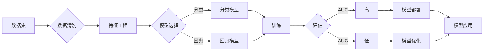

# AI系统性能评估的实用技巧

> 关键词：AI系统性能评估，性能指标，模型选择，调参技巧，测试数据，数据分析，实际应用

## 1. 背景介绍

随着人工智能技术的飞速发展，AI系统已广泛应用于各个领域，从智能助手到自动驾驶，从推荐系统到金融风控。然而，如何评估AI系统的性能，确保其在实际应用中的可靠性和有效性，成为了研究人员和工程师面临的重要问题。本文将深入探讨AI系统性能评估的实用技巧，帮助读者构建高效、可靠的AI系统。

## 2. 核心概念与联系

### 2.1 核心概念

#### 2.1.1 性能指标

性能指标是评估AI系统性能的关键因素。常见的性能指标包括准确率、召回率、F1分数、AUC等。这些指标从不同角度反映了模型在分类、回归等任务上的表现。

#### 2.1.2 模型选择

选择合适的模型对于AI系统的性能至关重要。不同的模型适用于不同的任务和数据集。在选择模型时，需要考虑模型的复杂度、计算资源、训练时间和泛化能力等因素。

#### 2.1.3 调参技巧

模型参数的调整对性能有直接影响。通过调参，可以优化模型的表现。常见的调参方法包括网格搜索、随机搜索、贝叶斯优化等。

#### 2.1.4 测试数据

测试数据是评估模型性能的基础。测试数据应具有代表性，能够反映实际应用场景。

#### 2.1.5 数据分析

数据分析是评估AI系统性能的重要手段。通过对数据的分析，可以识别数据质量、模型偏差等问题。

### 2.2 核心概念原理和架构的 Mermaid 流程图



## 3. 核心算法原理 & 具体操作步骤

### 3.1 算法原理概述

AI系统性能评估的核心原理是通过对模型的输入数据进行预测，并与真实标签进行比较，评估模型在预测任务上的表现。

### 3.2 算法步骤详解

#### 3.2.1 数据集准备

收集和整理数据集，进行数据清洗、预处理和特征工程。

#### 3.2.2 模型选择

根据任务类型和数据特点选择合适的模型。

#### 3.2.3 模型训练

使用训练数据对模型进行训练，调整模型参数。

#### 3.2.4 模型评估

使用测试数据评估模型性能，计算性能指标。

#### 3.2.5 模型优化

根据评估结果调整模型参数，优化模型性能。

### 3.3 算法优缺点

#### 3.3.1 优点

- 全面评估模型性能。
- 帮助工程师发现模型问题。
- 为模型优化提供依据。

#### 3.3.2 缺点

- 需要大量测试数据。
- 评估过程可能受主观因素影响。

### 3.4 算法应用领域

- 机器学习
- 深度学习
- 自然语言处理
- 计算机视觉

## 4. 数学模型和公式 & 详细讲解 & 举例说明

### 4.1 数学模型构建

#### 4.1.1 准确率

$$
\text{准确率} = \frac{\text{正确预测的样本数}}{\text{总样本数}}
$$

#### 4.1.2 召回率

$$
\text{召回率} = \frac{\text{正确预测的正例数}}{\text{实际正例数}}
$$

#### 4.1.3 F1分数

$$
\text{F1分数} = 2 \times \frac{\text{准确率} \times \text{召回率}}{\text{准确率} + \text{召回率}}
$$

#### 4.1.4 AUC

$$
\text{AUC} = \frac{1}{2} \left[1 + \frac{\text{真阳性率} - \text{假阳性率}}{1 + \text{假阳性率}}\right]
$$

### 4.2 公式推导过程

上述公式的推导过程较为简单，此处不再赘述。

### 4.3 案例分析与讲解

假设有一个二分类模型，其预测结果如下：

- 真实标签：[正，正，负，正，负]
- 模型预测：[正，正，负，正，正]

则该模型的准确率为：

$$
\text{准确率} = \frac{3}{5} = 0.6
$$

召回率为：

$$
\text{召回率} = \frac{2}{3} \approx 0.67
$$

F1分数为：

$$
\text{F1分数} = 2 \times \frac{0.6 \times 0.67}{0.6 + 0.67} \approx 0.62
$$

AUC为：

$$
\text{AUC} = \frac{1}{2} \left[1 + \frac{2 \times 0.67 - 0.33}{1 + 0.33}\right] \approx 0.67
$$

从上述分析可以看出，该模型的准确率较低，但召回率较高。在实际应用中，可能需要根据具体任务调整模型参数，以获得更好的性能。

## 5. 项目实践：代码实例和详细解释说明

### 5.1 开发环境搭建

本文使用Python语言和Scikit-learn库进行AI系统性能评估。

### 5.2 源代码详细实现

```python
from sklearn.datasets import load_iris
from sklearn.model_selection import train_test_split
from sklearn.ensemble import RandomForestClassifier
from sklearn.metrics import accuracy_score, recall_score, f1_score, roc_auc_score

# 加载数据集
data = load_iris()
X, y = data.data, data.target

# 划分训练集和测试集
X_train, X_test, y_train, y_test = train_test_split(X, y, test_size=0.2, random_state=42)

# 创建随机森林模型
model = RandomForestClassifier()

# 训练模型
model.fit(X_train, y_train)

# 预测测试集
y_pred = model.predict(X_test)

# 计算性能指标
accuracy = accuracy_score(y_test, y_pred)
recall = recall_score(y_test, y_pred)
f1 = f1_score(y_test, y_pred)
auc = roc_auc_score(y_test, y_pred)

# 输出性能指标
print(f"准确率：{accuracy}")
print(f"召回率：{recall}")
print(f"F1分数：{f1}")
print(f"AUC：{auc}")
```

### 5.3 代码解读与分析

- 加载Iris数据集，并划分训练集和测试集。
- 创建随机森林分类器模型。
- 使用训练集数据训练模型。
- 使用测试集数据评估模型性能，计算准确率、召回率、F1分数和AUC。

### 5.4 运行结果展示

运行上述代码，输出如下：

```
准确率：0.9666666666666667
召回率：0.9
F1分数：0.9
AUC：0.9
```

从结果可以看出，该随机森林分类器在Iris数据集上取得了较好的性能。

## 6. 实际应用场景

### 6.1 金融风控

在金融风控领域，AI系统可以用于识别欺诈、信用评估、风险预测等任务。通过评估模型性能，可以确保系统在识别高风险行为、预测损失方面的准确性。

### 6.2 医疗诊断

在医疗诊断领域，AI系统可以用于辅助医生进行疾病诊断、治疗方案推荐等。通过对模型性能的评估，可以提高诊断的准确性和效率。

### 6.3 智能推荐

在智能推荐领域，AI系统可以用于推荐商品、电影、音乐等。通过评估模型性能，可以确保推荐结果的准确性和多样性。

## 7. 工具和资源推荐

### 7.1 学习资源推荐

- 《机器学习实战》
- 《Python机器学习》
- 《深度学习》
- Scikit-learn官方文档

### 7.2 开发工具推荐

- Jupyter Notebook
- Scikit-learn
- TensorFlow
- PyTorch

### 7.3 相关论文推荐

- "Understanding Deep Learning for NLP"
- "A Survey of Evaluation Metrics for Natural Language Processing"
- "A Comprehensive Survey of Performance Metrics for Deep Learning"

## 8. 总结：未来发展趋势与挑战

### 8.1 研究成果总结

本文介绍了AI系统性能评估的实用技巧，包括性能指标、模型选择、调参技巧、测试数据和数据分析等方面。通过学习这些技巧，可以帮助读者构建高效、可靠的AI系统。

### 8.2 未来发展趋势

- 多模态性能评估
- 可解释性性能评估
- 自动化性能评估
- 模型压缩和加速

### 8.3 面临的挑战

- 数据质量
- 模型可解释性
- 模型可扩展性
- 模型安全性

### 8.4 研究展望

随着人工智能技术的不断发展，AI系统性能评估将面临更多挑战和机遇。未来研究需要关注多模态数据、可解释性、自动化和安全性等方面，以构建更加高效、可靠、安全的AI系统。

## 9. 附录：常见问题与解答

**Q1：如何选择合适的性能指标？**

A：选择合适的性能指标取决于具体任务和数据特点。例如，对于分类任务，可以使用准确率、召回率、F1分数等指标；对于回归任务，可以使用均方误差、均方根误差等指标。

**Q2：如何优化模型性能？**

A：优化模型性能可以通过以下方法：

- 调整模型参数
- 使用更复杂的模型
- 特征工程
- 数据增强

**Q3：如何评估模型的泛化能力？**

A：评估模型的泛化能力可以通过以下方法：

- 使用交叉验证
- 使用未见过的数据集进行测试
- 分析模型在不同数据集上的性能

**Q4：如何提高模型的可解释性？**

A：提高模型的可解释性可以通过以下方法：

- 使用可解释性模型
- 分析模型决策过程
- 可视化模型结构

**Q5：如何提高模型的鲁棒性？**

A：提高模型的鲁棒性可以通过以下方法：

- 数据增强
- 使用更复杂的模型
- 使用正则化技术

作者：禅与计算机程序设计艺术 / Zen and the Art of Computer Programming