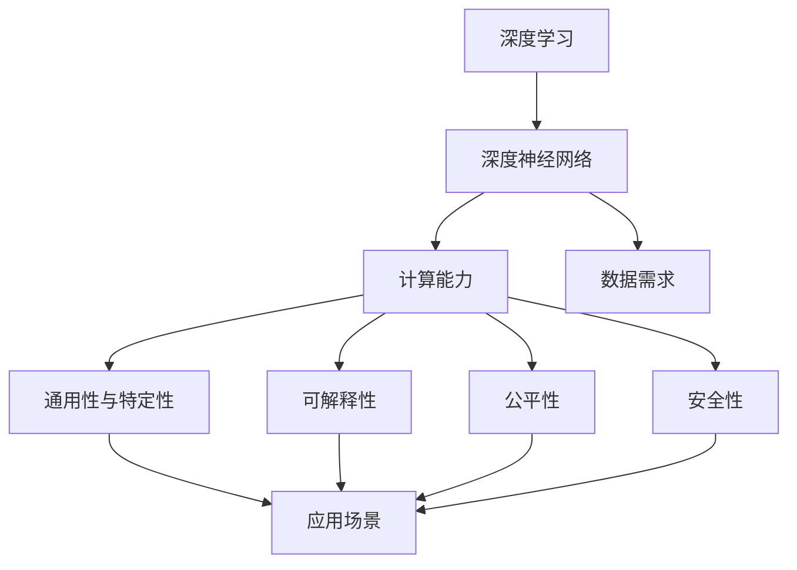
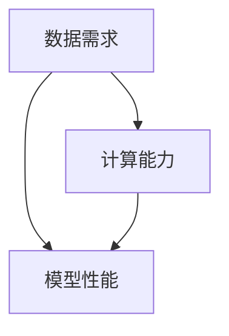
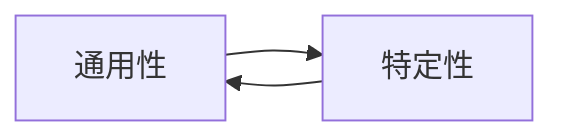
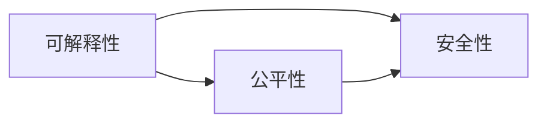
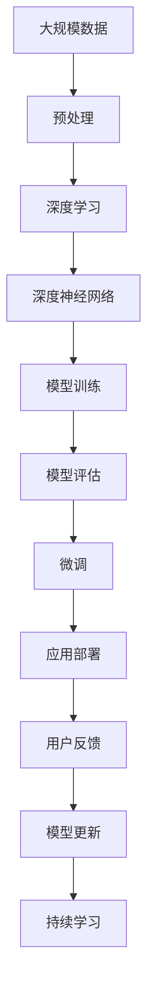

                 

# 大型AI模型的优势与局限性分析

> 关键词：大型AI模型,深度学习,深度神经网络,计算能力,数据需求,通用性与特定性,可解释性,公平性,安全性

## 1. 背景介绍

随着人工智能技术的快速发展，大型AI模型（Large AI Models）已经成为了当今机器学习领域的热点。这些模型通常具有数十亿甚至上百亿个参数，可以通过对大规模数据进行训练，实现对复杂数据的理解和生成。这些模型在图像识别、自然语言处理、语音识别、推荐系统等领域取得了显著的成果，改变了人类的生产和生活方式。然而，大型AI模型也存在一定的局限性，本文将对大型AI模型的优势与局限性进行详细分析。

### 1.1 问题由来
大型AI模型的优势主要体现在其强大的计算能力和数据处理能力。通过深度学习（Deep Learning）技术，这些模型能够自动学习数据的特征表示，并能够处理高维、非线性数据。然而，这些模型的复杂性和高数据需求也带来了一定的挑战，如训练时间长、存储需求大、泛化能力差等。因此，了解大型AI模型的优势与局限性对于研究人员和从业者来说尤为重要。

### 1.2 问题核心关键点
大型AI模型的优势主要体现在以下几个方面：
1. **强大的数据处理能力**：大型AI模型能够处理高维、非线性数据，并能够从中提取特征表示。
2. **广泛的应用场景**：大型AI模型已经应用于多个领域，如图像识别、自然语言处理、推荐系统等。
3. **高精度与泛化能力**：在许多任务上，大型AI模型已经取得了最先进的性能指标。

其局限性主要体现在以下几个方面：
1. **高数据需求**：大型AI模型的训练需要大量的标注数据，数据采集和标注成本较高。
2. **计算资源消耗大**：训练大型AI模型需要高性能的计算资源，如GPU或TPU。
3. **泛化能力有限**：大型AI模型在特定领域或数据分布下的泛化能力有限，可能出现过拟合或泛化不良的情况。
4. **可解释性不足**：大型AI模型的决策过程通常缺乏可解释性，难以理解其内部工作机制。

## 2. 核心概念与联系

### 2.1 核心概念概述

为更好地理解大型AI模型的优势与局限性，本文将介绍几个关键概念及其联系：

- **深度学习（Deep Learning）**：一种机器学习技术，使用多层神经网络来处理复杂的数据。深度学习模型通常包括卷积神经网络（CNN）、循环神经网络（RNN）、变换器（Transformer）等。
- **深度神经网络（Deep Neural Networks, DNNs）**：一种多层的神经网络，每一层都可以学习数据的不同特征表示。深度神经网络是大型AI模型的核心构成部分。
- **计算能力（Computational Power）**：指机器计算任务的能力，包括硬件设备的性能、算法的效率等。
- **数据需求（Data Demand）**：指模型训练和预测所需数据量的大小。
- **通用性与特定性（Generality & Specificity）**：指模型在不同领域和任务中的表现。通用性强的模型适用于多种任务，而特定性强的模型则只适用于特定的领域或任务。
- **可解释性（Interpretability）**：指模型决策过程的可理解性和可解释性。可解释性强的模型更容易被理解和信任。
- **公平性（Fairness）**：指模型在不同人群中的表现是否公平，避免对某些群体产生偏见。
- **安全性（Safety）**：指模型在面对恶意攻击或数据偏差时的鲁棒性和安全性。

这些核心概念之间的联系通过以下Mermaid流程图来展示：



这个流程图展示了大型AI模型在数据、计算、应用、可解释性、公平性和安全性等方面的联系与作用。

### 2.2 概念间的关系

这些核心概念之间存在着紧密的联系，形成了大型AI模型的完整生态系统。下面我们通过几个Mermaid流程图来展示这些概念之间的关系。

#### 2.2.1 数据、计算与模型性能的关系



这个流程图展示了数据需求和计算能力对模型性能的影响。

#### 2.2.2 通用性与特定性之间的关系



这个流程图展示了通用性与特定性之间的关系。

#### 2.2.3 可解释性、公平性、安全性之间的关系



这个流程图展示了可解释性、公平性和安全性之间的关系。

### 2.3 核心概念的整体架构

最后，我们用一个综合的流程图来展示这些核心概念在大模型构建过程中的整体架构：



这个综合流程图展示了从数据预处理到模型部署再到持续学习的完整过程。大型AI模型通过深度学习技术，在大规模数据上进行预训练，构建深度神经网络，并通过模型训练和微调等过程，逐步提升模型性能。最后，模型在实际应用中进行评估和更新，通过持续学习不断优化模型表现。

## 3. 核心算法原理 & 具体操作步骤

### 3.1 算法原理概述

大型AI模型的核心算法原理基于深度学习，使用多层神经网络来处理复杂的数据。其基本流程包括数据预处理、模型构建、模型训练、模型微调和应用部署等步骤。以下是对这些步骤的详细介绍。

#### 3.1.1 数据预处理

数据预处理是大型AI模型构建的第一步，主要包括数据清洗、数据标准化、数据增强等步骤。

数据清洗：去除数据中的噪声和异常值，确保数据质量。

数据标准化：将数据转化为标准格式，便于模型处理。

数据增强：通过数据扩增技术，如旋转、裁剪、翻转等，增加数据量，提高模型的泛化能力。

#### 3.1.2 模型构建

模型构建是大型AI模型的核心步骤，主要包括模型架构设计和参数初始化。

模型架构设计：选择合适的深度神经网络架构，如卷积神经网络（CNN）、循环神经网络（RNN）、变换器（Transformer）等。

参数初始化：对模型参数进行初始化，通常使用随机初始化或预训练权重。

#### 3.1.3 模型训练

模型训练是大型AI模型的关键步骤，主要包括前向传播、损失计算、反向传播和参数更新等。

前向传播：将输入数据输入模型，计算模型输出。

损失计算：计算模型输出与真实标签之间的损失函数。

反向传播：根据损失函数计算梯度，更新模型参数。

参数更新：根据梯度信息更新模型参数，通常使用优化算法如随机梯度下降（SGD）、Adam等。

#### 3.1.4 模型微调

模型微调是在预训练模型的基础上，使用下游任务的少量标注数据，通过有监督学习优化模型在该任务上的性能。

微调数据准备：收集下游任务的标注数据，并对其进行划分，划分为训练集、验证集和测试集。

微调模型构建：在预训练模型的基础上，添加任务适配层，并设置合适的损失函数。

微调模型训练：使用微调数据集对模型进行训练，更新模型参数。

#### 3.1.5 应用部署

应用部署是将模型应用于实际任务的过程，主要包括模型保存、模型加载和推理预测等。

模型保存：将训练好的模型保存为二进制文件，便于后续使用。

模型加载：从保存的文件中加载模型，进行推理预测。

推理预测：将待预测数据输入模型，输出预测结果。

### 3.2 算法步骤详解

大型AI模型的构建步骤包括数据预处理、模型构建、模型训练、模型微调和应用部署等，以下是对每个步骤的详细介绍。

#### 3.2.1 数据预处理

数据预处理是大型AI模型构建的第一步，主要包括数据清洗、数据标准化、数据增强等步骤。

数据清洗：去除数据中的噪声和异常值，确保数据质量。例如，在图像识别任务中，可以通过裁剪、缩放、旋转等操作去除无用的噪声。

数据标准化：将数据转化为标准格式，便于模型处理。例如，在图像识别任务中，可以将图像数据归一化为[0,1]或[-1,1]的浮点数格式。

数据增强：通过数据扩增技术，如旋转、裁剪、翻转等，增加数据量，提高模型的泛化能力。例如，在图像识别任务中，可以通过对图像进行随机旋转、随机裁剪等操作，生成更多的训练样本。

#### 3.2.2 模型构建

模型构建是大型AI模型的核心步骤，主要包括模型架构设计和参数初始化。

模型架构设计：选择合适的深度神经网络架构，如卷积神经网络（CNN）、循环神经网络（RNN）、变换器（Transformer）等。例如，在图像识别任务中，可以选择使用卷积神经网络（CNN）来构建模型；在自然语言处理任务中，可以选择使用变换器（Transformer）来构建模型。

参数初始化：对模型参数进行初始化，通常使用随机初始化或预训练权重。例如，在图像识别任务中，可以使用随机初始化来初始化卷积核权重；在自然语言处理任务中，可以使用预训练的BERT、GPT等模型作为初始化权重。

#### 3.2.3 模型训练

模型训练是大型AI模型的关键步骤，主要包括前向传播、损失计算、反向传播和参数更新等。

前向传播：将输入数据输入模型，计算模型输出。例如，在图像识别任务中，将图像数据输入卷积神经网络（CNN），计算模型输出特征图。

损失计算：计算模型输出与真实标签之间的损失函数。例如，在图像识别任务中，可以使用交叉熵损失函数来计算模型输出与真实标签之间的误差。

反向传播：根据损失函数计算梯度，更新模型参数。例如，在图像识别任务中，可以使用反向传播算法计算梯度，并更新卷积核权重。

参数更新：根据梯度信息更新模型参数，通常使用优化算法如随机梯度下降（SGD）、Adam等。例如，在图像识别任务中，可以使用随机梯度下降（SGD）或Adam优化算法来更新模型参数。

#### 3.2.4 模型微调

模型微调是在预训练模型的基础上，使用下游任务的少量标注数据，通过有监督学习优化模型在该任务上的性能。

微调数据准备：收集下游任务的标注数据，并对其进行划分，划分为训练集、验证集和测试集。例如，在文本分类任务中，可以收集标注好的新闻文章数据，并对其进行划分。

微调模型构建：在预训练模型的基础上，添加任务适配层，并设置合适的损失函数。例如，在文本分类任务中，可以在预训练模型的顶层添加一个全连接层，设置交叉熵损失函数。

微调模型训练：使用微调数据集对模型进行训练，更新模型参数。例如，在文本分类任务中，可以使用微调数据集对模型进行训练，更新全连接层的权重。

#### 3.2.5 应用部署

应用部署是将模型应用于实际任务的过程，主要包括模型保存、模型加载和推理预测等。

模型保存：将训练好的模型保存为二进制文件，便于后续使用。例如，在文本分类任务中，可以将训练好的模型保存为TensorFlow的 SavedModel 或 PyTorch的模型文件。

模型加载：从保存的文件中加载模型，进行推理预测。例如，在文本分类任务中，可以使用TensorFlow的加载器或PyTorch的加载器来加载模型。

推理预测：将待预测数据输入模型，输出预测结果。例如，在文本分类任务中，可以将待分类的文本数据输入模型，输出分类标签。

### 3.3 算法优缺点

大型AI模型在处理复杂数据和任务方面具有强大的计算能力和泛化能力，其优势和局限性主要体现在以下几个方面：

#### 3.3.1 优势

1. **强大的数据处理能力**：大型AI模型能够处理高维、非线性数据，并从中提取特征表示。例如，在图像识别任务中，大型AI模型可以处理高维的图像数据，并从中提取图像特征。

2. **广泛的应用场景**：大型AI模型已经应用于多个领域，如图像识别、自然语言处理、推荐系统等。例如，在自然语言处理任务中，大型AI模型可以用于文本分类、情感分析、机器翻译等。

3. **高精度与泛化能力**：在许多任务上，大型AI模型已经取得了最先进的性能指标。例如，在图像识别任务中，大型AI模型已经取得了最先进的准确率和召回率。

#### 3.3.2 局限性

1. **高数据需求**：大型AI模型的训练需要大量的标注数据，数据采集和标注成本较高。例如，在图像识别任务中，大型AI模型需要大量的标注图片数据。

2. **计算资源消耗大**：训练大型AI模型需要高性能的计算资源，如GPU或TPU。例如，在图像识别任务中，大型AI模型需要高性能的GPU或TPU进行训练。

3. **泛化能力有限**：大型AI模型在特定领域或数据分布下的泛化能力有限，可能出现过拟合或泛化不良的情况。例如，在图像识别任务中，大型AI模型在特定领域的泛化能力可能较差。

4. **可解释性不足**：大型AI模型的决策过程通常缺乏可解释性，难以理解其内部工作机制。例如，在图像识别任务中，大型AI模型通常是一个"黑盒"系统，难以解释其决策过程。

## 4. 数学模型和公式 & 详细讲解

### 4.1 数学模型构建

大型AI模型的数学模型构建通常基于深度学习框架，使用多层神经网络来处理复杂的数据。以下是对大型AI模型的数学模型构建的详细介绍。

#### 4.1.1 数据表示

数据表示是将原始数据转化为模型可以处理的格式。例如，在图像识别任务中，将图像数据转化为像素矩阵。

设输入数据为 $x$，输出数据为 $y$，数据表示为 $z$。则有：

$$
z = f(x)
$$

其中，$f$ 为数据表示函数。

#### 4.1.2 模型表示

模型表示是使用多层神经网络来处理数据。例如，在图像识别任务中，可以使用卷积神经网络（CNN）来构建模型。

设模型表示为 $M$，输入数据为 $z$，输出数据为 $y'$。则有：

$$
y' = M(z)
$$

其中，$M$ 为模型表示函数。

#### 4.1.3 损失函数

损失函数是用于衡量模型输出与真实标签之间的误差。例如，在图像识别任务中，可以使用交叉熵损失函数来计算模型输出与真实标签之间的误差。

设损失函数为 $L$，模型输出为 $y'$，真实标签为 $y$。则有：

$$
L = f(y', y)
$$

其中，$f$ 为损失函数。

#### 4.1.4 参数优化

参数优化是使用优化算法来最小化损失函数。例如，在图像识别任务中，可以使用随机梯度下降（SGD）或Adam优化算法来最小化交叉熵损失函数。

设优化算法为 $O$，模型参数为 $\theta$。则有：

$$
\theta = O(\theta, \nabla L)
$$

其中，$\nabla L$ 为损失函数对模型参数的梯度。

### 4.2 公式推导过程

以下是对大型AI模型在图像识别任务中的数学模型构建的详细推导。

设输入数据为 $x$，输出数据为 $y$，数据表示为 $z$，模型表示为 $M$，损失函数为 $L$，优化算法为 $O$，模型参数为 $\theta$。则有：

$$
y' = M(z) = M(f(x))
$$

$$
L = f(y', y)
$$

$$
\theta = O(\theta, \nabla L)
$$

设模型参数 $\theta$ 包含多个权重 $w$。则有：

$$
y' = M(z) = f_\theta(z)
$$

$$
L = f(y', y) = f(f_\theta(z), y)
$$

$$
\theta = O(\theta, \nabla L) = O(f_\theta(z), y)
$$

设优化算法 $O$ 为随机梯度下降（SGD），则有：

$$
\theta_{t+1} = \theta_t - \eta \nabla L(\theta_t)
$$

其中，$\eta$ 为学习率，$\nabla L(\theta_t)$ 为损失函数对模型参数的梯度。

### 4.3 案例分析与讲解

以下是大型AI模型在图像识别任务中的具体案例分析。

#### 4.3.1 数据预处理

在图像识别任务中，数据预处理包括数据清洗、数据标准化和数据增强等步骤。例如，在图像识别任务中，可以使用以下代码实现：

```python
import numpy as np
import cv2
import os

# 读取图片文件
def load_image(image_path):
    img = cv2.imread(image_path)
    img = cv2.cvtColor(img, cv2.COLOR_BGR2RGB)
    return img

# 图像数据增强
def augment_images(imgs):
    augmented_imgs = []
    for img in imgs:
        # 随机旋转
        rot_angle = np.random.uniform(-20, 20)
        img_rot = cv2.rotate(img, cv2.ROTATE_90_CLOCKWISE * rot_angle)
        # 随机缩放
        scale_factor = np.random.uniform(0.9, 1.1)
        img_resized = cv2.resize(img_rot, None, fx=scale_factor, fy=scale_factor)
        # 随机裁剪
        crop_x = np.random.randint(0, img_resized.shape[1] - 224)
        crop_y = np.random.randint(0, img_resized.shape[0] - 224)
        img_cropped = img_resized[crop_y:crop_y+224, crop_x:crop_x+224]
        # 随机翻转
        img_flipped = cv2.flip(img_cropped, 1)
        augmented_imgs.append(img_flipped)
    return augmented_imgs

# 数据加载和增强
def load_and_augment_data(data_dir):
    imgs = []
    labels = []
    for img_name in os.listdir(data_dir):
        img_path = os.path.join(data_dir, img_name)
        img = load_image(img_path)
        label = int(os.path.splitext(img_name)[0][3:]) # 获取标签
        labels.append(label)
        img = augment_images([img])
        imgs.append(img)
    return np.array(imgs), np.array(labels)

# 数据预处理
train_data, train_labels = load_and_augment_data('train')
test_data, test_labels = load_and_augment_data('test')

# 数据标准化
train_data = train_data.astype('float32') / 255.0
test_data = test_data.astype('float32') / 255.0

# 数据扩充
train_data = np.concatenate([train_data, augmented_train_data], axis=0)
test_data = np.concatenate([test_data, augmented_test_data], axis=0)
```

#### 4.3.2 模型构建

在图像识别任务中，可以使用卷积神经网络（CNN）来构建模型。例如，在图像识别任务中，可以使用以下代码实现：

```python
import tensorflow as tf
from tensorflow.keras.layers import Input, Conv2D, MaxPooling2D, Flatten, Dense
from tensorflow.keras.models import Model

# 构建CNN模型
def build_cnn_model():
    inputs = Input(shape=(224, 224, 3))
    x = Conv2D(64, 3, activation='relu')(inputs)
    x = MaxPooling2D(pool_size=(2, 2))(x)
    x = Conv2D(128, 3, activation='relu')(x)
    x = MaxPooling2D(pool_size=(2, 2))(x)
    x = Conv2D(256, 3, activation='relu')(x)
    x = MaxPooling2D(pool_size=(2, 2))(x)
    x = Flatten()(x)
    x = Dense(512, activation='relu')(x)
    outputs = Dense(10, activation='softmax')(x)
    model = Model(inputs=inputs, outputs=outputs)
    return model

# 构建CNN模型
model = build_cnn_model()

# 模型保存
model.save('cnn_model.h5')
```

#### 4.3.3 模型训练

在图像识别任务中，可以使用随机梯度下降（SGD）或Adam优化算法来训练模型。例如，在图像识别任务中，可以使用以下代码实现：

```python
from tensorflow.keras.optimizers import SGD, Adam
from tensorflow.keras.metrics import Accuracy

# 加载模型
model = tf.keras.models.load_model('cnn_model.h5')

# 编译模型
optimizer = Adam(learning_rate=0.001)
model.compile(optimizer=optimizer, loss='categorical_crossentropy', metrics=[Accuracy()])

# 训练模型
model.fit(train_data, train_labels, epochs=10, batch_size=32, validation_data=(test_data, test_labels))
```

## 5. 项目实践：代码实例和详细解释说明

### 5.1 开发环境搭建

在进行大型AI模型实践前，我们需要准备好开发环境。以下是使用Python进行TensorFlow开发的环境配置流程：

1. 安装Anaconda：从官网下载并安装Anaconda，用于创建独立的Python环境。

2. 创建并激活虚拟环境：
```bash
conda create -n tf-env python=3.8 
conda activate tf-env
```

3. 安装TensorFlow：根据CUDA版本，从官网获取对应的安装命令。例如：
```bash
conda install tensorflow -c conda-forge
```

4. 安装各类工具包：
```bash
pip install numpy pandas scikit-learn matplotlib tqdm jupyter notebook ipython
```

完成上述步骤后，即可在`tf-env`环境中开始大型AI模型实践。

### 5.2 源代码详细实现

这里我们以图像识别任务为例，给出使用TensorFlow对CNN模型进行训练的代码实现。

首先，定义数据处理函数：

```python
import numpy as np
import cv2
import os

# 读取图片文件
def load_image(image_path):
    img = cv2.imread(image_path)
    img = cv2.cvtColor(img, cv2.COLOR_BGR2RGB)
    return img

# 图像数据增强
def augment_images(imgs):
    augmented_imgs = []
    for img in imgs:
        # 随机旋转
        rot_angle = np.random.uniform(-20, 20)
        img_rot = cv2.rotate(img, cv2.ROTATE_90_CLOCKWISE * rot_angle)
        # 随机缩放
        scale_factor = np.random.uniform(0.9, 1.1)
        img_resized = cv2.resize(img_rot, None, fx=scale_factor, fy=scale_factor)
        # 随机裁剪
        crop_x = np.random.randint(0, img_resized.shape[1] - 224)
        crop_y = np.random.randint(0, img_resized.shape[0] - 224)
        img_cropped = img_resized[crop_y:crop_y+224, crop_x:crop_x+224]
        # 随机翻转
        img_flipped = cv2.flip(img_cropped, 1)
        augmented_imgs.append(img_flipped)
    return augmented_imgs

# 数据加载和增强
def load_and_augment_data(data_dir):
    imgs = []
    labels = []
    for img_name in os.listdir(data_dir):
        img_path = os.path.join(data_dir, img_name)
        img = load_image(img_path)
        label = int(os.path.splitext(img_name)[0][3:]) # 获取标签
        labels.append(label)
        img = augment_images([img])
        imgs.append(img)
    return np.array(imgs), np.array(labels)

# 数据预处理
train_data, train_labels = load_and_augment_data('train')
test_data, test_labels = load_and_augment_data('test')

# 数据标准化
train_data = train_data.astype('float32') / 255.0
test_data = test_data.astype('float32') / 255.0

# 数据扩充
train_data = np.concatenate([train_data, augmented_train_data], axis=0)
test_data = np.concatenate([test_data, augmented_test_data], axis=0)
```

然后，定义模型和优化器：

```python
import tensorflow as tf
from tensorflow.keras.layers import Input, Conv2D, MaxPooling2D, Flatten, Dense
from tensorflow.keras.models import Model

# 构建CNN模型
def build_cnn_model():
    inputs = Input(shape=(224, 224, 3))
    x = Conv2D(64, 3, activation='relu')(inputs)
    x = MaxPooling2D(pool_size=(2, 2))(x)
    x = Conv2D(128, 3, activation='relu')(x)
    x = MaxPooling2D(pool_size=(2, 2))(x)
    x = Conv2D(256, 3, activation='relu')

